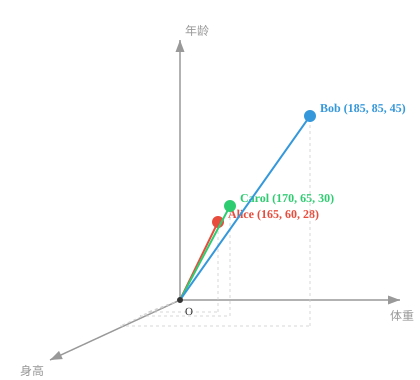
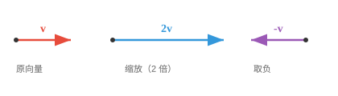
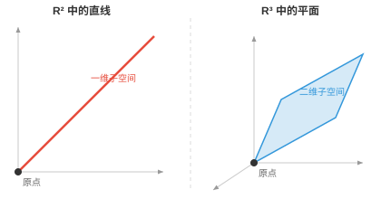

# 向量空间（Vector Spaces）

*向量空间是机器学习（ML）赖以展开的数学场域。本节介绍向量加法、标量乘法、封闭性公理、子空间，以及为什么 AI 中几乎所有对象都可以表示为向量。*

- 可以把向量空间理解为一种让数学对象活动的特殊场所，其中的每个对象都称为**向量（vector）**。

!!! note "大白话"
    向量空间就像一个专门给“箭头”或数字对象活动的场地；只要对象满足规定，就可以在里面做加法和缩放。

- 从形式上说，向量空间是一组可以相加、也可以按标量缩放，且运算结果始终不会离开该集合的向量。

!!! note "大白话"
    关键不是“能不能算”，而是算完以后结果还必须留在这个集合里，不能算着算着跑到场外。

- 一个很有用的反例是：整数集 $\mathbb{Z}$ 在实数域上**不是**向量空间。因为把 $3$ 乘以 $0.5$ 会得到 $1.5$，而它不属于整数集。定义中“不会离开该空间”这句话至关重要。

!!! note "大白话"
    整数乘上任意实数可能变成小数，所以整数集对实数缩放不封闭，不能算作实数向量空间。

- 在机器学习中，为了获得几何直觉，我们通常把向量看成欧几里得空间中的一个点，并用其坐标表示。

!!! note "大白话"
    学机器学习时，可以先把向量想成坐标系里的一个点，这样数字就有了“位置”和“方向”的直观含义。

- 向量 $\mathbf{a}$（数学上通常用加粗小写字母表示）有 $n$ 个坐标，每个坐标表示沿某条坐标轴的位置。

$$\mathbf{a} = [a_1, a_2, a_3]$$


!!! note "大白话"
    这个向量有 3 个数字，所以它告诉我们在 3 条坐标轴上分别走多远；有多少个坐标，就有多少个维度。

- 向量空间中的向量必须遵守一组严格且不可破坏的规则：

!!! note "大白话"
    下面这些规则就是“向量空间的使用说明书”。少一条，通常就不能叫向量空间。

    - **向量加法（组合）**：
    可以取任意两个向量并将它们组合成一个新向量。
    可以把向量想成移动指令。
    若向量 A 表示“向前走 3 步”，向量 B 表示“向右走 2 步”，
    那么相加（A + B）就得到一条新的指令：“向前走 3 步，再向右走 2 步”。

        !!! note "大白话"
            向量相加就是把两段“往哪里走、走多远”的指令合并起来，最后得到一段总指令。

    - **标量乘法（缩放）**：
    可以用一个普通数值，即“标量（scalar）”，缩放任意向量。
    它可以把向量拉长、缩短或反向。
    若向量 A 表示“向前走 3 步”，将其乘以 2 就变成“向前走 6 步”。
    乘以 -1 则会完全反向，变成“向后走 3 步”。

        !!! note "大白话"
            标量乘法只负责改变箭头的长度；乘负数时还会把箭头掉头。

- 向量空间的**维数（dimension）**是其中相互独立方向的数量。$\mathbb{R}^2$ 是二维的（需要 2 个坐标），上面的 $\mathbf{a}$ 则位于 $\mathbb{R}^3$ 中。

!!! note "大白话"
    维数就是描述一个位置需要几条互相独立的坐标轴：平面需要两条，立体空间需要三条。

- 例如，可以把一个人表示为向量，其中 $h_1$ = 身高（cm），$h_2$ = 体重（kg），$h_3$ = 年龄。

$$\mathbf{h} = [185, 75, 30]$$

!!! note "大白话"
    这里不是把“人”变成箭头，而是用一串数字记录这个人的特征；机器学习会把这串数字当作一个向量。

- 至此，我们已经构建出一个包含“人”这一向量表示的向量空间。

!!! note "大白话"
    只要规定好每个位置代表什么，就能把许多人的资料放进同一种数字坐标系统。

- 还可以表示多个人，并观察他们彼此有多接近或多遥远。



!!! note "大白话"
    如果两个人的特征数字相近，图上的点通常也会靠近；数字距离就能近似表示“特征相似度”。

- 我们还可以继续加入特征，形成对人的丰富表示；在机器学习中，这通常称为特征向量（feature vector）。

!!! note "大白话"
    特征向量就是“把一个对象翻译成数字后的档案”，加入更多有用特征，档案就更完整。

- 特征越独特、越有意义，特征向量的描述能力就越强。这一点很重要。

!!! note "大白话"
    不是数字越多越好；真正有区分度、能反映对象差异的特征才有价值。

- 超过三维后，向量会变得很难直接可视化，由此催生了**线性代数（Linear Algebra）**这一数学领域。

!!! note "大白话"
    三维以上很难画出来，所以我们依靠公式和规则来研究高维向量，而不是靠眼睛直接看。

- **线性代数**研究向量、向量空间以及向量之间的映射。

!!! note "大白话"
    线性代数研究的就是：这些数字对象怎样组合、怎样变形，以及变形前后有什么规律。

- 在 AI/ML 中，我们几乎把所有事物都表示成向量，因此线性代数是该领域的基石。

!!! note "大白话"
    图像、声音、文字和用户资料最后都可能变成数字向量，所以 AI 很多核心操作本质上都是线性代数。

- 从视觉上看，向量加法可以通过把一个向量的起点放到另一个向量的终点，然后从原点连到最终终点来完成。


!!! note "大白话"
    把第二个箭头接到第一个箭头的尾端，起点到最后终点的箭头就是总和；这叫“首尾相接”。

- 对两个向量 $\mathbf{a} = (a_1, a_2)$ 与 $\mathbf{b} = (b_1, b_2)$：$\mathbf{a} + \mathbf{b} = (a_1 + b_1, a_2 + b_2)$

!!! note "大白话"
    坐标按位置分别相加：第一维加第一维，第二维加第二维，不能交叉乱加。

- 向量同样可以相减，并且加法的全部规则依然成立。

!!! note "大白话"
    相减就是加上一个反方向的向量，因此可以把减法看成“加法的另一种写法”。

- 将向量乘以一个标量，会在相同方向上按该倍数缩放向量。



!!! note "大白话"
    乘以 2 就把每个坐标都扩大两倍，乘以 0.5 就缩短一半，乘以负数则反向。

- 对标量 $c$ 与向量 $\mathbf{v} = (v_1, v_2)$：$c\mathbf{v} = (cv_1, cv_2)$

!!! note "大白话"
    公式只是把“整体缩放”拆成逐个坐标缩放。

- **对加法封闭（Closure under Addition）**：向量空间中任意两个向量相加，结果仍是同一空间中的向量：若 $\mathbf{u} \in V$ 且 $\mathbf{v} \in V$，则 $\mathbf{u} + \mathbf{v} \in V$

!!! note "大白话"
    在这个空间里随便挑两个向量相加，结果仍然属于这个空间，不会跑出去。

- **对标量乘法封闭（Closure under Scalar Multiplication）**：向量空间中任意向量乘以标量，结果仍是同一空间中的向量：若 $\mathbf{v} \in V$ 且 $c \in F$，则 $c\mathbf{v} \in V$

!!! note "大白话"
    空间里的向量可以任意拉长、缩短或反向，做完以后仍在这个空间里。

- **加法交换律（Commutativity of Addition）**：对任意两个向量 $\mathbf{u}$ 和 $\mathbf{v}$：$\mathbf{u} + \mathbf{v} = \mathbf{v} + \mathbf{u}$


!!! note "大白话"
    先走 u 再走 v，和先走 v 再走 u，最后位置一样；改变顺序不会改变总位移。

- 穿过这个平行四边形的两条路径都会抵达同一点。

!!! note "大白话"
    平行四边形的两条“折线路径”终点重合，正是加法交换律的图形证据。

- **零向量（Zero Vector）**：存在一个向量 $\mathbf{0}$，使得对任意向量 $\mathbf{v}$：$\mathbf{v} + \mathbf{0} = \mathbf{v}$


!!! note "大白话"
    零向量相当于“什么都不移动”；加上它，原来的向量完全不变。

- **加法逆元（Additive Inverse）**：对每个向量 $\mathbf{v}$，都存在向量 $-\mathbf{v}$，使得：$\mathbf{v} + (-\mathbf{v}) = \mathbf{0}$


!!! note "大白话"
    每个箭头都有一个长度相同、方向相反的“撤销箭头”，两者合起来正好回到原点。

- **分配律 1（Distributivity 1）**：对任意标量 $c$ 以及向量 $\mathbf{u}$、$\mathbf{v}$：$c(\mathbf{u} + \mathbf{v}) = c\mathbf{u} + c\mathbf{v}$


!!! note "大白话"
    先把两支箭头合在一起再整体放大，和分别放大后再相加，结果完全一样。

- 缩放后的和（金色）与分别缩放后再求和，结果相同。

!!! note "大白话"
    这张图把分配律画出来了：两种计算顺序只是步骤不同，终点没有变。

- **分配律 2（Distributivity 2）**：对任意标量 $c$、$d$ 和向量 $\mathbf{v}$：$(c + d)\mathbf{v} = c\mathbf{v} + d\mathbf{v}$

!!! note "大白话"
    先把两个缩放倍数相加再乘向量，等于分别缩放后把两份结果相加。

- **结合律（Associativity）**：对任意标量 $c$、$d$ 和向量 $\mathbf{v}$：$(cd)\mathbf{v} = c(d\mathbf{v})$

!!! note "大白话"
    连续缩放时，先乘哪个倍数不重要，最终总缩放倍数都是 $cd$。

- **单位元（Identity Element）**：对任意向量 $\mathbf{v}$：$1\mathbf{v} = \mathbf{v}$，其中 $1$ 是标量域中乘法的单位元。

!!! note "大白话"
    乘以 1 就是“保持原样”，所以 1 是缩放运算里的不变按钮。

- 一些向量空间的例子：

!!! note "大白话"
    向量空间不只是一支画出来的箭头，任何满足“相加和缩放后仍留在集合中”的对象都可能是向量空间。

    - **$\mathbb{R}^n$（n 维空间）**：n 维空间中所有实数组成的集合，例如向量 [1,4,3000...第 n 项]。相加两个点或缩放一个点，结果仍会落在该空间中。

        !!! note "大白话"
            只要有 n 个实数，就得到 n 维空间里的一个点；对它做加法或缩放，仍然是 n 个实数。

    - **灰度图像（Grayscale images）**：一张 $28 \times 28$ 图像本质上就是 784 个像素强度，即 $\mathbb{R}^{784}$ 中的一个向量。将两张图像相加（混合）或缩放一张图像（调亮），仍得到相同尺寸的图像。

        !!! note "大白话"
            784 个像素就是 784 个数字；混合图片或调亮图片，本质上分别对应向量相加和向量缩放。

    - **音频信号（Audio signals）**：以 44.1kHz 采样的一秒音频片段是一个含有 44,100 个元素的向量。混合两段音频，本质上就是向量加法。

        !!! note "大白话"
            一秒声音被切成 44,100 个采样数字；把两段声音混在一起，就是把对应采样值相加。

    - **多项式（Polynomials）**：把两个多项式相加，或把多项式乘以一个数，仍会得到多项式，因此它们也构成向量空间。向量不一定非得长成箭头。

        !!! note "大白话"
            多项式也能“相加”和“整体乘一个数”，结果仍是多项式，所以向量可以是函数或多项式，不一定长得像箭头。

- **子空间（subspace）**只是大空间中的一个较小场所。可以把三维空间想成一个房间：穿过房间中心的一张平纸是一个子空间，穿过中心的一根直线也是。

!!! note "大白话"
    子空间就是大空间里一个更小、但仍能独立进行向量运算的区域；可以把它想成房间里的平面或直线。

- 关键要求是子空间必须经过原点。若将那张纸从中心平移开，它就不再是子空间，因为零向量已不在上面。

!!! note "大白话"
    子空间必须包含“什么都不走”的零向量，所以平面或直线一旦离开原点，就失去子空间资格。



!!! note "大白话"
    图中只有穿过原点的直线和平面符合要求；它们内部的向量相加或缩放后不会离开自己。

- 向量空间中的全部规则（加法、缩放、封闭性）在子空间内同样成立。可以在其中相加或缩放向量，而不会“掉进”更大的空间。

!!! note "大白话"
    子空间像大房间里的独立小房间：里面的运算可以自己完成，不需要跑到整个大空间里。

- 经过原点的一条直线是一维子空间，经过原点的一个平面是二维子空间，整个空间也是自身的一个子空间。

!!! note "大白话"
    子空间的维数取决于独立方向的数量：直线是 1 维，平面是 2 维，整个三维空间是 3 维。

- 在 ML 中，子空间会自然出现。高维数据常常具有位于低维子空间中的结构。PCA 等技术会找出这个子空间，使我们能够更高效地处理数据。

!!! note "大白话"
    数据表面上可能有很多维，但真正变化的方向往往很少；PCA 就是在寻找这些关键方向，以减少计算负担。

## 编程任务（使用 CoLab 或 notebook）

1. 运行代码验证分配律；然后修改代码并尝试检验其他规则。
```python
import jax.numpy as jnp

u = jnp.array([1, 2])
v = jnp.array([3, 0])
c = 2

lhs = c * (u + v)
rhs = c*u + c*v

print(f"LHS: {lhs}")
print(f"RHS: {rhs}")
```

2. 运行代码可视化不同向量，再修改不同坐标的值，理解每条坐标轴如何影响位置。
```python
import jax.numpy as jnp
import matplotlib.pyplot as plt

# Try changing these vectors!
a = jnp.array([3, 2, 4])
b = jnp.array([1, 4, 2])
c = jnp.array([4, 1, 3])

fig = plt.figure()
ax = fig.add_subplot(111, projection="3d")

for vec, name, color in [(a, "a", "red"), (b, "b", "blue"), (c, "c", "green")]:
    ax.quiver(0, 0, 0, *vec, color=color, arrow_length_ratio=0.1, linewidth=2, label=name)

lim = int(jnp.abs(jnp.stack([a, b, c])).max()) + 1
ax.set_xlim([0, lim]); ax.set_ylim([0, lim]); ax.set_zlim([0, lim])
ax.set_xlabel("X"); ax.set_ylabel("Y"); ax.set_zlabel("Z")
ax.legend()
plt.show()
```

## 延伸：一些需要认识的数学符号

| 符号 | 含义 | 示例 |
|---|---|---|
| ∈ | 是……的元素 | x ∈ A：x 属于集合 A |
| ∉ | 不是……的元素 | x ∉ A |
| ⊂ | 是真子集 | A ⊂ B |
| ⊆ | 是子集或相等 | A ⊆ B |
| ∪ | 并集 | A ∪ B：属于 A 或 B 的元素 |
| ∩ | 交集 | A ∩ B：同时属于 A 和 B 的元素 |
| ∅ | 空集 | A = ∅ |
| ℝ | 实数集 | x ∈ ℝ |
| ℤ | 整数集 | -2, -1, 0, 1, 2 |
| ℕ | 自然数集 | 1, 2, 3, ... |
| ℚ | 有理数集 | 如 1/2 的分数 |
| ⇒ | 蕴含 | x > 2 ⇒ x > 1 |
| ⇔ | 当且仅当 | x = 2 ⇔ x² = 4（还需附加条件） |
| ∀ | 对所有 | ∀x ∈ ℝ |
| ∃ | 存在 | 存在 x 使得 x² = 4 |
| ¬ | 非 | ¬P：非 P |
| ∧ | 且 | P ∧ Q |
| ∨ | 或 | P ∨ Q |
| ∴ | 因此 | x = 2，∴ x² = 4 |
