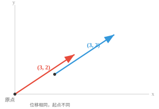
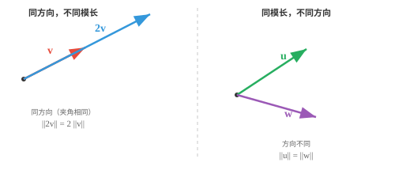
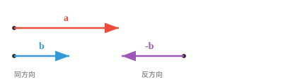
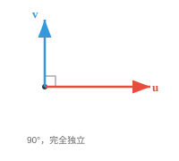

# 向量性质（Vector Properties）

*向量性质描述了向量如何表现的几何和代数特征。本节介绍模、方向、单位向量、相等、平行、正交和线性无关，它们是每个 ML 特征空间的基本构件。*

- 向量的**模（magnitude）**或长度告诉我们它延伸了多远。可以把它理解为箭头的长度。对向量 $\mathbf{a} = (a_1, a_2, a_3)$，其模为：

$$\|\mathbf{a}\| = \sqrt{a_1^2 + a_2^2 + a_3^2}$$

!!! note "大白话"
    模就是箭头的长度，也就是从原点走到这个点需要走的直线距离。

- 这就是将勾股定理推广到更高维：测量从原点到该点的直线距离。

!!! note "大白话"
    二维里的勾股定理没有失效，只是把更多坐标的平方也加进来了。

- 向量的**方向（direction）**告诉我们它指向哪里；只需想象一条从原点连向该坐标点的直线。

!!! note "大白话"
    方向回答的是“箭头朝哪儿”，不关心它到底有多长。

- 当原点没有被明确指定时，为了可视化，我们通常默认原点是中心点 $(0, 0, \ldots, 0)$。

!!! note "大白话"
    没有特别说明时，我们默认所有箭头都从坐标原点出发，这样比较方向才有统一参照。

- 位置本身并不重要，重要的是位移：从原点画出的 $(3, 2)$，与从其他点画出的同一个 $(3, 2)$，仍然是相等的向量。



!!! note "大白话"
    向量描述的是“移动多少、朝哪里移动”，不是箭头放在地图上的绝对位置；平移箭头不会改变向量。

- 两个向量可以长度相同但方向完全不同；也可以方向相同但长度不同。



!!! note "大白话"
    长度和方向是两件独立的事：箭头可以一样长但朝不同方向，也可以同向但一支更长。

- 当且仅当两个向量所有对应分量都相同时，它们才**相等（equal）**；也就是长度相同、方向相同，是完全同一支箭头。

$$\mathbf{a} = \mathbf{b} \iff a_i = b_i \text{ for all } i$$

!!! note "大白话"
    判断两个向量相不相等，最稳妥的方法是逐个比较坐标；每一项都一样，整个向量才一样。

- 若一个向量是另一个向量的标量倍数，则二者**平行（parallel）**。它们沿同一条直线，要么同向，要么方向正好相反。

$$\mathbf{a} \parallel \mathbf{b} \iff \mathbf{a} = k\mathbf{b} \text{ for some scalar } k \neq 0$$



!!! note "大白话"
    平行向量本质上是同一条直线方向上的不同长度版本；乘正数同向，乘负数就掉头。

- 若 $k > 0$，二者同向；若 $k < 0$，二者反向。无论如何，它们都位于经过原点的同一条直线上。

!!! note "大白话"
    倍数的正负只决定箭头朝向，绝对值决定箭头被放大还是缩小。

- 直观而言，平行向量不携带“新的”方向信息；其中一个只是另一个被拉伸或翻转后的版本。

!!! note "大白话"
    如果已经知道其中一支平行箭头，另一支没有提供新的方向，只是重复或反转了已有信息。

- 若两个向量指向完全独立的方向，则它们**正交（orthogonal）**或垂直。沿其中一个方向移动，不会在另一个方向上取得任何进展。



!!! note "大白话"
    正交就是成 90 度；沿一条路走，不会让你在另一条路的方向上前进。

- 可以把它想成先向北走，再向东走：这是两个正交方向。无论向北走多远，都不会使你向东移动。之后会经常遇到正交性。

!!! note "大白话"
    南北和东西互不“串台”，这就是正交的现实例子。

- 正交性是 ML 的核心概念：彼此正交的特征携带完全独立的信息，这非常适合构建表示。

!!! note "大白话"
    在机器学习里，正交特征可以理解为各说各的，尽量不重复表达同一件事。

- 更一般地，任意两个向量之间都有一个**夹角（angle）** $\theta$，取值范围为 $0°$ 到 $180°$。

!!! note "大白话"
    夹角把两个方向的关系量化成一个数字，范围从完全同向到完全反向。

- 这个角度刻画了两个方向之间的完整关系：$0°$ 表示平行且同向，$180°$ 表示平行且反向，$90°$ 表示正交；其余角度则介于这些情形之间。

!!! note "大白话"
    角度越小，方向越一致；角度为 90 度表示互不重合；超过 90 度则有相反倾向。

- ML 中大多数向量关系都落在这个连续范围内。后面会学习计算该角度的精确工具，即点积和余弦相似度。

!!! note "大白话"
    向量关系不是只有“像”或“不像”两档，而是一条连续光谱；点积和余弦相似度能把它算出来。

- 若一组向量中至少有一个能由其他向量经过缩放和相加构成，则它们**线性相关（linearly dependent）**。该向量没有为集合带来新的信息。

!!! note "大白话"
    线性相关表示集合里有重复信息：某支向量可以用其他向量拼出来，所以它不是新的方向。

- 例如，若 $\mathbf{c} = 2\mathbf{a} + 3\mathbf{b}$，那么 $\mathbf{c}$ 是冗余的，因为 $\mathbf{a}$ 和 $\mathbf{b}$ 已经包含了 $\mathbf{c}$ 所能提供的一切。

!!! note "大白话"
    c 只是 a 和 b 的“配方产物”，知道 a、b 后，c 没有额外信息。

- 平行向量一定线性相关，因为其中一个只是另一个的缩放副本。任何包含零向量的集合也必然线性相关。

!!! note "大白话"
    平行向量是最明显的重复；零向量也不提供方向，因此含有它的集合一定有冗余。

- 若没有任何一个向量能由其他向量构成，则这些向量**线性无关（linearly independent）**。每个向量都贡献了一个真正新的方向。正交向量一定线性无关。

!!! note "大白话"
    线性无关就是“谁也不能由别人拼出来”，每支向量都带来新的方向；正交向量天然满足这一点。

- 一个直观提醒：若要研究不同的人并将其表示为向量，线性相关的样本会让观测偏向被重复采样的数据点。设计 AI 训练数据集时必须注意这一点。

!!! note "大白话"
    训练数据里如果大量样本其实是重复信息，模型会误以为这种模式特别重要，数据多样性就会被高估。

- 在二维空间中，两个线性无关向量可以到达平面内的任意点；在三维空间中则需要三个。这种“需要多少个独立向量”的想法与维数直接相关。

!!! note "大白话"
    平面需要两条独立方向才能覆盖，立体空间需要三条；这正是“维数”在起作用。

- 当一个向量的大多数分量为零时，它是**稀疏的（sparse）**；反过来，大多数分量非零的向量称为**稠密的（dense）**。

$$\mathbf{s} = [0, 0, 3, 0, 0, 0, 1, 0, 0, 0]$$

!!! note "大白话"
    稀疏向量像一张大表里只有少数格子有内容；稠密向量则大多数格子都有数值。

- 稀疏性之所以重要，是因为它会影响存储和计算。只记录非零项，就能更高效地存储和处理稀疏向量。

!!! note "大白话"
    既然绝大多数位置是零，就没必要把零一遍遍存下来，只保存非零位置可以省空间和计算量。

- **单位向量（unit vector）**的模恰好为 1。它只表示方向，不带长度信息。任意向量都可以除以自身的模，变为单位向量：

$$\hat{\mathbf{a}} = \frac{\mathbf{a}}{\|\mathbf{a}\|}$$

!!! note "大白话"
    归一化相当于把每支箭头都调整成同样的长度 1，这样比较时只看方向，不让长度干扰。

- 这个过程称为**归一化（normalisation）**。它去除了“有多远”，只保留“朝哪里”，这在机器学习中非常重要。

!!! note "大白话"
    归一化就是“除以自己的长度”；方向不变，但所有向量被放到同一把长度尺上。

- 标准单位向量分别沿各个坐标轴：$\hat{\mathbf{i}} = (1, 0, 0)$、$\hat{\mathbf{j}} = (0, 1, 0)$、$\hat{\mathbf{k}} = (0, 0, 1)$。任何向量都可写成它们的组合，例如 $(3, 2, 4) = 3\hat{\mathbf{i}} + 2\hat{\mathbf{j}} + 4\hat{\mathbf{k}}$。

!!! note "大白话"
    标准单位向量就是各坐标轴的基本积木；任意三维向量都可以按三个坐标分别拿几块积木拼出来。

## 编程任务（使用 CoLab 或 notebook）

1. 计算一个向量的模，并验证它与勾股定理一致；再修改代码计算单位向量。
```python
import jax.numpy as jnp

a = jnp.array([3.0, 4.0])

magnitude = jnp.sqrt(jnp.sum(a ** 2))
print(f"Magnitude of a: {magnitude}") 
```

2. 通过检验一个向量是否为另一个向量的标量倍数，判断两个向量是否平行。
```python
import jax.numpy as jnp

a = jnp.array([2, 4, 6])
b = jnp.array([1, 2, 3])

ratios = a / b
print(f"Ratios: {ratios}")
print(f"Parallel: {jnp.allclose(ratios, ratios[0])}")
```
