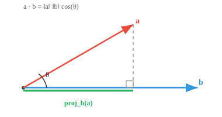

# 向量积（Vector Products）

*向量积是衡量相似性和计算投影的基本运算。本节介绍内积、点积、余弦相似度、叉积和外积；这些运算支撑着 AI 中的注意力机制、嵌入和几何推理。*

- 我们已经见过向量的加法和缩放。但两个向量能否相乘？答案是可以，而且不止一种方式；每种方式回答的问题都不同。

!!! note "大白话"
    向量相乘没有唯一答案：有的乘法用来比较方向，有的用来造出垂直方向，先要看你想解决什么问题。

- **内积（inner product）**是一个一般性概念：它接收两个向量，产生一个单独的数，即标量。它是向量“相乘”的抽象蓝图。

!!! note "大白话"
    内积像一类计算规则：输入两支箭头，最后只交出一个数字，用这个数字概括它们的关系。

- 任意内积都必须满足三条规则：

!!! note "大白话"
    这三条规则保证内积的行为稳定，能够可靠地表达长度和方向关系。

    - **正定性（Positive definiteness）**：$\langle \mathbf{v}, \mathbf{v} \rangle \geq 0$，且只有零向量时等于零。向量与自身相乘的结果始终非负。

        !!! note "大白话"
            向量和自己做内积像在量自己的大小，所以不可能得到负数；只有零向量才得到 0。

    - **对称性（Symmetry）**：$\langle \mathbf{u}, \mathbf{v} \rangle = \langle \mathbf{v}, \mathbf{u} \rangle$。顺序不影响结果。

        !!! note "大白话"
            用 u 比较 v，和用 v 比较 u，得到的关系分数相同。

    - **线性性（Linearity）**：$\langle a\mathbf{u} + b\mathbf{v}, \mathbf{w} \rangle = a\langle \mathbf{u}, \mathbf{w} \rangle + b\langle \mathbf{v}, \mathbf{w} \rangle$。内积对加法和缩放满足分配。

        !!! note "大白话"
            先把向量合成再比较，等于分别比较后按同样比例合并结果。

- **点积（dot product）**是最常见的内积，也是几乎处处都会使用的具体形式。对两个向量 $\mathbf{a} = (a_1, a_2, \ldots, a_n)$ 和 $\mathbf{b} = (b_1, b_2, \ldots, b_n)$：

$$\mathbf{a} \cdot \mathbf{b} = a_1 b_1 + a_2 b_2 + \cdots + a_n b_n$$

!!! note "大白话"
    点积就是对应位置先相乘、再全部相加，最终把两串数字压成一个数字。

- 将对应分量相乘，然后把所有结果加起来，仅此而已。

!!! note "大白话"
    算法很机械：不交叉配对，只处理同一维，然后把结果汇总。

- 但这个数究竟意味着什么？点积有一个优美的几何解释：

$$\mathbf{a} \cdot \mathbf{b} = \|\mathbf{a}\| \, \|\mathbf{b}\| \cos(\theta)$$



!!! note "大白话"
    点积会同时受长度和方向影响：两支又长又同向的箭头，点积大；相互垂直时，点积为 0。

- 这将点积直接关联到两个向量之间的夹角 $\theta$。结果告诉我们两个向量在方向上有多么“一致”。

!!! note "大白话"
    可以把点积看成“同向程度”的得分，只是长向量会让这个得分一起变大。

- 若二者同向（$\theta = 0°$），则 $\cos(\theta) = 1$，点积达到最大值。

!!! note "大白话"
    两支箭头完全同向时，彼此在对方方向上的贡献最多，所以点积最大。

- 若二者正交（$\theta = 90°$），则 $\cos(\theta) = 0$，点积恰好为零。这给出了检验正交性的精确方法。

!!! note "大白话"
    90 度意味着一支箭头在另一支方向上的“影子”为零，所以点积为 0。

- 若二者反向（$\theta = 180°$），则 $\cos(\theta) = -1$，点积为负。

!!! note "大白话"
    完全反向时，一支箭头在另一支方向上的投影带负号，因此点积为负。

- 向量与自身的点积等于其模的平方：$\mathbf{a} \cdot \mathbf{a} = \|\mathbf{a}\|^2$。

!!! note "大白话"
    自己和自己点乘时没有方向冲突，结果就是长度乘长度，也就是长度的平方。

- 点积还可以得到**投影（projection）**，即一个向量投在另一个向量上的影子。$\mathbf{a}$ 在 $\mathbf{b}$ 上的投影为：

$$\text{proj}_{\mathbf{b}}(\mathbf{a}) = \frac{\mathbf{a} \cdot \mathbf{b}}{\|\mathbf{b}\|^2} \, \mathbf{b}$$

!!! note "大白话"
    投影只保留 a 沿 b 这个方向的那一部分；公式先算有多少，再把这个量换回 b 方向的向量。

- 可以想象把光垂直照到 $\mathbf{b}$ 上，$\mathbf{a}$ 在那条直线上的影子就是投影。它表示 $\mathbf{a}$ 有多少成分位于 $\mathbf{b}$ 的方向上。

!!! note "大白话"
    投影像影子：不管 a 有多偏，只看它在 b 所在直线上的有效部分。

- **余弦相似度（cosine similarity）**将点积除以两个向量的模，从而完成归一化：

$$\cos(\theta) = \frac{\mathbf{a} \cdot \mathbf{b}}{\|\mathbf{a}\| \, \|\mathbf{b}\|}$$

!!! note "大白话"
    余弦相似度把长度影响除掉，只留下方向关系；同一个方向但长短不同，分数仍然是 1。

- 它给出 $-1$ 到 $1$ 之间的数值，只衡量方向对齐程度，忽略向量长度。在 ML 中，它广泛用于比较文档、嵌入和用户偏好等对象。

!!! note "大白话"
    余弦相似度适合比较“意思像不像”，而不是比较“数值总量谁更大”。

- 点积接收两个向量并返回标量；而**叉积（cross product）**相反，它接收两个向量并返回一个**新向量**。

!!! note "大白话"
    点积产出一个分数，叉积产出一支新箭头；两种乘法的结果类型就不同。

- 叉积 $\mathbf{a} \times \mathbf{b}$ 产生一个同时垂直于 $\mathbf{a}$ 和 $\mathbf{b}$ 的向量：

$$\mathbf{a} \times \mathbf{b} = (a_2 b_3 - a_3 b_2, \; a_3 b_1 - a_1 b_3, \; a_1 b_2 - a_2 b_1)$$

!!! note "大白话"
    叉积会找出一支同时垂直于原来两支箭头的新箭头，像从一个平面里竖起一根法线。

- 叉积只适用于三维空间。点积适用于任意维数，而叉积是三维空间特有的运算。

!!! note "大白话"
    不要把叉积当成通用向量乘法；本教材这里的叉积只在三维向量中定义。

- 其模等于两个向量张成的平行四边形面积：

$$\|\mathbf{a} \times \mathbf{b}\| = \|\mathbf{a}\| \, \|\mathbf{b}\| \sin(\theta)$$

!!! note "大白话"
    两支箭头越长、夹角越接近 90 度，它们撑开的平行四边形面积越大；平行时面积为 0。

- 注意其中的规律：点积使用 $\cos(\theta)$，叉积使用 $\sin(\theta)$。点积衡量两个向量方向有多一致，叉积衡量它们在方向上有多不同。

!!! note "大白话"
    点积关心“有没有朝同一边”，叉积关心“能不能撑开面积”；一个看一致，一个看差异。

- 结果向量的方向遵循**右手定则（right-hand rule）**：右手手指从 $\mathbf{a}$ 卷向 $\mathbf{b}$，拇指所指方向就是 $\mathbf{a} \times \mathbf{b}$ 的方向。

!!! note "大白话"
    右手定则只是约定叉积新箭头朝哪一侧，方便所有人得到同一个方向答案。

- 与点积不同，叉积**不满足交换律**：$\mathbf{a} \times \mathbf{b} = -(\mathbf{b} \times \mathbf{a})$。交换顺序会翻转结果方向。

!!! note "大白话"
    先后顺序不能换：a 叉 b 和 b 叉 a 长度一样，但箭头正好相反。

- 若两个向量平行，它们的叉积就是零向量（因为 $\sin(0°) = 0$）。没有面积，也没有垂直方向。

!!! note "大白话"
    两支平行箭头撑不开任何平面，就没有面积，也无法确定一支非零的垂直箭头。

- 如果同时使用两种积组合三个向量，会得到**三重积（triple products）**。

!!! note "大白话"
    三重积就是让三个向量一起参与运算，用来描述三维空间中的体积或组合关系。

- **标量三重积（scalar triple product）** $\mathbf{a} \cdot (\mathbf{b} \times \mathbf{c})$ 先计算两个向量的叉积，再与第三个向量点乘。输出是一个标量，等于这三个向量张成的平行六面体（倾斜的三维盒子）的体积。

!!! note "大白话"
    先用 b 和 c 撑出一个底面，再看 a 在垂直方向上有多高，底面积乘高度就是这个倾斜盒子的体积。

- 若标量三重积为零，三个向量**共面（coplanar）**，即它们都位于同一个平面内，无法张成体积。

!!! note "大白话"
    体积为 0 说明三支箭头没有真正撑开三维空间，全部压在同一张平面上。

- 循环置换顺序不会改变结果：$\mathbf{a} \cdot (\mathbf{b} \times \mathbf{c}) = \mathbf{b} \cdot (\mathbf{c} \times \mathbf{a}) = \mathbf{c} \cdot (\mathbf{a} \times \mathbf{b})$。

!!! note "大白话"
    按循环方式轮换三支向量，只是从不同边看同一个有向体积，数值不变。

- **向量三重积（vector triple product）** $\mathbf{a} \times (\mathbf{b} \times \mathbf{c})$ 两次使用叉积并返回向量。它可以利用以下恒等式简洁展开：

$$\mathbf{a} \times (\mathbf{b} \times \mathbf{c}) = (\mathbf{a} \cdot \mathbf{c})\mathbf{b} - (\mathbf{a} \cdot \mathbf{b})\mathbf{c}$$

!!! note "大白话"
    这个复杂的“叉积套叉积”最后可以改写成 b 和 c 的加权组合，计算时不用真的连做两次几何操作。

- 结果始终位于 $\mathbf{b}$ 和 $\mathbf{c}$ 张成的平面内。注意叉积**不满足结合律**：$\mathbf{a} \times (\mathbf{b} \times \mathbf{c}) \neq (\mathbf{a} \times \mathbf{b}) \times \mathbf{c}$。

!!! note "大白话"
    括号不能随便移动：叉积的计算分组不同，得到的向量通常也不同。

## 编程任务（使用 CoLab 或 notebook）

1. 计算两个向量的点积，并用它求二者夹角。尝试让它们正交、平行或反向，观察夹角如何变化。
```python
import jax.numpy as jnp

a = jnp.array([1.0, 2.0, 3.0])
b = jnp.array([4.0, -1.0, 2.0])

dot = jnp.dot(a, b)
angle = jnp.arccos(dot / (jnp.linalg.norm(a) * jnp.linalg.norm(b)))

print(f"Dot product: {dot}")
print(f"Angle: {jnp.degrees(angle):.1f}°")
```

2. 计算两个三维向量的叉积，并通过检验结果与两个原向量的点积都为零，验证结果同时垂直于二者。
```python
import jax.numpy as jnp

a = jnp.array([1.0, 0.0, 0.0])
b = jnp.array([0.0, 1.0, 0.0])

cross = jnp.cross(a, b)

print(f"a x b = {cross}")
print(f"Perpendicular to a: {jnp.dot(cross, a) == 0}")
print(f"Perpendicular to b: {jnp.dot(cross, b) == 0}")
```
