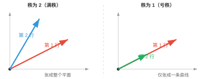
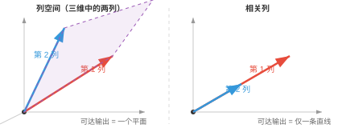
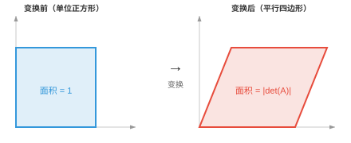
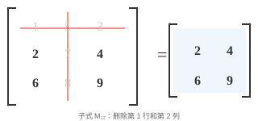

# 矩阵性质（Matrix Properties）

*矩阵是存储数据集、编码变换并定义每个神经网络层的数据结构。本节介绍矩阵的维度、元素、转置、迹、行列式、逆、秩和零空间，这些性质贯穿线性代数和机器学习。*

- 从本质上说，**矩阵（matrix）**是按行和列排列的矩形数值网格。若向量是一列数，那么矩阵就是由多个向量堆叠而成的结构。

```math
A = \begin{bmatrix} 1 & 2 & 3 \\ 4 & 5 & 6 \end{bmatrix}
```

!!! note "大白话"
    矩阵就是把很多相关数字排成表格；一行或一列可以看成一个向量，整张表把它们组织在一起。

- 如果一个人由向量 $[\text{age}, \text{height}, \text{weight}]$ 描述，那么三个人就构成一个矩阵，其中每一行代表一个人：

```math
\begin{bmatrix} 25 & 170 & 65 \\ 30 & 180 & 80 \\ 22 & 160 & 55 \end{bmatrix}
```

!!! note "大白话"
    每一行是一位人的完整资料，每一列都在比较所有人的同一种特征。

- 这个矩阵有 3 行、3 列，因此称为 $3 \times 3$ 矩阵。

!!! note "大白话"
    矩阵尺寸永远先报行数，再报列数；$3 \times 3$ 就是三行三列的方格表。

- 网格中的每个数称为一个**元素（element）**或**条目（entry）**，由其行和列标识：$A_{ij}$ 表示第 $i$ 行、第 $j$ 列的元素。

!!! note "大白话"
    $A_{ij}$ 像表格坐标：先找到第 i 行，再找到第 j 列，就能定位那个数字。

- 矩阵的**转置（transpose）**是沿对角线翻转矩阵，将行变为列、列变为行。若 $A$ 是 $m \times n$ 矩阵，则 $A^T$ 是 $n \times m$ 矩阵。

```math
A = \begin{bmatrix} 1 & 2 & 3 \\ 4 & 5 & 6 \end{bmatrix} \quad \Rightarrow \quad A^T = \begin{bmatrix} 1 & 4 \\ 2 & 5 \\ 3 & 6 \end{bmatrix}
```

!!! note "大白话"
    转置相当于沿主对角线把表格翻一下：原来的横排变竖排，竖排变横排。

- 矩阵与其转置相乘总会得到方阵：$AA^T$ 是 $m \times m$ 矩阵，$A^TA$ 是 $n \times n$ 矩阵。

!!! note "大白话"
    原矩阵无论是“高表格”还是“宽表格”，和转置配对相乘后，结果都会变成行数或列数相等的方阵。

- 方阵的**迹（trace）**是其对角线元素之和：$\text{tr}(A) = A_{11} + A_{22} + \cdots + A_{nn}$。迹等于特征值之和，后面会学到特征值。


!!! note "大白话"
    迹只把从左上到右下那条主对角线上的数字相加，其他位置一律不管。

- 对上面的矩阵，$\text{tr}(A) = 1 + 4 + 9 = 14$。只有高亮的对角线元素相关。

!!! note "大白话"
    算迹时像只读表格的对角线，旁边的数字再大也不会影响结果。

- 若两个矩阵在不同基下表示同一个线性变换，它们的迹相同。迹与所选基无关。

!!! note "大白话"
    换一套坐标轴会改变矩阵写法，但不会改变迹；迹抓住的是变换本身的一个不变量。

- 矩阵的**秩（rank）**是线性无关行的数量，等价地也是线性无关列的数量。它告诉我们矩阵携带了多少“有用信息”。

!!! note "大白话"
    秩就是表格里真正独立的信息方向有几条；重复行或重复列不会让秩增加。

- 例如，下列矩阵的秩为 2，因为两行互不为对方的倍数：

```math
\begin{bmatrix} 1 & 2 \\ 3 & 4 \end{bmatrix}
```

但下列矩阵的秩为 1，因为第二行恰好是第一行的两倍，没有增加任何新信息：

```math
\begin{bmatrix} 1 & 2 \\ 2 & 4 \end{bmatrix}
```

!!! note "大白话"
    第二个例子的第二行只是第一行放大两倍，因此看似有两行，实际只提供一条独立方向。

- 一个 $5 \times 3$ 矩阵的秩最多为 3。若一些行只是其他行的缩放或组合，秩会下降。具有最大可能秩的矩阵称为**满秩（full rank）**矩阵。



!!! note "大白话"
    矩阵最多能有多少独立方向，受较短的那一边限制；满秩就是把这个上限用满。

- 方阵当且仅当满秩时可逆，即存在逆矩阵。

!!! note "大白话"
    方阵没有丢失任何方向的信息时，才可以把变换完整倒回去。

- 秩通过**秩-零度定理（rank-nullity theorem）**与**零空间（null space）**相连。零空间是矩阵映射为零的向量集合：$\text{rank}(A) + \text{nullity}(A) = \text{number of columns of } A$。矩阵保留的维度（秩）加上它消除的维度（零度），等于总维度。

!!! note "大白话"
    输入空间的每个方向要么被保留下来形成输出，要么被压成零；两类方向数加起来就是输入总维数。

- 矩阵的**列空间（column space）**是该矩阵乘以任意向量时所有可能输出的集合，它由矩阵的列张成。若一个矩阵有 3 列，但只有 2 列独立，那么它的列空间是二维平面，而不是整个三维空间。



!!! note "大白话"
    列空间列出矩阵“做得出的所有输出”；独立列越多，矩阵能到达的方向越多。

- **行空间（row space）**是从行的角度表述同一个概念。秩同时等于列空间和行空间的维数，因此它们始终一致。

!!! note "大白话"
    从行看还是从列看，独立信息数量不会变，所以两种空间的维数都等于秩。

- 列空间回答“这个矩阵能产生什么输出？”，零空间回答“哪些输入会被映射为零？”。这两个空间完整地描述了矩阵的作用。

!!! note "大白话"
    一个看矩阵能把输入送到哪里，一个看哪些输入会被完全消掉；合起来就知道这个矩阵保留和丢掉了什么。

- 方阵的**行列式（determinant）**是一个刻画矩阵如何缩放空间的标量。把 $2 \times 2$ 矩阵看成把单位正方形变换为平行四边形，行列式就是该平行四边形带符号的面积。

```math
\det\begin{bmatrix} a & b \\ c & d \end{bmatrix} = ad - bc
```



!!! note "大白话"
    行列式可以先理解成面积或体积被放大多少倍，同时还记录图形有没有翻面。

- 例如：

```math
\det\begin{bmatrix} 2 & 1 \\ 0 & 3 \end{bmatrix} = 2 \cdot 3 - 1 \cdot 0 = 6
```

该变换会把单位正方形拉伸成面积为 6 的平行四边形。

!!! note "大白话"
    行列式为 6 不表示每条边都放大 6 倍，而是表示整体面积变成原来的 6 倍。

- 若行列式为正，变换保持方向，即图形不会“翻面”；若为负，方向会翻转，如镜面反射；若为零，矩阵会将空间压扁到低维，把平行四边形塌缩成一条线或一个点。

!!! note "大白话"
    正负号告诉你有没有翻面，绝对值告诉你缩放倍数；变成 0 则说明整个平面被压扁了。

- 行列式为零的矩阵称为**奇异矩阵（singular）**。它没有逆，且已经永久丢失了信息。

!!! note "大白话"
    一旦两个不同输入被压到同一个输出，就无法再判断原来是谁，这就是奇异矩阵不能求逆的原因。

- 对大于 $2 \times 2$ 的矩阵，行列式使用**子式（minor）**和**余子式（cofactor）**计算。**子式** $M_{ij}$ 是删除第 $i$ 行和第 $j$ 列后所得较小矩阵的行列式。



!!! note "大白话"
    算较大矩阵的行列式时，子式就是临时删掉一行一列后留下的小矩阵，方便把大问题拆小。

- **余子式** $C_{ij} = (-1)^{i+j} M_{ij}$ 给每个子式附加一个符号，像棋盘格一样交替：$+, -, +, \ldots$。完整矩阵的行列式可沿任意一行或一列求和：$\det(A) = \sum_j A_{1j} \cdot C_{1j}$。这称为**按余子式展开（cofactor expansion）**。

!!! note "大白话"
    余子式是在每个小行列式前补上正负号；沿一行或一列逐项相加，就能递归算出大矩阵的行列式。

- 方阵 $A$ 的**逆（inverse）**记作 $A^{-1}$，它会撤销 $A$ 的作用：$AA^{-1} = A^{-1}A = I$，其中 $I$ 是单位矩阵。只有非奇异矩阵才有逆。

!!! note "大白话"
    逆矩阵就像“撤销键”：先做 A 再做 $A^{-1}$，会回到原来的向量。

- 对 $2 \times 2$ 矩阵，逆有直接公式：

```math
\begin{bmatrix} a & b \\ c & d \end{bmatrix}^{-1} = \frac{1}{ad - bc}\begin{bmatrix} d & -b \\ -c & a \end{bmatrix}
```

注意分母中的行列式，这也解释了为什么奇异矩阵的行列式为零时没有逆。

!!! note "大白话"
    二维逆矩阵公式必须除以行列式；行列式为 0 时会除以 0，所以根本无法定义逆。

- **条件数（condition number）**衡量矩阵对输入微小变化的敏感程度，定义为 $\kappa(A) = \|A\| \cdot \|A^{-1}\|$。

!!! note "大白话"
    条件数是在问：输入只错一点点时，输出会不会被这个矩阵放大成很大的错误。

- 条件数接近 1 表示矩阵**条件良好（well-conditioned）**：小的输入变化只导致小的输出变化。条件数很大表示矩阵**病态（ill-conditioned）**：极小误差会被极大放大。正交矩阵和单位矩阵的条件数为 1，奇异矩阵的条件数为无穷大。

!!! note "大白话"
    条件数小的矩阵比较可靠；条件数很大的矩阵像一把会把测量误差放大的放大镜，计算结果不稳定。

- 例如，下列矩阵的条件数为 $10^8$。一个方向按正常比例缩放，另一个方向几乎被压缩为零，因此沿该方向的微小扰动会被严重扭曲：

```math
\begin{bmatrix} 1 & 0 \\ 0 & 10^{-8} \end{bmatrix}
```

!!! note "大白话"
    这个矩阵把一个方向几乎压没，之后想把它还原时，哪怕极小噪声也会被放大得很明显。

- 如同向量有表示长度的范数，矩阵也有衡量其“大小”的**范数（norm）**。最常用的是**弗罗贝尼乌斯范数（Frobenius norm）**，它把矩阵视作一个长向量并计算其长度：

```math
\|A\|_F = \sqrt{\sum_{i}\sum_{j} A_{ij}^2}
```

!!! note "大白话"
    弗罗贝尼乌斯范数就是把矩阵所有格子的数平方、相加、开根号，当作整张表的总长度。

- 例如：

```math
\left\|\begin{bmatrix} 1 & 2 \\ 3 & 4 \end{bmatrix}\right\|_F = \sqrt{1 + 4 + 9 + 16} = \sqrt{30} \approx 5.48
```

!!! note "大白话"
    算法和向量长度完全一样，只是矩阵的每一个格子都算作一个坐标。

- **谱范数（spectral norm）** $\|A\|_2$ 是 $A$ 的最大奇异值。它衡量矩阵对任一单位向量所能施加的最大拉伸量。在 ML 中，矩阵范数用于权重正则化，即惩罚过大的权重，也用于监控训练稳定性。

!!! note "大白话"
    谱范数只关心矩阵最能拉长哪个方向；它能防止模型某个方向的权重变得过大而失稳。

- 对称矩阵 $A$ 若对每个非零向量 $\mathbf{x}$ 都满足 $\mathbf{x}^T A \mathbf{x} > 0$，则称为**正定（positive definite）**。这个二次型总会产生正数。

!!! note "大白话"
    正定矩阵像一个任何方向都向上弯的碗：只要离开原点，二次型就严格为正。

- 例如，下列矩阵是正定的：

```math
A = \begin{bmatrix} 2 & 1 \\ 1 & 3 \end{bmatrix}
```

取任意向量，例如 $\mathbf{x} = [1, -1]^T$：$\mathbf{x}^T A \mathbf{x} = 2 - 1 - 1 + 3 = 3 > 0$。无论尝试哪个非零 $\mathbf{x}$，都会得到正值。

!!! note "大白话"
    这个例子表明不论从哪个非零方向试，矩阵给出的“能量”都大于零。

- 正定矩阵很重要，因为它们能保证优化问题存在唯一最小值。

!!! note "大白话"
    碗底只有一个最低点，优化算法就不会在多个同样低的位置之间犹豫。

- 若将条件放宽为 $\mathbf{x}^T A \mathbf{x} \geq 0$，允许结果为零，则该矩阵是**半正定（positive semi-definite，PSD）**的。PSD 矩阵极为常见：协方差矩阵、SVM 中的核矩阵和局部最小值处的 Hessian 都是 PSD。与正定的区别在于，PSD 允许某些方向是“平坦的”，即曲率为零，而不必严格向上弯曲。

!!! note "大白话"
    半正定仍不会向下弯，但允许有完全平的方向；这些方向既不增加也不减少二次型。

## 编程任务（使用 CoLab 或 notebook）

1. 计算一个矩阵的迹、秩和行列式。尝试让一行成为另一行的倍数，观察秩和行列式如何变化。
```python
import jax.numpy as jnp

A = jnp.array([[1.0, 2.0],
               [3.0, 4.0]])

print(f"Trace: {jnp.trace(A)}")
print(f"Rank: {jnp.linalg.matrix_rank(A)}")
print(f"Determinant: {jnp.linalg.det(A):.2f}")
```

2. 计算一个矩阵的逆，将其与原矩阵相乘，并验证得到单位矩阵。然后尝试奇异矩阵，观察会发生什么。
```python
import jax.numpy as jnp

A = jnp.array([[1.0, 2.0],
               [3.0, 4.0]])

A_inv = jnp.linalg.inv(A)
print(f"A * A_inv:\n{A @ A_inv}")
```
