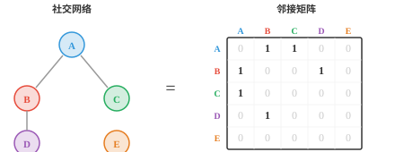

# 矩阵类型（Matrix Types）

*特殊的矩阵结构能带来计算捷径和数学保证。本节介绍单位矩阵、对角矩阵、对称矩阵、三角矩阵、正交矩阵、稀疏矩阵和随机矩阵等类型；它们会出现在协方差估计、图算法、正则化和马尔可夫链中。*

- 并非所有矩阵都相同。不同结构赋予矩阵特殊性质，使它们计算更快、推理更容易，或者兼具两者。下面是最常遇到的类型。

- **方阵（square matrix）**的行数和列数相同，即 $n \times n$。大多数重要性质，如行列式、特征值和逆，只适用于方阵。

- **单位矩阵（identity matrix）** $I$ 是主对角线全为 1、其他位置全为 0 的方阵。它是“不做任何事”的变换：对任意维度兼容的矩阵 $A$，都有 $AI = IA = A$。

```math
I = \begin{bmatrix} 1 & 0 & 0 \\ 0 & 1 & 0 \\ 0 & 0 & 1 \end{bmatrix}
```

- **零矩阵（zero matrix）** $O$ 的所有元素都为零。它将每个向量映射为零向量，摧毁所有信息。

- **对角矩阵（diagonal matrix）**除主对角线外全为零。用对角矩阵乘向量，只会独立缩放各个分量，因此计算非常高效。

```math
D = \begin{bmatrix} 3 & 0 \\ 0 & 7 \end{bmatrix}
```

- **对称矩阵（symmetric matrix）**等于自身的转置：$A = A^T$，即 $A_{ij} = A_{ji}$。对称矩阵有一个特殊性质：其特征向量总是彼此垂直。协方差矩阵一定是对称矩阵。

```math
S = \begin{bmatrix} 3 & -1 \\ -1 & 6 \end{bmatrix}
```

- **三角矩阵（triangular matrix）**在对角线的一侧全为零。**下三角矩阵（lower triangular）**在对角线上方为零，**上三角矩阵（upper triangular）**在对角线下方为零。它们可通过前代或回代高效求解方程组，因此很重要。

```math
L = \begin{bmatrix} 2 & 0 & 0 \\ 1 & 3 & 0 \\ -1 & 2 & 4 \end{bmatrix} \qquad U = \begin{bmatrix} 5 & -1 & 2 \\ 0 & 1 & 3 \\ 0 & 0 & -2 \end{bmatrix}
```

- 三角矩阵的行列式就是其对角线元素的乘积。

- **正交矩阵（orthogonal matrix）**满足其转置等于逆：$Q^TQ = QQ^T = I$。

- 这表示只需转置就能“撤销”该变换，计算代价很低。它的各列构成标准正交组，即长度为 1 且两两垂直。

- **稀疏矩阵（sparse matrix）**的大多数元素为零；而**稠密矩阵（dense matrix）**的大多数元素非零。


- 实践中，许多真实世界的矩阵都极其稀疏。

- 一个拥有一百万用户的社交网络可以表示为 $10^6 \times 10^6$ 矩阵，但每个人只与少数其他人相连，因此几乎所有条目都是零。



- **置换矩阵（permutation matrix）**由重新排列单位矩阵的行得到。用它相乘会打乱向量元素的顺序。每一行和每一列都恰有一个 1，其余全为 0。

- 例如，下列矩阵会把元素 3 移到位置 1，把元素 1 移到位置 2，把元素 2 移到位置 3：

```math
P = \begin{bmatrix} 0 & 0 & 1 \\ 1 & 0 & 0 \\ 0 & 1 & 0 \end{bmatrix}
```

- **Toeplitz 矩阵**在每条对角线，即从左上到右下的方向上，具有相同值。注意每条对角线都是常数：

```math
T = \begin{bmatrix} a & b & c \\ d & a & b \\ e & d & a \end{bmatrix}
```

- 这种结构会出现在信号处理和卷积中，因为让固定滤波器在信号上滑动，等价于乘以一个 Toeplitz 矩阵。

- **循环矩阵（circulant matrix）**是一类特殊 Toeplitz 矩阵，其每一行都是上一行的循环移位。元素移到行末后会回绕到开头：

```math
C = \begin{bmatrix} 1 & 3 & 2 \\ 2 & 1 & 3 \\ 3 & 2 & 1 \end{bmatrix}
```

- 循环矩阵与离散傅里叶变换（DFT）紧密相关，是循环卷积工作方式的核心。

- **Hermitian 矩阵**是对称矩阵在复数域上的对应物：$A = A^\ast$，其中 $A^\ast$ 是共轭转置。

- 对实值矩阵来说，Hermitian 与对称是同一回事。在量子计算和信号处理中会遇到它们。

- **酉矩阵（unitary matrix）**是正交矩阵在复数域上的对应物：$U^\ast U = UU^\ast = I$。正交矩阵在实空间中保持长度，酉矩阵在复空间中保持长度。

- **幂等矩阵（idempotent matrix）**满足 $A^2 = A$。应用两次变换与应用一次相同，因此它表示一个**投影（projection）**。一旦完成投影，再投影不会改变任何结果。

- **幂零矩阵（nilpotent matrix）**满足对某个幂次 $k$ 有 $A^k = O$，其中 $O$ 是零矩阵。将该变换应用足够多次，所有内容都会塌缩为零。例如：

```math
\begin{bmatrix} 0 & 1 \\ 0 & 0 \end{bmatrix}^2 = \begin{bmatrix} 0 & 0 \\ 0 & 0 \end{bmatrix}
```

- **布尔矩阵（Boolean matrix）**或二元矩阵只包含 0 和 1，表示是/否关系。例如，在有 3 个节点的图中，**邻接矩阵（adjacency matrix）**记录哪些节点相连：

```math
B = \begin{bmatrix} 0 & 1 & 1 \\ 1 & 0 & 0 \\ 1 & 0 & 0 \end{bmatrix}
```

- 这里节点 1 与节点 2、3 相连，但节点 2 与节点 3 彼此不相连。

- **范德蒙德矩阵（Vandermonde matrix）**由一组数值的连续幂构成。给定 $x_1, x_2, x_3$：

```math
V = \begin{bmatrix} 1 & x_1 & x_1^2 \\ 1 & x_2 & x_2^2 \\ 1 & x_3 & x_3^2 \end{bmatrix}
```

- 这种结构会出现在多项式插值中：寻找唯一穿过给定点集的多项式。

- **Hessenberg 矩阵**“几乎”是三角矩阵，其第一条次对角线以下全为零：

```math
H = \begin{bmatrix} 4 & 2 & 1 \\ 3 & 5 & -1 \\ 0 & 1 & 6 \end{bmatrix}
```

- 它是高效计算特征值的有用中间形式。先将矩阵化为 Hessenberg 形式，会使迭代算法更快收敛。

## 编程任务（使用 CoLab 或 notebook）

1. 创建一个正交矩阵，即旋转矩阵，将其与转置相乘，验证得到单位矩阵。尝试不同角度。
```python
import jax.numpy as jnp

theta = jnp.pi / 4
Q = jnp.array([[jnp.cos(theta), -jnp.sin(theta)],
               [jnp.sin(theta),  jnp.cos(theta)]])

print(f"Q @ Q.T:\n{Q @ Q.T}")
print(f"Determinant: {jnp.linalg.det(Q):.2f}")
```

2. 创建一个对称矩阵并验证它等于自身转置。然后计算其特征值，并检查特征向量是否彼此垂直。
```python
import jax.numpy as jnp

S = jnp.array([[4.0, 2.0],
               [2.0, 3.0]])

print(f"Symmetric: {jnp.allclose(S, S.T)}")

eigenvalues, eigenvectors = jnp.linalg.eigh(S)
print(f"Eigenvalues: {eigenvalues}")
print(f"Dot product of eigenvectors: {jnp.dot(eigenvectors[:, 0], eigenvectors[:, 1]):.6f}")
```
