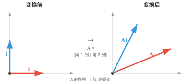
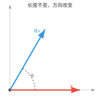
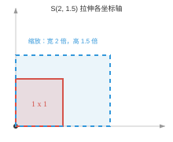
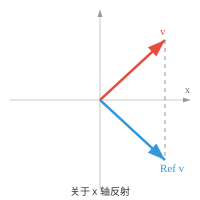
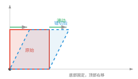

# 线性变换（Linear Transformations）

*每一次矩阵乘法都是线性变换：它在保持线性的同时重塑、旋转或投影向量。本节介绍旋转、反射、缩放、错切、投影、映射的核与像，以及神经网络层如何串联这些变换。*

- **线性变换（linear transformation）**或线性映射，是一个接收向量并产生另一个向量，同时保持加法和缩放关系的函数。若 $T$ 线性，则：

!!! note "大白话"
    线性变换可以改变方向和长度，但必须老实遵守“先相加再变换”等于“分别变换再相加”。

    - $T(\mathbf{u} + \mathbf{v}) = T(\mathbf{u}) + T(\mathbf{v})$

        !!! note "大白话"
            把两支向量合起来处理，和分别处理后再合起来，结果一样。
    - $T(c\mathbf{u}) = cT(\mathbf{u})$

        !!! note "大白话"
            向量放大几倍，变换后的结果也会按同样倍数放大。

- 每个线性变换都可以表示为与矩阵相乘。矩阵**就是**变换。将向量乘以矩阵，就是对该向量施加线性变换。

!!! note "大白话"
    矩阵不是一张静态数字表，它本质上是一台把输入向量加工成输出向量的机器。

- 可以将一个 $2 \times 2$ 矩阵视为机器：它输入二维向量，输出新的二维向量。矩阵的各列告诉你，标准基向量 $\hat{\mathbf{i}}$ 和 $\hat{\mathbf{j}}$ 经变换后落在哪里。其余一切都由线性性推出。



!!! note "大白话"
    只要知道单位 x 轴、y 轴经过矩阵后落在哪里，就能推算任何二维向量的去向。

- 例如，若

```math
A = \begin{bmatrix} 2 & 1 \\ 1 & 2 \end{bmatrix}
```

  那么 $\hat{\mathbf{i}} = [1, 0]^T$ 会落到 $[2, 1]^T$，即第 1 列；$\hat{\mathbf{j}} = [0, 1]^T$ 会落到 $[1, 2]^T$，即第 2 列。其他任意向量都由这两个向量组合而成，因此其输出会自动确定。

!!! note "大白话"
    矩阵的每一列就是对应基向量的新坐标；其他向量只是这些列按不同系数混合出来的结果。

- 两个矩阵相乘可理解为连续施加两个变换。若 $B$ 先变换向量，$A$ 再变换其结果，那么 $AB$ 依次完成两者。在游戏引擎中，先旋转角色再让其前进，与先前进再旋转的结果不同；这正是矩阵乘法不满足交换律的原因。

!!! note "大白话"
    矩阵乘法的右边先执行，左边后执行；动作顺序不同，最终位置通常就不同。

- **旋转（rotation）**会让向量绕某个角度 $\theta$ 转动，而不改变其长度。向量大小不变，只是指向新的方向。



!!! note "大白话"
    旋转只是把箭头转过去，不拉长也不压短，所以长度保持不变。

- 在二维中，旋转矩阵为：

```math
R(\theta) = \begin{bmatrix} \cos\theta & -\sin\theta \\ \sin\theta & \cos\theta \end{bmatrix}
```

!!! note "大白话"
    这张矩阵把任意二维坐标按角度 $\theta$ 绕原点旋转。

- 对 $\theta = 90°$：

```math
R = \begin{bmatrix} 0 & -1 \\ 1 & 0 \end{bmatrix}
```

  因此 $[1, 0]^T$ 会变为 $[0, 1]^T$。原本向右的向量变为向上。旋转矩阵是正交矩阵，且行列式始终为 1。你在手机上旋转照片时，正是将该矩阵应用于每个像素坐标。

!!! note "大白话"
    90 度旋转把向右变向上；照片旋转也是把每个像素的位置按同样规则转过去。

- 在三维中，每根坐标轴都有独立的旋转矩阵。机器人手臂的每个关节都绕特定轴旋转，每个关节就是一个旋转矩阵。绕 z 轴旋转相当于把二维情形嵌入三维：

```math
R_z(\theta) = \begin{bmatrix} \cos\theta & -\sin\theta & 0 \\ \sin\theta & \cos\theta & 0 \\ 0 & 0 & 1 \end{bmatrix}
```

!!! note "大白话"
    绕 z 轴旋转时，x、y 平面里的点转动，z 坐标保持不变。

- **缩放（scaling）**沿每根坐标轴独立地拉伸或缩小向量：

```math
S(s_x, s_y) = \begin{bmatrix} s_x & 0 \\ 0 & s_y \end{bmatrix}
```

!!! note "大白话"
    缩放矩阵给每条坐标轴单独设倍率，因此可以横向和纵向拉伸得不一样。



!!! note "大白话"
    对角线上的数字分别控制横向、纵向的缩放，非对角线为零表示两条轴不互相影响。

- $S(2, 1.5)$ 将 x 分量加倍，将 y 分量乘以 1.5。沿某轴乘以 $-1$ 会翻转该分量。对角矩阵始终是一种缩放变换。把图像缩小到 50% 时，就是对每个像素坐标应用 $S(0.5, 0.5)$。

!!! note "大白话"
    正倍率只拉伸或缩小，负倍率会顺便翻到坐标轴另一侧；统一乘 0.5 就是等比例缩小。

- **反射（reflection）**像镜子一样沿某条轴或直线翻转向量。关于 x 轴反射会保留 x 分量，并对 y 分量取负：

```math
\text{Ref}_x = \begin{bmatrix} 1 & 0 \\ 0 & -1 \end{bmatrix}
```

!!! note "大白话"
    关于 x 轴反射时，左右不动，上下颠倒，所以只把 y 坐标变号。



- 例如，$[3, 2]^T$ 会变为 $[3, -2]^T$。手机水平翻转自拍照以使文字显示正确时，就是在应用反射矩阵。关于直线 $y = x$ 反射会交换两个分量：

```math
\text{Ref}_{y=x} = \begin{bmatrix} 0 & 1 \\ 1 & 0 \end{bmatrix}
```

!!! note "大白话"
    关于 $y=x$ 反射就是把横坐标和纵坐标交换，像沿对角线照镜子。

- 反射矩阵的行列式为 $-1$，这确认了它会翻转方向。

!!! note "大白话"
    行列式为负表示图形的朝向被翻面，这是反射和旋转的关键区别。

- 旋转和反射都是**刚体变换（rigid transformations）**：它们保持距离和角度。表示它们的矩阵是正交矩阵，因此正交矩阵的行列式总是 $+1$，表示旋转，或 $-1$，表示反射。

!!! note "大白话"
    刚体变换只改变位置或朝向，不把图形拉伸变形；尺子量出来的长度和夹角都不变。

- **错切（shearing）**会按另一坐标轴的大小，让向量沿一条坐标轴倾斜。系数为 $k$ 的水平错切为：

```math
\text{Sh}_x(k) = \begin{bmatrix} 1 & k \\ 0 & 1 \end{bmatrix}
```

!!! note "大白话"
    水平错切让每个点按自身高度向左右滑动，越高的点滑得越远。



!!! note "大白话"
    错切把正方形推成平行四边形，底边不动，顶边横向滑开。

- 每个点都在水平方向上移动 $k$ 倍的自身高度。若 $k = 0.5$，高度为 2 的点会右移 1。底行不动，顶行滑动。这就是斜体字的工作原理：直立字母经过错切后向右倾斜。

!!! note "大白话"
    错切不是旋转，水平线仍水平；它像把纸的上边往旁边推，斜体字就是这种效果。

- 上述旋转、缩放、反射和错切都是**线性**变换。它们固定原点，并保持直线。但**平移（translation）**，即将所有对象移动固定距离，如何处理？

!!! note "大白话"
    线性变换必须让原点留在原点；平移会把原点搬走，所以它不属于线性变换。

- 平移**不是**线性变换，因为它移动了原点。若将每个点向右平移 3，零向量会移动到 $[3, 0]^T$，破坏线性。为处理平移，需要使用结合线性变换和平移的**仿射变换（affine transformation）**：

$$\mathbf{y} = A\mathbf{x} + \mathbf{t}$$

!!! note "大白话"
    仿射变换先做线性变形，再加上固定的位移 $\mathbf{t}$，因此能同时处理旋转、缩放和移动。

- 为把它表示为一次矩阵乘法，需要使用**齐次坐标（homogeneous coordinates）**：给每个向量添加一个额外的 1，并使用 $(n+1) \times (n+1)$ 矩阵：

```math
\begin{bmatrix} A & \mathbf{t} \\ \mathbf{0}^T & 1 \end{bmatrix} \begin{bmatrix} \mathbf{x} \\ 1 \end{bmatrix} = \begin{bmatrix} A\mathbf{x} + \mathbf{t} \\ 1 \end{bmatrix}
```

!!! note "大白话"
    齐次坐标给向量补一个固定的 1，让原本需要“乘法加加法”的平移也能塞进一次矩阵乘法。

- 仿射变换保持直线与平行关系，但不一定保持角度或长度。电子游戏中的每个物体都用仿射变换定位：旋转、缩放，再放到正确位置，全部编码在单个矩阵中。

!!! note "大白话"
    游戏物体的位置、大小和朝向可以合并成一张矩阵，方便连续应用和组合。

- **退化变换（degenerate transformation）**由奇异矩阵表示，会将空间压缩到低维。

!!! note "大白话"
    退化变换把原本不同方向压到同一条线或点上，因此必然丢失信息。

- 例如，矩阵

```math
\begin{bmatrix} 1 & 2 \\ 2 & 4 \end{bmatrix}
```

  会把每个二维向量映射到同一条直线上，因为两列指向同一方向。行列式为零，信息丢失，变换无法撤销。

!!! note "大白话"
    两列平行说明输出只有一个独立方向，整个平面被压成线，无法还原原来的二维位置。

- 将彩色图像，即每个像素有红、绿、蓝 3 个值，转换为灰度图像，即每个像素只有 1 个值，就是一种退化变换：颜色信息被永久丢失。

!!! note "大白话"
    RGB 三个数字被压成一个灰度值后，无法再唯一恢复原来的颜色。

- 在线性变换构成了神经网络的核心。ML 中的数据被表示成矩阵，即一组向量的堆叠；这些向量可以表示人、飞机、文本、图像，或任何对象的特征。

!!! note "大白话"
    神经网络先把一批对象放进矩阵，再用矩阵变换同时处理这批特征。

- 每一层都会进行一次矩阵乘法，即线性变换。其他章节会说明具体细节；理解如何组织这些数据，是理解神经网络动机的前提。

!!! note "大白话"
    每层都像重新调配一批特征，下一层再在这个新表示上继续加工。

- 然而，当今最常用的模型常常几乎完全让数据穿过一系列线性变换，我们称这类模型为**Transformer**。

!!! note "大白话"
    Transformer 的大量计算仍是矩阵乘法，只是在层与层之间加上注意力和非线性等机制。

- Gemini、ChatGPT、Claude、Qwen、DeepSeek，以及今天性能最强的 AI 系统，都是 Transformer。

!!! note "大白话"
    这些模型规模虽大，底层仍离不开本节的矩阵把向量批量变换这一基础操作。

## 编程任务（使用 CoLab 或 notebook）

1. 对一个向量应用旋转矩阵，并绘制原始向量和旋转后的向量。尝试不同角度。
```python
import jax.numpy as jnp
import matplotlib.pyplot as plt

theta = jnp.pi / 3
R = jnp.array([[jnp.cos(theta), -jnp.sin(theta)],
               [jnp.sin(theta),  jnp.cos(theta)]])

v = jnp.array([1.0, 0.0])
v_rot = R @ v

plt.figure(figsize=(5, 5))
plt.quiver(0, 0, v[0], v[1], angles='xy', scale_units='xy', scale=1, color='red', label='original')
plt.quiver(0, 0, v_rot[0], v_rot[1], angles='xy', scale_units='xy', scale=1, color='blue', label='rotated')
plt.xlim(-1.5, 1.5); plt.ylim(-1.5, 1.5)
plt.grid(True); plt.legend(); plt.gca().set_aspect('equal')
plt.show()
```

2. 对构成正方形的一组点应用错切变换，并可视化变形后的形状。
```python
import jax.numpy as jnp
import matplotlib.pyplot as plt

square = jnp.array([[0,0],[1,0],[1,1],[0,1],[0,0]]).T

k = 0.5
shear = jnp.array([[1, k],
                    [0, 1]])
sheared = shear @ square

plt.figure(figsize=(6, 4))
plt.plot(square[0], square[1], 'r-o', label='original')
plt.plot(sheared[0], sheared[1], 'b-o', label='sheared')
plt.grid(True); plt.legend(); plt.gca().set_aspect('equal')
plt.show()
```
