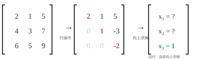
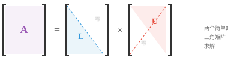
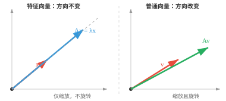
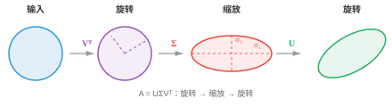
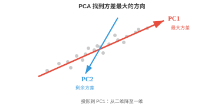

# 矩阵分解（Matrix Decompositions）

*矩阵分解将复杂矩阵拆成更简单的因子，用于求解方程组、稳定地计算逆以及压缩数据。本节介绍高斯消元、LU、QR、Cholesky、特征分解和 SVD，它们支撑 PCA、推荐系统和 ML 中的数值稳定性。*

- **矩阵分解（matrix decomposition）**或矩阵因式分解，是将矩阵拆为更易处理的部分。可以把它想成因数分解：$12 = 3 \times 4$ 比单独看 12 更容易推理。

!!! note "大白话"
    矩阵分解就是把一件复杂的变换拆成几步简单变换，像把 12 拆成 3 和 4 的乘积。

- 我们分解矩阵，是为了更快地求解方程组、稳定地计算逆、寻找特征值、压缩数据，并理解变换的几何结构。

!!! note "大白话"
    直接硬算大矩阵往往又慢又不稳；分解能暴露它的结构，让不同任务选用合适的捷径。

- 最基础的技术是**高斯消元（Gaussian elimination）**，也称行化简。思想很简单：给定方程组 $A\mathbf{x} = \mathbf{b}$，使用三种允许的行操作简化 $A$，直到答案显而易见。

!!! note "大白话"
    高斯消元不改变方程的解，只是把难读的方程组整理成更容易逐个求解的形状。

- 三种操作是：交换两行；将一行乘以非零标量；或将一行的倍数加到另一行。

!!! note "大白话"
    这些操作相当于重新排列、整体放缩或消去方程，都会保留原来的解集。

- 例如，为消去主元下方第一列的元素，从下面的行减去第 1 行的倍数：

```math
\begin{bmatrix} 2 & 1 & 5 \\ 4 & 3 & 7 \\ 6 & 5 & 9 \end{bmatrix} \xrightarrow{R_2 - 2R_1} \begin{bmatrix} 2 & 1 & 5 \\ 0 & 1 & -3 \\ 6 & 5 & 9 \end{bmatrix} \xrightarrow{R_3 - 3R_1} \begin{bmatrix} 2 & 1 & 5 \\ 0 & 1 & -3 \\ 0 & 2 & -6 \end{bmatrix}
```

!!! note "大白话"
    这里用第一行把下面同一列的数字消成 0，让未知数逐步从纠缠状态变成阶梯状态。

- 目标是得到**行阶梯形（row echelon form，REF）**：每个主元，即每行第一个非零元素，下方都为零，并且每个主元位于上一行主元的右侧。矩阵呈阶梯状。



!!! note "大白话"
    行阶梯形像台阶：每往下一行，最先出现的非零数都向右移，下面的变量可以先解出来。

- 进一步化为**最简行阶梯形（reduced row echelon form，RREF）**时，每个主元都为 1，且所在列中仅有该一个非零元素。每个矩阵都有唯一的 RREF。

!!! note "大白话"
    RREF 把每个主元列都清理成一个独立的 1，其余位置为 0，答案几乎能直接读出来。

- 一旦得到三角形形式，就可用**回代（back substitution）**求解：最底行直接给出最后一个变量，再逐步向上求解。

!!! note "大白话"
    先从只剩一个未知数的最后一行开始，再把答案代回上一行，一层层向上即可。

- 这是所有其他分解的基础。矩阵分解的目标，就是把矩阵化为三角形式，从而能通过回代求出变量。

!!! note "大白话"
    许多分解看起来名字不同，核心好处都一样：把复杂耦合关系变成可以按顺序解决的三角关系。

- **LU 分解（LU decomposition）**将高斯消元形式化，把方阵分解为 $A = LU$；若有行交换，则为 $A = PLU$。其中 $L$ 是下三角矩阵，$U$ 是上三角矩阵。



!!! note "大白话"
    LU 把一般矩阵拆成下三角 L 和上三角 U，必要时再加一个负责换行的置换矩阵 P。

- 要求解 $A\mathbf{x} = \mathbf{b}$，先通过前代，从上到下求 $L\mathbf{y} = \mathbf{b}$；再通过回代，从下到上求 $U\mathbf{x} = \mathbf{y}$。这将一个困难的通用求解，变成两个简单的三角求解。

!!! note "大白话"
    LU 的解法分两段：先顺着 L 往下求中间答案，再沿 U 倒着求最终答案。

- LU 分解相对于直接高斯消元的优势在于复用。一旦获得 $L$ 和 $U$，就可以为许多不同的 $\mathbf{b}$ 向量求解，而无需重新做分解。

!!! note "大白话"
    矩阵 A 不变、右边 $\mathbf{b}$ 经常变时，L 和 U 可以提前算好反复使用。

- 若需要在同一个系统中处理 1000 个不同右端项，这在仿真中很常见，只需分解一次再反复使用。

!!! note "大白话"
    分解的前期成本只付一次，之后每个新问题都能快速求解，这就是复用的价值。

- 当一个矩阵对称且正定，例如协方差矩阵时，还可以做得更好。

!!! note "大白话"
    对称正定是很强的额外条件，有了它就能用比一般 LU 更快、更稳定的专用分解。

- **Cholesky 分解（Cholesky decomposition）**将其分解为 $A = LL^T$，其中 $L$ 是下三角矩阵。例如：

```math
\begin{bmatrix} 4 & 2 \\ 2 & 5 \end{bmatrix} = \begin{bmatrix} 2 & 0 \\ 1 & 2 \end{bmatrix} \begin{bmatrix} 2 & 1 \\ 0 & 2 \end{bmatrix}
```

!!! note "大白话"
    Cholesky 只需存下三角矩阵 L，另一半就是它的转置，因此比一般分解更省计算。

- 该方法大约比 LU 快一倍，并保证数值稳定。可以把它看作矩阵的“平方根”。

!!! note "大白话"
    因为 $A=LL^T$，L 和它的转置相乘能还原 A，所以可把 L 看作矩阵的一种平方根。

- 若分解失败，例如根号下出现负值，说明矩阵不是正定的。因此 Cholesky 也可作为正定性检验。

!!! note "大白话"
    只有每个方向都“向上”的矩阵才拆得出 Cholesky；拆不出来就是条件不满足。

- 方阵 $A$ 的**特征向量（eigenvector）**是一些特殊方向：变换只会沿这些方向拉伸或缩小向量，而不会旋转它。**特征值（eigenvalue）**是缩放因子：

$$A\mathbf{x} = \lambda\mathbf{x}$$

!!! note "大白话"
    特征向量是矩阵作用后不偏离原直线的特殊方向，特征值只是这个方向被放大、缩小或翻转的倍数。



!!! note "大白话"
    普通向量通常既转向又变长，特征向量只会沿原方向伸缩，因此特别容易理解和分析。

- 大多数向量乘以矩阵后会改变方向。但特征向量是特殊的：输出与输入同向，只是被 $\lambda$ 缩放。若 $\lambda = 2$，特征向量长度加倍；若 $\lambda = -1$，方向翻转；若 $\lambda = 0$，则被压扁为零。

!!! note "大白话"
    特征值的绝对值管伸缩强度，符号管是否反向；0 表示该方向被完全压掉。

- 例如，对

```math
A = \begin{bmatrix} 3 & 1 \\ 0 & 2 \end{bmatrix}
```

  向量 $[1, 0]^T$ 是特征向量，对应 $\lambda = 3$，因为 $A[1, 0]^T = [3, 0]^T = 3[1, 0]^T$。

!!! note "大白话"
    这个向量经过 A 后仍在 x 轴上，只是长度变为 3 倍，所以它满足特征向量定义。

- 要寻找特征值，求解**特征多项式（characteristic polynomial）** $\det(A - \lambda I) = 0$。它的根就是特征值。然后把每个 $\lambda$ 代回 $(A - \lambda I)\mathbf{x} = \mathbf{0}$，求对应特征向量。

!!! note "大白话"
    先找哪些缩放倍数会让 $A-\lambda I$ 失去可逆性，再在这些倍数下找不会被改变方向的向量。

- 关键性质：

!!! note "大白话"
    特征值和前面学过的迹、行列式、正定性之间有直接关系，下面是最常用的几条。

    - $A$ 的迹等于其特征值之和。

        !!! note "大白话"
            所有特征方向的缩放倍数加起来，正好等于主对角线之和。
    - $A$ 的行列式等于其特征值之积。

        !!! note "大白话"
            各特征方向缩放倍数相乘，给出整体面积或体积缩放因子。
    - 对称矩阵有彼此垂直的特征向量和实特征值。

        !!! note "大白话"
            对称结构保证了自然方向可以互相垂直，且缩放倍数不会出现复数。
    - 正定矩阵的特征值全为正。

        !!! note "大白话"
            每个特征方向都向上弯，所以所有缩放相关的特征值都大于 0。
    - 协方差矩阵，即后续统计学会遇到的矩阵，始终半正定。

        !!! note "大白话"
            方差不可能为负，所以协方差矩阵在任何方向上的二次型都不会小于 0。

- 通过特征多项式计算大矩阵的特征值并不实际，实际会使用迭代方法：

!!! note "大白话"
    大矩阵不适合展开复杂多项式，实际程序会反复做简单步骤，逐渐逼近特征值和特征向量。

    - **幂迭代（Power iteration）**：反复乘以 $A$ 并归一化，收敛到主特征向量，即最大特征值对应的向量。它简单，但只能找到一组特征值与特征向量。

        !!! note "大白话"
            每次乘 A 都会让最大伸缩方向更突出，归一化防止数字无限变大。

    - **QR 算法（QR algorithm）**：主力方法。反复进行 QR 分解并重新组合，直到矩阵收敛到三角形式；对角线由此给出全部特征值。

        !!! note "大白话"
            QR 算法不断换一种更接近三角形的坐标表示，最后把所有特征值逼到对角线上。

    - **反幂迭代（Inverse iteration）**：寻找最接近给定目标值的特征向量。当大致知道所需特征值时很有用。

        !!! note "大白话"
            反幂迭代会放大目标附近的方向，适合有了大致目标后精细定位。

    - 对大型稀疏矩阵，**Arnoldi** 和 **Lanczos** 迭代会利用稀疏性提高效率。

        !!! note "大白话"
            稀疏矩阵不必逐格计算，这些算法只访问少量非零关系就能估计关键特征值。

- 若一个方阵拥有完整的一组线性无关特征向量，就可以被**对角化（diagonalised）**：$A = PDP^{-1}$。其中 $D$ 是特征值构成的对角矩阵，$P$ 的列是特征向量。

!!! note "大白话"
    对角化就是换到特征向量这组自然坐标轴后，让复杂变换变成各方向独立缩放。

- 为什么有用？对角矩阵极易处理。需要 $A^{100}$？不必把 $A$ 自乘 100 次，只需计算 $PD^{100}P^{-1}$；对角矩阵的幂只需分别对各条目取幂。这将昂贵操作变得便宜。

!!! note "大白话"
    在自然坐标系里，100 次复杂变换变成每个缩放倍数各自做 100 次幂，计算量大幅下降。

- **特征基（eigenbasis）**是完全由特征向量组成的一组基。在这组基下，矩阵成为对角矩阵，变换只是在每个特征向量方向独立缩放。这相当于找到了该变换的自然坐标系。

!!! note "大白话"
    特征基是最适合这个矩阵的坐标系，在里面它不再混合方向，只分别拉伸每条轴。

- **QR 分解（QR decomposition）**将任意矩阵 $A$ 分解为 $A = QR$，其中 $Q$ 是正交矩阵，即其列标准正交，$R$ 是上三角矩阵。可以把它理解为分离“方向”信息，即 $Q$，与“缩放和混合”信息，即 $R$。

!!! note "大白话"
    QR 把矩阵分成两部分：Q 负责旋转出一组干净垂直的方向，R 负责在这些方向上的缩放和组合。

- **Gram-Schmidt 过程（Gram-Schmidt process）**逐列构造 $Q$。取 $A$ 的第一列并归一化；对第二列，减去它在第一列上的投影以使其垂直，再归一化；对每一列重复。结果是一组标准正交向量。

!!! note "大白话"
    Gram-Schmidt 像逐个清理方向重叠：新向量先去掉在已有方向上的影子，再调整成长度 1。

- QR 分解是 QR 特征值算法的引擎，也可直接用于最小二乘问题。当 $A\mathbf{x} = \mathbf{b}$ 没有精确解，即方程数多于未知数时，QR 能找到最佳近似答案。

!!! note "大白话"
    方程无法同时完全满足时，QR 能找一个让总体误差最小的折中答案。

- **SVD（奇异值分解，Singular Value Decomposition）**是最通用、也可能是最重要的分解。每个矩阵，无论形状或秩，都有 SVD：$A = U\Sigma V^T$

    - $V^T$（$n \times n$，正交）：旋转输入

        !!! note "大白话"
            $V^T$ 先把输入转到最适合缩放的方向上。
    - $\Sigma$（$m \times n$，对角）：沿正交轴缩放，条目为非负且降序排列的奇异值

        !!! note "大白话"
            $\Sigma$ 只负责沿各条独立方向拉伸，奇异值越大表示该方向越重要。
    - $U$（$m \times m$，正交）：旋转输出

        !!! note "大白话"
            U 把缩放后的结果转到最终输出的方向。



!!! note "大白话"
    SVD 把任意矩阵讲成三个简单动作：转过去、按垂直方向拉伸、再转回来。

- 从几何上看，SVD 表明任何线性变换，无论多复杂，都只是一次旋转，接着沿坐标轴拉伸，然后再旋转一次。圆形会变成椭圆。

!!! note "大白话"
    看起来复杂的线性变形，拆开后没有神秘操作，本质就是两次换方向和一次按轴缩放。

- 奇异值 $\sigma_1 \geq \sigma_2 \geq \ldots$ 揭示每个方向的“重要性”。大的奇异值对应最重要的方向。$A$ 的秩等于非零奇异值的个数。

!!! note "大白话"
    奇异值像每个方向的信号强度；为零的方向已经被矩阵压没，因此不计入秩。

- **低秩近似（low-rank approximation）**：仅保留最大的 $k$ 个奇异值、将其余置零，就得到 $A$ 的最佳秩 $k$ 近似。这就是图像压缩的原理：一幅 $1000 \times 1000$ 图像可能只需 $k = 50$ 个奇异值就几乎不变，压缩比可达 20 倍。

!!! note "大白话"
    只保留最强的少数方向会丢掉细枝末节，却能保住大部分画面结构，因此可以显著压缩数据。

- SVD 还给出伪逆：$A^+ = V\Sigma^+U^T$，其中 $\Sigma^+$ 对非零奇异值取倒数。

!!! note "大白话"
    SVD 伪逆只反转还能恢复的非零方向，已经被压成零的方向不会假装可以恢复。

- 特征分解只适用于方阵，而 SVD 适用于任意矩阵。这是它的关键优势。

!!! note "大白话"
    数据矩阵常常不是方阵，SVD 不受这个限制，所以在实际机器学习中非常通用。

- **PCA（主成分分析，Principal Component Analysis）**使用特征分解，或 SVD，进行降维。

!!! note "大白话"
    PCA 的目标是找出数据真正变化最大的少数方向，用更少坐标保留主要信息。

- 想象一个数据集：每个样本有 100 个特征，即把 100 维向量堆叠为矩阵。这些特征中许多彼此相关、存在冗余。

!!! note "大白话"
    100 个特征不等于 100 份独立信息；很多列可能在重复描述同一种变化。

- PCA 找到数据实际变化的方向，使你只保留真正重要的部分。

!!! note "大白话"
    PCA 旋转坐标轴，把数据最明显的变化集中到前几个新坐标上。



!!! note "大白话"
    图中第一条轴沿着点云最长的方向，保留它就保住了最多变化信息。

- 第一主成分 PC1 是方差最大的方向。

!!! note "大白话"
    PC1 是数据最分散、最有变化的那条方向，因此优先保留。

- 第二主成分 PC2 捕获剩余数据中最大的方差，并且与第一主成分垂直。

!!! note "大白话"
    PC2 在不重复 PC1 的前提下，抓住剩下最明显的变化，所以必须与 PC1 垂直。

- 若大部分方差只分布在少数方向上，就可以将数据投影到这些维度，并以很小损失丢弃其余维度。

!!! note "大白话"
    数据若本来接近一张低维薄片，丢掉垂直于薄片的微小方向，信息损失会很小。

- 步骤如下：

!!! note "大白话"
    PCA 先让每个特征站在同一把尺度上，再找变化最大的方向，最后只留下最重要的几个方向。

    - 对数据标准化：减去均值，再除以标准差，使全部特征贡献相同

        !!! note "大白话"
            标准化先把各列移到同一中心、缩放到相近范围，避免单位大的特征自动占优势。
    - 计算协方差矩阵

        !!! note "大白话"
            协方差矩阵记录各特征怎样一起变化，是 PCA 寻找主要方向的原料。
    - 求其特征值与特征向量

        !!! note "大白话"
            特征向量给出候选方向，特征值告诉每个方向包含多少变化量。
    - 选择特征值最大的 $k$ 个特征向量，即主成分

        !!! note "大白话"
            选最大的特征值，就是保留信息量最多的 k 条新坐标轴。
    - 将数据投影到这些主成分上

        !!! note "大白话"
            最后只记录数据在这 k 条轴上的坐标，原来的高维表示就被压缩了。

- 标准化至关重要：若不做标准化，以千米计的特征会不论实际重要性，压过以厘米计的特征。

!!! note "大白话"
    PCA 只看数值波动大小，不懂单位；不标准化会让“数字写得大”的特征错误地显得更重要。

- 实践中，PCA 用于可视化，例如将高维数据投影到二维或三维；降噪，即丢弃主要为噪声的低方差方向；以及通过减少输入特征数量来加速 ML 模型。

!!! note "大白话"
    PCA 常用来把难画的高维数据画出来、去掉小噪声方向，或减少后续模型要处理的数字。

- **核 PCA（Kernel PCA）**将 PCA 扩展到非线性关系。它通过核函数把数据映射到高维空间，在那里结构变得线性，再应用标准 PCA 并投影回来。

!!! note "大白话"
    原空间里弯曲缠绕的数据，换到合适的高维特征空间后可能变得可用直线分开，再做 PCA。

- **Schur 分解（Schur decomposition）**将方阵分解为 $A = QTQ^\ast$，其中 $Q$ 是酉矩阵，$T$ 是上三角矩阵。每个方阵都有 Schur 分解，即使它不能对角化。

!!! note "大白话"
    Schur 分解保证任何方阵都能整理到上三角形式；即使缺少足够特征向量，仍然有可用的替代结构。

- **非负矩阵分解（Non-negative Matrix Factorisation，NMF）**将矩阵分解为两个非负矩阵：$A \approx WH$，其中 $W$ 和 $H$ 的所有元素均满足 $\geq 0$。不同于可能产生负条目的 SVD，NMF 只做加法、从不做减法，因此组成部分可解释。在主题建模中，$W$ 给出每篇文档的主题权重，$H$ 给出每个主题的词权重，且全部非负，符合我们对文档“包含多少各主题”的理解。

!!! note "大白话"
    NMF 像用若干非负原料混合出原数据：不会出现“负的主题含量”，所以结果更容易解释。

- **谱定理（spectral theorem）**指出，对称矩阵，或 Hermitian 矩阵，总能用正交矩阵，或酉矩阵，对角化。它们的特征值始终为实数，特征向量始终正交。这是 PCA 的理论基础。

!!! note "大白话"
    对称或 Hermitian 矩阵总能找到一组互相垂直的自然方向，因此 PCA 才能放心地把数据拆到独立主成分上。

## 编程任务（使用 CoLab 或 notebook）

1. 计算一个对称矩阵的特征值和特征向量。验证特征向量彼此垂直，并从特征分解重构原矩阵。
```python
import jax.numpy as jnp

A = jnp.array([[4.0, 2.0],
               [2.0, 3.0]])

eigenvalues, eigenvectors = jnp.linalg.eigh(A)
print(f"Eigenvalues: {eigenvalues}")
print(f"Eigenvectors orthogonal: {jnp.dot(eigenvectors[:,0], eigenvectors[:,1]):.6f}")

# Reconstruct: A = P D P^T
D = jnp.diag(eigenvalues)
A_reconstructed = eigenvectors @ D @ eigenvectors.T
print(f"Reconstruction matches: {jnp.allclose(A, A_reconstructed)}")
```

2. 实现幂迭代以寻找最大特征值，并实现反幂迭代以寻找最小特征值。与 `jnp.linalg.eigh` 比较。然后尝试自己实现 QR 算法。
```python
import jax.numpy as jnp

A = jnp.array([[4.0, 2.0],
               [2.0, 3.0]])

# Power iteration: finds the LARGEST eigenvalue
v = jnp.array([1.0, 0.0])
for _ in range(20):
    v = A @ v
    v = v / jnp.linalg.norm(v)
print(f"Largest eigenvalue:  {v @ A @ v:.4f}")

# Inverse iteration: multiply by A^{-1} instead of A, finds the SMALLEST eigenvalue
v = jnp.array([1.0, 0.0])
for _ in range(20):
    v = jnp.linalg.solve(A, v)
    v = v / jnp.linalg.norm(v)
print(f"Smallest eigenvalue: {1.0 / (v @ jnp.linalg.solve(A, v)):.4f}")

print(f"jnp.linalg.eigh:    {jnp.linalg.eigh(A)[0]}")
```

3. 计算一个矩阵的 SVD，然后只用最大的 k 个奇异值重构它，观察近似质量如何随 k 改变。
```python
import jax.numpy as jnp

A = jnp.array([[1.0, 2.0, 3.0],
               [4.0, 5.0, 6.0],
               [7.0, 8.0, 9.0]])

U, S, Vt = jnp.linalg.svd(A)

for k in [1, 2, 3]:
    approx = U[:, :k] @ jnp.diag(S[:k]) @ Vt[:k, :]
    error = jnp.linalg.norm(A - approx)
    print(f"k={k}, reconstruction error: {error:.4f}")
```
