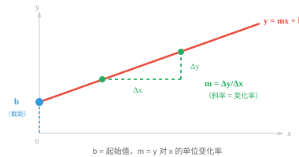
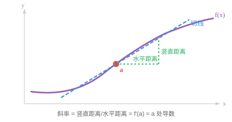
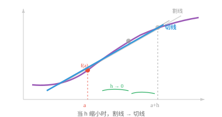

# 微分学（Differential Calculus）

*微分学刻画瞬时变化率。本节介绍极限、导数、求导规则、链式法则，即反向传播的基础，以及 ML 中常用的导数。*

- 前面几章中，我们学习了如何用向量表示数据、用矩阵变换数据。但许多现实现象并非静止不变：汽车会加速，股价会波动，神经网络的损失会随权重更新而改变。**微积分（calculus）**是研究变化的数学。

!!! note "大白话"
    向量和矩阵擅长描述“现在是什么样”，微积分专门解决“它正在怎样变化”。

- 微积分提出两个问题：某个量此刻变化得多快，即微分学；以及它随时间累积了多少，即积分学。本节处理“变化多快”这个问题。

!!! note "大白话"
    微分像看此刻的车速，积分像统计整段路走了多远；这里先学前者。

- 设想你正在开车，瞥了一眼速度表，上面显示 60 km/h。这个数不是整段行程的平均速度，而是你在这个精确时刻的速度。微分学提供了计算这类瞬时变化率的工具。

!!! note "大白话"
    平均速度把一整段路混在一起算，瞬时速度只回答“这一秒到底有多快”。导数就是把这种“这一刻”的变化算出来。

- 不过，先回顾直线方程：$y = mx + b$。

!!! note "大白话"
    这是一条直线的说明书：$b$ 决定起点，$m$ 决定每往右走一步要上升或下降多少。

- 这是两个量之间最简单的关系。

!!! note "大白话"
    输入每增加同样的量，输出总是增加同样的量，这种关系没有弯曲和突然变化。

    - $b$ 是 **y 截距（y-intercept）**，即直线与 y 轴相交的位置，也就是 $x = 0$ 时的初始值。

        !!! note "大白话"
            把 $x$ 看作刚开始计数的时刻，$b$ 就是还没走任何一步时的起始高度。

    - $m$ 是**斜率（slope）**，即变化率：$x$ 每增加 1 个单位，$y$ 就变化 $m$。

        !!! note "大白话"
            $m$ 是每走一步的固定增减量：正数向上走，负数向下走，绝对值越大就越陡。
- 若 $m = 3$，直线陡峭上升；若 $m = 0$，直线平坦；若 $m = -2$，直线下降。

!!! note "大白话"
    斜率的正负决定方向，大小决定坡有多陡。

- 斜率计算为 $m = \frac{\Delta y}{\Delta x} = \frac{y_2 - y_1}{x_2 - x_1}$，即“$y$ 改变了多少”与“$x$ 改变了多少”的比值。

!!! note "大白话"
    先看横向走了多少，再看纵向变了多少；两者相除就是每走一格平均升降几格。



- 一旦知道 $m$ 和 $b$，就可以计算任意 $x$ 对应的 $y$。

!!! note "大白话"
    起点和每步的变化量都知道了，走到哪里都能算出高度。

- 例如，若 $m = 2$、$b = 3$，当 $x = 5$ 时：$y = 2(5) + 3 = 13$。

!!! note "大白话"
    从 3 开始，连续走 5 步，每步加 2，最后就是 13。

- 这两个参数完全确定一条直线，预测任意输出只需代入即可。

!!! note "大白话"
    同一组 $m$ 和 $b$ 不会对应两条不同直线，所以它们就是这条线的完整身份信息。

- 对直线而言，斜率在每个位置都相同。

!!! note "大白话"
    直线像没有忽陡忽缓的坡，无论站在哪一段，坡度都一样。

- 这种想法可以推广到直线之外。任何函数都是把输入映射为输出的规则；一旦知道它的公式，即参数和形状，就可以计算任意输入的输出，并画出结果。

!!! note "大白话"
    函数就是一台按规则输入数字、输出数字的机器；图像把这台机器的全部输入输出关系画出来。

- $y = x^2$ 给出抛物线，$y = \sin(x)$ 给出波形，$y = e^x$ 给出指数增长。每个公式都定义一条特定曲线；能够把函数理解成一种形状，是后续所有内容的基础。

!!! note "大白话"
    不同公式像不同轨道：有的先降后升，有的上下摆动，有的越长越快。看形状能先判断变化的大致行为。

- 对直线而言，斜率处处相同。但大多数有趣的函数是弯曲的，斜率会随位置改变。微积分让我们能够找出曲线上任意单个点的斜率。

!!! note "大白话"
    弯路每一处的坡度不同，不能只报一个总坡度；导数负责测出你脚下这一小段的坡度。

- 还需要理解**极限（limit）**。极限描述的是：当输入不断接近某个目标值时，函数接近什么值，而不要求输入一定到达该目标值。

!!! note "大白话"
    极限关心“无限靠近时会靠向哪里”，不强求最后那一步真的踩到目标点。

$$\lim_{x \to a} f(x) = L$$

- 它读作：“当 $x$ 趋近于 $a$ 时，$f(x)$ 趋近于 $L$。”函数不必在 $x = a$ 时真的等于 $L$，只需能任意接近它。

!!! note "大白话"
    这里讨论的是目标点附近的走势，而不是只盯着目标点本身的一个取值。

- 例如，取 $f(x) = \frac{x^2 - 1}{x - 1}$。若直接代入 $x = 1$，会得到 $\frac{0}{0}$，这是未定义的。

!!! note "大白话"
    在 $x=1$ 这一点，原式不能算；但这不妨碍我们观察它靠近这一点时会走向哪里。

- 但尝试接近 1 的值：$f(0.9) = 1.9$、$f(0.99) = 1.99$、$f(1.01) = 2.01$。输出显然在趋近于 2。

!!! note "大白话"
    从左边靠近和从右边靠近都越来越接近 2，所以 2 就是这里的极限。

- 从代数上也能看出原因：把分子分解为 $(x-1)(x+1)$，约去 $(x-1)$ 后，对所有 $x \neq 1$ 都有 $f(x) = x + 1$。因此当 $x \to 1$ 时，$f(x) \to 2$。

!!! note "大白话"
    除了那个不能算的空点外，这个函数其实和 $x+1$ 完全一样；所以靠近 1 时自然靠近 2。

- 函数在 $x = 1$ 处有一个空点，但极限依然存在。

!!! note "大白话"
    图上缺一个点，不代表整条曲线在那个位置附近没有明确的去向。

- 极限是整个微积分赖以建立的基础。

!!! note "大白话"
    微积分要研究无限小的变化，不能真的把步长取成零，只能用极限描述“越来越小”后的结果。

- 函数 $f(x)$ 在点 $x = a$ 的**导数（derivative）**衡量瞬时变化率。从几何上看，它是曲线在该点的切线斜率。

!!! note "大白话"
    导数就是曲线在某一点的即时坡度，也就是那一点贴着曲线画出的直线有多斜。



- 为计算该斜率，先在曲线上取两个点，计算穿过它们的直线，即**割线（secant line）**的斜率。然后让第二个点不断靠近第一个点，观察割线斜率趋近于什么。这就是**差商（difference quotient）**：

!!! note "大白话"
    先用两个相隔很近的点估算坡度，再把距离越缩越小；估算值最后稳定到的数，就是单点坡度。

$$f'(a) = \lim_{h \to 0} \frac{f(a + h) - f(a)}{h}$$



- 分子 $f(a+h) - f(a)$ 是输出变化量，分母 $h$ 是输入变化量。两者之比是在一个很小区间上的平均变化率。当 $h \to 0$ 时，该平均值成为瞬时变化率。

!!! note "大白话"
    这仍是“变化量除以步长”，只不过把步长压缩到几乎看不见，从平均速度逼近瞬时速度。

- 例如，令 $f(x) = x^2$。在 $x = 3$ 处：

!!! note "大白话"
    下面把导数定义直接代入，看看曲线在 $x=3$ 这一点究竟有多陡。

$$f'(3) = \lim_{h \to 0} \frac{(3+h)^2 - 9}{h} = \lim_{h \to 0} \frac{9 + 6h + h^2 - 9}{h} = \lim_{h \to 0} (6 + h) = 6$$

- 因而在 $x = 3$ 处，函数 $x^2$ 的增长率是每个输入单位对应 6 个输出单位。

!!! note "大白话"
    在 3 附近，$x$ 只要再增加一点点，$x^2$ 大约会以六倍的速度增加。

- 若该极限存在，则函数在该点**可导（differentiable）**。为此，函数必须连续，即没有跳跃；光滑，即没有尖角；并且在该点附近有定义。

!!! note "大白话"
    要谈某一点的即时坡度，曲线不能在那里断开、突然折出尖角，或者根本没有这块曲线。

- 若可以不抬笔、不遇到折角地画出这条曲线，它很可能在该处可导。

!!! note "大白话"
    这是快速直觉：画线时既不停笔又不急转弯，通常就能给该处配上一条唯一的切线。

- 每次都从极限定义计算导数会很繁琐。幸运的是，只需少量规则，就能快速求出几乎任意函数的导数。

!!! note "大白话"
    极限定义负责说明导数是什么，求导规则负责让我们在实际计算时不用每次从头推一遍。

- **常数法则（Constant rule）**：常数的导数为零。若 $f(x) = 5$，则 $f'(x) = 0$。平坦直线的斜率为零。

!!! note "大白话"
    数值完全不动就没有变化率，所以导数是 0。

- **幂法则（Power rule）**：求导最常用的规则。把指数移到前面，再将指数减一：

!!! note "大白话"
    对 $x$ 的幂次函数，先把原来的指数当作系数，再把指数降低一级。

$$\frac{d}{dx} x^n = n x^{n-1}$$

- 例如：$\frac{d}{dx} x^3 = 3x^2$。三次函数变为二次函数。它适用于任意实数指数，包括负数和分数：$\frac{d}{dx} x^{-1} = -x^{-2}$，以及 $\frac{d}{dx} \sqrt{x} = \frac{d}{dx} x^{1/2} = \frac{1}{2}x^{-1/2}$。

!!! note "大白话"
    无论指数是整数、负数还是分数，核心操作都不变：系数乘下来，指数减一。

- **和/差法则（Sum/Difference rule）**：逐项求导。

!!! note "大白话"
    一个式子由几项相加减组成时，把每一项分别求导后，再按原来的加减号拼回去。

$$\frac{d}{dx}[f(x) \pm g(x)] = f'(x) \pm g'(x)$$

- **乘积法则（Product rule）**：两个函数相乘时，导数并不只是两个导数的乘积，而是：

!!! note "大白话"
    两个量相乘时，任意一个在变都会让乘积变化，所以要把“前者在变”和“后者在变”两部分都算进去。

$$\frac{d}{dx}[f(x) \cdot g(x)] = f'(x)g(x) + f(x)g'(x)$$

- 可以这样记：“第一个的变化率乘第二个，加上第一个乘第二个的变化率。”例如，$\frac{d}{dx}[x^2 \sin x] = 2x \sin x + x^2 \cos x$。

!!! note "大白话"
    先让 $x^2$ 变化而 $\sin x$ 暂时不动，再让 $\sin x$ 变化而 $x^2$ 暂时不动，最后把两份影响相加。

- **商法则（Quotient rule）**：对两个函数的比值：

!!! note "大白话"
    分子和分母都会变化，分数的变化不能只看上面或下面一边，必须把两边的影响合在同一个公式里。

$$\frac{d}{dx}\left[\frac{f(x)}{g(x)}\right] = \frac{f'(x)g(x) - f(x)g'(x)}{[g(x)]^2}$$

- 一个常用口诀是：“下导上减上导下，除以下方的平方。”

!!! note "大白话"
    口诀只帮你记住顺序：先写分母导数乘分子，再减分子导数乘分母，最后除以分母平方。

- **链式法则（Chain rule）**：对 ML 最重要的规则。当函数复合，即一个函数嵌在另一个函数中时，导数等于沿该链各导数的乘积：

!!! note "大白话"
    输出先受外层影响，外层又受内层影响；总变化率就是每一层传递变化率连乘起来。

$$\frac{d}{dx} f(g(x)) = f'(g(x)) \cdot g'(x)$$

- 可以把它想成剥洋葱：先对外层函数求导，保持内层函数不变；然后乘以内层函数的导数。

!!! note "大白话"
    先把里面整体看成一个变量处理外层，再回来补上里面这个变量本身变化得多快。


- 例如，$\frac{d}{dx} (3x + 1)^5 = 5(3x+1)^4 \cdot 3 = 15(3x+1)^4$。外层函数是 $(\cdot)^5$，内层函数是 $3x+1$。

!!! note "大白话"
    先把 $3x+1$ 当成一个整体，得到 5 次幂的导数；再乘上这个整体对 $x$ 的变化率 3。

- 链式法则是神经网络中**反向传播（backpropagation）**的数学基础。深度网络是一长串复合函数。为了计算损失相对每个权重如何变化，我们从输出层回到输入层，反复应用链式法则，并相乘各处的局部导数。

!!! note "大白话"
    神经网络像多道连续加工的流水线。反向传播从最终误差倒着追问：每一道工序改一点，会让最后误差改多少。

- 以下是最常遇到的导数。每一个都可以由极限定义推导出来，但熟记它们能节省时间：

!!! note "大白话"
    这张表相当于常用函数的求导速查表；理解规则以后，常见函数可直接使用这些结果。

| 函数 | 导数 | 说明 |
|---|---|---|
| $e^x$ | $e^x$ | 唯一等于自身导数的函数 |
| $a^x$ | $a^x \ln a$ | 指数函数的一般形式 |
| $\ln x$ | $\frac{1}{x}$ | 自然对数 |
| $\log_a x$ | $\frac{1}{x \ln a}$ | 一般对数 |
| $\sin x$ | $\cos x$ | |
| $\cos x$ | $-\sin x$ | 注意负号 |
| $\tan x$ | $\sec^2 x$ | |

- 指数函数 $e^x$ 十分特别：它是唯一等于自身导数的函数。这也是 $e$ 在 ML 中无处不在的原因，从 softmax 激活到概率分布都会出现它。

!!! note "大白话"
    $e^x$ 的当前值有多大，变化率就同样有多大，这种自我保持的特性让它很适合描述连续增长。

- **洛必达法则（L'Hopital's Rule）**处理产生 $\frac{0}{0}$ 或 $\frac{\infty}{\infty}$ 等未定式的极限。当直接代入得到这些形式之一时，可以分别对分子和分母求导，再尝试计算极限：

!!! note "大白话"
    当分子和分母同时变成 0 或同时无限大时，原来的分数看不出结果；求导后有时能把比较变化速度的问题变得可算。

$$\lim_{x \to a} \frac{f(x)}{g(x)} = \lim_{x \to a} \frac{f'(x)}{g'(x)}$$

- 条件是：$f$ 与 $g$ 都必须在 $a$ 附近可导，且 $g'(x) \neq 0$，可能在 $a$ 本身除外；原始极限必须给出未定式。

!!! note "大白话"
    这不是看到分数就能套的万能规则，只有满足可导、分母导数不为零且确实是未定式时才能用。

- 例如：$\lim_{x \to 0} \frac{\sin x}{x}$。直接代入得到 $\frac{0}{0}$。应用洛必达法则：$\lim_{x \to 0} \frac{\cos x}{1} = 1$。这个极限很基础，会出现在信号处理和傅里叶分析中。

!!! note "大白话"
    原分子分母都趋近 0，但 $\sin x$ 在 0 附近和 $x$ 几乎一样快地缩小，所以它们的比值趋近 1。

- 若结果仍是未定式，可以重复使用该法则。例如，$\lim_{x \to 0} \frac{1 - \cos x}{x^2}$ 得到 $\frac{0}{0}$。第一次应用后为 $\lim_{x \to 0} \frac{\sin x}{2x}$，仍为 $\frac{0}{0}$。第二次应用后为 $\lim_{x \to 0} \frac{\cos x}{2} = \frac{1}{2}$。

!!! note "大白话"
    一次求导还没把问题化开，就继续求导，直到得到可以直接判断的极限；但每一次都要重新确认仍满足使用条件。

- 若两个函数可导，它们的和、差、积、复合，以及分母非零时的商也都可导。因此，我们能有把握地对由简单部分构成的复杂表达式求导。

!!! note "大白话"
    只要零件本身平滑，按这些常见方式把零件拼起来通常仍然平滑，因此复杂函数可以拆开后逐步求导。

## 编程任务（使用 CoLab 或 notebook）

1. 可视化常见函数。并排绘制 $x^2$、$\sin(x)$ 和 $e^x$，建立不同公式如何产生不同形状的直觉。尝试修改参数，例如 $2x^2$、$\sin(2x)$，观察曲线如何改变。
```python
import jax.numpy as jnp
import matplotlib.pyplot as plt

x = jnp.linspace(-3, 3, 300)

fig, axes = plt.subplots(1, 3, figsize=(12, 3))
axes[0].plot(x, x**2, color="#e74c3c")
axes[0].set_title("x²  (parabola)")
axes[1].plot(x, jnp.sin(x), color="#3498db")
axes[1].set_title("sin(x)  (wave)")
axes[2].plot(x, jnp.exp(x), color="#27ae60")
axes[2].set_title("eˣ  (exponential)")
for ax in axes:
    ax.axhline(0, color="gray", linewidth=0.5)
    ax.axvline(0, color="gray", linewidth=0.5)
plt.tight_layout()
plt.show()
```

2. 使用 JAX 的自动微分，在若干点计算 $f(x) = x^3 - 2x + 1$ 的导数。将结果与解析导数 $f'(x) = 3x^2 - 2$ 比较。
```python
import jax
import jax.numpy as jnp

f = lambda x: x**3 - 2*x + 1
df = jax.grad(f)

for x in [0.0, 1.0, 2.0, -1.0]:
    print(f"x={x:5.1f}  autodiff: {df(x):.4f}  analytical: {3*x**2 - 2:.4f}")
```

2. 数值验证链式法则。定义 $f(x) = \sin(x^2)$，通过 `jax.grad` 计算导数，并与解析结果 $2x\cos(x^2)$ 比较。
```python
import jax
import jax.numpy as jnp

f = lambda x: jnp.sin(x**2)
df = jax.grad(f)

for x in [0.5, 1.0, 2.0]:
    auto = df(x)
    analytical = 2*x * jnp.cos(x**2)
    print(f"x={x:.1f}  autodiff: {auto:.6f}  analytical: {analytical:.6f}")
```

3. 可视化导数。在同一张图上绘制 $f(x) = x^3 - 3x$ 及其导数 $f'(x) = 3x^2 - 3$。注意 $f'(x) = 0$ 的位置如何对应 $f$ 的峰与谷。
```python
import jax
import jax.numpy as jnp
import matplotlib.pyplot as plt

f = lambda x: x**3 - 3*x
# jax.grad works on scalars; jax.vmap vectorises it to operate on an array of inputs at once
df = jax.vmap(jax.grad(f))

x = jnp.linspace(-2.5, 2.5, 200)
plt.plot(x, jax.vmap(f)(x), label="f(x)")
plt.plot(x, df(x), label="f'(x)", linestyle="--")
plt.axhline(0, color="gray", linewidth=0.5)
plt.legend()
plt.title("A function and its derivative")
plt.show()
```
