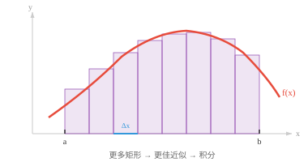

# 积分学（Integral Calculus）

*积分学在区间上累积量，将局部变化率重新变为总量。本节介绍定积分与不定积分、微积分基本定理、积分技巧，以及它们在 ML 的概率密度和期望值中的应用。*

- 微分告诉我们单个点处的变化率。积分反过来，将许多微小部分累积起来计算总量。

!!! note "大白话"
    微分是看一小瞬间变化多快，积分是把许多很小的变化一份份加起来，看最终一共得到多少。

- 若导数回答“变化多快？”，积分回答“累积了多少？”。

!!! note "大白话"
    一个像速度表，一个像里程表：前者看当前速度，后者把一路的变化累加成总数。

- 理解积分最简单的方式是把它看作**曲线下的面积（area under a curve）**。若画出函数 $f(x)$，并在 $x = a$ 到 $x = b$ 之间将曲线与 x 轴围成的区域涂色，积分给出该区域的带符号面积。

!!! note "大白话"
    把曲线到 x 轴之间的区域想成一块不规则地毯，积分就是计算这块地毯有多大。



- 为什么称为“带符号”？x 轴上方的区域贡献正面积，下方的区域贡献负面积。这符合物理直觉：若 $f(x)$ 表示速度，积分给出净位移，即向前减去向后，而不是总路程。

!!! note "大白话"
    往前走记正，往后走记负；积分关心最后离起点多远，而不是脚一共走了多少路。

- 为计算这个面积，想象把区域切成 $n$ 个细长的竖直矩形，每个宽度为 $\Delta x$。每个矩形的高度是在该小段内某点处的函数值，将它们求和：

!!! note "大白话"
    不规则面积不好直接算，就先切成很多窄长的小长方形，再把这些容易算的面积加起来。

$$\text{Area} \approx \sum_{i=1}^{n} f(x_i^\ast) \, \Delta x$$

- 当矩形越来越细，即 $n \to \infty$、$\Delta x \to 0$ 时，这个和变得精确。该极限过程定义了**定积分（definite integral）**：

!!! note "大白话"
    长方形越窄，边缘越贴合曲线；把宽度想成无限小，拼出来的总面积就不再只是近似值。

$$\int_a^b f(x)\, dx = \lim_{n \to \infty} \sum_{i=1}^{n} f(x_i^\ast) \, \Delta x$$

- 符号 $\int$ 是“sum”的拉长字母 S。$dx$ 提醒我们，正在沿 x 轴累加无限薄的切片。

!!! note "大白话"
    积分号本质上就是一个求和符号，$dx$ 表示每一小片在 x 方向上的极小宽度。

- **不定积分（indefinite integral）**或**原函数（antiderivative）**是一个函数 $F(x)$，其导数为 $f(x)$。写作：

!!! note "大白话"
    求不定积分是在反向找函数：已知变化率 $f(x)$，找出哪个原函数求导后会得到它。

$$\int f(x)\, dx = F(x) + C$$

- 其中 $+ C$ 是**积分常数（constant of integration）**。由于任意常数的导数都为零，彼此只相差常数的原函数有无穷多个。例如，$\int 2x\, dx = x^2 + C$，因为 $x^2 + 7$ 或 $x^2 - 3$ 的导数仍然是 $2x$。

!!! note "大白话"
    求导会把纯常数全部抹掉，所以只凭导数无法知道原函数整体向上或向下平移了多少；$C$ 专门保留这份不确定性。

- **微积分基本定理（Fundamental Theorem of Calculus）**是连接微分与积分的桥梁，它有两部分：

!!! note "大白话"
    这个定理说明微分和积分是一对相反操作，因此可以用求原函数的办法快速算面积。

- **第 1 部分**：若 $F(x)$ 是 $f(x)$ 的一个原函数，则定积分等于 $F$ 在两个端点的差：

!!! note "大白话"
    不必真的把无数小矩形加完，只要找到原函数，再用终点值减起点值即可。

$$\int_a^b f(x)\, dx = F(b) - F(a)$$

- 这在实践中非常重要。我们不必计算求和的极限，即困难的步骤；只需找一个原函数并在两个点上求值，通常很简单。

!!! note "大白话"
    它把看似无限复杂的累加，压缩成两次代入和一次相减。

- **第 2 部分**：若定义 $F(x) = \int_a^x f(t)\, dt$，则 $F'(x) = f(x)$。微分与积分互为逆运算，会相互抵消。

!!! note "大白话"
    从固定起点累积到当前位置得到的总量，立刻对当前位置求变化率，又会回到原来每一小点的量。

- 例如，计算 $\int_1^3 x^2\, dx$：$x^2$ 的原函数为 $\frac{x^3}{3}$。所以 $\int_1^3 x^2\, dx = \frac{27}{3} - \frac{1}{3} = \frac{26}{3} \approx 8.67$。

!!! note "大白话"
    先找 $x^2$ 的原函数，再算右端点和左端点的值并相减，就得到 1 到 3 之间的带符号面积。

- 正如微分有规则，积分也有对应的逆规则：

!!! note "大白话"
    这张表是常见求导结果的反向版本，见到熟悉函数时可以直接找对应的原函数。

| 函数 | 积分 | 条件 |
|---|---|---|
| $x^n$ | $\frac{x^{n+1}}{n+1} + C$ | $n \neq -1$ |
| $\frac{1}{x}$ | $\ln\|x\| + C$ | |
| $e^x$ | $e^x + C$ | |
| $a^x$ | $\frac{a^x}{\ln a} + C$ | |
| $\sin x$ | $-\cos x + C$ | |
| $\cos x$ | $\sin x + C$ | |
| $k$（常数） | $kx + C$ | |

- **和/差法则（sum/difference rule）**同样成立：$\int [f(x) \pm g(x)]\, dx = \int f(x)\, dx \pm \int g(x)\, dx$。常数可以提出：$\int k\, f(x)\, dx = k \int f(x)\, dx$。

!!! note "大白话"
    加在一起的量可以分开累计，固定倍数也可以先拿到积分号外面；这和普通求和的直觉一致。

- 当函数过于复杂而难以直接积分时，可以用一些技巧将其简化。

!!! note "大白话"
    不是每个式子都能一眼套表；常见做法是先改写它，让它变成认识的样子再积分。

- **u 换元法（u-substitution）**是链式法则的逆过程。若发现复合函数 $f(g(x))$ 与 $g'(x)$ 相乘，就令 $u = g(x)$，使 $du = g'(x)\, dx$，积分便会简化。

!!! note "大白话"
    把复杂的内层表达式临时改名为 $u$，只要外面刚好带着它的变化率，整道题就能变成更简单的积分。

- 例如：$\int 2x \cos(x^2)\, dx$。令 $u = x^2$，则 $du = 2x\, dx$。积分变为 $\int \cos(u)\, du = \sin(u) + C = \sin(x^2) + C$。

!!! note "大白话"
    $2x\,dx$ 正好是 $x^2$ 的微小变化，因此把 $x^2$ 换成 $u$ 后，难题立刻变成 $\cos u$ 的普通积分。

- **分部积分（integration by parts）**是乘积法则的逆过程。若被积函数是两个函数的乘积：

!!! note "大白话"
    遇到两个函数相乘时，分部积分把一个函数的微分转移给另一个函数，目标是把原题换成更容易的积分。

$$\int u\, dv = uv - \int v\, du$$

- 应策略性地选择 $u$ 与 $dv$，使剩余积分 $\int v\, du$ 比原积分更简单。选择 $u$ 的常用口诀是 **LIATE**：Logarithmic、Inverse trig、Algebraic、Trigonometric、Exponential，优先从靠前类别选择。

!!! note "大白话"
    分部积分的关键不是机械套公式，而是选完以后剩下那一项必须更好算；LIATE 只是帮助做这个选择的经验顺序。

- 例如：$\int x\, e^x\, dx$。令 $u = x$，即代数项，$dv = e^x\, dx$。则 $du = dx$、$v = e^x$。因此：$\int x\, e^x\, dx = x\, e^x - \int e^x\, dx = x\, e^x - e^x + C = e^x(x - 1) + C$。

!!! note "大白话"
    选择 $u=x$ 后，微分会把它从 $x$ 降成 1，剩下的 $e^x$ 仍然好积分，所以这次拆分是划算的。

- 在 ML 中，积分出现在概率论中，即对密度函数积分以计算概率；也出现在期望值中，即对连续分布做加权平均；还用于计算 ROC 曲线下面积。实践中虽然很少手工积分，但理解积分的含义有助于解释这些量。

!!! note "大白话"
    在机器学习里，积分常在做“把连续范围内所有可能性按权重加总”这件事，例如算概率、平均结果或曲线面积。

## 编程任务（使用 CoLab 或 notebook）

1. 用不断增加的矩形数量，通过黎曼和数值近似 $\int_0^1 x^2\, dx$。与精确结果 $\frac{1}{3}$ 比较。
```python
import jax.numpy as jnp

for n in [10, 100, 1000, 10000]:
    x = jnp.linspace(0, 1, n, endpoint=False)
    dx = 1.0 / n
    area = jnp.sum(x**2 * dx)
    print(f"n={n:5d}  approx: {area:.6f}  exact: {1/3:.6f}")
```

2. 数值验证微积分基本定理。定义 $F(x) = \int_0^x t^2\, dt = \frac{x^3}{3}$，并检查其导数，即通过 `jax.grad` 计算，是否等于 $x^2$。
```python
import jax
import jax.numpy as jnp

F = lambda x: x**3 / 3
dF = jax.grad(F)

for x in [0.5, 1.0, 2.0, 3.0]:
    print(f"x={x:.1f}  F'(x)={dF(x):.4f}  x^2={x**2:.4f}")
```

3. 可视化从 $0$ 到 $\pi$ 的 $f(x) = \sin(x)$ 曲线下的面积。使用 `plt.fill_between` 填充区域，并用黎曼和数值计算面积。
```python
import jax.numpy as jnp
import matplotlib.pyplot as plt

x = jnp.linspace(0, jnp.pi, 500)
y = jnp.sin(x)

plt.plot(x, y, color="purple", linewidth=2)
plt.fill_between(x, y, alpha=0.2, color="purple")
plt.title(f"Area = {jnp.sum(jnp.sin(x) * (jnp.pi / 500)):.4f}  (exact: 2.0)")
plt.show()
```
