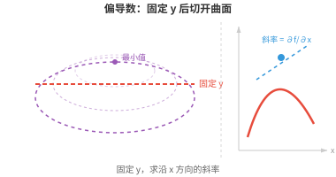
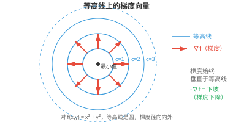

# 多元微积分（Multivariate Calculus）

*多元微积分将导数和积分扩展到多变量函数。由于机器学习（ML）模型拥有数百万个参数，这一点至关重要。本节介绍偏导数、梯度、雅可比矩阵、海森矩阵，以及使反向传播成为可能的多元链式法则。*

- 到目前为止，我们讨论的函数都接收单一输入 $x$，并产生单一输出 $f(x)$。但在 ML 中，我们几乎从不只处理一个变量。

- 考虑一个二元函数，例如 $f(x, y) = x^2 + y^2$。它在三维空间中定义了一个曲面，即碗状曲面。我们想知道：固定 $y$ 并微小改变 $x$ 时，$f$ 如何变化？这就是**偏导数（partial derivative）**。

- $f$ 关于 $x$ 的**偏导数**写作 $\frac{\partial f}{\partial x}$。计算它时，将其他每个变量都视为常数，再像通常一样对 $x$ 求导。

- 对于 $f(x, y) = x^2y + 3x - 2y$：

$$\frac{\partial f}{\partial x} = 2xy + 3 \qquad \frac{\partial f}{\partial y} = x^2 - 2$$

- 计算 $\frac{\partial f}{\partial x}$ 时，我们将 $y$ 视为常数，所以 $x^2y$ 求导后为 $2xy$，$3x$ 为 $3$，$-2y$ 为 $0$。

- 计算 $\frac{\partial f}{\partial y}$ 时，我们将 $x$ 视为常数，所以 $x^2y$ 求导后为 $x^2$，$3x$ 为 $0$，$-2y$ 为 $-2$。

- 从几何角度看，关于 $x$ 求偏导相当于用一张平行于 $xz$ 平面的平面，在固定的 $y$ 值处切开三维曲面，再求所得曲线的斜率。



- **梯度（gradient）**将所有偏导数收集为一个向量：

$$\nabla f = \left(\frac{\partial f}{\partial x_1}, \frac{\partial f}{\partial x_2}, \ldots, \frac{\partial f}{\partial x_n}\right)$$

- 对于 $f(x, y) = x^2 + y^2$：$\nabla f(x, y) = (2x, 2y)$。在点 $(1, 2)$ 处：$\nabla f(1, 2) = (2, 4)$。

- 梯度有两个关键性质：

    - **方向（direction）**：它指向增长最快的方向。想象一名徒步者站在山上，当前位置的梯度直接指向上坡最陡的路径。

    - **大小（magnitude）**：$\|\nabla f\|$ 给出沿这个最陡方向的增长率。梯度大表示地势陡峭；梯度小表示地势接近平坦。



- 既然梯度指向上坡，沿相反方向（$-\nabla f$）移动就会下坡，趋向更小的值。这个简单的思想是**梯度下降（gradient descent）**的基础，后续章节会详细讨论这种优化技术。现在的关键结论是：梯度告诉你“上坡”的方向，以及爬升有多陡。

- **方向导数（directional derivative）**将偏导数推广开来。它不再问“$f$ 沿 x 轴如何变化？”，而是问“$f$ 沿任意方向 $\mathbf{u}$ 如何变化？”。它等于梯度与一个单位向量的点积：

$$D_{\mathbf{u}} f = \nabla f \cdot \mathbf{u}$$

- 对于 $f(x, y) = x^2 + y^2$，在 $(1, 2)$ 处沿 $\mathbf{v} = (3, 4)$ 的方向：先归一化得到 $\mathbf{u} = (3/5, 4/5)$，再计算 $D_{\mathbf{u}} f = (2, 4) \cdot (3/5, 4/5) = 6/5 + 16/5 = 22/5$。

- 偏导数是方向沿坐标轴时方向导数的特殊情形。若某一方向的方向导数为零，函数在该点沿该方向是平坦的。

- **等高线（contour lines）**，也称**等值曲线（level curves）**，连接函数值相同的点。对于 $f(x, y) = x^2 + y^2$，等高线是以原点为中心的圆：不同 $c$ 值对应 $x^2 + y^2 = c$。

- 等高线绝不会相交，因为一个点不可能同时有两个不同的函数值。

- 梯度始终垂直于等高线，并从较低值指向较高值。

- 等高线间距小表示地势陡峭；间距大表示坡度平缓。

- 到目前为止，我们的函数都产生单一输出。但许多函数会产生多个输出。函数 $\mathbf{F}: \mathbb{R}^n \to \mathbb{R}^m$ 接收 $n$ 个输入并产生 $m$ 个输出。**雅可比矩阵（Jacobian matrix）**将这类向量值函数的全部偏导数组织起来：

```math
J = \begin{bmatrix} \frac{\partial f_1}{\partial x_1} & \cdots & \frac{\partial f_1}{\partial x_n} \\ \vdots & \ddots & \vdots \\ \frac{\partial f_m}{\partial x_1} & \cdots & \frac{\partial f_m}{\partial x_n} \end{bmatrix}
```

- 雅可比矩阵的每一行都是一个输出分量的梯度。对于有 3 个输入和 2 个输出的函数，雅可比矩阵是 $2 \times 3$ 矩阵。

- 雅可比矩阵将导数推广到向量值函数。

- 标量函数的导数告诉你单位输入变化会引起多大的输出变化；雅可比矩阵则告诉你每个输出如何随每个输入变化。

- **雅可比行列式（determinant of the Jacobian）**衡量一个变换在局部将空间拉伸或压缩的程度。

- 若行列式为 2，小区域的面积会加倍。若其为 0，变换会将空间压扁到更低的维度。回忆矩阵章节：零行列式表示变换奇异且不可逆。

- 将多个变换复合时，即一个变换的输出送入下一个变换，整体映射的雅可比矩阵是各个雅可比矩阵的乘积。后续章节中，这个思想将成为核心。

- 梯度捕捉一阶信息，即斜率；**海森矩阵（Hessian matrix）**则捕捉二阶信息，即曲率。

- 对标量函数 $f(x_1, \ldots, x_n)$，海森矩阵是由全部二阶偏导数组成的 $n \times n$ 矩阵：

```math
H = \begin{bmatrix} \frac{\partial^2 f}{\partial x_1^2} & \frac{\partial^2 f}{\partial x_1 \partial x_2} & \cdots \\ \frac{\partial^2 f}{\partial x_2 \partial x_1} & \frac{\partial^2 f}{\partial x_2^2} & \cdots \\ \vdots & \vdots & \ddots \end{bmatrix}
```

- 对于 $f(x, y) = x^3 + 2xy^2 - y^3$，梯度为 $(3x^2 + 2y^2,\; 4xy - 3y^2)$，海森矩阵为：

```math
H = \begin{bmatrix} 6x & 4y \\ 4y & 4x - 6y \end{bmatrix}
```

- 对角线元素（$6x$ 和 $4x - 6y$）分别告诉你：沿 $x$ 移动时 x 方向的斜率如何变化，以及沿 $y$ 移动时 y 方向的斜率如何变化。

- 非对角线元素（$4y$）告诉你：沿一个方向移动时，另一方向的斜率如何变化。

- **克莱罗定理（Clairaut's theorem）**保证：对二阶导数连续的函数，混合偏导数相等，即 $\frac{\partial^2 f}{\partial x \partial y} = \frac{\partial^2 f}{\partial y \partial x}$。

- 这意味着海森矩阵是对称矩阵。正如矩阵章节所见，这保证其特征值为实数，且特征向量正交。

- 海森矩阵描述函数在临界点，即梯度为零的点，附近的形状：

    - 若 $H$ 为**正定（positive definite）**，即所有特征值均为正，该点为**局部极小值（local minimum）**：曲面在每个方向都向上弯曲，形如碗。
    - 若 $H$ 为**负定（negative definite）**，即所有特征值均为负，该点为**局部极大值（local maximum）**：曲面在每个方向都向下弯曲，形如倒扣的碗。
    - 若 $H$ 同时有正、负特征值，该点为**鞍点（saddle point）**：曲面沿部分方向向上弯曲，沿另一些方向向下弯曲，形如山口。

- **多元链式法则（multivariate chain rule）**将链式法则扩展到多变量函数。若 $z = f(x, y)$，其中 $x = g(t)$、$y = h(t)$，则：

$$\frac{dz}{dt} = \frac{\partial f}{\partial x}\frac{dx}{dt} + \frac{\partial f}{\partial y}\frac{dy}{dt}$$

- 从 $t$ 到 $z$ 的每条路径都会贡献一项：该路径上的偏导数，乘以中间变量关于 $t$ 的导数。

- 例如，若 $z = x^2 y + 3x - y^2$，$x = \cos(t)$，$y = \sin(t)$：

$$\frac{dz}{dt} = (2xy + 3)(-\sin t) + (x^2 - 2y)(\cos t)$$

- 除了手工计算导数，还有三种方法：

    - **数值微分（numerical differentiation）**：对很小的 $h$，近似计算 $f'(x) \approx \frac{f(x+h) - f(x-h)}{2h}$。它简单，但有噪声且不够精确。
    - **符号微分（symbolic differentiation）**：以代数方式应用求导规则，得到精确公式。但所得表达式可能呈指数级膨胀。
    - **自动微分（automatic differentiation，autodiff）**：追踪运算链，并高效地计算精确导数。这正是 JAX、PyTorch 和 TensorFlow 所使用的方法。它给出精确的数值结果，而非近似值，又不会产生臃肿的符号表达式。

## 编程任务（使用 CoLab 或 notebook）

1. 使用 `jax.grad`，计算 $f(x, y) = x^2 y + 3x - 2y$ 在点 $(1, 2)$ 处的梯度。由于 $f$ 接收两个标量参数，分别使用带 `argnums` 的 `jax.grad` 计算各偏导数。
```python
import jax
import jax.numpy as jnp

def f(x, y):
    return x**2 * y + 3*x - 2*y

df_dx = jax.grad(f, argnums=0)
df_dy = jax.grad(f, argnums=1)

x, y = 1.0, 2.0
print(f"∂f/∂x = {df_dx(x, y):.4f}  (expected: {2*x*y + 3:.4f})")
print(f"∂f/∂y = {df_dy(x, y):.4f}  (expected: {x**2 - 2:.4f})")
```

2. 使用 `jax.jacobian` 计算一个向量值函数的雅可比矩阵。将结果与手工计算比较。
```python
import jax
import jax.numpy as jnp

def F(x):
    return jnp.array([x[0]**2 + x[1], x[0] * x[1]**2])

J = jax.jacobian(F)
x = jnp.array([1.0, 2.0])
print(f"Jacobian at (1,2):\n{J(x)}")
# Expected: [[2*x[0], 1], [x[1]**2, 2*x[0]*x[1]]] = [[2, 1], [4, 4]]
```

3. 使用 `jax.hessian` 计算 $f(x, y) = x^3 + 2xy^2 - y^3$ 的海森矩阵，并验证它是对称的。
```python
import jax
import jax.numpy as jnp

def f(xy):
    x, y = xy[0], xy[1]
    return x**3 + 2*x*y**2 - y**3

H = jax.hessian(f)
point = jnp.array([1.0, 2.0])
hess = H(point)
print(f"Hessian:\n{hess}")
print(f"Symmetric: {jnp.allclose(hess, hess.T)}")
# Expected: [[6x, 4y], [4y, 4x-6y]] = [[6, 8], [8, -8]]
```

4. 从零构建一个最小自动微分引擎。
    - 每个 `Var` 跟踪自己的值，以及如何通过链式法则向后传播梯度。
    - 尝试为其扩展更多运算，例如除法、幂运算等。
    - 这正是 JAX、PyTorch 和 Numpy 设计方式的基础。
```python
class Var:
    def __init__(self, val, children=(), backward_fn=None):
        self.val = val
        self.grad = 0.0
        self.children = children
        self.backward_fn = backward_fn

    def __add__(self, other):
        out = Var(self.val + other.val, children=(self, other))
        def _backward():
            self.grad += out.grad    # d(a+b)/da = 1
            other.grad += out.grad   # d(a+b)/db = 1
        out.backward_fn = _backward
        return out

    def __mul__(self, other):
        out = Var(self.val * other.val, children=(self, other))
        def _backward():
            self.grad += other.val * out.grad  # d(a*b)/da = b
            other.grad += self.val * out.grad  # d(a*b)/db = a
        out.backward_fn = _backward
        return out

    def backward(self):
        # topological sort then propagate gradients
        # we will go through this in data structures and algorithms
        order, visited = [], set()
        def topo(v):
            if v not in visited:
                visited.add(v)
                for c in v.children:
                    topo(c)
                order.append(v)
        topo(self)
        self.grad = 1.0
        for v in reversed(order):
            if v.backward_fn:
                v.backward_fn()

# f(x, y) = x*x*y + x  at (3, 2)
x = Var(3.0)
y = Var(2.0)
f = x * x * y + x       # = 3*3*2 + 3 = 21

f.backward()
print(f"f = {f.val}")           # 21.0
print(f"df/dx = {x.grad}")     # 2*x*y + 1 = 13.0
print(f"df/dy = {y.grad}")     # x*x = 9.0
```
