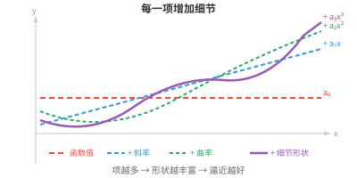
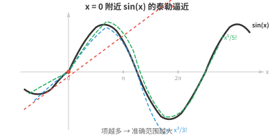

# 函数逼近（Function Approximation）

*函数逼近用足够有用的简单函数替代复杂函数。本节介绍线性化、泰勒级数、多项式逼近、傅里叶级数和通用逼近定理。通用逼近定理是神经网络能够学习任意映射的理论基础。*

- 我们遇到的许多函数过于复杂，无法直接处理。手算 $e^{0.1}$、预测卫星轨迹等，都涉及没有简单闭式解的函数。

- **函数逼近（function approximation）**在我们关心的区域内，用“足够接近”的简单函数替代复杂函数。

- 最自然的逼近函数是多项式。多项式只是若干 $x$ 的幂及其系数之和，容易计算、求导和积分。

- 但多项式为什么如此适合逼近？看看 $x$ 的每一项幂分别带来什么：

    - 常数项 $a_0$ 确定基准值。
    - 项 $a_1 x$ 增加斜率。
    - 项 $a_2 x^2$ 增加曲率。
    - 每个更高次幂都捕捉函数形状中更细致的特征。



- 通过选择合适的系数，我们可以逐项匹配函数在某一点的值、斜率、曲率和更高阶行为。

- 项数足够时，多项式几乎可以模仿任意平滑函数。

- 问题变成：怎样找到正确的系数？

- **线性化（linearisation）**是最简单的逼近。在点 $x = a$ 附近，我们用函数的切线替换该函数：

$$L(x) = f(a) + f'(a)(x - a)$$

- 这是一阶**泰勒逼近（Taylor approximation）**。它表示：从已知值 $f(a)$ 出发，再根据斜率乘以距 $a$ 的距离进行调整。

- 例如，在 $x = 0$ 处线性化 $sin(x)$：$f(0) = 0$、$f'(0) = \cos(0) = 1$，因此 $L(x) = x$。在零点附近，$sin(x) \approx x$。试试看：$sin(0.1) = 0.0998\ldots \approx 0.1$。

- 但线性化只在非常靠近 $a$ 时有效。离得更远，逼近就会失效。为了做得更好，我们加入高阶项。

- **泰勒级数（Taylor series）**将函数表示为多项式项的无穷和，每一项都捕捉函数在点 $a$ 附近行为中更细致的特征：

$$f(x) = \sum_{n=0}^{\infty} \frac{f^{(n)}(a)}{n!}(x - a)^n = f(a) + f'(a)(x-a) + \frac{f''(a)}{2!}(x-a)^2 + \frac{f'''(a)}{3!}(x-a)^3 + \cdots$$



- 每增加一项都是一次修正。第一项匹配函数值，第二项匹配斜率，第三项匹配曲率，依此类推。加入的项越多，逼近准确的区域越大。

- 分母中的 $n!$ 并非随意出现。将 $(x - a)^n$ 恰好求 $n$ 次导数，结果为 $n!$。阶乘会将这一结果抵消，确保泰勒多项式在 $x = a$ 处的第 $n$ 阶导数等于原函数的第 $n$ 阶导数。

- **麦克劳林级数（Maclaurin series）**就是以 $a = 0$ 为中心的泰勒级数：

$$f(x) = \sum_{n=0}^{\infty} \frac{f^{(n)}(0)}{n!} x^n$$

- 一些著名的麦克劳林级数：

$$e^x = 1 + x + \frac{x^2}{2!} + \frac{x^3}{3!} + \cdots$$

$$\sin x = x - \frac{x^3}{3!} + \frac{x^5}{5!} - \frac{x^7}{7!} + \cdots$$

$$\cos x = 1 - \frac{x^2}{2!} + \frac{x^4}{4!} - \frac{x^6}{6!} + \cdots$$

- 注意，$\sin x$ 只包含奇数次幂，因为它是奇函数；$\cos x$ 只包含偶数次幂，因为它是偶函数。交替的符号使逼近值在真实值两侧摆动并从两侧收敛。

- 用四项近似 $e^{0.5}$：$1 + 0.5 + \frac{0.25}{2} + \frac{0.125}{6} = 1 + 0.5 + 0.125 + 0.02083 \approx 1.6458$。真实值为 $1.6487\ldots$，因此只用四项就已得到三位正确的小数。

- 并非每个泰勒级数都处处收敛。**收敛半径（radius of convergence）**告诉我们，级数从中心 $a$ 向外多远仍能给出有效结果。在该半径内，加入更多项可使多项式逼近任意精确；在半径外，级数发散。

- **幂级数（power series）**的一般形式是：$\sum_{n=0}^{\infty} a_n (x - c)^n$。泰勒级数是系数由导数确定的幂级数；其他幂级数的系数可能由别的规则定义。**比值判别法（ratio test）**用于确定收敛性：计算 $\lim_{n \to \infty} \left|\frac{a_{n+1}}{a_n}\right|$。若极限为 $L$，则收敛半径为 $R = 1/L$。

- 当我们在第 $n$ 项后截断泰勒级数时，会产生误差。**拉格朗日余项（Lagrange remainder）**给出该误差的上界：

$$R_n(x) = \frac{f^{(n+1)}(c)}{(n+1)!}(x-a)^{n+1}$$

- 这里的 $c$ 是 $a$ 与 $x$ 之间的某个未知点。我们无法准确知道 $c$，但通常可以给 $|f^{(n+1)}(c)|$ 设定上界，从而得到最坏情况的误差估计。分母中的 $(n+1)!$ 增长极快，因此对于收敛半径内的函数，随着项数增加，误差会迅速缩小。

- 对多变量函数，泰勒展开包含混合偏导数。$f(\mathbf{x})$ 在点 $\mathbf{a}$ 附近的二阶逼近为：

$$f(\mathbf{x}) \approx f(\mathbf{a}) + \nabla f(\mathbf{a})^T (\mathbf{x} - \mathbf{a}) + \frac{1}{2} (\mathbf{x} - \mathbf{a})^T H(\mathbf{a}) (\mathbf{x} - \mathbf{a})$$

- 第一项是函数值，第二项使用梯度，即我们在多元微积分中看到的向量，第三项使用海森矩阵，即捕捉曲率的矩阵。这将矩阵章节直接连接到微积分：海森矩阵由二阶导数构成，描述函数曲面的形状。

- 这个多元二阶逼近是牛顿法（Newton's method）和其他二阶优化技术的基础，下一节将会介绍。

- 除多项式外，还有几种值得了解的逼近方法：

    - **样条插值（spline interpolation）**：不用一个高次多项式，而是平滑地拼接多个低次多项式。这能避免高次多项式可能产生的剧烈振荡。
    - **傅里叶级数（Fourier series）**：将周期函数近似为正弦和余弦之和，是信号处理和音频领域的核心方法。
    - **神经网络（neural networks）**：通用函数逼近器。只要神经元足够多，它们能够以任意精度逼近任何连续函数。这是深度学习的理论依据。

- 若函数具有使逼近可靠的性质，就称其“性质良好（well-behaved）”：连续性，即没有跳跃；可微性，即没有尖角；光滑性，即各阶导数都存在；有界性，即输出保持有限。

- 多项式、指数函数和三角函数都属于性质良好的函数。函数性质越好，得到良好逼近所需的泰勒项越少。

## 编程任务（使用 CoLab 或 notebook）

1. 用不断增加的泰勒项近似 $e^x$，并可视化逼近如何改善。
```python
import jax.numpy as jnp
import matplotlib.pyplot as plt

x = jnp.linspace(-2, 3, 300)
plt.plot(x, jnp.exp(x), "k-", linewidth=2, label="eˣ (exact)")

colors = ["#e74c3c", "#3498db", "#27ae60", "#9b59b6"]
for n, color in zip([1, 2, 4, 8], colors):
    approx = sum(x**k / jnp.array(float(jnp.prod(jnp.arange(1, k+1)) if k > 0 else 1))
                 for k in range(n+1))
    plt.plot(x, approx, color=color, linestyle="--", label=f"{n} terms")

plt.ylim(-2, 15)
plt.legend()
plt.title("Taylor approximation of eˣ")
plt.show()
```

2. 计算拉格朗日余项，为用不同数量泰勒项近似 $\sin(1)$ 的误差给出上界。
```python
import jax.numpy as jnp

x = 1.0
exact = jnp.sin(x)

taylor = 0.0
for n in range(8):
    sign = (-1)**n
    factorial = float(jnp.prod(jnp.arange(1, 2*n+2)))
    taylor += sign * x**(2*n+1) / factorial
    error = abs(exact - taylor)
    bound = x**(2*n+3) / float(jnp.prod(jnp.arange(1, 2*n+4)))
    print(f"terms={n+1}  approx={taylor:.10f}  error={error:.2e}  bound={bound:.2e}")
```

3. 比较 $cos(x)$ 在 $x = 0$ 附近的线性化与二次泰勒逼近。将两种逼近与真实函数一起绘制，观察各自准确的范围。
```python
import jax.numpy as jnp
import matplotlib.pyplot as plt

x = jnp.linspace(-3, 3, 300)
plt.plot(x, jnp.cos(x), "k-", linewidth=2, label="cos(x)")
plt.plot(x, jnp.ones_like(x), "--", color="#e74c3c", label="linear: 1")
plt.plot(x, 1 - x**2/2, "--", color="#3498db", label="quadratic: 1 - x²/2")
plt.plot(x, 1 - x**2/2 + x**4/24, "--", color="#27ae60", label="4th order")
plt.ylim(-2, 2)
plt.legend()
plt.title("Taylor approximations of cos(x)")
plt.show()
```
