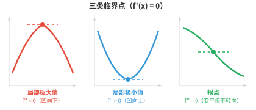
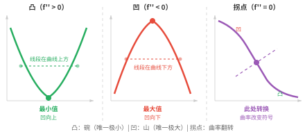
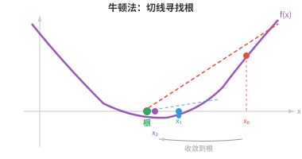
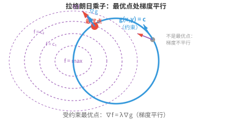

# 优化（Optimisation）

*优化是模型训练的数学核心：寻找能使损失函数最小化的参数。本节介绍临界点、凸性、梯度下降、牛顿法、使用拉格朗日乘子的约束优化，以及驱动现代深度学习的优化器 SGD 和 Adam。*

- 训练神经网络、拟合回归直线、调整超参数，几乎每一种 ML 算法的核心都是一个**优化（optimisation）**问题。

!!! note "大白话"
    很多机器学习任务归根到底都在反复调参数，直到结果尽可能好；这个“找最好参数”的过程就是优化。

- 我们有一个函数，例如损失、成本或目标函数，并希望找到使它尽可能小，或尽可能大的输入。

!!! note "大白话"
    把函数值当作成绩或花费，优化就是找一组输入，让成绩最高或花费最低。

- 在优化前，我们需要理解函数的**零点（zeros）**，也称根。$f(x)$ 的零点是使 $f(x) = 0$ 的 $x$ 值。从图形上看，它们是 x 轴截距。

!!! note "大白话"
    零点就是函数输出刚好为 0 的位置，在图上就是曲线碰到或穿过 x 轴的地方。

- 例如，$f(x) = x^2 - 3x + 2 = (x-1)(x-2)$ 在 $x = 1$ 与 $x = 2$ 处有零点。两个零点之间函数为负，即 $f(1.5) = -0.25$；零点之外函数为正。零点将数轴分隔成函数符号恒定的区域。

!!! note "大白话"
    两个零点像把数轴切成几段；在同一段内，曲线不会再穿过 x 轴，所以正负号保持不变。

- 一个零点的**重数（multiplicity）**是对应因子出现的次数。

!!! note "大白话"
    同一个根在因式分解里重复出现几次，它的重数就是几；重数会改变曲线碰到 x 轴时的行为。

- 在单零点，即重数为 1 的零点，图像穿过 x 轴；在二重零点，即重数为 2 的零点，图像接触 x 轴后反弹而不穿过，看起来在该点是“平的”。

!!! note "大白话"
    奇数重根通常让曲线从轴的一侧穿到另一侧，偶数重根则像球碰地后弹回，仍留在同一侧。

- 寻找零点很重要，因为导数 $f'(x)$ 的零点就是 $f(x)$ 的**临界点（critical points）**，它们是极大值和极小值的候选点。

!!! note "大白话"
    函数可能转头的位置，往往是坡度变成 0 的地方；因此先找导数的零点，就能缩小寻找峰谷的范围。

- 在极大值或极小值处，切线是水平的，即斜率为 0，因此 $f'(x) = 0$。

!!! note "大白话"
    走到山顶或谷底的那一瞬间，沿路不再继续上升或下降，所以切线会水平。



- 但并非每个临界点都是极大值或极小值。满足 $f'(x) = 0$ 的点也可能是**拐点（inflection point）**，例如 $f(x) = x^3$ 的 $x = 0$。函数在那里短暂变平，但不会改变方向。

!!! note "大白话"
    坡度为 0 只说明暂时平了，不一定真的掉头；$x^3$ 在 0 处会平着穿过去，前后仍持续上升。

- **二阶导数判别法（second derivative test）**可以解决这个问题。对于临界点 $x = c$，即 $f'(c) = 0$：

!!! note "大白话"
    一阶导数找出可疑点，二阶导数再看曲线在那里向上弯还是向下弯，从而区分谷底和山顶。

    - 若 $f''(c) > 0$：曲线凹向上，形如碗，因此 $c$ 是**局部极小值（local minimum）**。

        !!! note "大白话"
            碗底附近往任何小方向走都会变高，所以中心点是附近最低处。
    - 若 $f''(c) < 0$：曲线凹向下，形如山丘，因此 $c$ 是**局部极大值（local maximum）**。

        !!! note "大白话"
            山顶附近往任何小方向走都会变低，所以中心点是附近最高处。
    - 若 $f''(c) = 0$：该判别法无结论，需要使用更高阶导数或其他方法。

        !!! note "大白话"
            二阶导数为 0 时，曲线可能是平底、平顶或直接穿过去，光靠这一条信息无法下结论。

- 例如，$f(x) = x^3 - 3x$。导数为 $f'(x) = 3x^2 - 3 = 3(x-1)(x+1)$，所以临界点为 $x = -1$ 和 $x = 1$。二阶导数为 $f''(x) = 6x$。在 $x = -1$：$f''(-1) = -6 < 0$，为局部极大值；在 $x = 1$：$f''(1) = 6 > 0$，为局部极小值。

!!! note "大白话"
    先由一阶导数找到两个平坦点，再用二阶导数的正负判断：左边是峰，右边是谷。

- 若函数图像上任意两点之间的线段都位于图像上方或图像上，函数就是**凸函数（convex）**。可以把它理解为处处向上弯曲的碗状函数。从数学上说，若对所有 $x$ 都有 $f''(x) \geq 0$，则 $f$ 是凸函数。

!!! note "大白话"
    凸函数像没有坑洼的碗：把曲线上两点拉直线，直线不会钻到曲线下方；二阶导数非负就是这种向上弯的数学描述。



- 凸性很强大，因为凸函数有一项重要性质：每个局部极小值也都是**全局最小值（global minimum）**。不存在会使人误入的局部低谷。将球放入一个凸碗中，它总会滚到底部。

!!! note "大白话"
    凸碗只有一个真正的最低层，不会有“看起来到底了其实旁边还有更低坑”的陷阱，所以优化更容易。

- 若 $-f$ 是凸函数，则 $f$ 是**凹函数（concave）**，即向下弯曲。函数在凹与凸之间转换的点称为**拐点**，满足 $f''(x) = 0$。

!!! note "大白话"
    把凸函数上下翻转就得到凹函数；凹凸转换处是曲线从像碗变成像山丘、或反过来的位置。

- **牛顿法（Newton's method）**利用切线寻找函数的零点，并可进一步寻找其导数的临界点。从初始猜测 $x_0$ 出发，迭代更新：

!!! note "大白话"
    牛顿法每次用当前位置的切线代替真实曲线，再把切线碰到 x 轴的位置当成下一次猜测。

$$x_{n+1} = x_n - \frac{f(x_n)}{f'(x_n)}$$



- 其思想是：在 $x_n$ 处画出切线，找到切线与 x 轴的交点，将该交点作为 $x_{n+1}$。对于性质良好且初始点合适的函数，牛顿法收敛很快，具有二次收敛速度，即每一步正确数字的数量大致翻倍。

!!! note "大白话"
    当起点已经不差且曲线平滑时，切线会非常准确地指向根，因此每一步常能大幅提高精度。

- 例如，求 $\sqrt{5}$，即求 $f(x) = x^2 - 5$ 的零点。$f'(x) = 2x$，因此 $x_{n+1} = x_n - \frac{x_n^2 - 5}{2x_n}$。从 $x_0 = 2$ 开始：$x_1 = 2.25$，$x_2 = 2.2361\ldots$，已经精确到四位小数。

!!! note "大白话"
    用 2 当起点，只迭代两次就几乎得到 $\sqrt{5}$，展示了牛顿法在条件合适时的速度。

- 若初始猜测离根太远、根附近 $f'(x) = 0$，或函数附近有拐点，牛顿法可能失败。它还要求计算导数，而导数计算可能很昂贵。

!!! note "大白话"
    牛顿法快不等于总稳：起点差、切线太平或形状复杂时，它可能跳到错误位置，且每步还要付出求导成本。

- 对优化，即寻找极小值而非零点，我们将牛顿法应用于 $f'(x) = 0$，得到更新公式：

!!! note "大白话"
    要找谷底，就把“坡度为 0”当成新的求根问题，再让牛顿法去解它。

$$x_{n+1} = x_n - \frac{f'(x_n)}{f''(x_n)}$$

- 在多维情形下，它变为 $\mathbf{x}_{n+1} = \mathbf{x}_n - H^{-1} \nabla f(\mathbf{x}_n)$，其中 $H$ 是海森矩阵。这正是上一节二阶泰勒逼近的实际应用：将函数近似为二次函数，直接跳到该二次函数的最小值，然后重复。

!!! note "大白话"
    多维牛顿法同时看下坡方向和地形弯曲，用海森矩阵校正步幅和方向，像根据整个碗的形状直接猜谷底在哪里。

- **拉格朗日乘子（Lagrange multipliers）**用于解决**约束优化（constrained optimisation）**：在约束 $g(x, y) = c$ 下寻找 $f(x, y)$ 的最优值。我们不再搜索整个 $\mathbb{R}^n$，而只在满足约束的集合，即一条曲线或一个曲面上搜索。

!!! note "大白话"
    有约束时不能在所有地方随便找最优解，只能在允许的路线或表面上活动，例如预算固定时如何把收益做大。

- 核心洞见来自几何：在受约束的最优点，$f$ 的梯度必须与 $g$ 的梯度平行。若不平行，我们还能沿约束面朝某个仍能改进 $f$ 的方向移动，因此尚未到达最优点。

!!! note "大白话"
    在可走边界上真正到头时，想让目标继续变好的方向必然会把你推离约束；两个梯度平行正是这种“已经无路可改进”的标志。

- 引入新变量 $\lambda$，即拉格朗日乘子，并定义**拉格朗日函数（Lagrangian）**：

!!! note "大白话"
    $\lambda$ 是把“目标要变好”和“约束必须满足”绑进同一个公式的调节量。

$$\mathcal{L}(x, y, \lambda) = f(x, y) - \lambda(g(x, y) - c)$$

- 将所有偏导数设为零，可得到一个方程组，其解就是受约束的最优点：

!!! note "大白话"
    对 $x$、$y$ 和 $\lambda$ 都求导并令其为零，一次性同时要求目标在允许方向上不能再改善、约束也必须成立。

$$\frac{\partial \mathcal{L}}{\partial x} = 0, \quad \frac{\partial \mathcal{L}}{\partial y} = 0, \quad \frac{\partial \mathcal{L}}{\partial \lambda} = 0$$



- 例如，在 $x^2 + y^2 = 1$ 的约束下最大化 $f(x,y) = x^2 y$。拉格朗日函数为 $\mathcal{L} = x^2 y - \lambda(x^2 + y^2 - 1)$。计算偏导数：

!!! note "大白话"
    这里所有候选点都被限制在单位圆上，拉格朗日函数把“待求最大值”和“必须在圆上”合成一个问题。

$$2xy - 2\lambda x = 0, \quad x^2 - 2\lambda y = 0, \quad x^2 + y^2 = 1$$

- 由第一个方程，假设 $x \neq 0$，可得 $\lambda = y$。代入第二个方程：$x^2 = 2y^2$。再结合约束：$2y^2 + y^2 = 1$，所以 $y = \frac{1}{\sqrt{3}}$。最大值为 $f = \frac{2}{3\sqrt{3}}$。

!!! note "大白话"
    解法是在方程组里逐步消去未知量，最后再把结果代回约束和目标函数，得到边界上能达到的最大值。

- 对于不等式约束，即 $g(x,y) \leq c$ 而非 $= c$，**Karush-Kuhn-Tucker（KKT）条件**推广了拉格朗日乘子法。约束要么是活跃的，即紧约束，按等式处理；要么是不活跃的，即解在内部，约束与结果无关。

!!! note "大白话"
    不等式限制有两种状态：最优解正好顶在边界上时它会产生作用；解离边界还有余量时，这条限制暂时不影响答案。

- 实践中，我们很少手工做优化。主要的算法类别如下：

!!! note "大白话"
    真实问题的参数太多，通常由优化器自动迭代；区别主要在于每步用了多少地形信息、每步成本多高。

    - **一阶方法（first-order methods）**，只使用梯度：梯度下降、随机梯度下降（SGD）、Adam。它们每步开销低，但可能收敛缓慢，尤其是在病态问题上。

        !!! note "大白话"
            一阶方法只看当前下坡方向，算得便宜，适合大规模训练；但遇到狭长或扭曲的地形时，可能需要很多步。
    - **二阶方法（second-order methods）**，使用梯度和海森矩阵：牛顿法收敛很快，但计算和求逆海森矩阵代价高，对 $n$ 个参数的复杂度为 $O(n^3)$。**拟牛顿法（Quasi-Newton methods）**，如 BFGS 和 L-BFGS，只用梯度信息近似海森矩阵，在不承担完整二阶方法成本的情况下，收敛通常快于一阶方法。

        !!! note "大白话"
            二阶方法还看地形弯曲，常能少走弯路，但完整海森矩阵在大模型中贵得难以承受；拟牛顿法是在速度和成本之间折中。
    - **共轭梯度法（conjugate gradient）**：适用于大型稀疏系统，只使用矩阵与向量的乘积，而无需存储完整海森矩阵。

        !!! note "大白话"
            当矩阵巨大但大部分元素为零时，共轭梯度法避免把整张表摊开，只通过矩阵乘向量来逐步逼近解。
    - **高斯-牛顿法（Gauss-Newton）**和 **Levenberg-Marquardt**：针对最小二乘问题，常见于回归，通过雅可比矩阵近似海森矩阵。

        !!! note "大白话"
            对“预测和真实值差多少”的最小二乘问题，可以用雅可比矩阵近似曲率，得到比普通梯度法更有方向感的更新。
    - **自然梯度下降（natural gradient descent）**：使用费舍尔信息矩阵考虑参数空间的几何结构，对概率模型可能更有效。

        !!! note "大白话"
            自然梯度不只按参数数值的距离走，还考虑参数改动对概率分布真正造成的变化，因此在概率模型中方向可能更合适。

- 优化器的选择取决于问题。对于深度学习，参数数目极大，可达数百万到数十亿，计算海森矩阵并不现实，因此一阶方法，尤其是 Adam，占主导地位。对于较小且目标平滑的问题，二阶方法可能快得多。

!!! note "大白话"
    没有永远最好的优化器：大模型优先选每步便宜的一阶方法，小而平滑的问题才更有条件承受二阶方法的高成本来换速度。

## 编程任务（使用 CoLab 或 notebook）

1. 实现牛顿法，求 $\sqrt{7}$，即 $f(x) = x^2 - 7$ 的零点。观察其快速收敛。
```python
import jax.numpy as jnp

f = lambda x: x**2 - 7
df = lambda x: 2*x

x = 3.0  # initial guess
for i in range(6):
    x = x - f(x) / df(x)
    print(f"step {i+1}: x = {x:.10f}  (error: {abs(x - jnp.sqrt(7.0)):.2e})")
```

2. 使用梯度下降最小化 $f(x, y) = (x - 3)^2 + (y + 1)^2$。最小值位于 $(3, -1)$。尝试不同的学习率。
```python
import jax
import jax.numpy as jnp

def f(params):
    x, y = params
    return (x - 3)**2 + (y + 1)**2

grad_f = jax.grad(f)
params = jnp.array([0.0, 0.0])
lr = 0.1

for i in range(20):
    g = grad_f(params)
    params = params - lr * g
    if i % 5 == 0 or i == 19:
        print(f"step {i:2d}: ({params[0]:.4f}, {params[1]:.4f})  loss={f(params):.6f}")
```

3. 用数值方法求解一个约束优化问题。在 $x + y = 10$ 的约束下最大化 $f(x,y) = xy$：令 $y = 10 - x$，再寻找单变量函数的最优值。
```python
import jax
import jax.numpy as jnp

# Substitute constraint: y = 10 - x, so f = x(10 - x) = 10x - x²
f = lambda x: x * (10 - x)
df = jax.grad(f)

# Gradient ascent (we want maximum, so add gradient)
x = 1.0
lr = 0.1
for i in range(20):
    x = x + lr * df(x)
print(f"x={x:.4f}, y={10-x:.4f}, f={f(x):.4f}")  # should be x=5, y=5, f=25
```
