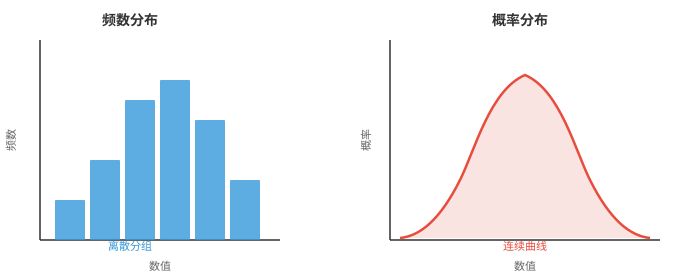
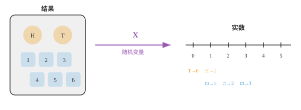
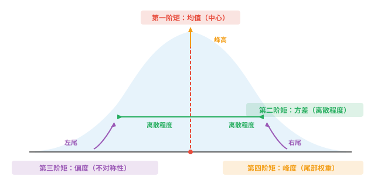

# 统计学基础（Fundamentals of Statistics）

*统计学为描述数据和量化不确定性提供语言。本节介绍分布、随机变量、概率质量函数（PMF）、概率密度函数（PDF）、累积分布函数（CDF）、期望、方差、矩以及中心极限定理。这些概念支撑着每一种 ML 评估指标和损失函数。*

- 统计学是从数据中学习的科学。你收集观测结果，对它们进行汇总，并据此得出结论，而这些结论往往涉及无法直接测量的事物。

!!! note "大白话"
    统计学不只是在算几个数字，而是用眼前有限的数据，尽量可靠地判断看不见的大范围情况。

- 假设你想知道一个国家所有成年人的平均身高。你无法测量每一个人，因此会测量一个样本，再用统计学对整个总体作出有依据的推断。

!!! note "大白话"
    不可能把全国每个人都量一遍，就抽一批有代表性的人来量，再估计全国的情况；抽样是否靠谱决定这个估计是否靠谱。

- 统计学有两个主要分支：

!!! note "大白话"
    一类工作是把已经拿到的数据说清楚，另一类工作是从一小部分数据推测更大的群体。

    - **描述统计学（descriptive statistics）**：汇总已有数据，例如平均值、图表和表格。

        !!! note "大白话"
            描述统计只回答“这批数据长什么样”，不会越过数据本身去断言更大总体。
    - **推断统计学（inferential statistics）**：利用样本对更大的群体作出推断。

        !!! note "大白话"
            推断统计是在样本基础上回答“总体大概怎样”，因此必须同时面对抽样带来的不确定性。

- 统计学的基本构件是**分布（distribution）**，即对数值如何分散的描述。平均值、检验、预测等其他一切都建立在理解分布之上。

!!! note "大白话"
    分布告诉你数值通常集中在哪里、散得多开、极端值多不多；只看平均数会丢掉这些关键信息。

- **频数分布（frequency distribution）**统计数据中每个数值，或每个数值区间，出现的频率。可以把考试分数分进若干组，再数一数每组有多少学生；所得结果就是直方图。

!!! note "大白话"
    把数据按区间装进盒子，再数每个盒子里有多少个，这就是频数分布；直方图把这些计数画成柱子。

- **概率分布（probability distribution）**用概率替代原始计数。它不说“有 12 名学生考了 70 到 80 分”，而说“考到 70 到 80 分的概率为 0.24”。当数据连续时，直方图的柱会变成平滑曲线。

!!! note "大白话"
    频数说的是这次样本里有多少人，概率分布说的是以后随机抽一个人落在某范围的可能性有多大。



- 左侧直方图由你收集到的实际数据构成；右侧平滑曲线是描述数据背后模式的数学模型。前者是经验性的，后者是理论性的。

!!! note "大白话"
    柱状图是已经发生的数据记录，平滑曲线是我们用来概括规律的模型；模型可以帮助预测，但不等于原始数据本身。

- 要在数学上处理分布，我们需要一种方式为结果赋值。这正是**随机变量（random variable）**的作用。

!!! note "大白话"
    随机结果原本可能是文字或事件，随机变量把它们统一翻译成数字，才能进行加减、平均和比较。

- 随机变量是将试验的每个结果映射为实数的函数。抛一枚硬币，结果是“正面”或“反面”，但随机变量 $X$ 将它们转换为 $X(\text{heads}) = 1$ 和 $X(\text{tails}) = 0$。于是我们就可以进行算术运算。

!!! note "大白话"
    它不是“会随机变化的普通变量”这么简单，而是一套给每种随机结果编号的规则。正反面被编码成 1 和 0 后，平均值就有了明确含义。



- **离散（discrete）**随机变量的取值构成可数集合，例如 10 次抛掷中正面的次数、一次掷骰子的点数、你在一小时内收到的邮件数量。

!!! note "大白话"
    离散变量只能一个一个数出来，例如 0、1、2 个邮件，不会出现 2.37 个邮件。

- **连续（continuous）**随机变量可取一个区间中的任意值，例如你的精确身高、下一班车到达前的等待时间、正午的温度。

!!! note "大白话"
    连续变量在两个数之间还能继续细分，例如等待 3.1 分钟、3.01 分钟，理论上没有最小刻度。

- 这一区别很重要，因为它改变了概率的计算方式。对于离散变量，我们求和；对于连续变量，我们积分，回忆第 3 章的积分。

!!! note "大白话"
    可数的可能性可以逐个相加；连续范围有无限多个点，只能把极小片段的贡献用积分累加。

- 对于离散随机变量，**概率质量函数（probability mass function，PMF）**给出每一个特定取值的概率：

!!! note "大白话"
    PMF 像一张概率清单：每个可取数值各占多少可能性，全部加起来必须正好是 1。

$$P(X = x) = p(x), \quad \text{where } \sum_{x} p(x) = 1$$

- 对于连续随机变量，**概率密度函数（probability density function，PDF）**给出落在某个范围内的概率。任一精确单点的概率为零；只有区间才有正概率：

!!! note "大白话"
    PDF 的曲线高度不是某一点发生的概率，而是附近有多密集；真正的概率要看一段区间下面积。

$$P(a \le X \le b) = \int_a^b f(x)\, dx, \quad \text{where } \int_{-\infty}^{\infty} f(x)\, dx = 1$$

- 既然能够为结果赋数，最自然的问题就是：平均而言，我们期望得到什么数值？

!!! note "大白话"
    当同一随机试验反复进行时，我们想知道长期平均会稳定在什么位置，这就是期望要回答的问题。

- **期望（expectation）**，也称期望值，是全部可能取值的加权平均，权重就是它们的概率。可以把它理解为分布的“重心”。

!!! note "大白话"
    可能性大的结果权重更大，可能性小的结果影响更小；把所有结果按这种权重平均，就是期望。

- 若多次掷一枚公平骰子，平均点数会收敛到 3.5。这就是期望值，尽管你实际上永远掷不出 3.5 点。

!!! note "大白话"
    期望不一定是一次试验可能出现的值，它是大量重复以后平均结果会靠近的中心。

- 对离散随机变量：

!!! note "大白话"
    离散情形把每个可能结果乘上它出现的概率，再把所有贡献相加。

$$E[X] = \sum_{x} x \cdot p(x)$$

- 对连续随机变量，使用第 3 章的积分：

!!! note "大白话"
    连续变量无法逐点求和，因此把每个很小范围里的数值和密度相乘，再用积分累加。

$$E[X] = \int_{-\infty}^{\infty} x \cdot f(x)\, dx$$

- 例如，一枚公平的六面骰子在 $x = 1, 2, 3, 4, 5, 6$ 时均有 $p(x) = 1/6$。

!!! note "大白话"
    公平骰子的六种点数机会相同，所以算期望时每个点数的权重都是六分之一。

$$E[X] = 1 \cdot \tfrac{1}{6} + 2 \cdot \tfrac{1}{6} + 3 \cdot \tfrac{1}{6} + 4 \cdot \tfrac{1}{6} + 5 \cdot \tfrac{1}{6} + 6 \cdot \tfrac{1}{6} = \frac{21}{6} = 3.5$$

- 期望具有线性性，即 $E[aX + b] = aE[X] + b$。这个性质非常有用，在 ML 损失函数中不断出现。

!!! note "大白话"
    先把随机变量放大、平移后再取平均，和先取平均再做同样的放大、平移，结果完全一样。

- 期望告诉我们分布的中心，却没有说明数值分散得多广。要描述一个分布的完整形状，我们需要**矩（moments）**。

!!! note "大白话"
    两组数据可以平均数相同却完全不像，例如一组都挤在均值旁边，另一组分散很远；矩用来补全这些形状信息。

- 矩是 $X$ 的幂的期望。第 $k$ 个**原点矩（raw moment）**为：

!!! note "大白话"
    原点矩是先把数值做 k 次幂，再求平均；不同的幂会放大不同类型的差异。

$$\mu_k' = E[X^k]$$

- 第一原点矩，即 $k = 1$，就是均值：$\mu_1' = E[X] = \mu$。

!!! note "大白话"
    一次幂没有改变数值本身，所以第一原点矩就是最普通的加权平均数。

- 原点矩以零为基准计量。但我们往往更关心偏离均值的程度。第 $k$ 个**中心矩（central moment）**将度量中心移至均值：

!!! note "大白话"
    原点矩看数据离 0 多远，中心矩先把均值当成新的零点，更适合观察数据围绕自己中心的形状。

$$\mu_k = E[(X - \mu)^k]$$

- 第一中心矩始终为零，因为均值上方和下方的偏差会相互抵消。第二中心矩就是**方差（variance）**。

!!! note "大白话"
    相对均值的正偏差和负偏差平均后必然抵消；平方以后不再抵消，才可以衡量散开的程度，这就是方差。

- 为比较不同尺度的分布，我们要通过除以标准差 $\sigma$ 的适当幂来进行**标准化（standardise）**：

!!! note "大白话"
    同样的分散形状，单位换成厘米或米会得到不同数值。标准化把尺度除掉，才可以公平比较形状。

$$\tilde{\mu}_k = \frac{\mu_k}{\sigma^k}$$

- 每一阶矩都捕捉分布形状的不同方面：

!!! note "大白话"
    前四阶矩分别回答分布在哪、散多开、向哪边拖尾、极端值多不多。



- **第一阶矩，均值（Mean）**：分布的中心位置，即平衡点。

!!! note "大白话"
    均值像一根平衡尺的支点，数据的加权重量在这里能够平衡。
- **第二阶矩，方差（Variance）**：数值围绕均值分散的程度。方差越大，分布越宽。

!!! note "大白话"
    方差大表示数据离中心普遍更远，图形看上去更铺开；方差小则更集中。
- **第三阶矩，偏度（Skewness）**：分布向左还是向右倾斜。偏度为零表示对称。

!!! note "大白话"
    偏度看哪一侧拖着更长的尾巴，不是看哪一边的柱子更高。
- **第四阶矩，峰度（Kurtosis）**：尾部有多重。峰度越高，出现极端离群值的概率越大。

!!! note "大白话"
    峰度主要关心远离中心的极端值出现得是否比常见分布更频繁，而不只是看峰顶尖不尖。

- 用一个具体数据集计算全部四阶矩：$X = \{2, 4, 4, 4, 5, 5, 7, 9\}$。

!!! note "大白话"
    下面用同一组八个数把抽象定义落到计算上，观察每一阶矩具体在描述什么。

- **第 1 步：均值（Mean）**，即第一原点矩。

!!! note "大白话"
    先找数据的中心位置，后面的方差、偏度和峰度都要以这个均值为参照。

$$\mu = \frac{2 + 4 + 4 + 4 + 5 + 5 + 7 + 9}{8} = \frac{40}{8} = 5$$

- **第 2 步：方差（Variance）**，即第二中心矩。每个值减去均值，再平方，最后求平均：

!!! note "大白话"
    每个数先看离均值多远，平方后让正负不抵消并更重视远距离，最后取平均得到整体离散程度。

$$\sigma^2 = \frac{(2{-}5)^2 + (4{-}5)^2 + (4{-}5)^2 + (4{-}5)^2 + (5{-}5)^2 + (5{-}5)^2 + (7{-}5)^2 + (9{-}5)^2}{8}$$

$$= \frac{9 + 1 + 1 + 1 + 0 + 0 + 4 + 16}{8} = \frac{32}{8} = 4$$

- **标准差（standard deviation）**为 $\sigma = \sqrt{4} = 2$。

!!! note "大白话"
    标准差是方差开平方，重新回到原数据的单位，因此通常比方差更直观。

- **第 3 步：偏度（Skewness）**，即标准化的第三中心矩。将偏差立方、求平均，再除以 $\sigma^3$：

!!! note "大白话"
    立方会保留偏差的正负，并放大远处点的影响，所以能判断长尾偏向左还是右。

$$\tilde{\mu}_3 = \frac{1}{8} \cdot \frac{(-3)^3 + (-1)^3 + (-1)^3 + (-1)^3 + 0^3 + 0^3 + 2^3 + 4^3}{2^3}$$

$$= \frac{1}{8} \cdot \frac{-27 -1 -1 -1 + 0 + 0 + 8 + 64}{8} = \frac{42}{64} = 0.656$$

- 正偏度表示右侧尾巴更长。这里的 9 远高于均值，因此这一结果符合直觉。

!!! note "大白话"
    数据右边那个较大的 9 把尾巴拉长，因此偏度为正，说明不对称主要朝较大数值的一侧延伸。

- **第 4 步：峰度（Kurtosis）**，即标准化的第四中心矩。将偏差提升到四次方：

!!! note "大白话"
    四次方不再区分左右，但会极度放大远离均值的点，所以特别适合刻画尾部和离群值。

$$\tilde{\mu}_4 = \frac{1}{8} \cdot \frac{(-3)^4 + (-1)^4 + (-1)^4 + (-1)^4 + 0^4 + 0^4 + 2^4 + 4^4}{2^4}$$

$$= \frac{1}{8} \cdot \frac{81 + 1 + 1 + 1 + 0 + 0 + 16 + 256}{16} = \frac{356}{128} = 2.781$$

- 正态分布的峰度为 3，称为“中峰态（mesokurtic）”。这里的值 2.781 与 3 接近，说明尾部大致类似正态分布。高于 3 的值称为“高峰态（leptokurtic）”，意味着尾部更重；低于 3 的值称为“低峰态（platykurtic）”，意味着尾部更轻。有些公式报告**超额峰度（excess kurtosis）**，即减去 3；因此本例的超额峰度为 $-0.219$。

!!! note "大白话"
    峰度 3 是正态分布的参照线。高于它说明极端值更常见，低于它说明尾部较轻；超额峰度只是把这个参照线平移到 0。

## 编程任务（使用 CoLab 或 notebook）

1. 计算一枚有偏骰子的期望值：6 点的概率为 0.3，其余每一面平分剩余概率。通过模拟 100,000 次掷骰验证结果。
```python
import jax
import jax.numpy as jnp

# Loaded die: face 6 has p=0.3, others share 0.7 equally
probs = jnp.array([0.14, 0.14, 0.14, 0.14, 0.14, 0.30])
faces = jnp.array([1, 2, 3, 4, 5, 6])

# Analytical expected value
ev = jnp.sum(faces * probs)
print(f"Expected value (formula): {ev:.4f}")

# Simulation
key = jax.random.PRNGKey(42)
rolls = jax.random.choice(key, faces, shape=(100_000,), p=probs)
print(f"Expected value (simulation): {rolls.mean():.4f}")
```

2. 为示例数据集计算全部四阶矩，即均值、方差、偏度、峰度；随后修改数据，观察每一阶矩如何变化。
```python
import jax.numpy as jnp

x = jnp.array([2, 4, 4, 4, 5, 5, 7, 9], dtype=jnp.float32)

mean = jnp.mean(x)
variance = jnp.mean((x - mean) ** 2)
std = jnp.sqrt(variance)
skewness = jnp.mean(((x - mean) / std) ** 3)
kurtosis = jnp.mean(((x - mean) / std) ** 4)

print(f"Mean:     {mean:.3f}")
print(f"Variance: {variance:.3f}")
print(f"Std Dev:  {std:.3f}")
print(f"Skewness: {skewness:.3f}")
print(f"Kurtosis: {kurtosis:.3f}")
print(f"Excess K: {kurtosis - 3:.3f}")
```

3. 并排可视化公平骰子点数的 PMF 与 CDF。尝试修改概率，观察曲线形状如何变化。
```python
import jax.numpy as jnp
import matplotlib.pyplot as plt

faces = jnp.array([1, 2, 3, 4, 5, 6])
pmf = jnp.ones(6) / 6  # fair die; try changing these!
cdf = jnp.cumsum(pmf)

fig, (ax1, ax2) = plt.subplots(1, 2, figsize=(10, 4))

ax1.bar(faces, pmf, color="#3498db", alpha=0.8)
ax1.set_title("PMF")
ax1.set_xlabel("Face")
ax1.set_ylabel("P(X = x)")
ax1.set_ylim(0, 0.5)

ax2.step(faces, cdf, where="mid", color="#e74c3c", linewidth=2)
ax2.set_title("CDF")
ax2.set_xlabel("Face")
ax2.set_ylabel("P(X ≤ x)")
ax2.set_ylim(0, 1.1)

plt.tight_layout()
plt.show()
```
