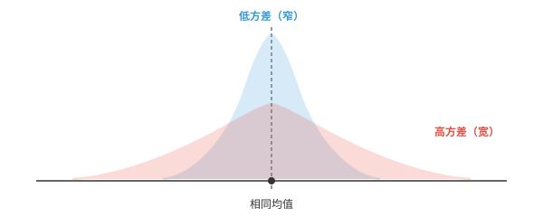
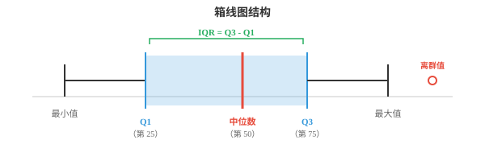
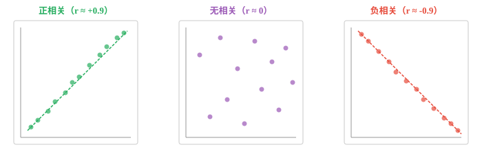

# 统计量（Statistical Measures）

*统计量以单个数值汇总数据的离散程度、位置、形状和关联关系。本节介绍方差、标准差、四分位数、偏度、峰度、协方差、相关系数和 z 分数，它们构成 ML 探索性数据分析和特征工程的工具集。*

- 上一节将矩介绍为一组汇总统计量。本节展开由它们导出的实用工具：离散程度、位置、形状和关联关系的度量。

- **离散程度（dispersion）**回答一个问题：数据分散得有多开？两个班级可以有相同的平均考试分数，却有截然不同的分散程度。



- 窄的蓝色分布方差低：大部分数值紧密聚集在均值附近。宽的红色分布方差高：数值分散得更远。

- **方差（variance）**是各数值与均值距离平方的平均值。取平方是为了避免正、负偏差彼此抵消。

$$\sigma^2 = \frac{1}{N} \sum_{i=1}^{N} (x_i - \mu)^2$$

- 处理样本，即不是完整总体时，应除以 $N - 1$ 而不是 $N$。这一修正称为贝塞尔校正（Bessel's correction），它考虑到样本通常会低估真实变异程度：

$$s^2 = \frac{1}{N-1} \sum_{i=1}^{N} (x_i - \bar{x})^2$$

- **标准差（standard deviation）**是方差的平方根：$\sigma = \sqrt{\sigma^2}$。它使度量回到原始单位。若数据单位是厘米，方差单位为 cm$^2$，标准差则重新为 cm。

- **平均绝对偏差（Mean Absolute Deviation，MAD）**是更简单的替代指标。它不平方，而是取每个偏差的绝对值：

$$\text{MAD} = \frac{1}{N} \sum_{i=1}^{N} |x_i - \mu|$$

- MAD 比方差对离群值更稳健，因为它不会通过平方放大大偏差。不过方差在数学上更便于处理，在证明和 ML 优化中都能很好地分解。

- **位置（position）**回答另一个问题：某个特定值相对于其余数据处在什么位置？

- **四分位数（quartiles）**将排序后的数据分为四个相等部分。Q1，即第 25 百分位数，是其下方包含 25% 数据的数值；Q2 是中位数，即第 50 百分位数；Q3 是第 75 百分位数。

- **四分位距（Interquartile Range，IQR）**为 $Q3 - Q1$。它描述中间 50% 数据的离散程度，忽略极端值。



- 箱线图是统计学中最有用的可视化之一。箱体从 Q1 延伸到 Q3，内部的线是中位数；须延伸到最极端的非离群值，须之外的点就是离群值。

- **百分位数（percentiles）**推广了四分位数。第 $p$ 百分位数是其下方包含 $p\%$ 个观测值的数值。Q1 是第 25 百分位数，中位数是第 50 百分位数，Q3 是第 75 百分位数。

- **z 分数（z-score）**告诉你一个值距离均值有多少个标准差：

$$z = \frac{x - \mu}{\sigma}$$

- z 分数为 2 表示该值高于均值 2 个标准差；z 分数为 $-1.5$ 表示低于均值 1.5 个标准差。这也称为**标准化（standardisation）**，在 ML 特征缩放中广泛使用，因为它将任意分布转换为均值为 0、标准差为 1 的形式。

- **形状（shape）**描述分布在中心和离散程度之外的几何特征。

- **偏度（skewness）**，即上一节的标准化第三阶矩，度量不对称性。完全对称的分布，例如正态曲线，偏度为零。正偏度表示右尾更长，例如收入分布；负偏度表示左尾更长，例如退休年龄。

$$\text{Skewness} = \frac{1}{N} \sum_{i=1}^{N} \left(\frac{x_i - \mu}{\sigma}\right)^3$$

- **峰度（kurtosis）**，即标准化第四阶矩，度量尾部的厚重程度。正态分布的峰度为 3。尾部更重，即更容易出现离群值的分布，峰度大于 3。

$$\text{Kurtosis} = \frac{1}{N} \sum_{i=1}^{N} \left(\frac{x_i - \mu}{\sigma}\right)^4$$

- **相关（correlation）**度量两个变量间关系的强度与方向。它回答：当一个变量升高时，另一个变量倾向于升高、降低，还是没有规律？



- **皮尔逊相关系数（Pearson correlation）**，记为 $r$，度量*线性*关联。其范围从 $-1$，即完全负相关，经 $0$，即无相关，到 $+1$，即完全正相关。

$$r = \frac{\sum_{i=1}^{N} (x_i - \bar{x})(y_i - \bar{y})}{\sqrt{\sum (x_i - \bar{x})^2} \cdot \sqrt{\sum (y_i - \bar{y})^2}}$$

- 回忆第 1 章的点积：皮尔逊相关系数本质上是均值中心化后 $\mathbf{x}$ 和 $\mathbf{y}$ 的余弦相似度。

- **斯皮尔曼相关系数（Spearman correlation）**，记为 $\rho$，度量*单调*关联。它不直接使用原始值，而是先为它们排名，再在秩上计算皮尔逊相关系数。因此它对离群值更稳健，并且只要关系始终递增或递减，即使该关系非线性也能适用。

- **几何平均数（geometric mean）**适用于数值相乘的情形，例如增长率。若投资依次增长 10%、20% 和 30%，平均增长因子不是这些增长率的算术平均数，而应计算：

$$\bar{x}_{\text{geo}} = \left(\prod_{i=1}^{N} x_i\right)^{1/N}$$

- 对增长率而言，先将百分比转换为因子，即 1.10、1.20、1.30，计算几何平均数后再减去 1。

- **指数移动平均（Exponential Moving Average，EMA）**对近期观测赋予更大权重。不同于窗口内每个点权重相同的简单移动平均，EMA 以指数方式衰减：

$$\text{EMA}_t = \alpha \cdot x_t + (1 - \alpha) \cdot \text{EMA}_{t-1}$$

- 平滑系数 $\alpha$，取值在 0 与 1 之间，控制旧观测失去影响力的速度。$\alpha$ 越高，对近期变化的响应越快；$\alpha$ 越低，曲线越平滑。在 ML 中，EMA 用于 Adam 等优化器以及批量归一化的运行统计量。

- **离群值检测（outlier detection）**识别与其余数据异常疏远的数据点。两种常见方法：
    - **IQR 方法**：若一个点低于 $Q1 - 1.5 \times \text{IQR}$ 或高于 $Q3 + 1.5 \times \text{IQR}$，它就是离群值。
    - **z 分数方法**：若 $|z| > 3$，即距离均值超过 3 个标准差，一个点就是离群值。

- IQR 方法更稳健，因为它不假定数据服从正态分布。z 分数方法在数据近似正态时效果良好，但分布严重偏斜时可能失效。

## 编程任务（使用 CoLab 或 notebook）

1. 为一个数据集计算方差、标准差和 MAD 并作比较。加入一个极端离群值，观察变化。
```python
import jax.numpy as jnp

data = jnp.array([4, 8, 6, 5, 3, 7, 9, 5, 6, 7], dtype=jnp.float32)

mean = jnp.mean(data)
variance = jnp.var(data)
std = jnp.std(data)
mad = jnp.mean(jnp.abs(data - mean))

print("Original data:")
print(f"  Variance: {variance:.3f}, Std: {std:.3f}, MAD: {mad:.3f}")

# Add an outlier and recompute
data_outlier = jnp.append(data, 100.0)
mean2 = jnp.mean(data_outlier)
print(f"\nWith outlier (100):")
print(f"  Variance: {jnp.var(data_outlier):.3f}, Std: {jnp.std(data_outlier):.3f}, MAD: {jnp.mean(jnp.abs(data_outlier - mean2)):.3f}")
```

2. 计算两个变量的皮尔逊相关系数和斯皮尔曼相关系数。尝试不同的变量关系。
```python
import jax
import jax.numpy as jnp

# Perfect linear relationship
x = jnp.array([1, 2, 3, 4, 5, 6, 7, 8], dtype=jnp.float32)
y = 2 * x + 1  # try changing this!

def pearson(a, b):
    a_c = a - jnp.mean(a)
    b_c = b - jnp.mean(b)
    return jnp.sum(a_c * b_c) / (jnp.sqrt(jnp.sum(a_c**2)) * jnp.sqrt(jnp.sum(b_c**2)))

def spearman(a, b):
    rank_a = jnp.argsort(jnp.argsort(a)).astype(jnp.float32)
    rank_b = jnp.argsort(jnp.argsort(b)).astype(jnp.float32)
    return pearson(rank_a, rank_b)

print(f"Pearson r:  {pearson(x, y):.4f}")
print(f"Spearman ρ: {spearman(x, y):.4f}")
```

3. 同时使用 IQR 和 z 分数方法实现离群值检测，再在偏斜数据上比较其结果。
```python
import jax.numpy as jnp

data = jnp.array([2, 3, 3, 4, 5, 5, 5, 6, 6, 7, 50], dtype=jnp.float32)

# IQR method
q1, q3 = jnp.percentile(data, 25), jnp.percentile(data, 75)
iqr = q3 - q1
lower, upper = q1 - 1.5 * iqr, q3 + 1.5 * iqr
iqr_outliers = data[(data < lower) | (data > upper)]
print(f"IQR bounds: [{lower:.1f}, {upper:.1f}]")
print(f"IQR outliers: {iqr_outliers}")

# Z-score method
z_scores = (data - jnp.mean(data)) / jnp.std(data)
z_outliers = data[jnp.abs(z_scores) > 3]
print(f"\nZ-scores: {z_scores}")
print(f"Z-score outliers (|z| > 3): {z_outliers}")
```

4. 在含噪数据上，用不同的平滑系数计算并绘制指数移动平均。
```python
import jax.numpy as jnp
import matplotlib.pyplot as plt

# Generate noisy data
key = __import__("jax").random.PRNGKey(0)
noise = __import__("jax").random.normal(key, shape=(50,))
signal = jnp.linspace(0, 5, 50) + noise

def ema(data, alpha):
    result = jnp.zeros_like(data)
    result = result.at[0].set(data[0])
    for t in range(1, len(data)):
        result = result.at[t].set(alpha * data[t] + (1 - alpha) * result[t - 1])
    return result

plt.figure(figsize=(10, 4))
plt.plot(signal, "o", alpha=0.3, label="raw data", color="#999")
for alpha, color in [(0.1, "#e74c3c"), (0.3, "#3498db"), (0.7, "#27ae60")]:
    plt.plot(ema(signal, alpha), label=f"α={alpha}", color=color, linewidth=2)
plt.legend()
plt.title("EMA with different smoothing factors")
plt.show()
```
