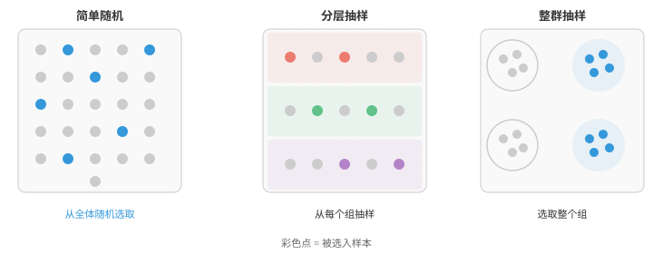
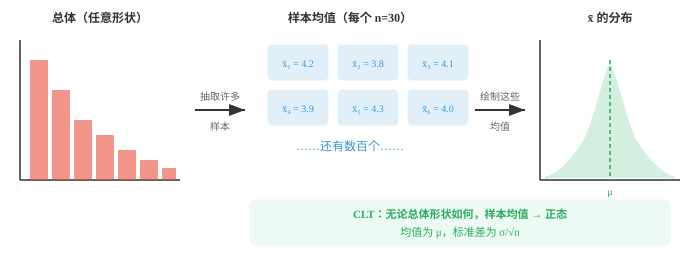

# 抽样（Sampling）

*抽样决定我们如何收集数据，并直接决定每一项结论的质量。本节介绍随机抽样、分层抽样、整群抽样和系统抽样、抽样分布、大数定律和自助法，它们是 ML 训练/测试集划分和数据集整理的关键方法。*

- 在理想世界中，你会测量所关心群体中的每一名成员。现实中这几乎不可能。你无法调查每一位选民、测试每一个灯泡或扫描每一位病人，因此需要抽取一个**样本（sample）**，并用它了解整体。

- **总体（population）**是你想研究的全部个体或项目；**样本**是你实际观测到的其中一个子集。

- **参数（parameter）**是描述总体的数值，例如一个国家全体成年人的真实平均身高。

- **统计量（statistic）**是由样本计算得到的数值，例如测量到的 500 人的平均身高。统计量用于估计参数。

- 结论的质量完全取决于样本的选取方式。无论分析多么复杂，带偏样本都会导致带偏结论。

- **抽样框（sampling frame）**是实际从中抽取样本的全体个体名单。理想状态下，它与总体完全一致；现实中通常存在缺口。

- 例如，用电话调查人群时，所有没有电话的人都会被遗漏。抽样框与总体之间的差异称为**覆盖误差（coverage error）**。

- **抽样误差（sampling error）**是样本统计量与总体参数之间自然存在的差异。

- 即使完全随机的样本也不会与总体精确一致。样本越大，抽样误差越小。

- 抽样大体分为两类：概率抽样和非概率抽样。

- **概率抽样（probability sampling）**表示总体中的每个成员都有已知且非零的入选概率。它使我们能够量化不确定性并推广结果。

- **简单随机抽样（simple random sampling）**：每个个体有相同的入选概率，大小为 $n$ 的每个可能样本也等可能出现。可以把所有名字放进帽子里，再盲抽。

- **分层抽样（stratified sampling）**：按共同特征，例如年龄段、地区，将总体划分为互不重叠的组，即层，再从每一层随机抽样。这保证每个群体都有代表，并在各层之间存在差异时降低方差。

- **整群抽样（cluster sampling）**：将总体划分为若干组，即群，随机选中一些群，再纳入所选群内的所有成员。当总体在地理上分散时，这很实用，例如抽取整所学校，而不是抽取一个学区内分散的个别学生。

- **系统抽样（systematic sampling）**：随机选定起点，再从名单中每隔 $k$ 个选取一人。例如从第 7 人开始，再取每第 10 人，即 7、17、27、……。它实现简单，但名单有隐藏规律时可能引入偏差。



- **非概率抽样（non-probability sampling）**不为每个成员提供已知的入选概率。其结果不能严格推广，但这些方法通常更快、更便宜。

- **便利抽样（convenience sampling）**：选择最容易接触到的人。在商场调查很方便，但会遗漏不在该商场购物的人。

- **配额抽样（quota sampling）**：类似分层抽样，但没有随机性。研究者通过从每个群体中选择容易接触的对象来填满配额，例如 50 名男性和 50 名女性。

- **滚雪球抽样（snowball sampling）**：从少量参与者开始，请他们招募其他参与者。它适合难以接触的人群，例如研究罕见疾病，但会严重偏向彼此有联系的个体。

- 有了抽样方法后，自然会问：若换一个样本，得到的统计量会不同吗？答案几乎肯定是会。**抽样分布（sampling distribution）**是同一大小的所有可能样本中，某个统计量，例如样本均值，所形成的分布。

- 想象抽取 1,000 个不同的、每个包含 30 人的样本，再计算各样本的平均身高。这 1,000 个均值形成一个分布。有些略高于真实总体均值，有些略低，大多数则聚集在真实值附近。

- 该抽样分布的标准差称为**标准误（standard error）**：

$$SE = \frac{\sigma}{\sqrt{n}}$$

- 注意，随着 $n$ 增大，标准误会缩小。样本更大，估计就更精确。样本量增至四倍，标准误会减半。

- 统计学中最重要的结果是**中心极限定理（Central Limit Theorem，CLT）**。它说：无论原始总体的形状如何，随着样本量增加，样本均值的分布都会趋近正态分布。



- 更精确地说，若 $X_1, X_2, \ldots, X_n$ 是来自任意一个均值为 $\mu$、有限方差为 $\sigma^2$ 的分布的独立观测，随着 $n$ 增大：

$$\bar{X} \approx \text{Normal}\!\left(\mu, \frac{\sigma^2}{n}\right)$$

- 中心极限定理使大部分推断统计成为可能。只要样本足够大，即使底层数据并不服从正态分布，它也让我们能将正态分布作为近似。

- 多大才算“足够大”？常见经验法则是 $n \ge 30$，但这取决于总体偏离正态的程度。高度偏斜的分布可能需要更大的样本；大致对称的总体即使 $n = 10$ 也可能足够。

- 中心极限定理有三个关键条件：
    - **独立性（independence）**：每个观测不能影响其他观测。
    - **有限方差（finite variance）**：总体方差必须存在，排除一些特殊的分布。
    - **同分布（identical distribution）**：所有观测来自同一个分布。

## 编程任务（使用 CoLab 或 notebook）

1. 直观演示 CLT：从高度偏斜的分布中抽样，计算样本均值，观察均值直方图如何变成钟形。
```python
import jax
import jax.numpy as jnp
import matplotlib.pyplot as plt

key = jax.random.PRNGKey(0)

# Exponential distribution (very skewed)
population = jax.random.exponential(key, shape=(100_000,))

fig, axes = plt.subplots(1, 4, figsize=(14, 3))
sample_sizes = [1, 5, 30, 100]

for ax, n in zip(axes, sample_sizes):
    keys = jax.random.split(key, 2000)
    means = jnp.array([jax.random.choice(k, population, shape=(n,)).mean() for k in keys])
    ax.hist(means, bins=40, color="#3498db", alpha=0.7, density=True)
    ax.set_title(f"n = {n}")
    ax.set_xlim(0, 4)

fig.suptitle("CLT: sample means become normal as n increases", fontsize=13)
plt.tight_layout()
plt.show()
```

2. 比较简单随机抽样和分层抽样。构造由不同群体组成的总体，说明分层抽样能使估计的方差更低。
```python
import jax
import jax.numpy as jnp

key = jax.random.PRNGKey(42)

# Population: two distinct groups
group_a = jax.random.normal(key, shape=(500,)) + 10   # mean ~10
key, subkey = jax.random.split(key)
group_b = jax.random.normal(subkey, shape=(500,)) + 20  # mean ~20
population = jnp.concatenate([group_a, group_b])

# Simple random sampling: 1000 trials, sample size 20
srs_means = []
for i in range(1000):
    key, subkey = jax.random.split(key)
    sample = jax.random.choice(subkey, population, shape=(20,), replace=False)
    srs_means.append(sample.mean())
srs_means = jnp.array(srs_means)

# Stratified sampling: 10 from each group
strat_means = []
for i in range(1000):
    key, k1, k2 = jax.random.split(key, 3)
    s_a = jax.random.choice(k1, group_a, shape=(10,), replace=False)
    s_b = jax.random.choice(k2, group_b, shape=(10,), replace=False)
    strat_means.append(jnp.concatenate([s_a, s_b]).mean())
strat_means = jnp.array(strat_means)

print(f"Simple Random - Mean: {srs_means.mean():.3f}, Std: {srs_means.std():.3f}")
print(f"Stratified    - Mean: {strat_means.mean():.3f}, Std: {strat_means.std():.3f}")
print(f"Stratified sampling reduced variance by {(1 - strat_means.var()/srs_means.var())*100:.1f}%")
```

3. 探索样本量如何影响标准误。绘制标准误与样本量的关系，并确认 $1/\sqrt{n}$ 关系。
```python
import jax
import jax.numpy as jnp
import matplotlib.pyplot as plt

key = jax.random.PRNGKey(7)
population = jax.random.normal(key, shape=(50_000,)) * 10 + 50

sample_sizes = [5, 10, 20, 50, 100, 200, 500, 1000]
std_errors = []

for n in sample_sizes:
    means = []
    for _ in range(500):
        key, subkey = jax.random.split(key)
        sample = jax.random.choice(subkey, population, shape=(n,))
        means.append(sample.mean())
    std_errors.append(jnp.array(means).std())

plt.figure(figsize=(8, 4))
plt.plot(sample_sizes, std_errors, "o-", color="#e74c3c", label="Observed SE")
theoretical = population.std() / jnp.sqrt(jnp.array(sample_sizes, dtype=jnp.float32))
plt.plot(sample_sizes, theoretical, "--", color="#3498db", label="σ/√n (theoretical)")
plt.xlabel("Sample size (n)")
plt.ylabel("Standard error")
plt.legend()
plt.title("Standard error shrinks with larger samples")
plt.show()
```
