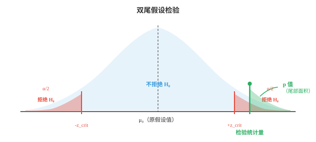
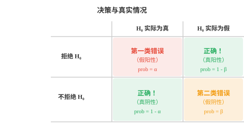

# 假设检验（Hypothesis Testing）

*假设检验提供严谨框架，用于判断观察到的效应是真实存在还是由偶然造成。本节介绍原假设与备择假设、p 值、显著性水平、t 检验、卡方检验、方差分析（ANOVA）、第一类与第二类错误。这套逻辑同样用于 A/B 测试、模型比较和科研。*

- 统计学不只是描述数据。人们经常需要作出决策：一种新药有效吗？一个算法比另一个更快吗？平均值改变了吗？假设检验为用数据回答这类问题提供结构化框架。

- 思路很简单：先假定没有改变，即“原假设”，再检查数据是否极端到足以让这个假定难以置信。

- **原假设（null hypothesis）**，记为 $H_0$，是默认主张，通常表示“没有效应”或“没有差异”。例如：“平均配送时间仍为 30 分钟”或“新模型并不优于旧模型”。

- **备择假设（alternative hypothesis）**，记为 $H_1$ 或 $H_a$，是你认为可能成立的另一种主张，例如：“平均配送时间改变了”或“新模型更好”。

- 你不会直接证明 $H_1$。相反，你会问：若 $H_0$ 为真，观察到如此极端数据的可能性有多大？若这种可能性很低，就拒绝 $H_0$，支持 $H_1$。

- **检验统计量（test statistic）**是汇总样本结果偏离 $H_0$ 预测程度的单个数值。不同检验使用不同公式，但逻辑一致：度量观察值和期望值之间的距离。

- **p 值（p-value）**是在 $H_0$ 为真的前提下，观察到至少与当前检验统计量一样极端结果的概率。p 值小，意味着数据在 $H_0$ 下很令人意外。

- **显著性水平（significance level）**，记为 $\alpha$，是在查看数据前设定的阈值。若 $p \le \alpha$，就拒绝 $H_0$。常用选择为 $\alpha = 0.05$，即 5%，和 $\alpha = 0.01$，即 1%。



- 阴影两端是拒绝域。若检验统计量落入其中，数据在 $H_0$ 下已足够意外，因此拒绝它。绿色区域显示某一特定检验统计量对应的 p 值。

- 步骤如下：
    - **第 1 步**：陈述 $H_0$ 和 $H_1$。
    - **第 2 步**：选择显著性水平 $\alpha$。
    - **第 3 步**：收集数据，计算检验统计量。
    - **第 4 步**：求 p 值，或将检验统计量与临界值比较。
    - **第 5 步**：若 $p \le \alpha$，拒绝 $H_0$；否则，不拒绝 $H_0$。

- **计算示例**：一家工厂声称其螺栓的平均长度为 10 cm。你测量 36 个螺栓，样本均值为 10.3 cm，已知总体标准差为 0.9 cm。是否有证据表明均值已改变？

- $H_0$：$\mu = 10$，$H_1$：$\mu \neq 10$，$\alpha = 0.05$。

- 检验统计量，使用 z 检验，因为 $\sigma$ 已知且 $n$ 足够大：

$$z = \frac{\bar{x} - \mu_0}{\sigma / \sqrt{n}} = \frac{10.3 - 10}{0.9 / \sqrt{36}} = \frac{0.3}{0.15} = 2.0$$

- 对 $\alpha = 0.05$ 的双尾检验，临界值为 $\pm 1.96$。这里 $z = 2.0 > 1.96$，因此拒绝 $H_0$。p 值约为 0.046，小于 0.05。

- 结论：有统计显著证据表明平均螺栓长度与 10 cm 不同。

- **单尾检验（one-tailed test）**只检验一个特定方向的效应，例如 $H_1$：$\mu > 10$ 或 $\mu < 10$。全部 $\alpha$ 放在一个尾部，使该方向上更容易拒绝 $H_0$，但无法检测相反方向的效应。

- **双尾检验（two-tailed test）**检验任何差异，即 $H_1$：$\mu \neq 10$。$\alpha$ 在两个尾部分配，每侧为 $\alpha/2$。它更保守，但能发现任一方向的效应。

- 即使程序良好，也会犯错。错误恰好有两类：



- **第一类错误（Type I Error）**，即假阳性：$H_0$ 实际为真时仍拒绝它。其概率为 $\alpha$，可通过选择显著性水平控制。就像没有火灾时火警却响起。

- **第二类错误（Type II Error）**，即假阴性：$H_0$ 实际为假时却未拒绝它。其概率为 $\beta$。就像真的发生火灾时火警保持沉默。

- **检验功效（power）**为 $1 - \beta$，即正确拒绝错误 $H_0$ 的概率。功效越高，越善于发现真实效应。以下情况会提高功效：
    - 真实效应量更大，较大的差异更容易发现。
    - 样本量更大，更多数据意味着更高精度。
    - 显著性水平 $\alpha$ 更大，但这会提高第一类错误风险。
    - 变异性更低，即噪声更小。

- 第一类错误与第二类错误之间存在权衡。降低 $\alpha$，即对假阳性更谨慎，会提高 $\beta$，即增加假阴性。在固定样本量下，无法同时最小化两者。

- **参数检验（parametric tests）**假定数据服从特定分布，通常为正态分布。假定成立时，它们的检验功效更高。

- **Z 检验（Z-test）**：在 $\sigma$ 已知且 $n$ 足够大，$n \ge 30$ 时，将样本均值与已知值比较。检验统计量为：

$$z = \frac{\bar{x} - \mu_0}{\sigma / \sqrt{n}}$$

- **T 检验（T-test）**：类似 z 检验，但适用于 $\sigma$ 未知，需要由样本估计，或 $n$ 较小的情况。它使用 t 分布，其尾部比正态分布更厚，以反映估计 $\sigma$ 带来的额外不确定性。

$$t = \frac{\bar{x} - \mu_0}{s / \sqrt{n}}$$

- t 分布有一个称为**自由度（degrees of freedom）**的参数，$df = n - 1$。随着 $df$ 增大，t 分布趋近正态分布。

- t 检验有多种形式：
    - **单样本 t 检验（one-sample t-test）**：样本均值是否不同于某个特定值？
    - **独立双样本 t 检验（independent two-sample t-test）**：两个独立组的均值是否不同？
    - **配对 t 检验（paired t-test）**：两项相关测量的均值是否不同，例如同一受试者治疗前后？

- **方差分析（Analysis of Variance，ANOVA）**：检验三个或更多组的均值是否相等。ANOVA 不会运行多个 t 检验，因为那会抬高第一类错误率；它通过比较组间方差和组内方差进行一次检验。

$$F = \frac{\text{variance between groups}}{\text{variance within groups}}$$

- 较大的 $F$ 比值表示组间差异大于仅由随机变异所能预期的程度。

- **非参数检验（non-parametric tests）**对数据分布作出较少假设。它们处理秩而非原始值，因此对离群值和非正态性更稳健。

- **卡方检验（Chi-square test）**，记为 $\chi^2$：检验观察频数是否与期望频数相符。它用于分类数据。例如，红、蓝、绿三色汽车的比例是否符合制造商声称的比例？

$$\chi^2 = \sum \frac{(O_i - E_i)^2}{E_i}$$

- **Mann-Whitney U 检验**：独立双样本 t 检验的非参数替代方法。它通过比较秩来检验一个组的数值是否倾向于大于另一个组。

- **Wilcoxon 符号秩检验（Wilcoxon signed-rank test）**：配对 t 检验的非参数替代方法。它通过差异的大小和方向比较配对观测。

- **Kruskal-Wallis 检验**：单因素 ANOVA 的非参数替代方法。它通过比较所有组的秩，检验多个组是否来自同一分布。

- **拟合优度检验（goodness-of-fit tests）**检查数据是否服从某个特定理论分布。卡方拟合优度检验会将观察到的分组计数与假设分布下的期望计数进行比较。

- **正态性检验（normality tests）**专门检查数据是否呈正态分布。常见方法包括 Shapiro-Wilk 检验，适合小样本且功效高，和 Kolmogorov-Smirnov 检验，它将样本 CDF 与理论 CDF 比较。

- 在 ML 中，比较模型性能时会用到假设检验。若模型 A 的准确率为 92%，模型 B 为 91%，这项差异是真实的还是噪声？对交叉验证分数做配对 t 检验可以回答它。

## 编程任务（使用 CoLab 或 notebook）

1. 对文中螺栓工厂示例进行 z 检验。计算检验统计量、p 值，并作出决策。
```python
import jax.numpy as jnp

x_bar = 10.3    # sample mean
mu_0 = 10.0     # null hypothesis value
sigma = 0.9     # known population std
n = 36           # sample size
alpha = 0.05

# Test statistic
z = (x_bar - mu_0) / (sigma / jnp.sqrt(n))
print(f"z = {z:.4f}")

# p-value (two-tailed) using the normal CDF approximation
# For |z| = 2.0, p ≈ 0.0456
from jax.scipy.stats import norm
p_value = 2 * (1 - norm.cdf(jnp.abs(z)))
print(f"p-value = {p_value:.4f}")
print(f"Reject H₀? {p_value <= alpha}")
```

2. 模拟第一类错误：$H_0$ 为真时，我们会多频繁地错误拒绝它？运行 10,000 次试验，检查拒绝率是否与 $\alpha$ 相符。
```python
import jax
import jax.numpy as jnp

key = jax.random.PRNGKey(0)
mu_0 = 50.0
sigma = 10.0
n = 30
alpha = 0.05
n_experiments = 10_000

rejections = 0
for i in range(n_experiments):
    key, subkey = jax.random.split(key)
    sample = mu_0 + sigma * jax.random.normal(subkey, shape=(n,))
    z = (sample.mean() - mu_0) / (sigma / jnp.sqrt(n))
    p_value = 2 * (1 - __import__("jax").scipy.stats.norm.cdf(jnp.abs(z)))
    if p_value <= alpha:
        rejections += 1

print(f"Rejection rate: {rejections/n_experiments:.4f}")
print(f"Expected (α):   {alpha}")
```

3. 在两个组上比较 t 检验和 Mann-Whitney U 检验。生成一个组均值略高的数据，观察哪种检验能够检测到差异。
```python
import jax
import jax.numpy as jnp

key = jax.random.PRNGKey(99)
k1, k2 = jax.random.split(key)

group_a = jax.random.normal(k1, shape=(25,)) * 5 + 100
group_b = jax.random.normal(k2, shape=(25,)) * 5 + 103  # slightly higher mean

# Two-sample t-test (equal variance assumed)
n_a, n_b = len(group_a), len(group_b)
mean_a, mean_b = group_a.mean(), group_b.mean()
pooled_var = ((n_a - 1) * group_a.var() + (n_b - 1) * group_b.var()) / (n_a + n_b - 2)
se = jnp.sqrt(pooled_var * (1/n_a + 1/n_b))
t_stat = (mean_a - mean_b) / se
print(f"T-test statistic: {t_stat:.4f}")

# Mann-Whitney: count how often group_a values beat group_b values
u_stat = jnp.sum(group_a[:, None] < group_b[None, :])
print(f"Mann-Whitney U:   {u_stat}")
print(f"\nGroup A mean: {mean_a:.2f}, Group B mean: {mean_b:.2f}")
```
