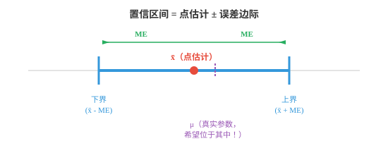
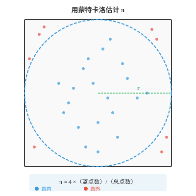

# 统计推断（Statistical Inference）

*统计推断超越“是/否”决策，在量化不确定性的前提下估计总体参数。本节介绍置信区间、点估计与区间估计、最大似然估计、矩估计法和回归分析，它们是连接 ML 原始数据与预测模型的桥梁。*

- 假设检验给出的是“拒绝”或“不拒绝”的决策。但人们通常还想知道更丰富的信息，例如所估计参数的合理取值范围。这正是**置信区间（confidence intervals）**提供的内容。

!!! note "大白话"
    假设检验只回答证据够不够反驳某个说法，置信区间进一步告诉你估计值大概落在多宽的范围内。

- **点估计（point estimate）**是从样本计算出的一个数，例如样本均值 $\bar{x}$。它是对总体参数的最佳猜测，但单独来看，无法体现估计的精确程度。

!!! note "大白话"
    点估计给出一个最方便的单一答案，但不告诉你这个答案有多不稳；同样的均值可能来自 5 人，也可能来自 5 万人。

- **置信区间（confidence interval）**在点估计周围加入反映不确定性的范围，形式为：

!!! note "大白话"
    置信区间把“估计是 170”变成“估计大约在这段范围内”，同时把抽样带来的不确定性写出来。

$$\text{CI} = \bar{x} \pm \text{ME}$$

- **误差边际（margin of error，ME）**取决于三件事：你希望达到的置信程度、数据中的变异大小，以及样本量：

!!! note "大白话"
    想更有把握就要留更宽余地，数据越乱也要留更宽余地；样本越多则能把这份余地缩小。

$$\text{ME} = z^\ast \cdot \frac{\sigma}{\sqrt{n}}$$

- 其中 $z^\ast$ 是与目标置信水平对应的正态分布临界值。95% 置信水平时 $z^\ast = 1.96$；99% 置信水平时 $z^\ast = 2.576$。

!!! note "大白话"
    置信水平越高，临界值越大，区间就越宽，因为要给更多可能的抽样波动留出空间。



- **95% 置信区间**表示：若重复实验许多次，每次都构造一个区间，大约 95% 的区间会包含真实总体参数。它并不表示这个特定区间包含参数的概率是 95%。参数是固定的，变化的是区间。

!!! note "大白话"
    参数只有一个固定真值，不会在每次计算后随机移动；反复抽样时变的是我们画出的区间，95% 说的是这套作图方法的长期命中率。

- **计算示例**：测量 50 人身高，得到 $\bar{x} = 170$ cm，$\sigma = 8$ cm。构造一个 95% 置信区间。

!!! note "大白话"
    样本均值 170 cm 是中心点，下面用已知的波动程度和样本量，计算它周围应保留多宽的范围。

$$\text{ME} = 1.96 \cdot \frac{8}{\sqrt{50}} = 1.96 \cdot 1.131 = 2.22 \text{ cm}$$

$$\text{CI} = [170 - 2.22, \; 170 + 2.22] = [167.78, \; 172.22]$$

- 可以以 95% 的置信度说，真实平均身高位于 167.78 到 172.22 cm 之间。

!!! note "大白话"
    更严谨地说，按这种方法反复抽样构造的区间中，约 95% 会罩住真实均值；这次算出的区间是其中一个具体结果。

- $\sigma$ 未知时，这是更常见的情形，使用样本标准差 $s$ 和 t 分布：

!!! note "大白话"
    现实里总体标准差往往不知道，只能用样本自己估计，所以要改用更谨慎的 t 分布。

$$\text{CI} = \bar{x} \pm t^\ast_{n-1} \cdot \frac{s}{\sqrt{n}}$$

- 更宽的区间置信程度更高但精度更低；更窄的区间精度更高但置信程度更低。增大样本量可以在不降低置信程度的情况下缩窄区间。

!!! note "大白话"
    想要同样样本下更高把握，就得接受更宽范围；真正能同时保持高把握又变精确的办法是收集更多数据。

- **功效分析（power analysis）**帮助你在实验开始前进行规划。问题是：要以指定的功效检测给定大小的效应，需要多大的样本？

!!! note "大白话"
    不要实验做完才发现样本太少。功效分析在开始前倒推：想抓住多大的差异，需要准备多少数据。

- 回忆上一节，功效为 $1 - \beta$，即正确拒绝错误 $H_0$ 的概率。常见目标是 80% 功效。

!!! note "大白话"
    80% 功效意味着如果真实效应确实达到目标大小，重复做同样实验时大约有 80% 能检出它，仍会有约 20% 漏掉。

- 对于要在显著性 $\alpha$、功效 $1-\beta$ 下检测差异 $\delta$ 的 z 检验，所需样本量为：

!!! note "大白话"
    这个公式把误报要求、想检测的最小差异、数据噪声和目标功效放在一起，换算成需要多少样本。

$$n = \left(\frac{(z_{\alpha/2} + z_{\beta}) \cdot \sigma}{\delta}\right)^2$$

- 例如，要以 $\alpha = 0.05$ 和 80% 功效，即 $z_{0.025} = 1.96$、$z_{0.20} = 0.84$，检测平均身高 2 cm 的差异，且 $\sigma = 8$：

!!! note "大白话"
    要从标准差 8 cm 的噪声里可靠看出仅 2 cm 的差别，需要的样本不会很小，因为目标信号相对噪声较弱。

$$n = \left(\frac{(1.96 + 0.84) \cdot 8}{2}\right)^2 = \left(\frac{22.4}{2}\right)^2 = 11.2^2 \approx 126$$

- 每组大约需要 126 人。

!!! note "大白话"
    这里的 126 是每个比较组的大致人数，不是两组加起来 126 人；具体设计改变后还要重新计算。

- 功效分析能避免两种常见错误：实验太小而无法检测真实效应，即功效不足；或实验远大于必要规模，浪费资源，即功效过度。

!!! note "大白话"
    样本太少容易得出“没显著”却其实看不出来，样本过多又浪费成本；功效分析是在两种浪费之间找合适规模。

- **蒙特卡洛方法（Monte Carlo methods）**通过随机抽样解决难以或无法解析求解的问题。核心思想是：若无法精确计算某个量，就多次模拟，再用结果作为近似。

!!! note "大白话"
    遇到公式算不动的问题，就让计算机按规则随机试很多次，用大量结果的平均表现逼近答案。

- 该名称来自蒙特卡洛赌场，指向随机性的作用。蒙特卡洛方法是 ML 的重要工具，用于估计积分、评估模型不确定性和近似复杂分布等任务。

!!! note "大白话"
    它靠的是大量随机试验，而不是一次精准命中。试验越多，随机起伏通常越会相互抵消。

- 蒙特卡洛的一般步骤：

!!! note "大白话"
    先定义怎样随机产生情况，再对每种情况计算结果，最后把许多结果汇总成需要的估计。

    - 定义可能输入的范围。

        !!! note "大白话"
            先明确随机点可以落在哪里，这个范围必须和要估计的问题对应。
    - 从该范围生成随机输入。

        !!! note "大白话"
            按设定的概率规则重复抽样，不能让某些区域被无意中抽得更多或更少。
    - 在每个输入上计算函数值。

        !!! note "大白话"
            每个随机样本都像一次小实验，记录它在目标规则下产生的结果。
    - 汇总结果，例如求平均或计数。

        !!! note "大白话"
            最后用平均、比例或计数把许多小实验压缩成一个整体估计。

- 经典示例是估计 $\pi$。设想一个边长为 2、以原点为中心的正方形，内部内接一个半径为 1 的圆。正方形面积为 4，圆面积为 $\pi$。

!!! note "大白话"
    圆占正方形的面积比例正好是 $\pi/4$，所以只要估出随机点落进圆里的比例，就能反推出 $\pi$。



- 在正方形内均匀撒下随机点。落在圆内的点所占比例近似 $\pi/4$：

!!! note "大白话"
    点撒得均匀时，数量比例会接近面积比例。圆内点越多，说明圆占正方形的面积比例越大。

$$\pi \approx 4 \times \frac{\text{points inside circle}}{\text{total points}}$$

- 点 $(x, y)$ 满足 $x^2 + y^2 \le 1$ 时在圆内。投掷的点越多，估计值越接近真实的 $\pi$。

!!! note "大白话"
    这个不等式就是判断点是否落进单位圆的规则。点数增加时估计仍会抖动，但长期会越来越贴近真实值。

- 在 ML 中，蒙特卡洛方法用于：

!!! note "大白话"
    机器学习中遇到复杂概率和无法直接求和的空间时，蒙特卡洛常用随机采样替代精确遍历。

    - **蒙特卡洛 dropout（Monte Carlo dropout）**：在启用 dropout 的状态下多次运行推理，估计预测不确定性。

        !!! note "大白话"
            同一个输入多次随机关闭不同神经元，若预测变化很大，说明模型对这个输入不够确定。
    - **MCMC（Markov Chain Monte Carlo）**：在贝叶斯模型中从复杂的后验分布抽样。

        !!! note "大白话"
            MCMC 不直接写出复杂分布的全部形状，而是构造一串相关样本，让它们长期看起来像从目标分布抽出的。
    - **策略梯度方法（policy gradient methods）**：通过采样轨迹，在强化学习中估计梯度。

        !!! note "大白话"
            智能体实际尝试很多条行动轨迹，再用这些随机体验估计哪些参数改动更可能带来更高回报。

- **因子分析（factor analysis）**用于发现解释观测变量间相关性的隐藏变量，即潜变量。若 10 个性格调查问题可由 3 种底层特质，即外向性、宜人性和尽责性解释，因子分析能找出这些特质。

!!! note "大白话"
    许多看似不同的题目可能共同受少数隐藏原因驱动。因子分析试图从它们一起变化的方式中挖出这些潜在原因。

- 该模型假定每个观测变量 $x_i$ 是少数潜在因子 $f_j$ 的线性组合再加上噪声：

!!! note "大白话"
    每个观测值被看作“几个隐藏因子的不同配比”加上一点无法解释的随机误差。

$$x_i = \lambda_{i1} f_1 + \lambda_{i2} f_2 + \ldots + \lambda_{ik} f_k + \epsilon_i$$

- $\lambda$ 的取值称为**因子载荷（factor loadings）**，表示每个观测变量与每个因子之间关系的强度。这与第 2 章矩阵分解直接相连：因子分析与特征值分解和 SVD 密切相关。

!!! note "大白话"
    因子载荷像每道题对某个隐藏特质的权重。载荷大表示这道题更能反映该因子，矩阵分解正好擅长找这种低维结构。

- **实验设计（experimental design）**是组织实验以得出有效结论的艺术。设计不佳会使再大的数据集也失去价值。

!!! note "大白话"
    数据量不能修复设计错误。没有合适对照、随机分配或明确测量目标，再多数据也可能只是在放大偏差。

- 良好实验设计的关键组成：

!!! note "大白话"
    好实验必须明确谁被改变、测量什么、拿谁作比较，以及怎样避免组间原本就不同造成误判。

    - **自变量（independent variable，IV）**：你操控的量，例如药物剂量、模型架构。

        !!! note "大白话"
            自变量是实验者主动改变的开关，用来观察这种改变会不会造成结果差异。
    - **因变量（dependent variable，DV）**：你测量的量，例如康复时间、准确率。

        !!! note "大白话"
            因变量是最终记录的结果，它随着自变量或其他因素变化，是实验真正想解释的对象。
    - **对照组（control group）**：不接受治疗或接受安慰剂，为比较提供基线。

        !!! note "大白话"
            没有对照就不知道观察到的变化是不是本来就会发生；对照组提供“如果不做处理会怎样”的基准。
    - **随机分配（random assignment）**：将参与者随机分配到各组，从而平衡未测量的混杂变量。

        !!! note "大白话"
            随机分配让已知和未知差异有机会平均分散到各组，减少“本来就不一样”被错当成处理效果。

- **常见实验设计**：

!!! note "大白话"
    不同场景下，研究对象能否重复接受处理、是否存在重要分组差异，决定适合采用哪种设计。

    - **完全随机化设计（completely randomised design）**：将受试者随机分配到处理组。组间可比时，它简单而有效。

        !!! note "大白话"
            所有人直接随机分组，操作最简单；在样本足够大且群体较均衡时，通常已经能获得公平比较。
    - **随机区组设计（randomised block design）**：先将受试者分为区组，例如按年龄，再在每个区组内随机分配处理。它降低由区组因素造成的变异，与分层抽样的思想相似。

        !!! note "大白话"
            先把年龄等重要差异相近的人放在一起，再在组内随机，能把这些已知差异从比较结果中尽量剥离。
    - **析因设计（factorial design）**：同时检验多个自变量。一个 $2 \times 3$ 析因设计中，一个变量有 2 个水平，另一个有 3 个水平，共有 6 种处理组合。它能发现**交互作用（interactions）**，即一个变量的效应取决于另一个变量的水平。

        !!! note "大白话"
            析因设计一次同时试多个开关，不只看它们各自有没有用，还能发现“开关 A 只有配合开关 B 才有用”这类交互。
    - **交叉设计（crossover design）**：每个受试者按顺序接受全部处理，中间有洗脱期。每位受试者都充当自己的对照，从而降低个体差异的影响。

        !!! note "大白话"
            同一个人体验所有方案，相当于拿自己作比较，能消掉人与人天生不同的影响；洗脱期防止上一种处理残留到下一种。

- 在 ML 实验中，这些原则非常关键。比较模型时，应控制随机种子、数据集划分和硬件。交叉验证是一种交叉设计；消融研究，即每次移除一个组件，遵循析因设计的逻辑。

!!! note "大白话"
    模型实验也会被随机种子、数据切分和机器差异干扰。控制这些条件、一次只改一个组件，才能把性能变化归因到真正改动上。

## 编程任务（使用 CoLab 或 notebook）

1. 为身高示例构造 95% 置信区间，再尝试不同的置信水平和样本量。
```python
import jax.numpy as jnp

x_bar = 170.0    # sample mean
sigma = 8.0      # population std (known)
n = 50           # sample size

# Critical values for common confidence levels
z_stars = {0.90: 1.645, 0.95: 1.960, 0.99: 2.576}

for conf, z_star in z_stars.items():
    me = z_star * (sigma / jnp.sqrt(n))
    lower, upper = x_bar - me, x_bar + me
    print(f"{conf*100:.0f}% CI: [{lower:.2f}, {upper:.2f}]  (ME = {me:.2f})")
```

2. 使用蒙特卡洛模拟估计 $\pi$。绘制随着点数增加估计值如何收敛。
```python
import jax
import jax.numpy as jnp
import matplotlib.pyplot as plt

key = jax.random.PRNGKey(42)

# Generate random points in [-1, 1] x [-1, 1]
n_points = 100_000
k1, k2 = jax.random.split(key)
x = jax.random.uniform(k1, shape=(n_points,), minval=-1, maxval=1)
y = jax.random.uniform(k2, shape=(n_points,), minval=-1, maxval=1)

# Check which points are inside the unit circle
inside = (x**2 + y**2) <= 1.0
cumulative_inside = jnp.cumsum(inside)
counts = jnp.arange(1, n_points + 1)
pi_estimates = 4.0 * cumulative_inside / counts

plt.figure(figsize=(10, 4))
plt.plot(pi_estimates, color="#3498db", alpha=0.7, linewidth=0.5)
plt.axhline(y=jnp.pi, color="#e74c3c", linestyle="--", label=f"π = {jnp.pi:.6f}")
plt.xlabel("Number of points")
plt.ylabel("Estimate of π")
plt.title("Monte Carlo estimation of π")
plt.legend()
plt.ylim(2.8, 3.5)
plt.show()

print(f"Final estimate: {pi_estimates[-1]:.6f}")
print(f"True value:     {jnp.pi:.6f}")
print(f"Error:          {abs(pi_estimates[-1] - jnp.pi):.6f}")
```

3. 做一个简单的功效分析：对给定效应量和标准差，计算所需样本量，并通过模拟验证。
```python
import jax
import jax.numpy as jnp

# Parameters
delta = 2.0      # effect size (difference in means)
sigma = 8.0      # population std
alpha = 0.05
power_target = 0.80

# Analytical sample size
z_alpha = 1.96   # two-tailed, alpha=0.05
z_beta = 0.84    # power=0.80
n_required = ((z_alpha + z_beta) * sigma / delta) ** 2
print(f"Required n per group: {n_required:.0f}")

# Verify by simulation
key = jax.random.PRNGKey(7)
n = int(jnp.ceil(n_required))
n_sims = 5000
rejections = 0

for _ in range(n_sims):
    key, k1, k2 = jax.random.split(key, 3)
    group_a = jax.random.normal(k1, shape=(n,)) * sigma + 50
    group_b = jax.random.normal(k2, shape=(n,)) * sigma + 50 + delta
    pooled_se = jnp.sqrt(2 * sigma**2 / n)
    z = (group_b.mean() - group_a.mean()) / pooled_se
    p = 2 * (1 - __import__("jax").scipy.stats.norm.cdf(jnp.abs(z)))
    if p <= alpha:
        rejections += 1

print(f"Simulated power: {rejections/n_sims:.3f}")
print(f"Target power:    {power_target:.3f}")
```

4. 可视化置信区间宽度如何随样本量变化。这说明为何收集更多数据会带来更精确的估计。
```python
import jax.numpy as jnp
import matplotlib.pyplot as plt

sigma = 8.0
z_star = 1.96  # 95% confidence

sample_sizes = jnp.array([10, 20, 30, 50, 100, 200, 500, 1000], dtype=jnp.float32)
margins = z_star * sigma / jnp.sqrt(sample_sizes)

plt.figure(figsize=(8, 4))
plt.bar([str(int(n)) for n in sample_sizes], margins, color="#3498db", alpha=0.7)
plt.xlabel("Sample size")
plt.ylabel("Margin of error (cm)")
plt.title("95% CI margin of error shrinks with larger samples")
plt.show()
```
