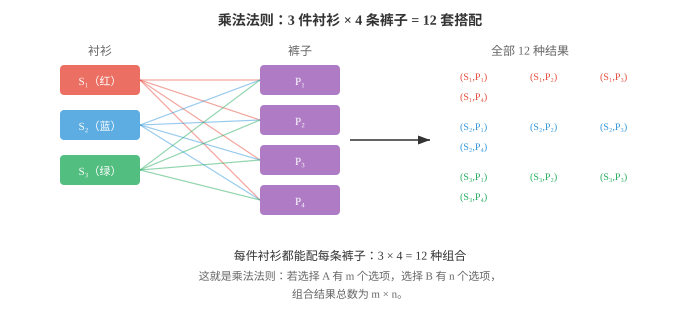
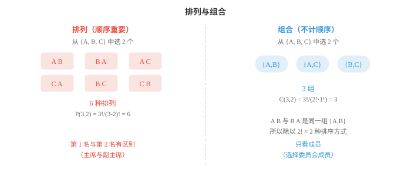

# 计数（Counting）

*计数是计算概率的前提：在赋予可能性之前，必须知道一共有多少种结果。本节介绍乘法法则、加法法则、阶乘、排列、组合和二项式系数。这些组合数学工具支撑着 ML 中的抽样、哈希和概率分析。*

- 在计算概率前，需要先计数结果。若想知道扑克牌中抽到获胜牌型的概率，首先必须知道总共有多少种可能牌型，其中多少种能获胜。计数使概率变得精确。

- 最简单的计数原理是**乘法法则（multiplication rule）**。若一个决策有 $m$ 个选项，第二个相互独立的决策有 $n$ 个选项，组合结果总数为 $m \times n$。

- 想象早晨穿衣。你有 3 件衬衫和 4 条裤子，每件衬衫都能与每条裤子搭配，因此共有 $3 \times 4 = 12$ 套可能的搭配。



- 乘法法则可扩展到任意数量的选择。若还有 2 双鞋，搭配总数变为 $3 \times 4 \times 2 = 24$。每增加一个独立选择，计数就乘一次。

- **加法法则（addition rule）**处理“或”的情形。若事件 A 可用 $m$ 种方式发生，事件 B 可用 $n$ 种方式发生，且它们不能同时发生，即互斥，那么方式总数为 $m + n$。

- 假设从城市 X 到城市 Y 可开车，有 3 条路线，或乘火车，有 2 条路线。不能同时采用两种方式，因此总选项为 $3 + 2 = 5$。

- 事件有重叠时，需要减去被重复计算的结果。若 $A$ 与 $B$ 可同时发生，计数为 $|A \cup B| = |A| + |B| - |A \cap B|$。这就是容斥原理，讨论概率加法法则时会再次出现。

- 非负整数 $n$ 的**阶乘（factorial）**是从 1 到 $n$ 的全部正整数之积：

$$n! = n \times (n-1) \times (n-2) \times \cdots \times 2 \times 1$$

- 阶乘回答的问题是：将 $n$ 个不同物体排成一行，有多少种方式？书架上的 3 本书可按 $3! = 3 \times 2 \times 1 = 6$ 种方式排列。按约定，$0! = 1$。

- 阶乘增长极快。$10! = 3{,}628{,}800$，而 $20!$ 已超过 $2.4 \times 10^{18}$。这种爆炸式增长说明，为何组合问题中的暴力搜索很快变得不可行。

- **排列（permutation）**是有顺序的对象安排。从 $n$ 个不同对象中选取 $r$ 个且顺序重要时，排列数为：

$$P(n, r) = \frac{n!}{(n - r)!}$$

- 想象从 10 人俱乐部中选出会长、副会长和财务。第一个职位有 10 名候选人，第二个剩 9 人，第三个剩 8 人，因此 $P(10, 3) = 10 \times 9 \times 8 = 720$。公式也证实：$\frac{10!}{7!} = 720$。

- **组合（combination）**是无顺序的选择。从 $n$ 个对象中选取 $r$ 个且顺序不重要时，要除去重复的排序：

$$C(n, r) = \binom{n}{r} = \frac{n!}{r!(n - r)!}$$

- 记号 $\binom{n}{r}$ 读作“n 选 r”。关键在于，每一种组合对应 $r!$ 个排列，即所选 $r$ 个对象可按 $r!$ 种方式重排，因此需将排列数除以 $r!$。



- 示例：从 10 人中组成一个 3 人委员会，有多少种方式？顺序不重要，没有会长或副会长，只有成员，因此使用组合：

$$\binom{10}{3} = \frac{10!}{3! \cdot 7!} = \frac{10 \times 9 \times 8}{3 \times 2 \times 1} = 120$$

- 同样的 10 人可产生 720 个排列，但只有 120 个组合，因为每个 3 人组有 $3! = 6$ 种内部顺序。

- 组合是概率的核心。二项式系数 $\binom{n}{r}$ 计算 $n$ 次试验中恰有 $r$ 次成功的方式数，这正是二项分布的核心，第 03 节会介绍。

- 来解一个结合多个计数思想的经典委员会问题。

- **问题**：某俱乐部有 8 名男性和 6 名女性。组成一个恰有 3 名男性和 2 名女性的 5 人委员会，有多少种方式？

- **第 1 步**：从 8 名男性中选 3 人。

$$\binom{8}{3} = \frac{8!}{3! \cdot 5!} = \frac{8 \times 7 \times 6}{3 \times 2 \times 1} = 56$$

- **第 2 步**：从 6 名女性中选 2 人。

$$\binom{6}{2} = \frac{6!}{2! \cdot 4!} = \frac{6 \times 5}{2 \times 1} = 15$$

- **第 3 步**：应用乘法法则。每一种男性选择都可与每一种女性选择配对：

$$56 \times 15 = 840 \text{ committees}$$

- 这种将复杂计数问题拆解为相互独立的子选择，再相乘的模式，是组合数学的标准方法。

- 还存在**可重复排列（permutations with repetition）**。允许对象重复时，从 $n$ 种类型中选取 $r$ 个对象，会得到 $n^r$ 种结果。使用数字 0 到 9 的 4 位 PIN 码有 $10^4 = 10{,}000$ 种可能。每一位有 10 个选项，余下由乘法法则处理。

- **可重复组合（combinations with repetition）**，也称“隔板法（stars and bars）”，计算允许重复且顺序不重要时，从 $n$ 种类型中选取 $r$ 个对象的方式数：

$$\binom{n + r - 1}{r} = \frac{(n + r - 1)!}{r!(n - 1)!}$$

- 示例：从 4 种冰淇淋口味中选 3 球，允许重复，得到 $\binom{4 + 3 - 1}{3} = \binom{6}{3} = 20$ 种选项。

- 计数工具汇总如下：

| 情形 | 公式 |
|---|---|
| 有顺序、不可重复（排列） | $P(n,r) = \frac{n!}{(n-r)!}$ |
| 无顺序、不可重复（组合） | $\binom{n}{r} = \frac{n!}{r!(n-r)!}$ |
| 有顺序、可重复 | $n^r$ |
| 无顺序、可重复 | $\binom{n+r-1}{r}$ |

- 每个涉及等可能结果的概率计算都使用公式 $P(\text{event}) = \frac{\text{favourable outcomes}}{\text{total outcomes}}$。计数给出了这两个数。有了这个基础，下一节可以正式定义概率。

## 编程任务（使用 CoLab 或 notebook）

1. 同时用阶乘公式和直接计算求 $P(10, 3)$ 与 $\binom{10}{3}$。验证排列数始终是组合数的 $r!$ 倍。
```python
import jax.numpy as jnp
from math import factorial

n, r = 10, 3

perm = factorial(n) // factorial(n - r)
comb = factorial(n) // (factorial(r) * factorial(n - r))

print(f"P({n},{r}) = {perm}")
print(f"C({n},{r}) = {comb}")
print(f"P / C = {perm // comb} (should equal {r}! = {factorial(r)})")
```

2. 以程序求解委员会问题，即从 8 名男性中选 3 名、从 6 名女性中选 2 名，并通过枚举全部有效委员会验证。
```python
from itertools import combinations
from math import factorial

def comb_count(n, r):
    return factorial(n) // (factorial(r) * factorial(n - r))

# Formula approach
men_ways = comb_count(8, 3)
women_ways = comb_count(6, 2)
print(f"Formula: {men_ways} × {women_ways} = {men_ways * women_ways}")

# Enumeration approach
men = [f"M{i}" for i in range(1, 9)]
women = [f"W{i}" for i in range(1, 7)]
count = sum(1 for _ in combinations(men, 3) for _ in combinations(women, 2))
print(f"Enumeration: {count}")
```

3. 计算使用 26 个小写字母构造 4 字符密码的数量，允许重复；再计算没有重复字母的数量。
```python
from math import factorial

n = 26
r = 4

with_rep = n ** r
without_rep = factorial(n) // factorial(n - r)

print(f"With repetition:    {with_rep:>10,}")
print(f"Without repetition: {without_rep:>10,}")
print(f"Fraction with repeats: {1 - without_rep/with_rep:.2%}")
```

4. 模拟生日问题：在一组 $k$ 人中，至少两人同生日的概率是多少？对 $k = 1$ 到 $60$ 绘制概率曲线，并找出超过 50% 的位置。
```python
import jax
import jax.numpy as jnp
import matplotlib.pyplot as plt

def birthday_prob_exact(k):
    """Probability of at least one shared birthday in group of k."""
    p_no_match = 1.0
    for i in range(k):
        p_no_match *= (365 - i) / 365
    return 1 - p_no_match

ks = list(range(1, 61))
probs = [birthday_prob_exact(k) for k in ks]

plt.figure(figsize=(8, 4))
plt.plot(ks, probs, color="#3498db", linewidth=2)
plt.axhline(y=0.5, color="#e74c3c", linestyle="--", alpha=0.7, label="50%")
cross = next(k for k, p in zip(ks, probs) if p >= 0.5)
plt.axvline(x=cross, color="#e74c3c", linestyle="--", alpha=0.7)
plt.xlabel("Group size (k)")
plt.ylabel("P(at least one shared birthday)")
plt.title(f"Birthday Problem (crosses 50% at k={cross})")
plt.legend()
plt.grid(alpha=0.3)
plt.show()
```
