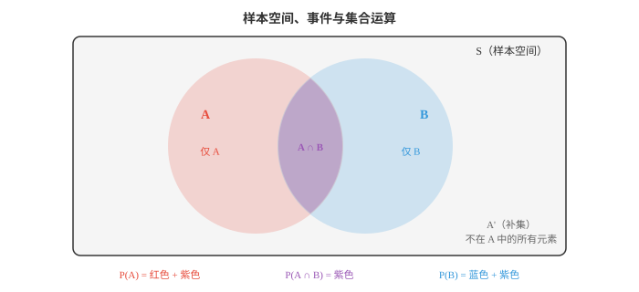
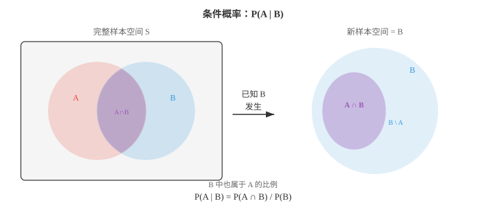
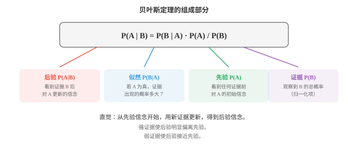

# 概率概念（Probability Concepts）

*概率论将不确定性形式化，并提供在不确定性下推理的规则。本节介绍样本空间、事件、概率公理、条件概率、独立性、贝叶斯定理，以及频率学派和贝叶斯学派的解释。这是 ML 中每一种生成模型和判别模型背后的数学框架。*

- 概率为事件赋予一个介于 0 和 1 之间的数，度量它发生的可能性。

- 概率为 0 表示不可能，为 1 表示必然，为 0.5 表示如抛硬币般的机会。

- 概率有两种主要解释。**频率学派（frequentist）**认为，概率是长期相对频率：公平硬币抛掷 10,000 次，正面大约会出现 50% 的时间。

- **贝叶斯学派（Bayesian）**认为，概率是信念程度：即使明天只会发生一次，你仍可说“明天下雨的概率为 70%”。

- 两种解释使用相同的数学规则。差异在于哲学立场，却会影响 ML：频率学派方法给出点估计；贝叶斯方法给出参数上的完整分布。

- **样本空间（sample space）** $S$ 是一次试验的全部可能结果集合。抛硬币：$S = \{H, T\}$；掷骰子：$S = \{1, 2, 3, 4, 5, 6\}$。

- **事件（event）**是样本空间的任意子集。“掷出偶数”是事件 $A = \{2, 4, 6\}$，它是 $S$ 的子集。

- 当所有结果等可能时，事件概率就是第 01 节的计数：

$$P(A) = \frac{|A|}{|S|} = \frac{\text{favourable outcomes}}{\text{total outcomes}}$$

- 对偶数示例：$P(\text{even}) = \frac{3}{6} = 0.5$。



- 事件 $A$ 的**补集（complement）**，记为 $A'$ 或 $A^c$，是 $S$ 中不属于 $A$ 的一切。由于每种结果要么在 $A$ 中，要么不在：

$$P(A') = 1 - P(A)$$

- 补集通常是更简单的路径。与其计算 5 次抛硬币中至少一次正面的全部方式，不如计算没有正面的唯一方式再相减：$P(\text{at least one head}) = 1 - P(\text{all tails}) = 1 - (0.5)^5 = 0.969$。

- 两个事件若不能同时发生，即 $A \cap B = \emptyset$，就称为**互斥（mutually exclusive）**或不相交事件。一次掷骰子中，掷出 2 与掷出 5 互斥。

- **互斥事件的加法法则（addition rule for mutually exclusive events）**很直接：

$$P(A \cup B) = P(A) + P(B) \quad \text{(if } A \cap B = \emptyset\text{)}$$

- 事件可重叠时，需要使用**一般加法法则（general addition rule）**避免重复计算交集：

$$P(A \cup B) = P(A) + P(B) - P(A \cap B)$$

- 这与计数中的容斥原理相对应。上方维恩图说明了原因：紫色区域，即交集，在 $P(A)$ 中被计算一次，在 $P(B)$ 中又被计算一次，因此需减去一次。

- **联合概率（joint probability）** $P(A \cap B)$ 是 $A$ 和 $B$ 同时发生的概率。一副扑克牌中，$P(\text{red} \cap \text{king}) = \frac{2}{52}$，因为有 2 张红色 K。

- **边缘概率（marginal probability）**是不考虑其他事件时单个事件的概率。$P(\text{red}) = \frac{26}{52} = 0.5$ 是边缘概率。若有两个变量的联合分布，则通过对另一个变量求和，或积分，得到边缘概率。

- **条件概率（conditional probability）**回答：在 $B$ 已经发生的条件下，$A$ 发生的概率是什么？我们将样本空间从 $S$ 缩小为 $B$，再询问 $B$ 中有多少部分也属于 $A$：

$$P(A | B) = \frac{P(A \cap B)}{P(B)}, \quad P(B) > 0$$



- 示例：抽一张牌，有人告诉你它是红色。它是 K 的概率是多少？红牌有 26 张，其中 2 张是 K，所以 $P(\text{king} | \text{red}) = \frac{2}{26} = \frac{1}{13}$。用公式：$P(\text{king} \cap \text{red}) / P(\text{red}) = \frac{2/52}{26/52} = \frac{1}{13}$。

- 若知道一个事件发生与否完全无法提供另一个事件的信息，两个事件就是**独立（independent）**的。形式化地说：

$$P(A \cap B) = P(A) \cdot P(B)$$

- 等价地，$P(A | B) = P(A)$。分别抛掷两枚硬币是独立事件；不放回抽取两张牌则不独立，因为第一次抽取改变了剩余牌组。

- 独立性极大简化计算。独立事件的联合概率可分解为乘积，计算因而可行。许多 ML 模型假定特征独立，例如朴素贝叶斯，正是为了利用这种简化。

- 任意两个事件的**乘法法则（multiplication rule）**可由条件概率公式重排得到：

$$P(A \cap B) = P(A | B) \cdot P(B) = P(B | A) \cdot P(A)$$

- 对独立事件，条件概率等于边缘概率，因此简化为 $P(A \cap B) = P(A) \cdot P(B)$。

- **贝叶斯定理（Bayes' theorem）**是概率论中最重要的结果之一，也是贝叶斯 ML 的基础。它使条件概率的方向可以反转：

$$P(A | B) = \frac{P(B | A) \cdot P(A)}{P(B)}$$

- 该定理直接来自将 $P(A \cap B)$ 写成两种形式：$P(B|A) \cdot P(A) = P(A|B) \cdot P(B)$，然后解出 $P(A|B)$。



- 每个组成部分都有名称：
    - **先验（prior）** $P(A)$：看到证据前的初始信念。
    - **似然（likelihood）** $P(B|A)$：假设 $A$ 为真时，证据出现的概率。
    - **证据（evidence）** $P(B)$：看到证据的总概率，起归一化作用。
    - **后验（posterior）** $P(A|B)$：看到证据后的更新信念。

- 现在计算经典的医疗诊断示例。假设一种疾病影响 1% 的人口。疾病测试准确率为 95%：它能正确识别 95% 的患病者，即灵敏度，也能正确识别 90% 的健康者，即特异度。

- 你的测试结果为阳性。你真正患病的概率是多少？

- 令 $D$ = 患病，$+$ = 测试阳性。
    - 先验：$P(D) = 0.01$。
    - 似然：$P(+ | D) = 0.95$。
    - 假阳性率：$P(+ | D') = 0.10$。

- 需要先求 $P(+)$。由全概率公式：

$$P(+) = P(+ | D) \cdot P(D) + P(+ | D') \cdot P(D')$$
$$= 0.95 \times 0.01 + 0.10 \times 0.99 = 0.0095 + 0.099 = 0.1085$$

- 现在应用贝叶斯定理：

$$P(D | +) = \frac{P(+ | D) \cdot P(D)}{P(+)} = \frac{0.95 \times 0.01}{0.1085} \approx 0.088$$

- 尽管测试“准确率为 95%”，阳性结果只表示你患病的概率约为 8.8%。先验极其重要。疾病很罕见，因此大部分阳性结果是假阳性。对 ML 中任意分类问题，这是关键洞见：类别不平衡时，仅看准确率会产生误导。

- **全概率公式（law of total probability）**将样本空间划分为互斥且完备的事件 $B_1, B_2, \ldots, B_n$，并将任意事件 $A$ 表示为：

$$P(A) = \sum_{i=1}^{n} P(A | B_i) \cdot P(B_i)$$

- 这正是医疗示例中计算 $P(+)$ 的方法：将人群拆分为“患病”和“未患病”。

- **概率链式法则（chain rule of probability）**将乘法法则推广到任意数量的事件：

$$P(A_1 \cap A_2 \cap \cdots \cap A_n) = P(A_1) \cdot P(A_2 | A_1) \cdot P(A_3 | A_1 \cap A_2) \cdots P(A_n | A_1 \cap \cdots \cap A_{n-1})$$

- 每个因子都以此前全部事件为条件。这是自回归语言模型的骨干：一句话的概率是每个词在所有前词给定时的概率之积。

- **条件独立（conditional independence）**表示给定第三个事件后，两个事件独立。若给定 $C$ 时 $A$ 与 $B$ 条件独立：

$$P(A \cap B | C) = P(A | C) \cdot P(B | C)$$

- 事件可能边缘相关但条件独立，反之亦然。例如两名学生的考试成绩可能相关，因为都受试卷难度影响；但给定试卷难度后，二者成绩独立。

- 条件独立是贝叶斯网络等图模型的关键假设。它能将复杂联合分布分解为可管理的部分，使推断在计算上可行。

## 编程任务（使用 CoLab 或 notebook）

1. 模拟医疗诊断问题。生成 100,000 人的人口，应用疾病患病率和测试准确率，验证贝叶斯定理给出正确的后验。
```python
import jax
import jax.numpy as jnp

key = jax.random.PRNGKey(42)
n = 100_000

# Generate population
k1, k2 = jax.random.split(key)
has_disease = jax.random.bernoulli(k1, p=0.01, shape=(n,))

# Generate test results
k3, k4 = jax.random.split(k2)
# Sensitivity: P(+|D) = 0.95, Specificity: P(-|D') = 0.90
test_positive = jnp.where(
    has_disease,
    jax.random.bernoulli(k3, p=0.95, shape=(n,)),
    jax.random.bernoulli(k4, p=0.10, shape=(n,))
)

# Among those who tested positive, what fraction actually has the disease?
positives = test_positive.astype(bool)
true_positives = (has_disease & positives).sum()
total_positives = positives.sum()

print(f"Total positive tests: {total_positives}")
print(f"True positives: {true_positives}")
print(f"P(Disease | Positive) = {true_positives / total_positives:.4f}")
print(f"Bayes' formula:         {0.95 * 0.01 / 0.1085:.4f}")
```

2. 用模拟验证加法法则。生成具有已知概率和重叠的随机事件 A、B，再检查 $P(A \cup B) = P(A) + P(B) - P(A \cap B)$。
```python
import jax
import jax.numpy as jnp

key = jax.random.PRNGKey(0)
n = 200_000
k1, k2 = jax.random.split(key)

# Events: A = value < 0.4, B = value < 0.6 (overlap at < 0.4)
vals_a = jax.random.uniform(k1, shape=(n,))
vals_b = jax.random.uniform(k2, shape=(n,))

A = vals_a < 0.4
B = vals_b < 0.6

p_a = A.mean()
p_b = B.mean()
p_a_and_b = (A & B).mean()
p_a_or_b = (A | B).mean()

print(f"P(A) = {p_a:.4f}")
print(f"P(B) = {p_b:.4f}")
print(f"P(A ∩ B) = {p_a_and_b:.4f}")
print(f"P(A ∪ B) simulated = {p_a_or_b:.4f}")
print(f"P(A) + P(B) - P(A∩B) = {p_a + p_b - p_a_and_b:.4f}")
```

3. 演示条件概率会随证据变化。模拟掷两枚骰子，计算 $P(\text{sum} = 7)$，再计算 $P(\text{sum} = 7 | \text{first die} = 3)$。
```python
import jax
import jax.numpy as jnp

key = jax.random.PRNGKey(1)
n = 500_000
k1, k2 = jax.random.split(key)

d1 = jax.random.randint(k1, shape=(n,), minval=1, maxval=7)
d2 = jax.random.randint(k2, shape=(n,), minval=1, maxval=7)
total = d1 + d2

# Unconditional
p_sum7 = (total == 7).mean()
print(f"P(sum=7) = {p_sum7:.4f} (exact: {6/36:.4f})")

# Conditional on first die = 3
mask = d1 == 3
p_sum7_given_d1_3 = (total[mask] == 7).mean()
print(f"P(sum=7 | d1=3) = {p_sum7_given_d1_3:.4f} (exact: {1/6:.4f})")
```

4. 将贝叶斯定理实现为函数，并用它迭代更新信念。从硬币偏差的均匀先验开始，在观察每次抛掷后更新。
```python
import jax.numpy as jnp
import matplotlib.pyplot as plt

def bayes_update(prior, likelihood):
    """Multiply prior by likelihood and normalise."""
    posterior = prior * likelihood
    return posterior / posterior.sum()

# Discretise possible bias values
theta = jnp.linspace(0, 1, 200)
prior = jnp.ones_like(theta)  # uniform prior
prior = prior / prior.sum()

# Observed flips: 1=heads, 0=tails
flips = [1, 1, 0, 1, 1, 1, 0, 1, 0, 1]

plt.figure(figsize=(10, 5))
plt.plot(theta, prior, "--", color="#999", label="prior")

for i, flip in enumerate(flips):
    likelihood = theta if flip == 1 else (1 - theta)
    prior = bayes_update(prior, likelihood)
    if i in [0, 2, 4, 9]:
        plt.plot(theta, prior, label=f"after {i+1} flips", linewidth=2)

plt.xlabel("Coin bias θ")
plt.ylabel("Belief (normalised)")
plt.title("Bayesian updating: belief about coin bias")
plt.legend()
plt.grid(alpha=0.3)
plt.show()
```
