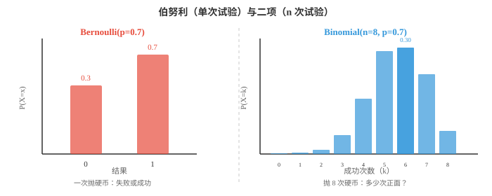
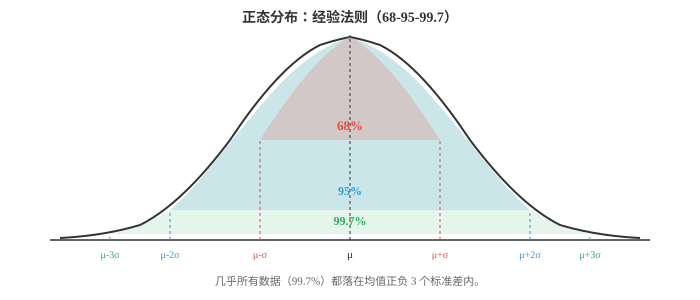
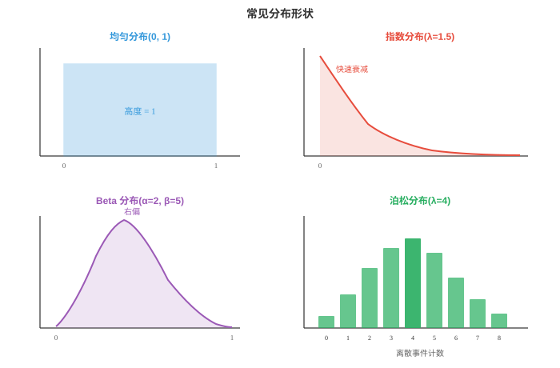

# 概率分布（Probability Distributions）

*概率分布描述随机结果如何散布在可能取值上。本节梳理关键的离散与连续分布，包括伯努利、二项、泊松、高斯、指数、贝塔等；给出每一种的公式、直觉和 ML 应用，例如损失函数、先验和噪声模型。*

- 第 4 章介绍了随机变量、PMF、PDF 和 CDF。本节列出 ML 和统计学中最重要的概率分布，并给出每一种的直觉、公式、均值和方差。

- 三个核心函数快速回顾，完整定义见第 4 章：
    - **PMF** $P(X = x)$：给出每个离散结果的概率，即柱状图的柱。
    - **PDF** $f(x)$：给出连续变量各点的密度；两点间曲线下的面积就是概率。
    - **CDF** $F(x) = P(X \le x)$：截至 $x$ 的累积概率，始终从 0 到 1，且永不下降。

- 分布的**支撑集（support）**是 PMF 或 PDF 为正的取值集合。骰子点数的支撑集为 $\{1,2,3,4,5,6\}$；正态分布的支撑集为全体实数 $(-\infty, \infty)$。

- 分布清楚地分为两类：离散分布，结果可数、使用 PMF；连续分布，结果不可数、使用 PDF。

- **伯努利分布（Bernoulli distribution）**：最简单的分布。一次试验有两个结果：以概率 $p$ 成功，即 1；以概率 $1-p$ 失败，即 0。

$$P(X = x) = p^x (1 - p)^{1-x}, \quad x \in \{0, 1\}$$

- 均值：$E[X] = p$。方差：$\text{Var}(X) = p(1-p)$。

- 每次抛硬币、每个是/否分类、每个二元结果都是伯努利试验。在 ML 中，sigmoid 函数的输出恰好是伯努利分布的参数 $p$。

- **二项分布（Binomial distribution）**：计算 $n$ 次相互独立、每次成功概率均为 $p$ 的伯努利试验中的成功次数。

$$P(X = k) = \binom{n}{k} p^k (1-p)^{n-k}, \quad k = 0, 1, \ldots, n$$

- 第 01 节的二项式系数 $\binom{n}{k}$ 计算在 $n$ 次试验中安排 $k$ 次成功的方式数。

- 均值：$E[X] = np$。方差：$\text{Var}(X) = np(1-p)$。



- 示例：将一枚有偏硬币，即 $p = 0.7$，抛 8 次，恰得 6 次正面的概率为 $\binom{8}{6}(0.7)^6(0.3)^2 = 28 \times 0.1176 \times 0.09 \approx 0.296$。

- **泊松分布（Poisson distribution）**：已知平均速率 $\lambda$ 时，计算固定时间或空间区间内事件的数量。它适用于罕见且独立的事件。

$$P(X = k) = \frac{\lambda^k e^{-\lambda}}{k!}, \quad k = 0, 1, 2, \ldots$$

- 均值：$E[X] = \lambda$。方差：$\text{Var}(X) = \lambda$。均值等于方差是其标志性性质。

- 示例包括每小时邮件数，即 $\lambda = 5$、每页错别字数、每秒服务器请求数。在 ML 中，泊松回归对计数数据建模，避免线性模型预测出负计数。

- 当 $n \to \infty$、$p \to 0$ 且 $np = \lambda$ 保持不变时，Binomial$(n,p)$ 收敛到 Poisson$(\lambda)$。这解释了泊松分布为何适合大总体中的罕见事件。

- **几何分布（Geometric distribution）**：计算第一次成功前所需的试验次数，例如“在第一次得到正面前要抛多少次硬币？”

$$P(X = k) = (1-p)^{k-1} p, \quad k = 1, 2, 3, \ldots$$

- 均值：$E[X] = 1/p$。方差：$\text{Var}(X) = (1-p)/p^2$。

- 几何分布具有**无记忆性（memoryless）**：再等待 $k$ 次才成功的概率，不依赖于此前已等待的试验次数。这使它在离散分布中很特殊。

- **负二项分布（Negative Binomial distribution）**：推广几何分布，计算第 $r$ 次成功前所需的试验次数，几何分布是 $r=1$ 的特殊情形。

$$P(X = k) = \binom{k-1}{r-1} p^r (1-p)^{k-r}, \quad k = r, r+1, r+2, \ldots$$

- 均值：$E[X] = r/p$。方差：$\text{Var}(X) = r(1-p)/p^2$。

- 实践中，负二项分布也用于建模过度离散的计数数据，即方差大于均值的数据，这是泊松分布无法处理的情形。

- 下面转向连续分布。

- **均匀分布（Uniform distribution）**：区间 $[a, b]$ 内的全部值等可能。PDF 是一个平坦矩形。

$$f(x) = \frac{1}{b - a}, \quad a \le x \le b$$

- 均值：$E[X] = \frac{a+b}{2}$。方差：$\text{Var}(X) = \frac{(b-a)^2}{12}$。

- 随机数生成器以 Uniform(0,1) 样本作为起点，其他分布通过变换这些均匀样本生成。

- **正态分布（Gaussian distribution）**：统计学中最重要的分布。它由中心极限定理自然产生：不论原始分布如何，许多独立随机变量的平均值都趋向正态分布。

$$f(x) = \frac{1}{\sigma\sqrt{2\pi}} \exp\!\left(-\frac{(x - \mu)^2}{2\sigma^2}\right)$$

- 均值：$E[X] = \mu$。方差：$\text{Var}(X) = \sigma^2$。

- **标准正态分布（standard normal）**满足 $\mu = 0$、$\sigma = 1$。任意正态变量 $X$ 都可通过 $Z = (X - \mu)/\sigma$ 标准化为标准正态变量 $Z$。



- **经验法则（empirical rule）**，即 68-95-99.7 法则：
    - 大约 68% 的数据位于均值 $\pm 1\sigma$ 内。
    - 大约 95% 位于 $\pm 2\sigma$ 内。
    - 大约 99.7% 位于 $\pm 3\sigma$ 内。

- 在 ML 中，正态分布无处不在：权重初始化、数据增强中的噪声、MSE 损失隐含的高斯误差假设，以及变分自编码器中的重参数化技巧。

- **指数分布（Exponential distribution）**：建模泊松过程事件之间的时间。若事件以速率 $\lambda$ 到达，它们之间的等待时间服从 Exponential$(\lambda)$。

$$f(x) = \lambda e^{-\lambda x}, \quad x \ge 0$$

- 均值：$E[X] = 1/\lambda$。方差：$\text{Var}(X) = 1/\lambda^2$。

- 如同离散变量的几何分布，指数分布具有**无记忆性**：$P(X > s + t | X > s) = P(X > t)$。再等待 $t$ 个单位的概率不依赖于此前已等待的时间。

- **伽马分布（Gamma distribution）**：推广指数分布。它建模泊松过程中第 $\alpha$ 个事件之前的时间，指数分布是 $\alpha = 1$ 的情形。

$$f(x) = \frac{\beta^\alpha}{\Gamma(\alpha)} x^{\alpha - 1} e^{-\beta x}, \quad x > 0$$

- 其中 $\alpha$，形状参数，控制形状，$\beta$，速率参数，控制尺度。$\Gamma(\alpha)$ 是伽马函数，将阶乘扩展到实数：对正整数，$\Gamma(n) = (n-1)!$。

- 均值：$E[X] = \alpha/\beta$。方差：$\text{Var}(X) = \alpha/\beta^2$。

- **贝塔分布（Beta distribution）**：定义在 $[0, 1]$ 区间，非常适合建模概率、比例和比率。

$$f(x) = \frac{x^{\alpha - 1}(1 - x)^{\beta - 1}}{B(\alpha, \beta)}, \quad 0 \le x \le 1$$

- 分母 $B(\alpha, \beta) = \frac{\Gamma(\alpha)\Gamma(\beta)}{\Gamma(\alpha + \beta)}$ 是贝塔函数，即归一化常数。

- 均值：$E[X] = \frac{\alpha}{\alpha + \beta}$。方差：$\text{Var}(X) = \frac{\alpha\beta}{(\alpha+\beta)^2(\alpha+\beta+1)}$。

- 贝塔分布是伯努利和二项似然的共轭先验。这表示先验为 Beta、数据为 Bernoulli 时，后验仍为 Beta，因此贝叶斯更新可解析计算。第 04 节会使用它。



- **卡方分布（Chi-squared distribution）**，记为 $\chi^2$：取 $k$ 个独立标准正态随机变量并将它们的平方相加，结果服从自由度为 $k$ 的 $\chi^2$ 分布。

$$f(x) = \frac{1}{2^{k/2}\Gamma(k/2)} x^{k/2 - 1} e^{-x/2}, \quad x > 0$$

- 均值：$E[X] = k$。方差：$\text{Var}(X) = 2k$。

- $\chi^2$ 分布其实是伽马分布的特殊情形，$\alpha = k/2$、$\beta = 1/2$。它出现于假设检验，第 4 章的卡方检验，拟合优度检验，以及计算方差置信区间。

- **Student's t 分布（Student's t-distribution）**：形似正态分布但尾部更厚。当用小样本估计正态总体的均值且总体方差未知时会出现它。

$$f(x) = \frac{\Gamma\!\left(\frac{\nu+1}{2}\right)}{\sqrt{\nu\pi}\,\Gamma\!\left(\frac{\nu}{2}\right)} \left(1 + \frac{x^2}{\nu}\right)^{-(\nu+1)/2}$$

- 参数 $\nu$，读作 nu，是自由度。随着 $\nu \to \infty$，t 分布收敛到标准正态分布。$\nu$ 较小时，较厚的尾部为极端值赋予更多概率，反映小样本带来的额外不确定性。

- 均值：$E[X] = 0$，适用于 $\nu > 1$。方差：$\text{Var}(X) = \frac{\nu}{\nu - 2}$，适用于 $\nu > 2$。

- t 分布用于 t 检验，第 4 章，也会在贝叶斯推断中作为对未知方差积分消去后的边缘分布出现。

- 关键分布汇总：

| 分布 | 类型 | 支撑集 | 均值 | 方差 |
|---|---|---|---|---|
| Bernoulli$(p)$ | 离散 | $\{0,1\}$ | $p$ | $p(1-p)$ |
| Binomial$(n,p)$ | 离散 | $\{0,\ldots,n\}$ | $np$ | $np(1-p)$ |
| Poisson$(\lambda)$ | 离散 | $\{0,1,2,\ldots\}$ | $\lambda$ | $\lambda$ |
| Geometric$(p)$ | 离散 | $\{1,2,3,\ldots\}$ | $1/p$ | $(1-p)/p^2$ |
| Uniform$(a,b)$ | 连续 | $[a,b]$ | $(a+b)/2$ | $(b-a)^2/12$ |
| Normal$(\mu,\sigma^2)$ | 连续 | $(-\infty,\infty)$ | $\mu$ | $\sigma^2$ |
| Exponential$(\lambda)$ | 连续 | $[0,\infty)$ | $1/\lambda$ | $1/\lambda^2$ |
| Gamma$(\alpha,\beta)$ | 连续 | $(0,\infty)$ | $\alpha/\beta$ | $\alpha/\beta^2$ |
| Beta$(\alpha,\beta)$ | 连续 | $[0,1]$ | $\alpha/(\alpha+\beta)$ | 见上文 |
| $\chi^2(k)$ | 连续 | $(0,\infty)$ | $k$ | $2k$ |
| Student's $t(\nu)$ | 连续 | $(-\infty,\infty)$ | $0$ | $\nu/(\nu-2)$ |

## 编程任务（使用 CoLab 或 notebook）

1. 为 $n=20$、多个 $p$ 值绘制二项 PMF。观察形状如何从左偏变为对称，再变为右偏。
```python
import jax.numpy as jnp
import matplotlib.pyplot as plt
from math import comb

n = 20
ks = jnp.arange(0, n + 1)

fig, axes = plt.subplots(1, 3, figsize=(12, 4), sharey=True)
for ax, p, color in zip(axes, [0.2, 0.5, 0.8], ["#e74c3c", "#3498db", "#27ae60"]):
    pmf = jnp.array([comb(n, int(k)) * p**k * (1-p)**(n-k) for k in ks])
    ax.bar(ks, pmf, color=color, alpha=0.7)
    ax.set_title(f"Binomial(n={n}, p={p})")
    ax.set_xlabel("k")
axes[0].set_ylabel("P(X = k)")
plt.tight_layout()
plt.show()
```

2. 验证泊松对二项分布的近似。设 $n = 1000$、$p = 0.003$，比较 Binomial$(n, p)$ 与 Poisson$(\lambda = np)$。
```python
import jax.numpy as jnp
import matplotlib.pyplot as plt
from math import comb, factorial, exp

n, p = 1000, 0.003
lam = n * p
ks = jnp.arange(0, 15)

binom_pmf = jnp.array([comb(n, int(k)) * p**k * (1-p)**(n-k) for k in ks])
poisson_pmf = jnp.array([lam**k * exp(-lam) / factorial(int(k)) for k in ks])

plt.figure(figsize=(8, 4))
plt.bar(ks - 0.15, binom_pmf, width=0.3, color="#3498db", alpha=0.7, label=f"Binomial({n},{p})")
plt.bar(ks + 0.15, poisson_pmf, width=0.3, color="#e74c3c", alpha=0.7, label=f"Poisson({lam})")
plt.xlabel("k")
plt.ylabel("P(X = k)")
plt.title("Poisson approximation to Binomial")
plt.legend()
plt.show()
```

3. 从正态分布抽样并验证经验法则。计算落在 1、2、3 个标准差内的样本比例。
```python
import jax
import jax.numpy as jnp

key = jax.random.PRNGKey(42)
mu, sigma = 5.0, 2.0
samples = mu + sigma * jax.random.normal(key, shape=(100_000,))

for k in [1, 2, 3]:
    within = jnp.abs(samples - mu) <= k * sigma
    print(f"Within {k}σ: {within.mean():.4f} (expected: {[0.6827, 0.9545, 0.9973][k-1]:.4f})")
```

4. 通过改变 $\alpha$ 和 $\beta$ 探索贝塔分布。绘制多种形状，观察分布如何从均匀变为偏斜和集中。
```python
import jax
import jax.numpy as jnp
import matplotlib.pyplot as plt

x = jnp.linspace(0.01, 0.99, 200)

def beta_pdf(x, a, b):
    # Unnormalised for shape comparison
    return x**(a-1) * (1-x)**(b-1)

plt.figure(figsize=(10, 5))
params = [(1,1,"Uniform"), (2,5,"Left skew"), (5,2,"Right skew"),
          (5,5,"Symmetric"), (0.5,0.5,"U-shape")]
colors = ["#999", "#e74c3c", "#3498db", "#27ae60", "#9b59b6"]

for (a, b, label), color in zip(params, colors):
    y = beta_pdf(x, a, b)
    y = y / jnp.trapezoid(y, x)  # normalise
    plt.plot(x, y, label=f"α={a}, β={b} ({label})", color=color, linewidth=2)

plt.xlabel("x")
plt.ylabel("Density")
plt.title("Beta distribution shapes")
plt.legend()
plt.grid(alpha=0.3)
plt.show()
```
