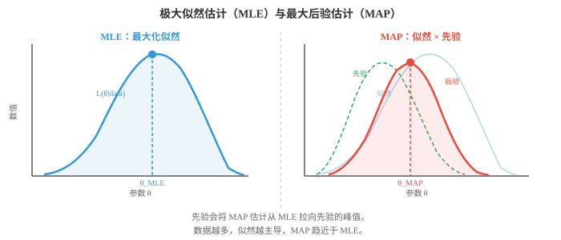
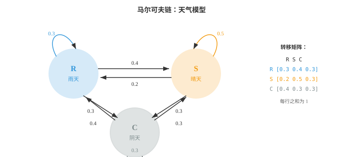
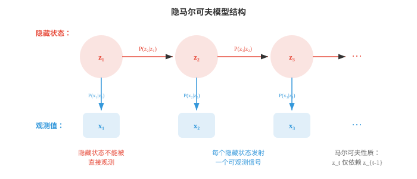

# 贝叶斯方法与序列模型（Bayesian Methods and Sequential Models）

*贝叶斯方法将先验信念与观测数据结合，得到模型参数的后验分布。本节介绍最大似然估计、MAP 估计、共轭先验、贝叶斯推断、隐马尔可夫模型和 EM 算法。这些技术支撑着垃圾邮件过滤器、语言模型和不确定性感知 ML。*

- 到目前为止，我们描述了分布和计算概率的方法。现在处理 ML 的核心问题：给定观测数据，如何找到模型的最佳参数？

- **最大似然估计（Maximum Likelihood Estimation，MLE）**直接回答这个问题：选择使观测数据最可能出现的参数值。

- 形式化地，给定数据 $D = \{x_1, x_2, \ldots, x_n\}$ 和参数为 $\theta$ 的模型，**似然函数（likelihood function）**为：

$$L(\theta | D) = P(D | \theta) = \prod_{i=1}^{n} P(x_i | \theta)$$

- 这个乘积假定数据点独立同分布，即 i.i.d.。MLE 估计为：

$$\hat{\theta}_{\text{MLE}} = \arg\max_\theta L(\theta | D)$$

- 实践中通常最大化**对数似然（log-likelihood）**，因为对数将乘积变为和，并避免数值下溢：

$$\ell(\theta) = \log L(\theta | D) = \sum_{i=1}^{n} \log P(x_i | \theta)$$

- 由于 $\log$ 单调递增，最大化 $\ell(\theta)$ 的 $\theta$ 也最大化 $L(\theta)$。

- **抛硬币示例**：抛硬币 10 次，得到 7 次正面。硬币偏差 $p$，即正面概率，的 MLE 是什么？

- 每次抛掷都服从 Bernoulli($p$)，因此 10 次中出现 7 次正面的似然为：

$$L(p) = \binom{10}{7} p^7 (1-p)^3$$

- 取对数并求导：$\frac{d\ell}{dp} = \frac{7}{p} - \frac{3}{1-p} = 0$，得到 $\hat{p}_{\text{MLE}} = 7/10 = 0.7$。

- MLE 直观且简单。10 次中有 7 次正面，最可能的偏差就是 0.7。但若 10 次均为正面，MLE 会给出 $\hat{p} = 1$，即硬币永远正面；仅凭 10 个观测，这显得过度自信。

- **最大后验估计（Maximum A Posteriori，MAP）**通过加入先验信念修正此问题。MAP 不只最大化似然，而是最大化后验：

$$\hat{\theta}_{\text{MAP}} = \arg\max_\theta P(\theta | D) = \arg\max_\theta P(D | \theta) \cdot P(\theta)$$

- 分母中的 $P(D)$ 被略去，因为它与 $\theta$ 无关，不影响 argmax。

- 先验 $P(\theta)$ 编码了看到数据前对 $\theta$ 的信念。若对硬币偏差使用 Beta(2, 2) 先验，表示温和地认为硬币大致公平，MAP 估计不再只是正面比例，而会被拉向 0.5。



- 对 Beta($\alpha$, $\beta$) 先验，观察到 $h$ 次正面和 $t$ 次反面后，后验为 Beta($\alpha + h$, $\beta + t$)，MAP 估计为：

$$\hat{p}_{\text{MAP}} = \frac{\alpha + h - 1}{\alpha + \beta + h + t - 2}$$

- 对本例的 Beta(2,2) 先验、7 次正面、3 次反面：$\hat{p}_{\text{MAP}} = \frac{2 + 7 - 1}{2 + 2 + 10 - 2} = \frac{8}{12} = 0.667$。

- 与 MLE 的 0.7 相比，MAP 的 0.667 被拉向 0.5。先验充当正则化。在 ML 中，L2 正则化，即权重衰减，恰好等价于对权重采用高斯先验的 MAP 估计。

- **完整贝叶斯推断（Full Bayesian inference）**比 MAP 更进一步。它不寻找单个最优 $\theta$，而是维护整个后验分布 $P(\theta | D)$。这不仅给出点估计，还提供不确定性度量。

- 对具有 Beta(2,2) 先验、7 次正面、3 次反面的硬币，完整后验为 Beta(9, 5)。其均值为 $9/14 \approx 0.643$，分散程度表示我们的置信程度。数据越多，后验越窄。

- 三种方法形成一个连续谱：
    - **MLE**：没有先验，只使用数据。速度快，但数据少时可能过拟合。
    - **MAP**：带先验正则化的点估计，增加稳健性。
    - **完整贝叶斯**：完整后验分布，信息最丰富，但通常计算昂贵。

- **马尔可夫链（Markov chains）**建模序列：下一个状态只依赖当前状态，不依赖全部历史。这种“无记忆性”称为**马尔可夫性质（Markov property）**：

$$P(X_{t+1} | X_t, X_{t-1}, \ldots, X_1) = P(X_{t+1} | X_t)$$

- 可以用天气理解它。明天天气取决于今天天气，而不取决于上周天气，这是一种简化，却出奇有用。

- 马尔可夫链具有有限**状态（states）**集合和一个**转移矩阵（transition matrix）** $T$。元素 $T_{ij}$ 给出从状态 $i$ 转到状态 $j$ 的概率，每一行之和为 1。



- 对上方天气示例，转移矩阵为：

```math
T = \begin{pmatrix} 0.3 & 0.4 & 0.3 \\ 0.2 & 0.5 & 0.3 \\ 0.4 & 0.3 & 0.3 \end{pmatrix}
```

- 若今天下雨，状态向量为 $\mathbf{s}_0 = [1, 0, 0]$，明天天气的概率分布为 $\mathbf{s}_1 = \mathbf{s}_0 T = [0.3, 0.4, 0.3]$。后天天气为 $\mathbf{s}_2 = \mathbf{s}_0 T^2$。这使用了第 1 章的矩阵乘法。

- 许多马尔可夫链会收敛到**平稳分布（stationary distribution）** $\pi$，满足 $\pi T = \pi$。无论从何处开始，经过足够步数后，链都会稳定到 $\pi$。这是 MCMC，即马尔可夫链蒙特卡洛，的基础，它是贝叶斯 ML 中广泛使用的抽样技术。

- **隐马尔可夫模型（Hidden Markov Models，HMMs）**在马尔可夫链上增加间接层。真实状态是隐藏的，即不可观测，而每个时间步隐藏状态都会发射一个可观测信号。



- HMM 有三个组成部分：
    - **转移概率（transition probabilities）** $P(z_t | z_{t-1})$：隐藏状态如何演化，即马尔可夫链。
    - **发射概率（emission probabilities）** $P(x_t | z_t)$：各隐藏状态产生何种可观测输出。
    - **初始分布（initial distribution）** $P(z_1)$：起始隐藏状态的概率。

- **雨伞示例**：假设你不能直接看到天气，但能观察朋友是否带伞。隐藏状态为 {雨天、晴天}，观测为 {带伞、不带伞}。

- 转移概率：$P(\text{Rainy}|\text{Rainy}) = 0.7$、$P(\text{Sunny}|\text{Rainy}) = 0.3$、$P(\text{Rainy}|\text{Sunny}) = 0.4$、$P(\text{Sunny}|\text{Sunny}) = 0.6$。

- 发射概率：$P(\text{Umbrella}|\text{Rainy}) = 0.9$、$P(\text{No umbrella}|\text{Rainy}) = 0.1$、$P(\text{Umbrella}|\text{Sunny}) = 0.2$、$P(\text{No umbrella}|\text{Sunny}) = 0.8$。

- HMM 的关键问题：
    - **解码（decoding）**：给定观测，最可能的隐藏状态序列是什么？用**维特比算法（Viterbi algorithm）**解决。
    - **求值（evaluation）**：观测序列的概率是多少？用**前向算法（Forward algorithm）**解决。
    - **学习（learning）**：给定观测，最佳模型参数是什么？用**Baum-Welch 算法**解决，它是期望最大化的实例。

- **维特比推导**：假设观测到 [带伞、带伞、不带伞]，并希望找出最可能的天气序列。

- 从初始概率开始。设 $P(R) = 0.5$、$P(S) = 0.5$。

- **第 1 天**，观测带伞：
    - $V_1(R) = P(R) \cdot P(U|R) = 0.5 \times 0.9 = 0.45$。
    - $V_1(S) = P(S) \cdot P(U|S) = 0.5 \times 0.2 = 0.10$。

- **第 2 天**，观测带伞：
    - $V_2(R) = \max(V_1(R) \cdot P(R|R), V_1(S) \cdot P(R|S)) \cdot P(U|R)$。
    - $= \max(0.45 \times 0.7, 0.10 \times 0.4) \times 0.9 = \max(0.315, 0.04) \times 0.9 = 0.2835$。
    - $V_2(S) = \max(V_1(R) \cdot P(S|R), V_1(S) \cdot P(S|S)) \cdot P(U|S)$。
    - $= \max(0.45 \times 0.3, 0.10 \times 0.6) \times 0.2 = \max(0.135, 0.06) \times 0.2 = 0.027$。

- **第 3 天**，观测不带伞：
    - $V_3(R) = \max(0.2835 \times 0.7, 0.027 \times 0.4) \times 0.1 = 0.1985 \times 0.1 = 0.01985$。
    - $V_3(S) = \max(0.2835 \times 0.3, 0.027 \times 0.6) \times 0.8 = 0.08505 \times 0.8 = 0.06804$。

- 第 3 天最大值对应晴天。回溯可得：第 3 天 = 晴天，来自雨天；第 2 天 = 雨天，来自雨天；第 1 天 = 雨天。最可能序列为**雨天、雨天、晴天**。

- **前向后向算法（Forward-Backward algorithm）**在给定完整观测序列的条件下，计算每个时间步处于每个隐藏状态的概率。前向过程计算 $P(z_t, x_{1:t})$，后向过程计算 $P(x_{t+1:T} | z_t)$。两者相乘得到平滑后的状态概率。

- **Baum-Welch 算法**在隐藏状态不可观测时，从数据中学习 HMM 参数。它是期望最大化，即 EM，算法：E 步利用前向后向估计哪些隐藏状态生成了观测；M 步更新转移与发射概率。

- HMM 曾在语音识别中占主导地位，隐藏音素状态发射声学信号，也曾用于生物信息学，隐藏基因状态发射 DNA 碱基对。尽管深度学习在这些领域很大程度上取代了 HMM，隐藏状态、发射和序列推断的思想仍是序列模型的核心。

- **条件随机场（Conditional Random Fields，CRFs）**通过移除发射的独立性假设改进 HMM。在 HMM 中，时间 $t$ 的观测仅依赖于时间 $t$ 的隐藏状态；CRF 允许位置 $t$ 的标签依赖于整个输入序列。

- 线性链 CRF 建模给定输入序列 $\mathbf{x}$ 后标签序列 $\mathbf{y}$ 的条件概率：

$$P(\mathbf{y} | \mathbf{x}) = \frac{1}{Z(\mathbf{x})} \exp\!\left(\sum_t \left[\sum_k \lambda_k f_k(y_t, y_{t-1}, \mathbf{x}, t)\right]\right)$$

- 其中 $f_k$ 是特征函数，可以观察输入的任意部分，$\lambda_k$ 是学习到的权重，$Z(\mathbf{x})$ 是归一化常数。

- CRF 是判别模型，直接建模 $P(\mathbf{y}|\mathbf{x})$；HMM 是生成模型，建模 $P(\mathbf{x}, \mathbf{y})$。这与逻辑回归，即判别模型，和朴素贝叶斯，即生成模型，之间的区别相同。

- 在现代 NLP 中，常把 CRF 层加在神经网络之上，例如 BiLSTM-CRF、BERT-CRF，用于命名实体识别和词性标注等任务，因为这些任务需要捕捉标签依赖关系。

## 编程任务（使用 CoLab 或 notebook）

1. 为抛硬币实验实现 MLE 和 MAP。观察 MAP 估计如何随不同先验和不同数据量改变。
```python
import jax.numpy as jnp
import matplotlib.pyplot as plt

# Data: observed coin flips
heads, tails = 7, 3

# MLE
p_mle = heads / (heads + tails)
print(f"MLE: {p_mle:.4f}")

# MAP with Beta prior
for alpha, beta in [(1,1), (2,2), (5,5), (10,10)]:
    p_map = (alpha + heads - 1) / (alpha + beta + heads + tails - 2)
    print(f"MAP (Beta({alpha},{beta})): {p_map:.4f}")

# Visualise posterior for Beta(2,2) prior
theta = jnp.linspace(0.01, 0.99, 200)
# Posterior is Beta(alpha+heads, beta+tails)
a_post, b_post = 2 + heads, 2 + tails
posterior = theta**(a_post-1) * (1-theta)**(b_post-1)
posterior = posterior / jnp.trapezoid(posterior, theta)

plt.figure(figsize=(8, 4))
plt.plot(theta, posterior, color="#e74c3c", linewidth=2, label=f"Posterior Beta({a_post},{b_post})")
plt.axvline(p_mle, color="#3498db", linestyle="--", label=f"MLE = {p_mle:.2f}")
plt.axvline((a_post-1)/(a_post+b_post-2), color="#e74c3c", linestyle="--", label=f"MAP = {(a_post-1)/(a_post+b_post-2):.3f}")
plt.xlabel("θ (coin bias)")
plt.ylabel("Density")
plt.title("Posterior distribution after 7H, 3T with Beta(2,2) prior")
plt.legend()
plt.grid(alpha=0.3)
plt.show()
```

2. 为天气模型构建马尔可夫链并模拟它。分别通过模拟和求解 $\pi T = \pi$ 计算平稳分布。
```python
import jax
import jax.numpy as jnp

# Transition matrix: R, S, C
T = jnp.array([
    [0.3, 0.4, 0.3],
    [0.2, 0.5, 0.3],
    [0.4, 0.3, 0.3]
])
states = ["Rainy", "Sunny", "Cloudy"]

# Simulate 100,000 steps
key = jax.random.PRNGKey(42)
n_steps = 100_000
state = 0  # start rainy
counts = jnp.zeros(3)

for i in range(n_steps):
    key, subkey = jax.random.split(key)
    state = jax.random.choice(subkey, 3, p=T[state])
    counts = counts.at[state].add(1)

sim_stationary = counts / n_steps
print("Simulated stationary distribution:")
for s, p in zip(states, sim_stationary):
    print(f"  {s}: {p:.4f}")

# Analytical: find left eigenvector with eigenvalue 1
eigenvalues, eigenvectors = jnp.linalg.eig(T.T)
idx = jnp.argmin(jnp.abs(eigenvalues - 1.0))
pi = jnp.real(eigenvectors[:, idx])
pi = pi / pi.sum()
print("\nAnalytical stationary distribution:")
for s, p in zip(states, pi):
    print(f"  {s}: {p:.4f}")
```

3. 为雨伞 HMM 实现维特比算法，并解码一段观测序列。
```python
import jax.numpy as jnp

# HMM parameters
states = ["Rainy", "Sunny"]
obs_names = ["Umbrella", "No umbrella"]

trans = jnp.array([[0.7, 0.3],   # R->R, R->S
                    [0.4, 0.6]])  # S->R, S->S

emit = jnp.array([[0.9, 0.1],    # R->U, R->noU
                   [0.2, 0.8]])   # S->U, S->noU

init = jnp.array([0.5, 0.5])

# Observations: U=0, noU=1
observations = [0, 0, 1]  # Umbrella, Umbrella, No umbrella

def viterbi(obs, init, trans, emit):
    n_states = len(init)
    T = len(obs)
    V = jnp.zeros((T, n_states))
    path = jnp.zeros((T, n_states), dtype=int)

    # Initialisation
    V = V.at[0].set(init * emit[:, obs[0]])

    # Recursion
    for t in range(1, T):
        for j in range(n_states):
            probs = V[t-1] * trans[:, j]
            V = V.at[t, j].set(jnp.max(probs) * emit[j, obs[t]])
            path = path.at[t, j].set(jnp.argmax(probs))

    # Backtrack
    best = [int(jnp.argmax(V[-1]))]
    for t in range(T-1, 0, -1):
        best.insert(0, int(path[t, best[0]]))
    return best, V

decoded, scores = viterbi(observations, init, trans, emit)
print("Observations:", [obs_names[o] for o in observations])
print("Decoded:     ", [states[s] for s in decoded])
```

4. 可视化随着观察到更多硬币抛掷，后验如何演化。从 Beta(1,1) 先验，即均匀先验开始，每次抛掷后更新。
```python
import jax
import jax.numpy as jnp
import matplotlib.pyplot as plt

theta = jnp.linspace(0.01, 0.99, 300)
key = jax.random.PRNGKey(7)

# True bias = 0.65
flips = jax.random.bernoulli(key, p=0.65, shape=(50,))

plt.figure(figsize=(10, 5))
a, b = 1, 1  # Beta(1,1) = uniform

for n_obs in [0, 1, 5, 10, 25, 50]:
    h = int(flips[:n_obs].sum())
    t = n_obs - h
    a_post = a + h
    b_post = b + t
    y = theta**(a_post-1) * (1-theta)**(b_post-1)
    y = y / jnp.trapezoid(y, theta)
    plt.plot(theta, y, linewidth=2, label=f"n={n_obs} (h={h})")

plt.axvline(0.65, color="black", linestyle=":", alpha=0.5, label="true p=0.65")
plt.xlabel("θ")
plt.ylabel("Density")
plt.title("Bayesian updating: posterior narrows with more data")
plt.legend()
plt.grid(alpha=0.3)
plt.show()
```
