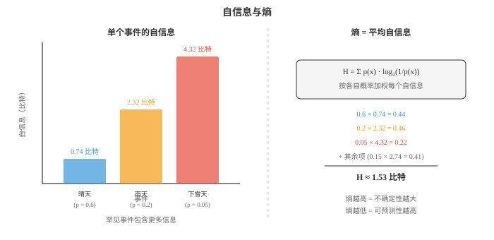
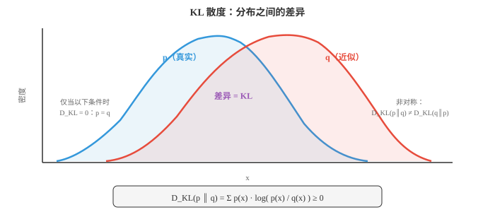

# 信息论（Information Theory）

*信息论量化信息、惊讶程度以及概率分布之间的差异。本节介绍熵、交叉熵、KL 散度、互信息和自信息。这些概念支撑着 ML 的每一种分类损失函数、VAE 目标和数据压缩方案。*

- 克劳德·香农于 1948 年创立的信息论，为量化信息提供数学框架。它回答的问题包括：一个事件该有多令人惊讶？一条消息携带多少信息？两个概率分布有多不同？

- 这些问题听起来抽象，却是 ML 损失函数、数据压缩和通信系统的基础。分类中最常用的损失函数交叉熵损失，直接来自信息论。

- 从最简单的问题开始：单个事件携带多少信息？

- **自信息（surprisal）**，也称自信息量，度量一个事件有多令人意外。极有可能发生的事几乎不会带来新信息；罕见事件则带来大量信息。

- 若你住在沙漠，有人告诉你天气晴朗，这没有多少信息；若告诉你正在下雪，信息量极大。自信息将这种直觉形式化：

$$I(x) = \log_2 \frac{1}{p(x)} = -\log_2 p(x)$$

- 使用 $\log_2$ 时单位为**比特（bits）**。公平硬币一次抛掷的自信息为 $-\log_2(0.5) = 1$ 比特；概率为 $1/8$ 的事件自信息为 $\log_2(8) = 3$ 比特。

- 为什么用对数而不是直接使用 $1/p$？有三个原因：
    - 确定事件，即 $p = 1$，应给出零信息：$\log(1) = 0$，但 $1/1 = 1$。
    - 独立事件的信息应可加：$\log(1/p_1 p_2) = \log(1/p_1) + \log(1/p_2)$。
    - 我们需要平滑、性质良好的函数。$1/p$ 会爆炸，$\log(1/p)$ 增长温和。

- **熵（entropy）**是期望自信息，即从某个分布抽样时每个事件平均获得的信息量。它度量分布的不确定性或“不可预测性”：

$$H(X) = E[I(X)] = -\sum_{x} p(x) \log_2 p(x)$$



- 公平硬币的熵为 $H = -0.5\log_2(0.5) - 0.5\log_2(0.5) = 1$ 比特，具有最大不确定性。

- 偏置硬币，$p = 0.9$，的熵为 $H = -0.9\log_2(0.9) - 0.1\log_2(0.1) \approx 0.469$ 比特。不确定性更低，熵也更低。

- 确定事件，$p = 1$，的熵为 $H = 0$，完全没有不确定性。

- 所有结果等可能时熵最大。对于 $n$ 个等可能结果，$H = \log_2 n$。公平骰子的熵为 $\log_2 6 \approx 2.585$ 比特。

- 熵的实际含义是**压缩（compression）**。香农源编码定理指出，在不丢失信息的前提下，无法将数据压缩到低于其熵率。每个像素都等可能的图像，熵最大，无法压缩；主要为白色的图像，熵低，压缩效果好。

- 粗略估算：一个灰度像素有 256 个值，最大熵为 8 比特。一张 1080p 灰度图最多有 $1920 \times 1080 \times 8 \approx 16.6$ 百万比特。真实图像熵低得多，因为邻近像素相关，这正是 JPEG 压缩能工作的原因。

- 对连续随机变量，离散求和变为积分。**微分熵（differential entropy）**为：

$$h(X) = -\int_{-\infty}^{\infty} f(x) \log f(x)\, dx$$

- 方差为 $\sigma^2$ 的高斯分布微分熵为 $h = \frac{1}{2}\log_2(2\pi e \sigma^2)$。在所有方差相同的分布中，高斯分布熵最大。这也是高斯分布建模中如此常见的原因之一：除了指定均值和方差外，它作出的假设最少。

- **互信息（mutual information）**度量知道一个变量能告诉我们另一个变量多少信息。它是观察 $Y$ 后对 $X$ 不确定性的减少：

$$I(X; Y) = H(X) - H(X|Y) = H(Y) - H(Y|X)$$

- 等价地：

$$I(X; Y) = \sum_{x,y} p(x,y) \log_2 \frac{p(x,y)}{p(x) p(y)}$$

- 若 $X$ 和 $Y$ 独立，$p(x,y) = p(x)p(y)$，互信息为零；依赖越强，互信息越高。

- 在 ML 中，互信息用于特征选择，即选择与目标具有高 MI 的特征，信息瓶颈方法，以及评估聚类质量。

- **交叉熵（cross-entropy）**度量用针对分布 $q$ 优化的编码来编码来自分布 $p$ 的事件时，平均需要多少比特：

$$H(p, q) = -\sum_{x} p(x) \log_2 q(x)$$

- 若 $q$ 与 $p$ 完全一致，交叉熵等于熵：$H(p, p) = H(p)$。若 $q$ 是差的近似，交叉熵更高；额外比特来自两者的不匹配。

- 这正是交叉熵成为 ML 分类标准损失函数的原因。真实标签定义 $p$，即 one-hot 分布；模型预测概率定义 $q$。最小化交叉熵会推动 $q$ 靠近 $p$：

$$\mathcal{L} = -\sum_{c} y_c \log \hat{y}_c$$

- 对真实类别为 $c$ 的单个样本，它简化为 $\mathcal{L} = -\log \hat{y}_c$。损失是模型预测下真实类别的自信息。模型对正确类别赋予的概率越高，损失越低。

- **KL 散度（KL divergence）**，即 Kullback-Leibler 散度，也称相对熵，度量一个分布与另一个分布有多不同：

$$D_{\text{KL}}(p \| q) = \sum_{x} p(x) \log \frac{p(x)}{q(x)} = H(p, q) - H(p)$$

- KL 散度是用分布 $q$ 代替真实分布 $p$ 的“额外代价”。它始终非负，$D_{\text{KL}} \ge 0$，且仅当 $p = q$ 时为零。



- KL 散度不对称：$D_{\text{KL}}(p \| q) \ne D_{\text{KL}}(q \| p)$。这种不对称很重要。$D_{\text{KL}}(p \| q)$ 会惩罚 $q$ 在 $p$ 概率高处赋予过低概率，因为 $\log(p/q)$ 会发散；$D_{\text{KL}}(q \| p)$ 则惩罚反方向。

- 这一不对称导致两种近似风格：
    - 最小化 $D_{\text{KL}}(p \| q)$ 会产生**矩匹配（moment-matching）**行为：$q$ 覆盖 $p$ 的所有模态，但可能过于分散。
    - 最小化 $D_{\text{KL}}(q \| p)$ 会产生**寻模态（mode-seeking）**行为：$q$ 集中于 $p$ 的一个模态，却可能遗漏其他模态。这是变分推断使用的方向。

- 对模型而言 $H(p)$ 是常数，因此最小化交叉熵 $H(p, q)$ 等价于最小化 $D_{\text{KL}}(p \| q)$。所以使用交叉熵损失，就是在最小化真实与预测分布间的 KL 散度。

- KL 散度在**贝叶斯更新（Bayesian updating）**中起核心作用。后验 $P(\theta | D)$ 是与观测数据一致、且在 KL 散度意义下最接近先验 $P(\theta)$ 的分布。每个新观测都会更新后验，减少对 $\theta$ 的不确定性。

- 在变分自编码器，即 VAE，中，损失函数有两项：重构损失，即交叉熵，和 KL 散度项，它正则化潜在空间，使其接近标准正态分布。

- 总结：熵告诉我们一个分布的内在不确定性；交叉熵告诉我们模型近似现实的程度；KL 散度告诉我们二者之间的差距。这三个量构成现代 ML 优化的骨干。

## 编程任务（使用 CoLab 或 notebook）

1. 计算多个分布的熵，并验证给定结果数目时均匀分布具有最大熵。
```python
import jax.numpy as jnp

def entropy(p):
    """Compute entropy in bits. Filter out zero-probability events."""
    p = p[p > 0]
    return -jnp.sum(p * jnp.log2(p))

# Fair die
fair = jnp.ones(6) / 6
print(f"Fair die entropy:   {entropy(fair):.4f} bits (max = log2(6) = {jnp.log2(6.):.4f})")

# Loaded die
loaded = jnp.array([0.1, 0.1, 0.1, 0.1, 0.1, 0.5])
print(f"Loaded die entropy: {entropy(loaded):.4f} bits")

# Deterministic
det = jnp.array([0.0, 0.0, 0.0, 0.0, 0.0, 1.0])
print(f"Deterministic:      {entropy(det):.4f} bits")

# Fair coin
coin = jnp.array([0.5, 0.5])
print(f"Fair coin entropy:  {entropy(coin):.4f} bits")
```

2. 计算真实分布与多个近似分布之间的交叉熵和 KL 散度。验证 $D_{\text{KL}}(p \| q) = H(p, q) - H(p)$。
```python
import jax.numpy as jnp

def cross_entropy(p, q):
    return -jnp.sum(p * jnp.log2(jnp.clip(q, 1e-10, 1.0)))

def kl_divergence(p, q):
    mask = p > 0
    return jnp.sum(jnp.where(mask, p * jnp.log2(p / jnp.clip(q, 1e-10, 1.0)), 0.0))

def entropy(p):
    p = p[p > 0]
    return -jnp.sum(p * jnp.log2(p))

p = jnp.array([0.4, 0.3, 0.2, 0.1])  # true distribution

for name, q in [("perfect match", p),
                ("slight mismatch", jnp.array([0.35, 0.30, 0.25, 0.10])),
                ("big mismatch", jnp.array([0.1, 0.1, 0.1, 0.7]))]:
    h_p = entropy(p)
    h_pq = cross_entropy(p, q)
    kl = kl_divergence(p, q)
    print(f"{name:20s}: H(p)={h_p:.4f}, H(p,q)={h_pq:.4f}, "
          f"KL={kl:.4f}, H(p,q)-H(p)={h_pq-h_p:.4f}")
```

3. 对两个不同分布计算 $D_{\text{KL}}(p \| q)$ 和 $D_{\text{KL}}(q \| p)$，说明 KL 散度并不对称。
```python
import jax.numpy as jnp

def kl_div(p, q):
    mask = p > 0
    return float(jnp.sum(jnp.where(mask, p * jnp.log2(p / jnp.clip(q, 1e-10, 1.0)), 0.0)))

p = jnp.array([0.9, 0.1])
q = jnp.array([0.5, 0.5])

print(f"D_KL(p || q) = {kl_div(p, q):.4f}")
print(f"D_KL(q || p) = {kl_div(q, p):.4f}")
print(f"Not the same! KL divergence is asymmetric.")
```

4. 模拟训练过程中的交叉熵损失。构造真实 one-hot 标签，展示随着模型预测概率改善，损失如何降低。
```python
import jax.numpy as jnp
import matplotlib.pyplot as plt

# True label: class 2 out of 4
true_label = jnp.array([0, 0, 1, 0])

# Simulate improving predictions
steps = []
losses = []
for confidence in jnp.linspace(0.25, 0.99, 50):
    # Model becomes more confident in class 2
    remaining = (1 - confidence) / 3
    pred = jnp.array([remaining, remaining, confidence, remaining])
    loss = -jnp.sum(true_label * jnp.log(jnp.clip(pred, 1e-10, 1.0)))
    steps.append(float(confidence))
    losses.append(float(loss))

plt.figure(figsize=(8, 4))
plt.plot(steps, losses, color="#e74c3c", linewidth=2)
plt.xlabel("Model confidence in true class")
plt.ylabel("Cross-entropy loss")
plt.title("Cross-entropy loss decreases as predictions improve")
plt.grid(alpha=0.3)
plt.show()
```
