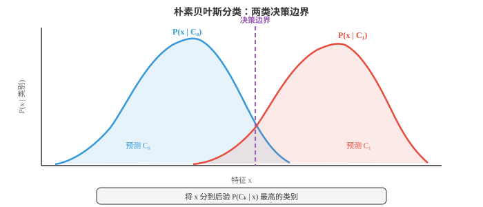
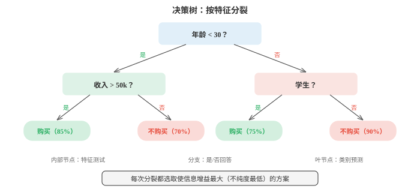
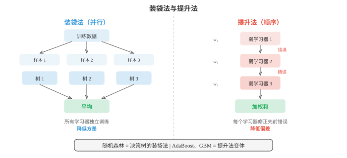
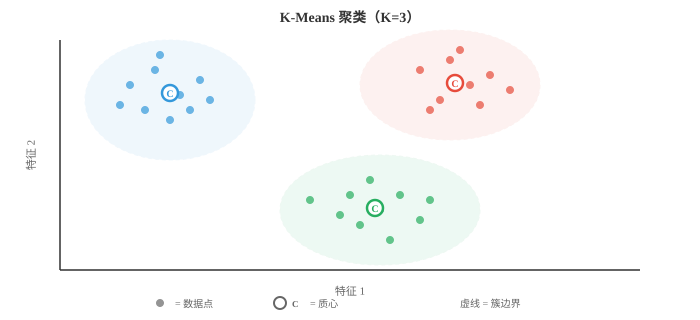
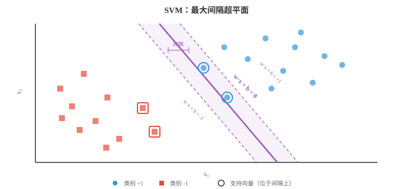

# 经典机器学习（Classical Machine Learning）

*经典机器学习（ML）算法无需显式编程即可从数据中学习模式；它们使用闭式解或启发式搜索，而非梯度下降。本节介绍朴素贝叶斯、k 近邻（k-NN）、决策树、随机森林、支持向量机（SVM）、K-Means 聚类和主成分分析（PCA）。*

- 机器学习研究这样一类算法：它们通过从数据中学习来提升某项任务的表现，而不是被显式地写入规则。你不必编写“若收入 > 50k 且年龄 < 30，则批准贷款”，而是将数千个历史贷款决策交给算法，让它自己找出模式。

- 有三种主要范式。**监督学习（supervised learning）**使用带标签的数据，即每个输入都带有已知的正确输出。算法学习从输入到输出的映射。**无监督学习（unsupervised learning）**处理无标签数据，并尝试发现隐藏结构，如聚类或压缩表示。**强化学习（reinforcement learning）**通过试错学习，对环境中的动作获得奖励或惩罚（第 04 节介绍）。

- 在监督学习中，**分类（classification）**预测离散类别，例如垃圾邮件或非垃圾邮件、猫或狗；**回归（regression）**预测连续数值，例如房价、明天的气温。两者的界限并不总是清晰：逻辑回归名为“回归”，实际却做分类。

- 概率模型中一个关键区分是**生成式与判别式（generative vs discriminative）**。生成式模型学习联合分布 $P(x, y)$，也就是说，它理解数据本身如何生成，并能产生新样本。判别式模型直接学习 $P(y \mid x)$，只关注类别之间的边界。朴素贝叶斯是生成式模型；逻辑回归（第 02 节）是判别式模型。生成式模型更灵活，但更难训练好；当数据足够时，判别式模型通常具有更高的分类准确率。

- **朴素贝叶斯（Naive Bayes）**是最简单且最有效的分类器之一。它直接应用贝叶斯定理（第 05 章）：

$$P(C_k \mid x) = \frac{P(x \mid C_k) \, P(C_k)}{P(x)}$$

- “朴素”之处在于一个很强的独立性假设：给定类别后，它把每个特征都视为相互独立。若将邮件分类为垃圾邮件，朴素贝叶斯假定一旦已知邮件是垃圾邮件，单词 “free” 的出现并不能告诉你单词 “winner” 是否出现。现实中这几乎从不成立，但这个分类器仍然出奇地有效。

- 由于所有类别的 $P(x)$ 相同，分类可以简化为选取使分子最大的类别：

$$\hat{y} = \arg\max_{k} \; P(C_k) \prod_{i=1}^{n} P(x_i \mid C_k)$$

- 先验 $P(C_k)$ 就是各类别在训练样本中所占的比例。似然 $P(x_i \mid C_k)$ 取决于特征类型，因此形成三种常见变体。

- **多项式朴素贝叶斯（Multinomial Naive Bayes）**适用于计数数据，例如文档中的词频。每个特征 $x_i$ 表示单词 $i$ 出现的次数，似然服从多项式分布。这是文本分类、情感分析和垃圾邮件过滤的标准选择。

- **高斯朴素贝叶斯（Gaussian Naive Bayes）**假定每个类别内的每个特征都服从正态分布。你从训练数据估计类别 $k$ 中特征 $i$ 的均值 $\mu_{ik}$ 和方差 $\sigma_{ik}^2$，再计算：

$$P(x_i \mid C_k) = \frac{1}{\sqrt{2\pi\sigma_{ik}^2}} \exp\!\left(-\frac{(x_i - \mu_{ik})^2}{2\sigma_{ik}^2}\right)$$

- 当特征是身高、体重或传感器读数等连续测量值时，这是自然的选择。



- **伯努利朴素贝叶斯（Bernoulli Naive Bayes）**为二元特征建模：每个特征要么出现（1），要么缺失（0）。它不统计单词出现多少次，只记录是否出现过。这很适合短文本或二元特征向量。

- 一个实际问题是：某个特征值在训练数据中从未与某一类别同时出现。其似然会变为零；由于所有项相乘，整个后验会坍缩为零。**拉普拉斯平滑（Laplace smoothing）**通过给每个特征-类别组合加入一个小计数（通常为 1）解决此问题：

$$P(x_i \mid C_k) = \frac{\text{count}(x_i, C_k) + \alpha}{\text{count}(C_k) + \alpha \cdot V}$$

- 其中 $\alpha$ 是平滑参数（通常为 1），$V$ 是该特征的可能取值数量。这保证任何概率都不会恰好为零。

- **决策树（decision trees）**采用完全不同的方法。它们不计算概率，而是用一连串的是/否问题划分特征空间。可以把它想成“二十个问题”游戏：每一步都提出最能缩小可能范围的问题。

- 一棵树从包含全部训练样本的根节点开始。在每个内部节点，它选择一个特征和阈值进行划分，例如“年龄 < 30 吗？”。样本依据答案流向左侧或右侧。这个过程递归进行，直至叶节点；叶节点保存预测：分类时取多数类，回归时取均值。



- 关键问题是：应按哪个特征分裂？你希望分裂产生“最纯”的子节点，即其中大多数样本属于同一类别。两种常用的不纯度度量是**基尼不纯度（Gini impurity）**和**熵（entropy）**。

- **基尼不纯度**度量以下概率：若按节点中的类别分布给随机抽取的样本贴标签，它会被错分的概率：

$$\text{Gini}(S) = 1 - \sum_{k=1}^{K} p_k^2$$

- 若节点完全纯净，即全部样本属于同一类，基尼不纯度为 0。若类别完全均衡，例如两类各占 50%，基尼不纯度达到最大值 0.5。

- **熵**（第 05 章的信息论部分）度量平均意外程度：

$$H(S) = -\sum_{k=1}^{K} p_k \log_2 p_k$$

- 纯节点的熵为 0。完全均衡的二元节点熵为 1 比特。实际中，基尼不纯度和熵得到的树非常相似；基尼不纯度因无需计算对数而略快。

- **信息增益（information gain）**是一次分裂带来的不纯度降低。若一次分裂将集合 $S$ 划为子集 $S_L$ 和 $S_R$：

$$\text{IG}(S, \text{split}) = H(S) - \frac{|S_L|}{|S|} H(S_L) - \frac{|S_R|}{|S|} H(S_R)$$

- 算法在每个节点贪心地选择信息增益最高的分裂。这是局部最优策略，不是全局最优，但实践中效果很好。

- **回归树（regression trees）**的工作方式相同，但叶节点预测连续值，即到达叶节点的样本均值；分裂准则也由基尼不纯度或熵改为方差降低。

- 若不加约束，决策树会不断分裂，直到每个叶节点都纯净，本质上是在记忆训练数据。这是严重的过拟合。**剪枝（pruning）**用于对抗它。预剪枝在生长前设限：最大深度、每个叶节点的最小样本数，或进行分裂所需的最小信息增益。后剪枝先长出完整树，再移除不能提升验证集表现的分支。

- 单棵决策树易于解释，却往往不稳定：数据的微小变化就可能产生完全不同的树。**集成方法（ensemble methods）**组合多个模型，获得优于任何单一模型的预测。

- 核心思想是“群体智慧”。只要各个分类器的错误具有一定独立性，即使询问 100 个表现平平的分类器并采用多数投票，集成模型也可能非常出色。

- **装袋法（bagging，bootstrap aggregating）**在从原始数据中有放回抽取的不同随机子集，即自助样本上训练多个模型。每个模型大约看到原始数据的 63%。预测时，对输出求平均（回归）或采用多数投票（分类）。因为各模型看到的数据不同，它们会犯不同的错误，平均会抵消大部分方差。

- **随机森林（Random Forests）**是在决策树上应用装袋法，并额外加入一个变化：每次分裂时，树只考虑随机抽取的一部分特征，通常从总计 $d$ 个特征中取 $\sqrt{d}$ 个。这会进一步降低树之间的相关性，使集成更强大。随机森林是整个机器学习中最可靠的开箱即用分类器之一。



- **提升法（boosting）**采取相反的理念。它不独立训练模型，而是顺序训练，让每个新模型重点关注先前模型做错的样本。

- **AdaBoost（Adaptive Boosting）**为每个训练样本维护一个权重。初始时所有权重相等。训练一个弱学习器后，通常是很浅的决策树，称为“树桩（stump）”，被错分样本的权重会升高，因此下一个学习器会更关注它们。最终预测是所有学习器的加权投票，表现更好的学习器话语权更大：

$$H(x) = \text{sign}\!\left(\sum_{t=1}^{T} \alpha_t \, h_t(x)\right)$$

- 学习器 $t$ 的权重 $\alpha_t$ 取决于其错误率 $\epsilon_t$：

$$\alpha_t = \frac{1}{2} \ln\!\left(\frac{1 - \epsilon_t}{\epsilon_t}\right)$$

- 误差低的学习器获得较大的正权重；表现与随机猜测相当，即 $\epsilon = 0.5$，的学习器权重为零。

- **梯度提升（Gradient Boosting）**推广了这一想法。它不重新加权样本，而是训练每个新模型去预测当前组合集成的残差误差，即损失函数的负梯度。对于平方误差损失，残差确实就是预测与目标之间的差。使用决策树的梯度提升（GBDT）是结构化数据竞赛中许多获胜方案的基础；XGBoost、LightGBM、CatBoost 是常见实现。

- 关键对比是：装袋法降低**方差（variance）**，即平均掉噪声；提升法降低**偏差（bias）**，即纠正系统性错误。装袋法最适合单个模型容易过拟合的情形；提升法最适合单个模型欠拟合的情形。

- 转向无监督学习，**K-Means 聚类（K-Means clustering）**是最简单且最常用的聚类算法。给定 $n$ 个数据点和目标聚类数 $K$，它通过最小化每个点到其簇中心的总距离，将每个点分配到 $K$ 个组之一。

- 算法交替执行两步。第一步，将每个点**分配（assign）**给最近的质心。第二步，将每个质心**更新（update）**为分到该质心的所有点的均值。重复直至分配不再变化。它保证收敛，因为簇内总距离在每一步都会减少或保持不变。



- 形式化地，K-Means 最小化称为**惯性（inertia）**的簇内平方和：

$$J = \sum_{k=1}^{K} \sum_{x \in C_k} \|x - \mu_k\|^2$$

- 其中 $\mu_k$ 是簇 $C_k$ 的质心。

- K-Means 对初始化敏感。糟糕的初始质心可能导致较差的局部最小值。**K-Means++** 初始化策略随机选取第一个质心，再以与到最近已有质心的平方距离成正比的概率选取每个后续质心。这会分散初始中心，几乎总能得到更好的结果。

- 如何选择 $K$？常用两种工具。**肘部法（elbow method）**绘制惯性随 $K$ 变化的曲线，寻找继续增加簇数也难有明显收益的“肘部”。**轮廓系数（silhouette score）**度量一个点与自身簇的相似程度相对最近其他簇的相似程度，范围从 -1（分错簇）到 +1（聚类良好）。所有点的平均轮廓系数给出整体的聚类质量度量。

- K-Means 有局限性：它假定簇近似为大小相近的球状，且进行“硬”分配，即每个点恰好属于一个簇。**高斯混合模型（Gaussian Mixture Models，GMMs）**放宽了这两项限制。

- GMM 将数据建模为 $K$ 个高斯分布的混合，每个分布都有自己的均值 $\mu_k$、协方差 $\Sigma_k$ 和混合权重 $\pi_k$，其中权重之和为 1：

$$P(x) = \sum_{k=1}^{K} \pi_k \, \mathcal{N}(x \mid \mu_k, \Sigma_k)$$

- 每个点不再得到硬分配，而是得到**软分配（soft assignment）**：它属于每个簇的概率，也称为“责任度（responsibility）”。位于两个高斯分布边界附近的点，可能有 60% 的概率属于簇 A，40% 的概率属于簇 B。

- GMM 使用**期望最大化（Expectation-Maximisation，EM）算法**拟合，其交替执行两步，与 K-Means 很相似。**E 步（E-step）**计算责任度：对每个点，来自每个高斯分布的概率是多少？**M 步（M-step）**更新参数：给定责任度，最优的均值、协方差和混合权重是什么？EM 保证每次迭代提高数据似然，并收敛到局部最大值。

- 使用 GMM 的 EM 算法时，K-Means 实际上是一个特例：它对应协方差相等的球状高斯分布和硬的 0/1 责任度。

- **支持向量机（Support Vector Machines，SVMs）**从几何角度处理分类问题。对于两类线性可分的数据，存在无数个分离它们的超平面。SVM 找到**最大间隔（maximum margin）**的那个，即超平面与各类最近数据点之间可能的最大间隙。

- 位于间隔边缘的最近点称为**支持向量（support vectors）**。它们是定义边界的唯一关键点；即使移除其余所有训练点，得到的超平面也相同。



- 对于线性分类器 $f(x) = w \cdot x + b$，求最大间隔等价于求解：

$$\min_{w, b} \; \frac{1}{2}\|w\|^2 \quad \text{subject to} \quad y_i(w \cdot x_i + b) \geq 1 \; \text{for all } i$$

- 这是凸二次规划，因此有唯一的全局解，无需担心局部最小值。

- 真实数据很少完全可分。**软间隔 SVM（soft-margin SVM）**通过引入松弛变量 $\xi_i \geq 0$，允许一些点违反间隔：

$$\min_{w, b, \xi} \; \frac{1}{2}\|w\|^2 + C \sum_{i=1}^{n} \xi_i \quad \text{subject to} \quad y_i(w \cdot x_i + b) \geq 1 - \xi_i$$

- 超参数 $C$ 控制权衡：较大的 $C$ 会严厉惩罚错分，拟合更紧但有过拟合风险；较小的 $C$ 允许更多违反，间隔更宽、正则化更强。

- SVM 最强大的特性是**核技巧（kernel trick）**。许多在原始特征空间中线性不可分的数据集，映射到更高维空间后会变得可分。核技巧让你在高维空间计算点积，而无需显式计算该变换。

- 核函数 $K(x_i, x_j) = \phi(x_i) \cdot \phi(x_j)$ 替代 SVM 优化中的每个点积。最流行的核是**径向基函数（Radial Basis Function，RBF）核**：

$$K(x_i, x_j) = \exp\!\left(-\gamma \|x_i - x_j\|^2\right)$$

- RBF 核隐式地将数据映射到无限维空间。参数 $\gamma$ 控制单个训练点影响能延伸多远：较大 $\gamma$ 表示每个点只影响其紧邻区域，存在过拟合风险；较小 $\gamma$ 给出更平滑的边界。

- 其他常见核包括多项式核 $K(x_i, x_j) = (x_i \cdot x_j + c)^d$，以及线性核 $K(x_i, x_j) = x_i \cdot x_j$，后者就是不做任何变换的标准 SVM。

- 在实践中，深度学习接管前，使用 RBF 核的 SVM 曾是主导分类器。它们在中小型数据集上仍表现良好，尤其是特征数相对样本数较大时。

- SVM 与第 02 章矩阵的联系很深。优化通常以其对偶形式求解，解只依赖训练样本之间的点积，这也正是核技巧成立的原因。整个算法都在内积与线性代数的语言中运行。

- 总结经典 ML 工具箱：

| 算法 | 类型 | 主要优势 | 主要弱点 |
|---|---|---|---|
| Naive Bayes | 监督（生成式） | 快速，少量数据也可用 | 独立性假设 |
| Decision Tree | 监督 | 可解释 | 容易过拟合 |
| Random Forest | 监督（集成） | 稳健，超参数少 | 可解释性较低 |
| Gradient Boosting | 监督（集成） | 表格数据上的先进方法 | 更慢，需要更多调参 |
| K-Means | 无监督（聚类） | 简单，可扩展 | 假定簇为球状 |
| GMM | 无监督（聚类） | 软分配，形状灵活 | 对初始化敏感 |
| SVM | 监督 | 高维空间有效 | 大型数据集上较慢 |

## 编程任务（使用 CoLab 或 notebook）

1. 从零实现高斯朴素贝叶斯。在含有两个类别的合成二维数据上训练，并可视化决策边界。与 scikit-learn 的实现比较。
```python
import jax.numpy as jnp
import matplotlib.pyplot as plt
from sklearn.datasets import make_classification

# Generate synthetic data
X, y = make_classification(n_samples=300, n_features=2, n_redundant=0,
                           n_informative=2, n_clusters_per_class=1, random_state=42)
X, y = jnp.array(X), jnp.array(y)

# Fit Gaussian Naive Bayes from scratch
classes = jnp.unique(y)
params = {}
for c in classes:
    c = int(c)
    mask = y == c
    X_c = X[mask]
    params[c] = {
        'mean': jnp.mean(X_c, axis=0),
        'var': jnp.var(X_c, axis=0),
        'prior': jnp.sum(mask) / len(y)
    }

def gaussian_log_likelihood(x, mean, var):
    return -0.5 * jnp.sum(jnp.log(2 * jnp.pi * var) + (x - mean)**2 / var)

def predict(X):
    preds = []
    for x in X:
        log_posts = []
        for c in [0, 1]:
            log_post = jnp.log(params[c]['prior']) + gaussian_log_likelihood(
                x, params[c]['mean'], params[c]['var'])
            log_posts.append(log_post)
        preds.append(jnp.argmax(jnp.array(log_posts)))
    return jnp.array(preds)

# Decision boundary visualisation
xx, yy = jnp.meshgrid(jnp.linspace(X[:,0].min()-1, X[:,0].max()+1, 200),
                       jnp.linspace(X[:,1].min()-1, X[:,1].max()+1, 200))
grid = jnp.column_stack([xx.ravel(), yy.ravel()])
zz = predict(grid).reshape(xx.shape)

plt.figure(figsize=(8, 6))
plt.contourf(xx, yy, zz, alpha=0.3, cmap='coolwarm')
plt.scatter(X[y==0, 0], X[y==0, 1], c='#3498db', label='Class 0', edgecolors='k', s=20)
plt.scatter(X[y==1, 0], X[y==1, 1], c='#e74c3c', label='Class 1', edgecolors='k', s=20)
plt.title("Gaussian Naive Bayes Decision Boundary")
plt.legend()
plt.grid(alpha=0.3)
plt.show()

accuracy = jnp.mean(predict(X) == y)
print(f"Training accuracy: {accuracy:.2%}")
```

2. 构建一棵使用基尼不纯度进行分裂的决策树。实现单个节点的分裂逻辑，并展示信息增益如何选择最佳特征与阈值。
```python
import jax.numpy as jnp

def gini_impurity(y):
    """Gini impurity of a label array."""
    classes, counts = jnp.unique(y, return_counts=True)
    probs = counts / len(y)
    return 1.0 - jnp.sum(probs ** 2)

def information_gain(y, left_mask):
    """IG from splitting y into left/right by boolean mask."""
    parent_gini = gini_impurity(y)
    left_y, right_y = y[left_mask], y[~left_mask]
    n = len(y)
    if len(left_y) == 0 or len(right_y) == 0:
        return 0.0
    child_gini = (len(left_y)/n) * gini_impurity(left_y) + \
                 (len(right_y)/n) * gini_impurity(right_y)
    return float(parent_gini - child_gini)

def best_split(X, y):
    """Find the feature and threshold that maximise information gain."""
    best_ig, best_feat, best_thresh = -1, None, None
    for feat in range(X.shape[1]):
        thresholds = jnp.unique(X[:, feat])
        for thresh in thresholds:
            mask = X[:, feat] <= float(thresh)
            ig = information_gain(y, mask)
            if ig > best_ig:
                best_ig, best_feat, best_thresh = ig, feat, float(thresh)
    return best_feat, best_thresh, best_ig

# Example: synthetic data
from sklearn.datasets import make_classification
X, y = make_classification(n_samples=100, n_features=4, n_redundant=0, random_state=0)
X, y = jnp.array(X), jnp.array(y)

feat, thresh, ig = best_split(X, y)
print(f"Best split: feature {feat}, threshold {thresh:.3f}, info gain {ig:.4f}")
print(f"Parent Gini: {gini_impurity(y):.4f}")
mask = X[:, feat] <= thresh
print(f"Left Gini:   {gini_impurity(y[mask]):.4f} ({int(jnp.sum(mask))} samples)")
print(f"Right Gini:  {gini_impurity(y[~mask]):.4f} ({int(jnp.sum(~mask))} samples)")
```

3. 从零实现带 K-Means++ 初始化的 K-Means。对合成数据集聚类，并在每次迭代时可视化各簇。
```python
import jax
import jax.numpy as jnp
import matplotlib.pyplot as plt
from sklearn.datasets import make_blobs

# Generate synthetic clusters
X, y_true = make_blobs(n_samples=300, centers=4, cluster_std=0.8, random_state=42)
X = jnp.array(X)

def kmeans_plus_plus_init(X, K, key):
    """K-Means++ initialisation."""
    n = X.shape[0]
    idx = jax.random.randint(key, (), 0, n)
    centroids = [X[idx]]
    for _ in range(1, K):
        dists = jnp.min(jnp.stack([jnp.sum((X - c)**2, axis=1) for c in centroids]), axis=0)
        probs = dists / jnp.sum(dists)
        key, subkey = jax.random.split(key)
        idx = jax.random.choice(subkey, n, p=probs)
        centroids.append(X[idx])
    return jnp.stack(centroids)

def kmeans(X, K, max_iters=20, key=jax.random.PRNGKey(0)):
    centroids = kmeans_plus_plus_init(X, K, key)
    history = [centroids]
    for _ in range(max_iters):
        # Assign step
        dists = jnp.stack([jnp.sum((X - c)**2, axis=1) for c in centroids])
        labels = jnp.argmin(dists, axis=0)
        # Update step
        new_centroids = jnp.stack([
            jnp.mean(X[labels == k], axis=0) for k in range(K)
        ])
        history.append(new_centroids)
        if jnp.allclose(centroids, new_centroids):
            break
        centroids = new_centroids
    return labels, centroids, history

K = 4
labels, centroids, history = kmeans(X, K)

# Plot final result
colors = ['#3498db', '#e74c3c', '#27ae60', '#9b59b6']
plt.figure(figsize=(8, 6))
for k in range(K):
    mask = labels == k
    plt.scatter(X[mask, 0], X[mask, 1], c=colors[k], s=20, alpha=0.6)
    plt.scatter(centroids[k, 0], centroids[k, 1], c=colors[k], marker='X',
                s=200, edgecolors='k', linewidths=1.5)
plt.title(f"K-Means Clustering (K={K}, {len(history)-1} iterations)")
plt.grid(alpha=0.3)
plt.show()

# Compute inertia
inertia = sum(jnp.sum((X[labels == k] - centroids[k])**2) for k in range(K))
print(f"Final inertia: {inertia:.2f}")
```

4. 演示核技巧。通过将核矩阵与多项式核的显式特征映射比较，说明 RBF 核如何在高维空间计算点积。
```python
import jax.numpy as jnp

# Simple 2D data
X = jnp.array([[1.0, 2.0], [3.0, 4.0], [5.0, 6.0]])

# Polynomial kernel: K(x,y) = (x·y + 1)^2
def poly_kernel(X, degree=2, c=1.0):
    return (X @ X.T + c) ** degree

# Explicit degree-2 feature map for 2D: (1, sqrt(2)*x1, sqrt(2)*x2, x1^2, x2^2, sqrt(2)*x1*x2)
def poly_features(X):
    x1, x2 = X[:, 0], X[:, 1]
    return jnp.column_stack([
        jnp.ones(len(X)),
        jnp.sqrt(2) * x1,
        jnp.sqrt(2) * x2,
        x1 ** 2,
        x2 ** 2,
        jnp.sqrt(2) * x1 * x2
    ])

K_trick = poly_kernel(X)
phi = poly_features(X)
K_explicit = phi @ phi.T

print("Kernel trick (polynomial degree 2):")
print(K_trick)
print("\nExplicit feature map dot products:")
print(K_explicit)
print(f"\nMatrices match: {jnp.allclose(K_trick, K_explicit)}")

# RBF kernel: no finite explicit map exists
def rbf_kernel(X, gamma=0.5):
    sq_dists = jnp.sum(X**2, axis=1, keepdims=True) + \
               jnp.sum(X**2, axis=1) - 2 * X @ X.T
    return jnp.exp(-gamma * sq_dists)

K_rbf = rbf_kernel(X)
print("\nRBF kernel matrix:")
print(K_rbf)
print("Diagonal is always 1 (a point is identical to itself)")
print("Off-diagonal entries decay with distance")
```
