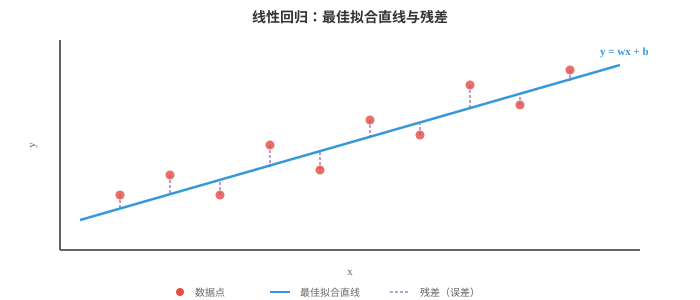
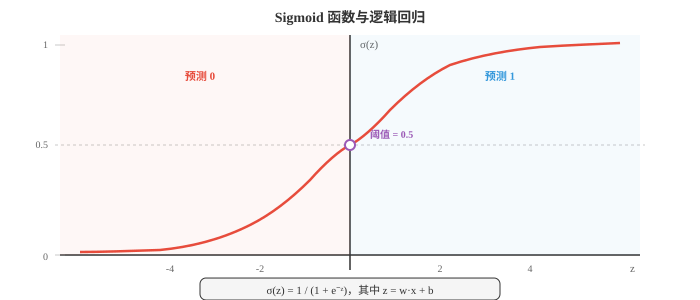
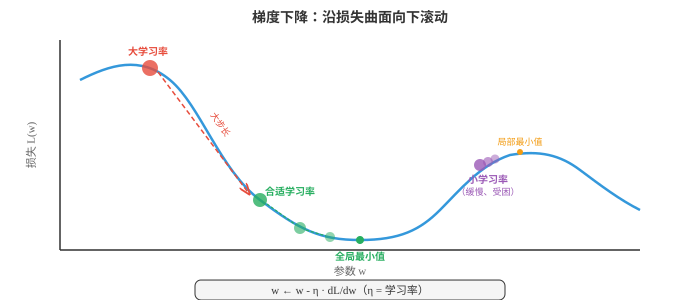
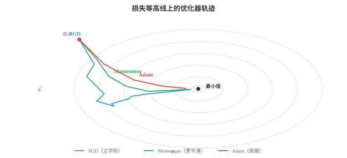
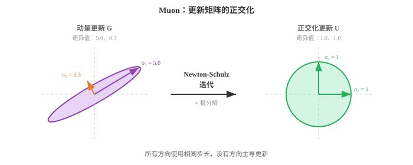
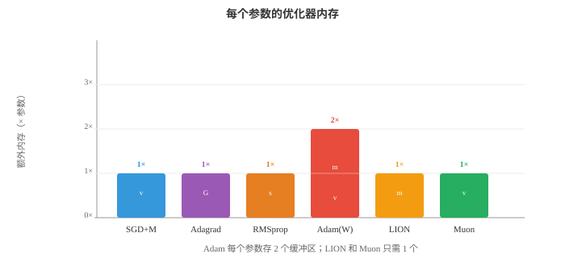

# 基于梯度的机器学习（Gradient Machine Learning）

*基于梯度的学习通过沿损失曲面的斜率反复迭代，优化模型参数。本节介绍线性回归、逻辑回归、softmax 分类、梯度下降的变体、正则化（L1/L2）以及偏差-方差权衡。*

- 第 01 节的经典方法使用巧妙的启发式方法或闭式解。本节介绍通过跟随梯度学习的算法：在损失曲面上朝下走一小步又一小步，直至找到良好的参数。基于梯度的学习是从线性回归到最大型神经网络背后的引擎。

!!! note "大白话"
    这一类方法不直接猜最终参数，而是反复看“往哪边改会让错误变小”，一点点把模型调好。

- **线性回归（linear regression）**是最简单的基于梯度的模型，并且也有闭式解，因此是理想的起点。模型是一条直线，高维时为超平面：

$$\hat{y} = w \cdot x + b = \sum_{i=1}^{d} w_i x_i + b$$

!!! note "大白话"
    每个特征先乘一个重要程度 $w_i$，全部相加后再加基准值 $b$。二维时是一条线，特征更多时只是看不见的高维平面。

- 用矩阵记法（第 02 章）表示，若将所有训练输入按行堆叠为矩阵 $X$，并通过附加一列 1 将偏置吸收进 $w$，则得到 $\hat{y} = Xw$。

!!! note "大白话"
    把很多样本一次排进矩阵，就能用一次矩阵乘法同时算出全部预测；把常数列 1 加进去，偏置也能并入同一组权重。

- 目标是最小化**均方误差（mean squared error，MSE）**，即预测值与真实值之差的平方平均：

$$\mathcal{L}(w) = \frac{1}{n} \sum_{i=1}^{n} (y_i - \hat{y}_i)^2 = \frac{1}{n} \|y - Xw\|^2$$

!!! note "大白话"
    每题错多少先平方再平均。平方会让大错比小错更显眼，因此模型会特别努力修正离谱的预测。

- 为什么使用平方误差？它有概率论依据：若假定目标由 $y = Xw + \epsilon$ 生成，其中 $\epsilon \sim \mathcal{N}(0, \sigma^2)$，则最大化数据的高斯似然（第 05 章）等价于最小化 MSE。平方误差也比小错误更严厉地惩罚大错误，这通常是理想的性质。



!!! note "大白话"
    如果把误差看成普通的随机波动，找最可能的直线正好就是让 MSE 最小。图里的竖线就是每个点离预测线差多少。

- 由于 MSE 是 $w$ 的二次函数，它有唯一的全局最小值，可用解析方法找到。求导、令导数为零并求解，得到**正规方程（normal equation）**：

$$w^{*} = (X^T X)^{-1} X^T y$$

!!! note "大白话"
    对小问题，这个公式能一步求出最优权重，不必慢慢走梯度下降；它相当于直接解“误差最低点在哪里”。

- 它直接使用了第 02 章的矩阵逆。表达式 $X^T X$ 是 $d \times d$ 矩阵，其中 $d$ 是特征数；$X^T y$ 是 $d$ 维向量。正规方程一次即可给出精确的最优权重。

!!! note "大白话"
    这里计算量主要花在对 $d \times d$ 矩阵求逆，所以特征很少时很方便，特征很多时就不划算。

- 正规方程何时失效？当 $X^T X$ 是奇异矩阵，即不可逆时。若特征线性相关，或特征数多于样本数，即 $d > n$，就会发生这种情况。此时需要正则化（后文介绍）或梯度下降。

!!! note "大白话"
    两列特征若本质上重复，或未知数比题目还多，公式就没有唯一解。此时要加约束，或改用逐步优化。

- **逻辑回归（logistic regression）**将线性模型调整为二元分类。我们不再预测连续值，而是要得到介于 0 和 1 之间的概率。**sigmoid 函数**将任意实数压缩到这个范围：

$$\sigma(z) = \frac{1}{1 + e^{-z}}$$

!!! note "大白话"
    线性模型先给出任意大的正负分数，sigmoid 再把它翻译成 0 到 1 的概率，方便做“是或否”的判断。

- 模型计算 $z = w \cdot x + b$，即与线性回归相同的线性得分，再将其传入 sigmoid：$\hat{y} = \sigma(w \cdot x + b)$。输出 $\hat{y}$ 被解释为 $P(y = 1 \mid x)$。



!!! note "大白话"
    分数高不等于直接叫“正类”，而是先变成概率。通常概率超过 0.5 就判为正类，但阈值可以按业务代价调整。

- sigmoid 有很好的性质：$\sigma(0) = 0.5$；$\sigma(z) \to 1$ 当 $z \to \infty$；$\sigma(z) \to 0$ 当 $z \to -\infty$；其导数也有优雅形式 $\sigma'(z) = \sigma(z)(1 - \sigma(z))$。

!!! note "大白话"
    分数为 0 时正反各半；分数很大或很小时概率会贴近 1 或 0。导数写得简单，才让训练时的求梯度很方便。

- 逻辑回归的损失函数是**二元交叉熵（binary cross-entropy，BCE）**，它直接来自伯努利似然（第 05 章）：

$$\mathcal{L} = -\frac{1}{n} \sum_{i=1}^{n} \left[ y_i \log(\hat{y}_i) + (1 - y_i) \log(1 - \hat{y}_i) \right]$$

!!! note "大白话"
    真实答案是 1 时，它要求模型给 1 高概率；真实答案是 0 时，它要求模型给 0 高概率。答得越自信却越错，罚得越重。

- 真实标签为 1 时，只有第一项起作用，它惩罚过低的预测；真实标签为 0 时，只有第二项起作用，它惩罚过高的预测。对数会让自信但错误的预测承受极陡的惩罚：真实标签为 1 时，预测 0.01 的代价远高于预测 0.4。

!!! note "大白话"
    “不太确定地猜错”和“拍胸脯猜错”不能同罚。交叉熵专门严惩后者，逼模型学会校准自己的把握。

- 不同于线性回归中最小化 MSE 的情形，最小化 BCE 的权重没有闭式解。需要采用迭代方法：**梯度下降（gradient descent）**。

!!! note "大白话"
    这次没有一个能直接代入的最终公式，只能不断试着改权重，看错误是否下降。

- 梯度下降的直觉很简单：想象你在雾中站在丘陵地形，即损失曲面上。你看不到全局最小值，却能感觉脚下的坡度。你向下走一步，再感受坡度，然后重复。最终会到达谷底。

$$w \leftarrow w - \eta \frac{\partial \mathcal{L}}{\partial w}$$

!!! note "大白话"
    梯度告诉你哪里上坡最快，所以取负号就是往下走。训练的每一步都只做一次小的参数修正。

- 学习率 $\eta$ 控制步长。太大时会越过谷底、反复弹跳而不收敛；太小时又会走得极慢，并可能困在局部最小值。



!!! note "大白话"
    学习率像下山的步子：步子太大容易冲过头，太小又走不完。它是训练最关键的控制旋钮之一。

- 梯度 $\frac{\partial \mathcal{L}}{\partial w}$ 是指向最陡上升方向的向量。我们减去它，是因为希望向下走。这是将第 03 章的链式法则应用于损失函数。

!!! note "大白话"
    梯度不只是说“错了多少”，还说“每个参数该往哪个方向动、动一点会有什么影响”。

- **批量梯度下降（batch gradient descent）**每一步都用整个训练集计算梯度。它给出精确梯度，但当 $n$ 很大时开销昂贵。

!!! note "大白话"
    每走一步都把全班作业重新看一遍，方向最准确，但数据大时每一步都很慢。

- **随机梯度下降（stochastic gradient descent，SGD）**每一步只使用一个随机样本。梯度带有噪声，即用一个样本估计真实梯度，但每一步极快。这种噪声实际上可帮助逃离浅的局部最小值。

!!! note "大白话"
    它每次只看一道题就改参数，方向会抖，但更新非常快；这种抖动有时还能帮它跳出不太好的小坑。

- **小批量梯度下降（mini-batch gradient descent）**折中处理：每一步使用 $B$ 个样本，通常为 32、64 或 256。它在计算效率，即对批量进行向量化操作，和梯度质量之间取得平衡。几乎所有深度学习都使用小批量 SGD。

!!! note "大白话"
    一次看几十或几百道题，既能利用 GPU 并行，又不会像全量数据那样慢。这是实际训练的主流做法。

- **反向传播（backpropagation）**是在神经网络等拥有大量参数的模型中实际计算梯度的方法。它是第 03 章链式法则在计算图中的系统性应用。

!!! note "大白话"
    神经网络参数很多，不能一个个重新算影响。反向传播把总误差从输出端倒着传回去，高效分配每个参数该负多少责任。

- 任意模型都可以表示为一个有向无环的运算图：输入流入，和权重相乘、相加，通过非线性函数，最终产生损失值。**前向传播（forward pass）**让数据由输入流向输出，计算输出和损失。

!!! note "大白话"
    前向传播就是照着模型的计算流程把输入算到答案，再与标准答案比较，得到这次错了多少。

- **反向传播（backward pass）**让梯度反向流动。从损失开始，在每个节点使用链式法则计算损失对每个中间值的变化。若 $L$ 依赖于 $z$，且后者依赖于 $w$，则：

$$\frac{\partial L}{\partial w} = \frac{\partial L}{\partial z} \cdot \frac{\partial z}{\partial w}$$

!!! note "大白话"
    总误差先传给最后一层，再一层层往回传。每一层只需把收到的影响乘上自己的局部变化率。

- 每个节点只需知道自己的局部导数和从上游流入的梯度。这使反向传播模块化且高效：成本约为前向传播的两倍，一次向前、一次向后。

!!! note "大白话"
    每个算子只管自己的小账，不用了解整个网络。这种局部记账法让再大的计算图也能系统地求导。

- 原始 SGD 有一个问题：在曲率陡峭的方向上振荡，而在平坦方向上进展缓慢。**优化器（optimisers）**根据梯度历史调整步长来改进它。

!!! note "大白话"
    普通 SGD 每一步只听当前梯度，容易左右摇摆。优化器会记住过去的方向和大小，让更新更稳、更快。

- **带动量的 SGD（SGD with momentum）**维护过去梯度的运行平均，即指数移动平均（第 04 章）。它平滑振荡，并沿一致方向加速：

$$v_t = \beta v_{t-1} + (1 - \beta) \nabla \mathcal{L}$$
$$w \leftarrow w - \eta \, v_t$$

!!! note "大白话"
    连续朝同一方向的梯度会积累成速度，短暂的反向抖动不会立刻改变路线，所以能更快穿过长而平的谷地。

- 可以把它想成向下滚动的球：动量让它在一致方向积累速度，并抑制左右摇摆。典型取值为 $\beta = 0.9$。

!!! note "大白话"
    $\beta = 0.9$ 表示大部分相信过去的方向，也留一部分空间听当前的新信息。

- **Nesterov 加速梯度（Nesterov Accelerated Gradient，NAG）**是一个小而巧妙的调整：不在当前位置计算梯度，而在“前瞻”位置 $w - \eta \beta v_{t-1}$ 计算。这个修正步骤减少了越冲：

$$v_t = \beta \, v_{t-1} + \nabla \mathcal{L}(w - \eta \beta \, v_{t-1})$$
$$w \leftarrow w - \eta \, v_t$$

!!! note "大白话"
    它先预估自己靠动量会滑到哪里，再在那里看坡度。这样能更早发现要冲过头，及时刹车。

- **Adagrad**为每个参数自适应调整学习率。获得大梯度的参数学习率变小，反之亦然。它累积梯度平方：

$$G_t = G_{t-1} + g_t^2, \quad w \leftarrow w - \frac{\eta}{\sqrt{G_t + \epsilon}} g_t$$

!!! note "大白话"
    经常变化很猛的参数会自动放慢，长期很少更新的参数能走得相对快，特别适合稀疏特征。

- 问题在于：$G_t$ 只会增长，因此有效学习率单调下降，最终小到无法继续学习。

!!! note "大白话"
    它把很久以前的梯度也永久记着，结果步子只能越来越小，训练后期可能几乎停住。

- **RMSprop**通过使用梯度平方的指数移动平均而非累积和解决这个问题，因此近期梯度比久远梯度更重要：

$$s_t = \beta \, s_{t-1} + (1 - \beta) g_t^2, \quad w \leftarrow w - \frac{\eta}{\sqrt{s_t + \epsilon}} g_t$$

!!! note "大白话"
    RMSprop 会逐渐淡忘很久以前的变化，因此学习率能随当前训练状态调整，不会被早期记录永久压小。

- **Adam**，即 Adaptive Moment Estimation，结合了动量与 RMSprop。它同时维护一阶矩估计，即梯度均值，类似动量，和二阶矩估计，即梯度平方的均值，类似 RMSprop：

$$m_t = \beta_1 m_{t-1} + (1 - \beta_1) g_t$$
$$v_t = \beta_2 v_{t-1} + (1 - \beta_2) g_t^2$$

!!! note "大白话"
    Adam 一边记“长期该往哪走”，一边记“这个方向波动有多大”，再为每个参数定制步长。

- 因为 $m_t$ 和 $v_t$ 初始化为零，它们在早期步骤中会偏向零。偏差校正可解决它：

$$\hat{m}_t = \frac{m_t}{1 - \beta_1^t}, \quad \hat{v}_t = \frac{v_t}{1 - \beta_2^t}$$

$$w \leftarrow w - \frac{\eta}{\sqrt{\hat{v}_t} + \epsilon} \hat{m}_t$$



!!! note "大白话"
    刚开始没有历史数据，直接平均会被零拉低；偏差校正把这个人为偏小补回来。图中 Adam 通常比普通 SGD 更少绕路。

- 默认超参数，即 $\beta_1 = 0.9$、$\beta_2 = 0.999$、$\epsilon = 10^{-8}$，在广泛问题上都表现良好，因此 Adam 是多数深度学习工作的默认优化器。

!!! note "大白话"
    这些默认值不是魔法，但往往已经能作为合理起点。实际中最常调的通常仍是基础学习率。

- **AdamW**将权重衰减与梯度更新解耦。标准 L2 正则化与权重衰减对 SGD 等价，对 Adam 却不等价。AdamW 直接对参数施加权重衰减，而非向梯度加入 $\lambda w$。这带来更好的泛化能力，现在已是 Transformer 训练的标准做法：

$$w \leftarrow w - \eta \left( \frac{\hat{m}_t}{\sqrt{\hat{v}_t} + \epsilon} + \lambda \, w \right)$$

!!! note "大白话"
    AdamW 在按梯度学习的同时，单独把权重轻轻往零拉，避免模型靠过大的参数死记训练集。

- **LION**，即 EvoLved Sign Momentum，是通过程序搜索发现的较新优化器。它只使用动量更新的符号，不使用大小，因此每次更新的尺度一致。LION 比 Adam 占用更少内存，没有二阶矩缓冲区，并能在许多任务上匹敌或超过 Adam：

$$w \leftarrow w - \eta \cdot \text{sign}(\beta_1 \, m_{t-1} + (1 - \beta_1) \, g_t)$$
$$m_t = \beta_2 \, m_{t-1} + (1 - \beta_2) \, g_t$$

!!! note "大白话"
    LION 只采纳“往左还是往右”的方向，不在乎梯度有多大，所以少存一份二阶统计量，内存更省。

- **Muon**，即 Momentum + Orthogonalisation，应用 Nesterov 动量后，利用 Newton-Schulz 迭代对更新矩阵进行正交化，该迭代近似极分解。所得更新方向位于 Stiefel 流形上，每个更新在所有奇异方向上的量级大致相同，防止任何单一方向主导。这消除了对自适应二阶矩估计的需求，没有类似 Adam 的 $v_t$ 缓冲区，从而减少内存。Muon 在 Transformer 训练中展示了强劲结果，往往以更快的收敛达到 AdamW 的质量，尤其适用于注意力与 MLP 权重矩阵。嵌入层和输出层通常仍由 AdamW 处理。

$$G_t = \text{NesterovMomentum}(\nabla \mathcal{L})$$
$$U_t = \text{NewtonSchulz}(G_t) \approx G_t (G_t^T G_t)^{-1/2}$$
$$W \leftarrow W - \eta \, U_t$$

!!! note "大白话"
    Muon 先得到带动量的更新，再把矩阵更新“压平”到各个方向更均衡，避免少数方向步子特别大。它是面向大矩阵权重的较新方案，不是所有参数都适合它。

- Newton-Schulz 迭代通过重复 $X_{k+1} = \frac{1}{2} X_k (3I - X_k^T X_k)$ 若干步，通常为 5 至 10 步，计算正交因子。它避免完整 SVD 的成本，同时给出良好近似。





!!! note "大白话"
    完整 SVD 很贵，Newton-Schulz 用少量矩阵乘法近似达到“各方向更均匀”的效果。图表强调的是更新形状与额外内存的取舍。

- 除 MSE 和 BCE 外，还有若干常用的**损失函数（loss functions）**。

!!! note "大白话"
    损失函数就是训练时的计分规则。不同任务、不同异常值风险，需要不同的扣分方式。

- **平均绝对误差（Mean Absolute Error，MAE）**，即 L1 损失，取绝对差的平均：$\frac{1}{n}\sum|y_i - \hat{y}_i|$。它比 MSE 对离群值更稳健，因为不会对大误差取平方。

!!! note "大白话"
    MAE 把每一单位误差同等计入，不会让极少数离谱点把训练方向完全带偏。

- **Huber 损失**结合两者的优点：小误差时表现为 MSE，平滑且易优化；大误差时表现为 MAE，对离群值稳健。其阈值 $\delta$ 控制过渡。

!!! note "大白话"
    普通误差时它像 MSE 一样细致调整，遇到特别离谱的点就像 MAE 一样不过度激动，是两者的折中。

- **类别交叉熵（Categorical cross-entropy，CCE）**将 BCE 推广到多类别。若 $\hat{y}_k$ 是类别 $k$ 的预测概率，真实类别为 $c$：

$$\mathcal{L} = -\log(\hat{y}_c)$$

!!! note "大白话"
    多类别时只重点看模型给真实那一类分了多少概率。真实类概率越接近 1，损失越接近 0。

- 它就是正确类别概率的负对数。最小化交叉熵等价于最大化似然，这又回到第 05 章的信息论：交叉熵度量用预测分布而非真实分布时所需的额外比特数。

!!! note "大白话"
    模型越相信正确答案，代价越低；把很可能发生的事说成不可能，会带来很大的信息代价。

- **合页损失（hinge loss）**由 SVM 使用：$\mathcal{L} = \max(0, 1 - y \cdot f(x))$。它只惩罚位于间隔错误一侧或间隔内部的预测。一旦一个点以足够置信度被正确分类，损失就为零。

!!! note "大白话"
    SVM 不满足于“刚好分对”，还要求离边界有安全距离。站得够稳的样本不再产生额外损失。

- **正则化（regularisation）**通过为复杂模型增加惩罚防止过拟合。正则化损失为：

$$\mathcal{L}_{\text{reg}} = \mathcal{L}_{\text{data}} + \lambda \, R(w)$$

!!! note "大白话"
    模型不能只追求训练题满分，还要为过度复杂付代价。$\lambda$ 决定这条“别太复杂”的规则有多严格。

- **L2 正则化**，即 Ridge、权重衰减，惩罚权重平方和：$R(w) = \|w\|^2 = \sum w_i^2$。它抑制任意单个权重过大，等效地将所有权重向零收缩，却很少使它们恰好为零。

!!! note "大白话"
    L2 像给所有旋钮加一点回弹力，防止任何权重拧得过头，但通常不会把旋钮直接关死。

- **L1 正则化**，即 Lasso，惩罚权重绝对值之和：$R(w) = \|w\|_1 = \sum |w_i|$。它鼓励稀疏性，使许多权重恰好变为零，因此会自动选择特征。

!!! note "大白话"
    L1 更像强迫模型精简：不重要的特征权重会被压到完全为零，等于自动删掉它们。

- **Elastic Net**结合二者：$R(w) = \alpha \|w\|_1 + (1 - \alpha) \|w\|^2$，混合稀疏性与收缩。

!!! note "大白话"
    它既希望删掉明显没用的特征，又不希望保留下来的权重太极端，适合需要两种效果兼顾时。

- 这里有一个很优美的贝叶斯解释（第 05 章）。L2 正则化等价于在权重上放置高斯先验并寻找 MAP 估计；L1 正则化对应拉普拉斯先验。正则化强度 $\lambda$ 控制你相对数据对先验的信任程度。

!!! note "大白话"
    正则化可以理解为先相信“合理的权重通常别太夸张”，再让数据来修正这个初始信念。$\lambda$ 越大，越相信这条先验。

- **评估指标（evaluation metrics）**告诉你模型是否真正有效。回归中 MSE 和 MAE 是标准指标；分类的情况则更细致。

!!! note "大白话"
    训练损失低不等于业务上好用。先搞清楚错报和漏报哪个更严重，才知道该看什么分数。

- **混淆矩阵（confusion matrix）**是二元分类中含有四种计数的表：

!!! note "大白话"
    先把模型判断和真实答案交叉统计，才知道它是把正例漏掉了，还是把负例错报成正例。

  - 真正例（True Positive，TP）：预测为正，实际为正

    !!! note "大白话"
        该抓到的正例抓到了，例如真正的垃圾邮件被正确拦下。

  - 假正例（False Positive，FP）：预测为正，实际为负

    !!! note "大白话"
        这是误报：本来没问题，却被模型错判为有问题。

  - 真负例（True Negative，TN）：预测为负，实际为负

    !!! note "大白话"
        该放行的负例正确放行了。

  - 假负例（False Negative，FN）：预测为负，实际为正

    !!! note "大白话"
        这是漏报：本来有问题，却被模型放过去了。

- **准确率（accuracy）** = $\frac{TP + TN}{TP + TN + FP + FN}$ 在类别不平衡时可能有误导性。若 99% 的邮件不是垃圾邮件，一个永远预测“非垃圾邮件”的模型有 99% 准确率，却毫无用处。

!!! note "大白话"
    准确率只看总共答对多少，极度不平衡时会掩盖关键类别完全没抓到的问题。

- **精确率（precision）** = $\frac{TP}{TP + FP}$ 回答的是：全部预测为正的样本中，有多少实际为正？高精确率意味着误报少。

!!! note "大白话"
    当一次误报代价很高时看精确率，例如把正常邮件误删时要特别在意“说有问题时准不准”。

- **召回率（recall）**，即灵敏度，= $\frac{TP}{TP + FN}$ 回答的是：所有实际为正的样本中，你捕获了多少？高召回率意味着漏报少。

!!! note "大白话"
    当漏掉一个正例很危险时看召回率，例如疾病筛查宁可多复查，也不希望把患者漏掉。

- **F1 分数（F1 score）** = $\frac{2 \cdot \text{precision} \cdot \text{recall}}{\text{precision} + \text{recall}}$ 是精确率和召回率的调和平均，兼顾两者。

!!! note "大白话"
    F1 不会让其中一项特别差被另一项掩盖；精确率和召回率都过得去，F1 才会高。

- **ROC 曲线**在分类阈值从 0 变化到 1 时，绘制真正例率，即召回率，相对于假正例率 $\frac{FP}{FP + TN}$ 的关系。完美分类器贴近左上角。**AUC**，即 ROC 曲线下面积，用一个数概括性能：1.0 表示完美，0.5 表示随机猜测。

!!! note "大白话"
    ROC 看不同阈值下“多抓到正例”和“多误报负例”的交换关系；AUC 越大，说明模型把正例排在负例前面的能力越强。

- **交叉验证（cross-validation）**提供更可靠的泛化性能估计。在 $k$ 折交叉验证中，将数据分为 $k$ 折，用其中 $k-1$ 折训练，在剩余一折测试，并轮换。所有 $k$ 折上的平均测试表现即为估计。它让全部数据都用于训练和测试，只是不在同一时刻，这在数据稀缺时尤其宝贵。

!!! note "大白话"
    数据少时，不要只凭一次切分下结论。轮流让每一份数据当测试集，平均结果更不容易被一次巧合误导。

- **偏差-方差权衡（bias-variance tradeoff）**，第 04 章曾介绍，是 ML 中的基本张力。模型的期望误差可分解为：

$$\text{Error} = \text{Bias}^2 + \text{Variance} + \text{Irreducible Noise}$$

!!! note "大白话"
    总错误有三部分：模型想得太简单的固定错误、对训练样本太敏感的波动错误，以及任何模型都消不掉的随机噪声。

- **偏差（bias）**是错误假设导致的系统性误差，例如用直线拟合弯曲数据。**方差（variance）**是对训练数据波动的敏感性，例如用 20 次多项式拟合噪声。简单模型偏差高、方差低；复杂模型偏差低、方差高。最佳平衡点使总误差最小。

!!! note "大白话"
    模型太简单会一直犯同一种错；模型太复杂会把训练集的偶然细节当真。好模型在两者之间找平衡。

- **学习率调度（learning rate scheduling）**在训练期间调整 $\eta$。常见策略：

!!! note "大白话"
    训练初期可以步子大些快速靠近答案，后期要步子小些精细收敛。调度就是安排这条步长时间表。

  - 阶梯衰减：每 $N$ 个 epoch 将 $\eta$ 乘以一个因子，例如 0.1

    !!! note "大白话"
        每过一段固定时间就把步子突然缩小，规则简单，但变化不够平滑。

  - 余弦退火：沿余弦曲线将 $\eta$ 从初始值平滑降至接近零

    !!! note "大白话"
        学习率像缓慢滑下的曲线，不会在某一步突然大幅改变。

  - 预热：从很小的 $\eta$ 开始，在前几千步线性增大，再衰减。它避免过大的初始梯度破坏训练稳定性

    !!! note "大白话"
        刚开始模型参数还没稳定，先用小步热身，避免第一批梯度把训练直接带偏。

  - 1cycle：先升后降的一个余弦周期，可带来更快收敛

    !!! note "大白话"
        先把步子加大探索，再逐渐缩小收敛，有时能更快找到泛化较好的解。


- **超参数调优（hyperparameter tuning）**是在学习率、批量大小、正则化强度和其他不由梯度下降学习的设置中寻找良好值的过程。常见方法：

!!! note "大白话"
    超参数不是模型自己学出来的，要由人或搜索程序试出来。学习率通常比很多细枝末节参数更值得优先调。

  - 网格搜索：尝试预定义网格中的每个组合，穷举但昂贵

    !!! note "大白话"
        把每个候选值排成表格全试一遍，最直观，但组合多时会爆炸。

  - 随机搜索：随机抽样组合，通常更高效，因为并非所有超参数都同样重要

    !!! note "大白话"
        随机撒点常比规整网格更能覆盖关键参数，因为有些参数怎么调都影响不大。

  - 贝叶斯优化：构建目标函数模型，并智能地选择下一个尝试的超参数

    !!! note "大白话"
        它会根据已试结果猜哪里更可能好，再把下一次昂贵训练投到更有希望的地方。

  - **ASHA**，即 Asynchronous Successive Halving Algorithm：以小预算并行运行许多试验，再将最有希望的试验提升到更大预算，同时及早终止其余试验。它把早停的效率与大规模并行结合起来：无需完整运行 100 次训练，而是低成本地启动全部 100 次，在每一层保留前四分之一，只有少数试验能运行至结束。这是 Ray Tune 等现代大规模调优框架的骨干。

    !!! note "大白话"
        先让很多候选方案跑一小段，明显落后的立刻停掉，把计算资源留给领先者，避免把所有试验都训练到底。

- **无调度学习（schedule-free learning）**彻底消除了学习率调度的需求。它不沿固定曲线衰减 $\eta$，而是维护两个序列：缓慢移动的迭代平均 $z_t$，它收敛到最优值；以及快速探索的迭代值 $y_t$，在其上计算梯度。最终输出是平均序列，事后可证明其收敛速度匹配最佳调度。这样调度不再是超参数：只需设置基础学习率，优化器处理其余部分。SGD 和 Adam 的无调度变体都已证明能匹敌或超过经过调优调度的对应版本。

!!! note "大白话"
    它把“探索用的快速参数”和“最终取用的平稳平均”分开，希望减少手工设计学习率曲线的工作；新方法仍需在具体任务上验证。

## 编程任务（使用 CoLab 或 notebook）

1. 使用正规方程和梯度下降分别实现线性回归。比较两种解，并绘制 GD 损失随迭代变化的收敛曲线。
```python
import jax
import jax.numpy as jnp
import matplotlib.pyplot as plt

# Generate synthetic data: y = 3x + 2 + noise
key = jax.random.PRNGKey(42)
n = 100
X = jax.random.uniform(key, (n, 1), minval=0, maxval=10)
y = 3 * X[:, 0] + 2 + jax.random.normal(key, (n,)) * 1.5

# Add bias column
X_b = jnp.column_stack([X, jnp.ones(n)])

# Normal equation
w_exact = jnp.linalg.solve(X_b.T @ X_b, X_b.T @ y)
print(f"Normal equation: w={w_exact[0]:.4f}, b={w_exact[1]:.4f}")

# Gradient descent
w_gd = jnp.zeros(2)
lr = 0.005
losses = []
for step in range(500):
    pred = X_b @ w_gd
    error = pred - y
    loss = jnp.mean(error ** 2)
    losses.append(float(loss))
    grad = (2 / n) * X_b.T @ error
    w_gd = w_gd - lr * grad

print(f"Gradient descent: w={w_gd[0]:.4f}, b={w_gd[1]:.4f}")

fig, axes = plt.subplots(1, 2, figsize=(12, 4))
axes[0].scatter(X[:, 0], y, s=15, alpha=0.5, color='#3498db')
axes[0].plot([0, 10], [w_exact[1], w_exact[0]*10 + w_exact[1]], color='#e74c3c', linewidth=2)
axes[0].set_title("Linear Regression Fit")
axes[0].set_xlabel("x"); axes[0].set_ylabel("y")

axes[1].plot(losses, color='#27ae60', linewidth=1.5)
axes[1].set_title("GD Loss Convergence")
axes[1].set_xlabel("Step"); axes[1].set_ylabel("MSE")
axes[1].set_yscale('log')
plt.tight_layout()
plt.show()
```

2. 从零使用梯度下降实现逻辑回归。在二维数据集上训练，并可视化学到的决策边界。
```python
import jax
import jax.numpy as jnp
import matplotlib.pyplot as plt
from sklearn.datasets import make_moons

# Generate data
X, y = make_moons(n_samples=300, noise=0.2, random_state=42)
X, y = jnp.array(X), jnp.array(y, dtype=jnp.float32)

def sigmoid(z):
    return 1 / (1 + jnp.exp(-z))

# Add bias column
X_b = jnp.column_stack([X, jnp.ones(len(X))])
w = jnp.zeros(3)
lr = 0.5
losses = []

for step in range(2000):
    z = X_b @ w
    pred = sigmoid(z)
    # BCE loss
    loss = -jnp.mean(y * jnp.log(pred + 1e-8) + (1 - y) * jnp.log(1 - pred + 1e-8))
    losses.append(float(loss))
    # Gradient
    grad = X_b.T @ (pred - y) / len(y)
    w = w - lr * grad

# Decision boundary
xx, yy = jnp.meshgrid(jnp.linspace(-2, 3, 200), jnp.linspace(-1.5, 2, 200))
grid = jnp.column_stack([xx.ravel(), yy.ravel(), jnp.ones(xx.size)])
zz = sigmoid(grid @ w).reshape(xx.shape)

plt.figure(figsize=(8, 6))
plt.contourf(xx, yy, zz, levels=[0, 0.5, 1], alpha=0.3, colors=['#e74c3c', '#3498db'])
plt.contour(xx, yy, zz, levels=[0.5], colors='#9b59b6', linewidths=2)
plt.scatter(X[y==0, 0], X[y==0, 1], c='#e74c3c', s=15, label='Class 0')
plt.scatter(X[y==1, 0], X[y==1, 1], c='#3498db', s=15, label='Class 1')
plt.title("Logistic Regression Decision Boundary")
plt.legend()
plt.grid(alpha=0.3)
plt.show()
```

3. 比较二维二次曲面上的优化器轨迹。从同一起点运行 SGD、SGD+Momentum 和 Adam，并绘制它们的路径。
```python
import jax
import jax.numpy as jnp
import matplotlib.pyplot as plt

# Elongated quadratic: L(w1, w2) = 0.5*w1^2 + 10*w2^2
def loss_fn(w):
    return 0.5 * w[0]**2 + 10 * w[1]**2

grad_fn = jax.grad(loss_fn)

def run_sgd(w0, lr=0.05, steps=80):
    w = w0.copy()
    path = [w.copy()]
    for _ in range(steps):
        g = grad_fn(w)
        w = w - lr * g
        path.append(w.copy())
    return jnp.stack(path)

def run_momentum(w0, lr=0.05, beta=0.9, steps=80):
    w, v = w0.copy(), jnp.zeros(2)
    path = [w.copy()]
    for _ in range(steps):
        g = grad_fn(w)
        v = beta * v + (1 - beta) * g
        w = w - lr * v
        path.append(w.copy())
    return jnp.stack(path)

def run_adam(w0, lr=0.05, b1=0.9, b2=0.999, eps=1e-8, steps=80):
    w, m, v = w0.copy(), jnp.zeros(2), jnp.zeros(2)
    path = [w.copy()]
    for t in range(1, steps + 1):
        g = grad_fn(w)
        m = b1 * m + (1 - b1) * g
        v = b2 * v + (1 - b2) * g**2
        m_hat = m / (1 - b1**t)
        v_hat = v / (1 - b2**t)
        w = w - lr * m_hat / (jnp.sqrt(v_hat) + eps)
        path.append(w.copy())
    return jnp.stack(path)

w0 = jnp.array([8.0, 3.0])
sgd_path = run_sgd(w0)
mom_path = run_momentum(w0)
adam_path = run_adam(w0)

# Plot
fig, ax = plt.subplots(figsize=(8, 6))
w1 = jnp.linspace(-10, 10, 100)
w2 = jnp.linspace(-4, 4, 100)
W1, W2 = jnp.meshgrid(w1, w2)
L = 0.5 * W1**2 + 10 * W2**2
ax.contour(W1, W2, L, levels=20, cmap='Greys', alpha=0.4)
ax.plot(sgd_path[:,0], sgd_path[:,1], 'o-', color='#3498db', markersize=2, linewidth=1, label='SGD')
ax.plot(mom_path[:,0], mom_path[:,1], 'o-', color='#27ae60', markersize=2, linewidth=1, label='Momentum')
ax.plot(adam_path[:,0], adam_path[:,1], 'o-', color='#e74c3c', markersize=2, linewidth=1, label='Adam')
ax.plot(0, 0, 'k*', markersize=15, label='Minimum')
ax.set_xlabel('w₁'); ax.set_ylabel('w₂')
ax.set_title("Optimizer Trajectories on Elongated Quadratic")
ax.legend()
plt.grid(alpha=0.3)
plt.show()
```

4. 展示 L1 与 L2 正则化对权重稀疏性的影响。使用两种惩罚训练线性回归，并比较得到的权重向量。
```python
import jax
import jax.numpy as jnp
import matplotlib.pyplot as plt

# Synthetic data: only first 3 of 20 features are relevant
key = jax.random.PRNGKey(0)
n, d = 200, 20
w_true = jnp.zeros(d).at[:3].set(jnp.array([3.0, -2.0, 1.5]))
X = jax.random.normal(key, (n, d))
y = X @ w_true + 0.5 * jax.random.normal(key, (n,))

def train_ridge(X, y, lam=1.0, lr=0.01, steps=2000):
    """L2 regularised linear regression via GD."""
    w = jnp.zeros(X.shape[1])
    for _ in range(steps):
        pred = X @ w
        grad = (2/len(y)) * X.T @ (pred - y) + 2 * lam * w
        w = w - lr * grad
    return w

def train_lasso(X, y, lam=1.0, lr=0.01, steps=2000):
    """L1 regularised linear regression via proximal GD."""
    w = jnp.zeros(X.shape[1])
    for _ in range(steps):
        pred = X @ w
        grad = (2/len(y)) * X.T @ (pred - y)
        w = w - lr * grad
        # Soft thresholding (proximal operator for L1)
        w = jnp.sign(w) * jnp.maximum(jnp.abs(w) - lr * lam, 0)
    return w

w_l2 = train_ridge(X, y, lam=0.1)
w_l1 = train_lasso(X, y, lam=0.1)

fig, axes = plt.subplots(1, 3, figsize=(14, 4))
axes[0].bar(range(d), w_true, color='#333', alpha=0.7)
axes[0].set_title("True Weights"); axes[0].set_xlabel("Feature")
axes[1].bar(range(d), w_l2, color='#3498db', alpha=0.7)
axes[1].set_title("L2 (Ridge): shrinks all"); axes[1].set_xlabel("Feature")
axes[2].bar(range(d), w_l1, color='#e74c3c', alpha=0.7)
axes[2].set_title("L1 (Lasso): zeros out irrelevant"); axes[2].set_xlabel("Feature")
plt.tight_layout()
plt.show()

print(f"L2 non-zero weights: {int(jnp.sum(jnp.abs(w_l2) > 0.01))}/{d}")
print(f"L1 non-zero weights: {int(jnp.sum(jnp.abs(w_l1) > 0.01))}/{d}")
```
