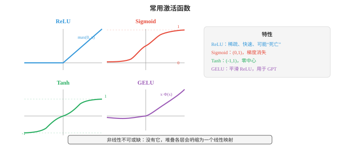
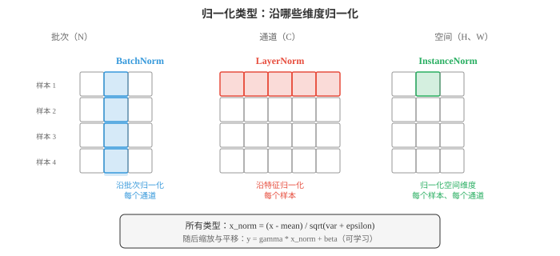
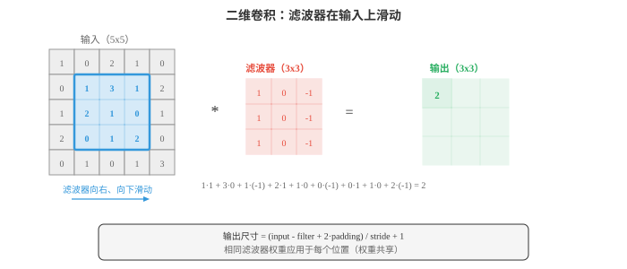
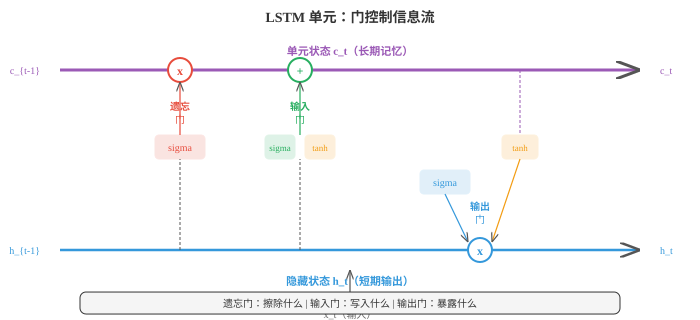
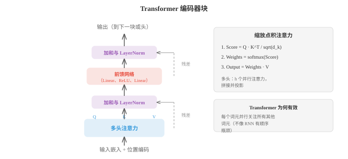

# 深度学习（Deep Learning）

*深度学习通过堆叠非线性层构建分层表示，自动将原始输入转换为有用特征。本节介绍 MLP、激活函数、反向传播、CNN、RNN、LSTM、注意力、Transformer、GAN、VAE、扩散模型和归一化技术。*

- 什么使网络成为“深度”网络？浅层网络只有一个隐藏层；深度网络有很多隐藏层。深度使网络能够构建分层表示：早期层学习简单特征，如边缘、色调，后期层将它们组合成复杂概念，如人脸、句子。这种组合性赋予深度学习力量。

!!! note "大白话"
    深度就是让网络分很多层逐级加工：先看边缘，再拼成部件，最后认出物体或理解句子。

- 最简单的深度网络是**多层感知机（multi-layer perceptron，MLP）**，也称全连接网络或稠密网络。每一层计算：

$$h = \sigma(Wx + b)$$

!!! note "大白话"
    一层先做线性加权，再用激活函数拐一下。多层重复这个动作，就能表示直线无法表达的复杂关系。

- 其中 $W$ 是权重矩阵（第 02 章），$b$ 是偏置向量，$\sigma$ 是非线性激活函数。一层的输出成为下一层的输入。没有非线性，堆叠各层毫无意义：$W_2(W_1 x) = (W_2 W_1)x$，它只是另一个线性变换。这正是第 02 章所述的矩阵乘法坍缩。

!!! note "大白话"
    激活函数是深度网络的“弯曲关节”。没有它，不管堆多少层，最后都只是一次普通矩阵变换。

- **激活函数（activation functions）**引入非线性，使深度具有意义。

!!! note "大白话"
    激活函数决定每个神经元怎样把输入变成输出，也决定梯度能不能顺利传回去。

- **ReLU**，即 Rectified Linear Unit：$\text{ReLU}(x) = \max(0, x)$。它是使用最广泛的激活函数，计算快，对正输入不饱和，并产生稀疏激活，许多神经元恰好输出零。缺点是：输入为负的神经元始终输出零；若永久卡在那里，它们就会“死亡”并停止学习。

!!! note "大白话"
    ReLU 把负数砍成 0，正数原样通过。它简单快速，但某个神经元若一直收到负数，就可能永远不再工作。

- **Sigmoid**：$\sigma(x) = \frac{1}{1+e^{-x}}$，将输入压缩到 $(0, 1)$。它适合二元分类的输出层，却会给隐藏层带来问题，因为输入远离零时梯度消失，曲线接近水平。

!!! note "大白话"
    Sigmoid 很适合表达概率，但两端太平，梯度几乎没有力气，层数一多就难以训练。

- **Tanh**：$\tanh(x) = \frac{e^x - e^{-x}}{e^x + e^{-x}}$，将输入压缩到 $(-1, 1)$。它以零为中心，不同于 sigmoid，这有助于梯度流动；但在两端仍会遭受梯度消失。

!!! note "大白话"
    Tanh 的输出有正有负且以 0 为中心，比 sigmoid 更适合作为某些隐藏状态，但极大或极小时仍会变平。

- **GELU**，即 Gaussian Error Linear Unit：$\text{GELU}(x) = x \cdot \Phi(x)$，其中 $\Phi$ 是标准正态 CDF。它是 ReLU 的平滑近似，允许较小的负值通过。GELU 是 GPT 和 BERT 的默认激活函数。

!!! note "大白话"
    GELU 不会像 ReLU 那样把所有负数一刀切掉，而是按大小平滑地决定放行多少，所以训练更柔和。

- **Swish**：$\text{Swish}(x) = x \cdot \sigma(x)$，另一种平滑门控。在实践中与 GELU 相似。



!!! note "大白话"
    这些曲线的差别就是“哪些输入被放行、放行多大、梯度有多平滑”。实际选型常看训练稳定性和任务表现。

- 一个有 $d_{\text{in}}$ 个输入和 $d_{\text{out}}$ 个输出的稠密层有 $d_{\text{in}} \times d_{\text{out}} + d_{\text{out}}$ 个参数，即权重加偏置。矩阵乘 $Wx$ 就是第 02 章的矩阵-向量乘法。在批处理场景中，输入是矩阵 $X$，形状为 $(B, d_{\text{in}})$；输出是 $XW^T + b$，形状为 $(B, d_{\text{out}})$。

!!! note "大白话"
    参数数量就是“输入到输出的每条连接”加上每个输出的偏置。批量输入时，矩阵一次处理 $B$ 个样本。

- **通用逼近定理（universal approximation theorem）**指出：只要神经元足够多，单个隐藏层可以以任意精度逼近紧致定义域上的任意连续函数。这似乎表明深度无关紧要，但关键在于“足够多的神经元”。实践中，深层网络能用比浅层网络少指数级的参数表示同一函数。深度带来的是效率，不只是表达能力。

!!! note "大白话"
    浅层网络理论上也能表示很多函数，但可能需要天文数字般的神经元。加深网络是用分层复用特征，省参数、省计算。

- 网络加深时会出现两种梯度病态。**梯度消失（vanishing gradients）**：梯度通过许多层时，经由链式法则（第 03 章）被许多因子相乘。若这些因子持续小于 1，如 sigmoid 和 tanh 饱和时的情形，梯度会指数级收缩至零，早期层几乎无法学习。**梯度爆炸（exploding gradients）**：若因子持续大于 1，梯度会指数级增长，导致数值溢出与训练不稳定。

!!! note "大白话"
    梯度像接力棒，层层传递时可能越传越小或越传越大。前者让前面层学不动，后者让训练数值直接失控。

- 梯度消失/爆炸的解决方案：

!!! note "大白话"
    这些方法的共同目标是让每层收到的信号既不归零，也不突然冲到无穷大。

  - 使用 ReLU 或 GELU 激活，正输入的梯度为 1，不会饱和

    !!! note "大白话"
        选择不容易变平的激活，让正向信号和反向梯度更容易通过。

  - 仔细进行权重初始化

    !!! note "大白话"
        一开始就把参数设得合适，别让第一层输出从一开始就爆掉或缩没。

  - 使用归一化层

    !!! note "大白话"
        定期把中间数值拉回稳定范围，减轻层与层之间的尺度漂移。

  - 使用残差连接，即跳跃连接

    !!! note "大白话"
        给梯度一条绕路，哪怕某段变换学不好，信号也能直接跨过去。

  - 对梯度爆炸使用梯度裁剪：将梯度范数限制为最大值

    !!! note "大白话"
        梯度太大时只缩短它，不改变方向，防止一次更新把参数甩飞。

- **权重初始化（weight initialisation）**很重要，因为它决定训练开始时激活值和梯度的尺度。权重过大会导致激活爆炸；过小则会消失。

!!! note "大白话"
    初始化不是随便填随机数，而是要让信号在第一天训练时就处于合适的量级。

- **Xavier（Glorot）初始化**从方差为 $\frac{2}{d_{\text{in}} + d_{\text{out}}}$ 的分布中设置权重。假设使用线性或 tanh 激活时，它使激活值的方差在各层间大致保持不变。

!!! note "大白话"
    Xavier 根据前后层宽度决定随机数大小，目标是让每层的信号强度大致接力不变。

- **He（Kaiming）初始化**使用方差 $\frac{2}{d_{\text{in}}}$，它针对 ReLU 激活校准。由于 ReLU 将一半激活置零，需要两倍方差补偿。

!!! note "大白话"
    ReLU 会砍掉一半左右的输出，所以 He 初始化事先把尺度放大一点补回来。

- **归一化层（normalisation layers）**通过确保每层输入具有一致的统计量，即大致零均值、单位方差，来稳定训练。

!!! note "大白话"
    归一化像给每层输入统一量尺，避免某一层突然把数值放大或缩小很多。

- **批归一化（Batch Normalisation，BatchNorm）**沿批次维度归一化：对每个通道/特征，计算小批量中全部样本的均值和方差，再归一化。它增加可学习的缩放 $\gamma$ 和平移 $\beta$ 参数，使网络在需要时能撤销归一化：

$$\hat{x} = \frac{x - \mu_B}{\sqrt{\sigma_B^2 + \epsilon}}, \quad y = \gamma \hat{x} + \beta$$

!!! note "大白话"
    BatchNorm 用同一小批数据的平均值和波动范围把特征拉齐，再让网络用 $\gamma$、$\beta$ 学回真正需要的尺度和位置。

- BatchNorm 有一个问题：它依赖批量大小。批量很小时，统计量有噪声。推理时使用运行平均而非批次统计量，这会产生训练/测试差异。

!!! note "大白话"
    它训练时参考同批同学，预测时却不能依赖同批数据，只能用历史平均；批量太小，参考值就会不可靠。

- **层归一化（Layer Normalisation，LayerNorm）**沿每个单独样本的特征维度归一化。它不依赖批次中的其他样本，因此是 Transformer 和循环网络的标准选择。

!!! note "大白话"
    LayerNorm 只看当前样本自己的各个特征，不需要同批其他样本，所以小批量和逐 token 处理也稳定。

- **实例归一化（Instance Normalisation）**对每个样本、每个通道独立地沿空间维度归一化。它常用于风格迁移。

!!! note "大白话"
    它把每一张图、每一个通道各自拉齐，容易弱化原图整体亮暗和对比度，因此常用于改变视觉风格。

- **组归一化（Group Normalisation）**将通道分为多组，并在每组内归一化。它是 LayerNorm 和 InstanceNorm 之间的折中。



!!! note "大白话"
    组归一化不看整个批次，也不把所有通道混在一起，而是在小组内计算统计量，常适合显存限制下的小批量视觉任务。

- **Dropout**是一种正则化技术：训练时随机将一部分，即比例为 $p$，的神经元置零。这迫使网络不依赖任何单个神经元，鼓励冗余表示。测试时所有神经元均激活。**倒置 Dropout（inverted dropout）**在训练期间将激活乘以 $\frac{1}{1-p}$，使测试时无需缩放。这是标准实现。

!!! note "大白话"
    训练时故意随机断开一部分神经元，逼网络别把希望压在单一通路上；预测时全部打开，倒置缩放保证数值尺度一致。

- **卷积神经网络（Convolutional Neural Networks，CNNs）**利用空间结构。卷积层不将每个输入连接到每个输出，如稠密层那样，而是在输入上滑动一个小滤波器，即核，在每个位置计算点积。相同滤波器权重在所有位置共享，大幅减少参数，并内置平移不变性。

!!! note "大白话"
    CNN 用同一个小窗口在图片各处找相同模式，例如边缘。无论边缘出现在左上还是右下，滤波器都能识别，且不用为每个位置另存一套参数。

- 对于滤波器 $K$，其尺寸为 $k \times k$，二维输入的**卷积运算**为：

$$(\text{input} * K)[i,j] = \sum_{m=0}^{k-1} \sum_{n=0}^{k-1} \text{input}[i+m, j+n] \cdot K[m, n]$$



!!! note "大白话"
    每次把小滤波器盖到一块图像上，对应格子相乘再求和，得到一个分数；滑遍全图就得到特征图。

- 输出尺寸取决于三个超参数。**步幅（stride）**控制滤波器在位置之间移动的像素数，步幅为 2 会使空间维度减半。**填充（padding）**在输入边界周围添加零，“same” 填充保持空间尺寸，“valid” 填充不会。输出尺寸公式为：$\text{out} = \lfloor (\text{in} - k + 2p) / s \rfloor + 1$。

!!! note "大白话"
    步幅决定每次跳多远，越大输出越小；填充是在边缘补空格，防止滤波器扫到边上时尺寸缩得太快。

- **池化（pooling）**层对特征图下采样。最大池化取每个窗口内的最大值；平均池化取均值。池化在保留最重要信息的同时减小空间维度。

!!! note "大白话"
    池化相当于把一小片区域压缩成一个代表值，减少后续计算，也让模型不必死盯特征的精确像素位置。

- **空洞卷积（dilated convolutions）**在滤波器元素间插入间隔，在不增加参数的情况下扩大感受野。膨胀率为 2 时，3x3 滤波器覆盖 5x5 区域。

!!! note "大白话"
    在滤波器格子间隔开空位，能看到更大范围，却不必增加滤波器参数，适合需要大上下文的图像或序列。

- **1x1 卷积**使用 1x1 滤波器。它们不查看空间邻居，而是在通道之间混合信息。可以把它想成对每个空间位置应用一个稠密层。它们用于低成本地改变通道数。

!!! note "大白话"
    1x1 卷积不看周围像素，只在同一位置把不同通道的信息重新组合，是便宜的通道变换器。

- **跳跃连接（skip connections）**，即残差连接，让输入绕过一个或多个层：$\text{output} = F(x) + x$。该层只需要学习残差 $F(x) = \text{output} - x$；当最优变换接近恒等变换时，这更容易。ResNet，即 Residual Network，利用此技巧堆叠超过 100 层，解决了更深网络表现反而差于较浅网络的退化问题。

!!! note "大白话"
    残差连接保留原输入，再加上本层学到的小改动。需要不改变时只要让 $F(x)$ 接近 0，深层网络就更容易训练。

- CNN 构建**特征层级（feature hierarchy）**。早期层检测边缘和纹理，中间层将它们组合为部件，如眼睛、车轮，后期层识别完整物体。每层的感受野，即它可“看见”的输入区域，随深度增长。

!!! note "大白话"
    越靠前的层看细节，越靠后的层看整体；层数增加后，一个神经元能参考的原图范围也越来越大。

- **嵌入（embeddings）**将离散 token，如单词、字符、物品 ID，映射为稠密向量。嵌入层只是一个查找表：形状为（词表大小，嵌入维度）的矩阵 $E$。查找 token $i$ 意味着选择第 $i$ 行，即矩阵 $E$ 中的一行。这等价于与 one-hot 向量相乘，是矩阵-向量乘法的特殊情形（第 02 章）。嵌入在训练中学习，因此相似 token 最终会拥有相似向量。

!!! note "大白话"
    词本身不能直接做数学，嵌入表给每个词一串可学习数字。用法相似的词会在这张数字地图上靠得更近。

- **分词（tokenisation）**是将原始文本转换为 token 序列的过程。词级分词按空格切分，但无法处理未见词。**子词分词（subword tokenisation）**，如 BPE、WordPiece、SentencePiece，将文本切为高频子词单元，在词表大小和覆盖率之间平衡。单词 “unhappiness” 可能变成 ["un", "happiness"] 或 ["un", "happ", "iness"]。

!!! note "大白话"
    模型并不是直接“看汉字或单词”，而是先切成 token。子词切分能用有限词表拼出没见过的新词。

- **循环神经网络（Recurrent Neural Networks，RNNs）**一次处理一个序列元素，维护一个将信息向前传递的隐藏状态：

$$h_t = \tanh(W_h h_{t-1} + W_x x_t + b)$$

!!! note "大白话"
    RNN 读到一个新 token 时，把它和前面记住的摘要混合，得到新的摘要，再传给下一个时间步。

- 隐藏状态 $h_t$ 是网络截至时间 $t$ 所见全部内容的压缩摘要。所有时间步共享同一组权重 $W_h$ 和 $W_x$，即权重共享，类似 CNN 共享空间权重。

!!! note "大白话"
    它像边读边写的一张小便签，内容必须浓缩进固定大小的状态；每个位置复用同一套规则。

- 原始 RNN 难以处理长序列，因为存在梯度消失：从步骤 $t$ 到步骤 $t - k$ 的梯度信号经过 $k$ 次与 $W_h$ 的乘法，会指数级收缩，或爆炸。

!!! note "大白话"
    句子太长时，开头的信息要穿过太多步才影响结尾，反向信号很容易在路上消失或爆炸。

- **LSTM**，即 Long Short-Term Memory，通过引入独立的单元状态 $c_t$ 解决此问题；该状态以很少干扰穿越时间。三个门控制哪些信息进入、离开和保留：

!!! note "大白话"
    LSTM 额外开了一条专门保存长期信息的通道，再用几个门控制何时忘记、写入和读取。

- **遗忘门（forget gate）**决定从单元状态中擦除什么：$f_t = \sigma(W_f [h_{t-1}, x_t] + b_f)$

!!! note "大白话"
    遗忘门像橡皮擦，决定旧记忆中哪些内容该保留、哪些该淡出。

- **输入门（input gate）**决定写入哪些新信息：$i_t = \sigma(W_i [h_{t-1}, x_t] + b_i)$，候选值为 $\tilde{c}_t = \tanh(W_c [h_{t-1}, x_t] + b_c)$

!!! note "大白话"
    输入门决定当前新内容有多少值得记入长期状态，避免每个 token 都把旧记忆冲掉。

- 单元状态更新为：$c_t = f_t \odot c_{t-1} + i_t \odot \tilde{c}_t$

!!! note "大白话"
    这一步就是“保留多少旧记忆，加上多少新记忆”，两个门分别控制两部分的比例。

- **输出门（output gate）**决定暴露什么：$o_t = \sigma(W_o [h_{t-1}, x_t] + b_o)$，且 $h_t = o_t \odot \tanh(c_t)$



!!! note "大白话"
    长期状态不必全说出来，输出门决定当前时刻该从记忆里拿多少给外部任务使用。

- 单元状态如同传送带：信息可在许多时间步中不变地流动，遗忘门保持接近 1，这解决长程依赖的梯度消失问题。

!!! note "大白话"
    关键记忆能沿传送带一路保留，梯度也能更容易沿这条通路回传，所以 LSTM 比普通 RNN 更能记长距离信息。

- **GRU**，即 Gated Recurrent Unit，通过将单元状态和隐藏状态合并为一个，并用两个门替代三个门，简化 LSTM：更新门，结合遗忘与输入，和重置门。GRU 参数更少，且常能取得与 LSTM 相当的表现。

!!! note "大白话"
    GRU 是更轻量的 LSTM：少一个状态、少一个门，训练更省，很多任务的效果并不差。

- RNN，包括 LSTM，的根本限制是顺序处理：必须先处理 token 1，再处理 token 2，最后 token 3。这阻止了并行化，并形成信息瓶颈，因为全部上下文都必须挤过固定大小的隐藏状态。

!!! note "大白话"
    RNN 必须一个词接一个词读，GPU 难并行；所有历史还要塞进一张固定大小的便签，长上下文很吃力。

- **注意力（attention）**同时解决两个问题。它不将整个输入压缩为固定向量，而是允许模型回看全部输入位置，并决定哪些位置与当前输出相关。

!!! note "大白话"
    注意力让模型在需要时回头看原文的任何位置，不必把所有信息硬塞进一个固定大小的摘要。

- 现代公式使用**查询、键和值（queries, keys, and values，Q、K、V）**。可以把它想成图书馆检索：查询是要寻找的内容，键是每本书上的标签，值是书的实际内容。将查询与所有键比较，确定取回哪些值。

!!! note "大白话"
    当前 token 带着问题去查全体 token 的标签，最匹配的内容会获得最大权重，再被取回来参与计算。

- **缩放点积注意力（scaled dot-product attention）**：

$$\text{Attention}(Q, K, V) = \text{softmax}\!\left(\frac{QK^T}{\sqrt{d_k}}\right) V$$

!!! note "大白话"
    先给每个位置打相关性分数，再把分数变成权重，最后按权重混合各位置的信息。缩放是为了别让分数过大导致训练卡住。

- $QK^T$ 计算每个查询和每个键之间的相似度。这是矩阵乘法（第 02 章），其元素是点积，点积度量余弦相似度（第 01 章）。除以 $\sqrt{d_k}$ 可防止点积过大，否则 softmax 会饱和，产生接近 one-hot 的分布和消失的梯度。softmax 将相似度转换为概率分布；再乘以 $V$ 得到值的加权组合。

!!! note "大白话"
    一行注意力权重表示“当前 token 应该向每个位置借多少信息”，权重加起来为 1；越相关的位置借得越多。

- **多头注意力（multi-head attention）**并行运行 $h$ 个注意力操作，每个操作使用 Q、K、V 的不同学习投影。这让模型同时关注不同表示子空间中的信息。一个头可能关注句法关系，另一个关注语义关系。输出被拼接并投影：

$$\text{MultiHead}(Q, K, V) = \text{Concat}(\text{head}_1, \ldots, \text{head}_h) W^O$$

!!! note "大白话"
    一个头只是一种看关系的角度；多头让模型同时从多种角度看同一句话，再把结果合并。

- **Transformer** 架构，Vaswani 等人，2017，完全由注意力和前馈层构成，没有循环。编码器块反复执行：多头自注意力、加和层归一化、前馈网络、加和层归一化。解码器块增加掩码自注意力，防止模型看到未来 token，以及一个关注编码器输出的交叉注意力层。



!!! note "大白话"
    Transformer 把“互相查阅上下文”和“每个位置单独加工”交替堆叠。残差与归一化保证很多层仍能稳定训练；生成时掩码防止偷看后文。

- **位置编码（positional encoding）**是必要的，因为注意力是排列等变的，这表示它将输入当成集合而非序列。没有位置信息时，“the cat sat on the mat” 与 “the mat sat on the cat” 完全相同。原始 Transformer 使用正弦位置编码：

$$PE_{(pos, 2i)} = \sin\!\left(\frac{pos}{10000^{2i/d}}\right), \quad PE_{(pos, 2i+1)} = \cos\!\left(\frac{pos}{10000^{2i/d}}\right)$$

!!! note "大白话"
    注意力自己不知道词序，所以必须额外告诉它每个 token 在第几个位置；否则换个顺序对它几乎没有区别。

- 每个位置得到唯一向量，模型可用其区分位置。现代模型常改用可学习的位置嵌入或相对位置编码，如 RoPE、ALiBi。

!!! note "大白话"
    位置既可以用固定公式编码，也可以让模型自己学；相对位置方案更强调两个 token 相隔多远，这对长文本很有用。

- Transformer 并行处理所有 token，自注意力矩阵 $QK^T$ 一次矩阵乘法即可计算，因此在现代硬件上训练远快于 RNN。代价是自注意力在序列长度上为 $O(n^2)$，每个 token 都关注其他所有 token，而 RNN 是 $O(n)$。这正是长上下文模型需要特殊注意力变体，如稀疏注意力、线性注意力、flash attention，的原因。

!!! note "大白话"
    Transformer 的优势是能同时处理整句，特别适合 GPU；代价是文本翻倍，注意力配对数量约变四倍，长上下文会很贵。

- **视觉 Transformer（Vision Transformers，ViT）**通过将图像划分为固定尺寸 patch，例如 16x16，将每个 patch 展平为向量，并将 patch 视作 token 序列，应用 Transformer。前面添加一个可学习的 [CLS] token，其最终表示用于分类。尽管没有卷积的归纳偏置，ViT 在足够数据上训练时仍可匹配或超过 CNN。

!!! note "大白话"
    ViT 把图片切成小方块，当成一句由图块组成的话来读。[CLS] 像专门汇总整张图信息的读者。

- **MLP-Mixer** 是更简单的架构，用 MLP 同时替代注意力和卷积。它在“token 混合”MLP，即沿空间位置应用，和“通道混合”MLP，即沿特征应用，之间交替。它有竞争力的表现，说明现代架构的关键洞见不一定是注意力本身，而是跨 token 和特征高效混合信息。

!!! note "大白话"
    它证明了不一定非要注意力或卷积才行，关键是让不同位置和不同特征能有效交换信息。

- **自编码器（autoencoders）**通过训练网络重构自身输入来学习压缩表示。编码器将输入映射到低维瓶颈，即潜编码；解码器将它映射回来：

$$z = f_{\text{enc}}(x), \quad \hat{x} = f_{\text{dec}}(z), \quad \mathcal{L} = \|x - \hat{x}\|^2$$

!!! note "大白话"
    它先把原数据压缩成一小段摘要，再用摘要还原原数据。为了还原得好，摘要就被迫保留最重要的信息。

- 瓶颈迫使网络学习最重要的特征。自编码器用于降维、去噪，即以有噪输入训练并重构干净输出，以及异常检测，高重构误差表示异常输入。

!!! note "大白话"
    正常数据的共同结构容易被压缩和还原；很异常的输入往往还原不好，所以重构误差可以当异常信号。

- **变分自编码器（Variational Autoencoders，VAEs）**加入概率视角。编码器不编码为单点 $z$，而是输出一个分布的参数，即高斯分布的均值 $\mu$ 和方差 $\sigma^2$。潜编码从该分布采样：$z = \mu + \sigma \odot \epsilon$，其中 $\epsilon \sim \mathcal{N}(0, I)$。这个**重参数化技巧（reparameterisation trick）**使采样可微，梯度得以穿过它。

!!! note "大白话"
    VAE 不说“这个输入只能压成一个点”，而是说“它大概落在这个小区域”。把随机性写成 $\epsilon$ 的变换后，训练仍能反向传播。

- VAE 损失有两项：

$$\mathcal{L} = \underbrace{\|x - \hat{x}\|^2}_{\text{reconstruction}} + \underbrace{D_{\text{KL}}(q(z|x) \| p(z))}_{\text{regularisation}}$$

!!! note "大白话"
    第一项要求还原得像原数据，第二项要求潜空间别乱成一团。两项合起来，才既能重构又能稳定生成。

- KL 散度项（第 05 章）将学习到的后验 $q(z|x)$ 推向先验 $p(z) = \mathcal{N}(0, I)$，确保潜空间平滑且结构良好。之后可从先验采样并解码，以生成新数据。这使 VAE 成为生成式模型。

!!! note "大白话"
    潜空间被整理成接近标准正态后，随便从这片规则空间抽一个点再解码，就有机会生成像训练数据的新样本。

## 编程任务（使用 CoLab 或 notebook）

1. 在 JAX 中从零构建简单 MLP。在二维分类问题，例如同心圆，上训练，并可视化决策边界。
```python
import jax
import jax.numpy as jnp
import matplotlib.pyplot as plt
from sklearn.datasets import make_circles

# Data
X, y = make_circles(n_samples=500, noise=0.1, factor=0.5, random_state=42)
X, y = jnp.array(X), jnp.array(y, dtype=jnp.float32)

# Initialise a 2-layer MLP: 2 -> 16 -> 16 -> 1
def init_params(key):
    k1, k2, k3 = jax.random.split(key, 3)
    return {
        'W1': jax.random.normal(k1, (2, 16)) * 0.5,
        'b1': jnp.zeros(16),
        'W2': jax.random.normal(k2, (16, 16)) * 0.5,
        'b2': jnp.zeros(16),
        'W3': jax.random.normal(k3, (16, 1)) * 0.5,
        'b3': jnp.zeros(1),
    }

def forward(params, x):
    h = jnp.maximum(0, x @ params['W1'] + params['b1'])  # ReLU
    h = jnp.maximum(0, h @ params['W2'] + params['b2'])   # ReLU
    logit = (h @ params['W3'] + params['b3']).squeeze()
    return jax.nn.sigmoid(logit)

def loss_fn(params, X, y):
    pred = forward(params, X)
    return -jnp.mean(y * jnp.log(pred + 1e-7) + (1 - y) * jnp.log(1 - pred + 1e-7))

grad_fn = jax.jit(jax.grad(loss_fn))
params = init_params(jax.random.PRNGKey(0))
lr = 0.1

for step in range(2000):
    grads = grad_fn(params, X, y)
    params = {k: params[k] - lr * grads[k] for k in params}

# Plot decision boundary
xx, yy = jnp.meshgrid(jnp.linspace(-2, 2, 200), jnp.linspace(-2, 2, 200))
grid = jnp.column_stack([xx.ravel(), yy.ravel()])
zz = forward(params, grid).reshape(xx.shape)

plt.figure(figsize=(7, 6))
plt.contourf(xx, yy, zz, levels=[0, 0.5, 1], alpha=0.3, colors=['#e74c3c', '#3498db'])
plt.scatter(X[y==0,0], X[y==0,1], c='#e74c3c', s=10, label='Class 0')
plt.scatter(X[y==1,0], X[y==1,1], c='#3498db', s=10, label='Class 1')
plt.title("MLP Decision Boundary on Concentric Circles")
plt.legend(); plt.grid(alpha=0.3); plt.show()

acc = jnp.mean((forward(params, X) > 0.5) == y)
print(f"Accuracy: {acc:.2%}")
```

2. 从零实现一维卷积。对信号应用简单的边缘检测滤波器，并与内置 `jnp.convolve` 比较。
```python
import jax.numpy as jnp
import matplotlib.pyplot as plt

def conv1d(signal, kernel):
    """1D convolution (valid mode) from scratch."""
    n, k = len(signal), len(kernel)
    output = jnp.zeros(n - k + 1)
    for i in range(n - k + 1):
        output = output.at[i].set(jnp.sum(signal[i:i+k] * kernel))
    return output

# Create a signal with a step function
t = jnp.linspace(0, 4, 200)
signal = jnp.where(t < 1, 0.0, jnp.where(t < 2, 1.0, jnp.where(t < 3, 0.5, 1.5)))

# Edge detection kernel
edge_kernel = jnp.array([-1.0, 0.0, 1.0])

# Our implementation vs built-in
our_output = conv1d(signal, edge_kernel)
jnp_output = jnp.convolve(signal, edge_kernel, mode='valid')

fig, axes = plt.subplots(3, 1, figsize=(10, 6), sharex=True)
axes[0].plot(t, signal, color='#3498db', linewidth=1.5)
axes[0].set_title("Original Signal"); axes[0].set_ylabel("Value")

axes[1].plot(t[:len(our_output)], our_output, color='#e74c3c', linewidth=1.5)
axes[1].set_title("After Edge Detection (our conv1d)"); axes[1].set_ylabel("Value")

axes[2].plot(t[:len(jnp_output)], jnp_output, color='#27ae60', linewidth=1.5, linestyle='--')
axes[2].set_title("After Edge Detection (jnp.convolve)"); axes[2].set_ylabel("Value")
axes[2].set_xlabel("t")

plt.tight_layout(); plt.show()
print(f"Outputs match: {jnp.allclose(our_output, jnp_output)}")
```

3. 从零实现缩放点积注意力。为一个小示例计算注意力权重，并将注意力矩阵可视化为热图。
```python
import jax
import jax.numpy as jnp
import matplotlib.pyplot as plt

def scaled_dot_product_attention(Q, K, V):
    """Scaled dot-product attention."""
    d_k = Q.shape[-1]
    scores = Q @ K.T / jnp.sqrt(d_k)
    weights = jax.nn.softmax(scores, axis=-1)
    output = weights @ V
    return output, weights

# Example: 4 tokens, embedding dim 8
key = jax.random.PRNGKey(42)
k1, k2, k3 = jax.random.split(key, 3)
seq_len, d_model = 4, 8

Q = jax.random.normal(k1, (seq_len, d_model))
K = jax.random.normal(k2, (seq_len, d_model))
V = jax.random.normal(k3, (seq_len, d_model))

output, weights = scaled_dot_product_attention(Q, K, V)

print(f"Q shape: {Q.shape}")
print(f"Attention weights shape: {weights.shape}")
print(f"Output shape: {output.shape}")
print(f"\nAttention weights (rows sum to 1):")
print(weights)
print(f"Row sums: {weights.sum(axis=-1)}")

# Visualise attention
fig, ax = plt.subplots(figsize=(5, 4))
im = ax.imshow(weights, cmap='Blues', vmin=0, vmax=1)
ax.set_xlabel("Key position"); ax.set_ylabel("Query position")
ax.set_title("Attention Weights")
tokens = ['tok 0', 'tok 1', 'tok 2', 'tok 3']
ax.set_xticks(range(4)); ax.set_xticklabels(tokens)
ax.set_yticks(range(4)); ax.set_yticklabels(tokens)
for i in range(4):
    for j in range(4):
        ax.text(j, i, f"{weights[i,j]:.2f}", ha='center', va='center', fontsize=10)
plt.colorbar(im); plt.tight_layout(); plt.show()
```

4. 构建简单自编码器，使二维数据通过一维瓶颈压缩后重构。可视化潜空间与重构结果。
```python
import jax
import jax.numpy as jnp
import matplotlib.pyplot as plt
from sklearn.datasets import make_moons

# Data
X, _ = make_moons(n_samples=500, noise=0.05, random_state=42)
X = jnp.array(X)

# Autoencoder: 2 -> 8 -> 1 -> 8 -> 2
def init_ae(key):
    k1, k2, k3, k4 = jax.random.split(key, 4)
    return {
        'enc_W1': jax.random.normal(k1, (2, 8)) * 0.5, 'enc_b1': jnp.zeros(8),
        'enc_W2': jax.random.normal(k2, (8, 1)) * 0.5, 'enc_b2': jnp.zeros(1),
        'dec_W1': jax.random.normal(k3, (1, 8)) * 0.5, 'dec_b1': jnp.zeros(8),
        'dec_W2': jax.random.normal(k4, (8, 2)) * 0.5, 'dec_b2': jnp.zeros(2),
    }

def encode(p, x):
    h = jnp.tanh(x @ p['enc_W1'] + p['enc_b1'])
    return h @ p['enc_W2'] + p['enc_b2']

def decode(p, z):
    h = jnp.tanh(z @ p['dec_W1'] + p['dec_b1'])
    return h @ p['dec_W2'] + p['dec_b2']

def ae_loss(p, X):
    z = encode(p, X)
    X_hat = decode(p, z)
    return jnp.mean((X - X_hat) ** 2)

grad_fn = jax.jit(jax.grad(ae_loss))
params = init_ae(jax.random.PRNGKey(0))
lr = 0.01

for step in range(3000):
    grads = grad_fn(params, X)
    params = {k: params[k] - lr * grads[k] for k in params}

z = encode(params, X)
X_hat = decode(params, z)

fig, axes = plt.subplots(1, 2, figsize=(12, 5))
axes[0].scatter(X[:,0], X[:,1], c=z.squeeze(), cmap='viridis', s=10)
axes[0].set_title("Original Data (coloured by latent code)")
axes[1].scatter(X_hat[:,0], X_hat[:,1], c=z.squeeze(), cmap='viridis', s=10)
axes[1].set_title("Reconstruction from 1D bottleneck")
for ax in axes:
    ax.set_aspect('equal'); ax.grid(alpha=0.3)
plt.tight_layout(); plt.show()

print(f"Reconstruction MSE: {ae_loss(params, X):.4f}")
```
