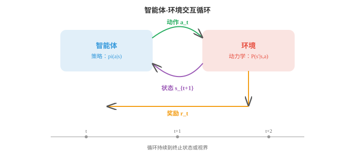
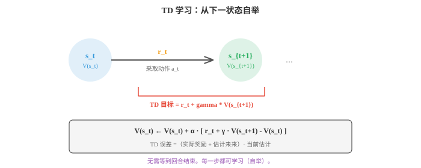
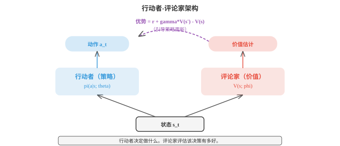

# 强化学习（Reinforcement Learning）

*强化学习通过试错最大化累积奖励，训练智能体作出序列决策。本节介绍 MDP、价值函数、贝尔曼方程、Q 学习、策略梯度、行动者-评论家方法、PPO 和 RLHF，它们是博弈智能体与语言模型对齐背后的框架。*

- 监督学习需要带标签的数据，无监督学习在无标签数据中寻找模式。**强化学习（Reinforcement Learning，RL）**不同于二者：智能体通过与环境交互、采取动作并接收奖励来学习。不存在正确标签；智能体必须通过试错发现良好行为。

!!! note "大白话"
    强化学习没有人逐步告诉正确动作，只能自己尝试，依据最后得分慢慢分清哪些行为划算。

- 想象教狗学一个新把戏。你不会给它展示一份正确行为数据集，而是让它尝试，对好的动作给予零食；随着时间过去，它会明白你想要什么。RL 将这一过程形式化。

!!! note "大白话"
    奖励就像零食，不必说明完整做法，只用“做得好不好”的反馈引导行为。困难在于奖励可能很晚才出现。

- RL 设置有五个核心组成部分。**智能体（agent）**是学习者和决策者；**环境（environment）**是智能体与之交互的一切外部事物。每个时间步中，智能体观测**状态（state）** $s_t$，选择**动作（action）** $a_t$，接收**奖励（reward）** $r_t$，并转移到新状态 $s_{t+1}$。智能体目标是最大化长期收集的总奖励。



!!! note "大白话"
    每一步都是“看现在，做选择，拿反馈，进入下一局面”的循环。目标不是眼前一次得分最大，而是长期总分最高。

- **策略（policy）** $\pi$ 是智能体的策略规则，即从状态到动作的映射。确定性策略在每个状态给出一个动作：$a = \pi(s)$。随机策略给出动作上的概率分布：$\pi(a \mid s)$。RL 的目标是找到最优策略，即最大化期望累积奖励的策略。

!!! note "大白话"
    策略就是智能体的行为准则。它可以每次都做同一选择，也可以按概率随机选择，以便探索未知机会。

- RL 的数学框架是**马尔可夫决策过程（Markov Decision Process，MDP）**，由元组 $(S, A, P, R, \gamma)$ 定义：状态集合 $S$、动作集合 $A$、转移概率 $P(s' \mid s, a)$、奖励函数 $R(s, a)$ 和折扣因子 $\gamma$。

!!! note "大白话"
    MDP 就是把一个决策游戏写清楚：有什么局面、能做什么、做完大概去哪、得多少分，以及未来分数有多重要。

- **马尔可夫性质（Markov property）**，第 05 章介绍过，表示未来只依赖当前状态，而不依赖到达此处的历史：$P(s_{t+1} \mid s_t, a_t, s_{t-1}, \ldots) = P(s_{t+1} \mid s_t, a_t)$。这意味着状态包含作出决策所需的全部信息。

!!! note "大白话"
    只要当前状态记得够完整，过去怎么来的就不必再回放。状态若漏掉关键信息，这个假设就不成立。

- **折扣因子（discount factor）** $\gamma \in [0, 1)$ 决定智能体相对即时奖励有多重视未来奖励。从时间 $t$ 开始的折扣回报为：

$$G_t = r_t + \gamma r_{t+1} + \gamma^2 r_{t+2} + \cdots = \sum_{k=0}^{\infty} \gamma^k r_{t+k}$$

!!! note "大白话"
    当前奖励按原价算，越远的未来奖励折得越多。这样既表达“未来不确定”，也让无限长回报能算出有限值。

- 当 $\gamma = 0$ 时，智能体完全短视，只关心下一次奖励；当 $\gamma$ 接近 1 时，智能体有远见。折扣因子也确保和式收敛，假定奖励有界，这对数学上的良定义很重要。

!!! note "大白话"
    $\gamma$ 小像只看眼前；$\gamma$ 大像愿意为长期目标暂时吃亏。选得太大也会让学习更难，因为回报传播得更远。

- **价值函数（value functions）**估计处在某状态，即在某状态采取动作，究竟有多好。**状态价值函数（state-value function）** $V^\pi(s)$ 是从状态 $s$ 开始并遵循策略 $\pi$ 的期望回报：

$$V^\pi(s) = \mathbb{E}_\pi \left[ G_t \mid s_t = s \right]$$

!!! note "大白话"
    $V$ 给一个局面整体打分：从这里开始并按当前策略走，平均能拿多少长期分。

- **动作价值函数（action-value function）** $Q^\pi(s, a)$ 是从状态 $s$ 开始、采取动作 $a$ 后继续遵循 $\pi$ 的期望回报：

$$Q^\pi(s, a) = \mathbb{E}_\pi \left[ G_t \mid s_t = s, a_t = a \right]$$

!!! note "大白话"
    $Q$ 比 $V$ 更细：它直接给“在这个局面做这个动作”打分，所以能拿来比较动作。

- 二者关系为：$V^\pi(s) = \sum_a \pi(a \mid s) \, Q^\pi(s, a)$。状态价值是动作价值按策略加权后的平均。

!!! note "大白话"
    一个状态有多好，取决于你在这里可能选哪些动作，以及每个动作有多大概率被选到。

- **贝尔曼方程（Bellman equation）**表达一个递归关系：状态价值等于即时奖励加上下一个状态的折扣价值。对于状态价值函数：

$$V^\pi(s) = \sum_a \pi(a \mid s) \sum_{s'} P(s' \mid s, a) \left[ R(s, a) + \gamma \, V^\pi(s') \right]$$

!!! note "大白话"
    今天这个局面值多少钱，等于现在先拿多少分，加上明天可能到达的局面值多少钱。它把长远问题拆成一步一步。

- 对于最优价值函数 $V^{*}(s)$，智能体总是选择最佳动作：

$$V^{*}(s) = \max_a \sum_{s'} P(s' \mid s, a) \left[ R(s, a) + \gamma \, V^{*}(s') \right]$$

!!! note "大白话"
    如果每次都选最划算的动作，就得到最优价值。这里的 $\max$ 正是“在可选动作里挑最好一个”。

- 同理，$Q^{*}$ 的**贝尔曼最优方程（Bellman optimality equation）**为：

$$Q^{*}(s, a) = \sum_{s'} P(s' \mid s, a) \left[ R(s, a) + \gamma \max_{a'} Q^{*}(s', a') \right]$$

!!! note "大白话"
    先固定当前动作的得分，再假设到了下一状态后都能选最优动作，这样就能给每个当前动作算长期价值。

- 一旦拥有 $Q^{*}$，最优策略就很直接：始终选择 Q 值最高的动作：$\pi^{*}(s) = \arg\max_a Q^{*}(s, a)$。

!!! note "大白话"
    学到一张可靠的 Q 表后，行动规则极简单：每到一个状态，挑分数最大的动作。

- 当已知转移概率和奖励，即完整模型时，**动态规划（dynamic programming）**方法可求解 MDP。**策略评估（policy evaluation）**通过迭代应用贝尔曼方程至收敛，计算给定策略的 $V^\pi$。**策略改进（policy improvement）**使用价值函数，通过贪心动作构建更好的策略：$\pi'(s) = \arg\max_a \sum_{s'} P(s' \mid s, a)[R(s,a) + \gamma V^\pi(s')]$。

!!! note "大白话"
    已知游戏规则时，先评估当前玩法能得多少分，再按这些分数把每个局面的选择改好，反复循环。

- **策略迭代（policy iteration）**在评估和改进间交替，直至策略不再变化。它保证收敛到最优策略。

!!! note "大白话"
    它像“先给现有打法打分，再按分数改打法”，直到再改也没有变化。

- **价值迭代（value iteration）**将两步合为一步：反复应用贝尔曼最优方程，直至 $V^{*}$ 收敛，再提取策略。

$$V(s) \leftarrow \max_a \sum_{s'} P(s' \mid s, a) \left[ R(s, a) + \gamma \, V(s') \right]$$

!!! note "大白话"
    价值迭代每次直接假设下一步也会选最佳动作，因此省去完整评估过程，适合小而已知的 MDP。

- 动态规划要求知道 $P(s' \mid s, a)$，这通常不切实际。多数真实问题中，智能体不知道环境动力学，只能与它交互。此时需要**无模型（model-free）**方法。

!!! note "大白话"
    现实里通常拿不到“按这个按钮后各种结果的精确概率表”，只能边操作边从结果中学，所以需要无模型方法。

- **时序差分（Temporal Difference，TD）学习**无需知道模型，只从经验中学习。关键想法是**自举（bootstrapping）**：不等待一个回合结束来计算实际回报 $G_t$，而使用当前价值函数估计它：

$$V(s_t) \leftarrow V(s_t) + \alpha \left[ r_t + \gamma \, V(s_{t+1}) - V(s_t) \right]$$

!!! note "大白话"
    TD 看完一步就更新：拿到当前奖励，再借用对下一状态的估计来修正当前估计，不必等整局结束。

- 方括号内是**TD 误差（TD error）**：**TD 目标（TD target）**，即 $r_t + \gamma V(s_{t+1})$，与当前估计 $V(s_t)$ 的差。若 TD 误差为正，状态优于预期，因此提高其价值；若为负，则降低它。



!!! note "大白话"
    TD 误差就是“实际这一步加未来估计”与原先预期之间的落差。比预期好就上调价值，差就下调。

- TD 学习每单步更新一次，而非在完整回合后更新，因此远比蒙特卡洛方法高效。它也适用于持续型，即非回合型，环境。

!!! note "大白话"
    不用等游戏结束才学习，走一步就能改一次估计，因此适合没有明确终点的连续任务。

- **SARSA**，即 State-Action-Reward-State-Action，是应用于 Q 值的 TD 学习。智能体在状态 $s$ 采取动作 $a$，观测奖励 $r$ 和下一状态 $s'$，再依据其策略选择下一动作 $a'$：

$$Q(s, a) \leftarrow Q(s, a) + \alpha \left[ r + \gamma \, Q(s', a') - Q(s, a) \right]$$

!!! note "大白话"
    SARSA 用智能体下一步实际会做的动作来估计未来，因此会把探索时可能做的冒险动作也算进去。

- SARSA 是**同策略（on-policy）**方法：它利用智能体实际采取的动作更新，其中包含探索。这让 SARSA 更保守；它会学习一个考虑自身探索噪声的策略。

!!! note "大白话"
    同策略就是“怎么行动，就按这种行动方式来学习”。探索有风险，SARSA 会把这份风险写进价值判断。

- **Q 学习（Q-learning）**是最著名的 RL 算法。它类似 SARSA，但不使用智能体实际采取的动作，而使用可能的最佳动作：

$$Q(s, a) \leftarrow Q(s, a) + \alpha \left[ r + \gamma \max_{a'} Q(s', a') - Q(s, a) \right]$$

!!! note "大白话"
    Q 学习更新时假设下一步总能选最优动作，即使当前实际是在随机探索，也朝最优策略的方向学。

- Q 学习是**异策略（off-policy）**方法：无论当前遵循什么策略，它都学习最优 Q 值。智能体可以随机探索，同时仍学习最优动作价值。这使 Q 学习更激进，通常收敛更快，但可能高估价值。

!!! note "大白话"
    异策略把“收集数据的行为”和“最终想学的最佳行为”分开，复用数据更灵活，但最大值操作可能把噪声当成好机会。

- **探索与利用（exploration vs exploitation）**是基本两难：智能体应利用已知，即选择估计价值最高的动作，还是探索未知动作，它们可能更好？

!!! note "大白话"
    只选当前最好会错过隐藏机会，只乱试又拿不到稳定收益。强化学习必须在两者之间安排比例。

- 最简单策略是**epsilon-greedy**：以概率 $\epsilon$ 采取随机动作，即探索；以概率 $1 - \epsilon$ 采取贪心动作，即利用。常见调度从较高 $\epsilon$ 开始，充分探索，再随时间衰减。

!!! note "大白话"
    例如 10% 时间随机试试，90% 时间选当前最优。开始多探索，后来逐渐多利用，是最直白的折中。

- 表格方法，即为每个状态-动作对在表中存一个价值，适用于小型离散状态空间。大型或连续状态空间需要函数近似。**深度 Q 网络（Deep Q-Networks，DQN）**用神经网络近似 $Q(s, a; \theta)$，其中 $\theta$ 是网络权重。

!!! note "大白话"
    状态少时可直接记表；状态像图片那样巨大时记不完，就用神经网络从状态特征估计各动作分数。

- DQN 引入两项关键稳定化技术。**经验回放（experience replay）**：不从连续转移中学习，它们高度相关，而是在回放缓冲区中存储转移，并随机抽取小批量训练。这打破相关性，并高效复用数据。

!!! note "大白话"
    把经历存进记忆库后随机抽取复习，避免连续几步几乎一样的数据把网络带偏，也让每次经历能多次利用。

- **目标网络（target network）**：使用网络的一个独立、缓慢更新的副本计算 TD 目标。没有它，网络每次更新时目标都会移动，形成“追自己的尾巴”式不稳定。目标网络定期更新，硬更新为每 $N$ 步一次，或持续更新，软更新：$\theta^{-} \leftarrow \tau\theta + (1-\tau)\theta^{-}$。

!!! note "大白话"
    一个网络既出题又答题，答案会不断移动。目标网络像暂时固定的参考答案，慢一点跟随主网络，让训练更稳。

- DQN 损失就是预测 Q 值和 TD 目标之间的 MSE：

$$\mathcal{L}(\theta) = \mathbb{E} \left[ \left( r + \gamma \max_{a'} Q(s', a'; \theta^{-}) - Q(s, a; \theta) \right)^2 \right]$$

!!! note "大白话"
    DQN 仍是在做平方误差：让当前网络给出的动作分数，靠近“即时奖励加未来最好分数”的目标。

- 迄今方法都学习价值函数，再从中导出策略。**策略梯度（policy gradient）**方法采取不同路径：直接参数化策略 $\pi(a \mid s; \theta)$，并沿期望回报的梯度上升优化它。

!!! note "大白话"
    不再先给动作打分再选最高，而是直接训练“各动作该有多大概率”，把带来高回报的选择变得更常发生。

- **策略梯度定理（policy gradient theorem）**给出期望回报相对于策略参数的梯度：

$$\nabla_\theta J(\theta) = \mathbb{E}_\pi \left[ \nabla_\theta \log \pi(a \mid s; \theta) \cdot G_t \right]$$

!!! note "大白话"
    公式的意思很直接：做完后回报高，就提高当时动作的概率；回报低，就降低它的概率。

- 它表示：提高导致高回报的动作概率，降低导致低回报的动作概率。对数概率梯度给出改变策略的方向，$G_t$ 决定改变的幅度。

!!! note "大白话"
    对数只是让概率的求导更方便；真正的学习信号是回报，它决定这次经验值得奖多大或罚多重。

- **REINFORCE**是最简单的策略梯度算法。运行一个回合，计算每步的回报 $G_t$，并更新：

$$\theta \leftarrow \theta + \alpha \, \nabla_\theta \log \pi(a_t \mid s_t; \theta) \cdot G_t$$

!!! note "大白话"
    REINFORCE 就是整局结束后回看：那局结果好，就强化一路上做过的动作；结果差，就削弱它们。

- REINFORCE 方差很高，因为 $G_t$ 是期望回报带噪声的单样本估计。常见修正是减去**基线（baseline）**，通常为平均回报或学习得到的价值函数；这在不引入偏差的同时降低方差：

$$\theta \leftarrow \theta + \alpha \, \nabla_\theta \log \pi(a_t \mid s_t; \theta) \cdot (G_t - b)$$

!!! note "大白话"
    不只看拿了多少分，而是看比通常水平好多少。减去基线后，普通表现少受奖罚，随机波动也更小。

- **行动者-评论家（Actor-Critic）**方法使用两个网络。**行动者（actor）**是策略 $\pi(a \mid s; \theta)$；**评论家（critic）**是作为基线的价值函数 $V(s; \phi)$。优势 $A_t = r_t + \gamma V(s_{t+1}) - V(s_t)$ 替代 $G_t - b$：

$$\theta \leftarrow \theta + \alpha \, \nabla_\theta \log \pi(a_t \mid s_t; \theta) \cdot A_t$$

!!! note "大白话"
    行动者负责做选择，评论家负责评价这次选择比预期好还是差。评论家的评价能让策略更新更稳。

- 评论家通过最小化 TD 误差更新，与基于价值的方法相同；行动者用策略梯度更新，评论家的优势估计降低方差。这兼得两者优点。



!!! note "大白话"
    两个角色各司其职：评论家快速估分，行动者根据分数调整行为，因此比纯策略梯度更实用。

- **PPO**，即 Proximal Policy Optimization，是实践中使用最广泛的策略梯度算法。它解决一个关键问题：若策略更新过大，性能可能灾难性坍塌。

!!! note "大白话"
    策略不是改得越猛越好。PPO 的核心纪律是每次只做小幅更新，避免学到一半把原来会的东西全毁掉。

- PPO 使用**裁剪代理目标（clipped surrogate objective）**。令 $r_t(\theta) = \frac{\pi(a_t | s_t; \theta)}{\pi(a_t | s_t; \theta_{\text{old}})}$ 为新旧策略之间的概率比，损失为：

$$\mathcal{L}^{\text{CLIP}}(\theta) = \mathbb{E} \left[ \min\!\left( r_t(\theta) A_t, \; \text{clip}(r_t(\theta), 1-\epsilon, 1+\epsilon) A_t \right) \right]$$

!!! note "大白话"
    $r_t$ 衡量某动作被新策略放大或缩小了多少。裁剪把它限制在安全区间，超过范围的改动不再奖励。

- 裁剪，通常 $\epsilon = 0.2$，阻止该比率偏离 1 太远，使更新小且稳定。若优势为正，动作良好，比率被限制为 $1 + \epsilon$；若为负，动作不佳，比率被限制为 $1 - \epsilon$。它比先前的信赖域方法，即 TRPO，更简单、稳定。

!!! note "大白话"
    好动作可以多选一点、坏动作可以少选一点，但一次最多改到限定幅度。这样训练宁可慢一点，也不突然翻车。

- PPO 曾用于经由**人类反馈强化学习（Reinforcement Learning from Human Feedback，RLHF）**训练 ChatGPT 风格模型。在 RLHF 中，先用人类偏好数据，即人类更喜欢两个输出中的哪一个，训练奖励模型，再由 PPO 优化语言模型策略以最大化这个学习到的奖励。

!!! note "大白话"
    人不必给每个答案打绝对分，只需比较两份答案更喜欢哪份。模型先学会模仿这种偏好，再优化生成行为。

- **DPO**，即 Direct Preference Optimization，通过完全消除奖励模型简化 RLHF。它不训练奖励模型后再运行 RL，而是导出一个闭式损失，直接从偏好数据优化策略：

$$\mathcal{L}_{\text{DPO}}(\theta) = -\mathbb{E} \left[ \log \sigma\!\left( \beta \log \frac{\pi_\theta(y_w \mid x)}{\pi_{\text{ref}}(y_w \mid x)} - \beta \log \frac{\pi_\theta(y_l \mid x)}{\pi_{\text{ref}}(y_l \mid x)} \right) \right]$$

!!! note "大白话"
    DPO 直接让模型更偏向人类选中的答案、远离没选中的答案，省掉单独训练奖励模型和跑强化学习这两步。

- 其中 $y_w$ 是偏好的，即获胜的，回答，$y_l$ 是不偏好的，即失败的，回答。DPO 提高偏好输出的相对概率，实现远比基于 PPO 的 RLHF 简单。

!!! note "大白话"
    重点不是让获胜答案的概率绝对变大，而是让它相对失败答案更有优势，同时保持不偏离参考模型太远。

- RL 算法中有两个重要区分。**同策略与异策略（on-policy vs off-policy）**：同策略方法，如 SARSA、PPO，从当前策略生成的数据学习；异策略方法，如 Q-learning、DQN，可从任意策略生成的数据学习。异策略方法样本效率更高，因为会复用旧数据，却可能较不稳定。

!!! note "大白话"
    同策略要用自己当前的最新经验，较稳但不易复用旧数据；异策略可以拿过去或别人收集的经验学，省样本但更难稳住。

- **基于模型与无模型（model-based vs model-free）**：无模型方法，即此前讨论的全部方法，直接从经验学习价值或策略。基于模型的方法学习环境模型，即 $P(s' \mid s, a)$ 和 $R(s, a)$，并将其用于规划，想象未来轨迹而无需实际采取动作。基于模型的方法样本效率更高，但增加了学习准确模型的复杂性。

!!! note "大白话"
    无模型是边做边记什么行为好；基于模型还会先学一个“世界模拟器”，能在脑中预演，但模拟错了也会把决策带偏。

- 总结 RL 图景：

| 方法 | 类型 | 核心思想 | 优势 |
|---|---|---|---|
| Value Iteration | DP，基于模型 | 贝尔曼最优性 | 精确求解，小型 MDP |
| SARSA | TD，同策略 | 同策略学习 Q | 保守、安全 |
| Q-Learning | TD，异策略 | 学习 Q*、贪心目标 | 简单、有效 |
| DQN | 深度，异策略 | 神经 Q + 回放 + 目标网络 | 可扩展至高维状态 |
| REINFORCE | 策略梯度 | 对数概率 * 回报的梯度 | 简单的策略优化 |
| Actor-Critic | PG + 价值 | 行动者 + 评论家以降低方差 | 实用、灵活 |
| PPO | PG，裁剪 | 类信赖域稳定性 | 行业标准 |
| DPO | 直接偏好 | 跳过奖励模型 | 更简单的 RLHF |

!!! note "大白话"
    选择方法先看问题规模和信息条件：规则已知的小问题可用动态规划；只能交互时用 TD/Q 学习；状态很复杂用深度网络；直接优化动作分布时用策略梯度类方法。

## 编程任务（使用 CoLab 或 notebook）

1. 为简单网格世界实现价值迭代。计算最优价值函数并提取最优策略，将二者分别可视化为热图和箭头图。
```python
import jax.numpy as jnp
import matplotlib.pyplot as plt

# 4x4 gridworld: goal at (3,3), reward -1 per step, 0 at goal
grid_size = 4
gamma = 0.99
goal = (3, 3)

# Actions: up, down, left, right
actions = [(-1, 0), (1, 0), (0, -1), (0, 1)]
action_names = ['up', 'down', 'left', 'right']
action_arrows = ['\u2191', '\u2193', '\u2190', '\u2192']

def step(s, a):
    """Deterministic transition."""
    ns = (max(0, min(grid_size-1, s[0]+a[0])),
          max(0, min(grid_size-1, s[1]+a[1])))
    return ns

# Value iteration
V = jnp.zeros((grid_size, grid_size))
for iteration in range(100):
    V_new = jnp.array(V)
    for i in range(grid_size):
        for j in range(grid_size):
            if (i, j) == goal:
                continue
            values = []
            for a in actions:
                ns = step((i, j), a)
                values.append(-1 + gamma * float(V[ns[0], ns[1]]))
            V_new = V_new.at[i, j].set(max(values))
    if jnp.max(jnp.abs(V_new - V)) < 1e-6:
        print(f"Converged in {iteration+1} iterations")
        break
    V = V_new

# Extract policy
policy = [['' for _ in range(grid_size)] for _ in range(grid_size)]
for i in range(grid_size):
    for j in range(grid_size):
        if (i, j) == goal:
            policy[i][j] = 'G'
            continue
        best_a = max(range(4), key=lambda a: -1 + gamma * float(V[step((i,j), actions[a])[0], step((i,j), actions[a])[1]]))
        policy[i][j] = action_arrows[best_a]

fig, axes = plt.subplots(1, 2, figsize=(10, 4))
im = axes[0].imshow(V, cmap='YlOrRd_r')
axes[0].set_title("Optimal Value Function")
for i in range(grid_size):
    for j in range(grid_size):
        axes[0].text(j, i, f"{V[i,j]:.1f}", ha='center', va='center', fontsize=10)
plt.colorbar(im, ax=axes[0])

axes[1].imshow(jnp.ones((grid_size, grid_size)), cmap='Greys', vmin=0, vmax=2)
axes[1].set_title("Optimal Policy")
for i in range(grid_size):
    for j in range(grid_size):
        axes[1].text(j, i, policy[i][j], ha='center', va='center', fontsize=18)
plt.tight_layout(); plt.show()
```

2. 在简单网格世界上实现表格型 Q 学习。训练智能体，绘制学习曲线，并展示学到的 Q 值。
```python
import jax
import jax.numpy as jnp
import matplotlib.pyplot as plt

grid_size = 5
goal = (4, 4)
actions = [(-1,0), (1,0), (0,-1), (0,1)]

# Q-table
Q = {}
for i in range(grid_size):
    for j in range(grid_size):
        Q[(i,j)] = [0.0] * 4

alpha = 0.1
gamma = 0.95
epsilon = 1.0
epsilon_decay = 0.995
min_epsilon = 0.01

def step(s, a_idx):
    a = actions[a_idx]
    ns = (max(0, min(grid_size-1, s[0]+a[0])),
          max(0, min(grid_size-1, s[1]+a[1])))
    r = 0.0 if ns == goal else -1.0
    done = ns == goal
    return ns, r, done

key = jax.random.PRNGKey(42)
rewards_per_episode = []

for ep in range(500):
    s = (0, 0)
    total_reward = 0
    for _ in range(100):
        key, subkey = jax.random.split(key)
        if float(jax.random.uniform(subkey)) < epsilon:
            key, subkey = jax.random.split(key)
            a = int(jax.random.randint(subkey, (), 0, 4))
        else:
            a = max(range(4), key=lambda i: Q[s][i])

        ns, r, done = step(s, a)
        total_reward += r
        # Q-learning update
        Q[s][a] += alpha * (r + gamma * max(Q[ns]) - Q[s][a])
        s = ns
        if done:
            break
    rewards_per_episode.append(total_reward)
    epsilon = max(min_epsilon, epsilon * epsilon_decay)

plt.figure(figsize=(8, 4))
# Smooth the curve
window = 20
smoothed = [sum(rewards_per_episode[max(0,i-window):i+1])/min(i+1, window)
            for i in range(len(rewards_per_episode))]
plt.plot(smoothed, color='#3498db', linewidth=1.5)
plt.xlabel("Episode"); plt.ylabel("Total Reward (smoothed)")
plt.title("Q-Learning on Gridworld")
plt.grid(alpha=0.3); plt.show()

# Show learned policy
arrow = ['\u2191', '\u2193', '\u2190', '\u2192']
print("Learned policy:")
for i in range(grid_size):
    row = ""
    for j in range(grid_size):
        if (i,j) == goal:
            row += " G "
        else:
            row += f" {arrow[max(range(4), key=lambda a: Q[(i,j)][a])]} "
    print(row)
```

3. 在多臂老虎机问题上实现 REINFORCE。展示策略如何在训练中演化为偏好最佳臂。
```python
import jax
import jax.numpy as jnp
import matplotlib.pyplot as plt

# 5-armed bandit with different expected rewards
true_rewards = jnp.array([0.2, 0.5, 0.8, 0.3, 0.1])
n_arms = len(true_rewards)

# Policy: softmax over logits
logits = jnp.zeros(n_arms)
lr = 0.1
key = jax.random.PRNGKey(42)

policy_history = []
reward_history = []

for step in range(2000):
    probs = jax.nn.softmax(logits)
    policy_history.append(probs)

    # Sample action
    key, subkey = jax.random.split(key)
    action = jax.random.choice(subkey, n_arms, p=probs)

    # Get reward (Bernoulli)
    key, subkey = jax.random.split(key)
    reward = float(jax.random.uniform(subkey) < true_rewards[action])
    reward_history.append(reward)

    # REINFORCE update
    # grad log pi(a) = e_a - probs (for softmax parameterisation)
    grad_log_pi = -probs.at[action].add(1.0)  # one-hot(a) - probs
    logits = logits + lr * reward * grad_log_pi

policy_history = jnp.stack(policy_history)

fig, axes = plt.subplots(1, 2, figsize=(12, 4))
colors = ['#3498db', '#e74c3c', '#27ae60', '#9b59b6', '#f39c12']
for i in range(n_arms):
    axes[0].plot(policy_history[:, i], color=colors[i],
                 label=f'Arm {i} (true={true_rewards[i]:.1f})', linewidth=1.5)
axes[0].set_xlabel("Step"); axes[0].set_ylabel("P(arm)")
axes[0].set_title("Policy Evolution (REINFORCE)")
axes[0].legend(fontsize=8); axes[0].grid(alpha=0.3)

# Smoothed reward
window = 50
smoothed = [sum(reward_history[max(0,i-window):i+1])/min(i+1,window)
            for i in range(len(reward_history))]
axes[1].plot(smoothed, color='#27ae60', linewidth=1.5)
axes[1].axhline(y=0.8, color='#e74c3c', linestyle='--', alpha=0.5, label='Best arm')
axes[1].set_xlabel("Step"); axes[1].set_ylabel("Avg Reward")
axes[1].set_title("Reward Over Time"); axes[1].legend()
axes[1].grid(alpha=0.3)
plt.tight_layout(); plt.show()
```
