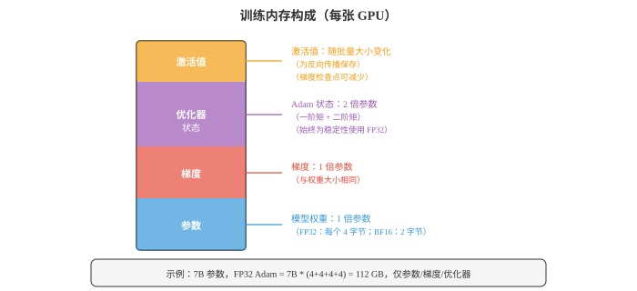
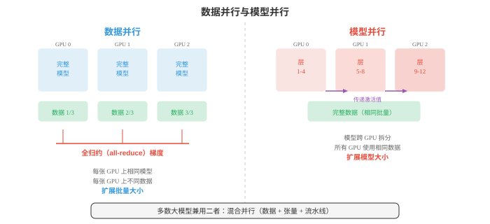
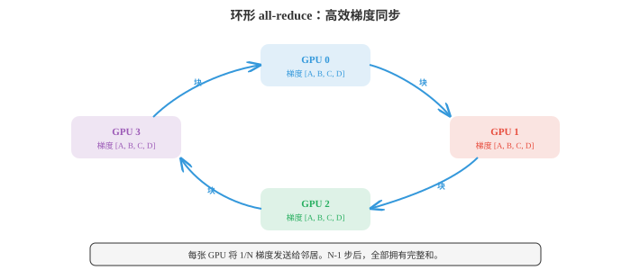
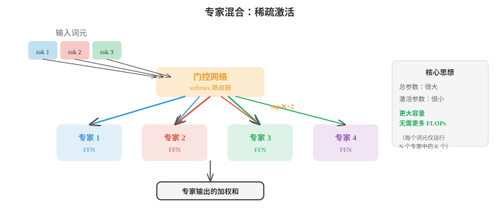

# 分布式深度学习（Distributed Deep Learning）

*分布式训练将计算分散到多个 GPU 和机器上，训练单个设备无法容纳或过慢的模型。本节介绍混合精度、数据并行、模型并行、流水线并行、ZeRO、FSDP、张量并行，以及 all-reduce 等通信原语；这些对大规模训练 LLM 不可或缺。*

- 在单个 GPU 上训练大型神经网络最终会碰壁：模型可能装不进内存，训练也可能持续数月。分布式训练将工作分散到多个设备，GPU、TPU 或整台机器，以更快地训练更大的模型。本节介绍使这一切成为可能的技术。

!!! note "大白话"
    单卡不够放、也不够快时，就让多张卡或多台机器分工合作；难点随之从算力变成“怎么分、怎么通信、怎么保持一致”。

- 要理解分布为何重要，先看训练的**计算成本（computational cost）**。批量为 $B$ 个样本的稠密层，输入数为 $d_{\text{in}}$、输出数为 $d_{\text{out}}$，一次前向传播大约需要 $2 \cdot B \cdot d_{\text{in}} \cdot d_{\text{out}}$ FLOPs，即浮点运算：输出矩阵每个元素各有一次乘法和一次加法。反向传播成本约为前向传播两倍，因需计算相对于输入和权重的梯度，因此稠密层的一次训练步约为 $6 \cdot B \cdot d_{\text{in}} \cdot d_{\text{out}}$ FLOPs。

!!! note "大白话"
    训练不只做一次预测，还要反向算梯度，所以成本大约是前向的三倍。批量、输入维度和输出维度任一变大，计算都会跟着乘上去。

- 对隐藏维度为 $d$ 的 Transformer 层，自注意力块含四个投影，Q、K、V 和输出，每个成本为 $O(B \cdot n \cdot d^2)$ FLOPs，其中 $n$ 是序列长度；加上注意力矩阵计算 $O(B \cdot n^2 \cdot d)$。前馈块有两个稠密层，通常扩展至 $4d$ 再缩回，成本为 $O(B \cdot n \cdot 8d^2)$。每层总计约为 $O(B \cdot n \cdot 12d^2 + B \cdot n^2 \cdot d)$。再乘层数，就能理解为何训练 GPT 规模模型需要数千 GPU 小时。

!!! note "大白话"
    Transformer 既有随隐藏维度平方增长的矩阵乘法，也有随序列长度平方增长的注意力。模型更宽、更长、更多层都会迅速抬高成本。

- **内存墙（memory wall）**往往是更紧的约束。训练期间，GPU 内存必须同时容纳四类内容：



!!! note "大白话"
    显存不只放模型权重，还要放梯度、优化器账本和中间结果。很多时候还没算完，显存先满了。

- **参数（parameters）**：模型权重。一个 70 亿参数模型使用 FP32，即每参数 4 字节，仅权重就需要 28 GB。

!!! note "大白话"
    70 亿个数每个占 4 字节，单权重就有 28 GB；这只是模型本体，还没开始训练。

- **梯度（gradients）**：与参数大小相同，再需 28 GB。

!!! note "大白话"
    训练时每个权重还要存一份“这次该怎么改”的梯度，所以内存立刻再翻一份。

- **优化器状态（optimizer states）**：Adam 维护两个额外缓冲区，一阶和二阶矩估计，每个都与参数大小相同。即便模型采用低精度，为数值稳定性仍以 FP32 保存。对 7B 模型，这就是 $2 \times 28 = 56$ GB。

!!! note "大白话"
    Adam 还要为每个权重记住过去的平均方向和波动大小，两份账本合计甚至比权重本身更占地方。

- **激活值（activations）**：前向传播中保存、供反向传播使用的中间值。其大小取决于批量大小、序列长度和模型宽度，通常是最大组成部分，并随批量大小线性增长。

!!! note "大白话"
    为了反向传播，前向每层经过的中间结果都得暂存。批量或文本长度加大时，这部分常是最先爆掉的。

- 对使用 FP32 Adam 的 7B 模型，仅参数、梯度和优化器就有 28 + 28 + 56 = 112 GB，尚未计算激活值。单张 80 GB A100 GPU 无法容纳它。这就是分布式策略不可或缺的原因。

!!! note "大白话"
    只算三项已经 112 GB，大于 80 GB 显存，说明不是“训练慢一点”就能解决，而是物理上根本装不下。

- **混合精度训练（mixed precision training）**是第一道防线。它不再以 FP32，即 32 位浮点数，存储一切，而是在前向和反向传播中使用 FP16 或 BF16，即 16 位，同时为优化器更新保留 FP32 的主权重副本。

!!! note "大白话"
    不需要最高精度的地方改用 16 位，能省一半左右内存并加速；真正更新参数时仍保留 32 位主副本，避免数值不稳。

- **FP16**精度高，尾数为 10 位，但数值范围有限，可能发生上溢或下溢。损失缩放，即在反向传播前将损失乘一个大因子，再以同一因子除梯度，可缓解此问题。

!!! note "大白话"
    FP16 能表达的数值范围较窄，太大或太小都会失真。损失缩放先把微小梯度放大，避免它们变成 0。

- **BF16**，即 brain float，拥有与 FP32 相同的指数范围，指数为 8 位，但精度较低，尾数为 7 位。它几乎从不上溢，且很少需要损失缩放，因此更易使用。BF16 是现代 Transformer 训练的默认选择。

!!! note "大白话"
    BF16 小数细节少一点，但能表示的大小范围和 FP32 接近，所以大模型训练时更不容易溢出，使用更省心。

- 混合精度大约将激活值和梯度的内存减半，它们是前向/反向传播中的主要成本，同时为数值稳定性使优化器状态保持 FP32。

!!! note "大白话"
    这是常见的折中：把大头的中间数据变小，保留真正容易出数值问题的优化器状态为高精度。

- **数据并行（data parallelism）**是最简单的分布式策略。它在 $N$ 张 GPU 上复制完整模型，将每个小批量划分为 $N$ 个相等部分，并向每张 GPU 发送一部分。每张 GPU 在自己的数据部分独立运行前向和反向传播；随后在全部 GPU 间平均梯度，使用 all-reduce 操作，并由每张 GPU 更新本地模型副本。

!!! note "大白话"
    每张卡都有完整模型，只分不同的数据去算。算完先把“该怎么改”的意见平均，所有卡再同步更新，所以模型始终一致。

- 从模型角度看，这等价于使用大 $N$ 倍的小批量训练。若每张 GPU 处理大小为 $B$ 的批量，有效批量大小为 $N \cdot B$。



!!! note "大白话"
    8 张卡每张看 32 个样本，合起来相当于一次用 256 个样本更新。图中另一种方案则是把模型本身拆开而不是拆数据。

- 梯度平均可以同步或异步完成。**同步 SGD（Synchronous SGD）**等待全部 GPU 完成后再平均，保证与用更大批量的单 GPU 训练在数学上等价。缺点是最慢的 GPU，即“拖后腿者（straggler）”，会拖住所有人。

!!! note "大白话"
    同步方式像全班必须等最后一人交卷才开始下一题，结果最整齐，但慢机器或慢网络会拖累全体。

- **异步 SGD（Asynchronous SGD）**让每张 GPU 不等待地独立更新共享参数服务器。它消除了拖后腿问题，却引入“陈旧梯度（stale gradients）”：某张 GPU 可能基于略微过时的参数计算梯度。陈旧梯度增加噪声并可能减慢收敛。实践中更偏好具有高效通信的同步 SGD。

!!! note "大白话"
    异步不用等人，但有人会拿着旧版本模型算出的建议来更新最新模型，速度快了，方向却可能不那么准。

- **梯度累积（gradient accumulation）**是在受限硬件上模拟更大批量的软件技巧。它不为每个小批量更新一次，而是运行多次前向/反向传播并累积梯度，然后一次更新。无需为激活值增加 GPU 内存，因每次内存中只有一个小批量激活值，就能得到与大批量相同的结果。

!!! note "大白话"
    显存只够放小批量时，就多算几轮先不更新，把梯度攒起来再统一更新，效果近似大批量但速度会慢些。

- 当模型本身大到无法装入一张 GPU 时，需要**模型并行（model parallelism）**。它有两个主要类型。

!!! note "大白话"
    数据并行要求每张卡放得下完整模型；放不下时只能把模型切开，让不同 GPU 各自保管一部分。

- **张量并行（tensor parallelism）**跨 GPU 拆分单个层。大型矩阵乘法 $Y = XW$ 可按列拆分：将 $W$ 分为分布在两张 GPU 上的 $[W_1, W_2]$，并行计算 $Y_1 = XW_1$ 和 $Y_2 = XW_2$，再拼接。它适用于注意力投影和前馈层。因为每层都必须合并部分结果，它要求 GPU 间高速通信，通常是节点内的 NVLink。

!!! note "大白话"
    一层超大矩阵拆给几张卡同时算，结果再拼回去。每层都要交流，因此更适合卡间有高速连接的同一台机器。

- **流水线并行（pipeline parallelism）**将不同层分配给不同 GPU。GPU 0 运行第 1 至 4 层，GPU 1 运行第 5 至 8 层，依此类推。数据像装配线一样流经流水线。朴素方法会有“流水线气泡（pipeline bubble）”：GPU 0 处理微批量 1 的前向传播时，GPU 1 至 3 处于空闲。**微批处理（micro-batching）**将小批量拆为更小的微批量，依次流经流水线，以缓解此问题，使所有 GPU 大部分时间保持忙碌。

!!! note "大白话"
    每张卡负责几层，样本像工件一样在卡之间传。把大批量切成小批量连续送入，能减少前后工位闲着等活的时间。

- **混合并行（hybrid parallelism）**组合数据、张量和流水线并行。一种典型大模型设置会在节点内采用张量并行，8 张 GPU 由高速 NVLink 连接，跨节点采用流水线并行，并在多组节点间采用数据并行。这就是 GPT-4、Llama 等模型的训练方式。

!!! note "大白话"
    超大模型通常不能只靠一种切法：机器内部按张量拆，机器之间按层拆，多组机器再各自处理不同数据。

- 分布式训练效率严重依赖**通信（communication）**。关键操作是**all-reduce**：给定 $N$ 张 GPU 上的一个值，计算总和或平均值，并将结果分发给全部 GPU。

!!! note "大白话"
    多卡各有一份梯度，all-reduce 做的事就是先合并，再让每张卡都拿到同一份最终结果。

- 朴素 all-reduce 将所有数据发送到一张 GPU，求和后再广播回来。通信复杂度为 $O(N)$，并在根节点形成瓶颈。

!!! note "大白话"
    把所有数据都交给一个“总负责人”汇总最直观，但卡一多，这个人的网络和计算就成堵点。

- **环形 all-reduce（ring all-reduce）**效率高得多。将 $N$ 张 GPU 排成环，每张 GPU 将数据拆为 $N$ 块。在 $N - 1$ 步中，每张 GPU 向一侧邻居发送一块、从另一侧接收一块，同时累积部分和。再经过 $N - 1$ 步，完整和会传播到全部 GPU。每张 GPU 传输的数据总量是数据大小的 $2(N-1)/N$ 倍，随 $N$ 增大时趋于 $2\times$。关键是它不会随 $N$ 增长，因此在带宽上最优。



!!! note "大白话"
    环形方案不设总负责人，每张卡只和邻居交换一小块并顺手累加。卡越多时，每张卡要传的数据仍接近两份完整数据，不会线性变糟。

- **参数服务器（parameter servers）**是另一种架构，其中专用服务器节点持有模型参数。工作节点计算梯度并发送给服务器，服务器更新参数后回传。它更简单，但可能在服务器处形成通信瓶颈。

!!! note "大白话"
    参数服务器是“中央账本”模式，逻辑清楚，但所有人都来同一个地方读写时，中央服务器容易堵住。

- **NCCL**，即 NVIDIA Collective Communications Library，是 GPU 间通信的标准库。它提供 all-reduce、all-gather、broadcast 等集体操作的优化实现，并自动为网络拓扑选择最佳算法。

!!! note "大白话"
    NCCL 是 NVIDIA 专门处理多 GPU 集体通信的底层工具，训练框架通常调用它来少走网络与拓扑优化的弯路。

- **扩展定律（scaling laws）**描述模型性能如何随计算、数据和模型大小提升。原始的 Kaplan 等人，2020，扩展定律发现损失与每项都呈幂律下降：

$$L(N) \propto N^{-\alpha_N}, \quad L(D) \propto D^{-\alpha_D}, \quad L(C) \propto C^{-\alpha_C}$$

!!! note "大白话"
    一般来说模型更大、数据更多、算得更久都会变好，但收益会越来越慢。扩展定律试图量化三者各加一份资源值不值。

- 其中 $N$ 是参数量，$D$ 是数据集大小，$C$ 是计算预算。

!!! note "大白话"
    这三项像训练的三种预算：模型容量、可学习材料和实际算力，缺一项都可能限制效果。

- **Chinchilla 扩展定律**，Hoffmann 等人，2022，表明大多数模型训练不足：对给定计算预算，应使用比先前认识更小的模型、更多的数据训练。最优比例大约是每参数 20 个 token。7B 模型应见到约 140B token，而不是 Llama 1 使用 65B 模型配 300B token 的方式。这一发现使领域转向“计算最优（compute-optimal）”训练。

!!! note "大白话"
    大模型如果读的材料太少，就像大脑很大却没上够课。Chinchilla 的结论是：固定算力下，常常该缩小模型、多喂数据。

- **专家混合（Mixture of Experts，MoE）**是一种无需按比例增加计算就可扩展模型容量的架构。每个 Transformer 层不再只有一个前馈网络，而有 $N$ 个“专家”网络，每个都是标准 FFN。**门控网络（gating network）**，即路由器，检查每个 token，并将其发送至 top-$K$ 个专家，通常 $K = 1$ 或 $K = 2$。



!!! note "大白话"
    MoE 像有很多专家但每次只叫少数几位处理当前 token。总知识容量变大，但一次实际动用的计算量不必按专家数翻倍。

- 总参数量大得多，因为存在 $N$ 个专家，但每 token 的 FLOPs 大致保持不变，因为每 token 只有 $K$ 个专家激活。例如 Mixtral 8x7B 有 47B 总参数，却每次前向传播仅使用约 13B，在较小模型成本下提供更大模型的性能。

!!! note "大白话"
    “总参数大”不等于“每次都全算”。只激活少数专家，才能用较低单次成本换到更大容量。

- MoE 引入挑战。**负载均衡（load balancing）**：若路由器将大多数 token 发送给同一专家，其余专家会被浪费。辅助损失会鼓励均匀路由。**通信**：不同专家可能位于不同 GPU，因此路由 token 需要 all-to-all 通信，成本很高。

!!! note "大白话"
    路由若偏爱少数专家，会让热门 GPU 堵死、其余 GPU 闲着；跨卡找专家还会带来昂贵的数据交换。

- 在数千张 GPU 上持续数周或数月的训练中，**容错（fault tolerance）**至关重要。若单张 GPU 失效，不希望失去全部进度。**检查点（checkpointing）**定期将模型权重、优化器状态和训练状态，即学习率、步数、数据位置，保存到磁盘。发生故障时，可从最近检查点重启。

!!! note "大白话"
    长训练一定会遇到硬件或网络故障。检查点像游戏存档，保存得不只权重，还要保存优化器和数据进度，才能真正接着训。

- **梯度检查点（gradient checkpointing）**，也称激活重计算，是内存优化而非容错机制。前向传播中，它不保存全部激活值供反向传播使用，而只在若干检查点保存激活值。反向传播中，从检查点重新计算缺失激活值。这以计算换内存：前向传播成本约增加 33%，但能将激活内存减少为原来的 $\sqrt{L}$ 倍，其中 $L$ 是层数。

!!! note "大白话"
    这里的“检查点”不是存档，而是少存中间结果、需要时重算。它用更多计算时间换回显存空间。

- 综上，训练前沿模型会组合这些技术：BF16 混合精度、跨数千 GPU 的数据并行和环形 all-reduce、节点内张量并行、跨节点流水线并行、降低内存的梯度检查点、提升参数效率的 MoE，以及提供容错的定期检查点。系统工程与算法设计同样艰难。

!!! note "大白话"
    前沿训练不是只把 GPU 数量加大，而是同时管理精度、显存、模型切分、网络带宽和故障恢复。任何一环失衡都会浪费大量算力。

- 总结分布式训练工具箱：

| 技术 | 作用 | 权衡 |
|---|---|---|
| 混合精度（BF16） | 激活值/梯度内存减半 | 轻微数值差异 |
| 数据并行 | 跨 GPU 扩展批量大小 | 梯度同步的通信开销 |
| 张量并行 | 跨 GPU 拆分层 | 需要高速互连 |
| 流水线并行 | 跨 GPU 拆分模型阶段 | 流水线气泡，即计算浪费 |
| 梯度累积 | 模拟大批量 | 更慢，多次前向/反向传播 |
| 梯度检查点 | 减少激活内存 | 约多 33% 计算 |
| 环形 all-reduce | 高效平均梯度 | 大模型上受带宽限制 |
| MoE | 更大容量，相同 FLOPs | 负载均衡、路由复杂度 |
| 扩展定律 | 指导计算分配 | 经验规律，未必适用于所有规模 |

!!! note "大白话"
    先确认瓶颈到底是算力、显存、通信还是可靠性，再选对应技术。没有单一开关能让大模型训练同时更快、更省、更稳定。

## 编程任务（使用 CoLab 或 notebook）

1. 计算 Transformer 层的 FLOPs 和内存需求。给定隐藏维度 $d$、序列长度 $n$、批量大小 $B$ 和层数，估计总训练成本。
```python
import jax.numpy as jnp

def transformer_layer_flops(d, n, B):
    """Approximate FLOPs for one transformer layer forward pass."""
    # QKV projections: 3 * (B * n * d * d) * 2 (multiply-add)
    qkv_flops = 3 * 2 * B * n * d * d
    # Attention: (B * n * n * d) * 2 for QK^T, (B * n * n * d) * 2 for attn*V
    attn_flops = 2 * 2 * B * n * n * d
    # Output projection: (B * n * d * d) * 2
    out_flops = 2 * B * n * d * d
    # FFN: two layers, d->4d and 4d->d: 2 * (B * n * d * 4d) * 2
    ffn_flops = 2 * 2 * B * n * d * 4 * d
    return qkv_flops + attn_flops + out_flops + ffn_flops

def transformer_layer_memory(d, n, B, dtype_bytes=2):
    """Approximate activation memory (bytes) for one layer."""
    # QKV: 3 * B * n * d
    qkv_mem = 3 * B * n * d * dtype_bytes
    # Attention weights: B * heads * n * n (approx B * n * n * sizeof)
    attn_mem = B * n * n * dtype_bytes
    # FFN intermediate: B * n * 4d
    ffn_mem = B * n * 4 * d * dtype_bytes
    return qkv_mem + attn_mem + ffn_mem

# Example: GPT-2 scale
d, n, B, L = 1024, 1024, 8, 24
fwd_flops = transformer_layer_flops(d, n, B)
total_flops = 3 * L * fwd_flops  # 3x for forward + backward
act_mem = L * transformer_layer_memory(d, n, B)
param_count = L * (12 * d * d + 13 * d)  # approximate

print(f"Model: d={d}, n={n}, B={B}, L={L}")
print(f"Parameters: {param_count / 1e6:.0f}M")
print(f"FLOPs per step: {total_flops / 1e12:.2f} TFLOPs")
print(f"Activation memory: {act_mem / 1e9:.2f} GB (BF16)")
print(f"Parameter memory (FP32): {param_count * 4 / 1e9:.2f} GB")
print(f"Adam optimizer memory: {param_count * 8 / 1e9:.2f} GB")
print(f"Total training memory: {(param_count * 16 + act_mem) / 1e9:.2f} GB")
```

2. 模拟数据并行训练。将数据集拆分至多个“虚拟 GPU”，独立计算梯度、求平均，并验证结果与单 GPU 训练一致。
```python
import jax
import jax.numpy as jnp

# Simple linear model: y = wx + b
key = jax.random.PRNGKey(0)
X = jax.random.normal(key, (64, 4))
w_true = jnp.array([1.0, -2.0, 3.0, 0.5])
y = X @ w_true + 0.1 * jax.random.normal(key, (64,))

def loss_fn(w, X, y):
    return jnp.mean((X @ w - y) ** 2)

grad_fn = jax.grad(loss_fn)

# Single GPU: full batch gradient
w = jnp.zeros(4)
grad_single = grad_fn(w, X, y)

# Data parallel: split across 4 "GPUs"
n_gpus = 4
chunk_size = len(X) // n_gpus
grads = []
for i in range(n_gpus):
    X_chunk = X[i*chunk_size:(i+1)*chunk_size]
    y_chunk = y[i*chunk_size:(i+1)*chunk_size]
    grads.append(grad_fn(w, X_chunk, y_chunk))

# All-reduce: average gradients
grad_parallel = jnp.mean(jnp.stack(grads), axis=0)

print("Single-GPU gradient:", grad_single)
print("Data-parallel gradient (avg):", grad_parallel)
print(f"Match: {jnp.allclose(grad_single, grad_parallel, atol=1e-5)}")

# Train both and compare
w_single, w_parallel = jnp.zeros(4), jnp.zeros(4)
lr = 0.1
for step in range(100):
    w_single = w_single - lr * grad_fn(w_single, X, y)

    grads = [grad_fn(w_parallel, X[i*chunk_size:(i+1)*chunk_size],
                     y[i*chunk_size:(i+1)*chunk_size]) for i in range(n_gpus)]
    avg_grad = jnp.mean(jnp.stack(grads), axis=0)
    w_parallel = w_parallel - lr * avg_grad

print(f"\nAfter 100 steps:")
print(f"Single-GPU weights: {w_single}")
print(f"Data-parallel weights: {w_parallel}")
print(f"Max difference: {jnp.max(jnp.abs(w_single - w_parallel)):.2e}")
```

3. 实现简单的专家混合层。创建门控网络，将 token 路由到 top-K 专家，并组合其输出。
```python
import jax
import jax.numpy as jnp

def expert_fn(x, W1, b1, W2, b2):
    """Simple 2-layer FFN expert."""
    h = jnp.maximum(0, x @ W1 + b1)  # ReLU
    return h @ W2 + b2

def moe_layer(x, gate_W, experts_params, top_k=2):
    """
    MoE forward pass.
    x: (batch, d_model)
    gate_W: (d_model, n_experts)
    experts_params: list of (W1, b1, W2, b2) per expert
    """
    n_experts = len(experts_params)

    # Gating: compute routing scores
    gate_logits = x @ gate_W  # (batch, n_experts)
    gate_probs = jax.nn.softmax(gate_logits, axis=-1)

    # Top-K selection
    top_k_indices = jnp.argsort(-gate_probs, axis=-1)[:, :top_k]
    top_k_probs = jnp.take_along_axis(gate_probs, top_k_indices, axis=-1)
    # Renormalise
    top_k_probs = top_k_probs / jnp.sum(top_k_probs, axis=-1, keepdims=True)

    # Compute expert outputs (simplified: run all experts, mask later)
    expert_outputs = jnp.stack([
        expert_fn(x, *experts_params[i]) for i in range(n_experts)
    ], axis=1)  # (batch, n_experts, d_model)

    # Gather top-K expert outputs and weight them
    batch_idx = jnp.arange(x.shape[0])[:, None]
    selected_outputs = expert_outputs[batch_idx, top_k_indices]  # (batch, top_k, d_model)
    output = jnp.sum(selected_outputs * top_k_probs[:, :, None], axis=1)

    return output, gate_probs

# Setup
key = jax.random.PRNGKey(42)
batch, d_model, d_ff, n_experts = 8, 16, 32, 4

# Initialise experts
experts_params = []
for i in range(n_experts):
    k1, k2, key = jax.random.split(key, 3)[0], jax.random.split(key, 3)[1], jax.random.split(key, 3)[2]
    experts_params.append((
        jax.random.normal(k1, (d_model, d_ff)) * 0.1,
        jnp.zeros(d_ff),
        jax.random.normal(k2, (d_ff, d_model)) * 0.1,
        jnp.zeros(d_model),
    ))

key, subkey = jax.random.split(key)
gate_W = jax.random.normal(subkey, (d_model, n_experts)) * 0.1
x = jax.random.normal(key, (batch, d_model))

output, gate_probs = moe_layer(x, gate_W, experts_params, top_k=2)

print(f"Input shape: {x.shape}")
print(f"Output shape: {output.shape}")
print(f"Gate probabilities (first sample): {gate_probs[0]}")
print(f"Expert usage (avg across batch):")
for i in range(n_experts):
    usage = jnp.mean(gate_probs[:, i])
    print(f"  Expert {i}: {usage:.3f}")
```
