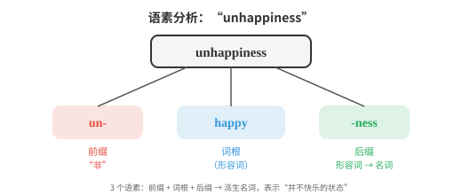
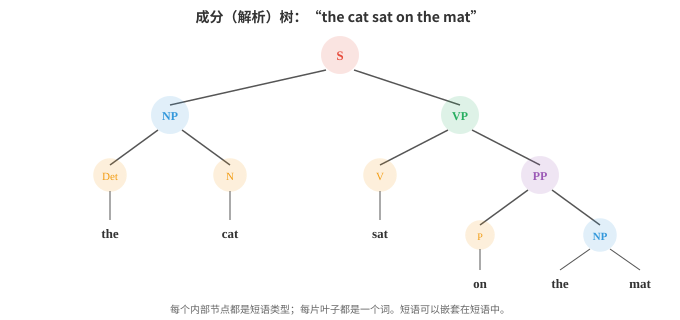
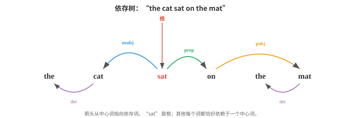

# 语言学基础

*语言学为自然语言处理（Natural Language Processing, NLP）系统隐式学习和利用的结构提供术语框架。本节介绍形态学、句法学、语义学、语用学、音系学、成分分析、依存分析和分布假说；这些语言科学概念构成了 AI 中分词、语法和语义的基础。*

- 在构建能够理解或生成语言的系统之前，必须先理解语言本身如何运作。

- 语言学是研究语言的科学，自然语言处理持续借用其中的概念术语。

- 即使是从原始数据中学习语言的现代神经模型，也会隐式地重新发现语言学家数十年来整理出的许多结构。

- 语言的每个层面都有结构：构成单词的语音、构成单词的成分、把单词组合成句子的规则、句子承载的意义，以及语境塑造解释的方式。我们将自下而上地逐层学习。

- **形态学（morphology）**研究单词的内部结构。单词不是不可再分的原子，而是由更小且有意义的单位构成，这些单位称为**语素（morpheme）**。

- 单词 “unhappiness” 含有三个语素：“un-”（表示“非”的前缀）、“happy”（词根）和 “-ness”（把形容词变为名词的后缀）。每个语素都对词义有所贡献。

- **词根（root）**（或词干 stem）是承载主要意义的核心语素。“happy”、“run”、“compute” 都是词根。

- **词缀（affix）**是附着在词根上、用于修饰词根的语素。

- 英语有**前缀（prefix）**（位于词根前：un-、re-、pre-）和**后缀（suffix）**（位于词根后：-ing、-ed、-tion）。有些语言还有中缀（插入词根内部）和环缀（包围词根）。



- 形态过程有两类。**屈折（inflection）**在不改变词的核心意义或词类的情况下，改变它的语法属性：“run” 变为 “runs”（第三人称）、“running”（进行体）、“ran”（过去时）。它仍然是表达同一动作意义的动词。

- **派生（derivation）**创造新词，且通常会改变词类：“happy”（形容词）变为 “happiness”（名词），“compute”（动词）变为 “computation”（名词）再变为 “computational”（形容词）。每次派生都会改变词义和语法类别。

- 各种语言的形态复杂度差异很大。英语相对**分析型（analytic）**，每个词中的语素较少，更多依赖词序。

- 土耳其语和芬兰语属于**黏着语（agglutinative）**，一个词可串接许多语素。阿拉伯语和希伯来语使用**模板式（templatic）**形态：词根是如 k-t-b（“写”）这样的辅音骨架，插入元音模式后形成不同单词：kitab “书”、kataba “他写了”、maktub “被写的”。

- 形态学之所以对自然语言处理重要，是因为它会影响分词（tokenisation）。按词分词器会把 “run”、“runs”、“running” 和 “ran” 当作四个无关的符号。

- 具备形态意识的系统会识别出它们共享同一词根。将在文件 02 中介绍的子词分词（subword tokenisation，BPE、WordPiece），是形态分析的统计近似。

- **句法学（syntax）**研究单词如何组合成短语和句子。每种语言都有管理词序和结构的规则；违反这些规则会产生不通的语句。

- “The cat sat on the mat” 是合乎英语语法的句子；“Mat the on sat cat the” 则不是。

- 描述句法结构主要有两个框架。

- **短语结构语法（phrase structure grammar）**（也称成分语法 constituency grammar）认为，句子由短语层层嵌套构成。一个句子（S）由名词短语（NP）和动词短语（VP）组成。

- 名词短语可能由限定词（Det）和名词（N）组成；动词短语可能由动词（V）和名词短语组成。这些规则会构造出一棵树：



- 这棵树称为**成分树（constituency tree）**（或解析树 parse tree）。每个内部节点是短语类型，每个叶节点是一个词。它捕捉了层级分组关系：“on the mat” 是一个单位（介词短语），“sat on the mat” 是一个单位（动词短语），整体则是一个句子。

- **上下文无关文法（context-free grammar, CFG）**将这些规则形式化。它由一组产生式规则组成，每条规则的形式为 $A \to \alpha$，其中 $A$ 是非终结符（如 NP 或 VP 这样的短语类型），$\alpha$ 是终结符（词）与非终结符构成的序列。例如：

```
S  → NP VP
NP → Det N
NP → Det N PP
VP → V NP
VP → V PP
PP → P NP
Det → "the" | "a"
N  → "cat" | "mat" | "dog"
V  → "sat" | "chased"
P  → "on" | "under"
```

- 从 S 开始反复应用规则，就能生成该文法允许的全部句子。解析则是反向过程：给定一个句子，找到生成它的树（或多棵树）。具有多棵有效解析树的句子称为**句法歧义（syntactically ambiguous）**。“I saw the man with the telescope” 有两种解析：我用望远镜看到了那个人，或者我看到了带着望远镜的那个人。

- **依存语法（dependency grammar）**采取不同视角。它不描述短语嵌套，而是描述词语之间的直接关系。除句子的根以外，句中每个词都依赖于恰好另一个词（它的**中心词（head）**）。由此得到一棵**依存树（dependency tree）**，其边带有语法关系标签（主语、宾语、修饰语等）。



- 在依存视角中，“sat” 是根。“cat” 作为主语（nsubj）依赖于 “sat”。“on” 作为介词修饰语依赖于 “sat”。“mat” 作为介词宾语依赖于 “on”。每个词都恰好从属于一个中心词，构成一棵树。

- 依存语法已成为现代自然语言处理的主导框架，因为统计解析器更容易生成依存树，且这些关系与语义角色（谁对谁做了什么）的映射更直接。

- **配价（valency）**描述一个动词需要多少个论元（argument）。“sleep” 是**不及物（intransitive）**动词（一个论元：睡觉者）。“eat” 是**及物（transitive）**动词（两个论元：吃的人和被吃的东西）。“give” 是**双及物（ditransitive）**动词（三个论元：给予者、被给予物和接收者）。了解动词的配价能约束哪些解析树是有效的。

- **语义学（semantics）**研究意义。句法告诉你句子如何构成；语义告诉你它表达什么。

- **词汇语义学（lexical semantics）**关注单个词的意义。词语之间以系统性的方式相互关联：

    - **同义关系（synonymy）**：意义（近乎）相同的词。“big” 和 “large” 是同义词。真正完全同义的词很少，内涵或用法几乎总有细微差异。
    - **反义关系（antonymy）**：意义相反的词。“hot” 与 “cold”、“buy” 与 “sell”。
    - **上位/下位关系（hypernymy/hyponymy）**：“是一种”的关系。“dog” 是 “animal” 的下位词（一只狗是一种动物）。“animal” 是 “dog” 的上位词。它们构成分类层级。
    - **部分整体关系（meronymy）**：“是……的一部分”的关系。“wheel” 是 “car” 的部分词。
    - **一词多义（polysemy）**：一个词具有多个相关的意义。“bank” 可以指金融机构或河岸。语境会消解这种歧义。

- **词义消歧（word sense disambiguation, WSD）**是在给定语境中确定一个多义词意图使用哪种词义的任务。在 “I deposited money at the bank” 中，正确的是金融义；在 “We sat by the river bank” 中，正确的是地理义。词义消歧曾是早期自然语言处理的核心问题；现代上下文嵌入（contextual embeddings，如 ELMo、BERT）通过为同一词的不同用法生成不同的向量表示，已在很大程度上解决了它。

- **组合语义学（compositional semantics）**研究单个词的意义如何组合成短语或句子的意义。**组合性（compositionality）**原则（归于 Frege）认为，复杂表达式的意义由其各部分的意义以及组合这些部分的规则决定。“The cat chased the dog” 与 “the dog chased the cat” 意义不同，因为句法结构（谁是主语，谁是宾语）会与词义相互作用。

- 并非所有意义都具有组合性。像 “kick the bucket”（意为“死亡”）这样的**习语（idiom）**，其意义无法从组成部分推导出来。这对任何组合式方法都是挑战。

- **分布式语义（distributional semantics）**是支撑现代自然语言处理的计算语义方法。**分布假说（distributional hypothesis）**（Firth，1957）指出：“你可以通过一个词所结交的同伴来认识它。”出现在相似语境中的词往往具有相似意义。这是词嵌入（word embeddings，如 Word2Vec、GloVe）的理论基础，将在文件 03 中进一步学习。

- **语用学（pragmatics）**研究语境如何影响意义。同一句话会因说话者、时间、地点和原因而具有不同意义。

- “Can you pass the salt?” 在句法上是询问能力的是非问句；在语用上，它是一个请求。你不会回答 “Yes, I can” 后便坐着不动。理解这一点需要字面词语之外的知识，尤其是对**言语行为（speech acts）**惯例的了解。

- **言语行为理论（speech act theory）**（Austin、Searle）区分：
    - **言内行为（locutionary act）**：字面内容（“Can you pass the salt?”）
    - **言外行为（illocutionary act）**：意图功能（一个请求）
    - **言后行为（perlocutionary act）**：对听者产生的效果（听者递盐）

- **会话含义（implicature）**（Grice）是被暗示却未被明确说出的意义。若有人问 “Is John a good cook?”，而你回答 “He's British”，你没有按字面回答问题，但听者可能会透过文化刻板印象（无论这是否公平）推断你的意思是“不是”。Grice 的**合作原则（cooperative principle）**认为，说话者通常努力做到信息充分、真实、相关、清楚；听者会假定这些准则成立，据此解释话语。

- **共指（coreference）**是一种语用现象，指不同表达式指向同一实体。在 “Alice went to the store. She bought milk” 中，“she” 指代 Alice。消解共指对于理解多句文本至关重要，也是自然语言处理的一项关键任务。

- **篇章结构（discourse structure）**描述句子如何连接成连贯文本。叙事有开端、发展和结尾；论证有主张和证据。**修辞结构理论（Rhetorical Structure Theory, RST）**将文本分析为篇章单元之间的关系树（展开、对比、因果等）。

- 语用学是自然语言处理中最困难的部分。现代语言模型通过训练数据隐式处理了大量句法和语义，但语用推理、反讽理解、会话含义和依赖语境的意义理解，仍是前沿挑战。

- **音系学（phonology）**研究语言的声音系统。本章聚焦文本，但简要概览可衔接到音频与语音章节（第 09 章）。

- **音位（phoneme）**是区分意义的最小语音单位。英语约有 44 个音位。“bat” 和 “pat” 只相差一个音位（/b/ 与 /p/），这一差异会完全改变意义。这称为**最小对立体（minimal pair）**。

- **音位变体（allophone）**是同一音位不改变意义的不同实际发音。“pin” 中的 “p”（送气，带有一股气流）和 “spin” 中的 “p”（不送气）在英语里都是 /p/ 的音位变体；母语者会将它们视为同一个音。

- **国际音标（International Phonetic Alphabet, IPA）**为所有语言的音位提供标准化记法。单词 “cat” 可标为 /kæt/。国际音标是书面文本与语音系统之间的桥梁。

- **韵律（prosody）**包括语音的节奏、重音和语调。“I didn't say he stole the money” 会因重读的词不同而有七种不同意义。韵律承载着纯文本丢失的信息，因此文本转语音系统必须认真建模它。

- 在自然语言处理中，音系知识用于文本转语音（字形到音位转换）、语音识别（将声学信号映射为音位），甚至也用于拼写纠正和音译。

## 编程任务（使用 CoLab 或 notebook）

1. 使用常见前缀和后缀列表，构建一个简单的形态分析器，将英语单词拆分为可能的语素。
```python
prefixes = ['un', 're', 'pre', 'dis', 'mis', 'over', 'under', 'out', 'non']
suffixes = ['ing', 'ed', 'ly', 'ness', 'ment', 'tion', 'able', 'ible', 'er', 'est', 'ful', 'less', 'ous']

def analyse_morphemes(word):
    """Simple morpheme analysis using known affixes."""
    parts = []
    remaining = word.lower()

    # Check prefixes
    for p in sorted(prefixes, key=len, reverse=True):
        if remaining.startswith(p) and len(remaining) > len(p) + 2:
            parts.append(f"[prefix: {p}]")
            remaining = remaining[len(p):]
            break

    # Check suffixes
    for s in sorted(suffixes, key=len, reverse=True):
        if remaining.endswith(s) and len(remaining) > len(s) + 2:
            root = remaining[:-len(s)]
            parts.append(f"[root: {root}]")
            parts.append(f"[suffix: {s}]")
            remaining = None
            break

    if remaining is not None:
        parts.append(f"[root: {remaining}]")

    return parts

for word in ['unhappiness', 'reusable', 'disconnected', 'overreacting', 'kindness']:
    print(f"{word:20s} → {' + '.join(analyse_morphemes(word))}")
```

2. 使用递归下降方法实现一个简单的上下文无关文法解析器。定义一套小型文法，并将一个句子解析为成分树。
```python
class CFGParser:
    """Recursive descent parser for a tiny English grammar."""
    def __init__(self, tokens):
        self.tokens = tokens
        self.pos = 0

    def peek(self):
        return self.tokens[self.pos] if self.pos < len(self.tokens) else None

    def consume(self, expected=None):
        tok = self.peek()
        if expected and tok != expected:
            return None
        self.pos += 1
        return tok

    def parse_det(self):
        if self.peek() in ('the', 'a'):
            return ('Det', self.consume())
        return None

    def parse_noun(self):
        if self.peek() in ('cat', 'dog', 'mat', 'man'):
            return ('N', self.consume())
        return None

    def parse_verb(self):
        if self.peek() in ('sat', 'chased', 'saw'):
            return ('V', self.consume())
        return None

    def parse_prep(self):
        if self.peek() in ('on', 'under', 'with'):
            return ('P', self.consume())
        return None

    def parse_np(self):
        save = self.pos
        det = self.parse_det()
        noun = self.parse_noun()
        if det and noun:
            # Check for optional PP
            pp = self.parse_pp()
            if pp:
                return ('NP', det, noun, pp)
            return ('NP', det, noun)
        self.pos = save
        return None

    def parse_pp(self):
        save = self.pos
        prep = self.parse_prep()
        np = self.parse_np()
        if prep and np:
            return ('PP', prep, np)
        self.pos = save
        return None

    def parse_vp(self):
        save = self.pos
        verb = self.parse_verb()
        if verb:
            np = self.parse_np()
            if np:
                return ('VP', verb, np)
            pp = self.parse_pp()
            if pp:
                return ('VP', verb, pp)
        self.pos = save
        return None

    def parse_sentence(self):
        np = self.parse_np()
        vp = self.parse_vp()
        if np and vp and self.pos == len(self.tokens):
            return ('S', np, vp)
        return None

def print_tree(tree, indent=0):
    if isinstance(tree, str):
        print(' ' * indent + tree)
    elif isinstance(tree, tuple):
        print(' ' * indent + tree[0])
        for child in tree[1:]:
            print_tree(child, indent + 2)

sentences = [
    "the cat sat on the mat",
    "a dog chased the cat",
]

for sent in sentences:
    tokens = sent.split()
    parser = CFGParser(tokens)
    tree = parser.parse_sentence()
    print(f"\n'{sent}':")
    if tree:
        print_tree(tree)
    else:
        print("  (no parse found)")
```

3. 通过构建一个简单的词图来探索词汇关系。给定含有同义、反义和上位词关系的小型词汇表，找出词语之间的路径。
```python
relations = {
    ('big', 'large'): 'synonym',
    ('big', 'small'): 'antonym',
    ('small', 'tiny'): 'synonym',
    ('dog', 'animal'): 'hypernym',
    ('cat', 'animal'): 'hypernym',
    ('puppy', 'dog'): 'hypernym',
    ('happy', 'glad'): 'synonym',
    ('happy', 'sad'): 'antonym',
    ('hot', 'cold'): 'antonym',
    ('hot', 'warm'): 'synonym',
}

# Build adjacency list
from collections import defaultdict, deque

graph = defaultdict(list)
for (w1, w2), rel in relations.items():
    graph[w1].append((w2, rel))
    graph[w2].append((w1, rel))

def find_path(start, end):
    """BFS to find a path between two words through the relation graph."""
    queue = deque([(start, [(start, None)])])
    visited = {start}
    while queue:
        node, path = queue.popleft()
        if node == end:
            return path
        for neighbor, rel in graph[node]:
            if neighbor not in visited:
                visited.add(neighbor)
                queue.append((neighbor, path + [(neighbor, rel)]))
    return None

pairs = [('big', 'tiny'), ('puppy', 'cat'), ('happy', 'sad')]
for w1, w2 in pairs:
    path = find_path(w1, w2)
    if path:
        steps = " → ".join(f"{w}({r})" if r else w for w, r in path)
        print(f"{w1} → {w2}: {steps}")
    else:
        print(f"{w1} → {w2}: no path found")
```
