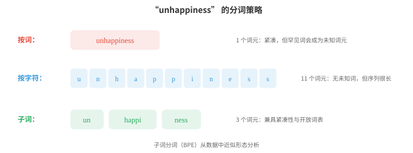
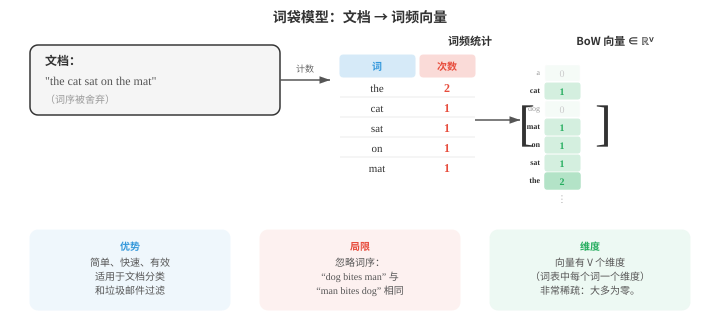

# 文本处理与经典自然语言处理

*文本处理将原始字符转化为模型可处理的结构化表示。本节介绍分词（按词、子词、BPE、WordPiece）、文本规范化、编辑距离、TF-IDF、n-gram 语言模型、词性标注、命名实体识别和情感分析；它们构成至今仍支撑现代系统的经典自然语言处理流程。*

- 原始文本很杂乱。任何自然语言处理模型开始处理语言前，都必须先对文本进行清理、规范化，并将其转为结构化表示。本节介绍从原始字符到模型可使用特征的流程，以及深度学习出现前占主导地位的经典自然语言处理算法。

!!! note "大白话"
    机器不能直接从杂乱文本里可靠地学习，先把格式和单位理顺，后面的统计或模型才有稳定输入。

- **文本规范化（text normalisation）**将原始文本转换为规范形式。目标是减少无关变异，使 “Hello”、“hello”、“HELLO” 和 “héllo” 能得到恰当处理。

!!! note "大白话"
    规范化是在决定哪些表面差别不重要，避免模型把同一个词的大小写或编码变化误当成新词。

- **大小写折叠（case folding）**将文本转换为小写。这会把 “The” 和 “the” 合并为同一个词元。它对大多数任务有帮助，但在一些情况下会丢失有用信息：“US”（国家）与 “us”（代词），或 “Apple”（公司）与 “apple”（水果）。

!!! note "大白话"
    全部转小写能减少词表，却会抹掉专名和缩写线索；是否这样做取决于任务更在意简化还是区分。

- **Unicode 规范化（Unicode normalisation）**处理同一个字符可有多种编码方式这一事实。字符 “é” 可以是单个码位（U+00E9），也可以是基本字符 “e” 加组合重音（U+0065 + U+0301）。NFC 规范化会将它们合成为一个码位，NFD 则将其分解。若不进行规范化，两个外观相同的字符串可能无法匹配。

!!! note "大白话"
    看起来相同的字，电脑内部可能不是同一串编号。Unicode 规范化就是先把这种隐蔽差异统一掉。

- **编辑距离（edit distance）**衡量两个字符串有多么不同。**Levenshtein 距离（Levenshtein distance）**计算将一个字符串转换为另一个字符串所需的最少单字符插入、删除和替换次数。“kitten” → “sitting” 的编辑距离是 3（k→s、e→i、插入 g）。

!!! note "大白话"
    编辑距离就是把一个拼写改成另一个拼写的最少操作数；数字越小，两个字符串越像。

- 编辑距离用动态规划计算（将在算法章节回顾）。定义 $D[i][j]$ 为字符串 $s$ 的前 $i$ 个字符与字符串 $t$ 的前 $j$ 个字符之间的距离：

```math
D[i][j] = \begin{cases} j & \text{if } i = 0 \\ i & \text{if } j = 0 \\ D[i{-}1][j{-}1] & \text{if } s[i] = t[j] \\ 1 + \min(D[i{-}1][j], \; D[i][j{-}1], \; D[i{-}1][j{-}1]) & \text{otherwise} \end{cases}
```

!!! note "大白话"
    这张表把大问题拆成许多前缀小问题：每多看一个字符，只比较插入、删除、替换三种选择里最省的一种。

- 编辑距离支持拼写纠正、模糊匹配和 DNA 序列比对。在自然语言处理中，它用于处理拼写错误和寻找相似词。

!!! note "大白话"
    搜索框能猜中错别字，靠的就是“离目标词差几步”的想法；它也能比较任何符号序列。

- **分词（tokenisation）**把文本切分为模型可处理的离散单元（词元 token）。这是第一个，也可以说是最重要的预处理步骤。分词策略的选择会深刻影响模型行为。

!!! note "大白话"
    分词是在决定模型一次看多大的文字块。切法错了，后面模型再强也只能在不合适的积木上学习。

- **空白分词（whitespace tokenisation）**按空格切分。它简单但很粗糙：“New York” 变成两个词元，“don't” 是一个词元（或依分割器不同被切成 “don” 和 “'t”），而汉语、日语等语言的词语之间根本没有空格。

!!! note "大白话"
    按空格切最快，但它把英语的复杂写法和没有空格的语言都处理得很粗糙。

- **基于规则的分词（rule-based tokenisation）**使用手写模式（正则表达式）处理缩写、标点和特殊情形。“I'm” → “I” + “'m”，“U.S.A.” 则保持为一个词元。每种语言都需要自己的规则，工作量很大。

!!! note "大白话"
    规则分词像人工写一长串例外条款，能做得精细，但语言一多、写法一变就很难维护。

- **子词分词（subword tokenisation）**是现代解决方案。它不在词边界处分割，而是从数据中学习由常见子词单元构成的词表。这能优雅地处理未知词：若 “unhappiness” 不在词表中，它可被切分为 “un” + “happi” + “ness”，从而保留形态结构。



!!! note "大白话"
    子词介于整词和单字符之间：常见部分能作为整体保留，生词又能拆开处理，因此既省长度又不怕词表外词。

- **字节对编码（Byte-Pair Encoding, BPE）**以单个字符作为初始词表。它反复找出频率最高的相邻对，并将其合并为一个新词元。经过足够次数的合并后，常见词成为单个词元，罕见词则被切分为常见的子词片段。

!!! note "大白话"
    BPE 像把总是一起出现的字块黏成一个新积木。高频词越完整，罕见词越由可复用的小块拼出。

- BPE 算法：
    1. 用训练语料中的所有单字符初始化词表
    2. 统计每一种相邻词元对的频率
    3. 将最常见的词元对合并为一个新词元
    4. 重复步骤 2-3，直到达到所需的合并次数（词表大小）

!!! note "大白话"
    它每轮只做一件事：找出现得最多的相邻组合并合并。反复执行后，词表就从字符逐步长出常用片段。

- 例如，从 “l o w”（5 次）、“l o w e r”（2 次）、“n e w e s t”（6 次）开始：最常见的词元对可能是 “e s” → 合并为 “es”。然后是 “es t” → “est”。再然后是 “n e w” → “new”。最终词表同时包含完整单词和子词片段。

!!! note "大白话"
    合并过程由数据频率决定，不是人工指定词根。最后会同时留下高频整词和能拼出其他词的零件。

- **WordPiece**（BERT 使用）与 BPE 相似，但它依据似然而非频率选择合并。它合并能最大化训练数据语言模型似然的词元对。不是词首的子词词元会加上 “##” 前缀（例如，“playing” → “play” + “##ing”）。

!!! note "大白话"
    WordPiece 也在合并子词，但衡量标准是“这样切分能否更好解释文本”，不只是某对字符出现得多不多。

- **Unigram**（SentencePiece 使用）采用相反方法：从一个大型词表开始，迭代删除其删除对训练数据似然损害最小的词元。最终词表是一组能最好解释语料的子词单元。

!!! note "大白话"
    Unigram 先准备很多候选积木，再逐个淘汰最不重要的；它和 BPE 的“从小拼大”方向相反。

- **SentencePiece** 是语言无关的分词库，它将输入视为原始字节流（不按空格进行预分词）。因此它适用于任何语言，包括没有空格的语言。它同时实现了 BPE 和 Unigram 算法。

!!! note "大白话"
    SentencePiece 不预设空格就是词界，所以中文、日文和英文能用同一种分词框架处理。

- 词表大小是一个关键超参数。典型选择范围为 30,000 到 100,000 个词元。更大的词表意味着每个序列的词元更少（更高效），但嵌入表更大；更小的词表意味着更多子词切分和更长序列。

!!! note "大白话"
    词表大小是在“每句话切得短”和“模型要记的词更多”之间取平衡；没有绝对最优值。

- 两种技术都会将词还原为基本形式，但方法不同。

!!! note "大白话"
    词干提取和词形还原都想把多个变形归到一起，只是一个图快、一个图准确。

- **词干提取（stemming）**通过粗略规则截去后缀。Porter 词干提取器会把 “running” 化为 “run”、“happiness” 化为 “happi”、“studies” 化为 “studi”。它很快但不精确：“university” 和 “universe” 虽然没有关系，却都会被提取为 “univers”。

!!! note "大白话"
    词干提取像用剪刀粗暴剪掉词尾，速度快，却可能把本来不同的词剪成同一个残片。

- **词形还原（lemmatisation）**利用词表和形态分析寻找真正的词典形式（词元原形 lemma）。“Running” → “run”，“better” → “good”，“mice” → “mouse”。它需要知道词性：“saw” 作为动词会还原为 “see”，作为名词则保持 “saw”。

!!! note "大白话"
    词形还原更像查词典：它会结合词性找到正确原形，所以结果自然，但成本比简单截断更高。

- 现代子词分词已在神经自然语言处理中很大程度上取代词干提取和词形还原，但它们在信息检索、较小模型或数据有限的场景中仍然有用。

!!! note "大白话"
    大模型通常靠子词自己学变化规律；传统方法在资源少、追求可解释或做检索时仍然很实用。

- **词性（part-of-speech, POS）标注**为每个词分配语法类别：名词、动词、形容词、限定词等。这是最早的自然语言处理任务之一，也是句法分析的基础。

!!! note "大白话"
    词性标注相当于先给每个词贴上“名词、动词、形容词”等标签，后续才能分析句子骨架。

- Penn Treebank 标注集是英语中最常用的标注集，共有 36 个标签（NN 表示单数名词、NNS 表示复数名词、VB 表示动词原形、VBD 表示过去式、JJ 表示形容词等）。

!!! note "大白话"
    这是一套约定好的英文语法标签字典，不同系统都用它，结果才方便比较和复用。

- 词性标注并不容易，因为许多词存在歧义。“Book” 可以是名词（“the book”），也可以是动词（“book a flight”）。“Run” 在不同词性下有数十种词义。语境至关重要。

!!! note "大白话"
    一个词不能脱离句子贴标签；看见 book 时，要看它前后是谁，才能知道它是“书”还是“预订”。

- 早期标注器使用第 05 章介绍的**隐马尔可夫模型（Hidden Markov Models, HMMs）**。隐藏状态是词性标签，观测值是单词。转移概率捕捉标签序列（限定词后很可能接名词或形容词），发射概率则捕捉哪些词会与哪些标签一同出现。Viterbi 算法找出最可能的标签序列。

!!! note "大白话"
    HMM 同时利用“这个词像什么词性”和“前一个词性后面通常接什么”，最后挑整句最顺的标签组合。

- 用于词性标注的 HMM 模型：

$$\hat{t}_{1:n} = \arg\max_{t_{1:n}} \prod_{i=1}^{n} P(w_i \mid t_i) \cdot P(t_i \mid t_{i-1})$$

!!! note "大白话"
    公式在所有可能标签序列中挑概率最大的一条：前半项看词和标签是否搭，后半项看相邻标签是否通顺。

- 现代词性标注器使用神经网络（双向 LSTM 或 Transformer），在英语上准确率超过 97%，接近人类水平。

!!! note "大白话"
    神经模型能从更长的上下文判断词性，因此在标准英文数据上已经很少贴错标签。

- **命名实体识别（Named Entity Recognition, NER）**在文本中识别并分类专有名称和其他特定实体：人物、组织、地点、日期、金额等。

!!! note "大白话"
    NER 是在文章里圈出重要名字，并告诉你它是人、公司、地点还是时间金额。

- 在 “Apple CEO Tim Cook announced the event in Cupertino on Monday” 中，NER 系统应识别出：Apple（ORG）、Tim Cook（PER）、Cupertino（LOC）、Monday（DATE）。

!!! note "大白话"
    这不是只找大写词，而是把连续词组成实体并分类；例如 Tim 和 Cook 合起来才是一个人名。

- NER 通常使用 **BIO 标注（BIO tagging）**（也称 IOB 标注）表述为**序列标注（sequence labelling）**问题。每个词元得到一个标签：

!!! note "大白话"
    BIO 用每个位置的标签把实体边界画出来，既说明类型，也说明这个词在实体的开头、中间还是外面。

    - **B-TYPE**：TYPE 类型实体的开头（beginning）

        !!! note "大白话"
            B 就是“从这里新开一个实体”。

    - **I-TYPE**：TYPE 类型实体的内部（inside，延续部分）

        !!! note "大白话"
            I 表示这个词还属于刚才开始的同一个实体。

    - **O**：任何实体之外（outside）

        !!! note "大白话"
            O 表示普通上下文词，不属于要抽取的任何实体。

- “Tim Cook visited New York” 变为：Tim/B-PER Cook/I-PER visited/O New/B-LOC York/I-LOC。B 标签标出新实体的开始位置；当相同类型的两个实体相邻时，这一点十分重要。


!!! note "大白话"
    例如两个相邻的人名，第二个也必须用 B 重新开始，否则系统会误以为它们是一个长人名。

- 经典 NER 使用第 05 章介绍的**条件随机场（Conditional Random Fields, CRFs）**，它对给定输入的整个标签序列建模条件概率。HMM 是生成式模型（$P(x, y)$），CRF 则是判别式模型，直接建模 $P(y \mid x)$。线性链 CRF 定义为：

$$P(y_{1:n} \mid x_{1:n}) = \frac{1}{Z(x)} \exp\!\left(\sum_{i=1}^{n} \left[\sum_k \lambda_k f_k(y_i, x, i) + \sum_j \mu_j g_j(y_i, y_{i-1}, x, i)\right]\right)$$

!!! note "大白话"
    CRF 不单独给每个词贴标签，而是给整条标签序列打分，因此能把相邻标签之间的规则一起考虑。

- 其中，$f_k$ 是**发射特征（emission features）**（位置 $i$ 的输入给定时，标签 $y_i$ 有多大可能），$g_j$ 是**转移特征（transition features）**（前一个标签为 $y_{i-1}$ 时，标签 $y_i$ 有多大可能）。

!!! note "大白话"
    发射特征看“这个词本身像不像某标签”，转移特征看“这个标签接在前一个后面合不合理”。

- 配分函数 $Z(x) = \sum_{y'} \exp(\ldots)$ 对所有可能的标签序列求和，以规范化分布。训练最大化条件对数似然，这要求使用前向算法（第 05 章）高效计算 $Z(x)$。

!!! note "大白话"
    $Z(x)$ 是把所有候选标签路径的总分算出来，作用是把分数变成真正可比较的概率。

- 相比独立分类每个词元，其关键优势在于：CRF 的转移特征会施加结构约束（例如 I-PER 只能跟在 B-PER 或 I-PER 后面，绝不能出现在 O 后）。

!!! note "大白话"
    它能禁止明显不合规的标签串，就像表单校验不允许“实体内部”凭空出现在普通词后面。

- 现代 NER 会将 CRF 堆叠在神经编码器上方（BiLSTM-CRF 或 BERT-CRF），神经网络产生发射得分，CRF 层学习转移结构。

!!! note "大白话"
    神经网络负责读懂上下文，CRF 负责把标签结果排得合规，两层各做自己擅长的事。

- **句法解析（syntactic parsing）**将一个句子转为其句法结构，即成分树或依存树（两者都在文件 01 中介绍）。

!!! note "大白话"
    句法解析就是给一句话画结构图，明确哪些词成组、谁依赖谁。

- **CYK 算法（Cocke-Younger-Kasami）**使用动态规划，以上下文无关文法解析句子。

!!! note "大白话"
    CYK 用表格把每一小段词能组成什么短语都记下来，再逐步拼成整句。

- 它要求文法采用**乔姆斯基范式（Chomsky Normal Form）**（每条规则右侧要么有两个非终结符，要么有一个终结符）。它自底向上填充一个三角表：单元格表示句子的跨度，每个单元格存储能够生成该跨度的非终结符。

!!! note "大白话"
    先把规则整理成统一的二叉形式，算法才能按短片段到长片段的顺序稳定填表。

- CYK 的时间复杂度为 $O(n^3 \cdot |G|)$，其中 $n$ 是句子长度，$|G|$ 是文法大小。它是精确的，但对大型文法速度较慢。

!!! note "大白话"
    句子稍长，所有切分位置的组合就会迅速变多，所以精确的 CYK 在大文法上不够快。

- **移进-归约解析（shift-reduce parsing）**从左到右处理句子，并维护一个栈。每一步要么**移进（shift）**（将下一个词压入栈），要么**归约（reduce）**（从栈中弹出元素，并用一个短语替换它们）。训练好的分类器决定每一步的动作。它以 $O(n)$ 时间运行，因而比 CYK 快得多。

!!! note "大白话"
    它像边读边整理桌面：读到一个词就放入栈，凑成短语就合并，因而不必枚举所有组合。

- 实际中，依存解析如今比成分解析更常见。基于转移的依存解析器（如移进-归约）和基于图的解析器（为所有可能的边打分并找到最大生成树）是两种主要方法。使用 BiLSTM 或 Transformer 的神经依存解析器达到了最先进结果。

!!! note "大白话"
    现代系统常直接预测词与词的关系；有的逐步建边，有的先给所有边打分，再选整棵最合理的树。

- 在嵌入出现之前，自然语言处理用简单计数方法将文档表示为向量。

!!! note "大白话"
    早期方法不先理解深层语义，而是先统计每个词出现多少次，把文章变成一串数字。

- **词袋模型（bag-of-words, BoW）**将文档表示为词频向量，完全忽略词序。若词表有 $V$ 个词，每篇文档就是 $\mathbb{R}^V$ 中的一个向量（对应第 01 章的向量空间）。词 $w$ 对应的条目是 $w$ 在文档中出现的次数。



!!! note "大白话"
    词袋只记“哪些词出现了几次”，不记原来顺序，就像把句子拆散后倒进一个计数袋。

- BoW 很简单，却在文档分类、垃圾邮件过滤等任务中出奇有效。它的主要弱点是把每个词视为同样重要：“the” 和 “revolutionary” 得到相同权重。

!!! note "大白话"
    只要主题主要靠关键词区分，词袋就够用；但它分不清虚词和真正有信息量的词，也看不出词序。

- **TF-IDF（Term Frequency-Inverse Document Frequency，词频-逆文档频率）**通过根据词的信息量加权来解决这个问题。某个词在一篇文档中高频出现、但在整个语料中很少出现时，很可能对这篇文档很重要。

$$\text{TF-IDF}(t, d) = \text{TF}(t, d) \times \text{IDF}(t)$$

!!! note "大白话"
    TF-IDF 让“本篇常见、全站罕见”的词权重更高，因此比单纯词频更能代表一篇文档的主题。

- **词频（term frequency）** $\text{TF}(t, d)$ 通常是词项 $t$ 在文档 $d$ 中的原始计数（或其对数：$1 + \log(\text{count})$）。

!!! note "大白话"
    TF 只看这个词在当前文章里出现得多不多；出现越多，通常越值得注意。

- **逆文档频率（inverse document frequency）** $\text{IDF}(t) = \log\frac{N}{|\{d : t \in d\}|}$，其中 $N$ 是文档总数。出现在每篇文档中的词（如 “the”）的 IDF 接近 0；罕见词的 IDF 很高。

!!! note "大白话"
    IDF 专门给“到处都是”的词降权，只有在少数文章出现的词才更能帮助区分主题。

- 可使用余弦相似度（第 01 章）比较 TF-IDF 向量，以衡量文档相似度。这是经典信息检索和搜索引擎的基础。

!!! note "大白话"
    把查询和文章都变成加权词向量后，方向越接近就表示它们关注的关键词越像。

- **语言模型（language model）**为一个词序列分配概率。它回答：这个句子有多大可能出现？语言模型是机器翻译、语音识别、拼写纠正和文本生成的核心。

!!! note "大白话"
    语言模型会判断一串词顺不顺、常不常见，也能据此猜下一个词或比较多个候选句。

- 按概率的链式法则（第 05 章），句子 $w_1, w_2, \ldots, w_n$ 的概率为：

$$P(w_1, w_2, \ldots, w_n) = \prod_{i=1}^{n} P(w_i \mid w_1, \ldots, w_{i-1})$$

!!! note "大白话"
    整句概率可拆成每一步“下一个词在前文条件下出现的概率”相乘；这在理论上完整，但前文组合会多到存不下。

- 这是精确的，但并不实用：你需要存储每种可能历史的概率。**马尔可夫假设（Markov assumption）**（第 05 章）将历史截断为最后 $k-1$ 个词，从而得到一个**n-gram 模型（n-gram model）**（其中 $n = k$）。

!!! note "大白话"
    n-gram 选择只看最近几个词，牺牲远处信息来换取能实际统计和存储。

- **二元模型（bigram model）**（$n = 2$）只以先前一个词为条件：

$$P(w_i \mid w_1, \ldots, w_{i-1}) \approx P(w_i \mid w_{i-1})$$

!!! note "大白话"
    二元模型只根据前一个词猜当前词，简单却看不到更远的上下文。

- **三元模型（trigram model）**（$n = 3$）以前两个词为条件。N-gram 概率由语料中的计数估计：

$$P(w_i \mid w_{i-1}) = \frac{\text{count}(w_{i-1}, w_i)}{\text{count}(w_{i-1})}$$

!!! note "大白话"
    三元模型多看一个历史词，通常更准；其概率就是“这个词对在此前词后面出现过多少次”的频率比例。

- **困惑度（perplexity）**衡量语言模型预测测试集的好坏。它是测试集概率的倒数，并按词数归一化：

$$\text{PPL} = P(w_1, \ldots, w_N)^{-1/N} = \exp\!\left(-\frac{1}{N} \sum_{i=1}^{N} \log P(w_i \mid w_{<i})\right)$$

!!! note "大白话"
    困惑度把模型的平均“猜不准程度”压成一个数；它等价于模型觉得每一步大约要在多少个候选里蒙一个。

- 更低的困惑度意味着模型面对测试数据时更“不惊讶”，因此更好。一个在 10,000 词词表上分配均匀概率的模型，其困惑度为 10,000。一个优秀的二元模型的困惑度可能约为 200；现代神经语言模型可达到低于 20 的困惑度。

!!! note "大白话"
    数字越低，表示模型越能把高概率给到真正出现的词；但不同数据集上的困惑度不能随便横比。

- 注意，困惑度就是交叉熵（第 05 章的信息论）取指数后的结果。训练时最小化交叉熵损失会直接最小化困惑度。

!!! note "大白话"
    训练里常见的交叉熵和评估里的困惑度本质相连，优化一个也就在改善另一个。

- **平滑（smoothing）**处理零概率问题：若某个 n-gram 从未在训练中出现，模型就赋予它 0 概率，导致整个句子概率也为 0。**Laplace 平滑（Laplace smoothing）**（加 1）为每个 n-gram 加上一个小计数：

$$P_{\text{Laplace}}(w_i \mid w_{i-1}) = \frac{\text{count}(w_{i-1}, w_i) + 1}{\text{count}(w_{i-1}) + V}$$

!!! note "大白话"
    平滑是在给没见过的组合留一点概率，避免模型因为一个陌生短语就把整句话判成绝不可能。

- 这对大型词表过于激进（它从已观测到的 n-gram 中拿走了过多概率）。**Kneser-Ney 平滑（Kneser-Ney smoothing）**是 n-gram 模型的金标准。它结合了两个思想：绝对折扣和用于回退的续接概率。

!!! note "大白话"
    加 1 太平均，会伤害真正常见的组合；Kneser-Ney 用更精细的方式挪出概率给未知组合。

- 首先，**绝对折扣（absolute discounting）**从每个观测到的计数中减去一个固定折扣 $d$（通常 $d \approx 0.75$），而不是加入伪计数。释放出的概率质量被重新分配给未见 n-gram。插值形式为：

$$P_{\text{KN}}(w_i \mid w_{i-1}) = \frac{\max(\text{count}(w_{i-1}, w_i) - d, \; 0)}{\text{count}(w_{i-1})} + \lambda(w_{i-1}) \cdot P_{\text{cont}}(w_i)$$

!!! note "大白话"
    绝对折扣先从每个见过的组合里匀出一点概率，再把这些概率交给未知组合和回退模型，避免出现零概率。

- 其中，$\lambda(w_{i-1})$ 是分配折扣质量的归一化常数。关键创新是**续接概率（continuation probability）** $P_{\text{cont}}(w_i)$，它衡量 $w_i$ 出现在多少种不同语境中，而不是衡量它的总体出现频率：

$$P_{\text{cont}}(w_i) = \frac{|\{w' : \text{count}(w', w_i) > 0\}|}{|\{(w', w'') : \text{count}(w', w'') > 0\}|}$$

!!! note "大白话"
    续接概率不问一个词总共出现几次，而问它能接在多少种不同前词后面，这更能衡量它作为通用回退词的能力。

- 分子统计语料中位于 $w_i$ 前面的不同单词有多少。像 “Francisco” 这样的词只出现在很少的语境中（几乎总在 “San” 后），因此即使 “San Francisco” 很常见，“Francisco” 仍会有较低续接概率，也就不会在其他语境中被错误预测。

!!! note "大白话"
    Francisco 虽常见，却几乎只跟在 San 后面，所以不该被当作任何地方都容易出现的普通词。

- 相反，“the” 这类常见词出现在许多不同词之后，续接概率很高。这捕捉了一个直觉：对回退估计而言，一个词的适应性比其原始频率更重要。

!!! note "大白话"
    the 能接在很多不同词后面，确实适合在缺数据时作为较可能的选择；这比只看它出现总次数更合理。

- N-gram 模型曾数十年处于最先进水平。它们快速、可解释，并且无需训练（只需计数）。但它们难以处理长距离依赖（“The keys that I left on the table **are** missing” 要求知道远离动词的主语 “keys” 是复数）。从 RNN 开始、以 Transformer 为代表的神经语言模型解决了这一局限。

!!! note "大白话"
    n-gram 看得太近，隔很远的主语和动词就容易失联；神经模型能把更长的上下文带进预测。

## 编程任务（使用 CoLab 或 notebook）

1. 使用动态规划实现 Levenshtein 编辑距离。在词对上测试它，并将它用于简单拼写纠正。
```python
import jax.numpy as jnp

def edit_distance(s, t):
    """Compute Levenshtein edit distance using DP."""
    m, n = len(s), len(t)
    D = [[0] * (n + 1) for _ in range(m + 1)]

    for i in range(m + 1):
        D[i][0] = i
    for j in range(n + 1):
        D[0][j] = j

    for i in range(1, m + 1):
        for j in range(1, n + 1):
            if s[i-1] == t[j-1]:
                D[i][j] = D[i-1][j-1]
            else:
                D[i][j] = 1 + min(D[i-1][j], D[i][j-1], D[i-1][j-1])

    return D[m][n]

# Test
pairs = [("kitten", "sitting"), ("sunday", "saturday"), ("hello", "hallo")]
for s, t in pairs:
    print(f"d('{s}', '{t}') = {edit_distance(s, t)}")

# Simple spelling correction
dictionary = ["the", "their", "there", "then", "than", "this", "that", "these", "those"]
misspelled = "thier"
corrections = sorted(dictionary, key=lambda w: edit_distance(misspelled, w))
print(f"\nClosest to '{misspelled}': {corrections[:3]}")
```

2. 从头实现 BPE 分词。从字符级词元开始，迭代合并频率最高的词元对。
```python
from collections import Counter

def get_pairs(corpus):
    """Count adjacent token pairs across all words."""
    pairs = Counter()
    for word, freq in corpus.items():
        symbols = word.split()
        for i in range(len(symbols) - 1):
            pairs[(symbols[i], symbols[i+1])] += freq
    return pairs

def merge_pair(pair, corpus):
    """Merge all occurrences of a pair in the corpus."""
    new_corpus = {}
    bigram = ' '.join(pair)
    replacement = ''.join(pair)
    for word, freq in corpus.items():
        new_word = word.replace(bigram, replacement)
        new_corpus[new_word] = freq
    return new_corpus

# Training corpus with word frequencies
text = "low low low low low lower lower newest newest newest newest newest newest"
word_freqs = Counter(text.split())
# Initialise: split each word into characters with end-of-word marker
corpus = {' '.join(word) + ' _': freq for word, freq in word_freqs.items()}

print("Initial corpus:")
for word, freq in corpus.items():
    print(f"  {word}: {freq}")

# Run BPE for 10 merges
for i in range(10):
    pairs = get_pairs(corpus)
    if not pairs:
        break
    best_pair = max(pairs, key=pairs.get)
    corpus = merge_pair(best_pair, corpus)
    print(f"\nMerge {i+1}: {best_pair} (freq={pairs[best_pair]})")
    for word, freq in corpus.items():
        print(f"  {word}: {freq}")
```

3. 构建一个二元语言模型，并计算其在测试句子上的困惑度。试验 Laplace 平滑。
```python
from collections import Counter, defaultdict
import math

# Training corpus
train = """the cat sat on the mat . the dog chased the cat .
the cat ran from the dog . a dog sat on a mat .""".split()

# Count bigrams and unigrams
bigrams = Counter(zip(train[:-1], train[1:]))
unigrams = Counter(train)
vocab_size = len(set(train))

def bigram_prob(w2, w1, alpha=0):
    """P(w2 | w1) with optional Laplace smoothing."""
    return (bigrams[(w1, w2)] + alpha) / (unigrams[w1] + alpha * vocab_size)

# Compute perplexity
test = "the cat sat on a mat .".split()

for alpha in [0, 1, 0.1]:
    log_prob = 0
    for w1, w2 in zip(test[:-1], test[1:]):
        p = bigram_prob(w2, w1, alpha=alpha)
        if p > 0:
            log_prob += math.log(p)
        else:
            log_prob += float('-inf')

    ppl = math.exp(-log_prob / (len(test) - 1)) if log_prob > float('-inf') else float('inf')
    print(f"Smoothing α={alpha}: perplexity = {ppl:.2f}")
```

4. 从头实现 TF-IDF，并使用余弦相似度找出与查询最相似的文档。
```python
import jax.numpy as jnp
import math
from collections import Counter

documents = [
    "the cat sat on the mat",
    "the dog chased the cat around the park",
    "a mat was placed on the floor by the door",
    "the quick brown fox jumped over the lazy dog",
]

# Build vocabulary
vocab = sorted(set(word for doc in documents for word in doc.split()))
word_to_idx = {w: i for i, w in enumerate(vocab)}
V = len(vocab)
N = len(documents)

# Compute TF-IDF matrix
doc_freq = Counter()
for doc in documents:
    for word in set(doc.split()):
        doc_freq[word] += 1

tfidf_matrix = jnp.zeros((N, V))
for i, doc in enumerate(documents):
    word_counts = Counter(doc.split())
    for word, count in word_counts.items():
        tf = 1 + math.log(count)
        idf = math.log(N / doc_freq[word])
        j = word_to_idx[word]
        tfidf_matrix = tfidf_matrix.at[i, j].set(tf * idf)

# Query
query = "cat on the mat"
query_vec = jnp.zeros(V)
query_counts = Counter(query.split())
for word, count in query_counts.items():
    if word in word_to_idx:
        tf = 1 + math.log(count)
        idf = math.log(N / doc_freq.get(word, 1))
        query_vec = query_vec.at[word_to_idx[word]].set(tf * idf)

# Cosine similarity (from chapter 01)
def cosine_sim(a, b):
    return jnp.dot(a, b) / (jnp.linalg.norm(a) * jnp.linalg.norm(b) + 1e-8)

print(f"Query: '{query}'\n")
for i, doc in enumerate(documents):
    sim = cosine_sim(query_vec, tfidf_matrix[i])
    print(f"  Doc {i} (sim={sim:.3f}): '{doc}'")
```
