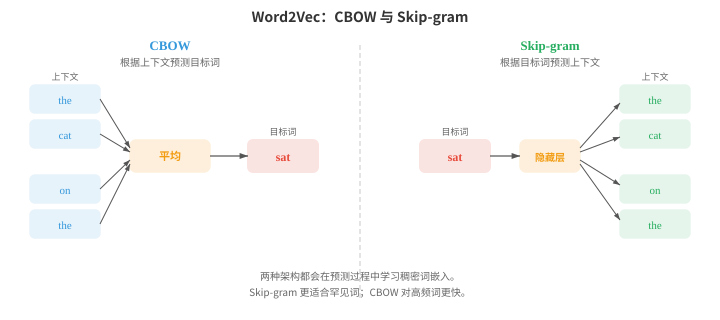
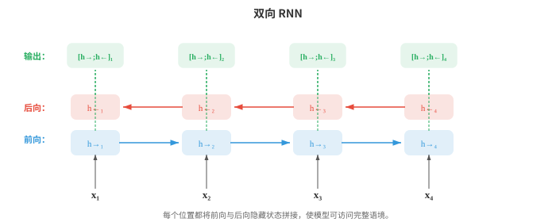
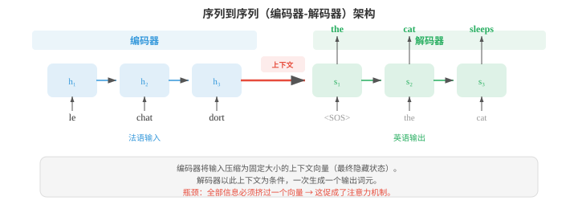
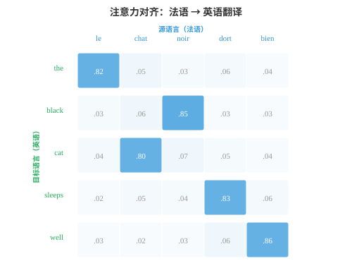
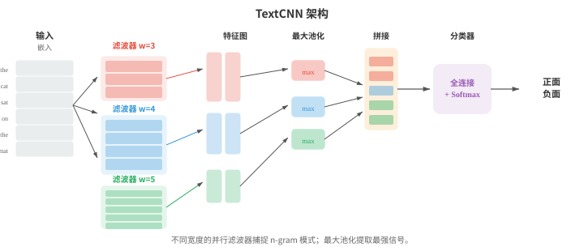

# 嵌入与序列模型

*词嵌入将稀疏的符号文本压缩为稠密向量空间，在其中语义相似性转化为几何上的接近。本节介绍 Word2Vec（CBOW、Skip-gram）、GloVe、FastText、RNN、LSTM、GRU、带注意力机制的 seq2seq 以及编码器-解码器范式，展示从词袋模型到上下文表示的发展过程。*

- 文件 01 中介绍了分布假说：出现在相似语境中的词通常具有相似意义。文件 02 中用 TF-IDF 向量等稀疏的手工特征表示文本。这些向量位于极高维空间中（词表里的每个词对应一个维度），且大多为零。**词嵌入（word embeddings）**将这些信息压缩为可直接从数据中学习、能够捕捉语义关系的稠密低维向量。

!!! note "大白话"
    词嵌入把每个词从又长又稀疏的计数表，换成短而密的坐标，让意思相近的词在空间里靠近。

- **Word2Vec**（Mikolov 等，2013）通过在简单预测任务上训练浅层神经网络来学习词嵌入。它有两种架构。

!!! note "大白话"
    Word2Vec 不先给词下定义，而是让模型反复做猜词练习，从猜对所需的线索中学出词的向量。

- **连续词袋模型（Continuous Bag of Words, CBOW）**根据周围上下文词预测目标词。给定一个上下文词窗口（例如 “the cat ___ on the”），模型对它们的嵌入向量求平均，再将结果传入线性层以预测缺失的词（“sat”）。训练目标最大化：

$$P(w_t \mid w_{t-k}, \ldots, w_{t-1}, w_{t+1}, \ldots, w_{t+k})$$

!!! note "大白话"
    CBOW 是看邻居猜中间词，多个邻居一起投票，因此训练快且适合常见词。

- **Skip-gram** 模型则反过来：给定目标词，预测周围的上下文词。对于目标词 “sat”，模型分别尝试预测 “the”、“cat”、“on”、“the”。其目标最大化：

$$P(w_{t+j} \mid w_t) \quad \text{for each } j \in [-k, k], \; j \neq 0$$



!!! note "大白话"
    Skip-gram 是拿中心词分别猜邻居，训练样本更多，因此稀有词也有更多被训练的机会。

- Skip-gram 往往更适合罕见词，因为每个词会生成多个训练样本（上下文中的每个位置各一个）。CBOW 更快，对高频词略好，因为它平均了多个上下文信号。

!!! note "大白话"
    两者没有谁永远更好：数据少或在意罕见词常选 Skip-gram，追求速度常选 CBOW。

- 在完整词表上训练代价很高，因为 softmax 的分母需要对全部 $V$ 个词求和。**负采样（negative sampling）**将问题转化为二元分类以近似这一过程：区分真实上下文词（正样本）与随机采样的噪声词（负样本）。模型不计算完整 softmax，而只更新目标词、真实上下文词和少量负样本的嵌入：

$$\mathcal{L} = \log \sigma(v_{w_O}^T v_{w_I}) + \sum_{i=1}^{k} \mathbb{E}_{w_i \sim P_n} [\log \sigma(-v_{w_i}^T v_{w_I})]$$

!!! note "大白话"
    负采样不让模型每次和全词表比赛，只让正确搭配赢过少数随机错误搭配，训练成本会低很多。

- 其中，$v_{w_I}$ 是输入词嵌入，$v_{w_O}$ 是输出（上下文）词嵌入，$P_n$ 是噪声分布，通常是单词频率的 3/4 次幂（这会下调 “the” 一类超高频词的权重）。

!!! note "大白话"
    频率的 3/4 次幂会保留常见词作负样本的机会，却不让 “the” 之类词霸占训练。

- 为什么如此简单的目标能够产生有意义的嵌入？Levy 和 Goldberg（2014）表明，带负采样的 Skip-gram 隐式地在分解一个**平移点互信息（pointwise mutual information, PMI）**矩阵。收敛时，两个词向量的点积近似为：

$$v_w^T v_c \approx \text{PMI}(w, c) - \log k$$

!!! note "大白话"
    这说明 Word2Vec 学到的不是神秘规则，而是在压缩“哪些词比随机情况更常同框出现”的统计表。

- 其中 $\text{PMI}(w, c) = \log \frac{P(w, c)}{P(w) P(c)}$ 衡量词 $w$ 与 $c$ 共同出现的概率比随机情况下的期望高多少（第 05 章信息论），$k$ 是负样本数。比随机预期更常共同出现的词具有高 PMI，因而点积高（嵌入相似）；比预期更少共同出现的词有负 PMI，嵌入也不相似。这揭示 Word2Vec 与潜在语义分析等经典分布式语义方法（对共现矩阵作 SVD）做的是同一件事，只是采用了更可扩展的在线方式。

!!! note "大白话"
    PMI 比较“实际一起出现”与“各自频率推测的偶遇次数”；明显更常同框的词会被拉近。

- Word2Vec 嵌入最令人意外的性质，是它们能用向量算术表达**类比（analogies）**。向量 $v_{\text{king}} - v_{\text{man}} + v_{\text{woman}}$ 最接近 $v_{\text{queen}}$。这是因为嵌入空间将语义关系编码为近似线性的方向：“王室”方向大致为 $v_{\text{king}} - v_{\text{man}}$，将其加到 $v_{\text{woman}}$ 上便会落在 $v_{\text{queen}}$ 附近。这与第 01 章的线性代数相连：语义关系是向量平移。

!!! note "大白话"
    有些关系会变成空间中相似的“移动方向”，所以可以用加减法做类比题；这是统计规律，不是每个例子都成立。

- **GloVe**（Global Vectors for Word Representation，Pennington 等，2014）采用不同方法。它不逐个从局部上下文窗口学习，而是构造全局词共现矩阵 $X$；其中 $X_{ij}$ 统计整个语料中词 $j$ 在词 $i$ 语境中出现的次数。模型随后学习嵌入，使其点积近似于共现次数的对数：

$$w_i^T \tilde{w}_j + b_i + \tilde{b}_j = \log X_{ij}$$

!!! note "大白话"
    GloVe 先汇总整套语料的共现表，再把这张大表压进向量；它看的是全局统计，不是逐个样本更新。

- 损失函数用截断函数 $f(X_{ij})$ 对每个词对加权，避免非常频繁的共现占据主导：

$$\mathcal{L} = \sum_{i,j=1}^{V} f(X_{ij}) \left(w_i^T \tilde{w}_j + b_i + \tilde{b}_j - \log X_{ij}\right)^2$$

!!! note "大白话"
    加权让极常见词对不会淹没其他信息，模型会更均衡地学习各种共现关系。

- GloVe 结合了全局矩阵分解（如潜在语义分析）与 Word2Vec 局部上下文学习的优点。实际中，GloVe 和 Word2Vec 产生的嵌入质量相近。

!!! note "大白话"
    两种路线的训练方式不同，但都在利用共现统计，所以实际向量效果往往接近。

- **FastText**（Bojanowski 等，2017）扩展了 Skip-gram，把每个词表示为字符 n-gram 的词袋。词 “where” 在 $n = 3$ 时变为：“<wh”、“whe”、“her”、“ere”、“re>”，再加上整个词词元 “<where>”。该词的嵌入是所有这些 n-gram 嵌入的总和。

!!! note "大白话"
    FastText 不把词当作不可拆的整体，而是把内部字符片段加起来形成词向量。

- 这有一个关键优势：FastText 能为训练中从未见过的词生成嵌入。词 “whereabouts” 与 “where” 共享 n-gram，因此即使 “whereabouts” 从未出现在训练数据中，它的嵌入也会合理。这对形态丰富的语言（文件 01）特别有用，因为这类语言有许多屈折形式。

!!! note "大白话"
    新词也能用已学过的字符片段拼出大致表示，所以它对复合词和词形变化多的语言更友好。

- **嵌入评估（embedding evaluation）**通常使用两类基准。**类比任务（analogy tasks）**测试 $v_a - v_b + v_c \approx v_d$ 是否成立（例如，“Paris” $-$ “France” $+$ “Italy” $\approx$ “Rome”）。**相似度基准（similarity benchmarks）**把词对间的余弦相似度（第 01 章）与人工判断进行比较。常见数据集包括 WordSim-353、SimLex-999 和 Google 类比测试集。实践中需要注意：在类比上表现优异的嵌入，未必最适合情感分类等下游任务。最好的评估通常就是任务本身。

!!! note "大白话"
    漂亮的类比题分数不等于业务效果好，真正该问的是它放进目标任务后有没有提升。

- 第 06 章介绍过 RNN、LSTM 和 GRU 这些用于序列数据的架构。这里重点学习它们如何具体用于语言任务。

!!! note "大白话"
    词向量给每个词一个坐标，RNN 类模型再负责按顺序读取这些坐标，保留上下文。

- **语言模型 RNN（language model RNN）**每次读取一个词元，并在每一步预测下一个词元。隐藏状态 $h_t$ 将整个历史 $w_1, \ldots, w_t$ 压缩为固定大小的向量；线性层加 softmax 将 $h_t$ 映射为词表上的分布。训练时用真实的下一个词元计算交叉熵损失，这与最小化困惑度（文件 02）相同。关键局限是：固定大小的隐藏状态必须编码历史中的一切，早期词元的信息会逐步被覆盖。

!!! note "大白话"
    RNN 每读一个词就更新一份“记忆摘要”来猜下一个词；摘要容量固定，句子一长，早先信息就容易被挤掉。

- **双向 RNN（bidirectional RNNs）**从两个方向处理序列：一个 RNN 从左到右读取，另一个从右到左读取。在每个位置 $t$，前向隐藏状态 $\overrightarrow{h}_t$ 与后向隐藏状态 $\overleftarrow{h}_t$ 拼接，形成感知语境的表示 $h_t = [\overrightarrow{h}_t ; \overleftarrow{h}_t]$。这使模型同时利用过去和未来语境，对词性标注、NER（文件 02）等词标签取决于前后词的任务非常有力。双向 RNN 不能用于语言建模，因为预测时不能偷看未来词元。



!!! note "大白话"
    双向 RNN 会从左右两边一起看当前词，适合“整句已经给出”的标注任务，却不能用于一步步生成文字。

- **深层堆叠 RNN（deep stacked RNNs）**将多层 RNN 叠放起来。第 $l$ 层在所有时间步的隐藏状态会成为第 $l + 1$ 层的输入序列。堆叠 2-4 层通常能通过构建层级表示提升性能，类似更深的 CNN 构建特征层级的方式（第 06 章）。超过 4 层后，除非在层间加入残差连接，否则梯度消失和过拟合会成为问题。

!!! note "大白话"
    多层 RNN 让下层先提取局部模式、上层再组合，但层数太多会让训练信号传不动，反而难学。

- **序列到序列（sequence-to-sequence, seq2seq）**架构（Sutskever 等，2014）将变长输入序列映射为变长输出序列。它包含一个读取输入并将其压缩为上下文向量（最终隐藏状态）的**编码器（encoder）** RNN，以及一个以此上下文向量为条件、一次生成一个词元的**解码器（decoder）** RNN。



!!! note "大白话"
    编码器负责读懂输入并写出摘要，解码器拿着摘要逐词写输出，所以输入和输出长度可以不同。

- Seq2seq 是机器翻译的突破性架构。编码器读取法语句子，解码器生成英语译文。解码器从特殊的序列起始词元开始，自回归地生成词元，直到产生序列结束词元。一个实用技巧是反转输入序列（输入 “chat le” 而不是 “le chat”），这样会让第一个输入词在计算图中更接近第一个输出词，从而缩短梯度路径并改善结果。

!!! note "大白话"
    翻译时它像先通读原句、再从头写译文；早期模型甚至会倒着读输入，只为让训练时的关联路径更短。

- 瓶颈问题在于：整个输入必须被压缩进单个固定大小的向量。对于长句，这个向量无法捕捉全部信息，性能会退化。这促成了**注意力机制（attention mechanisms）**。

!!! note "大白话"
    把长句塞进一个固定摘要会丢细节，注意力机制让解码器需要时可以回头查原句，不必只靠记忆。

- 第 06 章介绍了现代注意力机制的 Q、K、V 表述。自然语言处理中的原始注意力机制采用不同表述，它是编码器状态与解码器状态之间的对齐模型。

!!! note "大白话"
    早期注意力的直觉就是：当前要写一个词时，先问输入里的哪些位置最相关，再重点参考它们。

- **Bahdanau 注意力（Bahdanau attention）**（加性注意力，Bahdanau 等，2015）使用一个学习得到的前馈网络，计算解码器隐藏状态 $s_t$ 与每个编码器隐藏状态 $h_i$ 之间的对齐分数：

$$e_{ti} = v^T \tanh(W_s s_{t-1} + W_h h_i)$$

!!! note "大白话"
    Bahdanau 注意力逐个比较“我现在要生成什么”和“输入这一位置提供什么”，得到相关性分数。

- 这些分数通过 softmax 归一化为注意力权重；上下文向量是编码器状态的加权和：

$$\alpha_{ti} = \frac{\exp(e_{ti})}{\sum_j \exp(e_{tj})}, \quad c_t = \sum_i \alpha_{ti} h_i$$

!!! note "大白话"
    softmax 把相关性变成一组总和为 1 的注意力比例，再按比例混合输入各位置的信息。

- 解码器接着同时使用 $s_{t-1}$ 和 $c_t$ 产生下一个输出。核心洞见是：不再为整句使用一个固定上下文向量，而是让解码的每一步获得不同的编码器状态加权组合，使模型可以“回看”输入中的相关部分。

!!! note "大白话"
    生成每个新词时，模型都能重新选择该看输入的哪里，这解决了单一摘要记不住长句的问题。

- **Luong 注意力（Luong attention）**（乘性注意力，Luong 等，2015）简化了分数计算。**点积（dot）**变体使用 $e_{ti} = s_t^T h_i$。**一般（general）**变体使用 $e_{ti} = s_t^T W h_i$。这些方法比 Bahdanau 的加性分数更快，因为它们使用矩阵乘法而非前馈网络。Luong 注意力还从当前解码器状态 $s_t$（而非 $s_{t-1}$）计算上下文向量，这使其可以访问更多信息，但计算方式略有不同。



!!! note "大白话"
    Luong 注意力用更简单的向量乘法算相关性，通常更快；图中的亮格就是当前输出词重点查看的输入词。

- 注意力权重常以热图形式可视化，展示解码器在生成每个输出词元时关注哪些输入词元。翻译中，这些热图大致描绘源语言和目标语言之间的词对齐；重新排序会打破对角线模式（例如，法语和英语的形容词-名词顺序不同）。

!!! note "大白话"
    热图能帮助人检查模型大致在对齐什么，但高权重不等于完整解释，只是模型计算时更关注那里。

- 推理时，解码器必须在每一步选择一个词元。**贪心解码（greedy decoding）**在每个位置选取概率最高的词元，但这可能导致次优序列：局部看似好的选择可能迫使模型生成全局很差的句子。**束搜索（beam search）**在每步保留前 $k$ 条（束宽 beam width）部分序列，将每条序列用所有可能的下一个词元扩展，并总体保留最好的 $k$ 条。

!!! note "大白话"
    贪心每步只走眼前最好的路；束搜索同时保留几条候选路，降低一步走错后无法回头的风险。

- 当束宽 $k = 1$ 时，束搜索退化为贪心解码。典型值是 $k = 4$ 到 $k = 10$。更大的束能找到更好的序列，但速度会按比例变慢。束搜索还需要**长度归一化（length normalisation）**，避免偏爱较短序列，因为较短序列相乘的项更少，天然拥有更高的总概率。归一化分数为：

$$\text{score}(y) = \frac{1}{|y|^\alpha} \sum_{t=1}^{|y|} \log P(y_t \mid y_{<t})$$

!!! note "大白话"
    束越宽，候选越多、质量通常越好，但每步都要算更多分支。长度归一化是防止模型因为短句少乘几次概率就过早收尾。

- 其中 $|y|$ 是序列长度，$\alpha$（通常为 0.6-0.7）控制长度惩罚的强度。当 $\alpha = 0$ 时，没有长度归一化；当 $\alpha = 1$ 时，分数是每个词元的对数概率（几何均值）。中间取值能平衡偏好简洁输出与避免过早截断。

!!! note "大白话"
    $\alpha$ 决定对句长校正多少：太少会偏短，太多又可能鼓励无意义地拉长。

- RNN 按顺序处理文本，**一维 CNN（1D CNNs）**则通过沿词元序列滑动滤波器并行处理文本。每个滤波器检测一种局部模式（一个 n-gram 特征）。

!!! note "大白话"
    CNN 像一排小窗口同时扫过句子，擅长发现附近几个词形成的固定模式，速度比逐词 RNN 快。

- **TextCNN**（Kim，2014）对输入嵌入矩阵使用多个不同宽度（例如 3、4、5 个词元）的一维卷积滤波器。每个滤波器产生一个特征图，**全局最大池化（max-over-time pooling）**从每个特征图取单个最大值，捕捉该模式是否在文本的任何位置被检测到，而不考虑位置。所有滤波器的池化特征随后拼接并传入分类器。



!!! note "大白话"
    TextCNN 用不同宽度找不同长度的短语模式，再只保留每种模式最强的一次出现，用于快速分类。

- TextCNN 速度快，在情感分析等文本分类任务上效果出色。它能捕捉局部 n-gram 模式，却无法建模长距离依赖：宽度为 5 的滤波器只能看到连续的 5 个词元。**扩张因果卷积（dilated causal convolutions）**通过在滤波器元素间插入间隔（扩张）来解决此问题。堆叠扩张率指数增长（1、2、4、8、...）的层，可在不增加参数的情况下使感受野指数增长，让模型捕捉跨数百个词元的依赖关系。

!!! note "大白话"
    普通卷积看得近；扩张卷积通过隔着位置取样，让同样大小的滤波器一次看得更远。

- 到目前为止讨论的所有嵌入（Word2Vec、GloVe、FastText）都为每种词类型产生一个固定向量，与语境无关。“Bank” 无论表示金融机构还是河岸，都会得到同一个嵌入。这是**上下文嵌入（contextual embeddings）**要解决的根本局限。

!!! note "大白话"
    静态词向量给 bank 永远同一坐标，分不清“银行”还是“河岸”；上下文嵌入让坐标随句子改变。

- **ELMo**（Embeddings from Language Models，Peters 等，2018）通过在输入文本上运行深层双向 LSTM 语言模型来产生上下文词表示。前向 LSTM 在每个位置预测下一个词；独立的后向 LSTM 预测前一个词。两者都在大型语料上作为语言模型训练。

!!! note "大白话"
    ELMo 从左右两边读同一句话，因此同一个词在不同句子中会得到不同、更贴合语境的表示。

- 在每个位置 $k$，ELMo 使用特定任务学习到的权重，组合所有 $L$ 层的隐藏状态：

$$\text{ELMo}_k = \gamma \sum_{j=0}^{L} s_j \, h_{k,j}$$

!!! note "大白话"
    ELMo 不只拿最后一层，而是让下游任务自己决定更该用低层语法线索还是高层语义线索。

- 其中 $h_{k,j}$ 是位置 $k$、第 $j$ 层的隐藏状态（第 0 层为原始词元嵌入），$s_j$ 是经 softmax 归一化的标量权重，$\gamma$ 是特定任务的缩放因子。不同层捕捉不同信息：低层捕捉句法（词性标签、词形），高层捕捉语义（词义、语义角色）。通过用学习到的权重混合所有层，ELMo 嵌入能适应不同的下游任务。

!!! note "大白话"
    低层更像看拼写和语法，高层更像看意思；把各层按任务需求加权，比只用一层更灵活。

- ELMo 标志着**先预训练、后微调（pre-train then fine-tune）**范式的开始：先在海量无标注文本上训练大型语言模型，再将其表示用于下游任务。ELMo 具体做法是将预训练表示作为固定或轻度调优的特征，与任务特定输入拼接。BERT 和 GPT（文件 04）通过端到端微调整个模型，将这一范式推进得更远，效果显著更好。

!!! note "大白话"
    先在海量文字上学通用语言能力，再针对小任务适配，能避免每个任务都从零学语言。

- 从 Word2Vec 到 ELMo 的发展体现了自然语言处理中的一个反复出现的主题：从静态表示走向动态表示，从局部语境走向全局语境，从浅层模型走向深层模型。每一步都以更多计算成本换取更丰富的表示。Transformer（文件 04）以注意力完全取代循环，完成了这一演进，同时实现深度上下文化与并行计算。

!!! note "大白话"
    这条演进路线一直在用更多计算换更完整的上下文理解，Transformer 把这一思路推到了可并行训练的规模。

## 编程任务（使用 CoLab 或 notebook）

1. 从头实现带负采样的 Word2Vec Skip-gram。在小语料上训练，并使用 PCA 将学到的嵌入可视化。
```python
import jax
import jax.numpy as jnp
import matplotlib.pyplot as plt

# Small corpus
corpus = """the king ruled the kingdom . the queen ruled the kingdom .
the prince is the son of the king . the princess is the daughter of the queen .
a man worked in the castle . a woman worked in the castle .
the king and queen lived in the castle . the prince and princess played outside .""".lower().split()

vocab = sorted(set(corpus))
word2idx = {w: i for i, w in enumerate(vocab)}
idx2word = {i: w for w, i in word2idx.items()}
V = len(vocab)

# Generate skip-gram pairs with window size 2
window = 2
pairs = []
for i, word in enumerate(corpus):
    for j in range(max(0, i - window), min(len(corpus), i + window + 1)):
        if i != j:
            pairs.append((word2idx[word], word2idx[corpus[j]]))

pairs = jnp.array(pairs)
print(f"Vocabulary: {V} words, Training pairs: {len(pairs)}")

# Model parameters
embed_dim = 16
key = jax.random.PRNGKey(42)
k1, k2 = jax.random.split(key)
W_in = jax.random.normal(k1, (V, embed_dim)) * 0.1    # input embeddings
W_out = jax.random.normal(k2, (V, embed_dim)) * 0.1   # output embeddings

# Negative sampling loss for one pair
def neg_sampling_loss(W_in, W_out, target, context, neg_ids):
    v_in = W_in[target]      # (embed_dim,)
    v_out = W_out[context]   # (embed_dim,)
    v_neg = W_out[neg_ids]   # (k, embed_dim)

    pos_loss = -jax.nn.log_sigmoid(jnp.dot(v_in, v_out))
    neg_loss = -jnp.sum(jax.nn.log_sigmoid(-v_neg @ v_in))
    return pos_loss + neg_loss

# Training loop
num_neg = 5
lr = 0.05

@jax.jit
def train_step(W_in, W_out, target, context, neg_ids):
    loss, (g_in, g_out) = jax.value_and_grad(neg_sampling_loss, argnums=(0, 1))(
        W_in, W_out, target, context, neg_ids)
    return loss, W_in - lr * g_in, W_out - lr * g_out

key = jax.random.PRNGKey(0)
for epoch in range(50):
    total_loss = 0.0
    for i in range(len(pairs)):
        key, subkey = jax.random.split(key)
        neg_ids = jax.random.randint(subkey, (num_neg,), 0, V)
        loss, W_in, W_out = train_step(W_in, W_out, pairs[i, 0], pairs[i, 1], neg_ids)
        total_loss += loss
    if (epoch + 1) % 10 == 0:
        print(f"Epoch {epoch+1}: avg loss = {total_loss / len(pairs):.4f}")

# Visualise with PCA (chapter 01)
embeddings = W_in
mean = embeddings.mean(axis=0)
centered = embeddings - mean
U, S, Vt = jnp.linalg.svd(centered, full_matrices=False)
coords = centered @ Vt[:2].T  # project onto top 2 PCs

plt.figure(figsize=(10, 8))
for i, word in idx2word.items():
    plt.scatter(coords[i, 0], coords[i, 1], c='#3498db', s=40)
    plt.annotate(word, (coords[i, 0] + 0.02, coords[i, 1] + 0.02), fontsize=9)
plt.title("Word2Vec Skip-gram Embeddings (PCA projection)")
plt.grid(alpha=0.3); plt.show()
```

2. 构建一个字符级 RNN 语言模型，让它从一个小型训练字符串中学习生成文本。
```python
import jax
import jax.numpy as jnp

# Tiny training text
text = "to be or not to be that is the question "
chars = sorted(set(text))
char2idx = {c: i for i, c in enumerate(chars)}
idx2char = {i: c for c, i in char2idx.items()}
V = len(chars)
data = jnp.array([char2idx[c] for c in text])

# RNN parameters
hidden_dim = 64
key = jax.random.PRNGKey(0)
k1, k2, k3, k4, k5 = jax.random.split(key, 5)

params = {
    'Wx': jax.random.normal(k1, (V, hidden_dim)) * 0.1,
    'Wh': jax.random.normal(k2, (hidden_dim, hidden_dim)) * 0.05,
    'bh': jnp.zeros(hidden_dim),
    'Wy': jax.random.normal(k3, (hidden_dim, V)) * 0.1,
    'by': jnp.zeros(V),
}

def rnn_step(params, h, x_idx):
    x = jnp.eye(V)[x_idx]  # one-hot
    h = jnp.tanh(x @ params['Wx'] + h @ params['Wh'] + params['bh'])
    logits = h @ params['Wy'] + params['by']
    return h, logits

def loss_fn(params, inputs, targets):
    h = jnp.zeros(hidden_dim)
    total_loss = 0.0
    for t in range(len(inputs)):
        h, logits = rnn_step(params, h, inputs[t])
        log_probs = jax.nn.log_softmax(logits)
        total_loss -= log_probs[targets[t]]
    return total_loss / len(inputs)

grad_fn = jax.jit(jax.grad(loss_fn))

# Training
inputs = data[:-1]
targets = data[1:]
lr = 0.01

for step in range(500):
    grads = grad_fn(params, inputs, targets)
    params = {k: params[k] - lr * grads[k] for k in params}
    if (step + 1) % 100 == 0:
        l = loss_fn(params, inputs, targets)
        print(f"Step {step+1}: loss = {l:.4f}")

# Generate text
def generate(params, seed_char, length=60):
    h = jnp.zeros(hidden_dim)
    idx = char2idx[seed_char]
    result = [seed_char]
    key = jax.random.PRNGKey(42)
    for _ in range(length):
        h, logits = rnn_step(params, h, idx)
        key, subkey = jax.random.split(key)
        idx = jax.random.categorical(subkey, logits)
        result.append(idx2char[int(idx)])
    return ''.join(result)

print(f"\nGenerated: {generate(params, 't')}")
```

3. 为序列反转实现一个带 Bahdanau 注意力的玩具 seq2seq 模型。将注意力对齐矩阵可视化。
```python
import jax
import jax.numpy as jnp
import matplotlib.pyplot as plt

# Task: reverse a sequence of digits (e.g., [3, 1, 4] -> [4, 1, 3])
vocab_size = 10  # digits 0-9
SOS, EOS = 10, 11  # special tokens
total_vocab = 12
embed_dim, hidden_dim = 16, 32
max_len = 5

key = jax.random.PRNGKey(42)
keys = jax.random.split(key, 8)

params = {
    'embed': jax.random.normal(keys[0], (total_vocab, embed_dim)) * 0.1,
    'enc_Wx': jax.random.normal(keys[1], (embed_dim, hidden_dim)) * 0.1,
    'enc_Wh': jax.random.normal(keys[2], (hidden_dim, hidden_dim)) * 0.05,
    'dec_Wx': jax.random.normal(keys[3], (embed_dim, hidden_dim)) * 0.1,
    'dec_Wh': jax.random.normal(keys[4], (hidden_dim, hidden_dim)) * 0.05,
    # Bahdanau attention
    'Ws': jax.random.normal(keys[5], (hidden_dim, hidden_dim)) * 0.1,
    'Wh_att': jax.random.normal(keys[6], (hidden_dim, hidden_dim)) * 0.1,
    'v_att': jax.random.normal(keys[7], (hidden_dim,)) * 0.1,
    # Output projection (from hidden + context to vocab)
    'Wo': jax.random.normal(keys[0], (hidden_dim * 2, total_vocab)) * 0.1,
}

def encode(params, seq):
    """Encode input sequence, return all hidden states."""
    h = jnp.zeros(hidden_dim)
    states = []
    for t in range(len(seq)):
        x = params['embed'][seq[t]]
        h = jnp.tanh(x @ params['enc_Wx'] + h @ params['enc_Wh'])
        states.append(h)
    return jnp.stack(states), h

def bahdanau_attention(params, dec_state, enc_states):
    """Compute Bahdanau attention weights and context vector."""
    scores = jnp.tanh(enc_states @ params['Wh_att'] + dec_state @ params['Ws'])
    e = scores @ params['v_att']  # (src_len,)
    alpha = jax.nn.softmax(e)
    context = alpha @ enc_states
    return context, alpha

def decode_step(params, dec_h, prev_token, enc_states):
    x = params['embed'][prev_token]
    dec_h = jnp.tanh(x @ params['dec_Wx'] + dec_h @ params['dec_Wh'])
    context, alpha = bahdanau_attention(params, dec_h, enc_states)
    combined = jnp.concatenate([dec_h, context])
    logits = combined @ params['Wo']
    return dec_h, logits, alpha

def seq2seq_loss(params, src, tgt):
    enc_states, enc_final = encode(params, src)
    dec_h = enc_final
    loss = 0.0
    prev_token = SOS
    for t in range(len(tgt)):
        dec_h, logits, _ = decode_step(params, dec_h, prev_token, enc_states)
        log_probs = jax.nn.log_softmax(logits)
        loss -= log_probs[tgt[t]]
        prev_token = tgt[t]
    return loss / len(tgt)

# Generate training data: reverse sequences
key = jax.random.PRNGKey(0)
train_srcs, train_tgts = [], []
for _ in range(200):
    key, subkey = jax.random.split(key)
    length = jax.random.randint(subkey, (), 3, max_len + 1)
    key, subkey = jax.random.split(key)
    seq = jax.random.randint(subkey, (int(length),), 0, vocab_size)
    train_srcs.append(seq)
    train_tgts.append(seq[::-1])  # reverse

# Training
grad_fn = jax.grad(seq2seq_loss)
lr = 0.01

for epoch in range(100):
    total_loss = 0.0
    for src, tgt in zip(train_srcs, train_tgts):
        grads = grad_fn(params, src, tgt)
        params = {k: params[k] - lr * grads[k] for k in params}
        total_loss += seq2seq_loss(params, src, tgt)
    if (epoch + 1) % 20 == 0:
        print(f"Epoch {epoch+1}: avg loss = {total_loss / len(train_srcs):.4f}")

# Visualise attention for one example
test_src = jnp.array([3, 1, 4, 1, 5])
test_tgt = test_src[::-1]

enc_states, enc_final = encode(params, test_src)
dec_h = enc_final
attentions = []
prev_token = SOS
for t in range(len(test_tgt)):
    dec_h, logits, alpha = decode_step(params, dec_h, prev_token, enc_states)
    attentions.append(alpha)
    prev_token = test_tgt[t]

att_matrix = jnp.stack(attentions)
fig, ax = plt.subplots(figsize=(6, 5))
im = ax.imshow(att_matrix, cmap='Blues')
ax.set_xlabel("Source position"); ax.set_ylabel("Target position")
src_labels = [str(int(x)) for x in test_src]
tgt_labels = [str(int(x)) for x in test_tgt]
ax.set_xticks(range(len(src_labels))); ax.set_xticklabels(src_labels)
ax.set_yticks(range(len(tgt_labels))); ax.set_yticklabels(tgt_labels)
for i in range(len(tgt_labels)):
    for j in range(len(src_labels)):
        ax.text(j, i, f"{att_matrix[i,j]:.2f}", ha='center', va='center', fontsize=9)
ax.set_title("Bahdanau Attention Alignment (sequence reversal)")
plt.colorbar(im); plt.tight_layout(); plt.show()
```
