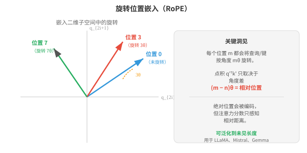
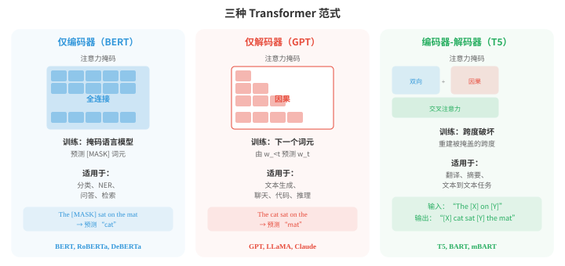
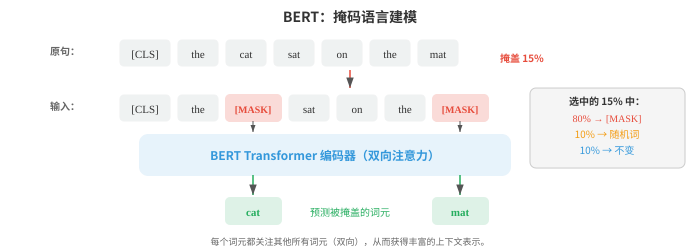
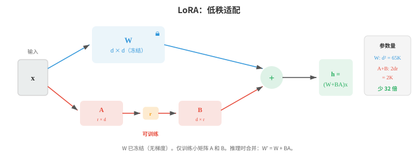
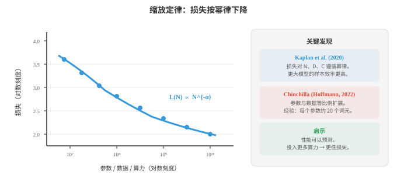
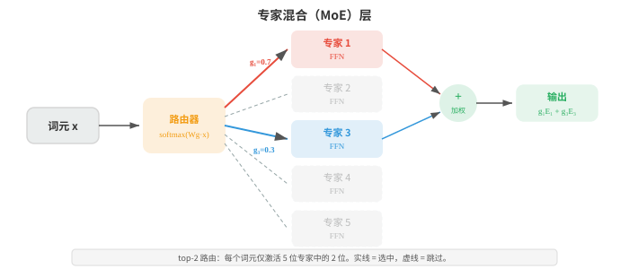

# Transformer 与语言模型

*Transformer 用自注意力取代循环，并成为语言理解与生成的主导架构。本节介绍 BERT、GPT、T5、位置编码（正弦编码、RoPE）、预训练目标（MLM、CLM）、微调、提示工程和缩放定律，它们共同构成现代大语言模型（Large Language Models, LLMs）的蓝图。*

- 第 06 章介绍过 Transformer 架构：自注意力、多头注意力、位置编码和编码器-解码器结构。本节聚焦 Transformer 如何适配具体的自然语言处理范式、定义现代自然语言处理的模型（BERT、GPT、T5），以及使它们能够大规模落地的技术。

!!! note "大白话"
    这里不再重复 Transformer 的零件，而是看同一套架构怎样训练成理解型、生成型或翻译型语言模型。

- 回顾其核心操作：**缩放点积注意力（scaled dot-product attention）**计算 $\text{softmax}(QK^T / \sqrt{d_k}) V$，其中查询、键和值都是输入的线性投影。**多头注意力（multi-head attention）**并行运行 $h$ 个注意力头，每个头使用不同的已学习投影，然后拼接结果。Transformer 块再以残差连接、层归一化和逐位置前馈网络对其进行封装（第 06 章）。

!!! note "大白话"
    注意力让每个词决定该参考哪些词，多头让它能同时看不同关系，其他层则让信息稳定地传下去。

- 一个细微却重要的架构选择是**层归一化（layer normalisation）**的位置。原始 Transformer 使用**后归一化（post-norm）**：残差连接与归一化位于子层之后，即 $\text{LayerNorm}(x + \text{Sublayer}(x))$。

!!! note "大白话"
    后归一化是先把旧信息和新信息相加，再统一调整数值尺度，这是原始论文的排法。

- 大多数现代模型使用**前归一化（pre-norm）**：在子层之前归一化，即 $x + \text{Sublayer}(\text{LayerNorm}(x))$。前归一化在训练时更稳定，因为残差连接让梯度能沿恒等路径直接通过，不受归一化影响。这使得训练极深模型更容易，无需非常谨慎地进行学习率预热。

!!! note "大白话"
    前归一化先把进入子层的数据调稳，旧信息还有一条直通路，所以深层网络训练时不容易失控。

- 每个 Transformer 块中的**前馈子层（feed-forward sublayer）**是一个对每个词元位置独立应用的两层 MLP：

$$\text{FFN}(x) = W_2 \cdot \text{GELU}(W_1 x + b_1) + b_2$$

!!! note "大白话"
    注意力负责交流不同词的信息，FFN 则让每个词自己做一次更强的非线性加工。

- 其内部维度通常是模型维度的 4 倍（例如 $d_{\text{model}} = 768$，$d_{\text{ff}} = 3072$）。这个 FFN 占每个块中大约三分之二的参数，通常被认为是一个键值存储器，用于保存训练中学到的事实知识。

!!! note "大白话"
    FFN 看起来简单，却装着多数参数；可粗略把它理解为模型存放大量模式和事实的地方。

- **位置编码（positional encoding）**为模型提供词元顺序信息，因为注意力本身是置换等变的。原始的**正弦编码（sinusoidal encoding）**（第 06 章）使用不同频率的固定正弦和余弦函数。**可学习位置嵌入（learned positional embeddings）**则为每个位置直接加入一个可训练向量（BERT 和 GPT-2 使用）。二者都是绝对编码：无论语境如何，位置 5 得到的都是相同向量。

!!! note "大白话"
    注意力只看内容不天然知道先后，因此必须额外告诉模型“这是第几个词”；绝对位置编码把每个位置当作固定座位号。

- **旋转位置嵌入（Rotary Position Embedding, RoPE）**通过在二维子空间中旋转查询和键向量来编码位置。对于一对维度 $(q_{2i}, q_{2i+1})$，按角度 $m\theta_i$ 旋转（其中 $m$ 是位置，$\theta_i = 10000^{-2i/d}$）可表示为：

```math
\begin{bmatrix} q'_{2i} \\ q'_{2i+1} \end{bmatrix} = \begin{bmatrix} \cos m\theta_i & -\sin m\theta_i \\ \sin m\theta_i & \cos m\theta_i \end{bmatrix} \begin{bmatrix} q_{2i} \\ q_{2i+1} \end{bmatrix}
```



!!! note "大白话"
    RoPE 不另加座位号，而是让向量随位置转不同角度；两个词相隔多远会自然反映在它们的注意力分数里。

- RoPE 的巧妙之处在于，旋转后的查询和键之间的点积 $q'^T k'$ 只取决于相对位置 $m - n$，而不取决于绝对位置。

!!! note "大白话"
    它关心的是“相差几步”，不是“分别坐第几号位”，这更符合语言中的邻近关系。

- 要理解这一点，可将旋转写作 $q' = R_m q$ 和 $k' = R_n k$，其中 $R_m$ 是块对角旋转矩阵。注意力分数变为：

$$q'^T k' = (R_m q)^T (R_n k) = q^T R_m^T R_n \, k = q^T R_{n-m} \, k$$

!!! note "大白话"
    把两个向量各自旋转后再比较，数学上会把它们的两个绝对角度抵消，只留下角度差。

- 最后一步来自旋转群的性质：$R_m^T R_n = R_{n-m}$（先反向旋转 $m$，再正向旋转 $n$，等价于旋转 $n - m$）。

!!! note "大白话"
    先转回一个位置的角度，再转到另一个位置，效果就是只转两者之间的那段距离。

- 这意味着注意力分数只取决于相对距离 $n - m$，不取决于绝对位置 $m$ 与 $n$ 本身。

!!! note "大白话"
    同样相隔两个词的关系会以相似方式处理，不会因为它们出现在句首还是句尾而完全不同。

- 模型因而无需任何可学习的位置参数便能获得自然的距离概念，也能泛化到训练时未见过的序列长度。

!!! note "大白话"
    位置规则是公式给出的，不靠记住有限座位号，所以面对更长文本时更有机会外推。

- **ALiBi**（Attention with Linear Biases）采取更简单的方法：依据距离向注意力分数加入固定线性惩罚，即 $\text{score}_{ij} = q_i^T k_j - m \cdot |i - j|$，其中 $m$ 是注意力头特定的斜率。不同头使用不同斜率，因此有些头可关注局部，有些头可关注全局。ALiBi 不需要可学习的位置参数，并能很好地泛化到比训练序列更长的序列。

!!! note "大白话"
    ALiBi 直接给远距离词扣分，不同注意力头扣分轻重不同，于是有的看近处、有的仍能看远处。

- 基于 Transformer 的语言模型有三种主流范式：**仅编码器（encoder-only）**、**仅解码器（decoder-only）**和**编码器-解码器（encoder-decoder）**。它们在模型可见内容（注意力掩码）和训练方式上不同。



!!! note "大白话"
    三类模型的根本区别是能否看未来词，以及是否把读输入和写输出分成两部分；任务不同，合适的结构也不同。

- **BERT**（Bidirectional Encoder Representations from Transformers，Devlin 等，2019）是仅编码器模型的典型代表。它以完整的双向注意力处理文本：每个词元都可以关注左侧和右侧的所有其他词元。这给 BERT 带来丰富的上下文表示，但也意味着它不能自回归地生成文本。

!!! note "大白话"
    BERT 适合把一整段已经给出的文字读透，因为每个词都能看前后文；但它不是按顺序续写的模型。

- BERT 使用两个目标进行预训练。**掩码语言建模（Masked language modelling, MLM）**随机掩盖输入中 15% 的词元并训练模型预测它们。被选中的词元中，80% 被替换为 [MASK] 词元，10% 替换为随机词，10% 保持不变（以防模型学会只在看到 [MASK] 时才预测）。训练目标为：

$$\mathcal{L}_{\text{MLM}} = -\sum_{i \in \mathcal{M}} \log P(w_i \mid w_{\backslash \mathcal{M}})$$

!!! note "大白话"
    MLM 像故意遮住句中少数词，让模型凭前后文填空，因此会被迫学习双向语境。

- 其中，$\mathcal{M}$ 是被掩盖位置的集合，$w_{\backslash \mathcal{M}}$ 是这些位置被掩盖后的句子。这是一个**去噪（denoising）**目标：模型学习重建受损输入。



!!! note "大白话"
    训练时故意损坏输入再复原，模型就会从完整上下文推断缺失信息，而不是死记相邻词。

- **下一句预测（Next Sentence Prediction, NSP）**训练 BERT 预测两个句子在原始文本中是否相邻。输入开头的特殊 [CLS] 词元用于该二元分类。NSP 的初衷是帮助需要理解句间关系的问答等任务，但后续工作（RoBERTa）表明它贡献很小，可以移除。

!!! note "大白话"
    NSP 原本想教模型理解两句是否连贯，但实验发现它带来的额外收益很小，后来常被省掉。

- 通过在 BERT 预训练表示上添加一个任务特定头部（简单线性层），并微调整个模型，可将其适配到下游任务。分类任务使用 [CLS] 词元表示；词元级任务（NER、词性标注）使用每个词元的表示。这种**微调（fine-tuning）**方法将预训练学到的语言知识迁移到新任务，只需相对少量的标注数据。

!!! note "大白话"
    BERT 先学通用读语言能力，做具体任务时再接一个很小的输出层并整体调整，不用从零开始。

- **GPT**（Generative Pre-trained Transformer，Radford 等，2018）是仅解码器模型的典型代表。它使用**因果（自回归）注意力（causal (autoregressive) attention）**：每个词元只能关注更早位置的词元（以及自己）。通过在注意力矩阵中掩盖未来位置实现这一点（在 softmax 前将其分数设为 $-\infty$）。训练目标很简单，即**因果语言建模（causal language modelling）**：根据前面所有词元预测下一个词元。

$$\mathcal{L}_{\text{CLM}} = -\sum_{i=1}^{n} \log P(w_i \mid w_1, \ldots, w_{i-1})$$

!!! note "大白话"
    GPT 永远只能看已经写出的部分再猜下一个词，因此训练方式和实际生成完全一致。

- 这与文件 02 中的 n-gram 语言模型目标相同，只是 Transformer 参数化可以以前面的全部语境为条件，而不只是最后 $k-1$ 个词元。

!!! note "大白话"
    本质仍是预测下一个词，但 Transformer 不必人为限定只看最近几个词，能利用更长历史。

- **GPT-2** 将这一方法扩展到 15 亿参数，并展示出强大的零样本性能：无需任何微调，它便可通过自然语言提示完成任务（“将英语翻译成法语：...”）。

!!! note "大白话"
    GPT-2 显示模型足够大后，直接把任务写在输入里，也能完成一些从未专门训练过的工作。

- **GPT-3**（1750 亿参数）表明，仅靠规模就能实现**上下文学习（in-context learning）**：在提示中提供几个输入-输出示例，模型无需任何梯度更新便能完成新任务。

!!! note "大白话"
    给 GPT-3 看几道示范题，它就能照着格式解新题，过程里并没有修改模型参数。

- **编码器-解码器模型**，如 **T5**（Text-to-Text Transfer Transformer，Raffel 等，2020），将每项自然语言处理任务都表述为文本到文本：输入是一个文本字符串（可带有任务前缀，如 “将英语翻译成德语：”），输出也是一个文本字符串。编码器以双向注意力处理输入，解码器通过对编码器的交叉注意力自回归地产生输出。

!!! note "大白话"
    T5 把翻译、摘要、分类都统一成“输入一句文字，输出一句文字”，读和写分别由两部分模型负责。

- T5 用**跨度破坏（span corruption）**预训练：随机连续跨度的词元被替换为哨兵词元，模型必须生成原始词元。例如，“The cat sat on the mat” 作为输入可能变为 “The [X] on [Y]”，目标则为 “[X] cat sat [Y] the mat”。这是将 BERT 的 MLM 从单个词元推广到跨度的做法。

!!! note "大白话"
    T5 不是只填一个空，而是补回一整段被挖掉的文字，因此更贴近生成连续文本的任务。

- **BART**（Lewis 等，2020）是另一个以去噪目标预训练的编码器-解码器模型，但它采用了更广泛的破坏策略：词元掩盖、词元删除、跨度掩盖、句子置换和文档旋转。多样化的破坏方式迫使模型学习更鲁棒的表示。

!!! note "大白话"
    BART 用多种方式把文本弄乱再要求复原，逼模型不仅记词，还要学句子和段落如何组织。

- 随着语言模型变大，**全量微调（full fine-tuning）**（更新全部参数）变得不切实际：仅存储一个 175B 参数模型的优化器状态就需要数百 GB。**参数高效微调（Parameter-efficient fine-tuning, PEFT）**方法只适配很小一部分参数。

!!! note "大白话"
    大模型若每个任务都复制并更新全部权重，显存和存储会爆炸；PEFT 的目标是只改很小一块。

- **适配器（adapters）**在现有 Transformer 层之间插入小型瓶颈层（通常是带非线性的两个线性层：先下投影至较小维度，再上投影回来）。只训练适配器权重，原始模型权重被冻结。它新增的参数不足 5%，却能在大多数任务上达到与全量微调相当的性能。

!!! note "大白话"
    适配器像给冻结的大模型加小插件，只训练插件，让同一底座能低成本适配多个任务。

- **LoRA**（Low-Rank Adaptation）在不增加新层的情况下直接修改权重矩阵。它不更新完整权重矩阵 $W$，而是学习更新量的低秩分解：$W' = W + BA$，其中 $B$ 为 $d \times r$，$A$ 为 $r \times d$，且 $r \ll d$（通常 $r = 4$ 到 $r = 64$）。原始 $W$ 被冻结，只训练 $A$ 和 $B$。推理时，更新量可合并进原始权重，不增加额外延迟：

$$W' = W + BA$$



!!! note "大白话"
    LoRA 假设真正需要的改动可以用两个小矩阵表示，只训练小矩阵，最后还能合回原权重而不拖慢推理。

- **前缀微调（prefix tuning）**在每个注意力层的键和值矩阵前添加一串可学习的“虚拟词元”。模型像关注真实词元一样关注这些前缀向量，只训练前缀参数。它与提示微调相似，但在激活空间而非嵌入空间中工作。

!!! note "大白话"
    前缀微调是在每层注意力前放一段可训练的隐形提示，让模型行为偏向目标任务而不动主体权重。

- **提示工程（prompt engineering）**是在不更新任何参数的前提下，设计输入文本以诱导预训练模型产生所需行为的技术。

!!! note "大白话"
    提示工程靠把任务、格式和约束写清楚来引导模型，不训练模型本身。

    - **零样本提示（zero-shot prompting）**用自然语言描述任务（“判断下列评论的情感倾向：”）。

        !!! note "大白话"
            只告诉模型要做什么，不给示例，就是零样本。

    - **少样本提示（few-shot prompting）**在实际查询之前提供输入-输出示例。

        !!! note "大白话"
            先给几组范例，让模型照着格式和规律完成新输入，就是少样本。

    - **思维链（Chain-of-thought, CoT）提示**加入 “让我们一步一步思考”，或在示例中包含推理轨迹；它通过引导模型分解问题，显著提升算术和逻辑推理任务的性能。

        !!! note "大白话"
            把中间推理步骤显式写出来，能让复杂题少跳步，但不等于每段展示的推理都天然可靠。

- **上下文学习（in-context learning, ICL）**指大型语言模型可从提示中的示例学习执行任务，无需任何梯度更新。模型权重并未改变；它把示例作为一种隐式规范来使用。

!!! note "大白话"
    ICL 是临时从当前对话里的例子学规则，关掉对话后模型并不会永久学会。

- ICL 在机制上如何工作仍是活跃研究问题；一种假说认为，注意力层会在前向传播中实现某种形式的梯度下降，从而有效地在上下文示例上“训练”。

!!! note "大白话"
    为什么只给几个例子就能学会任务尚无定论；“像在上下文里临时训练”只是解释之一。

- **缩放定律（scaling laws）**描述模型大小、数据大小、计算预算与性能（以损失衡量）之间可预测的关系。Kaplan 等（2020）发现，损失对每个变量都遵循幂律：

$$L(N) \propto N^{-\alpha_N}, \quad L(D) \propto D^{-\alpha_D}, \quad L(C) \propto C^{-\alpha_C}$$

!!! note "大白话"
    缩放定律说，只要其他条件匹配，更多参数、数据或算力通常会稳定降低损失，而不是完全靠运气。

- 其中 $N$ 是参数数量，$D$ 是数据集大小，$C$ 是计算预算。这些幂律跨越许多个数量级成立，表明单纯扩大规模就能带来可预测的改进。



!!! note "大白话"
    幂律不是说无限放大永远划算，而是说明在研究范围内，投入和改进之间有可估算的规律。

- **Chinchilla 缩放定律（Chinchilla scaling laws）**（Hoffmann 等，2022）修正了这一结论，表明多数大模型训练不足。对于固定计算预算 $C$，最优分配会让模型大小与训练数据以相同方式缩放：

$$N_{\text{opt}} \propto C^{0.5}, \quad D_{\text{opt}} \propto C^{0.5}$$

!!! note "大白话"
    Chinchilla 的关键是别把算力都砸在更大模型上，数据也必须跟着增加，否则模型吃不饱。

- 这意味着若将计算预算加倍，应当将模型大小和数据集大小都增加 $\sqrt{2}$ 倍，而不是只让模型变大。

!!! note "大白话"
    算力翻倍时，模型和数据各增加约 1.41 倍，比只扩参数更均衡。

- Kaplan 等曾建议让 $N$ 的增长快于 $D$，这导致模型极大却训练不足。Chinchilla（700 亿参数、1.4T 词元）在相同计算预算下达到了 Gopher（2800 亿参数、300B 词元）的性能，说明早期模型严重缺乏数据。

!!! note "大白话"
    较小模型读够多文字，能打平大得多却读得少的模型，说明“更大”不等于“更好”。

- 实用经验法则是：每个参数大约训练 20 个词元。

!!! note "大白话"
    这是按 Chinchilla 得出的粗略配比，用于训练规划，不是所有数据质量和架构下的硬规则。

- **专家混合（Mixture of Experts, MoE）**是一种能扩大模型容量、却不按比例扩大计算量的架构。MoE 不使用一个大型前馈层，而是使用多个**专家（expert）** FFN 层和一个选择每个词元应激活哪些专家的**门控网络（gating network）**（路由器）。

!!! note "大白话"
    MoE 像把一个大部门拆成许多专长小组，每个词只派给少数小组处理，因此总参数能很大。

- 门控函数为每位专家计算路由分数，并选择前 $k$ 个（通常 $k = 1$ 或 $k = 2$）：

$$G(x) = \text{TopK}(\text{softmax}(W_g x))$$

!!! note "大白话"
    路由器先给每个专家打分，再只选最合适的几个，决定当前词该交给谁处理。

- 只有被选中的专家处理该词元，因此计算成本随 $k$（活跃专家数）而不是专家总数 $E$ 增长。一个有 8 位专家、采用 top-2 路由的模型，参数是稠密模型的 4 倍，计算量却只有 2 倍。



!!! note "大白话"
    专家数量很多不代表每次都全开，真正执行的只有 top-k 个，所以容量提升大于计算量提升。

- MoE 的关键挑战是**负载均衡（load balancing）**：若路由器将多数词元送往少数热门专家，其他专家就被浪费了。训练中会增加一个辅助**负载均衡损失（load balancing loss）**，鼓励专家使用率均匀：

$$\mathcal{L}_{\text{balance}} = E \cdot \sum_{i=1}^{E} f_i \cdot p_i$$

!!! note "大白话"
    若所有请求都挤到少数专家，MoE 就退化了；辅助损失是在训练中逼路由器把工作分散。

- 其中 $f_i$ 是分配给专家 $i$ 的词元比例，$p_i$ 是专家 $i$ 的平均路由概率。当词元比例与概率都均匀时（均为 $1/E$），该乘积最小。

!!! note "大白话"
    这项损失会惩罚某个专家既经常被选、又拿到高路由概率的失衡情况。

- **专家并行（expert parallelism）**将不同专家分配到不同加速器上。前向传播期间，一个 all-to-all 通信步骤会将词元路由到承载其指定专家的设备，再将结果路由回来。这一通信开销是大规模 MoE 的主要工程挑战。Switch Transformer、Mixtral 和 GShard 等模型使用 MoE，以实际可承受的推理成本获得强大性能。

!!! note "大白话"
    专家分布在多张卡上后，词元要来回搬运；省下的计算可能被通信耗掉，这是 MoE 落地最难的部分。

- 构建模型只是工作的一半；衡量它们是否有效是另一半。自然语言处理的评估格外困难，因为语言具有歧义性、主观性和开放性。

!!! note "大白话"
    语言没有唯一标准答案，模型回答是否好不能只靠一个机械分数判断。

- 一个译文可以以许多不同方式正确。

!!! note "大白话"
    同一句话能有多种自然译法，和参考答案字面不同不代表翻错。

- 即使与参考答案没有任何完全相同的词，一段摘要仍可能是好的。

!!! note "大白话"
    摘要重要的是保留核心信息，不是照搬参考答案里的词。

- 聊天机器人的回答可以有帮助、无害且诚实，但合理的人仍可能对此产生分歧。

!!! note "大白话"
    对话质量牵涉价值判断，不同人对“有帮助”或“合适”的标准也会不同。

- **精确匹配（exact match, EM）**是最简单的指标：模型输出是否与标准答案完全一致？它用于短小、无歧义答案的任务，如抽取式问答（SQuAD）或封闭形式的数学题。

!!! note "大白话"
    EM 只问答案是不是一字不差，适合答案唯一的题，不适合开放写作。

- EM 很严格；除非进行规范化，“New York City” 和 “new york city” 无法匹配，但它的简单性使它没有歧义。

!!! note "大白话"
    这个指标很容易算，但连大小写差别也可能判错，使用前通常要先做规范化。

- **词元级指标（token-level metrics）**将自然语言处理视为词元级分类问题，使用第 06 章的精确率、召回率和 F1。

!!! note "大白话"
    对实体识别这类任务，可以把每个词是否贴对标签当成分类问题来统计。

- **精确率（precision）**衡量模型预测出的词元中有多少比例是正确的：$P = \text{TP} / (\text{TP} + \text{FP})$。预测实体极少、但全部正确的模型会有很高精确率。

!!! note "大白话"
    精确率高表示“说出口的多数没错”，但它可能因为少说而漏掉很多正确答案。

- **召回率（recall）**衡量标准词元中有多少比例被模型找出：$R = \text{TP} / (\text{TP} + \text{FN})$。把每个词元都预测为实体的模型有完美召回率，但精确率极差。

!!! note "大白话"
    召回率高表示“该找的多数都找到了”，但它可能靠乱报很多结果换来这个数字。

- **F1** 是精确率和召回率的调和平均：

$$F_1 = \frac{2PR}{P + R}$$

!!! note "大白话"
    F1 要求精确率和召回率同时过得去，一项很差时，另一项再高也救不了总分。

- 调和平均（而不是算术平均）会惩罚不平衡：若 $P$ 或 $R$ 任一较低，$F_1$ 也会较低。对于 NER（文件 02），F1 按实体类型计算，再在类型间作宏平均；对于词性标注，因为每个词元都有一个标签，词元级准确率更常用。

!!! note "大白话"
    任务不同要选对应指标：实体要看边界和类型是否都对，词性标注则更常直接看每个词的正确率。

- **跨度级 F1（span-level F1）**（SQuAD 使用）比较预测跨度中的词元集合与标准跨度中的词元集合。它比精确匹配宽容：若标准答案为 “the Eiffel Tower”，模型预测 “Eiffel Tower”，尽管 EM 为零，跨度 F1 仍较高（5 个词元中有 4 个重叠）。

!!! note "大白话"
    答案范围差一两个词不该全盘判零，跨度 F1 会按重叠程度给部分分。

- **BLEU**（Bilingual Evaluation Understudy，Papineni 等，2002）是机器翻译的经典指标。它衡量候选译文与一个或多个参考译文之间的 n-gram 重叠。该分数结合多个 n-gram 级别（unigram 到 4-gram）的精确率与简短惩罚：

$$\text{BLEU} = \text{BP} \cdot \exp\!\left(\sum_{n=1}^{N} w_n \log p_n\right)$$

!!! note "大白话"
    BLEU 主要看译文和参考中连续词组重不重合，并额外防止模型只报很短的安全答案。

- 其中 $p_n$ 是**修正 n-gram 精确率（modified n-gram precision）**：候选中每个 n-gram 的计数被截断为其在任一参考译文中的最大计数，防止 “the the the the” 这类退化候选得到高分。权重 $w_n$ 通常均匀设置（$w_n = 1/N$，$N = 4$）。

!!! note "大白话"
    修正计数不让模型靠反复重复同一个常见词刷高匹配数。

- **简短惩罚（brevity penalty）** $\text{BP} = \min(1, \exp(1 - r/c))$ 会惩罚比参考译文更短的候选（$c$ 是候选长度，$r$ 是参考长度）。没有它，模型只输出极少、极安全的词也能获得很高精确率。

!!! note "大白话"
    简短惩罚是防止模型为了少犯错，只交出几个最常见词。

- BLEU 在语料级别（对许多句子求平均）上与人工判断有合理相关性，但在句子级别上相关性较差。

!!! note "大白话"
    BLEU 更适合比较大量翻译的总体趋势，拿它评判单句经常不可靠。

- 它奖励完全相同的 n-gram 匹配，漏掉有效的释义：“the cat is on the mat” 与 “a feline sits atop the rug” 虽含义相同，却没有任何二元语法重叠。

!!! note "大白话"
    两句意思相同却用不同说法时，BLEU 可能给低分，因为它只认识字面重合。

- BLEU 也完全忽略召回率，一段只输出最常见词的候选在精确率上可能得分很高。

!!! note "大白话"
    BLEU 偏重“写出的词对不对”，没有充分惩罚遗漏重要内容。

- **ROUGE**（Recall-Oriented Understudy for Gisting Evaluation，Lin，2004）是摘要任务的标准指标。与强调精确率的 BLEU 不同，ROUGE 强调召回率：参考中的 n-gram 有多少比例出现在候选中？

!!! note "大白话"
    ROUGE 更在乎摘要有没有覆盖参考里的关键信息，而不是只保证写出的词正确。

- **ROUGE-N** 计算 n-gram 召回率：$\text{ROUGE-N} = \frac{|\text{n-grams}_{\text{ref}} \cap \text{n-grams}_{\text{cand}}|}{|\text{n-grams}_{\text{ref}}|}$。ROUGE-1（unigram）和 ROUGE-2（bigram）最常见。

!!! note "大白话"
    ROUGE-1 看单词覆盖，ROUGE-2 看相邻词对覆盖，后者对表达顺序要求更高。

- ROUGE-L 使用候选与参考之间的**最长公共子序列（longest common subsequence, LCS）**，它不要求连续匹配，却捕捉句子级词序。

!!! note "大白话"
    ROUGE-L 允许中间插进别的词，只看能按原顺序保留多长的共同骨架。

- 用参考长度归一化 LCS 长度可得召回率，用候选长度归一化可得精确率，F 度量则将二者结合。

!!! note "大白话"
    同一段重合内容，站在参考一边看是覆盖率，站在候选一边看是准确度，再用 F 值平衡两者。

- LCS 用动态规划以 $O(mn)$ 时间计算（与文件 02 的编辑距离类似）：

$$R_{\text{LCS}} = \frac{\text{LCS}(X, Y)}{m}, \quad P_{\text{LCS}} = \frac{\text{LCS}(X, Y)}{n}, \quad F_{\text{LCS}} = \frac{(1 + \beta^2) R_{\text{LCS}} P_{\text{LCS}}}{R_{\text{LCS}} + \beta^2 P_{\text{LCS}}}$$

!!! note "大白话"
    动态规划会比较两段文本的所有前缀组合，找出不必连续但顺序一致的最长词序列。

- 其中 $m$ 和 $n$ 是参考与候选的长度，$\beta$ 通常设置为偏向召回率（$\beta \to \infty$ 时就是纯召回率）。

!!! note "大白话"
    $\beta$ 用来表达任务更怕漏信息还是更怕夹杂无关信息。

- **METEOR**（Metric for Evaluation of Translation with Explicit ORdering，Banerjee 和 Lavie，2005）通过纳入同义词、词干和词序来解决 BLEU 的弱点。

!!! note "大白话"
    METEOR 比 BLEU 更能接受词形变化和同义改写，不会只盯着完全相同的字词。

- 它先利用精确匹配、词干匹配（通过文件 02 的 Porter 词干提取）和同义词匹配（通过文件 01 的 WordNet），在候选与参考间对齐词语。

!!! note "大白话"
    先把“同一个词、同一词根或同义词”对应起来，再判断这份对应关系好不好。

- 随后它计算偏向召回率的 unigram 精确率和召回率的调和平均，并施加碎片化惩罚，惩罚匹配词在候选中出现的顺序与参考不同的情况。

!!! note "大白话"
    它既看信息有没有覆盖，也会扣乱序的分，所以比单纯词重合更贴近翻译质量。

- **ChrF**（Character n-gram F-score）在字符 n-gram 而非词 n-gram 上计算 F 分数。因此它对形态变化更鲁棒（这对文件 01 中的黏着语至关重要），也能部分处理分词差异。ChrF++ 在字符 n-gram 上加入词二元语法。

!!! note "大白话"
    ChrF 直接比较字符片段，词尾变化多或分词规则不同的语言不会那么吃亏。

- 它已成为与 BLEU 并列推荐的机器翻译指标，尤其适用于形态丰富的语言。

!!! note "大白话"
    对一个词能变出很多形式的语言，字符级比较通常比整词匹配更公平。

- **困惑度（perplexity）**（文件 02）衡量语言模型预测留出的测试集有多好。它是语言模型标准的内在指标：$\text{PPL} = \exp(-\frac{1}{N} \sum_{i} \log P(w_i \mid w_{<i}))$。越低越好。

!!! note "大白话"
    困惑度衡量模型对真实下一个词有多意外，越低说明预测分布越贴近测试文本。

- 困惑度仅能在使用相同分词的模型之间比较，因为不同分词器会为同一文本产生不同序列长度 $N$。

!!! note "大白话"
    不同分词器把同一文章切成不同颗粒，分母都不同，困惑度数字不能直接比较。

- 词表更大的模型，每个词元的困惑度通常更低，但每个句子处理的词元更少。

!!! note "大白话"
    切得更粗会让每一步看似更容易，低困惑度未必代表模型对原始文本绝对更强。

- **每字节比特数（bits-per-byte, BPB）**按文本中 UTF-8 字节数而非词元数归一化，因此与分词无关：

```math
\text{BPB} = \frac{-\sum_{i} \log_2 P(w_i \mid w_{<i})}{\text{number of UTF-8 bytes}}
```

!!! note "大白话"
    BPB 用原始字节数做统一尺度，避免分词方式影响语言模型评价。

- **BERTScore**（Zhang 等，2020）通过在嵌入空间中计算相似度，超越表面 n-gram 匹配。候选中的每个词元都会根据上下文嵌入（通常来自预训练 BERT 模型）的余弦相似度，与参考中最相似的词元匹配。随后将分数聚合为精确率、召回率和 F1：

$$R_{\text{BERT}} = \frac{1}{|r|} \sum_{r_i \in r} \max_{c_j \in c} \cos(r_i, c_j), \quad P_{\text{BERT}} = \frac{1}{|c|} \sum_{c_j \in c} \max_{r_i \in r} \cos(c_j, r_i)$$

!!! note "大白话"
    BERTScore 不只看词是否一样，而是问它们在上下文中的意思像不像，因此能识别同义改写。

- 其中 $r_i$ 和 $c_j$ 是参考与候选词元的上下文嵌入。这捕捉到 n-gram 指标遗漏的语义相似性：“automobile” 和 “car” 即使没有共享字符，也会因 BERT 嵌入相似而得到高分。

!!! note "大白话"
    automobile 和 car 字面不重合，但语义向量接近，因而不会被错误地判成完全不同。

- **BLEURT**（Sellam 等，2020）更进一步，直接在人工质量判断上微调 BERT 模型。给定一个参考-候选对，它输出一个标量质量分数。BLEURT 先在合成数据上训练（随机扰动参考译文，使用 BLEU、METEOR 等指标打分），再用人工评分微调。它比任何表面级指标都更贴近人工判断。

!!! note "大白话"
    BLEURT 是让模型从人工打分中学习“好答案长什么样”，不再靠固定匹配公式。

- **COMET**（Crosslingual Optimized Metric for Evaluation of Translation，Rei 等，2020）是机器翻译的学习型指标，它以源句、参考译文和候选译文为条件，而不只看参考与候选。它使用多语言编码器（XLM-R）嵌入三者并预测质量分数。由于能看到源句，COMET 可识别仅参考指标会漏掉的语义错误（如流畅但事实错误的译文）。

!!! note "大白话"
    COMET 同时看原文、参考和译文，所以能发现“写得通顺但把原意译错”的情况。

- **LLM 作为评审（LLM-as-judge）**是现代大规模评估方法。它不依据参考答案计算指标，而是提示一个强大的语言模型（GPT-4、Claude）评估模型输出质量。评审器会接收输入、模型回答以及可选的参考答案，并产生评分（如 1-5）或成对偏好（回答 A 优于回答 B）。

!!! note "大白话"
    当规则指标看不懂开放回答时，可以请更强的模型充当评委，但评委本身也会有偏见。

- **成对比较（pairwise comparison）**（Chatbot Arena 使用）是最可靠的 LLM 评审格式。评审器看到两个回答并选出较好者，而非给出绝对分数。这避免了校准问题（不同评审对“5 分中的 3 分”可能有不同基线）。结果被聚合为**Elo 评级（Elo ratings）**（来自国际象棋）：每个模型从基础评级起步，再按对其他模型的胜负加减分。模型 $A$ 对模型 $B$ 的预期胜率为：

$$P(A \succ B) = \frac{1}{1 + 10^{(R_B - R_A) / 400}}$$

!!! note "大白话"
    让评委在两份回答中二选一，比让它独立给 1 到 5 分更稳定；Elo 再把大量胜负汇总成排名。

- 其中 $R_A, R_B$ 是 Elo 评级。每次比较后，评级更新为：$R_A' = R_A + K(S - P(A \succ B))$，其中 $S \in \{0, 1\}$ 是实际结果，$K$ 控制更新幅度。持续击败强对手的模型上升很快；输给弱对手的模型会下降。

!!! note "大白话"
    赢强者加分多，输弱者扣分多，因此 Elo 不只是简单统计胜场数。

- **位置偏差（position bias）**是 LLM 评审的已知问题：它们倾向偏好先呈现的回答（或某些模型中偏好第二个回答）。**交换（swapping）**（以两个顺序各评估一次每对回答）并取平均，可以缓解该问题。

!!! note "大白话"
    同一对答案要交换顺序再评一次，否则模型可能只是偏爱排在前面或后面的答案。

- **冗长偏差（verbosity bias）**是另一个问题：评审往往偏好更长、更详细的回答，即使简洁回答更好。

!!! note "大白话"
    写得长容易显得认真，却可能只是废话更多；评估标准必须明确奖励有效信息而非篇幅。

- **自一致性（self-consistency）**检查评审器在同一输入的多次评估中是否给出相同评分。高方差表明评估信号有噪声。

!!! note "大白话"
    同一道题反复评判还摇摆很大，说明这个评委给出的信号本身不稳定。

- **标注者间一致性（inter-annotator agreement）**（Cohen's kappa 或 Krippendorff's alpha）衡量多个评审是否一致，为评估可靠性提供上界。

!!! note "大白话"
    连人类评委都达不成一致时，任何模型分数都不可能被当成绝对真相。

- **污染（contamination）**是关键问题：若评估数据出现过模型训练集，基准分数会虚高并失去意义。

!!! note "大白话"
    考题若模型训练时已见过，测到的是记忆而不是泛化能力，分数就没有参考价值。

- 对于使用网络爬取数据训练的 LLM，这尤其棘手，因为热门基准很可能已经出现。缓解策略包括：使用未公开发布的留出测试集、创建会定期重新生成问题的动态基准、使用**金丝雀字符串（canary strings）**（嵌入基准数据的唯一标识符，用于检测泄漏），以及比较污染子集和干净子集的性能。

!!! note "大白话"
    公开题库很可能被网络训练数据收录，所以要用隐藏新题、动态题或特殊标记主动查泄漏。

- **标准自然语言理解（Natural Language Understanding, NLU）基准**会跨越多类任务评估语言理解。

!!! note "大白话"
    单一测试只能测一面，NLU 基准把多种理解任务放在一起考，减少偶然优势。

- **GLUE**（General Language Understanding Evaluation）和 **SuperGLUE** 是多任务基准，涵盖情感（SST-2）、文本相似度（STS-B）、自然语言推理（MNLI、RTE）、共指（WSC）和问答（BoolQ）。

!!! note "大白话"
    GLUE 系列把情感、推理、相似度等常见读语言能力打包，方便横向比较模型。

- 模型分别在每个任务上评估，并按聚合指标计分。GLUE 现已被认为饱和（模型在多数任务上超过人类表现）；SuperGLUE 仍更具挑战性。

!!! note "大白话"
    旧基准被模型刷得太高后就失去区分度，需要更难的新题集继续测试。

- **MMLU**（Massive Multitask Language Understanding）利用多项选择题，评估 57 门学科（数学、历史、法律、医学、计算机科学等）上的知识与推理。

!!! note "大白话"
    MMLU 像横跨很多学科的大型选择题考试，考查模型的知识广度和基本推理。

- 它测试模型是否在预训练中吸收了广泛知识。分数按学科报告，也报告宏平均。

!!! note "大白话"
    分科成绩能看出模型在哪些领域弱，宏平均则避免大题量学科把总分完全带偏。

- **MMLU-Pro** 加入更困难的多步推理题，答案选项由 4 个增至 10 个。

!!! note "大白话"
    选项更多、推理更长后，模型不能轻易靠排除法或表面记忆蒙对。

- **HellaSwag** 通过要求模型选择场景最合理的延续，测试常识推理。错误答案由模型对抗性生成，表面合理却在语义上错误。

!!! note "大白话"
    HellaSwag 专门做出看起来通顺的陷阱选项，逼模型真正判断场景常识。

- **WinoGrande** 使用只相差一个词的最小对，测试常识性共指消解。

!!! note "大白话"
    只改一个词就改变代词指向，可以排除模型只记模板，而测试它是否懂常识关系。

- **ARC**（AI2 Reasoning Challenge）采用小学科学题，包含简单集和挑战集，测试事实与推理能力。

!!! note "大白话"
    ARC 用基础科学题区分只会背知识和能把知识串起来推理的能力。

- **推理和数学基准**评估区分强、弱 LLM 的解题能力。

!!! note "大白话"
    这类题专门看模型能否把多步推理做对，而不只是生成听起来流畅的话。

- **GSM8K**（Grade School Math 8K）包含 8,500 道需要多步算术推理的小学数学文字题。它是基础数学推理和评估思维链提示（文件 04）的标准基准。

!!! note "大白话"
    GSM8K 看的是把日常数学题拆成多步算对的能力，题目难度不高但很容易在中间出错。

- **MATH** 是涵盖代数、数论、几何、计数与概率的更困难竞赛数学题数据集。题目需要多步符号推理，MATH-500 是常用的 500 题报告子集。

!!! note "大白话"
    MATH 比小学题更接近竞赛，需要真正操作公式和证明思路，不能只靠常识估算。

- **AIME**（American Invitational Mathematics Examination）题目属于竞赛水平：正确求解要求跨越许多步骤的深度数学推理。DeepSeek-R1 在 AIME 2024 上得分 79.8%，表明经 RL 训练的推理模型（文件 05）可接近强大的人类竞赛选手。

!!! note "大白话"
    AIME 是高难度竞赛题，能在其上得分高说明模型有较强计算推理能力，但不代表所有数学问题都可靠。

- **HumanEval** 与 **MBPP**（Mostly Basic Programming Problems）通过检查模型代码能否通过单元测试，评估代码生成。HumanEval 包含 164 道带函数签名和文档字符串的 Python 题，模型必须生成函数体。

!!! note "大白话"
    代码题不看解释写得多漂亮，只跑测试看程序是否真能满足题意。

- 指标为 **pass@k**：在生成的 $k$ 个解中，至少有一个通过全部测试的概率。对于一次采样：

$$\text{pass@}k = 1 - \frac{\binom{n-c}{k}}{\binom{n}{k}}$$

!!! note "大白话"
    pass@k 问的是“给你 k 次尝试，至少有一次写对的机会多大”，所以它会随可生成候选数增加而升高。

- 其中 $n$ 是生成样本总数，$c$ 是通过的样本数。该公式修正了简单地从 $k$ 个样本中取最佳解带来的偏差。

!!! note "大白话"
    这个公式用全部样本的通过情况估计 pass@k，避免只挑最好的几个样本而把成绩算虚高。

- **SWE-bench** 更进一步，评估模型能否通过修改现有代码库来解决真实 GitHub issue，这是对实际软件工程能力困难得多的测试。

!!! note "大白话"
    SWE-bench 不是写一道独立小函数，而是要读懂真实项目、改对地方并不破坏已有行为。

- **GPQA**（Graduate-Level Google-Proof QA）包含生物学、物理学与化学的专家级问题，连领域专家也觉得困难。它测试模型是否具有真正理解，而非模式匹配。“Diamond” 子集最难。

!!! note "大白话"
    GPQA 设计得难以靠搜索或背题解决，目标是检查模型能否在专业知识上真正推理。

- **安全与对齐基准**评估模型是否有帮助、无害且诚实。

!!! note "大白话"
    能力强不够，模型还要尽量说真话、避免伤害，并在不确定时不装懂。

- **TruthfulQA** 测试模型是否会复述常见误解。题目被设计为让互联网上最常见的答案是错误的（例如，“吞下口香糖会怎样？”，常见谣言是会在体内停留 7 年，真实答案是它会正常排出）。记住热门却错误说法的模型会得低分。

!!! note "大白话"
    TruthfulQA 专挑流传很广的谣言，测模型会不会因为见得多就把错话当真话。

- **BBQ**（Bias Benchmark for QA）测试年龄、性别、种族和宗教等类别中的社会偏见。题目被设计为使有偏见模型系统性选择刻板印象答案。**Toxigen** 评估模型是否倾向生成针对特定人口群体的有毒内容。

!!! note "大白话"
    这些基准检查模型会不会把社会刻板印象当成结论，或生成针对群体的伤害性话语。

- **MT-Bench** 用跨写作、角色扮演、推理、数学、编程、提取、STEM 和人文学科的 80 个精心设计的问题，评估多轮对话能力。LLM 评审（GPT-4）按 1-10 分评价回答。多轮格式测试模型能否跟进、保持上下文并处理澄清请求。

!!! note "大白话"
    MT-Bench 不只看单轮答题，还看模型能否在连续对话中记住前文、接受追问和修正方向。

- **Chatbot Arena**（LMSYS）让真实用户在匿名模型之间进行盲测成对比较。用户提交提示，在不知道哪种模型生成回答的情况下投票选出更好的回答。由此形成的 Elo 排行榜被认为是通用 LLM 质量最具生态效度的评估，因为它反映真实用户在多样、未经筛选的提示上的偏好。

!!! note "大白话"
    Chatbot Arena 让真实用户盲选喜欢的回答，排名反映真实使用体验，但也会受用户群和提示分布影响。

- **AlpacaEval** 通过将模型输出与固定指令集上参考模型（GPT-4）的输出比较，自动进行成对评估。一个评审模型决定胜率。

!!! note "大白话"
    AlpacaEval 用固定题集和自动评委快速比较模型，代价是结果会依赖参考模型和评委选择。

- **AlpacaEval 2.0** 使用长度受控的胜率来修正冗长偏差。

!!! note "大白话"
    它会把长度因素扣掉，避免模型仅靠多写几段话就占优势。

- **任务特定评估（task-specific evaluation）**需要为专门领域量身定制指标。

!!! note "大白话"
    通用分数不能替代业务验收，具体任务要定义真正关心的错误和成功标准。

- 用于语音识别的**词错误率（Word Error Rate, WER）**：$\text{WER} = (S + D + I) / N$，其中 $S$、$D$、$I$ 分别是替换、删除和插入错误，$N$ 是参考词数。这是将编辑距离（文件 02）按参考长度归一化后用于词级的结果。

!!! note "大白话"
    WER 就是把听写结果改成正确文本要改多少个词，再按原文长度折算；越低越好。

- 面向任务对话系统的**槽位 F1（Slot F1）**衡量模型能否从用户话语中正确提取结构化信息（例如，从 “帮我预订明天前往巴黎的航班” 提取 “目的地：巴黎” 和 “日期：明天”）。

!!! note "大白话"
    对订票机器人，关键不是聊天像不像人，而是地点、日期等字段有没有又全又对地抽出来。

- RAG 系统（文件 05）的**引用准确率（citation accuracy）**检查模型生成的引用是否真正支持其主张。每条主张均对照检索到的段落验证，指标统计完全支持、部分支持或不支持的主张比例。

!!! note "大白话"
    有引用不等于有证据，必须逐条核对引文是否真的支持模型说出的结论。

- **评估陷阱（evaluation pitfalls）**很常见，甚至会使整个基准比较失效。

!!! note "大白话"
    分数高也可能是测法有问题，先审计评估设计，才能相信模型之间的比较。

- **为考试而教（teaching to the test）**：针对基准表现而非真正能力优化。一个在 MMLU 风格多项选择题上微调的模型会在 MMLU 上得高分，但面对同样问题的开放式表述可能失败。

!!! note "大白话"
    专门刷某套题能提高该套题分数，却未必让模型在真实变化场景中变强。

- **指标投机（metric gaming）**：模型可以被优化为产生自动指标得分高（高 BLEU、低困惑度）、却不真正优秀的输出。BLEU 最优的译文通常是安全、泛化的释义，而非自然流畅的译文。

!!! note "大白话"
    若只追一个自动分数，模型会学会讨好计分器，而不一定给用户最好答案。

- **基准饱和（benchmark saturation）**：当模型接近或超过人在一个基准上的表现，该基准就不再提供信息。GLUE、SQuAD 1.1 等若干基准现已饱和。

!!! note "大白话"
    当所有模型都能高分时，题库已分不出强弱，需要换更难或更新的评估。

- 领域持续创建更难的基准，但创建、饱和、替换的循环使纵向比较变得困难。

!!! note "大白话"
    新旧基准不完全一样，几年后的高分不能简单和早年分数排成一条直线比较。

- **人工评估（human evaluation）**仍是黄金标准，但昂贵、缓慢且难以复现。不同的标注者群体（众包工作者与领域专家、不同文化、不同语言）会产生不同判断。报告标注者间一致性和标注者人口统计信息，对可复现性至关重要。

!!! note "大白话"
    最终还是人最能判断语言好坏，但必须说明由谁评、是否一致，否则“人工高分”也不可复查。

## 编程任务（使用 CoLab 或 notebook）

1. 从头实现完整 Transformer 编码器块（多头注意力、前馈网络、残差连接、层归一化）。将其应用于一个简单序列分类任务。
```python
import jax
import jax.numpy as jnp
import matplotlib.pyplot as plt

def layer_norm(x, gamma, beta, eps=1e-5):
    mean = x.mean(axis=-1, keepdims=True)
    var = x.var(axis=-1, keepdims=True)
    return gamma * (x - mean) / jnp.sqrt(var + eps) + beta

def multi_head_attention(Q, K, V, W_q, W_k, W_v, W_o, n_heads):
    B, T, D = Q.shape
    head_dim = D // n_heads

    q = Q @ W_q  # (B, T, D)
    k = K @ W_k
    v = V @ W_v

    # Reshape to (B, n_heads, T, head_dim)
    q = q.reshape(B, T, n_heads, head_dim).transpose(0, 2, 1, 3)
    k = k.reshape(B, T, n_heads, head_dim).transpose(0, 2, 1, 3)
    v = v.reshape(B, T, n_heads, head_dim).transpose(0, 2, 1, 3)

    scores = q @ k.transpose(0, 1, 3, 2) / jnp.sqrt(head_dim)
    weights = jax.nn.softmax(scores, axis=-1)
    out = (weights @ v).transpose(0, 2, 1, 3).reshape(B, T, D)
    return out @ W_o, weights

def transformer_block(x, params):
    # Pre-norm multi-head self-attention
    normed = layer_norm(x, params['ln1_g'], params['ln1_b'])
    attn_out, weights = multi_head_attention(
        normed, normed, normed,
        params['W_q'], params['W_k'], params['W_v'], params['W_o'],
        n_heads=4
    )
    x = x + attn_out

    # Pre-norm feed-forward
    normed = layer_norm(x, params['ln2_g'], params['ln2_b'])
    ff = jax.nn.gelu(normed @ params['W1'] + params['b1'])
    ff = ff @ params['W2'] + params['b2']
    x = x + ff
    return x, weights

# Initialise parameters
d_model, d_ff, n_heads = 32, 128, 4
key = jax.random.PRNGKey(42)
keys = jax.random.split(key, 10)

params = {
    'W_q': jax.random.normal(keys[0], (d_model, d_model)) * 0.05,
    'W_k': jax.random.normal(keys[1], (d_model, d_model)) * 0.05,
    'W_v': jax.random.normal(keys[2], (d_model, d_model)) * 0.05,
    'W_o': jax.random.normal(keys[3], (d_model, d_model)) * 0.05,
    'ln1_g': jnp.ones(d_model), 'ln1_b': jnp.zeros(d_model),
    'ln2_g': jnp.ones(d_model), 'ln2_b': jnp.zeros(d_model),
    'W1': jax.random.normal(keys[4], (d_model, d_ff)) * 0.05,
    'b1': jnp.zeros(d_ff),
    'W2': jax.random.normal(keys[5], (d_ff, d_model)) * 0.05,
    'b2': jnp.zeros(d_model),
}

# Test with random input
x = jax.random.normal(keys[6], (2, 8, d_model))  # batch=2, seq_len=8
out, attn_weights = transformer_block(x, params)
print(f"Input shape:  {x.shape}")
print(f"Output shape: {out.shape}")
print(f"Attention weights shape: {attn_weights.shape}")  # (B, n_heads, T, T)

# Visualise attention patterns for each head
fig, axes = plt.subplots(1, 4, figsize=(16, 3.5))
for h in range(4):
    im = axes[h].imshow(attn_weights[0, h], cmap='Blues', vmin=0)
    axes[h].set_title(f"Head {h}")
    axes[h].set_xlabel("Key pos"); axes[h].set_ylabel("Query pos")
plt.suptitle("Multi-Head Attention Patterns")
plt.tight_layout(); plt.show()
```

2. 实现因果（自回归）注意力掩码，并将其与双向注意力比较。展示该掩码如何阻止信息从未来词元流向过去词元。
```python
import jax
import jax.numpy as jnp
import matplotlib.pyplot as plt

def attention(Q, K, V, mask=None):
    d_k = Q.shape[-1]
    scores = Q @ K.T / jnp.sqrt(d_k)
    if mask is not None:
        scores = jnp.where(mask, scores, -1e9)
    weights = jax.nn.softmax(scores, axis=-1)
    return weights @ V, weights

seq_len, d_model = 6, 8
key = jax.random.PRNGKey(0)
k1, k2, k3 = jax.random.split(key, 3)
Q = jax.random.normal(k1, (seq_len, d_model))
K = jax.random.normal(k2, (seq_len, d_model))
V = jax.random.normal(k3, (seq_len, d_model))

# Bidirectional (encoder-style): all positions visible
bidir_mask = jnp.ones((seq_len, seq_len), dtype=bool)
bidir_out, bidir_weights = attention(Q, K, V, bidir_mask)

# Causal (decoder-style): only past and current positions visible
causal_mask = jnp.tril(jnp.ones((seq_len, seq_len), dtype=bool))
causal_out, causal_weights = attention(Q, K, V, causal_mask)

fig, axes = plt.subplots(1, 3, figsize=(14, 4))
tokens = [f"t{i}" for i in range(seq_len)]

axes[0].imshow(bidir_weights, cmap='Blues', vmin=0, vmax=0.5)
axes[0].set_title("Bidirectional Attention\n(BERT-style)")
axes[0].set_xticks(range(seq_len)); axes[0].set_xticklabels(tokens)
axes[0].set_yticks(range(seq_len)); axes[0].set_yticklabels(tokens)

axes[1].imshow(causal_mask.astype(float), cmap='Greys', vmin=0, vmax=1)
axes[1].set_title("Causal Mask\n(1 = allowed, 0 = blocked)")
axes[1].set_xticks(range(seq_len)); axes[1].set_xticklabels(tokens)
axes[1].set_yticks(range(seq_len)); axes[1].set_yticklabels(tokens)

axes[2].imshow(causal_weights, cmap='Blues', vmin=0, vmax=0.5)
axes[2].set_title("Causal Attention\n(GPT-style)")
axes[2].set_xticks(range(seq_len)); axes[2].set_xticklabels(tokens)
axes[2].set_yticks(range(seq_len)); axes[2].set_yticklabels(tokens)

for ax in axes:
    ax.set_xlabel("Key"); ax.set_ylabel("Query")
plt.tight_layout(); plt.show()

# Verify: in causal attention, output at position i depends only on positions <= i
print("Causal attention weight at position 2 (should only attend to 0, 1, 2):")
print(f"  Weights: {causal_weights[2]}")
print(f"  Sum of future weights (should be ~0): {causal_weights[2, 3:].sum():.6f}")
```

3. 实现 LoRA（低秩适配），展示它如何以远少于全量微调的可训练参数修改权重矩阵。
```python
import jax
import jax.numpy as jnp

d_model = 256
rank = 4  # LoRA rank (much smaller than d_model)

key = jax.random.PRNGKey(42)
k1, k2, k3 = jax.random.split(key, 3)

# Original frozen weight matrix
W_frozen = jax.random.normal(k1, (d_model, d_model)) * 0.02

# LoRA matrices (only these are trainable)
B = jnp.zeros((d_model, rank))       # initialised to zero
A = jax.random.normal(k2, (rank, d_model)) * 0.01  # random init

# Forward pass: W_effective = W_frozen + B @ A
x = jax.random.normal(k3, (8, d_model))

# Without LoRA
y_original = x @ W_frozen.T

# With LoRA
W_effective = W_frozen + B @ A
y_lora = x @ W_effective.T

# Parameter counts
full_params = d_model * d_model
lora_params = d_model * rank + rank * d_model  # B + A

print(f"Model dimension: {d_model}")
print(f"LoRA rank: {rank}")
print(f"Full fine-tuning parameters: {full_params:,}")
print(f"LoRA parameters: {lora_params:,}")
print(f"Parameter reduction: {full_params / lora_params:.1f}x")
print(f"\nSince B is initialised to zeros, initial LoRA output matches original:")
print(f"  Max difference: {jnp.abs(y_original - y_lora).max():.2e}")

# Simulate training: only update A and B
def lora_forward(A, B, W_frozen, x):
    return x @ (W_frozen + B @ A).T

def dummy_loss(A, B, W_frozen, x, target):
    pred = lora_forward(A, B, W_frozen, x)
    return jnp.mean((pred - target) ** 2)

# Target: some transformation of x
target = x @ jax.random.normal(jax.random.PRNGKey(99), (d_model, d_model)).T * 0.02

grad_fn = jax.jit(jax.grad(dummy_loss, argnums=(0, 1)))
lr = 0.01

for step in range(200):
    gA, gB = grad_fn(A, B, W_frozen, x, target)
    A = A - lr * gA
    B = B - lr * gB

loss_before = dummy_loss(jnp.zeros_like(A), jnp.zeros_like(B), W_frozen, x, target)
loss_after = dummy_loss(A, B, W_frozen, x, target)
print(f"\nLoss before LoRA: {loss_before:.6f}")
print(f"Loss after LoRA:  {loss_after:.6f}")
print(f"Effective weight change rank: {jnp.linalg.matrix_rank(B @ A)}")
```
