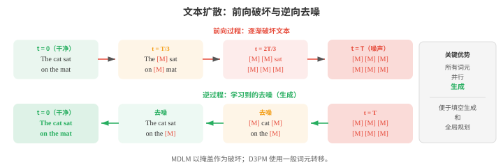
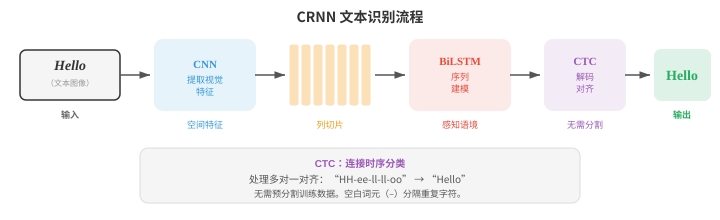
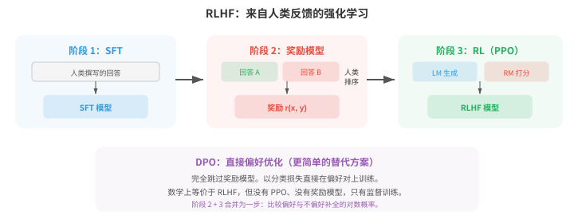
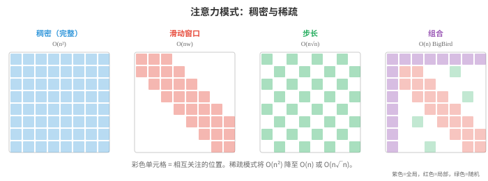
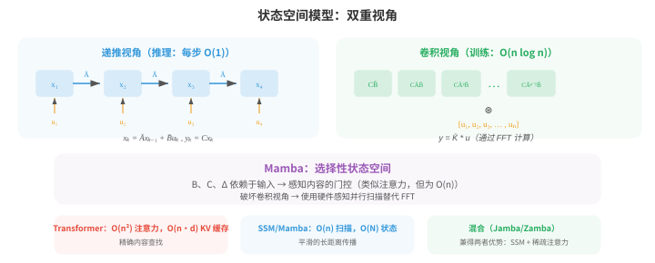
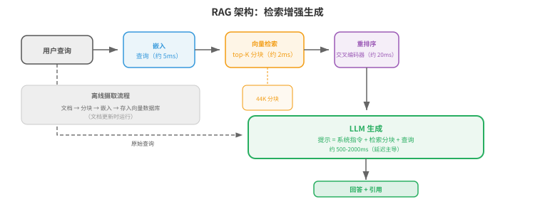
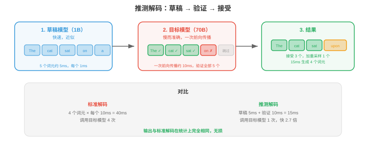
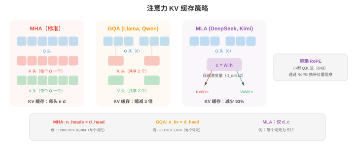

# 高级文本生成

*高级文本生成超越了基础自回归解码，以提升质量、可控性和速度。本节介绍文本扩散模型（D3PM、MDLM）、OCR、用于对齐的 RLHF 与 DPO、长上下文方法（RoPE 缩放、环形注意力）、检索增强生成，以及加速推理的推测解码。*

- 标准自回归生成（文件 04）从左到右、一次生成一个词元。它简单有效，但天然是顺序的，无法进行全局规划，且对输出的控制有限。本节介绍超越基础自回归解码的方法：用于文本的扩散模型、光学字符识别、通过人类反馈实现的可控生成、长上下文处理、检索增强生成，以及加速推理的推测解码。

- **文本扩散模型（text diffusion models）**将扩散框架（第 08 章将为图像介绍）应用于离散文本。核心挑战在于文本是离散的：不能像给像素加噪声一样，对词元加入连续高斯噪声。若干方法解决了这一问题。

- **D3PM**（Discrete Denoising Diffusion Probabilistic Models，Austin 等，2021）利用转移矩阵，直接在离散词元上定义前向破坏过程。在每个前向步骤中，一个词元有一定概率被替换为另一词元（均匀噪声）、被掩盖（吸收状态），或保持不变。逆过程学习去噪，即由被破坏的词元预测干净词元。转移矩阵 $Q_t$ 在第 $t$ 步控制破坏：

$$q(x_t \mid x_{t-1}) = \text{Cat}(x_t ; \, x_{t-1} Q_t)$$

- 其中，$\text{Cat}$ 表示类别分布，$x$ 是 one-hot 向量。多步前向过程 $q(x_t \mid x_0)$ 有闭式：$q(x_t \mid x_0) = \text{Cat}(x_t ; \, x_0 \bar{Q}_t)$，其中 $\bar{Q}_t = Q_1 Q_2 \cdots Q_t$ 是截至第 $t$ 步所有转移矩阵的乘积。训练最小化按时间步分解的变分下界（ELBO），类似连续情形（第 08 章）：

$$\mathcal{L}_{\text{D3PM}} = D_{\text{KL}}(q(x_T \mid x_0) \| p(x_T)) + \sum_{t=2}^{T} D_{\text{KL}}(q(x_{t-1} \mid x_t, x_0) \| p_\theta(x_{t-1} \mid x_t)) - \log p_\theta(x_0 \mid x_1)$$

- 第一项确保完全破坏后的分布与先验（均匀分布或全掩码）匹配。KL 项之和训练模型反转每个破坏步骤：真实逆后验 $q(x_{t-1} \mid x_t, x_0)$ 可使用贝叶斯法则和已知转移矩阵以闭式计算，模型 $p_\theta(x_{t-1} \mid x_t)$ 则被训练为与其匹配。

- 由于两个分布都是类别分布，KL 散度只是对词表条目的简单求和。最后一项衡量从受破坏最轻的状态重建的质量。

- **MDLM**（Masked Diffusion Language Models，Sahoo 等，2024）仅使用掩盖作为破坏操作，从而简化 D3PM：前向过程逐渐将词元替换为 [MASK] 词元，逆过程预测原始词元。这将文本扩散与掩码语言建模（BERT，文件 04）联系起来，扩散时间步决定有多少比例的词元被掩盖。在 $t = 0$ 时，文本完全干净；在 $t = T$ 时，文本完全被掩盖。

- **连续文本扩散（continuous text diffusion）**通过在连续嵌入空间中工作来绕开离散问题。词元首先映射到嵌入向量（第 06 章），在此连续空间中添加噪声，去噪模型（通常是 Transformer）学习反转该过程。生成时，模型产生连续向量，再通过寻找最近嵌入将其映射回离散词元。挑战是连续空间中的微小错误可能映射到完全错误的词元，因此需要谨慎的取整和截断。



- 文本扩散的吸引力在于，它通过迭代细化同时生成全部词元，而非从左到右生成。这允许全局连贯性和方便的填空生成（生成段落中间缺失的文本），但当前文本扩散模型在长文本生成质量上仍落后于自回归模型。

- **文本 OCR（Text OCR）**（光学字符识别，Optical Character Recognition）是从图像中提取文本的任务。尽管传统上不归入文本生成，现代 OCR 系统已深度集成进自然语言处理，并且越来越多地使用语言模型组件。

- **场景文本检测（scene text detection）**在自然图像中定位文本区域（街道标志、产品标签、车牌）。这很有挑战性，因为真实世界中的文本有任意角度、尺度、字体，并处于杂乱背景中。检测方法通常使用 CNN 或 Transformer 骨干网络，在文本区域周围生成边界框或分割掩码。

- **CRNN**（Convolutional Recurrent Neural Network，Shi 等，2017）是经典文本识别架构。CNN 从文本图像提取视觉特征，特征图被切成一列列的序列（每个水平位置一列），双向 LSTM 读取该序列以建模语境。输出使用**CTC**（Connectionist Temporal Classification）解码，它无需显式切分，即可处理输入列与输出字符之间的对齐。

- CTC 要解决的基本问题是：模型产生 $T$ 个输出分布（每个输入列一个），而目标文本有 $L \leq T$ 个字符。

- 我们不知道哪些列对应哪些字符。CTC 引入一个**空白词元（blank token）** $\epsilon$，并定义多对一映射 $\mathcal{B}$，将重复字符折叠并移除空白：$\mathcal{B}(\text{"HH-ee-ll-ll-oo"}) = \text{"Hello"}$（其中 “-” 表示空白）。

- 目标序列 $y$ 的概率，是所有可折叠为 $y$ 的输入对齐之和：

$$P(y \mid x) = \sum_{\pi \in \mathcal{B}^{-1}(y)} \prod_{t=1}^{T} P(\pi_t \mid x)$$

- 其中，$\pi$ 是长度为 $T$ 的对齐路径（每列一个标签，包含空白）。直接对所有路径求和是指数复杂度，但**前向算法（forward algorithm）**（第 05 章 HMM）能用动态规划以 $O(T \cdot L)$ 时间高效计算该和。

- 空白词元不可或缺：没有它，像 “Hello” 中的重复字符 “ll” 会与单个 “l” 无法区分。训练时最大化 $\log P(y \mid x)$；推理时通过束搜索或对 CTC 输出进行贪心解码找到最佳路径。

- **文档 OCR（document OCR）**处理结构化文档（发票、表单、科学论文），除识别字符外还必须理解布局。LayoutLM 等现代系统将文本识别与空间位置特征结合：每个词元既有文本嵌入，也有编码页面 $(x, y)$ 坐标的位置嵌入。这使模型理解出现在 “Total:” 下方的数字就是总金额。



- TrOCR 等**视觉语言 OCR（vision-language OCR）**模型将文本识别视为图像到文本生成：Vision Transformer 编码器处理图像，语言模型解码器逐字符生成文本。它利用预训练视觉和语言模型的能力，无需手工特征工程即可处理多样的文字系统、字体和布局。

- **可控生成（controllable generation）**的挑战，是引导语言模型产生具备所需属性的输出：特定风格、主题、情感、安全等级或事实准确性。模型应在保持流畅与连贯的同时遵循指令。

- 文本的**无分类器引导（classifier-free guidance, CFG）**改编自图像生成技术。训练时，条件信号（例如提示）会有一定概率随机丢弃，因此用同一模型同时训练条件模型和无条件模型。推理时，对输出 logits 作插值：

$$\text{logits}_{\text{guided}} = (1 + w) \cdot \text{logits}_{\text{conditional}} - w \cdot \text{logits}_{\text{unconditional}}$$

- 其中 $w > 0$ 会放大条件的影响。更高的 $w$ 使输出更强地遵循提示，却会降低多样性。

- **RLHF**（Reinforcement Learning from Human Feedback，Ouyang 等，2022）是让语言模型与人类偏好对齐的主导方法。该过程分三阶段：

- 第一，**监督微调（supervised fine-tuning, SFT）**：在由人类为提示撰写的高质量回答数据集上微调基础语言模型。

- 第二，**奖励模型训练（reward model training）**：收集人类比较（给定提示 $x$ 和两个回答 $y_1, y_2$，哪个更好？），训练奖励模型 $r_\phi(x, y)$ 预测人类偏好。奖励模型采用成对排序损失训练：

$$\mathcal{L}_{\text{RM}} = -\log \sigma(r_\phi(x, y_w) - r_\phi(x, y_l))$$

- 其中 $y_w$ 是偏好的回答，$y_l$ 是不偏好的回答。

- 第三，**强化学习微调（RL fine-tuning）**：优化语言模型以最大化奖励，同时保持接近 SFT 模型（防止模式坍缩）。这使用 PPO（Proximal Policy Optimisation，第 06 章）及 KL 惩罚：

$$\mathcal{L}_{\text{RL}} = -\mathbb{E}\left[r_\phi(x, y) - \beta \, D_{\text{KL}}(\pi_\theta \| \pi_{\text{SFT}})\right]$$

- KL 项防止模型偏离基础模型过远，或利用奖励模型的缺陷（“奖励黑客 reward hacking”）。



- **DPO**（Direct Preference Optimisation，Rafailov 等，2023）通过完全移除奖励模型来简化 RLHF。核心数学洞见是：上述带 KL 约束的 RL 目标存在闭式最优策略：

$$\pi^\ast(y \mid x) = \frac{1}{Z(x)} \pi_{\text{ref}}(y \mid x) \exp\!\left(\frac{r(x, y)}{\beta}\right)$$

- 其中 $Z(x)$ 是归一化配分函数。将此式对奖励重排可得 $r(x, y) = \beta \log \frac{\pi^\ast(y \mid x)}{\pi_{\text{ref}}(y \mid x)} + \beta \log Z(x)$。把该隐式奖励代入 Bradley-Terry 偏好模型 $P(y_w \succ y_l) = \sigma(r(x, y_w) - r(x, y_l))$ 后，难以处理的 $Z(x)$ 项相消，直接得到 DPO 损失：

$$\mathcal{L}_{\text{DPO}} = -\log \sigma\!\left(\beta \log \frac{\pi_\theta(y_w \mid x)}{\pi_{\text{ref}}(y_w \mid x)} - \beta \log \frac{\pi_\theta(y_l \mid x)}{\pi_{\text{ref}}(y_l \mid x)}\right)$$

- 这在数学上等价于 RLHF，却将奖励模型和强化学习训练折叠成单个监督步骤。

- sigmoid 内部的表达式可理解为：“相对于参考模型，提高偏好回答的相对概率，降低不偏好回答的相对概率。”

- 参数 $\beta$ 控制策略可以偏离参考模型的程度。实践中，DPO 更易实现（只需计算当前模型和参考模型对两个补全的对数概率），并避免 PPO 训练的不稳定性。

- **宪法 AI（Constitutional AI）**（Bai 等，2022）自动化了部分对齐过程。它不收集人类比较，而是让语言模型根据一组原则（“宪法”）批评并修订自己的输出，例如“选择危害更小的回答”。随后，这些 AI 生成的比较被用于偏好训练（RLAIF：来自 AI 反馈的强化学习）。

- **长上下文方法（long-context methods）**解决标准自注意力的 $O(n^2)$ 内存和计算成本，这一成本限制了序列长度。当 $n$ 增长到数万或数十万词元时，标准注意力变得不可行。

- **稀疏注意力（sparse attention）**以稀疏模式替换稠密的 $n \times n$ 注意力矩阵，让每个词元只关注其他词元的一个子集。常见模式包括**局部注意力（local attention）**（每个词元关注固定大小的邻居窗口）、**步长注意力（strided attention）**（每隔 $k$ 个词元关注一个）和**随机注意力（random attention）**（关注随机子集）。这些模式的组合（BigBird、Longformer 使用）在保持捕捉局部和全局依赖能力的同时，实现 $O(n)$ 或 $O(n \sqrt{n})$ 复杂度。



- **滑动窗口注意力（sliding window attention）**限制每个词元只关注前面 $w$ 个词元（其局部窗口）。其复杂度是 $O(nw)$ 而非 $O(n^2)$，但长距离信息必须经由层间重叠窗口传播。对于 $L$ 层和窗口大小 $w$，有效感受野是 $L \times w$ 个词元。

- **环形注意力（ring attention）**将长序列分发到多个设备，构成环形拓扑。每个设备持有一个序列块，为该块计算注意力，同时将键值块发送给环中下一个设备。这让计算与通信重叠，并允许任意长度的序列，限制仅来自所有设备的总内存，而非任一单设备的内存。

- **记忆增强模型（memory-augmented models）**通过为 Transformer 配备外部记忆库来扩展上下文。在每层中，模型可以使用注意力从该记忆读取并向其写入。Memorizing Transformers 缓存先前块的键值对，并在后续块中关注它们，从而将上下文有效扩展到训练窗口之外。为保持高效，检索采用近似方法（在缓存键上作 $k$ 近邻）。

- 上述方法是长上下文的**架构（architectural）**解决方案。模型如何被**训练（trained）**以有效使用长上下文，同样重要。

- **渐进式上下文扩展（progressive context extension）**是标准方法。从一开始便在超长序列上训练代价极高（$O(n^2)$ 注意力成本），因此模型通常先在较短上下文长度（一般为 4K–8K 词元）预训练，再通过**继续预训练（continued pre-training）**分阶段扩展到目标长度。

- Llama 3.1 用逐渐增加的序列长度，在 800B 词元上从 8K 扩展到 128K。DeepSeek-V3 先在 4K 训练，之后扩展至 32K，再到 128K。

- 每个阶段只使用适量词元（相对完整预训练预算而言），因为模型只需学习如何使用更长的位置，而不是重新学习语言本身。

- 扩展时必须调整位置编码。**RoPE 插值（RoPE interpolation）**缩小位置索引，使模型看到训练时见过的相同旋转角度，只是将其铺展到更长序列。若模型以长度 $L$ 训练，而希望扩展到 $L' = 4L$，则将所有位置索引除以 4。

- 这意味着模型永远不会看到未遇到过的旋转角度，但相邻位置间的有效分辨率会降低。

- **RoPE 外推（RoPE extrapolation）**保持原始位置索引不变，直接将 RoPE 应用于超过 $L$ 的位置，依赖模型泛化到未见角度。

- 插值稳定得多；没有基频调整（Adjusted Base Frequency, ABF）时，外推会快速退化。

- **YaRN**（Yet another RoPE extensioN）通过认识到不同 RoPE 维度不应同等对待，改进了朴素插值。

- 较小的 $i$ 所对应的高频维度（$\theta_i = \theta_{\text{base}}^{-2i/d}$）在训练长度内旋转很多次，可以良好外推。

- 低频维度（较大的 $i$）旋转较慢，对长度扩展更敏感。

- YaRN 仅插值低频维度，对高频维度外推，并向注意力 logits 施加温度缩放 $t$，以补偿分布偏移：

$$\text{score}'_{ij} = \frac{q_i^T k_j}{t \sqrt{d_k}}$$

- 其中 $t > 1$ 会拉平注意力分布，防止在位置讯号被压缩时，模型过于尖锐地关注附近词元。

- **长上下文数据整理（long-context data curation）**是关键且常被低估的挑战。大多数预训练语料由短文档构成（新闻文章、网页、社交媒体帖子）。

- 长上下文训练需要真正用到完整上下文窗口的数据混合：图书、代码库、长篇科学文章、多轮对话日志和按主题相关性拼接的文档。

- 若模型仅用短文档训练，再将其填充或打包以填满上下文窗口，它会学会忽略远处词元，因为远处词元从不相关。

- **序列打包（sequence packing）**是一种训练效率技术：将多篇文档拼接为一个训练序列以避免填充浪费，同时用注意力掩码阻止跨文档注意力。

- 对长上下文训练，打包策略很重要：打包大量无关短文档会教会模型远处词元是噪声；打包较少、真正长的文档则会教会它使用完整上下文。

- 一个已知失效模式是**“迷失在中间”（lost in the middle）**现象（Liu 等，2023）：语言模型通常能有效使用上下文窗口开头与末尾的信息，却难以使用放在中间的信息。

- 这类似人类记忆中的序列位置效应（首因与近因）。

- 它部分来自训练数据分布（重要信息常位于文档开头或结尾），也部分来自注意力模式集中在临近词元和初始词元。将关键信息多样化放置进行长上下文训练，可缓解但不能完全解决该问题。

- **大海捞针（needle-in-a-haystack）**评估测试模型能否从长而干扰性的上下文（“干草堆”）中，检索被放在不同位置的特定事实（“针”）。

- 具备真正长上下文能力的模型，无论针位于哪里都应达到近乎完美的检索。

- 这一测试清楚地揭示迷失在中间效应，常用于评测上下文扩展方法。

- 预训练后的**长上下文微调（long-context fine-tuning）**使用有针对性的 SFT 数据：长多轮对话、证据散落于数千词元的文档问答、长文本摘要和仓库级代码理解。

- Qwen3 在此阶段使用**双块注意力（Dual Chunk Attention, DCA）**，将长序列作为成对块处理：块内注意力完整，块间注意力高效，在微调时实现 4 倍的有效序列容量。

- **状态空间模型（State Space Models, SSMs）**为长序列建模提供根本不同的方案。它不修改注意力，而是完全用受连续时间控制理论启发的线性动力系统取代注意力。

- 一个 SSM 将输入序列 $u(t)$ 映射为输出 $y(t)$，这一映射通过由以下方程控制的潜在状态 $x(t) \in \mathbb{R}^N$ 实现：

$$x'(t) = Ax(t) + Bu(t), \quad y(t) = Cx(t) + Du(t)$$

- 其中，$A \in \mathbb{R}^{N \times N}$ 是状态转移矩阵，$B \in \mathbb{R}^{N \times 1}$ 是输入投影，$C \in \mathbb{R}^{1 \times N}$ 是输出投影，$D$ 是跳跃连接。

- 要将其用于离散序列（词元），连续系统要用步长 $\Delta$ **离散化（discretised）**。零阶保持离散化给出：

$$\bar{A} = \exp(\Delta A), \quad \bar{B} = (\Delta A)^{-1}(\exp(\Delta A) - I) \cdot \Delta B$$

- 随后的离散递推为 $x_k = \bar{A} x_{k-1} + \bar{B} u_k$、$y_k = C x_k + D u_k$，形式上类似 RNN：每次处理一个词元并维护隐藏状态。

- 与 RNN 不同，该递推也可展开为**全局卷积（global convolution）**：因为系统是线性的，输出为 $y = \bar{K} \ast u$，其中卷积核 $\bar{K} = (C\bar{B}, \, C\bar{A}\bar{B}, \, C\bar{A}^2\bar{B}, \ldots)$ 只依赖固定参数。

- 这种**双重视角（dual view）**，即用于高效自回归推理的递推（每步 $O(1)$）与用于高效并行训练的卷积（通过 FFT 达到 $O(n \log n)$），是 SSM 的核心洞见。



- **S4**（Structured State Spaces for Sequence Modeling，Gu 等，2022）通过解决关键数值挑战使 SSM 变得实用：状态矩阵 $A$ 必须捕捉长距离依赖，但朴素参数化会导致状态衰减或爆炸（与普通 RNN 的同一问题）。

- S4 使用 **HiPPO**（High-order Polynomial Projection Operators）矩阵初始化 $A$。该矩阵来自连续信号最优多项式逼近理论。HiPPO 矩阵具有特定结构，可证明状态能够维持整个输入历史的压缩表示，并平稳衰减：

```math
A_{nk} = -\begin{cases} (2n+1)^{1/2}(2k+1)^{1/2} & \text{if } n > k \\ n+1 & \text{if } n = k \\ 0 & \text{if } n < k \end{cases}
```

- 这一下三角结构确保状态充当使用 Legendre 多项式进行的在线输入信号近似。为长卷积核计算 $\bar{A}^k$ 很昂贵，因此 S4 利用 HiPPO 矩阵可被分解为低秩项与对角项之和，实现 $O(n \log n)$ 的卷积核计算。

- **Mamba**（Gu 和 Dao，2023）引入关键创新，即**选择性状态空间（selective state spaces）**：令 SSM 参数依赖于输入。在 S4 中，矩阵 $A$、$B$、$C$ 和步长 $\Delta$ 是固定的，无论词元内容如何，使用的动态过程都相同。Mamba 让 $B$、$C$ 和 $\Delta$ 成为输入的函数：

$$B_k = \text{Linear}(u_k), \quad C_k = \text{Linear}(u_k), \quad \Delta_k = \text{softplus}(\text{Linear}(u_k))$$

- 这种选择性让模型在每个位置决定将什么信息存入状态、忽略什么信息，类似注意力选择相关词元，却没有二次成本。步长 $\Delta_k$ 控制“门”：较大的 $\Delta$ 使状态强烈整合当前输入（连续动力过程前进很大一步，实质上重置状态）；较小的 $\Delta$ 保留既有状态并忽略当前输入。

- 代价是，输入依赖的参数会破坏卷积视角（卷积核不再固定），因此 Mamba 不能使用基于 FFT 的训练。相反，它使用**硬件感知并行扫描（hardware-aware parallel scan）**算法，利用递推的结合性：状态更新 $(x_k, u_k) \mapsto x_{k+1}$ 可表达为一系列结合操作，并借助前缀和（scan）并行化，类似硬件设计中的并行前缀加法。这可在 GPU 上以 $O(n)$ 时间和 $O(\log n)$ 深度运行，效率接近卷积。

- Mamba 在每个词元上的推理真正达到 $O(1)$（只更新固定大小的状态，不使用随上下文增长的 KV 缓存），因此在长序列上内存效率从根本上优于 Transformer。状态大小 $N$（通常为 16）远小于 Transformer 的 KV 缓存，后者存储 $O(n \cdot d)$ 个值。实践中，在语言建模基准上，Mamba 以相同参数量达到或超过 Transformer 的质量，并在长序列上显著加快推理。

- **混合架构（hybrid architectures）**将 SSM 层与注意力层结合：多数层使用 SSM（高效的长距离传播），夹杂少数注意力层（精确的基于内容检索）。Jamba、Zamba 等模型交替使用 Mamba 与 Transformer 块，在保持多数推理效率优势的同时获得比纯 SSM 更好的质量。这表明注意力和 SSM 捕捉互补能力：SSM 擅长平滑、长距离的状态传播，注意力擅长精确、依赖内容的查找。

- **检索增强生成（Retrieval-Augmented Generation, RAG）**通过让语言模型在推理时访问外部知识库，解决其知识局限。RAG 不再只依赖训练期间编码在模型参数中的知识，而是检索相关文档，并以这些文档为条件生成。

- 经典的**检索器-阅读器架构（retriever-reader architecture）**有两个组成部分。**检索器（retriever）**接受查询，并从语料中获取最相关的 top-$k$ 段落。**阅读器（reader）**（一个语言模型）以查询和检索段落为条件生成答案。检索器可以使用稀疏方法（BM25，它扩展了文件 02 的 TF-IDF）或稠密方法。

- **稠密段落检索（Dense passage retrieval, DPR）**采用双编码器架构：一个编码器将问题映射为向量，另一个编码器将段落映射为向量。二者通常基于 BERT。建立索引时，所有段落都会被编码并存储；查询时，问题被编码，再通过近似最近邻搜索（如 FAISS）找到最近段落。相似度度量是问题向量与段落向量的点积。

- **分块策略（chunking strategies）**显著影响检索质量。文档必须被切成足够小、可由检索器处理的段落，但也应足够大以包含完整想法。固定大小分块（例如 256 个词元、50 个词元重叠）很简单，却可能不自然地切断句子。语义分块在段落或章节边界切分；层级分块则在不同粒度上创建摘要树。



- RAG 有几个优势：无需重新训练模型即可更新知识库，模型可以引用来源，且因为能将答案扎根于检索文本，幻觉会减少。主要挑战是检索质量（若检索到错误段落，模型可能会自信地产生错误答案）和延迟（检索为推理增加一个步骤）。

- **推测解码（speculative decoding）**使用小而快的**草稿模型（draft model）**并行提议多个词元，再由大**目标模型（target model）**在一次前向传播中验证，以加速自回归生成。

- 算法过程如下：草稿模型自回归地产生 $k$ 个候选词元（它很小，因此很快）。

- 接着，目标模型在一次前向传播中同时对这 $k$ 个词元打分（这很高效，因为计算是批处理的）。

- 对于每个候选词元 $t$，若它从草稿分布 $p_d(t)$ 采样，则以概率 $\min(1, \, p_{\text{target}}(t) / p_d(t))$ 接受它。若被拒绝，则从**调整后分布（adjusted distribution）** $p_{\text{adj}}(t) = \max(0, \, p_{\text{target}}(t) - p_d(t))$（归一化后）重新采样一个修正词元。

- 这种接受-拒绝方案保证输出分布与单独使用目标模型完全一致。

- 要理解原因，考虑产生词元 $t$ 的有效概率。它可能被直接接受（概率为 $p_d(t) \cdot \min(1, p_{\text{target}}(t)/p_d(t))$），也可能由重新采样产生。

- 对于 $p_{\text{target}}(t) \leq p_d(t)$ 的词元，直接接受贡献 $p_{\text{target}}(t)$。对于 $p_{\text{target}}(t) > p_d(t)$ 的词元，直接接受贡献 $p_d(t)$，重新采样贡献剩余的 $p_{\text{target}}(t) - p_d(t)$（考虑拒绝概率后）。

- 两种情况下，最终产生 $t$ 的总概率都是 $p_{\text{target}}(t)$。草稿模型只影响速度，不影响质量。



- 加速幅度取决于接受率：若草稿模型与目标模型对齐良好，大多数词元会被接受，墙钟时间大致接近草稿模型。典型加速为 2-3 倍，且质量不退化。

- **Medusa**（Cai 等，2024）采用不同方法：它不使用独立草稿模型，而是在目标模型本身上添加多个轻量预测头。每个头同时预测不同的未来词元位置（向前 $k = 1, 2, 3, \ldots$ 步）。每一步中，Medusa 使用树结构提出若干候选续写，目标模型注意力层的一次前向传播便可验证哪些候选一致。这完全避免了独立草稿模型。

- 更广义的**并行生成（parallel generation）**方法旨在打破自回归解码的顺序瓶颈。Jacobi 解码初始化所有位置的猜测，并行迭代细化直到收敛，将生成视为不动点迭代。非自回归模型（NAT）在一次前向传播中同时生成全部词元，但通常质量退化，需要迭代细化、CTC 损失或从自回归教师模型进行知识蒸馏等技术来弥补差距。

- 上述对齐、长上下文、检索、高效解码、状态空间模型等技术，在现代生产级 LLM 中汇聚。

- 本节其余部分将梳理前沿模型中的架构创新，展示文件 01–04 的理论思想与上述方法在实践中如何组合。

- **分组查询注意力（Grouped Query Attention, GQA）**是最广泛采用的注意力效率技术。标准多头注意力（MHA）为每个头维护独立的键和值投影，因此每个词元需要缓存 $n_{\text{heads}} \times d_{\text{head}}$ 个值。GQA 将多个查询头分组，共享一个键值头。

- 使用 64 个查询头和 8 个 KV 头（Llama 3、Qwen、Gemma 常见配置）时，每个 KV 头由 8 个查询头共享，相比 MHA 将 KV 缓存减少 8 倍。

- 输出质量与 MHA 几乎相同，因为查询仍能关注不同模式，只是共享同一个键值子空间。多查询注意力（MQA）是所有查询头共用一个 KV 头的极端情形，但 GQA 提供了更好的质量-效率权衡。

- DeepSeek-V2 引入的**多头潜在注意力（Multi-head Latent Attention, MLA）**实现了更激进的 KV 缓存压缩。它不缓存完整键值投影（即使使用 GQA），而是将隐藏状态下投影为低秩**潜在向量（latent vector）** $c_t \in \mathbb{R}^{d_c}$，其中 $d_c \ll n_{\text{heads}} \times d_{\text{head}}$：

$$c_t = W_{\text{down}} \, h_t$$

- 只有这个压缩向量被缓存。注意力计算时，通过上投影重建完整键和值表示：$k_t = W_{\text{up}}^K c_t$、$v_t = W_{\text{up}}^V c_t$。在 DeepSeek-V3（总计 671B 参数，37B 活跃参数）中，压缩维度为 $d_c = 512$，而完整 MHA 为 $128 \times 128 = 16{,}384$，KV 缓存减少 93%。

- 一个细节是：标准 RoPE 依赖位置，与共享压缩不兼容，因此 MLA 使用**解耦 RoPE（decoupled RoPE）**：查询和键的小型独立流（每头 64 维）通过 RoPE 承载位置信息，而大部分表示流经压缩潜在路径。



- **大规模位置编码（position encoding at scale）**已与原始正弦方案显著分化。所有前沿模型都使用 RoPE（文件 04），但针对长上下文作了关键修改。基频 $\theta_{\text{base}}$ 在原始 RoPE 公式 $\theta_i = \theta_{\text{base}}^{-2i/d}$ 中通常为 10,000，这限制了训练长度之外的外推。

- **调整基频（Adjusted Base Frequency, ABF）**只是将 $\theta_{\text{base}}$ 增加到 500,000（Llama 3）或 1,000,000（Qwen3、Gemma 3），延长旋转周期，使模型在训练期间遇到更少完整旋转并可进一步外推。

- **YaRN**（Yet another RoPE extensioN）采用频率相关插值：低频维度被插值（缩小），高频维度被外推，并用温度因子调整注意力分布。DeepSeek-V3、Qwen 和 Kimi K2 都采用基于 YaRN 的扩展，从在 4K–8K 上预训练的模型达到 128K 上下文。

- Llama 4 引入的**iRoPE**（interleaved RoPE，交错 RoPE）采用了更激进方法：每隔 4 个注意力层，就有一层**完全不使用位置编码（NoPE）**，其他层则使用带分块注意力的标准 RoPE。

- NoPE 层可不带任何位置偏差地关注全部位置，RoPE 层提供局部顺序。再结合推理时的温度缩放，这使 Llama 4 Scout 达到 1000 万词元的上下文窗口，远超任何纯 RoPE 方法。

- **大规模专家混合（Mixture of Experts at scale）**已成为前沿模型的主导架构（文件 04 介绍了 MoE 基础）。关键设计选择包括专家数量、路由稀疏性和负载均衡。

- **路由稀疏性（routing sparsity）**差异很大：DeepSeek-V3 使用 256 位专家与 top-8 路由（32 倍稀疏），Qwen3 使用 128 位专家与 top-8（16 倍稀疏），Mixtral 使用 8 位专家与 top-2（4 倍稀疏），Llama 4 Maverick 使用 128 位专家、top-1 加共享专家（128 倍稀疏）。

- 更高稀疏性意味着在相同活跃计算量下有更多总参数，但需要更谨慎的负载均衡和通信基础设施。

- **无辅助损失的负载均衡（auxiliary-loss-free load balancing）**（DeepSeek-V3）替代了传统负载均衡损失（文件 04），后者被发现会降低模型质量。每位专家改为维护按训练步骤调整的动态偏置项：过载专家的偏置被降低（接收更少词元），负载不足专家的偏置被提高。这样无需辅助损失污染主训练信号，也能实现平衡路由。

- 大多数 MoE 设计中都有**共享专家（shared experts）**：无论路由结果如何，都处理每个词元的一个或多个专家 FFN。这些专家处理所有词元需要的通用模式（基本句法、功能词），让路由专家得以专门化。Llama 4 对每个词元使用 1 位共享专家与 1 位路由专家（高度稀疏）；DeepSeek-V3 使用 1 位共享专家与 8 位路由专家。

- **交替稠密层与 MoE 层（alternating dense and MoE layers）**是另一设计维度。Gemma 2 和 3 交替使用局部/全局注意力层（Gemma 3 的比例为 5:1：局部层使用 1,024 词元滑动窗口，仅全局层缓存完整 128K 上下文）。

- Llama 4 Maverick 将稠密 FFN 层与 MoE 层交错；Kimi K2 使用混合稀疏层（专家层之间插入一个稠密层）。这种异构设计让不同层承担不同功能。

- DeepSeek-V3 使用的**多词元预测（Multi-token prediction, MTP）**训练模型不仅预测下一个词元，也预测下下个词元。在每个位置，次级预测模块（与主模型共享嵌入）预测一个额外的未来词元。MTP 损失相对于主下一个词元损失的权重为 0.1–0.3。除了在训练中改善表示质量，MTP 头还可在推理时充当推测解码的草稿头，提供免费加速。

- **知识蒸馏（knowledge distillation）**是一种训练策略：大型“教师”模型的输出指导较小“学生”模型训练。Gemma 2 和 3 广泛使用蒸馏：较小模型（2B、4B）在计算最优数据量的 50 倍上训练，以教师的概率分布作为软目标。这就是 Gemma 3-4B 能够匹配 Gemma 2-27B 质量的原因。

- 蒸馏损失替换或补充标准交叉熵：学生最小化自己的输出分布与教师输出分布之间的 KL 散度：

$$\mathcal{L}_{\text{distill}} = D_{\text{KL}}(p_{\text{teacher}}(\cdot \mid x) \| p_{\text{student}}(\cdot \mid x))$$

- DeepSeek-R1 使用 800K 条经筛选的思维链样本，将其 671B 推理模型蒸馏为最小 1.5B 的稠密模型，得到推理能力异常强的小模型。

- **通过强化学习进行推理（reasoning via reinforcement learning）**代表 LLM 能力近期最重要的进展。DeepSeek-R1 表明，仅在基础模型上进行纯强化学习（不做监督微调）即可激发思维链推理、自我验证和错误纠正；当模型因最终答案正确而获得奖励时，这些行为会自发涌现。

- DeepSeek-R1 使用 **GRPO**（Group Relative Policy Optimisation），它去除了 PPO 所需的价值网络。对于每个提示，GRPO 采样一组 $G$ 个输出，计算奖励，并在组内归一化优势：

$$A_i = \frac{r_i - \text{mean}(r_1, \ldots, r_G)}{\text{std}(r_1, \ldots, r_G)}$$

- 策略梯度随后使用这些组相对优势和截断目标（类似 PPO 的截断）。

- 移除评论家（critic）网络会将 RL 训练的内存与计算需求减半，使训练 671B 参数模型的强化学习变得可行。

- 一个关键设计选择是：DeepSeek-R1 使用**基于规则的奖励（rule-based rewards）**（将数学答案对照标准答案、运行代码测试用例），而不是神经奖励模型，因为发现神经奖励模型在这一规模下容易被奖励黑客利用。

- **Qwen3 的混合思考模式（hybrid thinking mode）**将推理（使用 `<think>` 标签表示逐步思维链）和快速直接回答集成到同一模型中，允许用户控制“思考预算”，以延迟换取推理深度。

- 这由同时在思考与非思考数据上训练实现，而不是通过独立模型检查点实现。

- **大规模训练稳定化（training stabilisation at scale）**需要超出标准实践的新技术。**Logit 软截断（logit soft-capping）**（Gemma 2）让注意力分数经过 $s \cdot \tanh(\text{logits} / s)$，其中软上限 $s$ 通常为 30–50，以防止无界增长。

- **QK-Norm**（Qwen3）在计算注意力分数前，对查询和键向量应用 RMSNorm，从而取代 QKV bias 的需要。**QK-Clip**（Kimi K2 的 MuonClip 优化器）在训练中监控最大注意力 logit，超过阈值时重缩放查询-键权重矩阵，使 1T 参数模型的预训练能够稳定进行，且没有不稳定事件。

- **FP8 混合精度训练（FP8 mixed-precision training）**（DeepSeek-V3）在前向和反向传播中对计算密集的矩阵乘法使用 8 位浮点，同时以较高精度保存主权重。

- 与 BF16/FP16 训练相比，这在几乎不损失质量的情况下大约使吞吐量翻倍。DeepSeek-V3 训练其 671B 参数模型仅用了 2.8M H800 GPU 小时，远少于可比模型，主要归功于此及其他工程优化。

## 编程任务（使用 CoLab 或 notebook）

1. 从头实现一个简单检索增强生成流程。使用 TF-IDF（文件 02）为一组文档建立索引，为查询检索最相关段落，并将它放在提示之前。
```python
import jax.numpy as jnp
import math
from collections import Counter

# Knowledge base: a set of short passages
knowledge_base = [
    "The Eiffel Tower is a wrought-iron lattice tower in Paris, France. It was constructed from 1887 to 1889 as the centerpiece of the 1889 World's Fair.",
    "The Great Wall of China is a series of fortifications built along the northern borders of China. Construction began in the 7th century BC.",
    "Photosynthesis is the process by which plants convert sunlight, water, and carbon dioxide into glucose and oxygen using chlorophyll.",
    "The theory of general relativity, published by Albert Einstein in 1915, describes gravity as the curvature of spacetime caused by mass and energy.",
    "Python is a high-level programming language known for its simple syntax and readability. It was created by Guido van Rossum and released in 1991.",
    "The mitochondria are organelles found in eukaryotic cells. They generate most of the cell's supply of ATP, used as a source of chemical energy.",
]

# Build TF-IDF index (reusing concepts from file 02)
def tokenise(text):
    return text.lower().split()

vocab = sorted(set(w for doc in knowledge_base for w in tokenise(doc)))
word2idx = {w: i for i, w in enumerate(vocab)}
V = len(vocab)
N = len(knowledge_base)

# Document frequencies
doc_freq = Counter()
for doc in knowledge_base:
    for w in set(tokenise(doc)):
        doc_freq[w] += 1

def tfidf_vector(text):
    words = tokenise(text)
    counts = Counter(words)
    vec = jnp.zeros(V)
    for w, c in counts.items():
        if w in word2idx:
            tf = 1 + math.log(c)
            idf = math.log(N / (doc_freq.get(w, 0) + 1))
            vec = vec.at[word2idx[w]].set(tf * idf)
    return vec

# Index all documents
doc_vectors = jnp.stack([tfidf_vector(doc) for doc in knowledge_base])

def cosine_sim(a, b):
    return jnp.dot(a, b) / (jnp.linalg.norm(a) * jnp.linalg.norm(b) + 1e-8)

def retrieve(query, top_k=2):
    """Retrieve top-k most relevant passages for a query."""
    q_vec = tfidf_vector(query)
    sims = jnp.array([cosine_sim(q_vec, doc_vectors[i]) for i in range(N)])
    top_indices = jnp.argsort(-sims)[:top_k]
    return [(int(i), float(sims[i]), knowledge_base[int(i)]) for i in top_indices]

# Test retrieval
queries = [
    "Who built the Eiffel Tower?",
    "How do plants make food?",
    "What did Einstein discover?",
]

for query in queries:
    results = retrieve(query, top_k=1)
    print(f"\nQuery: '{query}'")
    for idx, sim, passage in results:
        print(f"  Retrieved (sim={sim:.3f}): '{passage[:80]}...'")

    # RAG-style prompt construction
    context = results[0][2]
    rag_prompt = f"Context: {context}\n\nQuestion: {query}\nAnswer:"
    print(f"  RAG prompt:\n    {rag_prompt[:120]}...")
```

2. 使用玩具草稿模型和目标模型实现推测解码。展示接受后的输出与目标模型分布一致。
```python
import jax
import jax.numpy as jnp

# Simulate a draft model (fast, less accurate) and target model (slow, accurate)
vocab_size = 8
seq_len = 5

key = jax.random.PRNGKey(42)

# Target model: returns logits given a sequence
def target_model(seq, key):
    """Simulated target model: produces token logits (expensive)."""
    # In practice this would be a large Transformer forward pass
    k1, k2 = jax.random.split(key)
    logits = jax.random.normal(k1, (len(seq), vocab_size)) * 2
    # Make it somewhat predictable: bias toward token (seq[-1] + 1) % vocab_size
    for i in range(len(seq)):
        logits = logits.at[i, (seq[i] + 1) % vocab_size].add(3.0)
    return logits

def draft_model(seq, key):
    """Simulated draft model: similar but noisier (cheap)."""
    k1, k2 = jax.random.split(key)
    logits = jax.random.normal(k1, (len(seq), vocab_size))
    for i in range(len(seq)):
        logits = logits.at[i, (seq[i] + 1) % vocab_size].add(2.0)
    return logits

def sample_token(logits, key):
    return jax.random.categorical(key, logits)

def speculative_decode(prefix, draft_steps=3, key=jax.random.PRNGKey(0)):
    """Speculative decoding: draft proposes, target verifies."""
    seq = list(prefix)
    total_accepted = 0
    total_proposed = 0

    for _ in range(4):  # generate 4 rounds
        key, *subkeys = jax.random.split(key, draft_steps + 3)

        # Draft model proposes draft_steps tokens
        draft_tokens = []
        draft_probs = []
        draft_seq = list(seq)
        for i in range(draft_steps):
            d_logits = draft_model(jnp.array(draft_seq), subkeys[i])
            d_probs = jax.nn.softmax(d_logits[-1])
            tok = sample_token(d_logits[-1], subkeys[i])
            draft_tokens.append(int(tok))
            draft_probs.append(d_probs)
            draft_seq.append(int(tok))

        # Target model scores all draft tokens in one pass
        target_logits = target_model(jnp.array(draft_seq), subkeys[draft_steps])
        target_start = len(seq) - 1  # position of last prefix token

        # Accept/reject each draft token
        accepted = 0
        for i in range(draft_steps):
            t_probs = jax.nn.softmax(target_logits[target_start + i])
            d_prob = draft_probs[i][draft_tokens[i]]
            t_prob = t_probs[draft_tokens[i]]

            # Accept with probability min(1, target_prob / draft_prob)
            accept_prob = jnp.minimum(1.0, t_prob / (d_prob + 1e-10))
            key, accept_key = jax.random.split(key)
            if jax.random.uniform(accept_key) < accept_prob:
                seq.append(draft_tokens[i])
                accepted += 1
            else:
                # Reject: sample from adjusted distribution
                key, resample_key = jax.random.split(key)
                adjusted = jnp.maximum(0, t_probs - draft_probs[i])
                adjusted = adjusted / (adjusted.sum() + 1e-10)
                new_tok = jax.random.categorical(resample_key, jnp.log(adjusted + 1e-10))
                seq.append(int(new_tok))
                break

        total_accepted += accepted
        total_proposed += draft_steps

    return seq, total_accepted, total_proposed

# Run speculative decoding
prefix = [0, 1]
result_seq, accepted, proposed = speculative_decode(prefix)
acceptance_rate = accepted / proposed if proposed > 0 else 0

print(f"Prefix: {prefix}")
print(f"Generated sequence: {result_seq}")
print(f"Draft proposals: {proposed}")
print(f"Accepted: {accepted}")
print(f"Acceptance rate: {acceptance_rate:.1%}")
print(f"Speedup potential: {(accepted + proposed) / proposed:.2f}x")
```

3. 构建一个简单 DPO 训练循环。给定偏好与不偏好的补全对，使用 DPO 损失更新小型模型。
```python
import jax
import jax.numpy as jnp

# Tiny language model: linear projection from one-hot to logits
vocab_size = 10
seq_len = 4

key = jax.random.PRNGKey(42)
k1, k2 = jax.random.split(key)

# Current policy parameters (trainable)
theta = jax.random.normal(k1, (vocab_size, vocab_size)) * 0.1
# Reference policy parameters (frozen copy of initial theta)
theta_ref = theta.copy()

def log_prob_sequence(params, sequence):
    """Compute log P(sequence) under a simple autoregressive model."""
    total = 0.0
    for t in range(1, len(sequence)):
        # Simple: logits at position t depend on token at t-1
        logits = params[sequence[t-1]]
        log_probs = jax.nn.log_softmax(logits)
        total += log_probs[sequence[t]]
    return total

def dpo_loss(theta, theta_ref, preferred, dispreferred, beta=0.1):
    """Direct Preference Optimisation loss for one pair."""
    log_pi_w = log_prob_sequence(theta, preferred)
    log_pi_l = log_prob_sequence(theta, dispreferred)
    log_ref_w = log_prob_sequence(theta_ref, preferred)
    log_ref_l = log_prob_sequence(theta_ref, dispreferred)

    # DPO objective
    return -jax.nn.log_sigmoid(
        beta * ((log_pi_w - log_ref_w) - (log_pi_l - log_ref_l))
    )

# Preference dataset: (prompt_prefix, preferred_completion, dispreferred_completion)
preferences = [
    (jnp.array([1, 3, 5, 7]), jnp.array([1, 3, 5, 2])),  # prefer 7 over 2 at end
    (jnp.array([0, 2, 4, 6]), jnp.array([0, 2, 4, 9])),  # prefer 6 over 9
    (jnp.array([3, 3, 3, 3]), jnp.array([3, 3, 3, 0])),  # prefer repeating over 0
    (jnp.array([5, 6, 7, 8]), jnp.array([5, 6, 7, 1])),  # prefer 8 over 1
]

grad_fn = jax.jit(jax.grad(dpo_loss))
lr = 0.05

print("Training DPO...")
for epoch in range(100):
    total_loss = 0.0
    for preferred, dispreferred in preferences:
        loss = dpo_loss(theta, theta_ref, preferred, dispreferred)
        grads = grad_fn(theta, theta_ref, preferred, dispreferred)
        theta = theta - lr * grads
        total_loss += loss
    if (epoch + 1) % 20 == 0:
        avg_loss = total_loss / len(preferences)
        print(f"  Epoch {epoch+1}: avg DPO loss = {avg_loss:.4f}")

# Check: the model should now prefer the preferred completions
print("\nPreference check after DPO training:")
for preferred, dispreferred in preferences:
    lp_w = log_prob_sequence(theta, preferred)
    lp_l = log_prob_sequence(theta, dispreferred)
    print(f"  Preferred {list(preferred.astype(int))}: logP={lp_w:.3f}  "
          f"Dispreferred {list(dispreferred.astype(int))}: logP={lp_l:.3f}  "
          f"{'correct' if lp_w > lp_l else 'WRONG'}")
```
