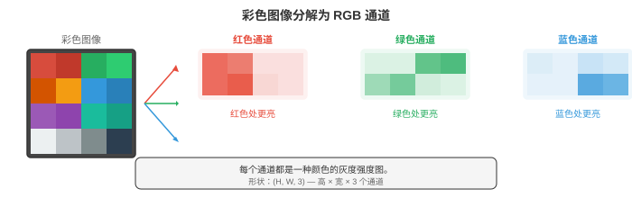
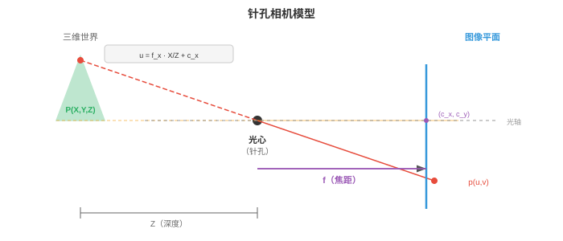
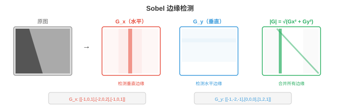
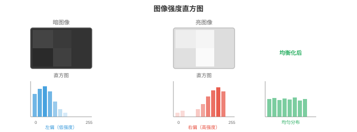
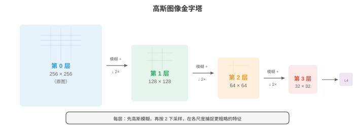

# 图像基础

*图像基础介绍数字图像在被任何模型处理之前，如何表示、形成与预处理。本节涵盖像素、色彩空间（RGB、HSV、YCbCr、LAB）、针孔相机模型、卷积、边缘检测（Sobel、Canny）、直方图和特征描述子（SIFT、ORB），构成低层视觉工具箱。*

- **数字图像（digital image）**是由数字组成的二维网格。网格中的每个单元都是一个**像素（pixel，picture element）**，其数值表示强度或颜色。灰度图像是单个二维矩阵，每个像素保存一个亮度值；对于 8 位图像，该值通常从 0（黑）到 255（白）。

!!! note "大白话"
    图片本质上是一张数字表，每个格子记录一个位置有多亮或是什么颜色。

- 彩色图像将其扩展为三个通道。在 **RGB** 色彩空间中，每个像素保存三个值：红、绿、蓝的强度。

!!! note "大白话"
    彩色像素不是一个数字，而是红、绿、蓝三盏小灯各自有多亮。

- 彩色图像是一个形状为（高度、宽度、3）的三维张量（矩阵）。以不同强度混合这三个通道，就能产生完整的可见颜色光谱。



!!! note "大白话"
    图像的第三个维度就是颜色通道；把三张灰度表按同一位置叠起来，就还原出彩色图。

- **位深度（bit depth）**决定每个通道能够表示多少种不同的强度等级。

!!! note "大白话"
    位深度决定每个颜色能分成多少档，档数越多，亮暗变化越细腻。

- 8 位图像每个通道有 $2^8 = 256$ 个等级，因此可表示 $256^3 \approx 16.7$ 百万种颜色。16 位图像每个通道有 65,536 个等级，适用于医学成像和 HDR 摄影等需要区分细微强度差异的场景。

!!! note "大白话"
    三个通道的档位相乘就是颜色总数；16 位能记录更细小的亮度差别，但文件也更大。

- RGB 便于显示，但其他色彩空间更适合不同任务。

!!! note "大白话"
    RGB 适合直接给屏幕显示，却不一定最方便做分割、压缩或感知比较。

- **HSV**（Hue、Saturation、Value，色相、饱和度、明度）将颜色信息与亮度分开。色相是纯颜色（色轮上 0-360 度），饱和度表示颜色的鲜艳程度（0 = 灰色，1 = 纯色），明度表示亮度。HSV 适用于基于颜色的分割，因为无论光照条件如何，都可以只对色相设阈值。在 HSV 中检测“红色物体”比在 RGB 中容易得多。

!!! note "大白话"
    HSV 把“是什么颜色”和“有多亮、鲜不鲜”拆开，所以找红色物体时可以主要盯色相。

- **YCbCr** 将亮度（Y，即感知亮度）与色度（Cb、Cr，即颜色差信号）分离。这是 JPEG 压缩和视频编解码器使用的色彩空间。人类视觉对亮度比对颜色更敏感，因此可以以更低分辨率存储色度（色度子采样），而几乎不会造成可感知的损失。

!!! note "大白话"
    YCbCr 把人眼最敏感的明暗单独保存，颜色细节可以压缩得更粗而不太容易看出来。

- **LAB**（CIELAB）的设计目标是：两个颜色之间的数值距离对应于感知差异。LAB 空间中相同幅度的步长，对人眼看起来也是相同幅度的变化。L 通道表示明度，A 从绿色到红色，B 从蓝色到黄色。需要按感知均匀性比较颜色时会使用 LAB。

!!! note "大白话"
    LAB 尽量让“坐标差多少”和“人眼觉得差多少”对应，适合按视觉相似度比较颜色。

- **图像形成（image formation）**描述三维场景如何变为二维图像。最简单的模型是**针孔相机（pinhole camera）**：场景的光线穿过一个微小孔洞，投射到孔洞后方的传感器平面上。世界坐标中的点 $(X, Y, Z)$ 投影为像素坐标 $(u, v)$：

```math
\begin{bmatrix} u \\ v \\ 1 \end{bmatrix} = \frac{1}{Z} \begin{bmatrix} f_x & 0 & c_x \\ 0 & f_y & c_y \\ 0 & 0 & 1 \end{bmatrix} \begin{bmatrix} X \\ Y \\ Z \end{bmatrix}
```

!!! note "大白话"
    相机把三维点按深度缩放后压到二维平面；离相机越远，同样大小的东西看起来越小。

- 这个 3x3 矩阵是**内参矩阵（intrinsic matrix）** $K$。它编码相机内部属性：焦距 $f_x, f_y$（镜头会聚光线的强度）以及主点 $(c_x, c_y)$（光轴与传感器的交点，通常接近图像中心）。对于给定的相机和镜头组合，这些参数是固定的。

!!! note "大白话"
    内参描述相机自身的“眼睛规格”：放大能力和光轴落在传感器的哪里。



- **外参（extrinsic parameters）**描述相机在世界中的位置：旋转矩阵 $R$（3x3，见第 02 章）和平移向量 $t$（3x1）。它们共同将世界坐标转换为相机坐标。完整投影为：

$$\mathbf{p} = K [R \mid t] \mathbf{P}$$

!!! note "大白话"
    外参描述相机放在世界里的姿势；内参加外参，才完整决定一个世界点落到哪一个像素。

- 其中，$\mathbf{P} = [X, Y, Z, 1]^T$ 是齐次坐标中的三维点，$\mathbf{p} = [u, v, 1]^T$ 是投影后的像素。矩阵 $[R \mid t]$ 为 3x4，由旋转和平移并排组成。这些都是第 02 章的线性代数内容。

!!! note "大白话"
    齐次坐标把平移也装进矩阵乘法，方便统一写出完整的相机投影。

- 真实镜头会产生**畸变（distortion）**。

!!! note "大白话"
    镜头并不完美，边缘位置的直线可能被拍弯或位置偏移。

    - **径向畸变（radial distortion）**会将直线弯曲为曲线（桶形畸变使图像向外鼓起；枕形畸变使图像向内挤压）。

        !!! note "大白话"
            径向畸变越靠近画面边缘越明显，桶形向外鼓、枕形向内缩。

    - **切向畸变（tangential distortion）**产生于镜头与传感器没有完全平行的情况。

        !!! note "大白话"
            镜头没装正时会产生切向偏移，像整张图被轻微推歪。

- 相机标定通过已知图案（如棋盘格）的图像，同时估计内参和畸变系数，再校正（去畸变）图像。

!!! note "大白话"
    拍几张已知尺寸的棋盘格，就能反推出相机参数，再把弯曲的照片校直。

- **空间滤波（spatial filtering）**是经典图像处理的基础。**滤波器（filter）**或核（kernel）是一个小矩阵（通常为 3x3 或 5x5），在图像上滑动。在每个位置，滤波器的值与重叠图像块逐元素相乘并求和，产生一个输出像素。这是**二维卷积（2D convolution）**，也是 CNN（第 02 节）的核心操作；区别在于，这里的滤波器权重由人工设计，而不是学习得到。

$$(\text{image} * K)[i,j] = \sum_{m} \sum_{n} \text{image}[i+m, j+n] \cdot K[m, n]$$

!!! note "大白话"
    小矩阵像一块滑动模板，在每个位置和周围像素做加权求和，从而突出或平滑某种局部模式。

- 这是第 06 章一维卷积的二维扩展。滤波器决定操作检测什么：不同滤波器检测不同特征。

!!! note "大白话"
    卷积核的数字写法决定它是在找边缘、做模糊，还是检测别的纹理。

- **模糊（blurring）**通过平均相邻像素来平滑图像。**方框滤波器（box filter）**对所有邻居赋予相同权重。

!!! note "大白话"
    模糊就是让一个像素参考邻居的平均值，细节被抹平，噪声也会减弱。

- **高斯滤波器（Gaussian filter）**按照二维高斯分布（第 05 章）加权邻居，为近处像素赋予更高权重、为远处像素赋予更低权重。高斯模糊是最常见的平滑操作，其参数为 $\sigma$：$\sigma$ 越大，平滑越强。

!!! note "大白话"
    高斯模糊更信任近邻；$\sigma$ 越大，参考范围越宽，图像越柔和。

- **中值滤波（median filtering）**不使用加权平均，而是以像素邻域的中位数替换该像素。它特别适合去除椒盐噪声（随机黑白像素），同时保留边缘，因为中位数对离群值具有稳健性（如第 04 章所述）。

!!! note "大白话"
    中值滤波不容易被一个特别亮或特别暗的坏点带偏，所以去椒盐噪声时能保住边缘。

- **边缘检测（edge detection）**识别像素强度急剧变化的边界。边缘包含图像的大部分结构信息；只凭物体的边缘也能识别物体。

!!! note "大白话"
    边缘就是亮暗变化突然的地方，物体轮廓和很多形状信息都集中在那里。

- **Sobel 算子（Sobel operator）**使用两个 3x3 滤波器，估计水平方向和垂直方向的梯度：

```math
G_x = \begin{bmatrix} -1 & 0 & 1 \\ -2 & 0 & 2 \\ -1 & 0 & 1 \end{bmatrix}, \quad G_y = \begin{bmatrix} -1 & -2 & -1 \\ 0 & 0 & 0 \\ 1 & 2 & 1 \end{bmatrix}
```

!!! note "大白话"
    Sobel 用两张固定模板分别测横向和纵向变化，快速估计每个位置是不是边缘。

- 用 $G_x$ 与图像卷积得到水平方向梯度（对垂直边缘响应强），用 $G_y$ 得到垂直方向梯度（对水平边缘响应强）。

!!! note "大白话"
    竖直边缘会让左右方向变化大，水平边缘会让上下方向变化大，因此两个核各有侧重。

- 梯度幅值 $\sqrt{G_x^2 + G_y^2}$ 和方向 $\arctan(G_y / G_x)$ 共同描述每个像素处的边缘强度和方向。这是第 03 章梯度在图像域中的对应物。

!!! note "大白话"
    幅值表示边缘有多强，方向表示边缘朝哪边变化；两者合起来才完整。



- **Canny 边缘检测器（Canny edge detector）**是边缘检测的黄金标准。它包含四步：
    1. 用高斯滤波器平滑图像以降低噪声。
    2. 计算梯度幅值和方向（使用 Sobel）。
    3. **非极大值抑制（non-maximum suppression）**：只保留沿梯度方向上的局部最大值像素，从而细化边缘。
    4. **滞后阈值处理（hysteresis thresholding）**：使用高、低两个阈值。高阈值以上的像素是确定边缘；两个阈值之间的像素只有与确定边缘连通时才是边缘；低阈值以下的像素被丢弃。

!!! note "大白话"
    Canny 先去噪、算梯度、把粗边缘变细，再用强弱两个阈值保留连贯的边缘。

- Canny 的两个阈值使它比单阈值更稳健：强边缘总会保留，弱边缘仅在属于连续边缘结构时保留。

!!! note "大白话"
    双阈值既不轻易丢掉弱但连续的边，也不会把孤立噪声当成边缘。

- **频域（frequency domain）**分析可以揭示在空间域中难以观察的模式。**二维傅里叶变换（2D Fourier transform）**（第 03 章一维形式的扩展）将图像分解为不同频率和方向的二维正弦模式之和：

$$F(u, v) = \sum_{x=0}^{M-1} \sum_{y=0}^{N-1} f(x, y) \cdot e^{-j2\pi(ux/M + vy/N)}$$

!!! note "大白话"
    傅里叶变换把图片换成“不同变化速度的波”来观察，便于区分平滑区域、边缘和噪声。

- 低频对应平滑、缓慢变化的区域（天空、墙面）。高频对应急剧变化（边缘、纹理、噪声）。**幅度谱（magnitude spectrum）**显示每个频率上的能量大小，**相位谱（phase spectrum）**编码空间排列方式。

!!! note "大白话"
    低频像大块明暗，高频像细线和纹理；幅度看强弱，相位保留这些变化在图中的位置关系。

- **低通滤波（low-pass filtering）**去除高频，从而平滑图像（等价于空间域中的高斯模糊）。**高通滤波（high-pass filtering）**去除低频，突出边缘和精细细节。**带通滤波（band-pass filtering）**只保留一个频率范围，适用于纹理分析。

!!! note "大白话"
    低通保留慢变化、去掉细节；高通保留细节、突出边缘；带通只挑某一段变化速度。

- 在实践中，对大滤波器而言，频域滤波可能比空间卷积更快，因为空间域卷积等价于频域中的逐元素乘法（**卷积定理（convolution theorem）**）。这直接联系到第 03 章的傅里叶变换性质。

!!! note "大白话"
    大卷积核在空间域逐格计算很慢，换到频域后变成逐元素相乘，可能更省事。

- **直方图（histograms）**概括像素强度的分布。直方图统计每个强度值对应的像素数量（8 位图像为 0-255）。它就是第 04 章的频数分布应用于像素值。

!!! note "大白话"
    直方图不看像素在哪里，只统计各种亮度分别出现了多少次。



- 暗图像的直方图集中在左侧（低值），亮图像的直方图集中在右侧。低对比度图像的直方图较窄，高对比度图像的直方图宽而分散。

!!! note "大白话"
    直方图靠左说明整体偏暗，范围窄说明明暗差别小，分布宽通常表示对比度高。

- **直方图均衡化（histogram equalisation）**将直方图拉伸至完整强度范围，以改善对比度。其思路是找出一种映射，使像素强度的累积分布函数（CDF）近似线性。这直接应用了第 04 章的 CDF 概念。

!!! note "大白话"
    均衡化重新安排亮度，让原本挤在一小段范围里的像素铺开，画面看起来更有层次。

- **Otsu 方法（Otsu's method）**自动寻找将图像分为前景和背景的最佳阈值。它尝试所有可能的阈值，选择使类内方差最小（等价地，使类间方差最大）的阈值。这与第 04 章的方差概念相同，只是应用于像素强度总体。

!!! note "大白话"
    Otsu 自动试各种明暗分界，选一个让前景内部和背景内部尽量相似、两类彼此尽量分开的阈值。

- **特征提取（feature extraction）**识别图像中可用于匹配、识别和三维重建的独特点或区域。好的特征应当可重复（在不同视角下可再次找到）、有区分性（可与其他特征区分）并且计算高效。

!!! note "大白话"
    好特征要像可靠地标：换个角度还能找到，和别处不混淆，计算也不能太慢。

- **角点检测（corner detection）**寻找图像强度沿多个方向显著变化的点。平滑区域在任意方向上的变化都很小；边缘只在一个方向上变化；角点至少在两个方向上变化，因此局部唯一，是可靠的地标。

!!! note "大白话"
    平面没变化、直线只在一个方向变化，而角点两个方向都变化，所以最容易被认出来。

- **Harris 角点检测器（Harris corner detector）**在每个像素处分析**结构张量（structure tensor）**（也称二阶矩矩阵）：

```math
M = \sum_{(x,y) \in W} w(x,y) \begin{bmatrix} I_x^2 & I_x I_y \\ I_x I_y & I_y^2 \end{bmatrix}
```

!!! note "大白话"
    结构张量把一个小窗口里各方向的梯度变化汇总起来，用来判断这里像平面、边还是角点。

- 其中 $I_x$ 和 $I_y$ 是图像梯度（用 Sobel 计算），$W$ 是局部窗口，$w$ 是高斯权重函数。$M$ 的特征值（第 02 章）告诉你特征类型：
    - 两个特征值都小：平坦区域（没有特征）。

        !!! note "大白话"
            两个方向都几乎没有变化，说明这里是一块平坦区域。

    - 一个大、一个小：边缘。

        !!! note "大白话"
            只有一个方向变化明显，说明这里更像一条边缘。

    - 两个都大：角点。

        !!! note "大白话"
            两个方向都变化明显，说明这里很可能是角点。

!!! note "大白话"
    两个特征值分别代表两个方向的变化：都小是平面，一大一小是边缘，都大才像角点。

- Harris 不显式计算特征值，而是使用角点响应函数：$R = \det(M) - k \cdot (\text{trace}(M))^2$，其中 $\det(M) = \lambda_1 \lambda_2$，$\text{trace}(M) = \lambda_1 + \lambda_2$（两者均见第 02 章）。大的正 $R$ 表示角点。常数 $k$ 通常为 0.04-0.06。

!!! note "大白话"
    Harris 用行列式和迹把两个方向的变化压成一个分数，分数很正时就把位置当作角点。

- **Shi-Tomasi** 检测器将其简化为 $R = \min(\lambda_1, \lambda_2)$，直接检查较小的特征值是否足够大。实践中它略微更稳定。

!!! note "大白话"
    Shi-Tomasi 只看两个方向里较弱的那个，只有两个方向都足够强才算可靠角点。

- **斑点检测（blob detection）**寻找与周围环境不同的区域。与作为点特征的角点不同，斑点具有特征尺度。

!!! note "大白话"
    角点是一个位置，斑点是一块明显不同的区域，还要记录它大概有多大。

- **SIFT**（Scale-Invariant Feature Transform，尺度不变特征变换，Lowe，2004）在多个尺度检测斑点，并构建对旋转、尺度不变且对光照变化部分不变的描述子。其工作过程为：
    1. 使用逐渐增大的 $\sigma$ 进行高斯模糊，建立**尺度空间（scale space）**（见下文）。
    2. 在跨尺度的高斯差分（Difference of Gaussians，DoG）中寻找极值。
    3. 优化关键点位置，并移除低对比度点和边缘响应。
    4. 基于局部梯度方向分配主方向。
    5. 依据关键点周围 16x16 图像块中的梯度直方图，构建 128 维描述子。

!!! note "大白话"
    SIFT 在大小不同的版本里找稳定点，再记录周围梯度方向，因此旋转、缩放后仍较容易匹配。

- **SURF**（Speeded-Up Robust Features）使用方框滤波器和积分图近似 SIFT，以获得更快的计算速度。**ORB**（Oriented FAST and Rotated BRIEF）是一个快速的开源替代方案：它将 FAST 角点检测器与 BRIEF 二进制描述子结合，并加入旋转不变性。

!!! note "大白话"
    SURF 用近似计算加速 SIFT，ORB 则用更轻量的角点和二进制描述子换速度。

- **HOG**（Histogram of Oriented Gradients，方向梯度直方图）描述子将图像分为小单元，在每个单元内计算梯度方向的直方图，并在单元块之间归一化。HOG 捕捉边缘方向的分布，而这对物体形状高度信息化。在深度学习之前，HOG + SVM（第 06 章）是行人检测和物体识别的主流方法。

!!! note "大白话"
    HOG 不记每个像素的精确颜色，而是统计小块里边缘朝向，借此描述人的轮廓和形状。

- **图像金字塔（image pyramids）**以多种分辨率表示图像。

!!! note "大白话"
    同一张图保留大中小多个版本，模型就能同时看整体和细节。

    - **高斯金字塔（Gaussian pyramid）**通过反复模糊和下采样（将分辨率减半）构建。每一层都是原图的更粗略版本。

        !!! note "大白话"
            高斯金字塔每次先平滑再缩小，得到越来越粗的图像。

    - **拉普拉斯金字塔（Laplacian pyramid）**存储相邻高斯层之间的差异，捕捉每一步下采样丢失的细节。拉普拉斯金字塔可逆：可以从它重建原始图像。

        !!! note "大白话"
            拉普拉斯金字塔专门保存每次缩小丢掉的细节，所以配合低分辨率图还能还原原图。



- **尺度空间（scale space）**形式化了物体在不同尺度存在的思想。一棵树是大斑点；树上的一片叶子是小斑点。要检测两者，就需要跨尺度搜索。图像的尺度空间是用逐渐增大的 $\sigma$ 对图像进行高斯卷积所生成的图像族：

$$L(x, y, \sigma) = G(x, y, \sigma) * I(x, y)$$

!!! note "大白话"
    尺度空间就是用不同强度的模糊生成一组图，让算法能分别寻找大物体和小物体。

- 其中 $G$ 是标准差为 $\sigma$ 的二维高斯函数。跨多个尺度持续存在的特征，比噪声更可能是有意义的结构。尺度空间是 SIFT 的理论基础，也是现代计算机视觉中多尺度处理的基础，包括目标检测（第 03 节）中的特征金字塔网络。

!!! note "大白话"
    一个特征在多个模糊程度下都稳定出现，更可能是真实结构而不是偶然噪声。

## 编程任务（使用 CoLab 或 notebook）

1. 加载一张图像，将其转换为不同色彩空间（RGB、HSV、LAB），并可视化各通道。观察颜色信息在各空间中的分布为何不同。
```python
import jax.numpy as jnp
import matplotlib.pyplot as plt
from PIL import Image
import numpy as np

# Create a synthetic test image with distinct colours
H, W = 128, 256
img = np.zeros((H, W, 3), dtype=np.uint8)
img[:, :64] = [255, 50, 50]     # red
img[:, 64:128] = [50, 255, 50]  # green
img[:, 128:192] = [50, 50, 255] # blue
img[:, 192:] = [255, 255, 50]   # yellow

# Add a brightness gradient
for y in range(H):
    scale = 0.3 + 0.7 * y / H
    img[y] = (img[y] * scale).astype(np.uint8)

img_jnp = jnp.array(img, dtype=jnp.float32) / 255.0

# Manual RGB to HSV conversion
def rgb_to_hsv(rgb):
    r, g, b = rgb[..., 0], rgb[..., 1], rgb[..., 2]
    maxc = jnp.max(rgb, axis=-1)
    minc = jnp.min(rgb, axis=-1)
    diff = maxc - minc + 1e-7

    # Hue
    h = jnp.where(maxc == minc, 0.0,
        jnp.where(maxc == r, 60 * ((g - b) / diff % 6),
        jnp.where(maxc == g, 60 * ((b - r) / diff + 2),
                              60 * ((r - g) / diff + 4))))
    s = jnp.where(maxc < 1e-7, 0.0, diff / maxc)
    v = maxc
    return jnp.stack([h / 360, s, v], axis=-1)

hsv = rgb_to_hsv(img_jnp)

fig, axes = plt.subplots(2, 3, figsize=(14, 8))
for i, (ch, name) in enumerate(zip([img_jnp[...,0], img_jnp[...,1], img_jnp[...,2]],
                                     ['Red', 'Green', 'Blue'])):
    axes[0, i].imshow(ch, cmap='gray', vmin=0, vmax=1)
    axes[0, i].set_title(f'RGB: {name}'); axes[0, i].axis('off')

for i, (ch, name) in enumerate(zip([hsv[...,0], hsv[...,1], hsv[...,2]],
                                     ['Hue', 'Saturation', 'Value'])):
    axes[1, i].imshow(ch, cmap='gray', vmin=0, vmax=1)
    axes[1, i].set_title(f'HSV: {name}'); axes[1, i].axis('off')

plt.suptitle('RGB vs HSV Channels')
plt.tight_layout(); plt.show()
```

2. 使用二维卷积从零实现 Sobel 边缘检测和高斯模糊。将它们应用于图像，并比较结果。
```python
import jax
import jax.numpy as jnp
import matplotlib.pyplot as plt

def conv2d(image, kernel):
    """2D convolution (valid mode) from scratch."""
    H, W = image.shape
    kH, kW = kernel.shape
    out_h, out_w = H - kH + 1, W - kW + 1
    output = jnp.zeros((out_h, out_w))
    for i in range(out_h):
        for j in range(out_w):
            patch = image[i:i+kH, j:j+kW]
            output = output.at[i, j].set(jnp.sum(patch * kernel))
    return output

# Create a test image: white rectangle on dark background
img = jnp.zeros((64, 64))
img = img.at[15:50, 20:45].set(1.0)
# Add some noise
key = jax.random.PRNGKey(42)
img = img + jax.random.normal(key, img.shape) * 0.05

# Sobel filters
sobel_x = jnp.array([[-1, 0, 1], [-2, 0, 2], [-1, 0, 1]], dtype=jnp.float32)
sobel_y = jnp.array([[-1, -2, -1], [0, 0, 0], [1, 2, 1]], dtype=jnp.float32)

# Gaussian blur kernel (5x5, sigma=1)
ax = jnp.arange(-2, 3, dtype=jnp.float32)
xx, yy = jnp.meshgrid(ax, ax)
gaussian = jnp.exp(-(xx**2 + yy**2) / (2 * 1.0**2))
gaussian = gaussian / gaussian.sum()

# Apply filters
gx = conv2d(img, sobel_x)
gy = conv2d(img, sobel_y)
edges = jnp.sqrt(gx**2 + gy**2)
blurred = conv2d(img, gaussian)

fig, axes = plt.subplots(1, 4, figsize=(16, 4))
for ax, data, title in zip(axes,
    [img, edges, blurred, gx],
    ['Original', 'Edge Magnitude', 'Gaussian Blur', 'Horizontal Gradient']):
    ax.imshow(data, cmap='gray')
    ax.set_title(title); ax.axis('off')
plt.tight_layout(); plt.show()
```

3. 从零实现直方图均衡化，并将其应用于一张低对比度灰度图像。比较均衡化前后的直方图。
```python
import jax.numpy as jnp
import matplotlib.pyplot as plt

# Create a low-contrast image (values clustered in a narrow range)
key = __import__('jax').random.PRNGKey(42)
img = __import__('jax').random.uniform(key, (128, 128)) * 0.3 + 0.3  # values in [0.3, 0.6]

def histogram_equalise(img, n_bins=256):
    """Histogram equalisation for a grayscale image."""
    # Quantise to bins
    bins = jnp.linspace(0, 1, n_bins + 1)
    hist = jnp.histogram(img, bins=bins)[0]

    # Compute CDF
    cdf = jnp.cumsum(hist)
    cdf_normalised = (cdf - cdf.min()) / (cdf.max() - cdf.min())

    # Map each pixel through the CDF
    indices = jnp.clip((img * n_bins).astype(jnp.int32), 0, n_bins - 1)
    equalised = cdf_normalised[indices]
    return equalised

eq_img = histogram_equalise(img)

fig, axes = plt.subplots(2, 2, figsize=(12, 10))
axes[0, 0].imshow(img, cmap='gray', vmin=0, vmax=1)
axes[0, 0].set_title('Original (Low Contrast)'); axes[0, 0].axis('off')
axes[0, 1].imshow(eq_img, cmap='gray', vmin=0, vmax=1)
axes[0, 1].set_title('After Histogram Equalisation'); axes[0, 1].axis('off')

axes[1, 0].hist(img.ravel(), bins=64, color='#3498db', alpha=0.8)
axes[1, 0].set_title('Histogram Before'); axes[1, 0].set_xlim(0, 1)
axes[1, 1].hist(eq_img.ravel(), bins=64, color='#e74c3c', alpha=0.8)
axes[1, 1].set_title('Histogram After'); axes[1, 1].set_xlim(0, 1)

plt.tight_layout(); plt.show()
```

4. 从零实现 Harris 角点检测器。在简单图像中检测角点，并将其可视化。
```python
import jax
import jax.numpy as jnp
import matplotlib.pyplot as plt

def harris_corners(img, k=0.05, threshold=0.01):
    """Harris corner detection from scratch."""
    # Compute gradients with Sobel
    sobel_x = jnp.array([[-1, 0, 1], [-2, 0, 2], [-1, 0, 1]], dtype=jnp.float32)
    sobel_y = jnp.array([[-1, -2, -1], [0, 0, 0], [1, 2, 1]], dtype=jnp.float32)

    # Pad image for valid convolution to preserve size
    img_pad = jnp.pad(img, 1, mode='edge')
    H, W = img.shape

    Ix = jnp.zeros_like(img)
    Iy = jnp.zeros_like(img)
    for i in range(H):
        for j in range(W):
            patch = img_pad[i:i+3, j:j+3]
            Ix = Ix.at[i, j].set(jnp.sum(patch * sobel_x))
            Iy = Iy.at[i, j].set(jnp.sum(patch * sobel_y))

    # Structure tensor components
    Ixx = Ix * Ix
    Iyy = Iy * Iy
    Ixy = Ix * Iy

    # Gaussian smoothing of structure tensor (approximate with window sum)
    w = 3  # window half-size
    R = jnp.zeros_like(img)
    pad_xx = jnp.pad(Ixx, w, mode='constant')
    pad_yy = jnp.pad(Iyy, w, mode='constant')
    pad_xy = jnp.pad(Ixy, w, mode='constant')

    for i in range(H):
        for j in range(W):
            sxx = jnp.sum(pad_xx[i:i+2*w+1, j:j+2*w+1])
            syy = jnp.sum(pad_yy[i:i+2*w+1, j:j+2*w+1])
            sxy = jnp.sum(pad_xy[i:i+2*w+1, j:j+2*w+1])
            det = sxx * syy - sxy * sxy
            trace = sxx + syy
            R = R.at[i, j].set(det - k * trace * trace)

    # Threshold
    corners = R > threshold * R.max()
    return R, corners

# Test image: checkerboard pattern (lots of corners)
block = 16
n = 4
checker = jnp.zeros((block * n, block * n))
for i in range(n):
    for j in range(n):
        if (i + j) % 2 == 0:
            checker = checker.at[i*block:(i+1)*block, j*block:(j+1)*block].set(1.0)

R, corners = harris_corners(checker)
cy, cx = jnp.where(corners)

fig, axes = plt.subplots(1, 3, figsize=(14, 4))
axes[0].imshow(checker, cmap='gray')
axes[0].set_title('Checkerboard'); axes[0].axis('off')
axes[1].imshow(R, cmap='hot')
axes[1].set_title('Harris Response'); axes[1].axis('off')
axes[2].imshow(checker, cmap='gray')
axes[2].scatter(cx, cy, c='#e74c3c', s=15, marker='x')
axes[2].set_title(f'Detected Corners ({len(cx)})'); axes[2].axis('off')
plt.tight_layout(); plt.show()
```
