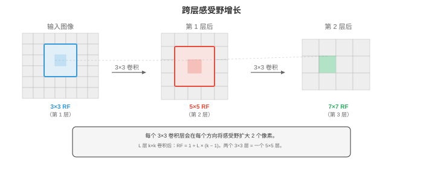
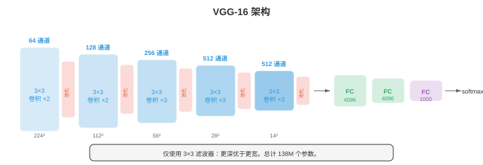
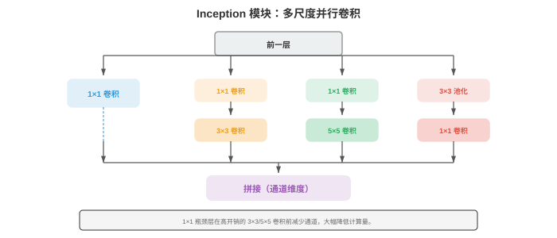
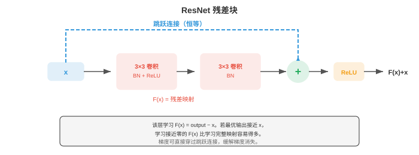
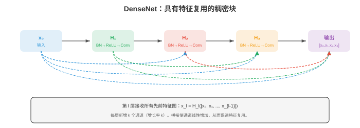
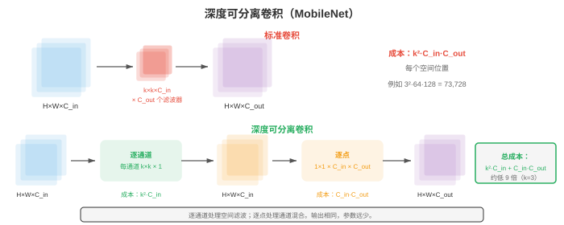
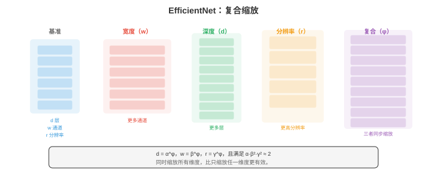
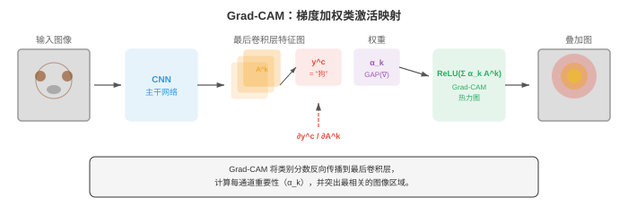

# 卷积网络

*卷积神经网络（convolutional neural networks）直接从像素数据中学习空间特征层级，用经梯度优化的滤波器替代人工设计的滤波器。本节涵盖卷积机制、池化、步幅、膨胀、感受野，以及定义图像分类发展的标志性架构（LeNet、AlexNet、VGG、ResNet、Inception、EfficientNet）。*

- 在第 01 节中，我们为边缘检测、模糊和角点检测人工设计了滤波器。自然的问题是：能否从数据中学习最优滤波器？这正是卷积神经网络（CNN）所做的事。

- CNN 不手工选择滤波器权重，而是通过梯度下降（第 06 章）学习它们，从而发现对当前任务直接有用的特征。

- 第 06 章介绍了卷积运算、CNN 基础和滤波器学习的概念。这里将进一步讨论使 CNN 在十余年间成为计算机视觉主流范式的架构创新。

- 回顾核心的**卷积运算（convolution operation）**：滤波器 $K$ 的大小为 $k \times k$，它在输入特征图上滑动，并在每个位置计算点积（第 06 章）。输出尺寸由三个超参数控制：

    - **步幅（stride）**：滤波器在相邻位置之间移动的像素数。步幅 1 表示每次移动一个像素，步幅 2 表示每次移动两个像素，使空间维度减半。步幅卷积可作为池化之外的下采样方式。
    - **填充（padding）**：在输入边界周围添加零。“Same” 填充（$p = \lfloor k/2 \rfloor$）保持空间维度不变，“Valid” 填充（$p = 0$）会减小空间维度。
    - **膨胀（dilation）**：在滤波器元素之间插入间隔。膨胀率为 2 的 3x3 滤波器仅用 9 个参数就能覆盖 5x5 的感受野。膨胀卷积无需增加计算量即可扩大感受野。

- 卷积后的输出空间尺寸为：

$$\text{out} = \left\lfloor \frac{\text{in} - k + 2p}{s} \right\rfloor + 1$$

- 其中，$\text{in}$ 是输入尺寸，$k$ 是核大小，$p$ 是填充，$s$ 是步幅。该公式分别适用于高度和宽度。

- 一个神经元的**感受野（receptive field）**是原始输入中能够影响其取值的区域。
    - 前面的层感受野较小（能看到边缘等局部模式）。
    - 更深的层感受野较大（能看到物体部件等较大结构）。

- 感受野随每一层增长：每个卷积层大致增长 $k - 1$ 个像素（使用步幅或膨胀时增长更多）。



- **池化（pooling）**层在保留最重要信息的同时减小空间维度。
    - **最大池化（max pooling）**取每个窗口的最大值，保留最强激活（最显著的特征）。
    - **平均池化（average pooling）**取均值，平滑特征图。步幅为 2 的 2x2 池化会使两个空间维度都减半。

- **全局平均池化（Global Average Pooling，GAP）**将每个通道的整个空间范围平均为单个数，生成长度等于通道数的向量。GAP 取代了许多现代架构末尾的全连接层，大幅减少参数量，并充当结构性正则化器。

- **批归一化（Batch Normalisation，BatchNorm）**将每个小批量内的激活归一化为零均值和单位方差，再应用可学习的缩放和偏移（第 06 章）。在 CNN 中，BatchNorm 按通道应用：对每个通道独立地跨批量和空间维度计算统计量。它能稳定训练、允许更高学习率，并提供轻微的正则化作用。

- **Dropout**（第 06 章）会在训练期间随机将神经元置零。

- 在 CNN 中，**空间 Dropout（spatial dropout，Dropout2D）**会丢弃整个特征图通道，而非单个像素。由于特征图中相邻像素高度相关，这种方式更有效。

- **数据增强（data augmentation）**在训练期间对每张图像施加随机变换，以人为扩展训练集：水平翻转、随机裁剪、旋转、颜色扰动（调整亮度、对比度、饱和度、色相）以及 cutout（遮蔽随机矩形图像块）。网络以多种形式看到同一图像，被迫学习对变换不变的特征，而非记忆特定像素模式。

- 高级增强策略包括 **Mixup**（混合两张图像及其标签：$\tilde{x} = \lambda x_i + (1-\lambda) x_j$，$\tilde{y} = \lambda y_i + (1-\lambda) y_j$）、**CutMix**（将一张图像的矩形块粘贴到另一张图像上，并按面积比例混合标签）和 **RandAugment**（从固定集合随机采样一系列增强操作，仅使用一个强度参数）。

- CNN 架构的历史是一段逐步加深、不断提高效率的设计史；每个架构都解决了前代受限的一个问题。

- **LeNet-5**（LeCun 等，1998）是最早的 CNN，为手写数字识别设计。它有两层卷积层，后接三层全连接层，并使用平均池化和 tanh 激活。它证明了学习得到的滤波器优于人工设计的特征，但按现代标准极小（6 万参数）。

- **AlexNet**（Krizhevsky 等，2012）以巨大优势赢得 ImageNet 竞赛，点燃了深度学习革命。关键创新包括：ReLU 激活（替代会遭遇梯度消失的 tanh）、用于正则化的 dropout、数据增强和 GPU 训练。它具有五个卷积层、三个全连接层和 6,000 万参数。

- **VGG**（Simonyan 和 Zisserman，2014）证明，只堆叠使用 3x3 滤波器比使用更大滤波器效果更好。两个堆叠的 3x3 滤波器与一个 5x5 滤波器具有相同感受野，但参数更少（$2 \times 3^2 = 18$ 对比 $5^2 = 25$），且多一个非线性。VGG-16（16 层）和 VGG-19（19 层）至今仍广泛作为特征提取器。其架构极其简单：通道数逐渐增加（64、128、256、512）的卷积块，每个卷积块后接最大池化。



- **GoogLeNet/Inception**（Szegedy 等，2014）引入了 **Inception 模块**：不选择单一滤波器大小，而是并行使用 1x1、3x3 和 5x5 卷积，将输出拼接起来，让网络决定哪种尺度最有用。较大滤波器之前使用 1x1 卷积作为瓶颈层以减少计算。GoogLeNet 以少 12 倍的参数量（6.8M 对比 138M）获得了优于 VGG 的准确率。



- Inception 模块能同时捕捉多个尺度的特征。1x1 滤波器捕捉逐点模式，3x3 捕捉局部纹理，5x5 捕捉更大结构。拼接将所有视角合为丰富的表示。

- **ResNet**（He 等，2016）解决了**退化问题（degradation problem）**：更深的网络比浅网络表现更差，原因不是过拟合，而是更难优化。解决方法是**跳跃连接（skip connection）**或残差连接：

$$\text{output} = F(x) + x$$

- 该层学习残差 $F(x) = \text{output} - x$。若最优变换接近恒等映射（这在深层网络中很常见），学习接近零的残差比学习完整映射容易得多。跳跃连接还提供了直接的梯度通道，减轻梯度消失。ResNet 训练出了 152 层网络，远深于此前任何网络。



- 当输入和输出维度不同（因为步幅或通道数变化）时，**投影捷径（projection shortcut）**会对 $x$ 应用 1x1 卷积以匹配维度：$\text{output} = F(x) + W_s x$。

- **瓶颈块（bottleneck block）**（用于 ResNet-50 及更深网络）使用三个卷积：1x1 用于减少通道，3x3 用于空间处理，1x1 再将通道扩展回来。它比两个 3x3 卷积更便宜，也允许构建更深的网络。

- **DenseNet**（Huang 等，2017）将跳跃连接的思想推进一步：稠密块中的每层都连接到其后的每一层。第 $l$ 层接收此前所有层的特征图作为输入：$x_l = H_l([x_0, x_1, \ldots, x_{l-1}])$，其中 $[\cdot]$ 表示沿通道维度拼接。这鼓励特征复用、增强梯度流，并减少总参数量。



- **高效架构（efficient architectures）**面向移动设备和边缘硬件部署，这些环境中的计算、内存和能耗都受限。

- **MobileNet**（Howard 等，2017）以**深度可分离卷积（depthwise separable convolutions）**替代标准卷积，将操作分解为两步：
    1. **逐通道卷积（depthwise convolution）**：为每个输入通道分别应用一个 $k \times k$ 滤波器（不存在跨通道交互）。
    2. **逐点卷积（pointwise convolution）**：应用 1x1 卷积，在通道之间组合信息。

- 对于标准 $k \times k$ 卷积，若其具有 $C_{\text{in}}$ 个输入通道和 $C_{\text{out}}$ 个输出通道，则每个空间位置需要 $k^2 \cdot C_{\text{in}} \cdot C_{\text{out}}$ 次乘法。深度可分离卷积需要 $k^2 \cdot C_{\text{in}} + C_{\text{in}} \cdot C_{\text{out}}$ 次，约缩减 $k^2$ 倍。对于 3x3 滤波器，约便宜 9 倍。



- **MobileNet-V2** 引入**倒残差块（inverted residual block）**：先用 1x1 卷积扩展通道，在扩展空间中应用逐通道卷积，再用 1x1 卷积投影回较少通道。跳跃连接置于狭窄的（瓶颈）层上，与 ResNet 模式相反。扩展比例通常为 6。

- **EfficientNet**（Tan 和 Le，2019）引入**复合缩放（compound scaling）**：不独立地只缩放深度、宽度或分辨率，而是使用固定比例同时缩放三种维度。给定缩放系数 $\phi$：

$$\text{depth}: d = \alpha^\phi, \quad \text{width}: w = \beta^\phi, \quad \text{resolution}: r = \gamma^\phi$$

- 满足 $\alpha \cdot \beta^2 \cdot \gamma^2 \approx 2$（因此每增加一个单位的 $\phi$，总计算量大致翻倍）。网格搜索得到基准比例 $\alpha = 1.2$、$\beta = 1.1$、$\gamma = 1.15$。EfficientNet-B0 至 B7 逐步扩展，以远少于先前模型的参数量和 FLOPs 实现了最先进准确率。



- **ShuffleNet** 通过**分组卷积（group convolutions）**后接**通道洗牌（channel shuffle）**，降低了 1x1 卷积的成本（后者在 MobileNet 风格架构中占主导）。分组卷积将通道分组并在每组内独立卷积，但这阻碍组间信息流。洗牌操作在组之间重排通道，以几乎没有额外成本恢复信息混合。

- **迁移学习（transfer learning）**是指采用在一个任务上训练的模型，并使其适应另一项任务。在计算机视觉中，这几乎总是从 ImageNet（140 万张图像、1,000 个类别）预训练模型开始，再适应特定领域的数据集（医学图像、卫星图像、制造缺陷）。

- **特征提取（feature extraction）**：冻结全部卷积层，移除最终分类头，仅训练其上的新分类头。冻结层作为通用特征提取器。当目标领域与 ImageNet 相似且目标数据集较小时，该方法效果良好。

- **微调（fine-tuning）**：解冻部分或全部卷积层，并以较小学习率训练。预训练权重作为起点而非固定特征。微调通常先只解冻后面的层（它们捕捉高层、任务特定的特征），也可以进一步解冻前面的层。

- 迁移学习之所以有效，是因为 CNN 的前层学习了跨任务有用的通用特征（边缘、纹理、颜色），而后层学习任务特定特征。一个训练来分类动物的网络，仍拥有可用于分类建筑物的边缘检测器。

- **CNN 可视化（visualising CNNs）**能揭示网络学到了什么，并帮助调试意外行为。

- **激活图（activation maps）**或特征图（feature maps）展示给定输入图像时每个滤波器的输出。前层激活看起来像边缘图；更深层会产生越来越抽象、空间上越来越粗糙的激活。

- **Grad-CAM**（Gradient-weighted Class Activation Mapping，梯度加权类激活映射，Selvaraju 等，2017）突出显示对模型预测最重要的输入图像区域。其步骤为：
    1. 计算目标类别分数相对于最后卷积层特征图的梯度（使用第 03 章的链式法则）。
    2. 对这些梯度进行全局平均池化，获得每通道的重要性权重。
    3. 计算特征图的加权组合并应用 ReLU。

$$L_{\text{Grad-CAM}} = \text{ReLU}\!\left(\sum_k \alpha_k A^k\right), \quad \alpha_k = \frac{1}{Z} \sum_i \sum_j \frac{\partial y^c}{\partial A^k_{ij}}$$

- 其中，$A^k$ 是第 $k$ 个特征图，$\alpha_k$ 是通道 $k$ 的重要性权重，$y^c$ 是类别 $c$ 的分数。结果是一个粗粒度热力图，显示哪些区域驱动了分类。应用 ReLU 是因为我们关心对该类别产生正向影响的特征。



- **特征反演（feature inversion）**通过优化随机图像，使它匹配目标特征（对像素值使用梯度下降），从特征表示重建输入图像。这揭示网络在每一层保留了什么信息。前层能重建近乎完美的图像；更深层产生可辨认但扭曲的图像，表明精细空间细节丢失，而语义内容得以保留。

- **Deep Dream** 和**神经风格迁移（neural style transfer）**是特征可视化的创造性应用。Deep Dream 最大化选定层神经元的激活，产生超现实、模式被放大的图像。神经风格迁移优化目标图像，使它同时匹配一张图像的内容特征（来自深层）和另一张图像的风格特征（滤波器激活的 Gram 矩阵，用于捕捉纹理统计量）。

## 编程任务（使用 CoLab 或 notebook）

1. 使用 JAX 从零实现一个含两层卷积、最大池化和分类头的简单 CNN。在合成二维模式分类任务上训练它。
```python
import jax
import jax.numpy as jnp
import jax.lax as lax
import matplotlib.pyplot as plt

def conv2d(x, kernel, stride=1):
    """Simple 2D convolution for single input, single filter."""
    return lax.conv(x[None, None], kernel[None, None], (stride, stride), 'SAME')[0, 0]

def max_pool(x, size=2):
    """2x2 max pooling."""
    H, W = x.shape
    x = x[:H//size*size, :W//size*size]
    return x.reshape(H//size, size, W//size, size).max(axis=(1, 3))

def init_cnn(key):
    k1, k2, k3 = jax.random.split(key, 3)
    return {
        'conv1': jax.random.normal(k1, (5, 5)) * 0.3,
        'conv2': jax.random.normal(k2, (3, 3)) * 0.3,
        'fc_w': jax.random.normal(k3, (64, 1)) * 0.1,
        'fc_b': jnp.zeros(1),
    }

def forward_cnn(params, img):
    # Conv1 -> ReLU -> Pool
    h = jnp.maximum(0, conv2d(img, params['conv1']))
    h = max_pool(h)
    # Conv2 -> ReLU -> Pool
    h = jnp.maximum(0, conv2d(h, params['conv2']))
    h = max_pool(h)
    # Flatten and classify
    flat = h.ravel()
    # Pad or truncate to fixed size
    flat = jnp.pad(flat, (0, max(0, 64 - len(flat))))[:64]
    logit = (flat @ params['fc_w'] + params['fc_b']).squeeze()
    return jax.nn.sigmoid(logit)

# Generate synthetic data: class 0 = low-freq pattern, class 1 = high-freq
def make_data(key, n=200):
    images, labels = [], []
    for i in range(n):
        k1, key = jax.random.split(key)
        x, y = jnp.meshgrid(jnp.linspace(0, 4*jnp.pi, 32), jnp.linspace(0, 4*jnp.pi, 32))
        if i < n // 2:
            img = jnp.sin(x) + jax.random.normal(k1, (32, 32)) * 0.1
            labels.append(0)
        else:
            img = jnp.sin(4 * x) * jnp.sin(4 * y) + jax.random.normal(k1, (32, 32)) * 0.1
            labels.append(1)
        images.append(img)
    return images, jnp.array(labels, dtype=jnp.float32)

key = jax.random.PRNGKey(42)
images, labels = make_data(key)
params = init_cnn(jax.random.PRNGKey(0))

def loss_fn(params, img, label):
    pred = forward_cnn(params, img)
    return -(label * jnp.log(pred + 1e-7) + (1 - label) * jnp.log(1 - pred + 1e-7))

grad_fn = jax.grad(loss_fn)
lr = 0.01

for epoch in range(5):
    total_loss = 0.0
    for img, label in zip(images, labels):
        grads = grad_fn(params, img, label)
        params = {k: params[k] - lr * grads[k] for k in params}
        total_loss += loss_fn(params, img, label)
    print(f"Epoch {epoch}: loss = {total_loss / len(images):.4f}")

# Test accuracy
preds = jnp.array([forward_cnn(params, img) > 0.5 for img in images])
acc = jnp.mean(preds == labels)
print(f"Accuracy: {acc:.2%}")
```

2. 可视化不同滤波器大小如何影响感受野。展示两个堆叠 3x3 滤波器与一个 5x5 滤波器覆盖相同感受野，但参数更少。
```python
import jax.numpy as jnp
import matplotlib.pyplot as plt

def compute_receptive_field(layers):
    """Compute receptive field size from a list of (kernel_size, stride) tuples."""
    rf = 1  # start with 1 pixel
    stride_product = 1
    for k, s in layers:
        rf += (k - 1) * stride_product
        stride_product *= s
    return rf

# Compare architectures
configs = {
    'Single 5x5': [(5, 1)],
    'Two 3x3':    [(3, 1), (3, 1)],
    'Three 3x3':  [(3, 1), (3, 1), (3, 1)],
    'Single 7x7': [(7, 1)],
    '3x3 stride 2 + 3x3': [(3, 2), (3, 1)],
}

print(f"{'Config':<25} {'RF':>4} {'Params (per channel)':>20}")
print('-' * 55)
for name, layers in configs.items():
    rf = compute_receptive_field(layers)
    # Parameters: sum of k^2 for each layer (per input-output channel pair)
    params = sum(k * k for k, s in layers)
    print(f"{name:<25} {rf:>4} {params:>20}")

# Visualise receptive fields
fig, axes = plt.subplots(1, 3, figsize=(14, 4))
for ax, (name, rf_size) in zip(axes, [('5x5 filter', 5), ('Two 3x3 filters', 5), ('Three 3x3 filters', 7)]):
    grid = jnp.zeros((9, 9))
    c = 4  # centre
    half = rf_size // 2
    grid = grid.at[c-half:c+half+1, c-half:c+half+1].set(1.0)
    ax.imshow(grid, cmap='Blues', vmin=0, vmax=1)
    ax.set_title(f'{name}\nRF = {rf_size}x{rf_size}')
    ax.set_xticks(range(9)); ax.set_yticks(range(9))
    ax.grid(True, alpha=0.3)
plt.suptitle('Receptive Field Comparison')
plt.tight_layout(); plt.show()
```

3. 从零实现 Grad-CAM。给定预先构建的简单 CNN，计算特定类别的梯度加权激活图，并将其可视化为热力图。
```python
import jax
import jax.numpy as jnp
import matplotlib.pyplot as plt

def simple_cnn(params, img):
    """Simple CNN that returns both the prediction and last conv activations."""
    # Conv layer (our "last conv layer" for Grad-CAM)
    H, W = img.shape
    k = params['conv'].shape[0]
    pad = k // 2
    img_pad = jnp.pad(img, pad, mode='edge')
    activation_map = jnp.zeros((H, W))
    for i in range(H):
        for j in range(W):
            activation_map = activation_map.at[i, j].set(
                jnp.sum(img_pad[i:i+k, j:j+k] * params['conv'])
            )
    activation_map = jnp.maximum(0, activation_map)  # ReLU

    # Global average pool -> dense -> output
    pooled = activation_map.mean()
    logit = pooled * params['w'] + params['b']
    return jax.nn.sigmoid(logit), activation_map

# Create test image: bright region on the left (class indicator)
img = jnp.zeros((32, 32))
img = img.at[8:24, 4:16].set(1.0)
img = img.at[5:10, 20:28].set(0.3)

key = jax.random.PRNGKey(42)
params = {
    'conv': jax.random.normal(key, (5, 5)) * 0.3,
    'w': jnp.array(2.0),
    'b': jnp.array(-0.5),
}

# Compute Grad-CAM
def class_score(params, img):
    pred, _ = simple_cnn(params, img)
    return pred

# Get activation map and gradients
pred, act_map = simple_cnn(params, img)
grad_fn = jax.grad(lambda img: simple_cnn(params, img)[0])
img_grad = grad_fn(img)

# Weight = global average of gradients (simplified 1-channel Grad-CAM)
alpha = img_grad.mean()
grad_cam = jnp.maximum(0, alpha * act_map)  # ReLU
grad_cam = (grad_cam - grad_cam.min()) / (grad_cam.max() - grad_cam.min() + 1e-8)

fig, axes = plt.subplots(1, 3, figsize=(14, 4))
axes[0].imshow(img, cmap='gray'); axes[0].set_title('Input Image'); axes[0].axis('off')
axes[1].imshow(act_map, cmap='viridis'); axes[1].set_title('Activation Map'); axes[1].axis('off')
axes[2].imshow(img, cmap='gray', alpha=0.6)
axes[2].imshow(grad_cam, cmap='jet', alpha=0.4)
axes[2].set_title(f'Grad-CAM (pred={pred:.2f})'); axes[2].axis('off')
plt.tight_layout(); plt.show()
```

4. 比较深度可分离卷积与标准卷积。统计两者的参数和 FLOPs，并展示它们能以远少得多的计算产生相似输出。
```python
import jax
import jax.numpy as jnp

def standard_conv(x, kernel):
    """Standard convolution: (H, W, C_in) * (k, k, C_in, C_out) -> (H, W, C_out)."""
    H, W, C_in = x.shape
    k, _, _, C_out = kernel.shape
    pad = k // 2
    x_pad = jnp.pad(x, ((pad, pad), (pad, pad), (0, 0)), mode='constant')
    out = jnp.zeros((H, W, C_out))
    for i in range(H):
        for j in range(W):
            patch = x_pad[i:i+k, j:j+k, :]  # (k, k, C_in)
            for c in range(C_out):
                out = out.at[i, j, c].set(jnp.sum(patch * kernel[:, :, :, c]))
    return out

def depthwise_separable_conv(x, dw_kernel, pw_kernel):
    """Depthwise separable: depthwise (k,k,C_in) then pointwise (C_in, C_out)."""
    H, W, C_in = x.shape
    k = dw_kernel.shape[0]
    pad = k // 2
    x_pad = jnp.pad(x, ((pad, pad), (pad, pad), (0, 0)), mode='constant')

    # Depthwise: one filter per channel
    dw_out = jnp.zeros((H, W, C_in))
    for i in range(H):
        for j in range(W):
            for c in range(C_in):
                patch = x_pad[i:i+k, j:j+k, c]
                dw_out = dw_out.at[i, j, c].set(jnp.sum(patch * dw_kernel[:, :, c]))

    # Pointwise: 1x1 conv across channels
    out = dw_out @ pw_kernel
    return out

# Setup
H, W, C_in, C_out, k = 8, 8, 16, 32, 3
key = jax.random.PRNGKey(42)
k1, k2, k3, k4 = jax.random.split(key, 4)

x = jax.random.normal(k1, (H, W, C_in))
std_kernel = jax.random.normal(k2, (k, k, C_in, C_out)) * 0.1
dw_kernel = jax.random.normal(k3, (k, k, C_in)) * 0.1
pw_kernel = jax.random.normal(k4, (C_in, C_out)) * 0.1

# Compare
std_params = k * k * C_in * C_out
dw_params = k * k * C_in + C_in * C_out

std_flops = H * W * k * k * C_in * C_out
dw_flops = H * W * (k * k * C_in + C_in * C_out)

print(f"Standard conv:            {std_params:>8,} params,  {std_flops:>10,} FLOPs")
print(f"Depthwise separable conv: {dw_params:>8,} params,  {dw_flops:>10,} FLOPs")
print(f"Parameter reduction:      {std_params / dw_params:.1f}x")
print(f"FLOP reduction:           {std_flops / dw_flops:.1f}x")

std_out = standard_conv(x, std_kernel)
ds_out = depthwise_separable_conv(x, dw_kernel, pw_kernel)
print(f"\nStandard output shape:    {std_out.shape}")
print(f"Depthwise sep output shape: {ds_out.shape}")
```
