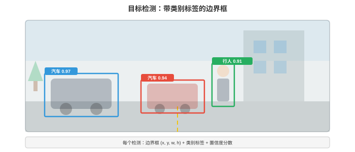
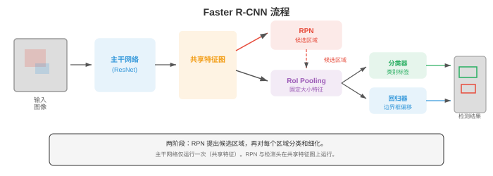
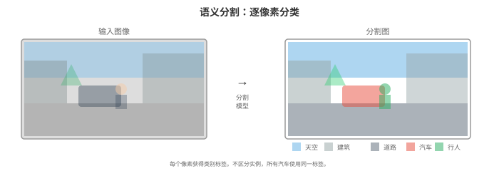
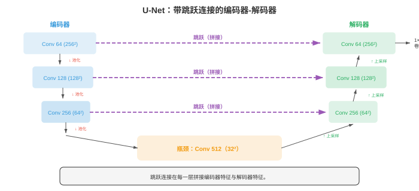

# 目标检测与分割

*目标检测（object detection）定位并分类图像中的每个物体；分割（segmentation）为每个像素分配标签。本节涵盖 IoU、mAP、锚框、R-CNN 系列、YOLO、SSD、特征金字塔网络、语义/实例/全景分割（U-Net、Mask R-CNN、SAM）及其基准评估指标。*

- 图像分类（第 02 节）回答“这张图像中有什么？”。目标检测提出更难的问题：“这张图像中有哪些物体，它们在哪里？”

!!! note "大白话"
    分类只报出整张图的答案；检测还要给每个物体画出位置。

- 分割又更进一步：“哪些像素属于哪个物体或类别？”这些任务构成空间理解精度逐渐提高的层级。

!!! note "大白话"
    分割比画框更细，它要把每个像素都分给正确的物体或类别。

- **目标检测（object detection）**模型输出一组**边界框（bounding boxes）**，每个框由四个坐标（左上角 $x, y$、宽度、高度）定义，并带有类别标签和置信度分数。一张图像可能包含零个、一个或数百个来自多个类别的物体。

!!! note "大白话"
    检测结果是一张清单：每个物体叫什么、在哪个框里，以及模型有多确定。



- **交并比（Intersection over Union，IoU）**衡量预测边界框与真实标注的匹配程度。它等于重叠面积除以并集面积：

$$\text{IoU} = \frac{\text{Area of Intersection}}{\text{Area of Union}}$$

!!! note "大白话"
    IoU 就是两个框重合得有多像：重叠越多、合起来的范围越小，分数越接近 1。

- IoU 为 1 表示完全重叠，IoU 为 0 表示完全不重叠。“正确”检测的标准阈值通常为 IoU $\geq 0.5$，也会使用更严格的阈值（0.75、0.9）。

!!! note "大白话"
    先规定一个及格线，再判断框算不算找对；阈值越高，对位置要求越苛刻。

- 当预测框与真实框的 IoU 超过阈值且类别正确时，该检测为**真正例（true positive，TP）**。

!!! note "大白话"
    类别叫对、位置也够准，才算真正找到了一个物体。

- **假正例（false positive，FP）**是与任何真实标注都不匹配的预测框。

!!! note "大白话"
    模型自信地画了一个框，但现实里没有对应目标，这就是误报。

- **假负例（false negative，FN）**是没有任何预测与之匹配的真实物体。这些与第 06 章的精确率/召回率概念相同。

!!! note "大白话"
    真实物体明明在那里，模型却没有找出来，这就是漏检。

- **平均精确率（Average Precision，AP）**概括单个类别的检测质量。对每个类别，按置信度分数对所有检测排序，在每个排序位置计算精确率和召回率，再计算精确率-召回率曲线下的面积：

$$\text{AP} = \int_0^1 p(r) \, dr$$

!!! note "大白话"
    AP 把不同召回率下的准确程度合成一个分数，越高表示这个类别既少误报也少漏报。

- 实际中会对曲线进行插值：在每个召回率水平上，精确率设为任意召回率 $\geq r$ 时的最大精确率。这会平滑曲线并使它单调递减。

!!! note "大白话"
    插值相当于不让曲线被偶然的小波动拉低，统一按后面能达到的最好精确率来记分。

- **平均平均精确率（Mean Average Precision，mAP）**是在所有类别上对 AP 求平均。“mAP@0.5”使用 IoU 阈值 0.5。“mAP@[.5:.95]”（COCO 标准）以 0.05 为步长，在从 0.5 到 0.95 的十个 IoU 阈值上平均 mAP，同时奖励检测正确和定位精确。

!!! note "大白话"
    mAP 是把每个类别的 AP 再平均；COCO 的版本还会用多条定位及格线，防止模型只会画松框。

- **非极大值抑制（Non-Maximum Suppression，NMS）**移除重复检测。当模型为同一物体预测出多个重叠框时，NMS 保留置信度最高的框，移除所有与其 IoU 超过阈值的其他框。模型产生原始预测后，会按类别分别应用这一操作。

!!! note "大白话"
    同一个人被画出一堆相似框时，NMS 只留下最可信的那个，避免结果重复报数。

- **两阶段检测器（two-stage detectors）**先提出候选区域，再对每个候选区域分类和细化。

!!! note "大白话"
    两阶段方法先问“哪里可能有东西”，再仔细判断“这是什么、框该怎么调”。

- **R-CNN**（Girshick 等，2014）是第一个成功的深度学习检测器。它使用选择性搜索（经典算法）提出约 2,000 个候选区域，将每个区域变形为固定大小，分别通过 CNN，再用 SVM（第 06 章）分类。R-CNN 准确但极慢：每张图像要运行 CNN 2,000 次。

!!! note "大白话"
    R-CNN 的思路有效，但它把同一张图切成两千块、每块都重新算一遍网络，速度自然很慢。

- **Fast R-CNN**（Girshick，2015）通过只在整张图像上运行一次 CNN 来产生共享特征图，解决了重复计算问题；随后使用**RoI 池化（RoI pooling，Region of Interest pooling）**从共享特征图中提取每个候选区域的特征。

!!! note "大白话"
    Fast R-CNN 先把整张图算一次，再从同一份特征里切候选区域，省掉了大量重复工作。

- RoI 池化将特征图中大小可变的区域划分为网格，并在每个网格单元内做最大池化，从而产生固定大小输出。由于昂贵的 CNN 计算只发生一次，它快得多。

!!! note "大白话"
    候选框大小各不相同，RoI 池化把它们都压成统一大小，后面的分类器才能共用。

- **Faster R-CNN**（Ren 等，2015）通过引入**区域提议网络（Region Proposal Network，RPN）**消除了外部候选区域算法。RPN 是运行在共享特征图之上的小型 CNN，可直接预测候选区域。RPN 在特征图上滑动一个小窗口，并在每个位置预测 $k$ 个候选区域（每个**锚框（anchor box）**一个）。

!!! note "大白话"
    Faster R-CNN 连“先找哪些区域值得看”也交给网络学习，因此候选框生成不再依赖外部算法。



- **锚框（anchor boxes）**是特征图每个空间位置预定义的边界框，覆盖不同尺度和宽高比（例如三个尺度 $\times$ 三种比例 = 每个位置 9 个锚框）。RPN 为每个锚框预测两项内容：目标性分数（物体或背景）和将锚框细化为更紧候选框的坐标偏移。该参数化使回归问题更简单：网络不预测绝对坐标，而是预测相对于合理初始框的小调整。

!!! note "大白话"
    锚框像预先摆好的不同尺寸模板，网络只需判断哪个模板附近有物体，再把它微调到位。

- 锚框偏移参数化为：

$$t_x = \frac{x - x_a}{w_a}, \quad t_y = \frac{y - y_a}{h_a}, \quad t_w = \log\frac{w}{w_a}, \quad t_h = \log\frac{h}{h_a}$$

!!! note "大白话"
    这里不直接预测绝对坐标，而是预测相对模板该往哪挪、该放大还是缩小多少。

- 其中 $(x, y, w, h)$ 是预测框的中心和大小，$(x_a, y_a, w_a, h_a)$ 是锚框。宽度和高度的对数变换确保预测框始终为正，并使回归具有尺度不变性。

!!! note "大白话"
    用比例和对数描述宽高，能让大框和小框按同一套规则学习，也不会得到负宽度。

- Faster R-CNN 使用多任务损失训练：类别标签使用分类损失（第 05 章的交叉熵），边界框回归使用**平滑 L1 损失（smooth L1 loss）**。平滑 L1 对离群值不如 L2 敏感：

```math
\text{smooth}_{L1}(x) = \begin{cases} 0.5x^2 & \text{if } |x| < 1 \\ |x| - 0.5 & \text{otherwise} \end{cases}
```

!!! note "大白话"
    小误差时它像 L2 一样平滑地纠正，大误差时像 L1 一样不让极端样本把训练带偏。

- **特征金字塔网络（Feature Pyramid Networks，FPN）**（Lin 等，2017）通过构建带横向连接的自顶向下路径，将高层语义与低层空间细节融合，解决多尺度问题。主干网络在多个尺度产生特征图（每个池化层使分辨率减半）。FPN 添加自顶向下路径：每一层接收上层上采样后的特征，并通过横向 1x1 卷积与对应的自底向上层融合。结果是一组特征图金字塔，每一层既有强语义又有良好空间分辨率。

!!! note "大白话"
    深层懂“这是什么”却看得粗，浅层看得细却不够懂；FPN 把两者混在每个尺度上。

- 小物体从金字塔的高分辨率层检测，大物体从低分辨率层检测。FPN 现已是大多数现代检测架构的标准组件。

!!! note "大白话"
    小东西需要细网格才看得见，大东西在粗网格上也足够，所以分别交给合适尺度处理。

- **单阶段检测器（one-stage detectors）**完全跳过候选区域步骤，一次前向传递中预测类别标签和边界框。这更快，但在焦点损失弥合差距前，其历史准确率低于两阶段检测器。

!!! note "大白话"
    单阶段模型一次就把所有框和类别吐出来，速度快，但早期容易被海量背景干扰。

- **YOLO**（You Only Look Once，Redmon 等，2016）将图像划分为 $S \times S$ 网格。每个网格单元预测 $B$ 个边界框和 $C$ 个类别概率。若物体中心落入某个网格单元，该单元负责检测它。YOLO 极快，因为整个检测仅需一次前向传递，没有候选区域阶段。

!!! note "大白话"
    YOLO 把图分成格子，每格负责附近物体；只跑一次网络，因此特别适合实时检测。

- **YOLOv2** 加入了锚框、批归一化和多尺度训练。**YOLOv3** 使用特征金字塔网络并在三个尺度上预测。**YOLOv4-v8** 通过更好的主干网络、路径聚合网络和 Mosaic 数据增强（训练时将四张图像拼接，以提高上下文多样性）继续改进。

!!! note "大白话"
    YOLO 的后续版本不断补强尺度、训练技巧和特征融合，让快的同时也更准。

- **SSD**（Single Shot MultiBox Detector，Liu 等，2016）在主干网络内的多个特征图尺度上预测，并在每个尺度使用锚框。前面的高分辨率特征图检测小物体，后面的低分辨率特征图检测大物体。SSD 比 Faster R-CNN 更快，且准确率具有竞争力。

!!! note "大白话"
    SSD 在多层特征图上同时找目标：前面层盯小物体，后面层盯大物体。

- **RetinaNet**（Lin 等，2017）指出了单阶段检测器的核心问题：类别不平衡。绝大多数锚框对应背景，产生大量容易的负例，它们主导损失并淹没稀少正例带来的梯度。

!!! note "大白话"
    一张图里背景远多于目标，模型若总练“这不是目标”会很轻松，却学不好真正要找的少数物体。

- **焦点损失（focal loss）**通过降低容易样本的权重解决这个问题：

$$\text{FL}(p_t) = -\alpha_t (1 - p_t)^\gamma \log(p_t)$$

!!! note "大白话"
    焦点损失故意少管已经答对的简单背景，把训练注意力留给难例和真正目标。

- 其中 $p_t$ 是正确类别的预测概率。当模型置信且正确时（$p_t$ 很高），$(1 - p_t)^\gamma$ 很小，从而降低容易负例对损失的贡献。超参数 $\gamma$（通常为 2）控制降权强度。$\gamma = 0$ 时，焦点损失退化为标准交叉熵。借助焦点损失，RetinaNet 以单阶段速度获得了可与两阶段检测器媲美的准确率。

!!! note "大白话"
    $\gamma$ 越大，越会忽略已经很确定的样本；设为 0 就等于普通交叉熵。

- **无锚检测（anchor-free detection）**完全取消锚框，减少超参数调优并简化流程。

!!! note "大白话"
    无锚方法不再准备一堆模板框，直接从特征图位置预测物体，配置更少。

- **FCOS**（Fully Convolutional One-Stage，Tian 等，2019）在特征图的每个空间位置预测该位置到最近边界框四条边（左、上、右、下）的距离，以及类别标签。**中心度（centerness）**分数降低远离物体中心的预测权重，从而提升质量。FCOS 使用 FPN 处理多个尺度。

!!! note "大白话"
    FCOS 把每个位置当成潜在目标点，直接量到框四条边的距离；越靠近中心的预测越可信。

- **CenterNet**（Zhou 等，2019）将物体检测为点：它预测一个热力图，峰值对应物体中心，再在每个峰值处回归宽度和高度。检测变成关键点估计。这种方法简洁且无锚，但需要谨慎地后处理热力图。

!!! note "大白话"
    CenterNet 先找“目标中心在哪”，再从中心推回框大小，把检测变成找热图峰值。

- **CornerNet** 将物体检测为一对角点（左上和右下）。它预测两个热力图（每种角点一个），并使用**关联嵌入（associative embedding）**将对应角点匹配为边界框。该方法无需锚框，也能处理任意形状物体。

!!! note "大白话"
    CornerNet 不找中心而找两个对角，关键是要把属于同一物体的一对角正确配起来。

- **语义分割（semantic segmentation）**为图像中的每个像素分配类别标签。不同于输出边界框的检测，分割产生稠密的像素级图。街景可以将每个像素标注为道路、人行道、汽车、行人、建筑、天空等。

!!! note "大白话"
    语义分割像给整张图片逐像素涂颜色，同类物体共用一种类别颜色。



- **全卷积网络（Fully Convolutional Networks，FCN）**（Long 等，2015）通过用卷积层替换全连接层，将分类 CNN 改造为分割网络，使网络输出空间图而非单一类别。上采样（通过转置卷积或双线性插值）将输出恢复为输入分辨率。来自前层的跳跃连接补回下采样时丢失的空间细节。

!!! note "大白话"
    FCN 不再把整图压成一个类别，而是保留位置关系，再把低分辨率特征放大回像素图。

- **转置卷积（transposed convolution）**（有时称为“反卷积”）是卷积对应的上采样操作。步幅卷积减小空间维度，转置卷积增加空间维度。它在输入元素之间插入零，再应用标准卷积，等效于学习如何上采样。

!!! note "大白话"
    转置卷积不是把普通卷积倒过来算，而是学习怎样把小特征图扩展成更大的图。

- **U-Net**（Ronneberger 等，2015）引入带有每层跳跃连接的对称编码器-解码器架构。编码器（收缩路径）降低空间分辨率，同时增加通道，与分类 CNN 完全相同。解码器（扩展路径）上采样回完整分辨率。跳跃连接在每个层级将编码器特征图与解码器特征图拼接，为解码器提供精细空间细节。高层语义与低层细节的结合产生清晰、准确的分割边界。

!!! note "大白话"
    U-Net 左边先压缩理解全局，右边再放大还原位置；中间的跨层连接把早期细节直接送回来。



- U-Net 最初为生物医学图像分割设计（训练数据稀缺），其架构已成为许多后续模型的基础，包括潜空间扩散模型（第 04 节）中的 U-Net。

!!! note "大白话"
    U-Net 最初用少量医学图像也能工作，后来因结构实用，被许多生成和分割模型沿用。

- **DeepLab**（Chen 等，2014-2018）为分割引入两项关键创新：

!!! note "大白话"
    DeepLab 的重点是既不把图缩得太厉害，又要让每个像素同时知道周围大范围的上下文。

    - **空洞（膨胀）卷积（atrous/dilated convolution）**：在滤波器元素之间插入间隔的标准卷积，由膨胀率 $r$ 控制。膨胀率为 $r$ 的 3x3 滤波器只用 9 个参数就有 $(2r + 1) \times (2r + 1)$ 的感受野。它不通过下采样就捕捉多尺度上下文，从而保留空间分辨率。

        !!! note "大白话"
            空洞卷积把取样点拉开，不必把图缩小也能看更大范围，因此边界细节不会那么容易丢。

    - **空洞空间金字塔池化（Atrous Spatial Pyramid Pooling，ASPP）**：并行应用具有不同膨胀率的多个空洞卷积（如 1、6、12、18），将结果拼接，再用 1x1 卷积融合。ASPP 同时捕捉多尺度上下文，思想上类似 Inception 模块（第 02 节），但使用的是膨胀而非不同核大小。

        !!! note "大白话"
            ASPP 让多个不同间隔的卷积同时看图，既顾近处细节，也顾远处环境。

- DeepLab 还将**条件随机场（Conditional Random Field，CRF）**（第 05 章）作为后处理步骤：鼓励空间相邻且颜色相似的像素共享相同标签，以细化分割边界。

!!! note "大白话"
    CRF 像最后的修边步骤：相邻且颜色相近的像素更应该被分到同一类，边界会更干净。

- **实例分割（instance segmentation）**结合检测和分割：它识别每个独立物体实例，并为每个实例生成像素级掩码。场景中的两辆车会得到两个独立掩码，而不是都只标为“汽车”。

!!! note "大白话"
    实例分割不只说“这里有汽车像素”，还要把第一辆和第二辆车明确分开。

- **Mask R-CNN**（He 等，2017）通过增加一个小型分割头扩展 Faster R-CNN，该头为每个检测到的物体预测二进制掩码。其架构为 Faster R-CNN + 掩码分支：掩码分支接收 RoI 池化特征，并为每个类别输出一个 $m \times m$ 二进制掩码。它使用**RoIAlign**而非 RoI 池化：在精确采样点使用双线性插值而非量化的网格单元，从而避免量化引起的空间失对齐。这一小改动显著提高掩码质量。

!!! note "大白话"
    Mask R-CNN 在检测框的基础上再画出物体轮廓；RoIAlign 少了取整误差，所以轮廓不会错位。

- Mask R-CNN 用多任务损失训练：分类损失 + 边界框回归损失 + 掩码损失（每像素二元交叉熵）。掩码分支为每个类别独立预测掩码；仅使用对应预测类别的掩码，这将掩码预测与分类解耦，并提高两者表现。

!!! note "大白话"
    一个模型同时练三件事：认类别、调框、画掩码；掩码只按最终类别取用，减少互相干扰。

- **全景分割（panoptic segmentation）**将语义分割和实例分割统一为单个任务。每个像素同时获得类别标签（语义）和实例 ID（实例，用于汽车、人等“物体”类别）。“背景物（stuff）”类别（天空、道路、草地）只有语义标签，因为它们是没有可计数实例的无定形区域。

!!! note "大白话"
    全景分割让每个像素既知道属于什么类别，也知道属于第几个独立物体；天空和道路只需知道类别。

- 全景质量（panoptic quality，PQ）指标将评估分解为分割质量（匹配片段的平均 IoU）和识别质量（匹配片段的 F1 分数）：

$$\text{PQ} = \underbrace{\frac{\sum_{(p,g) \in \text{TP}} \text{IoU}(p,g)}{|\text{TP}|}}_{\text{SQ}} \times \underbrace{\frac{|\text{TP}|}{|\text{TP}| + \frac{1}{2}|\text{FP}| + \frac{1}{2}|\text{FN}|}}_{\text{RQ}}$$

!!! note "大白话"
    PQ 同时看两件事：配对成功的区域画得准不准，以及该找到的实例有没有找全、有没有多报。

- **实时分割（real-time segmentation）**对自动驾驶、增强现实等应用至关重要，这些应用的延迟预算很紧（通常每帧低于 30 毫秒）。

!!! note "大白话"
    自动驾驶和 AR 不能等模型慢慢算，通常一帧超过几十毫秒，画面和现实就会脱节。

- **BiSeNet**（Bilateral Segmentation Network，Yu 等，2018）使用两条并行路径：具有宽而浅层、保留空间细节的**空间路径（spatial path）**，以及具有深而窄层、捕捉语义的**上下文路径（context path）**。二者输出融合，兼具速度与准确率。

!!! note "大白话"
    BiSeNet 一条路专门保留轮廓细节，另一条路专门理解场景含义，再把两路答案合起来。

- **DDRNet**（Deep Dual-Resolution Network，Hong 等，2021）在整个网络中维持两个不同分辨率的分支，并在它们之间反复交换信息。高分辨率分支保留空间细节，低分辨率分支捕捉全局上下文。多个双边融合模块在两个方向融合信息。

!!! note "大白话"
    DDRNet 始终同时保留一张清晰图和一张全局图，并让两条分支不断互相补信息。

- 实时分割的总体趋势是避免沉重的编码器-解码器模式，转而在整个网络中保持足够空间分辨率，以牺牲部分准确率换取显著更低的延迟。

!!! note "大白话"
    要实时就不能过度压缩再还原，通常宁可少一点精度，也要换来足够快的响应。

## 编程任务（使用 CoLab 或 notebook）

1. 从零实现 IoU 计算和非极大值抑制。将 NMS 应用于一组重叠边界框，并可视化结果。
```python
import jax.numpy as jnp
import matplotlib.pyplot as plt
import matplotlib.patches as patches

def compute_iou(box1, box2):
    """Compute IoU between two boxes [x1, y1, x2, y2]."""
    x1 = jnp.maximum(box1[0], box2[0])
    y1 = jnp.maximum(box1[1], box2[1])
    x2 = jnp.minimum(box1[2], box2[2])
    y2 = jnp.minimum(box1[3], box2[3])

    intersection = jnp.maximum(0, x2 - x1) * jnp.maximum(0, y2 - y1)
    area1 = (box1[2] - box1[0]) * (box1[3] - box1[1])
    area2 = (box2[2] - box2[0]) * (box2[3] - box2[1])
    union = area1 + area2 - intersection

    return intersection / (union + 1e-6)

def nms(boxes, scores, iou_threshold=0.5):
    """Non-Maximum Suppression."""
    order = jnp.argsort(-scores)  # sort by descending confidence
    keep = []

    remaining = list(range(len(scores)))
    order_list = order.tolist()

    while order_list:
        idx = order_list[0]
        keep.append(idx)
        order_list = order_list[1:]

        new_order = []
        for j in order_list:
            iou = compute_iou(boxes[idx], boxes[j])
            if iou < iou_threshold:
                new_order.append(j)
        order_list = new_order

    return keep

# Example: overlapping detections of the same object
boxes = jnp.array([
    [50, 60, 150, 160],   # high confidence
    [55, 65, 155, 165],   # overlapping duplicate
    [52, 58, 148, 158],   # overlapping duplicate
    [200, 100, 300, 200], # different object
    [205, 105, 305, 205], # overlapping duplicate
])
scores = jnp.array([0.95, 0.80, 0.70, 0.90, 0.60])

keep = nms(boxes, scores, iou_threshold=0.5)

fig, axes = plt.subplots(1, 2, figsize=(14, 5))
colors = ['#3498db', '#e74c3c', '#27ae60', '#9b59b6', '#f39c12']

for ax, title, indices in zip(axes, ['Before NMS', 'After NMS'],
                               [range(len(boxes)), keep]):
    ax.set_xlim(0, 400); ax.set_ylim(0, 300)
    ax.set_aspect('equal'); ax.invert_yaxis()
    ax.set_title(title)
    for i in indices:
        b = boxes[i]
        rect = patches.Rectangle((b[0], b[1]), b[2]-b[0], b[3]-b[1],
                                  linewidth=2, edgecolor=colors[i],
                                  facecolor='none')
        ax.add_patch(rect)
        ax.text(b[0], b[1]-5, f'{scores[i]:.2f}', color=colors[i], fontsize=10)

plt.tight_layout(); plt.show()
print(f"Kept {len(keep)} of {len(boxes)} boxes after NMS")
```

2. 实现简化的区域提议网络（RPN）。给定特征图，在多个尺度和宽高比上生成锚框，并预测目标性分数和边界框偏移。
```python
import jax
import jax.numpy as jnp
import matplotlib.pyplot as plt
import matplotlib.patches as patches

def generate_anchors(feature_h, feature_w, stride, scales, ratios):
    """Generate anchor boxes for each position on the feature map."""
    anchors = []
    for y in range(feature_h):
        for x in range(feature_w):
            cx = (x + 0.5) * stride
            cy = (y + 0.5) * stride
            for s in scales:
                for r in ratios:
                    w = s * jnp.sqrt(r)
                    h = s / jnp.sqrt(r)
                    anchors.append([cx - w/2, cy - h/2, cx + w/2, cy + h/2])
    return jnp.array(anchors)

def rpn_forward(feature_map, params):
    """Simplified RPN: predicts objectness and box offsets per anchor."""
    H, W, C = feature_map.shape
    n_anchors = params['cls_w'].shape[1]

    # Slide a 1x1 conv over the feature map (simplified)
    cls_scores = feature_map.reshape(-1, C) @ params['cls_w']  # (H*W, n_anchors)
    box_offsets = feature_map.reshape(-1, C) @ params['reg_w']  # (H*W, n_anchors*4)

    cls_scores = jax.nn.sigmoid(cls_scores)
    return cls_scores.ravel(), box_offsets.reshape(-1, 4)

# Setup
feature_h, feature_w, channels = 4, 4, 16
stride = 16  # each feature map cell covers 16x16 pixels
scales = [32, 64, 128]
ratios = [0.5, 1.0, 2.0]
n_anchors_per_pos = len(scales) * len(ratios)

key = jax.random.PRNGKey(42)
k1, k2, k3 = jax.random.split(key, 3)

feature_map = jax.random.normal(k1, (feature_h, feature_w, channels))
params = {
    'cls_w': jax.random.normal(k2, (channels, n_anchors_per_pos)) * 0.01,
    'reg_w': jax.random.normal(k3, (channels, n_anchors_per_pos * 4)) * 0.01,
}

anchors = generate_anchors(feature_h, feature_w, stride, scales, ratios)
scores, offsets = rpn_forward(feature_map, params)

print(f"Feature map: {feature_h}x{feature_w}, stride={stride}")
print(f"Anchors per position: {n_anchors_per_pos}")
print(f"Total anchors: {len(anchors)}")
print(f"Objectness scores shape: {scores.shape}")
print(f"Box offsets shape: {offsets.shape}")

# Visualise anchors for one position
fig, ax = plt.subplots(figsize=(6, 6))
img_size = feature_h * stride
ax.set_xlim(0, img_size); ax.set_ylim(0, img_size)
ax.invert_yaxis(); ax.set_aspect('equal')

pos_idx = feature_h // 2 * feature_w + feature_w // 2  # centre position
colors = ['#3498db', '#e74c3c', '#27ae60']
for i, s in enumerate(scales):
    for j, r in enumerate(ratios):
        idx = pos_idx * n_anchors_per_pos + i * len(ratios) + j
        a = anchors[idx]
        rect = patches.Rectangle((a[0], a[1]), a[2]-a[0], a[3]-a[1],
                                  linewidth=1.5, edgecolor=colors[i],
                                  facecolor='none', linestyle=['--', '-', ':'][j])
        ax.add_patch(rect)

ax.scatter([img_size/2], [img_size/2], c='red', s=50, zorder=5)
ax.set_title(f'Anchors at centre position\n3 scales × 3 ratios = {n_anchors_per_pos}')
ax.grid(True, alpha=0.3)
plt.tight_layout(); plt.show()
```

3. 为一维分割实现带跳跃连接的简化 U-Net 编码器-解码器（对一维信号进行二元标记）。
```python
import jax
import jax.numpy as jnp
import matplotlib.pyplot as plt

def conv1d_same(x, kernel):
    """1D convolution with same padding."""
    k = len(kernel)
    pad = k // 2
    x_pad = jnp.pad(x, pad, mode='edge')
    n = len(x)
    out = jnp.zeros(n)
    for i in range(n):
        out = out.at[i].set(jnp.sum(x_pad[i:i+k] * kernel))
    return out

def downsample(x):
    return x[::2]

def upsample(x, target_len):
    return jnp.interp(jnp.linspace(0, 1, target_len), jnp.linspace(0, 1, len(x)), x)

def unet_1d(x, params):
    """Simplified 1D U-Net with 2 encoder/decoder levels."""
    # Encoder
    e1 = jnp.maximum(0, conv1d_same(x, params['enc1']))
    e1_down = downsample(e1)

    e2 = jnp.maximum(0, conv1d_same(e1_down, params['enc2']))
    e2_down = downsample(e2)

    # Bottleneck
    bottleneck = jnp.maximum(0, conv1d_same(e2_down, params['bottleneck']))

    # Decoder with skip connections
    d2_up = upsample(bottleneck, len(e2))
    d2 = jnp.maximum(0, conv1d_same(d2_up + e2, params['dec2']))  # skip connection

    d1_up = upsample(d2, len(e1))
    d1 = conv1d_same(d1_up + e1, params['dec1'])  # skip connection

    return jax.nn.sigmoid(d1)

# Create signal with labelled regions
n = 128
t = jnp.linspace(0, 4 * jnp.pi, n)
signal = jnp.sin(t) + 0.5 * jnp.sin(3 * t)
labels = (signal > 0.5).astype(jnp.float32)  # binary segmentation target

key = jax.random.PRNGKey(42)
keys = jax.random.split(key, 5)
params = {
    'enc1': jax.random.normal(keys[0], (5,)) * 0.3,
    'enc2': jax.random.normal(keys[1], (5,)) * 0.3,
    'bottleneck': jax.random.normal(keys[2], (3,)) * 0.3,
    'dec2': jax.random.normal(keys[3], (5,)) * 0.3,
    'dec1': jax.random.normal(keys[4], (5,)) * 0.3,
}

def loss_fn(params, signal, labels):
    pred = unet_1d(signal, params)
    return -jnp.mean(labels * jnp.log(pred + 1e-7) + (1 - labels) * jnp.log(1 - pred + 1e-7))

grad_fn = jax.jit(jax.grad(loss_fn))
lr = 0.05

for step in range(500):
    grads = grad_fn(params, signal, labels)
    params = {k: params[k] - lr * grads[k] for k in params}

pred = unet_1d(signal, params)

fig, axes = plt.subplots(3, 1, figsize=(12, 7), sharex=True)
axes[0].plot(t, signal, color='#3498db', linewidth=1.5)
axes[0].set_title('Input Signal'); axes[0].set_ylabel('Value')

axes[1].fill_between(t, 0, labels, alpha=0.3, color='#27ae60')
axes[1].set_title('Ground Truth Labels'); axes[1].set_ylabel('Label')

axes[2].plot(t, pred, color='#e74c3c', linewidth=1.5)
axes[2].fill_between(t, 0, (pred > 0.5).astype(float), alpha=0.2, color='#e74c3c')
axes[2].set_title('U-Net Prediction'); axes[2].set_ylabel('Probability')
axes[2].set_xlabel('t')

plt.tight_layout(); plt.show()
print(f"Final loss: {loss_fn(params, signal, labels):.4f}")
print(f"Pixel accuracy: {jnp.mean((pred > 0.5) == labels):.2%}")
```
