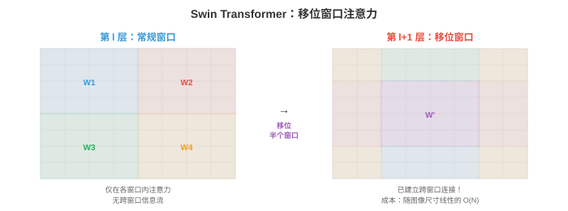
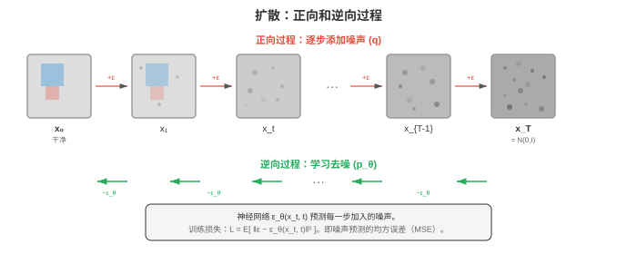

# 视觉 Transformer 与生成

*视觉 Transformer 将自注意力应用于图像块，以数据驱动的空间学习挑战 CNN 的主导地位。本节涵盖 ViT、DeiT、Swin Transformer、使用 GAN（StyleGAN）、VAE 和扩散模型（DDPM、Stable Diffusion）进行图像生成，以及超分辨率和神经风格迁移。*

- CNN（第 02 节）内置了强空间归纳偏置：局部连接、权重共享和变换等变性。视觉 Transformer（Vision Transformers，ViT）提出一个尖锐问题：如果完全移除这些偏置，仅用第 06 章的注意力机制让模型从数据中学习空间结构，会怎样？

!!! note "大白话"
    CNN 天生假定相邻像素有关；ViT 少做这些预设，把“图像怎么组织”更多交给数据自己教。

- **视觉 Transformer（Vision Transformer，ViT）**（Dosovitskiy 等，2021）将标准 Transformer 编码器直接应用于图像。核心思想是把图像视为图像块序列，正如 NLP 将文本视为 token 序列。

!!! note "大白话"
    ViT 把一张图切成许多小块，把每块当成一个词，再用读句子的 Transformer 来读图。

- 处理过程如下：
    1. 将图像（高度 $H$、宽度 $W$、通道数 $C$）切分为大小为 $P \times P$ 的互不重叠图像块网格。这会产生 $N = HW / P^2$ 个图像块。

        !!! note "大白话"
            第一步只是把整张图规整地切成小方块；图越大或块越小，得到的块就越多。

    2. 将每个图像块展平为长度 $P^2 \cdot C$ 的向量，并通过可学习线性嵌入投影到模型维度 $D$（一次矩阵乘法，见第 02 章）。

        !!! note "大白话"
            每个小方块先拉成一串数字，再转换成 Transformer 能处理的固定长度表示。

    3. 在序列前添加一个可学习的 **[CLS] token** 嵌入（类似第 07 章 BERT 的 [CLS]）。该 token 关注所有图像块，其最终表示用于分类。

        !!! note "大白话"
            [CLS] 像专门负责写整图总结的空白卡片，它从所有图像块收集信息后给出分类。

    4. 加入**位置嵌入（position embeddings）**（每个位置一个可学习向量）以提供空间信息，因为注意力对排列是等变的。

        !!! note "大白话"
            注意力本身不知道小块原来在左上还是右下，位置嵌入就是给每块贴上坐标标签。

    5. 将 $(N + 1)$ 个 token 嵌入的序列传入标准 Transformer 编码器（多头自注意力 + FFN，见第 06 章）。

        !!! note "大白话"
            Transformer 让每个小块能参考其他小块，组合出整张图的上下文。

    6. 将 [CLS] token 的最终表示传入分类头（一个小型 MLP）。

        !!! note "大白话"
            最后只用汇总后的 [CLS] 表示，让一个小分类器输出图片属于什么类别。

!!! note "大白话"
    这六步的核心是：把图片改写成带位置的小块序列，交给 Transformer 汇总，再根据汇总结果分类。

![ViT 流程：图像切分为 16x16 图像块，每个图像块展平并线性投影，前置 [CLS] token，加入位置嵌入，再由 Transformer 编码器块处理](../images/vit_pipeline.svg)

- **图像块嵌入（patch embedding）**等价于核大小为 $P$、步幅为 $P$ 的卷积（无重叠）。ViT 实际上将二维图像转换为一维序列，再用与语言相同的架构处理它。

!!! note "大白话"
    切块并编码这一步和不重叠卷积很像，只是输出不再排成二维特征图，而是排成序列。

- ViT 的归纳偏置少于 CNN：它不强制局部连接或变换等变性。这意味着它需要更多训练数据，才能从头学会空间结构。在小数据集上，CNN 优于 ViT；但在极大数据集（JFT-300M，3 亿张图像）上训练时，ViT 能匹配或超过最佳 CNN。这说明 CNN 的归纳偏置有助于数据效率，却不是最终性能的必要条件。

!!! note "大白话"
    ViT 的自由度更大，却也更“没常识”；数据少时 CNN 的先天规则帮了大忙，数据极多时 ViT 可以自己学会这些规则。

- ViT 自注意力相对于图像块数量的复杂度是 $O(N^2)$。对于使用 16x16 图像块的 224x224 图像，$N = 196$，仍可承受；但对于更高分辨率图像或更小图像块，二次成本会高得难以接受。

!!! note "大白话"
    每个图像块都和所有其他块互相比较，块数翻倍时比较次数大约变四倍，高分辨率会很贵。

- **DeiT**（Data-efficient Image Transformer，Touvron 等，2021）证明了只用 ImageNet（无需巨大的 JFT 数据集）也能有效训练 ViT，方法是使用强数据增强、正则化（随机深度、标签平滑、dropout）和**知识蒸馏（knowledge distillation）**：预训练 CNN 教师提供软标签，ViT 学生学习匹配它们。DeiT 在 [CLS] token 之外加入了**蒸馏 token（distillation token）**，训练它预测教师的输出。

!!! note "大白话"
    DeiT 让一个已经会看图的 CNN 当老师，帮助 ViT 在较少数据上学得更稳。

- **Swin Transformer**（Liu 等，2021）解决了 ViT 的两个主要限制：计算成本随图像尺寸二次增长，以及缺少检测和分割所需的层级特征图。

!!! note "大白话"
    Swin 的目标是让 Transformer 看大图时不爆算力，还能像 CNN 一样输出多种尺度的特征。

- Swin 引入**移位窗口（shifted windows）**：不在所有图像块上做全局自注意力，而是在局部窗口内计算注意力（如 7x7 图像块）。这使成本随图像尺寸线性增长，即 $O(N)$ 而不是 $O(N^2)$。但仅有局部窗口会阻止区域间的信息流动。

!!! note "大白话"
    先只让小窗口内部互相注意，计算量降很多；代价是不同窗口起初彼此看不见。

- **窗口移位（window shifting）**解决了这个问题：在交替层中，窗口划分移动半个窗口大小。这创造跨窗口连接，使信息可在多层之间流过图像的所有部分，而无需承担全局注意力成本。

!!! note "大白话"
    下一层把窗口边界挪开，原来分开的图像块就会落进同一窗口，信息便能逐层传过去。



- Swin 还通过跨阶段合并图像块构建**层级表示（hierarchical representation）**。每个阶段后，相邻 2x2 图像块被拼接并投影，使通道维度加倍、空间分辨率减半。这产生类似 CNN 和 FPN（第 03 节）的多尺度特征图，使 Swin 可直接兼容 Faster R-CNN 等检测头和 U-Net 等分割头。

!!! note "大白话"
    Swin 逐层把相邻小块合并，图会变粗但特征更丰富，于是同时有适合小目标和大目标的层。

- **PVT**（Pyramid Vision Transformer）采用类似的层级方法，并使用空间降采样注意力：每个阶段在计算注意力前对键和值做空间下采样，在保持全局感受野的同时降低二次成本。

!!! note "大白话"
    PVT 仍让查询看全图，但把供比较的键和值先缩小，尽量保住全局视野并减少计算。

- **自监督视觉学习（self-supervised visual learning）**从无标签图像训练表示。标签收集成本高，而图像数量充足。目标是无需任何人工标注就学习可良好迁移到下游任务的特征。

!!! note "大白话"
    自监督不靠人工写答案，而是从图像本身构造学习题目，先练出通用视觉能力。

- **对比学习（contrastive learning）**训练模型识别：同一图像的两个增强视图（“正对”）应有相似表示，不同图像的视图（“负对”）应有不相似表示。

!!! note "大白话"
    同一只猫被裁剪或变色后仍应被认成同一内容，不同图片则要在表示空间里拉开。

- **SimCLR**（Chen 等，2020）为批次中每张图像创建两个增强视图，用共享主干网络 + 投影头编码二者，并应用 **NT-Xent 损失**（归一化温度缩放交叉熵）：

$$\ell_{i,j} = -\log \frac{\exp(\text{sim}(z_i, z_j) / \tau)}{\sum_{k \neq i} \exp(\text{sim}(z_i, z_k) / \tau)}$$

!!! note "大白话"
    SimCLR 要求同图的两个版本靠近、别图远离；温度参数控制这种拉近和推远有多激进。

- 其中，$\text{sim}$ 是余弦相似度（第 01 章），$\tau$ 是温度参数。分子推动正对靠近，分母推动负对远离。SimCLR 需要较大的批量大小（4,096 以上）才能提供足够的负例。

!!! note "大白话"
    一批图越大，能拿来当“不同图”的对照就越多，因此 SimCLR 才依赖大批量。

- **MoCo**（Momentum Contrast，He 等，2020）通过维护一个**动量更新的队列（momentum-updated queue）**来解决大批量要求，该队列保存负嵌入。查询编码器通过梯度下降更新；键编码器是查询编码器的指数移动平均（EMA，第 04 章）：$\theta_k \leftarrow m \theta_k + (1 - m) \theta_q$，其中 $m = 0.999$。该队列保存最近的键嵌入，无需巨大批量即可提供大量且一致的负例。

!!! note "大白话"
    MoCo 像保留一条旧样本队列供比较，不必一次塞进几千张图；慢慢更新的键网络让队列里的表示不乱跳。

- **BYOL**（Bootstrap Your Own Latent，Grill 等，2020）完全取消了负对。它使用两个网络：“在线（online）”网络和“目标（target）”网络（在线网络的 EMA）。在线网络预测目标网络对另一个增强视图的表示。没有负例时，BYOL 通过预测头的不对称性和 EMA 目标网络避免坍塌问题（模型对所有输入输出同一向量）。

!!! note "大白话"
    BYOL 不用拿别图推远，而是让一个正在学习的网络去追另一个缓慢变化的自己，避免所有图片学成同一个答案。

- **DINO**（Self-Distillation with No Labels，Caron 等，2021）将自蒸馏应用于 ViT。学生网络预测教师网络（学生的 EMA）在不同增强视图上的输出。教师使用较大裁剪，学生使用较小裁剪。DINO 产生的特征含有明确的场景布局信息：DINO 训练的 ViT 的自注意力图无需任何分割监督就能自然地分割物体。

!!! note "大白话"
    DINO 让学生从局部裁剪猜教师看到的全局内容，结果会自然学到物体和背景的布局。

- **掩码图像建模（masked image modelling）**是第 07 章 BERT 掩码语言建模的视觉对应物。输入图像块中很大一部分被遮蔽，模型学习重建它们。

!!! note "大白话"
    这和完形填空一样：故意遮住大块图片，让模型根据剩下的部分补回来。

- **MAE**（Masked Autoencoders，He 等，2022）遮蔽 75% 的图像块，训练 ViT 编码器-解码器重建缺失的像素值。只有未遮蔽图像块经编码器处理（预训练时节省 4 倍计算），轻量解码器通过编码后的可见图像块和可学习的掩码 token 重建完整图像。

!!! note "大白话"
    MAE 故意遮掉四分之三的图，只让编码器处理剩下部分，再让轻量解码器补全，训练省算力也逼模型理解全局。

- **BEiT**（BERT Pre-training of Image Transformers，Bao 等，2022）遮蔽图像块，并预测离散视觉 token（由预训练 dVAE 分词器得到）而非原始像素。这对应 BERT 对离散词 token 的预测，并避免了像素重建中的低层细节。

!!! note "大白话"
    BEiT 不要求精确补回每个像素，而是预测图像块属于哪种视觉“词”，更关注高层内容。

- **图像生成（image generation）**旨在生成训练集中不存在的、逼真的新图像。核心挑战是对自然图像的高维概率分布建模。

!!! note "大白话"
    生成模型不是记住训练图再拿出来，而是学会“像真实图的规律”，从而造出没见过的新图。

- **生成对抗网络（Generative Adversarial Networks，GANs）**（Goodfellow 等，2014）使用两个竞争网络：从随机噪声创建假图像的**生成器（generator）** $G$，以及尝试区分真实图像与假图像的**判别器（discriminator）** $D$。它们以对抗方式训练：$G$ 试图欺骗 $D$，$D$ 试图识破 $G$。

$$\min_G \max_D \; \mathbb{E}_{x \sim p_{\text{data}}}[\log D(x)] + \mathbb{E}_{z \sim p(z)}[\log(1 - D(G(z)))]$$

!!! note "大白话"
    GAN 像造假者和鉴定师对抗：生成器努力以假乱真，判别器努力辨别真假，双方互相逼着变强。

- 生成器获取随机潜向量 $z$（从高斯等简单分布采样），经一系列转置卷积映射为图像。判别器是标准 CNN 分类器。在均衡时，$G$ 生成的图像与真实数据不可区分，$D$ 对所有输入输出 0.5。

!!! note "大白话"
    生成器从随机数开始画图，判别器负责挑刺；理想平衡时，鉴定师只能五五开地猜真假。

- **模式坍塌（mode collapse）**是 GAN 的主要失效模式：生成器学会只生成少数能欺骗判别器的图像类型，忽略训练数据的多样性。生成器找到一组很小的“安全”输出，而不是覆盖完整分布。

!!! note "大白话"
    如果 GAN 发现只画几种“稳妥”的脸就能过关，它会反复画相似图片，丢掉本该有的丰富变化。

- 稳定 GAN 的训练技巧包括：谱归一化（约束判别器的 Lipschitz 常数）、渐进增长（先在低分辨率训练，再逐步提高）、特征匹配（匹配判别器中间特征的统计量而非最终输出），以及使用 Wasserstein 距离替代原始 JS 散度目标。

!!! note "大白话"
    GAN 难在两边容易一强一弱失衡，这些技巧本质上是在限制判别器、循序加难度，让对抗别崩盘。

- **StyleGAN**（Karras 等，2019）是高质量图像合成中最有影响力的 GAN 架构。其关键创新是**基于风格的生成器（style-based generator）**：潜向量 $z$ 不直接输入生成器，而是先经**映射网络（mapping network）**（8 层 MLP）得到风格向量 $w$。这个风格向量通过**自适应实例归一化（adaptive instance normalisation，AdaIN）**注入生成器每一层，调制特征图统计量：

$$\text{AdaIN}(x, y) = y_{s} \cdot \frac{x - \mu(x)}{\sigma(x)} + y_{b}$$

!!! note "大白话"
    StyleGAN 把随机向量先翻译成各层的“风格旋钮”，不同层的旋钮分别调构图、五官和纹理。

- 其中 $y_s$ 和 $y_b$ 是从 $w$ 导出的缩放与偏置。不同层控制不同方面：早层控制粗粒度特征（姿势、脸型），中层控制中等特征（发型、眼睛），后层控制细节（雀斑、头发纹理）。StyleGAN 可在 1024x1024 分辨率生成照片级真实人脸。

!!! note "大白话"
    越靠前的层越管大结构，越靠后的层越管细节，所以可以有针对性地改变一张脸的某个层面。

- **变分自编码器（Variational Autoencoders，VAEs）**（第 06 章）提供另一种生成方法。与 GAN 不同，VAE 有原则性的概率框架和清晰的训练目标（ELBO）。它们生成的图像往往比 GAN 更模糊，但拥有更平滑、更具结构的潜空间。VAE 是潜空间扩散模型中将图像压缩至潜空间、再从潜空间还原图像的编码器-解码器对。

!!! note "大白话"
    VAE 的图有时不如 GAN 锐利，但它把图片整理成连续、有规律的潜空间，特别适合压缩和再还原。

- **扩散模型（diffusion models）**已经成为图像生成的主导范式，在质量和多样性上均超过 GAN。其思想直观：逐步向数据加入噪声，直到成为纯高斯噪声（**正向过程（forward process）**）；再学习逐步反转该过程（**逆向过程（reverse process）**）。

!!! note "大白话"
    扩散先研究怎样把图一步步毁成噪声，再学会反着一步步去噪，从随机噪点里画出图像。

- **正向过程**在 $T$ 个时间步中加入高斯噪声：

$$q(x_t | x_{t-1}) = \mathcal{N}(x_t; \sqrt{1 - \beta_t} \, x_{t-1}, \beta_t I)$$

!!! note "大白话"
    正向过程每走一步都掺一点随机噪声，走得足够久后，原图信息就几乎完全消失。

- 其中 $\beta_t$ 是随时间增加的噪声调度。经过足够步数后，$x_T$ 无论原始图像 $x_0$ 为何都近似纯高斯噪声。利用重参数化技巧（第 06 章）并设定 $\alpha_t = 1 - \beta_t$、$\bar{\alpha}_t = \prod_{s=1}^{t} \alpha_s$，可直接采样 $x_t$，其来自 $x_0$：

$$x_t = \sqrt{\bar{\alpha}_t} \, x_0 + \sqrt{1 - \bar{\alpha}_t} \, \epsilon, \quad \epsilon \sim \mathcal{N}(0, I)$$

!!! note "大白话"
    这个式子能直接跳到任意噪声程度：一部分保留原图，一部分换成随机噪声，比例由时间步决定。

- **逆向过程**学习去噪：从纯噪声 $x_T$ 开始，模型预测每步加入的噪声 $\epsilon$，将其减去以恢复 $x_{t-1}$。它由神经网络 $\epsilon_\theta$（通常是第 03 节的 U-Net）参数化，并以简单的 MSE 损失训练：

$$\mathcal{L} = \mathbb{E}_{t, x_0, \epsilon}\left[\|\epsilon - \epsilon_\theta(x_t, t)\|^2\right]$$

!!! note "大白话"
    训练时模型看一张带噪图和时间步，猜里面混进了什么噪声；猜准后减掉它，图就会更干净。



- **DDPM**（Denoising Diffusion Probabilistic Models，Ho 等，2020）建立了这一框架。采样需要遍历全部 $T$ 步（通常 1,000 步），因而较慢。**DDIM**（Denoising Diffusion Implicit Models，Song 等，2021）将采样过程改写为确定性映射，允许大幅跳步（如 50 步而非 1,000 步）且质量损失很小。

!!! note "大白话"
    DDPM 每次只去一点噪，质量好但慢；DDIM 找到更短的去噪路线，所以可以少走很多步。

- **基于分数的模型（score-based models）**（Song 和 Ermon，2019）提供另一种视角。模型不预测噪声 $\epsilon$，而是估计**分数函数（score function）** $\nabla_{x_t} \log p(x_t)$，即对数概率相对于带噪图像的梯度。这个梯度指向数据分布中概率更高、更干净的区域。采样使用 Langevin 动力学沿该梯度进行。基于分数的模型和 DDPM 已被统一到**随机微分方程（stochastic differential equations，SDEs）**框架中：正向过程是添加噪声的 SDE，逆向过程是时间反向的 SDE。

!!! note "大白话"
    分数模型不直接说“噪声是什么”，而是告诉你“往哪个方向走会更像真实图片”，然后沿这个方向慢慢移动。

- **无分类器引导（classifier-free guidance）**（Ho 和 Salimans，2022）控制样本质量和多样性之间的权衡。模型同时以有条件方式（带文本提示或类别标签）和无条件方式（随机丢弃条件）训练。采样时，预测是以下加权组合：

$$\hat{\epsilon} = \epsilon_\theta(x_t, \varnothing) + s \cdot (\epsilon_\theta(x_t, c) - \epsilon_\theta(x_t, \varnothing))$$

!!! note "大白话"
    无分类器引导把“按提示生成”和“自由生成”的差放大，让图更听提示，但不能放得过头。

- 其中 $c$ 是条件，$\varnothing$ 是空条件，$s > 1$ 是引导尺度。更高的 $s$ 会生成与条件匹配更强、但多样性较低的图像。$s = 1$ 给出无引导模型；$s = 7.5$ 是常见默认值。

!!! note "大白话"
    $s$ 是听提示的音量旋钮：开大更贴题，太大则容易重复、僵硬或出现瑕疵。

- **潜空间扩散（latent diffusion）**（Rombach 等，2022；Stable Diffusion）将扩散过程从像素空间移至学习得到的潜空间。预训练 VAE 编码器将图像压缩为低维潜表示（通常空间下采样 4 倍或 8 倍），扩散在压缩空间中运行，VAE 解码器从去噪潜变量重建像素。这样效率大幅提升：在像素空间扩散一张 512x512 图像需要处理 $512 \times 512 \times 3$ 张量，而在潜空间中只需处理 $64 \times 64 \times 4$ 张量。

!!! note "大白话"
    Stable Diffusion 不直接在巨大的像素图上去噪，而是在压缩后的“图像摘要”里工作，快得多再解码回来。

- 潜空间扩散中的去噪 U-Net 接收带噪潜变量、时间步（编码为正弦嵌入，类似 Transformer 的位置编码）和条件信号（来自冻结 CLIP 或 T5 文本编码器的文本嵌入）。文本条件通过 U-Net 内的交叉注意力层进入：文本嵌入作为键和值，图像特征作为查询。这使模型能在每个空间位置关注文本提示中相关的部分。

!!! note "大白话"
    生成时 U-Net 一边去噪，一边通过交叉注意力查阅提示词，决定画面每个位置该听哪个词。

- **流匹配（flow matching）**是新兴的扩散替代方案，它学习噪声与数据之间的直接传输路径，而非 DDPM 的迭代去噪。

!!! note "大白话"
    流匹配不把过程拆成许多次“猜噪声”，而是直接学习怎样把噪声平稳搬运成数据。

- **连续归一化流（continuous normalising flow，CNF）**定义一个随时间变化的速度场 $v_\theta(x, t)$，将样本沿平滑轨迹从简单分布 $p_0$（噪声）推向数据分布 $p_1$。变换遵循常微分方程（ODE）：

$$\frac{dx}{dt} = v_\theta(x, t), \quad t \in [0, 1]$$

!!! note "大白话"
    CNF 把生成看成一条连续移动轨迹：当前位置和时间决定下一瞬间该往哪个方向、以多快速度走。

- 从 $x_0 \sim \mathcal{N}(0, I)$ 开始，将 ODE 向前积分至 $t = 1$，即可产生一个数据分布样本。速度场由神经网络参数化，并训练为匹配目标条件流。

!!! note "大白话"
    从一个随机噪点出发，按模型给的速度不断前进，走到终点就得到一个看起来像真实数据的样本。

- **最优传输（optimal transport，OT）流匹配**（Lipman 等，2023）使用噪声与数据之间的直线路径作为目标流：从噪声样本 $x_0$ 到数据样本 $x_1$ 的条件路径为 $x_t = (1 - t) x_0 + t x_1$，目标速度为 $v = x_1 - x_0$。训练损失变为：

$$\mathcal{L} = \mathbb{E}_{t, x_0, x_1} \left[\|v_\theta(x_t, t) - (x_1 - x_0)\|^2\right]$$

!!! note "大白话"
    最优传输流匹配让噪声到数据尽量走直线，模型只需学会在路上的正确前进方向。

- **校正流（rectified flows）**（Liu 等，2022）迭代地拉直已学习的流路径。完成初始训练后，模型通过模拟 ODE 生成（噪声、数据）对。这些对比随机配对更为对齐，用于重新训练模型。重复该过程会产生越来越直的路径，可用更少 ODE 步数（甚至一步）穿过，从而实现极快生成。

!!! note "大白话"
    校正流先按现有路线生成样本，再用这些更匹配的起终点重训，把弯路逐渐拉直，生成时就能少走几步。

- 流匹配相比扩散有若干优势：训练目标更简单（直接速度回归，没有噪声调度），采样 ODE 更平滑（需要更少积分步），与最优传输的联系提供了理论基础。Stable Diffusion 3 和 Flux 使用流匹配而非传统 DDPM。

!!! note "大白话"
    它的吸引力在于训练和采样都更直接，若路径足够直，生成质量不变时速度可以更快。

## 编程任务（使用 CoLab 或 notebook）

1. 从零实现 ViT 图像块嵌入。将图像切分为图像块、展平、投影到模型维度，加入位置嵌入，并前置 [CLS] token。
```python
import jax
import jax.numpy as jnp
import matplotlib.pyplot as plt

def create_patch_embedding(image, patch_size, d_model, params):
    """Convert an image into a sequence of patch embeddings."""
    H, W, C = image.shape
    n_patches_h = H // patch_size
    n_patches_w = W // patch_size
    n_patches = n_patches_h * n_patches_w

    # Extract patches
    patches = []
    for i in range(n_patches_h):
        for j in range(n_patches_w):
            patch = image[i*patch_size:(i+1)*patch_size,
                          j*patch_size:(j+1)*patch_size, :]
            patches.append(patch.ravel())
    patches = jnp.stack(patches)  # (N, P*P*C)

    # Linear projection to d_model
    embeddings = patches @ params['proj_w'] + params['proj_b']  # (N, d_model)

    # Prepend CLS token
    cls_token = params['cls_token']  # (1, d_model)
    embeddings = jnp.concatenate([cls_token, embeddings], axis=0)  # (N+1, d_model)

    # Add position embeddings
    embeddings = embeddings + params['pos_embed']  # (N+1, d_model)

    return embeddings, patches

# Setup
H, W, C = 32, 32, 3
patch_size = 8
d_model = 64
n_patches = (H // patch_size) * (W // patch_size)  # 16

key = jax.random.PRNGKey(42)
keys = jax.random.split(key, 5)

# Create a synthetic image with distinct quadrants
image = jnp.zeros((H, W, C))
image = image.at[:16, :16, 0].set(1.0)   # red top-left
image = image.at[:16, 16:, 1].set(1.0)   # green top-right
image = image.at[16:, :16, 2].set(1.0)   # blue bottom-left
image = image.at[16:, 16:, :2].set(1.0)  # yellow bottom-right

params = {
    'proj_w': jax.random.normal(keys[0], (patch_size**2 * C, d_model)) * 0.02,
    'proj_b': jnp.zeros(d_model),
    'cls_token': jax.random.normal(keys[1], (1, d_model)) * 0.02,
    'pos_embed': jax.random.normal(keys[2], (n_patches + 1, d_model)) * 0.02,
}

embeddings, patches = create_patch_embedding(image, patch_size, d_model, params)

print(f"Image shape: {image.shape}")
print(f"Patch size: {patch_size}x{patch_size}")
print(f"Number of patches: {n_patches}")
print(f"Patch vector length: {patch_size**2 * C}")
print(f"Embedding shape: {embeddings.shape}  (CLS + {n_patches} patches)")

# Visualise patches
fig, axes = plt.subplots(2, 5, figsize=(14, 6))
axes[0, 0].imshow(image); axes[0, 0].set_title('Full Image'); axes[0, 0].axis('off')
for idx in range(min(9, n_patches)):
    ax = axes[(idx+1) // 5, (idx+1) % 5]
    patch_img = patches[idx].reshape(patch_size, patch_size, C)
    ax.imshow(patch_img); ax.set_title(f'Patch {idx}'); ax.axis('off')
plt.suptitle('ViT Patch Decomposition')
plt.tight_layout(); plt.show()
```

2. 实现简单 GAN 训练循环。在二维数据上训练生成器和判别器，并可视化生成分布如何收敛至真实分布。
```python
import jax
import jax.numpy as jnp
import matplotlib.pyplot as plt

def generator(z, params):
    h = jnp.tanh(z @ params['g_w1'] + params['g_b1'])
    h = jnp.tanh(h @ params['g_w2'] + params['g_b2'])
    return h @ params['g_w3'] + params['g_b3']

def discriminator(x, params):
    h = jax.nn.leaky_relu(x @ params['d_w1'] + params['d_b1'], 0.2)
    h = jax.nn.leaky_relu(h @ params['d_w2'] + params['d_b2'], 0.2)
    return jax.nn.sigmoid(h @ params['d_w3'] + params['d_b3'])

def init_params(key):
    keys = jax.random.split(key, 6)
    z_dim, h_dim, data_dim = 2, 32, 2
    scale = 0.1
    return {
        'g_w1': jax.random.normal(keys[0], (z_dim, h_dim)) * scale,
        'g_b1': jnp.zeros(h_dim),
        'g_w2': jax.random.normal(keys[1], (h_dim, h_dim)) * scale,
        'g_b2': jnp.zeros(h_dim),
        'g_w3': jax.random.normal(keys[2], (h_dim, data_dim)) * scale,
        'g_b3': jnp.zeros(data_dim),
        'd_w1': jax.random.normal(keys[3], (data_dim, h_dim)) * scale,
        'd_b1': jnp.zeros(h_dim),
        'd_w2': jax.random.normal(keys[4], (h_dim, h_dim)) * scale,
        'd_b2': jnp.zeros(h_dim),
        'd_w3': jax.random.normal(keys[5], (h_dim, 1)) * scale,
        'd_b3': jnp.zeros(1),
    }

def d_loss(params, real_data, fake_data):
    real_score = discriminator(real_data, params)
    fake_score = discriminator(fake_data, params)
    return -jnp.mean(jnp.log(real_score + 1e-7) + jnp.log(1 - fake_score + 1e-7))

def g_loss(params, fake_data):
    fake_score = discriminator(fake_data, params)
    return -jnp.mean(jnp.log(fake_score + 1e-7))

# Real data: ring distribution
key = jax.random.PRNGKey(42)
theta = jax.random.uniform(key, (512,)) * 2 * jnp.pi
real_data = jnp.stack([jnp.cos(theta), jnp.sin(theta)], axis=1)
real_data = real_data + jax.random.normal(key, real_data.shape) * 0.05

params = init_params(jax.random.PRNGKey(0))
d_grad = jax.grad(d_loss)
g_grad = jax.grad(g_loss)
lr = 0.001

snapshots = []
for step in range(3000):
    key, k1 = jax.random.split(key)
    z = jax.random.normal(k1, (512, 2))
    fake_data = generator(z, params)

    # Update discriminator
    grads = d_grad(params, real_data, fake_data)
    for k in ['d_w1', 'd_b1', 'd_w2', 'd_b2', 'd_w3', 'd_b3']:
        params[k] = params[k] - lr * grads[k]

    # Update generator
    fake_data = generator(z, params)
    grads = g_grad(params, fake_data)
    for k in ['g_w1', 'g_b1', 'g_w2', 'g_b2', 'g_w3', 'g_b3']:
        params[k] = params[k] - lr * grads[k]

    if step in [0, 500, 1500, 2999]:
        snapshots.append((step, fake_data.copy()))

fig, axes = plt.subplots(1, 4, figsize=(16, 4))
for ax, (step, fake) in zip(axes, snapshots):
    ax.scatter(real_data[:, 0], real_data[:, 1], s=5, alpha=0.3, c='#3498db', label='Real')
    ax.scatter(fake[:, 0], fake[:, 1], s=5, alpha=0.3, c='#e74c3c', label='Generated')
    ax.set_title(f'Step {step}'); ax.set_xlim(-2, 2); ax.set_ylim(-2, 2)
    ax.set_aspect('equal'); ax.legend(markerscale=3)
plt.suptitle('GAN Training: Generator Learns the Ring Distribution')
plt.tight_layout(); plt.show()
```

3. 实现扩散正向过程：在不断增加的时间步向图像加入噪声，并可视化逐渐损坏的过程。然后实现单步去噪。
```python
import jax
import jax.numpy as jnp
import matplotlib.pyplot as plt

def noise_schedule(T, beta_start=0.0001, beta_end=0.02):
    """Linear noise schedule."""
    betas = jnp.linspace(beta_start, beta_end, T)
    alphas = 1.0 - betas
    alpha_bars = jnp.cumprod(alphas)
    return betas, alphas, alpha_bars

def forward_diffusion(x0, t, alpha_bars, key):
    """Add noise to x0 at timestep t."""
    alpha_bar_t = alpha_bars[t]
    noise = jax.random.normal(key, x0.shape)
    xt = jnp.sqrt(alpha_bar_t) * x0 + jnp.sqrt(1 - alpha_bar_t) * noise
    return xt, noise

# Create a simple 2D "image" (checkerboard)
img = jnp.zeros((32, 32))
for i in range(4):
    for j in range(4):
        if (i + j) % 2 == 0:
            img = img.at[i*8:(i+1)*8, j*8:(j+1)*8].set(1.0)

T = 1000
betas, alphas, alpha_bars = noise_schedule(T)

# Visualise forward process
timesteps = [0, 50, 200, 500, 999]
key = jax.random.PRNGKey(42)

fig, axes = plt.subplots(1, len(timesteps), figsize=(16, 3.5))
for ax, t in zip(axes, timesteps):
    key, subkey = jax.random.split(key)
    xt, noise = forward_diffusion(img, t, alpha_bars, subkey)
    ax.imshow(xt, cmap='gray', vmin=-2, vmax=2)
    ax.set_title(f't={t}\n$\\bar{{\\alpha}}$={alpha_bars[t]:.3f}')
    ax.axis('off')
plt.suptitle('Diffusion Forward Process: Progressive Noise Addition')
plt.tight_layout(); plt.show()

# Simple denoising: train a tiny network to predict noise at t=200
t_denoise = 200
key, k1 = jax.random.split(key)
xt, true_noise = forward_diffusion(img, t_denoise, alpha_bars, k1)

# Tiny "denoiser": just learn a constant noise estimate (for illustration)
noise_estimate = jnp.zeros_like(img)
lr = 0.01
for step in range(100):
    residual = noise_estimate - true_noise
    noise_estimate = noise_estimate - lr * residual

# Reverse one step
alpha_bar_t = alpha_bars[t_denoise]
x_denoised = (xt - jnp.sqrt(1 - alpha_bar_t) * noise_estimate) / jnp.sqrt(alpha_bar_t)

fig, axes = plt.subplots(1, 3, figsize=(12, 4))
axes[0].imshow(img, cmap='gray'); axes[0].set_title('Original $x_0$'); axes[0].axis('off')
axes[1].imshow(xt, cmap='gray', vmin=-2, vmax=2)
axes[1].set_title(f'Noisy $x_{{200}}$'); axes[1].axis('off')
axes[2].imshow(x_denoised, cmap='gray')
axes[2].set_title('Denoised (one step)'); axes[2].axis('off')
plt.tight_layout(); plt.show()

mse = jnp.mean((x_denoised - img)**2)
print(f"Denoising MSE: {mse:.4f}")
```
