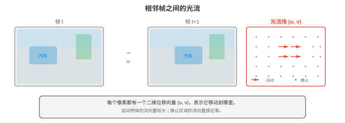

# 视频与三维视觉

*视频与三维视觉将图像理解扩展至时间域和空间域。本节涵盖光流、视频分类（3D CNN、TimeSformer）、目标跟踪（SORT、DeepSORT）、动作识别、深度估计（单目和立体）、点云、NeRF 和三维高斯泼溅。*

- 第 01 至 04 节将图像视为孤立的快照。但视觉世界是连续的：物体会移动，场景会变化，也存在深度。本节将计算机视觉扩展到时间域（视频）和空间域（三维），介绍模型如何理解运动、跟踪物体、估计深度和重建场景。

- **视频（video）**是按时间采集的一系列图像（帧）。以每秒 30 帧计，一段 10 秒的视频包含 300 帧。关键挑战是建模**时间维度（temporal dimension）**：物体如何移动、场景如何演化，以及如何关联各帧的信息？

- **光流（optical flow）**估计相邻两帧间像素的表观运动。对于第 $t$ 帧的每个像素，光流产生一个二维位移向量 $(u, v)$，指向该像素在第 $t+1$ 帧中移动的位置。结果是与图像同尺寸的稠密运动场。



- 光流建立在**亮度恒定假设（brightness constancy assumption）**上：像素在移动时其强度不变。若位置 $(x, y)$ 的像素在第 $t$ 帧中强度为 $I(x, y, t)$，并移动 $(u, v)$，时间间隔很小，为 $\delta t$：

$$I(x + u\delta t, \, y + v\delta t, \, t + \delta t) = I(x, y, t)$$

- 取一阶泰勒展开（第 03 章）并除以 $\delta t$：

$$I_x u + I_y v + I_t = 0$$

- 其中 $I_x, I_y$ 是空间梯度（第 01 节的 Sobel），$I_t$ 是时间梯度（连续帧之间的差分）。这就是**光流约束方程（optical flow constraint equation）**。一个方程、两个未知量（$u, v$），因此还需要额外约束。

- **Lucas-Kanade** 假设在小窗口内（如 5x5 像素）光流恒定。这给出超定系统（25 个方程、2 个未知量），用最小二乘法求解（第 06 章的法方程）：

```math
\begin{bmatrix} u \\ v \end{bmatrix} = \begin{bmatrix} \sum I_x^2 & \sum I_x I_y \\ \sum I_x I_y & \sum I_y^2 \end{bmatrix}^{-1} \begin{bmatrix} -\sum I_x I_t \\ -\sum I_y I_t \end{bmatrix}
```

- 该 2x2 矩阵是第 01 节的结构张量（也是 Harris 角点检测使用的矩阵）。Lucas-Kanade 对小运动有效，但当物体在帧间移动超过数个像素时会失效。

- **Farneback 方法**对每个像素邻域拟合多项式展开，并估计最能解释帧间变化的位移场。它产生稠密光流（每个像素一个向量），能处理比 Lucas-Kanade 更大的运动。

- 现代**深度学习光流（deep learning optical flow）**方法（FlowNet、RAFT）从帧对端到端学习预测光流。**RAFT**（Recurrent All-Pairs Field Transforms，Teed 和 Deng，2020）计算两帧中所有像素对之间的四维相关体，并使用基于 GRU 的更新算子迭代细化光流估计。RAFT 达到最先进准确率，已成为标准光流主干网络。

- **双流网络（two-stream networks）**（Simonyan 和 Zisserman，2014）是视频理解的早期方法。一条流处理单帧 RGB 图像（外观），另一条流处理一组光流帧（运动）。两条流在末端融合（通过平均或拼接）。该架构明确区分“物体长什么样”和“它们如何运动”。

- **三维卷积网络（3D Convolutional Networks）**将二维卷积扩展到时间维度。三维卷积应用大小为 $k \times k \times k_t$ 的滤波器，覆盖空间和时间维度，直接学习时空特征。

- **C3D**（Tran 等，2015）堆叠使用 3x3x3 滤波器的三维卷积，证明时间卷积无需显式光流也能学习运动特征。其成本很高：三维卷积的参数量和计算量是对应二维卷积的 $k_t$ 倍。

- **I3D**（Inflated 3D，Carreira 和 Zisserman，2017）采用更实用的方法：从预训练二维 CNN（如 Inception 或 ResNet）开始，通过沿时间维度重复权重并除以 $k_t$，将所有二维滤波器“膨胀”为三维。这将 ImageNet 预训练迁移到视频，同时增加时间建模。二维 $k \times k$ 滤波器变为 $k \times k \times k_t$ 滤波器，并初始化为 $W_{\text{3D}}[:,:,j] = W_{\text{2D}} / k_t$，适用于所有时间位置 $j$。

- **SlowFast 网络（SlowFast Networks）**（Feichtenhofer 等，2019）使用两个工作在不同时间分辨率的并行路径：
    - **Slow 路径（Slow pathway）**以低帧率处理帧（如每 16 帧取一帧），使用高空间分辨率和较多通道，捕捉精细空间细节。
    - **Fast 路径（Fast pathway）**以高帧率处理帧（每 2 帧取一帧），使用较低空间分辨率和较少通道（通常为 Slow 路径的 $1/8$），捕捉快速时间变化。
    - 横向连接通过步幅卷积将 Fast 信息融合到 Slow。

- 关键洞见是空间和时间信息有不同带宽需求：物体外观变化缓慢，而运动可以很快。SlowFast 在设计上匹配这种不对称性。

- **TimeSformer**（Bertasius 等，2021）将视觉 Transformer 应用于视频。它将完整时空注意力（成本为难以承受的 $O((T \times N)^2)$，其中有 $T$ 帧、每帧有 $N$ 个图像块）分解为**分离注意力（divided attention）**：每个块交替进行时间注意力（每个图像块在相同空间位置跨时间关注）与空间注意力（每个图像块在同一帧内跨空间关注）。这将成本从 $O(T^2 N^2)$ 降至 $O(T^2 + N^2)$。

- **VideoMAE**（Tong 等，2022）将掩码自编码器思想（第 04 节）扩展到视频。它使用极高掩码比例（90-95%），因为视频有很高时间冗余：相邻帧几乎相同，遮蔽大多数图像块后仍留有足够信息用于重建。VideoMAE 在无标签视频上预训练 ViT 主干网络，再迁移至下游任务。

- **动作识别（action recognition）**将视频片段分类为众多动作类别之一（如“跑步”“烹饪”“弹吉他”）。它是图像分类的视频对应物。标准基准包括 Kinetics-400（400 个动作类别、约 30 万段视频）、Something-Something（174 种需要时间推理的细粒度动作）和 ActivityNet（200 个类别及长的未裁剪视频）。

- **时间动作检测（temporal action detection）**超越了分类：给定一段长的未裁剪视频，找出每个动作的开始时间、结束时间和类别。这是目标检测在时间上的对应物。ActionFormer 等方法使用 Transformer 处理时间特征并预测动作边界。

- **视频目标跟踪（video object tracking）**在第一帧识别出特定物体后，跨帧跟随它。

- **SORT**（Simple Online and Realtime Tracking，Bewley 等，2016）将检测模型（独立检测每一帧中的物体）与用于运动预测的**卡尔曼滤波器（Kalman filter）**和用于分配的**匈牙利算法（Hungarian algorithm）**结合。

- **卡尔曼滤波器**为每个被跟踪物体维护状态估计（位置、速度、大小），并用线性运动模型预测它在下一帧的位置。新检测到达时，卡尔曼滤波器将预测与观测按各自不确定性加权组合，更新估计。这是第 05 章贝叶斯更新在跟踪中的应用。

- **匈牙利算法**解决双线性分配问题：给定 $M$ 个被跟踪物体和 $N$ 个新检测，寻找使总成本最小的最优一对一匹配（使用第 03 节的 IoU 距离）。未匹配的检测开始新轨迹，未匹配的轨迹在宽限期后终止。

- **DeepSORT** 通过增加**深度外观特征（deep appearance feature）**扩展 SORT：每个检测到的物体通过小型 CNN，产生外观嵌入（描述子向量）。匹配成本结合 IoU 距离和嵌入空间中的余弦距离（第 01 章）。这处理遮挡和重识别：即使一个物体在另一个物体后面消失数帧，其重现时仍可由外观嵌入重新匹配。

- **ByteTrack**（Zhang 等，2022）通过使用每个检测（包括低置信度检测）改进跟踪。大多数跟踪器会丢弃低于置信度阈值的检测。ByteTrack 先将高置信度检测匹配至现有轨迹，再将剩余低置信度检测匹配至未匹配轨迹。这可恢复暂时被遮挡或模糊的物体（因此它们的检测置信度低）。

- **三维视觉（3D vision）**恢复二维图像投影中丢失的第三空间维度（第 01 节）。

- **深度估计（depth estimation）**预测场景中每个点到相机的距离。

- **立体深度（stereo depth）**使用两台相机，它们相距已知基线 $b$。同一物点在左右图像中会出现在不同的水平位置（该偏移称为**视差（disparity）** $d$）。深度与视差成反比：

$$Z = \frac{f \cdot b}{d}$$

- 其中 $f$ 是焦距，$b$ 是基线距离。计算视差要求在两张图像中寻找对应点（立体匹配），这是沿水平扫描线的一维搜索（相机水平对齐时，三维中同一高度的点会投影到两张图像的同一行）。

- **单目深度估计（monocular depth estimation）**从单张图像预测深度，这在根本上是不适定的（无限多个三维场景可产生同一二维图像）。但人类能利用相对大小、纹理梯度、遮挡和大气雾霾等线索轻松完成。深度网络从训练数据中学习这些线索。

- **MiDaS** 和 **Depth Anything** 等模型从单张图像预测相对深度图（对物体远近排序）。它们在多样数据集上以尺度不变损失训练，尽管理论上存在歧义，仍能产生非常准确的结果。

- **点云（point clouds）**是三维点 $(x, y, z)$ 的集合，可选地带有颜色或其他属性，由 LiDAR 传感器或立体重建采集。与图像不同，点云没有顺序且分布不规则。

- **PointNet**（Qi 等，2017）通过对每个点独立应用共享 MLP，再用最大池化聚合（这对排列不变，解决顺序问题），直接处理点云。**PointNet++** 增加层级分组，在多个尺度捕捉局部结构。

- **神经辐射场（Neural Radiance Fields，NeRFs）**（Mildenhall 等，2020）将三维场景表示为连续函数：它把三维位置 $(x, y, z)$ 和视线方向 $(\theta, \phi)$ 映射为颜色 $(r, g, b)$ 和密度 $\sigma$。该函数由 MLP 参数化：

$$F_\theta: (x, y, z, \theta, \phi) \to (r, g, b, \sigma)$$

- 为渲染一个像素，从相机穿过该像素向场景发射一条射线。沿射线采样点，MLP 预测每点的颜色与密度。像素颜色通过**体渲染（volume rendering）**计算：沿射线积分由密度加权的颜色：

$$C(\mathbf{r}) = \int_{t_n}^{t_f} T(t) \cdot \sigma(\mathbf{r}(t)) \cdot \mathbf{c}(\mathbf{r}(t), \mathbf{d}) \, dt$$

- 其中 $T(t) = \exp(-\int_{t_n}^{t} \sigma(\mathbf{r}(s)) \, ds)$ 是累积透射率（至今为止被吸收的光量）。实践中，该积分通过沿射线采样 $N$ 个点并求和近似：

$$\hat{C} = \sum_{i=1}^{N} T_i \cdot (1 - \exp(-\sigma_i \delta_i)) \cdot c_i$$

- NeRF 通过最小化渲染像素与一组带位姿照片中的真实像素之间的 MSE 来训练。训练后，NeRF 可从任意相机位置渲染照片级真实的新视角。其限制是速度：渲染需评估 MLP 数百万次（每个像素的每个采样点一次），因此很难实时渲染。

- **三维高斯泼溅（3D Gaussian Splatting）**（Kerbl 等，2023）以一组三维高斯元而非连续体函数表示场景，解决 NeRF 的速度限制。每个高斯元包含三维位置（均值）、三维协方差矩阵（控制形状和方向）、不透明度和颜色（以球谐函数表示视角相关效应）。

- 渲染将每个三维高斯元投影到图像平面（得到二维高斯“泼溅”），按深度排序，并用 alpha 混合从前到后合成。这是可在 GPU 上实时运行（100+ FPS）的光栅化过程，速度比 NeRF 的射线步进高几个数量级。高斯泼溅达到或超过 NeRF 质量，同时支持实时渲染。

- **SLAM**（Simultaneous Localisation and Mapping，同时定位与建图）是在未知环境中构建地图，同时跟踪相机在其中位置的问题。它是机器人学、自动驾驶和 AR 的基础。

- **视觉里程计（visual odometry）**通过跨图像跟踪特征，逐帧估计相机运动。连续帧间匹配特征点（第 01 节的 SIFT、ORB），并从对应关系中利用**本质矩阵（essential matrix）**估计相机旋转和平移（该矩阵编码两个视图的几何关系，推导自第 01 节的内参和外参）。

- **基于特征的 SLAM（feature-based SLAM）**通过维护持久地图扩展视觉里程计。**ORB-SLAM**（Mur-Artal 等，2015）是最广泛使用的基于特征的 SLAM 系统。它有三个并行线程：
    1. **跟踪（tracking）**：将每个新帧中的 ORB 特征与地图匹配，使用 PnP（Perspective-n-Point）和 RANSAC 估计相机位姿。
    2. **局部建图（local mapping）**：从匹配特征三角化新的地图点，通过光束法平差优化它们位置（最小化能看到每个点的所有视图中的重投影误差）。
    3. **回环检测（loop closure）**：检测相机何时重访先前已建图的区域（使用词袋模型），再通过全局优化地图来校正累计漂移。

- **LiDAR SLAM** 使用 LiDAR 传感器的三维点云替代（或补充）相机图像。LiDAR 提供直接深度测量，使几何估计更稳健，但硬件成本更高。LOAM（LiDAR Odometry and Mapping）等方法用迭代最近点（ICP）对齐，将连续扫描间的点云配准。

- **视觉惯性 SLAM（Visual-Inertial SLAM）**融合相机数据与 IMU（加速度计 + 陀螺仪）测量。IMU 提供高频旋转和加速度估计，弥合相机帧之间的间隔，并应对快速运动或暂时失去视觉特征的情况。

- **VR/AR** 应用是计算机视觉要求最高的消费者之一。

- **姿态估计（pose estimation）**从图像确定人体（或面部、手部）的位置和方向。**身体姿态（body pose）**通常表示为一组二维或三维关键点位置（关节：肩、肘、腕、髋、膝、踝）。**OpenPose** 和 **MediaPipe** 等模型使用热力图回归预测这些关键点：每个关节对应一个热力图，峰值表示关节位置。

- **自顶向下（top-down）**方法先用边界框检测器（第 03 节）检测人物，再在每个框内估计姿态。**自底向上（bottom-up）**方法先检测图像中的所有关键点，再使用部件亲和场（编码相连关节关联关系的向量场）将它们分组为不同个体。

- **场景重建（scene reconstruction）**从传感器数据构建环境的三维模型。在 AR 中，它支持将虚拟物体放到真实表面上、将虚拟物体遮挡在真实物体后，并投射虚拟阴影。实时场景重建方法（如 ARKit 和 ARCore 中基于深度传感器的系统）构建随用户移动而更新的稀疏环境网格。

- VR 中的**实时渲染（real-time rendering）**约束极端：双眼都需要在 90+ FPS 下分别渲染（避免晕动症），从头部运动到显示更新的延迟需低于 20 毫秒。**注视点渲染（foveated rendering）**（使用眼动追踪，只在用户注视位置高分辨率渲染）和**重投影（reprojection）**（根据新头部姿态扭曲前一帧，在下一帧渲染时填补间隙）等技术是满足这些约束的关键。

- 实时神经渲染（三维高斯泼溅）、稳健跟踪（视觉惯性 SLAM）和高效姿态估计的融合，正在使照片级真实、可交互的 AR/VR 体验越来越可行。

## 编程任务（使用 CoLab 或 notebook）

1. 从零实现 Lucas-Kanade 光流算法。计算方块向右移动时两个合成帧之间的光流。
```python
import jax.numpy as jnp
import matplotlib.pyplot as plt

def lucas_kanade(frame1, frame2, window_size=5):
    """Lucas-Kanade optical flow."""
    # Compute gradients
    Ix = jnp.zeros_like(frame1)
    Iy = jnp.zeros_like(frame1)
    It = frame2 - frame1

    # Sobel-like gradients
    Ix = Ix.at[1:-1, :].set((frame1[2:, :] - frame1[:-2, :]) / 2)
    Iy = Iy.at[:, 1:-1].set((frame1[:, 2:] - frame1[:, :-2]) / 2)

    H, W = frame1.shape
    half_w = window_size // 2
    u = jnp.zeros_like(frame1)
    v = jnp.zeros_like(frame1)

    for i in range(half_w, H - half_w):
        for j in range(half_w, W - half_w):
            Ix_win = Ix[i-half_w:i+half_w+1, j-half_w:j+half_w+1].ravel()
            Iy_win = Iy[i-half_w:i+half_w+1, j-half_w:j+half_w+1].ravel()
            It_win = It[i-half_w:i+half_w+1, j-half_w:j+half_w+1].ravel()

            A = jnp.stack([Ix_win, Iy_win], axis=1)
            ATA = A.T @ A
            ATb = -A.T @ It_win

            # Check if the system is well-conditioned
            det = ATA[0,0] * ATA[1,1] - ATA[0,1] * ATA[1,0]
            if jnp.abs(det) > 1e-6:
                flow = jnp.linalg.solve(ATA, ATb)
                u = u.at[i, j].set(flow[0])
                v = v.at[i, j].set(flow[1])

    return u, v

# Create two frames: a white square that moves right
frame1 = jnp.zeros((64, 64))
frame1 = frame1.at[20:40, 15:35].set(1.0)

frame2 = jnp.zeros((64, 64))
frame2 = frame2.at[20:40, 20:40].set(1.0)  # shifted 5 pixels right

u, v = lucas_kanade(frame1, frame2, window_size=7)

# Visualise
fig, axes = plt.subplots(1, 3, figsize=(14, 4))
axes[0].imshow(frame1, cmap='gray'); axes[0].set_title('Frame 1'); axes[0].axis('off')
axes[1].imshow(frame2, cmap='gray'); axes[1].set_title('Frame 2'); axes[1].axis('off')

# Quiver plot of flow (subsample for clarity)
step = 4
Y, X = jnp.mgrid[0:64:step, 0:64:step]
axes[2].imshow(frame1, cmap='gray', alpha=0.5)
axes[2].quiver(X, Y, u[::step, ::step], v[::step, ::step],
               color='#e74c3c', scale=50, width=0.005)
axes[2].set_title('Optical Flow'); axes[2].axis('off')

plt.tight_layout(); plt.show()

# Check average flow in the moving region
region_u = u[20:40, 15:35]
print(f"Average horizontal flow in object region: {region_u[region_u != 0].mean():.2f} pixels")
```

2. 为二维目标跟踪实现简单卡尔曼滤波器。模拟带噪轨迹，并展示卡尔曼滤波器如何平滑估计。
```python
import jax
import jax.numpy as jnp
import matplotlib.pyplot as plt

def kalman_predict(x, P, F, Q):
    """Kalman filter prediction step."""
    x_pred = F @ x
    P_pred = F @ P @ F.T + Q
    return x_pred, P_pred

def kalman_update(x_pred, P_pred, z, H, R):
    """Kalman filter update step."""
    y = z - H @ x_pred                        # innovation
    S = H @ P_pred @ H.T + R                  # innovation covariance
    K = P_pred @ H.T @ jnp.linalg.inv(S)      # Kalman gain
    x_updated = x_pred + K @ y
    P_updated = (jnp.eye(len(x_pred)) - K @ H) @ P_pred
    return x_updated, P_updated

# State: [x, y, vx, vy]
dt = 1.0
F = jnp.array([[1, 0, dt, 0],    # state transition
                [0, 1, 0, dt],
                [0, 0, 1, 0],
                [0, 0, 0, 1]])
H = jnp.array([[1, 0, 0, 0],     # observation: we measure x, y
                [0, 1, 0, 0]])
Q = jnp.eye(4) * 0.01            # process noise
R = jnp.eye(2) * 4.0             # measurement noise (noisy detector)

# Simulate ground truth: circular motion
n_steps = 50
t = jnp.linspace(0, 2 * jnp.pi, n_steps)
true_x = 10 * jnp.cos(t) + 20
true_y = 10 * jnp.sin(t) + 20

# Noisy observations
key = jax.random.PRNGKey(42)
noise = jax.random.normal(key, (n_steps, 2)) * 2.0
obs_x = true_x + noise[:, 0]
obs_y = true_y + noise[:, 1]

# Run Kalman filter
x = jnp.array([obs_x[0], obs_y[0], 0.0, 0.0])  # initial state
P = jnp.eye(4) * 10.0                             # initial uncertainty

kalman_x, kalman_y = [], []
for i in range(n_steps):
    x, P = kalman_predict(x, P, F, Q)
    z = jnp.array([obs_x[i], obs_y[i]])
    x, P = kalman_update(x, P, z, H, R)
    kalman_x.append(x[0])
    kalman_y.append(x[1])

kalman_x = jnp.array(kalman_x)
kalman_y = jnp.array(kalman_y)

# Visualise
plt.figure(figsize=(8, 8))
plt.plot(true_x, true_y, 'k-', linewidth=2, label='Ground Truth')
plt.scatter(obs_x, obs_y, c='#e74c3c', s=20, alpha=0.5, label='Noisy Observations')
plt.plot(kalman_x, kalman_y, '#3498db', linewidth=2, label='Kalman Filter')
plt.legend(); plt.grid(alpha=0.3)
plt.title('Kalman Filter Tracking')
plt.xlabel('x'); plt.ylabel('y')
plt.axis('equal'); plt.show()

obs_error = jnp.mean(jnp.sqrt((obs_x - true_x)**2 + (obs_y - true_y)**2))
kalman_error = jnp.mean(jnp.sqrt((kalman_x - true_x)**2 + (kalman_y - true_y)**2))
print(f"Observation RMSE: {obs_error:.2f}")
print(f"Kalman filter RMSE: {kalman_error:.2f}")
print(f"Error reduction: {(1 - kalman_error/obs_error) * 100:.1f}%")
```

3. 实现简化的 NeRF 风格体渲染（volume rendering）流程。让光线穿过简单的三维场景（已知颜色和密度的球体），并沿每条光线积分，渲染出图像。
```python
import jax
import jax.numpy as jnp
import matplotlib.pyplot as plt

def render_ray(origin, direction, spheres, n_samples=64, t_near=1.0, t_far=6.0):
    """Volume render a single ray through a scene of spheres."""
    t_vals = jnp.linspace(t_near, t_far, n_samples)
    deltas = jnp.concatenate([jnp.diff(t_vals), jnp.array([1e-3])])

    colour = jnp.zeros(3)
    transmittance = 1.0

    for i in range(n_samples):
        point = origin + t_vals[i] * direction

        # Compute density and colour at this point
        density = 0.0
        point_colour = jnp.zeros(3)

        for center, radius, col, sigma in spheres:
            dist = jnp.linalg.norm(point - center)
            # Soft sphere: density falls off with distance from surface
            d = jnp.exp(-jnp.maximum(0, dist - radius) * sigma) * sigma
            density += d
            point_colour += d * jnp.array(col)

        # Normalise colour by total density
        point_colour = jnp.where(density > 1e-6, point_colour / density, point_colour)

        # Volume rendering equation
        alpha = 1.0 - jnp.exp(-density * deltas[i])
        colour += transmittance * alpha * point_colour
        transmittance *= (1.0 - alpha)

    return colour

# Scene: three coloured spheres
spheres = [
    (jnp.array([0.0, 0.0, 4.0]), 0.8, [1.0, 0.2, 0.2], 5.0),   # red
    (jnp.array([1.5, 0.5, 5.0]), 0.6, [0.2, 1.0, 0.2], 5.0),   # green
    (jnp.array([-1.0, -0.5, 3.5]), 0.5, [0.2, 0.2, 1.0], 5.0), # blue
]

# Camera setup
img_h, img_w = 64, 64
focal = 60.0
origin = jnp.array([0.0, 0.0, 0.0])

image = jnp.zeros((img_h, img_w, 3))
for i in range(img_h):
    for j in range(img_w):
        # Compute ray direction
        px = (j - img_w / 2) / focal
        py = -(i - img_h / 2) / focal
        direction = jnp.array([px, py, 1.0])
        direction = direction / jnp.linalg.norm(direction)

        colour = render_ray(origin, direction, spheres)
        image = image.at[i, j].set(jnp.clip(colour, 0, 1))

plt.figure(figsize=(6, 6))
plt.imshow(image)
plt.title('NeRF-style Volume Rendering\n(3 spheres)')
plt.axis('off')
plt.tight_layout(); plt.show()
print(f"Image shape: {image.shape}")
print(f"Rendered {img_h * img_w} rays with 64 samples each")
```
