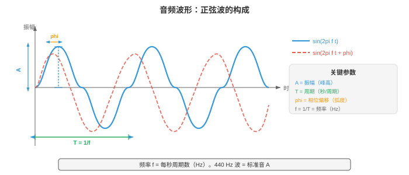
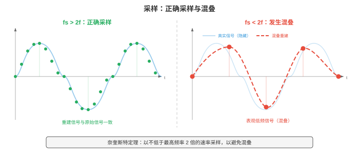
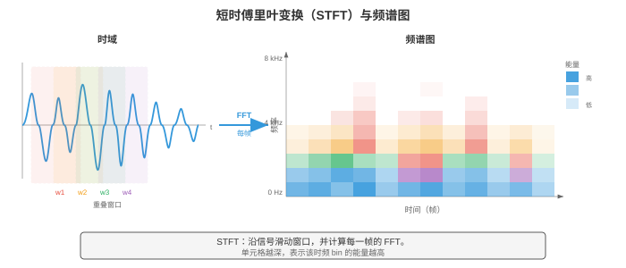
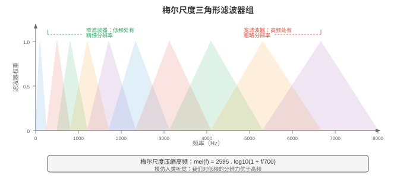
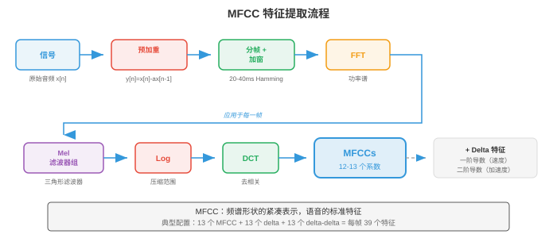

# 数字信号处理

*数字信号处理（digital signal processing, DSP）将原始音频波形转化为机器学习模型可学习的结构化表示。本节涵盖声音物理、采样与量化、傅里叶变换（DFT、FFT）、频谱图、梅尔滤波器组、MFCC 和加窗，它们构成所有语音与音频 AI 的特征提取流程。*

- **声音（sound）**是在介质（空气、水、固体）中传播的压力波。振动物体（声带、吉他弦、扬声器振膜）推动和拉动空气分子，形成高压的压缩区与低压的稀疏区交替出现的区域。

- 这些压力变化在空气中以约 343 m/s 向外传播，到达耳朵后使鼓膜振动，并被转换为神经信号。

- 可以把声音想象成向静止池塘中投下一块石头：石头是振动源，涟漪是压力波，水面上随波起伏的软木塞则是对到达波作出响应的麦克风或鼓膜。

- 软木塞上下起伏的高度是**振幅（amplitude）**，每秒起伏的次数是**频率（frequency）**，而波到达时它从起伏顶部还是底部开始，则是**相位（phase）**。

- **波形（waveform）**是压力（或麦克风将声音转换为电信号后的电压）随时间变化的图。最简单的波形是**纯音（pure tone）**，即单一正弦波：

$$x(t) = A \sin(2\pi f t + \phi)$$

- 其中：
    - $A$ 是振幅（相对零点的峰值偏离量，决定响度），
    - $f$ 是以 Hz 为单位的频率（每秒周期数，决定音高），
    - $\phi$ 是以弧度表示的相位（波的时间偏移）。

- **周期（period）**为 $T = 1/f$，即一个完整循环持续的时间。



- **振幅（amplitude）**决定感知到的响度。振幅加倍，功率变为四倍（因为功率与振幅平方成正比）。

- 人耳可听的振幅范围极大，因此使用对数尺度，即**分贝（decibel, dB）**。声压级为：

$$L = 20 \log_{10}\left(\frac{A}{A_\text{ref}}\right) \text{ dB}$$

- 其中 $A_\text{ref}$ 是参考振幅（通常为听阈，$20 \mu\text{Pa}$）。耳语约为 30 dB，正常交谈约为 60 dB，摇滚演唱会约为 110 dB。每增加 6 dB，振幅大致加倍；每增加 10 dB，感知响度大致加倍。这里的对数与第 03 章中的函数相同。

- **频率（frequency）**决定音高。低频（20-250 Hz）听起来低沉，高频（2000-20000 Hz）听起来明亮。人类听觉范围约为 20 Hz 至 20 kHz。音乐会标准音 A 为 440 Hz。频率加倍，音高升高一个**八度（octave）**。

- 大多数自然声音并非纯音，而是许多频率的复杂混合。这就是钢琴和小提琴弹奏同一音符时听感不同的原因：它们有相同的**基频（fundamental frequency）**，但其**谐波（harmonics）**（基频的整数倍）及各自相对振幅不同，形成不同的**音色（timbre）**。

- **相位（phase）**决定波从其循环中的何处开始。振幅和频率相同、相位不同的两列波可以发生建设性干涉（相位对齐，振幅相加），也可以发生破坏性干涉（相位相反，振幅抵消）。

- 相位对立体声音频和波束形成至关重要；但在许多语音处理流程中，它大多被舍弃，因为人类对音高和音色的感知基本不受相位影响。

- 真实世界中的音频信号是时间的**连续（continuous）**函数，而计算机处理离散数值。**采样（sampling）**通过以固定时间间隔测量信号值，将连续信号转换为离散序列。

- **采样率（sample rate）** $f_s$ 是每秒测量的次数。CD 音频使用 $f_s = 44{,}100$ Hz；电话通信使用 8000 Hz；现代语音模型通常使用 16000 Hz。

- **奈奎斯特-香农采样定理（Nyquist-Shannon sampling theorem）**指出，当且仅当采样率至少为信号所含最高频率的两倍时，连续信号才能由其样本完全重建：

$$f_s \geq 2 f_\text{max}$$

- 频率 $f_s / 2$ 称为**奈奎斯特频率（Nyquist frequency）**。若信号包含高于奈奎斯特频率的成分，它们会折叠回有效范围，伪装成错误的低频成分；这种现象称为**混叠（aliasing）**。混叠不可逆：一旦发生，便无法由样本恢复原始信号。

- 混叠的日常类比是电影中的车轮倒转效应：略高于帧率转动的车轮看起来会缓慢反向转动，因为相机对旋转采样不足。在音频中，以 16 kHz 采样的 15 kHz 音调（$f_\text{Nyquist} = 8$ kHz）会混叠为 $16 - 15 = 1$ kHz，成为完全不同的音高。



- 为防止混叠，采样前使用**抗混叠滤波器（anti-aliasing filter）**（低通滤波器）去除所有高于 $f_s/2$ 的频率。这由模数转换器（ADC）硬件在信号数字化前完成。

- **量化（quantisation）**将每个连续值样本映射到有限个量化级中最接近的值。一个 $n$ 位量化器有 $2^n$ 个量化级。CD 音频使用 16 位量化（$2^{16} = 65{,}536$ 个量化级）；电话通信常使用 8 位量化及 $\mu$ 律或 A 律**压扩（companding）**（一种给小振幅分配更多量化级的非线性映射，以匹配人类感知）。量化会引入**量化噪声（quantisation noise）**，这是一种舍入误差，其方差为 $\Delta^2/12$，其中 $\Delta$ 是量化级之间的步长。

- **时域分析（time-domain analysis）**直接从波形中提取特征，不将其转换到其他域。这些特征简单、计算快，能捕捉信号的基本性质。

- 由 $N$ 个样本组成的帧的**能量（energy）**衡量整体响度：

$$E = \sum_{n=0}^{N-1} x[n]^2$$

- 语音片段能量高，静音能量低。能量就是第 01 章的平方 $\ell_2$ 范数应用于信号向量。

- **过零率（zero-crossing rate, ZCR）**统计信号在一帧内改变符号的频率：

$$\text{ZCR} = \frac{1}{2(N-1)} \sum_{n=1}^{N-1} |\text{sign}(x[n]) - \text{sign}(x[n-1])|$$

- 高 ZCR 表示高频内容或噪声；低 ZCR 表示低频或有声语音（声带以周期方式振动）。ZCR 是粗略的频率估计器：频率为 $f$ Hz 的纯音每秒过零 $2f$ 次。

- **自相关（autocorrelation）**衡量一个信号与其延迟副本有多相似：

$$R[k] = \sum_{n=0}^{N-1-k} x[n] \cdot x[n+k]$$

- 在延迟 $k = 0$ 处，自相关等于能量。对周期信号而言，自相关在等于周期及其倍数的延迟位置出现峰值。这是进行**音高检测（pitch detection）**的标准技术：寻找 $R[k]$ 在 $k=0$ 之后的第一个显著峰，其音高为 $f_s / k_\text{peak}$。自相关与第 01 章的点积有关：$R[k]$ 是信号与其平移 $k$ 位后的版本之间的点积。

- **频域分析（frequency-domain analysis）**揭示信号的频谱内容，即波形中看不见的信息。核心工具是**离散傅里叶变换（Discrete Fourier Transform, DFT）**，它将含 $N$ 个样本的信号分解为 $N$ 个复数频率分量：

$$X[k] = \sum_{n=0}^{N-1} x[n] \cdot e^{-j 2\pi k n / N}, \quad k = 0, 1, \ldots, N-1$$

- 每个 $X[k]$ 都是复数，其幅值 $|X[k]|$ 给出频率 $f_k = k \cdot f_s / N$ Hz 分量的振幅，相位 $\angle X[k]$ 给出相位偏移。DFT 是从时域基（单位冲激）到频域基（复指数）的换基，直接应用了第 02 章的基概念。DFT 可写成矩阵乘法 $\mathbf{X} = W \mathbf{x}$，其中 $W$ 是 $N \times N$ 的 DFT 矩阵，其元素为 $W_{kn} = e^{-j2\pi kn/N}$。

- **快速傅里叶变换（Fast Fourier Transform, FFT）**是一种算法，它通过递归地将问题拆成偶数索引和奇数索引子问题（Cooley-Tukey 算法），以 $O(N \log N)$ 次操作计算 DFT，而非朴素方法所需的 $O(N^2)$ 次。这一加速使实时频谱分析成为现实。FFT 是整个计算领域最重要的算法之一。

- **功率谱（power spectrum）** $|X[k]|^2$ 显示能量在各频率间的分布；**幅度谱（magnitude spectrum）** $|X[k]|$ 显示振幅。绘制它们可揭示哪些频率占主导：元音在基频整数倍处有强谐波；擦音（如 “s”）有宽广的高频能量。

- **频谱图（spectrogram）**是信号频率内容随时间变化的可视化表示。计算方法是将信号切成重叠的短帧，对每帧计算 FFT，再将所得幅度谱并排堆叠。横轴是时间，纵轴是频率，每个点的颜色（或亮度）表示幅度。频谱图是音频处理最重要的可视化方式。



- **梅尔尺度（mel scale）**是反映人类如何感知音高的感知频率尺度。人类将相等的频率比感知为相等的音高间隔（正如我们将相等的强度比感知为相等的响度间隔）。在约 1000 Hz 以下，梅尔尺度近似线性；在 1000 Hz 以上，它近似对数：

$$m = 2595 \log_{10}\left(1 + \frac{f}{700}\right)$$

- 其反函数为 $f = 700(10^{m/2595} - 1)$。梅尔尺度解释了音乐半音为何在对数频率轴上等距：A4（440 Hz）至 A5（880 Hz），以及 A5 至 A6（1760 Hz），尽管 Hz 间隔分别是 440 与 880，听起来都是“升高一个八度”。

- **梅尔滤波器组（mel filterbank）**是一组三角形带通滤波器，它们在梅尔尺度上均匀分布。每个滤波器覆盖一个频带，并将该频带内的频谱能量相加，产生一个数值。典型语音系统使用 40-80 个梅尔滤波器。低频滤波器较窄（在人耳敏感处有较高频率分辨率），高频滤波器较宽（在人耳较不敏感处有较低分辨率）。这模仿了人类耳蜗的频率分辨率。



- **梅尔频率倒谱系数（Mel-Frequency Cepstral Coefficients, MFCCs）**是经典的语音与音频特征表示。它们将梅尔频谱压缩成少量互不相关的系数，这些系数捕捉频谱包络的形状（编码声道构形，因而也编码语音单位身份），同时舍弃精细频谱细节（编码音高与相位）。

- MFCC 流程：
    1. **预加重（pre-emphasis）**：应用一阶高通滤波器 $y[n] = x[n] - \alpha x[n-1]$（通常 $\alpha = 0.97$），提升被声道衰减的高频。
    2. **分帧（framing）**：将信号切成重叠帧（通常帧长为 25 ms，帧移为 10 ms）。
    3. **加窗（windowing）**：将每帧乘以窗函数（Hamming 窗），以减少频谱泄漏（见下文）。
    4. **FFT**：计算每个加窗帧的功率谱。
    5. **梅尔滤波器组（mel filterbank）**：将三角形梅尔滤波器组应用于功率谱，得到梅尔频带能量。
    6. **对数（log）**：对梅尔频带能量取对数。对数压缩动态范围，并将（频谱分量的）乘法转为加法，符合人类响度感知。
    7. **DCT**：对对数梅尔能量应用离散余弦变换（Discrete Cosine Transform）。DCT 对梅尔频带去相关（相邻频带高度相关），并将能量压缩到前几个系数中。保留前 13 个系数（MFCC-0 至 MFCC-12）。



- 第 7 步的 DCT 本质上是“频谱的傅里叶变换”（因此**倒谱（cepstrum）**一词是 spectrum 的字母重排）。低阶倒谱系数捕捉宽泛的频谱形状（称为**共振峰（formants）**的声道共振），高阶系数捕捉精细频谱细节（音高谐波）。只保留前 13 个系数时，我们保留共振峰信息，舍弃音高细节。

- **Delta** 与 **delta-delta** MFCC（MFCC 的一阶和二阶时间导数，通过相邻帧间的有限差分计算）捕捉频谱形状的动态变化，加入时间上下文。完整的 MFCC 特征向量通常为 39 维：13 个静态系数 + 13 个 delta + 13 个 delta-delta。

- 现代神经网络模型（第 06 章）已大多用学习到的特征替代 MFCC：对数梅尔频谱图（第 6 步输出，跳过 DCT）是深度学习 ASR 与音频分类的标准输入。模型会自行学习去相关。然而，MFCC 对低资源环境、经典机器学习流程，以及理解信号处理基础仍很重要。

- **加窗（windowing）**是在计算 FFT 前，将信号帧乘以平滑窗函数的过程。若不加窗，FFT 会假设该帧无限重复；帧的突然开始和结束会制造人为不连续性，使能量扩散到所有频率，形成称为**频谱泄漏（spectral leakage）**的伪影。

- **矩形窗（rectangular window）**：$w[n] = 1$，对所有 $n$。不做渐变，泄漏最大，但主瓣最宽（对给定帧长有最佳频率分辨率）。实践中很少使用。

- **Hamming 窗（Hamming window）**：$w[n] = 0.54 - 0.46 \cos(2\pi n / (N-1))$。在边缘渐变至接近零，大幅减少泄漏。它是语音处理的标准选择。

- **Hann 窗（Hann window）**（也称 Hanning 窗）：$w[n] = 0.5 - 0.5 \cos(2\pi n / (N-1))$。在边缘渐变到恰好为零。它与 Hamming 窗很相似，但旁瓣抑制略好。

- **Blackman 窗（Blackman window）**：$w[n] = 0.42 - 0.5 \cos(2\pi n / (N-1)) + 0.08 \cos(4\pi n / (N-1))$。旁瓣抑制更好，但主瓣更宽（频率分辨率更差）。在旁瓣伪影特别成问题时使用。

- 存在一项基本权衡：泄漏较少的窗有较宽主瓣，意味着它们无法分辨两个间隔很近的频率。这就是**频谱分辨率与泄漏权衡（spectral resolution vs. leakage tradeoff）**，它是第 03 章不确定性原理的结果。

- **重叠相加（overlap-add, OLA）**是从加窗、处理后的帧中重建信号的技术。帧彼此重叠（通常 50-75%），处理后将加窗输出相加。若窗与重叠量选择正确（如重叠 50% 的 Hann 窗），重叠窗口会相加为常数，从而实现完美重建。这对任何基于帧的音频修改（降噪、变调、时间伸缩）都必不可少。

- **短时傅里叶变换（Short-Time Fourier Transform, STFT）**是频谱图背后的形式化框架。它对信号的每个加窗帧应用 DFT：

```math
\text{STFT}\{x[n]\}(m, k) = \sum_{n=0}^{N-1} x[n + mH] \cdot w[n] \cdot e^{-j 2\pi k n / N}
```

- 其中 $m$ 是帧索引，$H$ 是帧移（连续帧之间的样本数），$w[n]$ 是窗函数，$N$ 是 FFT 大小。输出是一个二维复数矩阵，即信号的**时频表示（time-frequency representation）**。

- STFT 体现了一项基本的**时频权衡（time-frequency tradeoff）**：
    - 长帧（较大 $N$）：频率分辨率高（可区分间隔很近的频率），但时间分辨率差（无法精确定位频率何时改变）。
    - 短帧（较小 $N$）：时间分辨率高，但频率分辨率差。
    - 时间分辨率与频率分辨率的乘积有下界：$\Delta t \cdot \Delta f \geq \frac{1}{4\pi}$。这就是**加伯极限（Gabor limit）**，是信号处理对应物理中海森堡不确定性原理的版本。

- 典型语音 STFT 参数为：25 ms 帧长（16 kHz 时 $N = 400$）、10 ms 帧移（$H = 160$）、Hamming 窗、512 点 FFT（从 400 零填充而来，以提高效率并使频谱插值更平滑）。

- **滤波（filtering）**通过放大某些频率、衰减其他频率来改变信号的频率内容。**滤波器（filter）**是接收输入信号并产生输出信号的系统。滤波器由其**频率响应（frequency response）** $H(f)$ 表征，它描述施加到各频率的增益和相位偏移。

- **低通滤波器（low-pass filter）**：让低于截止频率 $f_c$ 的频率通过，衰减高于它的频率。它会移除高频噪声和细节。采样前的抗混叠滤波器就是低通滤波器。

- **高通滤波器（high-pass filter）**：让高于 $f_c$ 的频率通过，衰减低于它的频率。它会移除低频隆隆声和直流偏置。MFCC 提取中的预加重滤波器（$y[n] = x[n] - 0.97 x[n-1]$）是简单的高通滤波器。

- **带通滤波器（band-pass filter）**：让范围 $[f_1, f_2]$ 内的频率通过，衰减范围外的频率。梅尔滤波器组的每个三角形都是带通滤波器。

- **带阻（陷波）滤波器（band-stop (notch) filter）**：衰减特定的窄频率范围。用于移除特定干扰（如 50/60 Hz 电力线嗡声）。

- **有限冲激响应（Finite Impulse Response, FIR）**滤波器将每个输出样本计算为当前及过去输入样本的加权和：

$$y[n] = \sum_{k=0}^{M} b_k \cdot x[n-k]$$

- 权重 $b_k$ 是**滤波器系数（filter coefficients）**（也称**抽头（taps）**）。滤波器阶数为 $M$。FIR 滤波器始终稳定（输出不会发散），并可设计为完全线性相位（所有频率延迟相同，保留波形形状）。其缺点是，获得尖锐截止需要许多抽头（较高的 $M$），从而增加计算量。输出是输入与系数向量的卷积，正是第 06 章的一维卷积运算。

- **无限冲激响应（Infinite Impulse Response, IIR）**滤波器使用反馈：输出既取决于过去输入，也取决于过去输出：

```math
y[n] = \sum_{k=0}^{M} b_k \cdot x[n-k] - \sum_{k=1}^{L} a_k \cdot y[n-k]
```

- 反馈项 $a_k$ 创建递归结构，其冲激响应在理论上持续无限长。IIR 滤波器以远少于 FIR 滤波器的系数实现尖锐截止，但可能不稳定（若传递函数的极点位于单位圆外，输出将无界增长，这是 $z$ 变换中的概念）。它们还有非线性相位，可能扭曲波形形状。经典滤波器设计（Butterworth、Chebyshev、椭圆滤波器）都是 IIR。

- 离散时间滤波器的**传递函数（transfer function）**通过 $z$ 变换得到：

$$H(z) = \frac{\sum_{k=0}^{M} b_k z^{-k}}{1 + \sum_{k=1}^{L} a_k z^{-k}}$$

- 分子的根称为**零点（zeros）**，分母的根称为**极点（poles）**。极零图完整描述滤波器行为。接近单位圆的极点会放大附近频率；接近单位圆的零点会衰减它们。FIR 滤波器只有零点（分母为 1）。这与第 02 章和第 03 章的特征值和求根概念相连。

- **卷积定理（convolution theorem）**：时域中的卷积等于频域中的逐元素乘法。这意味着滤波既可通过直接将信号与滤波器冲激响应卷积完成，也可通过将它们的傅里叶变换相乘并逆变换结果完成。对长滤波器，频域方法（使用 FFT）更快：$O(N \log N)$ 对比 $O(NM)$。

- **逆 STFT（inverse STFT, iSTFT）**从其 STFT 表示重建时域信号。这对任何在频域修改音频的系统（降噪、源分离、语音转换）都至关重要。重建使用重叠相加：

```math
x[n] = \frac{\sum_{m} w[n - mH] \cdot \text{IDFT}\{X(m, k)\}[n - mH]}{\sum_{m} w[n - mH]^2}
```

- 分母为窗的重叠做归一化；当合成窗与分析窗匹配且重叠充分时，确保完美重建。

- **语音 DSP 链总结（Summary of the DSP chain for speech）**：原始音频以 16 kHz 采样、预加重、切分为帧长 25 ms、帧移 10 ms 的 Hamming 加窗帧；每帧进行 FFT、通过梅尔滤波器组、进行对数压缩，之后要么保留为对数梅尔特征（用于神经网络模型），要么经 DCT 转换为 MFCC（用于经典模型）。整条链将一维时域信号转换为适合下游机器学习的二维时频表示，这将是第 02 节的主题。

## 编程任务（使用 CoLab 或 notebook）

1. 生成正弦波，以不同采样率采样，并演示混叠。绘制连续信号、正确采样版本与欠采样（混叠）版本。
```python
import jax.numpy as jnp
import matplotlib.pyplot as plt

# Parameters
f_signal = 5.0  # 5 Hz signal
duration = 1.0  # 1 second

# "Continuous" signal (very high sample rate)
t_cont = jnp.linspace(0, duration, 10000)
x_cont = jnp.sin(2 * jnp.pi * f_signal * t_cont)

# Properly sampled (fs = 50 Hz, well above Nyquist = 10 Hz)
fs_good = 50
t_good = jnp.arange(0, duration, 1.0 / fs_good)
x_good = jnp.sin(2 * jnp.pi * f_signal * t_good)

# Under-sampled (fs = 7 Hz, below Nyquist = 10 Hz) -> aliasing
fs_bad = 7
t_bad = jnp.arange(0, duration, 1.0 / fs_bad)
x_bad = jnp.sin(2 * jnp.pi * f_signal * t_bad)

# The aliased frequency: |f_signal - fs_bad| = |5 - 7| = 2 Hz
f_alias = abs(f_signal - fs_bad)
x_alias_cont = jnp.sin(2 * jnp.pi * f_alias * t_cont)

fig, axes = plt.subplots(3, 1, figsize=(12, 9))

# Plot 1: original signal
axes[0].plot(t_cont, x_cont, color='#3498db', linewidth=1.5, label=f'Original {f_signal} Hz')
axes[0].set_title(f'Original {f_signal} Hz Signal')
axes[0].set_xlabel('Time (s)'); axes[0].set_ylabel('Amplitude')
axes[0].legend(); axes[0].grid(True, alpha=0.3)

# Plot 2: proper sampling
axes[1].plot(t_cont, x_cont, color='#3498db', linewidth=1, alpha=0.4, label='Original')
axes[1].stem(t_good, x_good, linefmt='#27ae60', markerfmt='o', basefmt='k-',
             label=f'Sampled at {fs_good} Hz (above Nyquist)')
axes[1].set_title(f'Proper Sampling: fs = {fs_good} Hz > 2 x {f_signal} Hz')
axes[1].set_xlabel('Time (s)'); axes[1].set_ylabel('Amplitude')
axes[1].legend(); axes[1].grid(True, alpha=0.3)

# Plot 3: aliased sampling
axes[2].plot(t_cont, x_cont, color='#3498db', linewidth=1, alpha=0.4, label='Original')
axes[2].stem(t_bad, x_bad, linefmt='#e74c3c', markerfmt='o', basefmt='k-',
             label=f'Sampled at {fs_bad} Hz (below Nyquist)')
axes[2].plot(t_cont, x_alias_cont, color='#f39c12', linewidth=1.5, linestyle='--',
             label=f'Aliased signal appears as {f_alias} Hz')
axes[2].set_title(f'Aliased Sampling: fs = {fs_bad} Hz < 2 x {f_signal} Hz')
axes[2].set_xlabel('Time (s)'); axes[2].set_ylabel('Amplitude')
axes[2].legend(); axes[2].grid(True, alpha=0.3)

plt.tight_layout(); plt.show()
```

2. 计算并可视化由多个正弦波构成的信号的 FFT。展示幅度谱，并识别其组成频率。
```python
import jax.numpy as jnp
import matplotlib.pyplot as plt

# Create a composite signal: 220 Hz + 440 Hz + 880 Hz (A3 + A4 + A5)
fs = 8000  # 8 kHz sample rate
duration = 0.1  # 100 ms
t = jnp.arange(0, duration, 1.0 / fs)
n_samples = len(t)

# Three frequency components with different amplitudes
x = 1.0 * jnp.sin(2 * jnp.pi * 220 * t) + \
    0.6 * jnp.sin(2 * jnp.pi * 440 * t) + \
    0.3 * jnp.sin(2 * jnp.pi * 880 * t)

# Compute FFT
X = jnp.fft.fft(x)
freqs = jnp.fft.fftfreq(n_samples, d=1.0 / fs)
magnitude = jnp.abs(X) / n_samples  # normalise

# Only plot positive frequencies
pos_mask = freqs >= 0
freqs_pos = freqs[pos_mask]
mag_pos = magnitude[pos_mask] * 2  # double to account for negative freq energy

fig, axes = plt.subplots(2, 1, figsize=(12, 7))

# Time domain
axes[0].plot(t * 1000, x, color='#3498db', linewidth=1)
axes[0].set_title('Composite Signal: 220 Hz + 440 Hz + 880 Hz')
axes[0].set_xlabel('Time (ms)'); axes[0].set_ylabel('Amplitude')
axes[0].grid(True, alpha=0.3)

# Frequency domain
axes[1].plot(freqs_pos, mag_pos, color='#e74c3c', linewidth=1.5)
axes[1].set_title('Magnitude Spectrum (FFT)')
axes[1].set_xlabel('Frequency (Hz)'); axes[1].set_ylabel('Magnitude')
axes[1].set_xlim(0, 1500)
# Annotate peaks
for f_peak, amp in [(220, 1.0), (440, 0.6), (880, 0.3)]:
    axes[1].annotate(f'{f_peak} Hz', xy=(f_peak, amp), fontsize=10,
                     ha='center', va='bottom', color='#9b59b6',
                     arrowprops=dict(arrowstyle='->', color='#9b59b6'))
axes[1].grid(True, alpha=0.3)

plt.tight_layout(); plt.show()
```
3. 从零用 JAX 构建完整 MFCC 流程：预加重、分帧、加窗、FFT、梅尔滤波器组、对数、DCT。将梅尔滤波器组和得到的 MFCC 以热力图可视化。
```python
import jax
import jax.numpy as jnp
import matplotlib.pyplot as plt

# --- Generate a synthetic speech-like signal ---
key = jax.random.PRNGKey(42)
fs = 16000
duration = 1.0
t = jnp.arange(0, duration, 1.0 / fs)

# Simulate voiced speech: fundamental + harmonics with amplitude decay
f0 = 150.0  # fundamental frequency
x = sum(jnp.sin(2 * jnp.pi * f0 * k * t) / k for k in range(1, 8))
# Add some noise
x = x + 0.1 * jax.random.normal(key, t.shape)
x = x / jnp.max(jnp.abs(x))  # normalise

# --- Step 1: Pre-emphasis ---
alpha = 0.97
x_pre = jnp.concatenate([x[:1], x[1:] - alpha * x[:-1]])

# --- Step 2: Framing ---
frame_len = int(0.025 * fs)   # 25 ms = 400 samples
hop_len = int(0.010 * fs)     # 10 ms = 160 samples
n_frames = (len(x_pre) - frame_len) // hop_len + 1
frames = jnp.stack([x_pre[i * hop_len : i * hop_len + frame_len]
                     for i in range(n_frames)])

# --- Step 3: Hamming window ---
hamming = 0.54 - 0.46 * jnp.cos(2 * jnp.pi * jnp.arange(frame_len) / (frame_len - 1))
windowed = frames * hamming

# --- Step 4: FFT ---
n_fft = 512
spectra = jnp.fft.rfft(windowed, n=n_fft)
power_spectra = jnp.abs(spectra) ** 2 / n_fft

# --- Step 5: Mel filterbank ---
n_mels = 40
f_min, f_max = 0.0, fs / 2.0

def hz_to_mel(f):
    return 2595 * jnp.log10(1 + f / 700)

def mel_to_hz(m):
    return 700 * (10 ** (m / 2595) - 1)

mel_min = hz_to_mel(f_min)
mel_max = hz_to_mel(f_max)
mel_points = jnp.linspace(mel_min, mel_max, n_mels + 2)
hz_points = mel_to_hz(mel_points)

freq_bins = jnp.floor((n_fft + 1) * hz_points / fs).astype(jnp.int32)
n_freqs = n_fft // 2 + 1
filterbank = jnp.zeros((n_mels, n_freqs))

for m in range(n_mels):
    f_left = freq_bins[m]
    f_center = freq_bins[m + 1]
    f_right = freq_bins[m + 2]
    # Rising slope
    for k in range(int(f_left), int(f_center)):
        if f_center != f_left:
            filterbank = filterbank.at[m, k].set((k - f_left) / (f_center - f_left))
    # Falling slope
    for k in range(int(f_center), int(f_right)):
        if f_right != f_center:
            filterbank = filterbank.at[m, k].set((f_right - k) / (f_right - f_center))

# Apply filterbank
mel_spectra = jnp.dot(power_spectra, filterbank.T)

# --- Step 6: Log ---
log_mel = jnp.log(mel_spectra + 1e-10)

# --- Step 7: DCT (type-II) ---
n_mfcc = 13
n_mel_channels = log_mel.shape[1]
dct_matrix = jnp.zeros((n_mfcc, n_mel_channels))
for i in range(n_mfcc):
    for j in range(n_mel_channels):
        dct_matrix = dct_matrix.at[i, j].set(
            jnp.cos(jnp.pi * i * (j + 0.5) / n_mel_channels)
        )
mfccs = jnp.dot(log_mel, dct_matrix.T)

# --- Visualisation ---
fig, axes = plt.subplots(3, 1, figsize=(14, 11))

# Mel filterbank
freq_axis = jnp.linspace(0, fs / 2, n_freqs)
for m in range(n_mels):
    color = '#3498db' if m % 2 == 0 else '#e74c3c'
    axes[0].plot(freq_axis, filterbank[m], color=color, alpha=0.6, linewidth=0.8)
axes[0].set_title(f'Mel Filterbank ({n_mels} filters)')
axes[0].set_xlabel('Frequency (Hz)'); axes[0].set_ylabel('Weight')
axes[0].grid(True, alpha=0.3)

# Log-mel spectrogram
im1 = axes[1].imshow(log_mel.T, aspect='auto', origin='lower',
                      extent=[0, duration, 0, n_mels], cmap='viridis')
axes[1].set_title('Log-Mel Spectrogram')
axes[1].set_xlabel('Time (s)'); axes[1].set_ylabel('Mel Band')
plt.colorbar(im1, ax=axes[1], label='Log Energy')

# MFCCs
im2 = axes[2].imshow(mfccs.T, aspect='auto', origin='lower',
                      extent=[0, duration, 0, n_mfcc], cmap='coolwarm')
axes[2].set_title(f'MFCCs (first {n_mfcc} coefficients)')
axes[2].set_xlabel('Time (s)'); axes[2].set_ylabel('MFCC Index')
plt.colorbar(im2, ax=axes[2], label='Coefficient Value')

plt.tight_layout(); plt.show()
```

4. 实现 FIR 低通和高通滤波器，并可视化它们对同时含有低频与高频成分的信号的影响。展示时域和频域视图。
```python
import jax
import jax.numpy as jnp
import matplotlib.pyplot as plt

# Create a signal with low (100 Hz) and high (2000 Hz) components
fs = 8000
duration = 0.05  # 50 ms for clear visualisation
t = jnp.arange(0, duration, 1.0 / fs)

x_low = jnp.sin(2 * jnp.pi * 100 * t)
x_high = 0.5 * jnp.sin(2 * jnp.pi * 2000 * t)
x = x_low + x_high

# Design a simple FIR low-pass filter using windowed sinc
def fir_lowpass(cutoff_hz, fs, n_taps=51):
    """Design FIR low-pass filter using windowed sinc method."""
    fc = cutoff_hz / fs  # normalised cutoff
    n = jnp.arange(n_taps)
    mid = (n_taps - 1) / 2.0
    # Sinc function (ideal low-pass impulse response)
    h = jnp.where(n == mid, 2 * fc,
                  jnp.sin(2 * jnp.pi * fc * (n - mid)) / (jnp.pi * (n - mid)))
    # Apply Hamming window
    window = 0.54 - 0.46 * jnp.cos(2 * jnp.pi * n / (n_taps - 1))
    h = h * window
    h = h / jnp.sum(h)  # normalise to unity gain at DC
    return h

def apply_filter(x, h):
    """Apply FIR filter via convolution."""
    return jnp.convolve(x, h, mode='same')

# Low-pass filter at 500 Hz (passes 100 Hz, blocks 2000 Hz)
h_lp = fir_lowpass(500, fs, n_taps=51)
x_lp = apply_filter(x, h_lp)

# High-pass = delta - low-pass (spectral inversion)
delta = jnp.zeros(51)
delta = delta.at[25].set(1.0)
h_hp = delta - h_lp
x_hp = apply_filter(x, h_hp)

# Compute spectra for all signals
def compute_spectrum(signal, fs):
    X = jnp.fft.rfft(signal)
    freqs = jnp.fft.rfftfreq(len(signal), d=1.0 / fs)
    mag = jnp.abs(X) / len(signal) * 2
    return freqs, mag

fig, axes = plt.subplots(3, 2, figsize=(14, 10))

# Time domain plots
for i, (sig, title, color) in enumerate([
    (x, 'Original (100 Hz + 2000 Hz)', '#3498db'),
    (x_lp, 'Low-pass filtered (< 500 Hz)', '#27ae60'),
    (x_hp, 'High-pass filtered (> 500 Hz)', '#e74c3c')
]):
    axes[i, 0].plot(t * 1000, sig[:len(t)], color=color, linewidth=1)
    axes[i, 0].set_title(f'Time Domain: {title}')
    axes[i, 0].set_xlabel('Time (ms)'); axes[i, 0].set_ylabel('Amplitude')
    axes[i, 0].grid(True, alpha=0.3)

# Frequency domain plots
for i, (sig, title, color) in enumerate([
    (x, 'Original', '#3498db'),
    (x_lp, 'Low-pass', '#27ae60'),
    (x_hp, 'High-pass', '#e74c3c')
]):
    freqs, mag = compute_spectrum(sig, fs)
    axes[i, 1].plot(freqs, mag, color=color, linewidth=1.5)
    axes[i, 1].set_title(f'Spectrum: {title}')
    axes[i, 1].set_xlabel('Frequency (Hz)'); axes[i, 1].set_ylabel('Magnitude')
    axes[i, 1].set_xlim(0, 3000)
    axes[i, 1].axvline(x=500, color='#f39c12', linestyle='--', alpha=0.7,
                        label='Cutoff (500 Hz)')
    axes[i, 1].legend(); axes[i, 1].grid(True, alpha=0.3)

plt.tight_layout(); plt.show()
```
