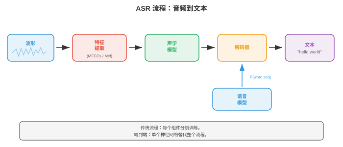
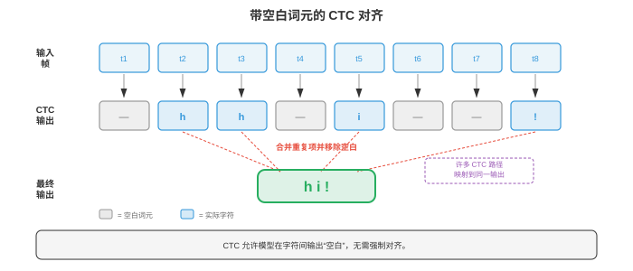
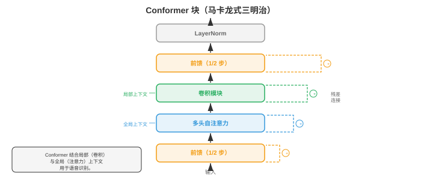
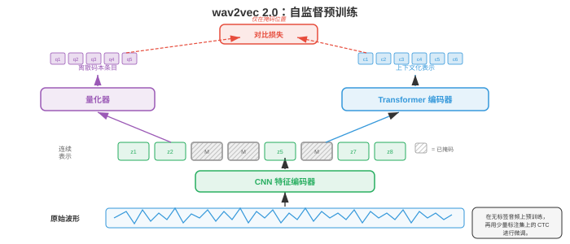

# 自动语音识别

*自动语音识别（automatic speech recognition, ASR）将口语音频转换为书面文本，弥合人类语音与机器可读语言之间的鸿沟。本节涵盖 GMM-HMM、CTC 损失、RNN-Transducer、基于注意力的编码器-解码器模型（LAS）、Whisper 和端到端 ASR，从经典流程到现代神经架构。*

- **自动语音识别（automatic speech recognition, ASR）**是把口语音频转换为书面文本的任务。它既是 AI 中最古老的问题之一（20 世纪 50 年代的首批系统只能识别单个数字），也是商业部署最广泛的技术之一（语音助手、转录服务、字幕）。

!!! note "大白话"
    ASR 的目标就是把人连续说出的声音，变成可搜索、可阅读、可处理的文字。

- 难点来自语音的巨大变异性：说话人、口音、语速、背景噪声、麦克风特性各不相同；更根本的是，连续声学信号映射到离散词语本身存在歧义。

!!! note "大白话"
    同一句话换个人、换环境、换速度，波形都会变；而相似声音又可能对应不同词，系统必须靠上下文判断。

- 可以把 ASR 想象成法庭速记员。速记员听到连续的声音流，在脑中将其切分为单词，利用上下文消解歧义（如 “they're”“their”“there”），再键入结果。ASR 系统做的是同一件事，只是分为可以明确列出、独立或联合优化的阶段。

!!! note "大白话"
    ASR 不只是在“听音”，还得决定哪里是词边界、同音词到底是哪一个，这和速记员依赖上下文很像。

- **经典 ASR 流程（classical ASR pipeline）**以一条由不同阶段组成的链处理音频：原始音频先转为特征（第 01 节的 MFCC 或对数梅尔频谱图）；**声学模型（acoustic model）**为每个特征帧与各语音单位的匹配程度评分；**发音模型（pronunciation model）**（词典）将语音单位映射为词；**语言模型（language model）**为词序列的可能性评分；最后由**解码器（decoder）**搜索使组合得分最大的词序列。每个组件都单独训练和调优。

!!! note "大白话"
    传统系统把“听起来像什么”“怎么发音”“句子通不通”分给不同模块，最后让解码器综合选最合理的一句。



- **音素（phonemes）**是语言中能够区分词语的最小语音单位。英语大约有 39-44 个音素（具体数量取决于方言和所用音素表）。例如，“bat” 与 “pat” 只差一个音素（/b/ 与 /p/）。大多数 ASR 系统建模称为**三音素（triphones）**的**上下文相关音素（context-dependent phonemes）**：一个音素由左右邻居定义（例如，处于 “b_t” 上下文的 “a” 与处于 “c_t” 上下文的 “a” 是不同单位），因为音素的声学实现深受邻居影响，这称为**协同发音（coarticulation）**。

!!! note "大白话"
    一个音不是孤立发出来的，前后音会改变它的实际声音；三音素就是把这种邻居影响也算进去。

- 可能的三音素数量极大（40 个音素的立方 = 64,000），因此**决策树聚类（decision tree clustering）**会将声学相似的三音素分为**状态绑定单元（senones）**（通常为 2000-10,000 类）。每个 senone 都有自己的声学模型。这种聚类是第 06 章决策树算法的一种形式。

!!! note "大白话"
    三音素组合太多，不能每种都单独训练；把听感相近的组合并成一个 senone，模型才不会爆炸。

- **GMM-HMM**（高斯混合模型-隐马尔可夫模型，Gaussian Mixture Model - Hidden Markov Model）是从 20 世纪 80 年代至 21 世纪 10 年代早期占主导地位的声学建模方法。HMM（第 05 章）建模语音的时间结构：每个音素是含 3-5 个状态、从左至右的 HMM；每个状态代表一个亚音素片段（起始、中部、结束）。状态之间的转移隐式地建模时长。

!!! note "大白话"
    HMM 把一个音拆成开始、中间、结尾几个阶段，规定它们只能按时间往前走，从而描述发音过程。

- 在每个 HMM 状态，发射概率（给定该状态时一个特定特征向量的可能性）用**高斯混合模型（Gaussian mixture model, GMM）**建模，即多元高斯分布（第 05 章）的加权和：

```math
p(\mathbf{x} | s) = \sum_{m=1}^{M} w_m \cdot \mathcal{N}(\mathbf{x} ; \boldsymbol{\mu}_m, \boldsymbol{\Sigma}_m)
```

!!! note "大白话"
    GMM 不认为一个状态只对应一种固定声音，而是用多个高斯分布混合，覆盖同一音在不同说话人和环境下的变化。

- 其中 $\mathbf{x}$ 是特征向量（如 39 维 MFCC），$s$ 是 HMM 状态，$M$ 是混合成分数量（通常为 8-64），$w_m$ 是混合权重，$\boldsymbol{\mu}_m$、$\boldsymbol{\Sigma}_m$ 是每个高斯成分的均值和协方差。出于计算效率，协方差矩阵通常取对角形式（假定特征维度独立；因 DCT 去相关，这对 MFCC 大致成立）。

!!! note "大白话"
    每个高斯成分代表这个状态的一种常见发音形态；用对角协方差是为了少算很多维度间关系。

- 训练使用**鲍姆-韦尔奇算法（Baum-Welch algorithm）**（第 05 章 EM 的特例），从带转录的语音数据中迭代估计 GMM 参数与 HMM 转移概率。解码（寻找最可能的状态序列）使用**维特比算法（Viterbi algorithm）**（第 05 章的动态规划）：

```math
\delta_t(j) = \max_{i} \left[ \delta_{t-1}(i) \cdot a_{ij} \right] \cdot b_j(\mathbf{x}_t)
```

!!! note "大白话"
    训练时反复估计“哪些状态像这段声音”；解码时维特比每一步只保留到当前位置最划算的路径。

- 其中 $\delta_t(j)$ 是结束于状态 $j$ 的最佳路径在时刻 $t$ 的概率，$a_{ij}$ 是从状态 $i$ 到状态 $j$ 的转移概率，$b_j(\mathbf{x}_t)$ 是特征 $\mathbf{x}_t$ 在状态 $j$ 中的发射概率。

!!! note "大白话"
    这个递推把“前面怎么走来”和“当前声音像不像这个状态”合在一起，逐帧找全局最可能的发音路线。

- **DNN-HMM**（Hinton 等，2012）以深度神经网络（DNN，第 06 章）替代 GMM 发射模型。该网络从一个特征帧窗口预测 senone 后验概率 $p(s | \mathbf{x})$。HMM 仍处理时间结构与序列关系，但神经网络提供判别能力强得多的发射分数。与 GMM 相比，这种混合方法将词错误率降低 20-30%，并在 2012-2016 年间成为主导范式。

!!! note "大白话"
    DNN-HMM 保留 HMM 的时间骨架，但把“这帧像哪个发音状态”的判断交给更强的神经网络。

- **WFST 解码（Weighted Finite-State Transducer）**是传统 ASR 的标准解码框架。每个组件（HMM 拓扑 H、上下文相关性 C、词典 L、语法/语言模型 G）均表示为加权有限状态转换器，并组合为单个搜索图 $H \circ C \circ L \circ G$。维特比搜索随后在该组合图上找到成本最低的路径。WFST 允许模块化地组合知识源，并进行高效动态规划搜索。其数学框架来自有限自动机理论（与第 05 章的状态机相关）。

!!! note "大白话"
    WFST 把发音规则、词典和语言习惯拼成一张大路线图，解码器在图上找代价最低的句子。

- **端到端 ASR（end-to-end ASR）**去除了独立组件（发音模型、音素表、WFST 解码器），训练一个直接从音频特征映射到字符或词片的神经网络。关键挑战是**对齐问题（alignment problem）**：输入（每秒数百个特征帧）和输出（每秒几个字符）的长度差异很大，且训练时二者之间的对齐未知。

!!! note "大白话"
    端到端模型少了很多手工模块，但必须自己学会“哪段声音对应哪个字”，这就是最难的对齐问题。

- **连接时序分类（Connectionist Temporal Classification, CTC）**（Graves 等，2006）通过引入特殊的**空白（blank）** token 解决对齐问题。只要将连续重复合并并移除空白后能得到正确转录，网络即可输出任意字符与空白序列。例如，转录 “cat” 可以由输出序列 “--cc-aa-t--” 产生（其中 “-” 是空白）。

!!! note "大白话"
    CTC 允许模型在多数时间步什么都不输出，也允许重复输出同一个字，最后按规则折叠成目标文本。

- 形式上，CTC 定义多对一映射 $\mathcal{B}$，它将所有长度为 $T$ 的输出序列（字母表加空白）映射到标签序列。标签序列 $\mathbf{y}$ 的概率是所有会折叠为它的对齐之和：

$$P(\mathbf{y} | \mathbf{x}) = \sum_{\boldsymbol{\pi} \in \mathcal{B}^{-1}(\mathbf{y})} \prod_{t=1}^{T} p(\pi_t | \mathbf{x})$$

!!! note "大白话"
    正确文本可能对应很多种逐帧对齐方式，CTC 不强迫其中一种，而是把所有能折叠成该文本的路线概率加起来。



- 朴素计算此和需要枚举指数数量的对齐，但**CTC 前向-后向算法（CTC forward-backward algorithm）**通过动态规划以 $O(T \cdot |\mathbf{y}|)$ 高效计算它，类似第 05 章 HMM 的前向-后向算法。

!!! note "大白话"
    虽然对齐路径多得数不过来，动态规划会复用中间结果，因此不必真的把每条路线都列出来。

- CTC 作出**条件独立假设（conditional independence assumption）**：给定输入时，每一时间步的输出独立于其他所有输出。因此 CTC 无法建模输出依赖（如无法学到 “q” 后几乎总跟着 “u”）。必须使用外部语言模型来处理这类依赖。

!!! note "大白话"
    CTC 每一帧只看声音、不直接记住前面输出了什么，所以句子通不通通常还要请语言模型帮忙。

- **CTC 解码（CTC decoding）**选项：

!!! note "大白话"
    解码的区别在于愿意保留多少候选路线：越多通常越准，但也越慢。

    - **贪心解码（greedy decoding）**：每个时间步选取概率最大的 token，再折叠。速度快，但不是最优解。

        !!! note "大白话"
            贪心每一步都选当前最高分，最快，却可能错过前面稍差、后面整体更好的句子。

    - **束搜索（beam search）**：每步保留得分最高的 $k$ 个部分假设，合并折叠为相同前缀的假设。可纳入语言模型分数。

        !!! note "大白话"
            束搜索同时保留几条可能句子，给后续声音纠正早期选择的机会，也能结合语言模型。

    - **前缀束搜索（prefix beam search）**：修改过的束搜索，正确处理 CTC 空白合并，确保在折叠后比较假设。

        !!! note "大白话"
            前缀束搜索专门处理 CTC 的空白和重复规则，避免看似不同的路径折叠后其实是同一句话。

- **RNN-Transducer**（RNN-T，Graves，2012）在 CTC 基础上增加显式的**预测网络（prediction network）**（类似语言模型的 RNN），使每个输出以先前输出为条件，从而去除条件独立假设。RNN-T 有三个组件：

!!! note "大白话"
    RNN-T 在听声音之外还记得自己已经输出了什么，因此能把声学线索和语言上下文一起用。

    - **编码器（encoder）**：处理音频特征，产生隐藏表示 $\mathbf{h}_t^\text{enc}$（通常是一叠 LSTM 或 Conformer 层）。

        !!! note "大白话"
            编码器负责把连续音频压成包含发音信息的表示。

    - **预测网络（prediction network）**：自回归 RNN，根据先前已发出的标签产生隐藏表示 $\mathbf{h}_u^\text{pred}$。

        !!! note "大白话"
            预测网络像一个小语言模型，根据已输出文字判断下一个文字更可能是什么。

    - **联合网络（joint network）**：在每个（时间、标签）位置合并编码器与预测网络输出，并产生下一个 token（包括空白）的分布：

        $$p(y | t, u) = \text{softmax}(W \cdot \text{tanh}(W_\text{enc} \mathbf{h}_t^\text{enc} + W_\text{pred} \mathbf{h}_u^\text{pred} + b))$$

        !!! note "大白话"
            联合网络把“现在听到什么”和“前面已经写了什么”合在一起，决定是继续吐字还是先向时间推进。

- RNN-T 可在每个时间步发出零个或多个标签（在前进至下一时间步前发出非空白 token，或发出空白以不输出地前进）。训练在二维（时间、标签）格点上使用前向-后向算法，复杂度为 $O(T \cdot U)$，其中 $U$ 是输出长度。RNN-T 是设备端流式 ASR 的主导架构（用于 Google Pixel 手机及类似产品），因为它天然支持流式处理：编码器从左到右处理音频，预测网络递增地产生输出。

!!! note "大白话"
    RNN-T 不必等整句说完才输出，能边听边写，所以特别适合手机和实时字幕。

- **Listen, Attend and Spell**（LAS，Chan 等，2016）是基于注意力的编码器-解码器模型（第 06 章的序列到序列架构）。它有三个组件：

!!! note "大白话"
    LAS 先完整听完输入，再让解码器每次关注最相关的声音片段并拼出文字。

    - **Listener（监听器）**（编码器）：一个金字塔式双向 LSTM，处理完整输入序列，并以 8 倍因子下采样（每层拼接成对的连续隐藏状态），产生较短的编码器隐藏状态序列。

        !!! note "大白话"
            Listener 把很长的声学帧压缩成更短的摘要序列，减少后面注意力的负担。

    - **注意力（attention）**：在每个解码器步，对所有编码器状态计算注意力权重，形成上下文向量（与第 07 章相同的注意力机制）。

        !!! note "大白话"
            注意力告诉解码器当前要写的字符应重点查看哪几段声音。

    - **Speller（拼写器）**（解码器）：一个自回归 LSTM，以每次一个字符的方式生成输出转录，并以上下文向量和先前生成的字符为条件。

        !!! note "大白话"
            Speller 根据听到的重点和已经写出的内容，一个字符一个字符地继续写。

- LAS 能得到很强的结果，但解码前必须获得完整话语（因为注意力会关注全部编码器状态），因此不适合流式应用。它也难以处理很长的话语，因为对长序列的注意力会变得分散。

!!! note "大白话"
    LAS 适合离线整段转录，但它得先听完，长音频上注意力也更难精准聚焦。

- **Conformer**（Gulati 等，2020）将卷积捕捉局部模式的能力与自注意力建模全局依赖的能力结合。每个 Conformer 块具有四个模块组成的三明治结构：

!!! note "大白话"
    Conformer 同时要两种能力：卷积擅长听邻近发音细节，注意力擅长联系相隔很远的词和声音。

    1. **前馈模块（feed-forward module）**（半步）：带残差连接的前馈网络，使用一半残差权重。

        !!! note "大白话"
            前馈模块先对每个位置单独加工一半，再在最后补另一半，让表示有两次非线性变换机会。

    2. **多头自注意力模块（multi-head self-attention module）**：带相对位置编码的标准 Transformer 自注意力（第 07 章）。

        !!! note "大白话"
            自注意力让当前声音片段参考远处片段，相对位置编码告诉它相隔多远。

    3. **卷积模块（convolution module）**：逐点卷积、门控线性单元（GLU）、一维深度可分离卷积、批归一化、Swish 激活与另一个逐点卷积。深度可分离卷积捕捉局部上下文（类似特征序列上的 n-gram）。

        !!! note "大白话"
            这一长串组件的核心是用轻量一维卷积抓住相邻声音的局部组合，例如一个音与前后音的关系。

    4. **前馈模块（feed-forward module）**（半步）：与模块 1 相同。

        !!! note "大白话"
            最后的半步前馈把前面注意力和卷积混合后的信息再加工一次。

- 输出为：$\mathbf{y} = \text{LayerNorm}(\mathbf{x} + \frac{1}{2}\text{FFN}_1 + \text{MHSA} + \text{Conv} + \frac{1}{2}\text{FFN}_2)$。带半步残差的马卡龙式结构（FFN-Attention-Conv-FFN）经实验证明优于其他排序。Conformer 已成为 CTC 与 RNN-T 系统的默认编码器，优于纯 Transformer 和纯 LSTM 编码器。

!!! note "大白话"
    这块结构把每一步的结果都加回原输入，既保留旧信息，又让卷积和注意力各发挥所长，因此成了现代 ASR 的常用骨架。



- **Whisper**（Radford 等，2023）是 OpenAI 的大规模、基于注意力的 ASR 模型。它使用标准的编码器-解码器 Transformer 架构（第 07 章），在从互联网抓取的 680,000 小时弱监督数据上训练（音频与近似转录配对）。关键设计如下：

!!! note "大白话"
    Whisper 的关键不只是网络结构，而是先看过极大量、来源很杂的音频和近似字幕，所以遇到新口音和新场景时更不容易失常。

    - 输入：第 01 节的 80 通道对数梅尔频谱图，窗口为 25 ms、帧移为 10 ms，归一化为零均值、单位方差。

        !!! note "大白话"
            它先把声音切成很短的小片，再把每片变成 80 个数字组成的“声音图片”，方便 Transformer 处理。

    - 编码器：采用正弦位置嵌入和预激活层归一化的标准 Transformer 编码器。

        !!! note "大白话"
            编码器负责读懂整段声音，并且知道每一片声音处在时间轴的什么位置。

    - 解码器：使用第 07 章的字节级 BPE 分词器，自回归地生成 token 的 Transformer 解码器。

        !!! note "大白话"
            解码器像写字员一样，根据已经听懂的声音和前面写出的内容，逐个 token 写下转录。

    - 多任务：单个模型可处理转录、翻译、语言识别和时间戳预测，以解码器提示中的特殊任务 token 为条件。

        !!! note "大白话"
            给它不同的任务提示，同一个模型就能选择“原样听写”“翻译”或“标出时间”等不同工作。

    - 训练数据的规模（而非架构新颖性）是 Whisper 跨领域、口音和语言强泛化能力的主要来源。

        !!! note "大白话"
            它强的主要原因是见过的真实变化特别多，而不是某个神奇的小技巧。

- **wav2vec 2.0**（Baevski 等，2020）是用于语音表征的**自监督（self-supervised）**预训练框架。核心思想是先从大量无标签音频中学习语音表征，再用少量标注数据微调。它遵循与第 07 章 BERT 相同的自监督范式，只是适配了连续音频信号。

!!! note "大白话"
    wav2vec 2.0 先靠海量没有字幕的录音练“听感”，之后只需少量人工标注，就能学会把声音转成文字。

- wav2vec 2.0 架构有三个部分：

!!! note "大白话"
    它的流程是先把原始声音压成特征，再遮住一部分让模型猜，最后用上下文判断猜得对不对。

    - **特征编码器（feature encoder）**：多层一维 CNN，处理原始波形样本，并以 20 ms 帧率生成潜在表示 $\mathbf{z}_t$（16 kHz 时每 320 个样本一个向量）。

        !!! note "大白话"
            这一层像把连续录音按每 20 ms 摘出一个更有意义的声音摘要。

    - **量化模块（quantisation module）**：使用**乘积量化（product quantisation）**将潜在表示离散为有限码本（将向量分为若干组，每组独立量化，从 $G$ 个各有 $V$ 个条目的码本中选择）。这为对比学习目标产生目标 $\mathbf{q}_t$。

        !!! note "大白话"
            量化会把连续变化的声音特征归到有限个“声音代号”里，供模型拿来做猜题目标。

    - **上下文网络（context network）**：接收（部分掩码的）潜在表示，产生上下文化表示 $\mathbf{c}_t$ 的 Transformer 编码器。

        !!! note "大白话"
            上下文网络看到周围未遮住的声音后，推断被遮住位置本来应该是什么。



- 预训练时，随机跨度的潜在表示会被**掩码（masked）**（替换为学习到的掩码嵌入）；模型必须从一组干扰项中识别出被掩码位置的真实量化表示（负例从同一话语的其他位置采样）。对比损失为：

!!! note "大白话"
    这像听力填空：故意盖住一段录音，让模型在多个候选声音代号里找出最符合上下文的那个。

$$\mathcal{L} = -\log \frac{\exp(\text{sim}(\mathbf{c}_t, \mathbf{q}_t) / \kappa)}{\sum_{\tilde{\mathbf{q}} \in Q_t} \exp(\text{sim}(\mathbf{c}_t, \tilde{\mathbf{q}}) / \kappa)}$$

!!! note "大白话"
    这个损失奖励“正确候选和上下文很像”，惩罚“干扰候选看起来更像”的情况。

- 其中 $\text{sim}$ 是余弦相似度，$\kappa$ 是温度参数，$Q_t$ 包含真实量化目标和干扰项。额外的**多样性损失（diversity loss）**鼓励均匀使用所有码本条目。这一损失本质上是 InfoNCE 对比损失，与视觉自监督学习所用的对比目标同属一类。

!!! note "大白话"
    温度控制模型区分候选时有多果断；多样性损失则防止它偷懒，只反复使用少数几个声音代号。

- 预训练后，在顶部添加线性投影和 CTC 头，再以标注数据微调。wav2vec 2.0 只用 10 分钟标注数据便达到接近最先进的结果（预训练使用 53,000 小时无标签音频），展现了自监督学习对低资源语音识别的能力。

!!! note "大白话"
    大量无标签录音已经把基础听力练好了，后续少量带答案的样本主要用于教它如何拼成文字。

- **HuBERT**（Hsu 等，2021）是另一种自监督方法，它以**掩码预测（masked prediction）**目标替代对比目标（预测被掩码帧的离散聚类分配）。目标由离线聚类产生（第一次迭代对 MFCC 做 k-means，之后迭代对 HuBERT 特征做 k-means）。HuBERT 相比 wav2vec 2.0 简化了训练流程（不需要量化模块或对比采样），并达到相当或更好的结果。

!!! note "大白话"
    HuBERT 不让模型在一堆候选里比相似度，而是先把声音粗分组，再让它猜被盖住片段属于哪一组，训练过程更直接。

- **Fast Conformer**（Rekesh 等，2023，NVIDIA NeMo）以**下采样注意力（down-sampled attention）**机制替代标准 Conformer 中二次复杂度的自注意力：输入序列在计算注意力前被压缩（通常通过步幅卷积压缩 8 倍），再展开回来。这在保留全局上下文的同时，将注意力成本从 $O(T^2)$ 降至 $O(T^2/64)$，可在没有内存问题的情况下训练很长的话语（最长数分钟）。Fast Conformer 是 NVIDIA NeMo 工具包的默认编码器，也是其生产级模型的主干。

!!! note "大白话"
    注意力最怕音频太长；Fast Conformer 先把时间轴缩短八倍再做全局比较，计算量就降到原来的约六十四分之一。

- **Parakeet**（NVIDIA，2024）是一系列高准确度英语 ASR 模型：以 Fast Conformer 编码器配合 CTC 和 RNN-T 解码器，在 64,000 小时英语语音上训练。Parakeet 模型（0.6B 和 1.1B 参数）在发布时于标准基准上达到最低词错误率，在大多数英语测试集上超过 Whisper large-v3。关键要素是高效的 Fast Conformer 架构、积极的数据增强（SpecAugment、速度扰动、噪声混合）和大规模监督训练数据，表明对已知组件的谨慎工程仍可推进最先进水平。

!!! note "大白话"
    Parakeet 说明把成熟组件、训练数据和增强方法都做到位，也能取得很强结果，不一定必须发明全新架构。

- **Canary**（NVIDIA，2024）将 NeMo 框架扩展至多语言、多任务 ASR。它使用 Fast Conformer 编码器和基于注意力的解码器（而非 CTC 或 RNN-T），在单个模型中处理多种语言的转录和翻译（类似 Whisper 的多任务设计，但使用更高效的 Fast Conformer 主干）。Canary 以有竞争力的准确度支持英语、德语、西班牙语和法语。

!!! note "大白话"
    Canary 让一个模型既能处理多种语言，又能在听写和翻译之间切换，减少为每种任务单独部署模型的成本。

- **Moonshine**（Useful Sensors，2024）是一系列专门针对**设备端与边缘部署（on-device and edge deployment）**优化的 ASR 模型。编码器采用混合架构：以小型 CNN 和少量 Transformer 层取代初始 Transformer/Conformer 层，大幅降低模型大小（基础模型少于 30M 参数）。Moonshine 面向 CPU 和低功耗设备上的实时流式处理，此处 Whisper 会过大、过慢；它以少许准确度交换 5-10 倍更低的延迟和内存占用。

!!! note "大白话"
    手机或小设备装不下大模型时，Moonshine 宁可少一点准确率，也要换来更快响应和更低内存占用。

- **Distil-Whisper**（Gandhi 等，2023）应用**知识蒸馏（knowledge distillation）**（第 06 章），将 Whisper 压缩为更小、更快的模型。学生模型保留完整编码器，但仅使用 2 个解码器层（Whisper 为 32 层），并训练为匹配 Whisper 的输出分布。Distil-Whisper 的 WER 与教师相差不足 1%，速度却快 6 倍，使其适用于完整 Whisper 过慢的实时应用。

!!! note "大白话"
    这是让小模型模仿大模型的答题方式：性能只少一点，速度却提高很多，适合对延迟敏感的场景。

- **通用语音模型（Universal Speech Model, USM）**（Zhang 等，2023，Google）将自监督预训练扩展到覆盖 300 多种语言的 1,200 万小时无标签音频，之后进行有监督微调。USM 表明 wav2vec 2.0/自监督范式可以扩展到真正的大规模数据范围，并以很少的标注数据在低资源语言上取得强表现。

!!! note "大白话"
    USM 先把非常多语言的无标签声音都听一遍，之后即使某种语言的人工标注很少，也有机会识别得不错。

- **大规模多语言语音（Massively Multilingual Speech, MMS）**（Pratap 等，2023，Meta）使用宗教录音和其他多语言音频来源，将 wav2vec 2.0 预训练扩展至 1,100 多种语言。MMS 覆盖的语言数远超此前任何 ASR 系统，首次为许多资源不足的语言带来语音识别能力。

!!! note "大白话"
    对很少有商业数据的语言，MMS 先利用已有录音建立基础能力，让语音技术不只服务于少数主流语言。

- 现代 ASR 的格局正收敛为几种主导模式：（1）使用 CTC 或 RNN-T 的 Conformer 系列编码器，用于流式处理；（2）用于离线/多任务的编码器-解码器 Transformer；（3）用于低资源环境的自监督预训练；（4）规模，更大量的数据和更大的模型持续提升准确率。选择取决于部署约束：延迟预算、可用算力、语言数量，以及应用是流式还是批处理。

!!! note "大白话"
    没有万能 ASR：要实时就偏向 CTC/RNN-T，要离线多任务可选编码器-解码器，数据少则先考虑自监督预训练。

- **语言模型集成（language model integration）**通过加入声学模型未能捕捉的语言知识来改善 ASR。基本思想是在解码时组合声学模型分数 $p(\mathbf{x} | \mathbf{y})$（音频与转录的匹配程度）和语言模型分数 $p(\mathbf{y})$（转录作为句子的可能性）。

!!! note "大白话"
    声学模型负责判断“听起来像不像”，语言模型负责判断“这句话像不像人话”；合起来能减少同音或含糊处的错误。

- **浅融合（shallow fusion）**在束搜索时组合分数：

!!! note "大白话"
    浅融合就是在挑候选句子时，直接把听音得分和语句通顺得分按权重相加。

$$\hat{\mathbf{y}} = \arg\max_\mathbf{y} \left[ \log p_\text{AM}(\mathbf{y} | \mathbf{x}) + \lambda \log p_\text{LM}(\mathbf{y}) \right]$$

!!! note "大白话"
    公式里的 $\lambda$ 是调音量旋钮：它决定语言模型的意见在最终选择中占多大比重。

- 其中 $\lambda$ 是可调权重，$p_\text{LM}$ 是外部语言模型（通常是第 07 章的 n-gram 或神经 LM）。它简单有效，但要求 LM 与 ASR 模型使用相同的 token 词表。

!!! note "大白话"
    两个模型必须用同一种拆字方式，才能把它们对同一段文字的分数正确合并。

- **深融合（deep fusion）**（Gulcehre 等，2015）将语言模型集成到解码器网络内部：LM 隐状态与解码器隐状态拼接，在输出投影前经过门控机制。整个系统（包括预训练 LM）联合微调。这使集成更深入，但训练更复杂。

!!! note "大白话"
    深融合不只在最后加分，而是把语言模型的内部信息接进解码器一起训练，效果可能更紧密，代价是训练更麻烦。

- **冷融合（cold fusion）**（Sriram 等，2018）类似深融合，但它从零开始训练已集成语言模型的 ASR 解码器，而非微调预训练解码器。这迫使声学模型学习补充信息，而非重复 LM 已知的信息。

!!! note "大白话"
    冷融合从一开始就让声学和语言两部分分工，避免它们都去学同一套语言规律。

- **重评分（rescoring）**（N-best rescoring）是一种两阶段方法：先以束搜索生成 $N$ 个候选转录，再用更强大的语言模型（如大型 Transformer LM）对其重新排序。它实现简单，且可以使用对首阶段解码过慢的大型 LM。

!!! note "大白话"
    先用快模型列出几份候选答案，再让慢但更懂语言的模型做最后评审，兼顾速度与质量。

- **内部语言模型估计（internal language model estimation, ILME）**处理一个微妙问题：端到端模型会从训练转录中隐式学习内部 LM，在浅融合中它可能与外部 LM 冲突（本质是语言先验被重复计算）。ILME 估计内部 LM，并在融合时减去其分数：

!!! note "大白话"
    端到端模型自己已经带了一点语言偏好，外接语言模型时要把这部分重复计算扣掉，才不会把同一意见算两次。

$$\hat{\mathbf{y}} = \arg\max_\mathbf{y} \left[ \log p_\text{E2E}(\mathbf{y} | \mathbf{x}) - \beta \log p_\text{ILM}(\mathbf{y}) + \lambda \log p_\text{LM}(\mathbf{y}) \right]$$

!!! note "大白话"
    这条式子先减去模型自带的语言分，再加外部语言分，让最终分数更接近真正新增的语言信息。

- **流式与离线 ASR（streaming vs. offline ASR）**是基本的架构选择。离线（或批处理）ASR 在产生任何输出前处理完整话语；流式 ASR 则随音频到达递增地产生输出，并具有有界延迟。

!!! note "大白话"
    离线识别像听完录音再写总结，流式识别像同声字幕，边听边出字但必须控制等待时间。

- 流式处理对实时应用至关重要：实时字幕、语音助手（用户期望在说完前就得到响应）、电话通话转录。难点是，某些未来上下文有利于识别（知道下一个词为 “York” 有助于消歧 “New”），但流式系统不能等待任意长的未来上下文。

!!! note "大白话"
    多等一会儿能听得更准，但用户不愿等；流式 ASR 的核心就是在准确率和反应速度之间做取舍。

- **单向编码器（unidirectional encoders）**（从左至右 LSTM、因果卷积、因果 Transformer）天然支持流式处理，因为每个输出只依赖过去和当前输入。会查看未来上下文的双向编码器则不能直接支持流式处理。

!!! note "大白话"
    单向编码器只看已经说出的内容，所以可以立即工作；双向编码器要偷看后文，实时场景就得等。

- **分块注意力（chunked attention）**（也称块式或分段注意力）将输入分为固定长度的块，只在各块内部（可选地再加少数前序块）应用自注意力。这把延迟限制为块大小加处理时间，同时允许每个块中存在一些局部双向上下文；代价是块大小变小时准确率下降。

!!! note "大白话"
    分块注意力把长录音切成小段逐段听：不会等太久，也能在每小段内前后对照，但看不到太远的后文。

- **前瞻（lookahead）**让流式编码器在为当前帧产生输出前，查看少量未来帧（如 300-900 ms）。实现方式是在单向计算中加入小型右上下文。前瞻窗口会增加延迟，但显著提升准确率。

!!! note "大白话"
    前瞻相当于允许系统晚半秒再落笔，换取多听一点后续声音来减少误判。

- 流式 ASR 的**延迟（latency）**包括多个组成部分：

!!! note "大白话"
    用户感到“慢”不只因为模型计算慢，收音、判断结束、吐出第一个字和确认最终文字都会贡献等待时间。

    - **算法延迟（algorithmic latency）**：音频到达到模型能处理它之间的延迟（由块大小、前瞻和特征提取决定）。

        !!! note "大白话"
            这是算法天生要攒够多少声音才能开算的等待时间。

    - **计算延迟（computational latency）**：运行模型前向传播的时间。

        !!! note "大白话"
            这是机器真正执行模型计算所花的时间。

    - **端点检测延迟（endpointer latency）**：检测用户已说完的延迟。

        !!! note "大白话"
            系统还得判断你是真的说完了，还是只是短暂停顿；判断太快会截断，太慢会显得迟钝。

    - **首 token 延迟（first-token latency）**：第一个词出现的速度。**最终确认延迟（finalization latency）**：最终输出被确认的速度（流式系统常先产生暂定输出，之后随更多音频到来而更正）。

        !!! note "大白话"
            第一个字多久出现决定“是否马上有反应”，最终不再改字要多久决定“何时可以信它”。

- ASR 的**评估指标（evaluation metrics）**：

!!! note "大白话"
    识别系统既要量错误多少，也要量跑得够不够快；只报一个准确率无法说明实际体验。

- **词错误率（Word Error Rate, WER）**是主要指标。它通过编辑距离将假设（系统输出）与参考（真实转录）对齐，即把一个序列变为另一个序列所需的最少替换、插入和删除次数，然后计算：

!!! note "大白话"
    WER 就是把机器答案改成标准答案时，换词、漏词、多词一共要动多少次，再除以标准答案的总词数。

$$\text{WER} = \frac{S + D + I}{N}$$

!!! note "大白话"
    分子统计三类错误，分母是正确文本有多少词，所以它反映的是错误占比，而不是简单的对错次数。

- 其中 $S$ 是替换数，$D$ 是删除数，$I$ 是插入数，$N$ 是参考文本的总词数。若插入很多，WER 可超过 100%。对干净朗读语音，5% WER 大致被视为人类水平；对话或噪声语音困难得多（10-20% 以上）。

!!! note "大白话"
    因为乱加词也计错，系统可以错得比原句词数还多；不同录音条件的 WER 不能直接混在一起比较。

- **字符错误率（Character Error Rate, CER）**使用相同公式，但在字符而非词的层面计算。CER 对没有明确词边界的语言（中文、日语）更有信息量，也更能反映接近的错误程度（“cat” 与 “bat” 是 100% WER，却是 33% CER）。

!!! note "大白话"
    中文没有天然空格分词，按字计算更细；它能区分“只错一个字”和“整句话全错”这种差别。

- **词信息损失（Word Information Lost, WIL）**和**词信息保留（Word Information Preserved, WIP）**是信息论替代指标，比 WER 更精确地考虑参考与假设之间的相关性，但较少报告。

!!! note "大白话"
    WIL/WIP 试图衡量机器到底保住了多少有用词信息，不过行业里最常见的口径仍是 WER。

- **实时因子（Real-Time Factor, RTF）**衡量计算效率：处理时间与音频时长之比。RTF < 1 表示系统快于实时；RTF > 1 表示无法跟上实时音频。流式系统必须保持 RTF < 1。

!!! note "大白话"
    一分钟录音若 30 秒能处理完，RTF 是 0.5；若要两分钟，实时字幕必然越积越慢。

- **数据增强（data augmentation）**对稳健 ASR 至关重要。常见技术包括：

!!! note "大白话"
    训练时故意把声音变快、加噪、加回声，是为了让模型别只会识别录音棚里的标准发音。

    - **速度扰动（speed perturbation）**：以 0.9 倍和 1.1 倍速率重新采样音频（改变音高和时长）。

        !!! note "大白话"
            同一段话稍微放慢或加快，相当于让模型多见几种语速和音高。

    - **SpecAugment**（Park 等，2019）：在频谱图中掩码随机频带和时间步。它是 dropout 的音频对应物，也是 ASR 最有效的正则化技术之一，不需要额外数据。

        !!! note "大白话"
            它训练时故意遮住频谱图的一些横条或竖条，逼模型不要死记某个局部声音特征。

    - **噪声增强（noise augmentation）**：以各种信噪比将干净语音与录制噪声混合。

        !!! note "大白话"
            这就是给干净人声叠上车流、风声或人群声，让模型学会在嘈杂环境中抓住说话声。

    - **房间冲激响应模拟（room impulse response simulation）**：将干净语音与模拟房间声学卷积，模拟混响环境。

        !!! note "大白话"
            它把同一句话模拟成在小房间、走廊或大厅里说出的回声效果，提升对真实场地的适应性。

- ASR 的**token 化（tokenisation）**决定模型输出词表。选项包括：

!!! note "大白话"
    token 是模型写字时使用的基本积木。积木切得越小，词表越省但要写更长；切得越大，写得快却更难覆盖新词。

    - **字符（characters）**：简单，词表小（英语约 30 个），但输出序列长，且没有隐式语言建模。

        !!! note "大白话"
            按字符输出最稳妥，任何词都能拼，但模型需要连续写很多步。

    - **词片/ BPE（word pieces / BPE）**（第 07 章）：平衡词表大小和序列长度的子词单元，是现代系统标准（Whisper 使用约 50,000 个 token 的字节级 BPE）。

        !!! note "大白话"
            BPE 把常见片段当成一个积木，既不会像整词那样词表无限大，也不会像字符那样太长。

    - **词（words）**：词表大（50,000 以上）、输出序列短，但无法处理词表外词。

        !!! note "大白话"
            按整词输出一步能写很快，但遇到没收录的新词就会卡住。

    - **音素（phonemes）**：有语言学依据、紧凑，但需要发音词典。

        !!! note "大白话"
            音素把文字任务先转成发音单位，结构紧凑，却需要额外词典告诉系统每个词怎么读。

- ASR 的演变可概括为：从高度工程化的模块化系统（GMM-HMM + WFST 解码，20 世纪 90 年代至 21 世纪 10 年代），到混合系统（DNN-HMM，2012-2016），再到将越来越多流程吸收进单一神经网络的端到端系统（CTC、RNN-T、LAS，2016-2020），最后到利用海量无标签或弱标签数据的大规模预训练模型（wav2vec 2.0、Whisper，2020 年至今）。每次转变都在提高准确率的同时简化了工程，遵循机器学习的更广泛趋势：从数据中学习表征，而非手工设计它们（与第 06 章图像特征被 CNN 替代、第 07 章 NLP 特征被 Transformer 替代的故事相同）。

!!! note "大白话"
    ASR 的主线是少写手工规则、多让模型从大量数据中自己学；系统结构越来越统一，但对数据和计算资源的要求也越来越高。

## 编程任务（使用 CoLab 或 notebook）

1. 从零用 JAX 实现 CTC 损失。创建包含短 logits 序列和目标标签的玩具示例，运行 CTC 前向算法得到总概率，并计算负对数似然损失。
```python
import jax
import jax.numpy as jnp
import matplotlib.pyplot as plt

def ctc_forward(log_probs, targets):
    """
    CTC forward algorithm (log-domain for numerical stability).
    log_probs: (T, V) log probabilities over vocabulary (index 0 = blank)
    targets: (U,) target label indices (no blanks)
    Returns: log probability of the target sequence under CTC.
    """
    T, V = log_probs.shape
    U = len(targets)

    # Build the extended label sequence with blanks: [blank, y1, blank, y2, ..., yU, blank]
    S = 2 * U + 1
    labels = jnp.zeros(S, dtype=jnp.int32)  # all blanks
    for i in range(U):
        labels = labels.at[2 * i + 1].set(targets[i])

    # Initialise alpha (log domain)
    NEG_INF = -1e30
    alpha = jnp.full((T, S), NEG_INF)
    alpha = alpha.at[0, 0].set(log_probs[0, labels[0]])        # start with blank
    alpha = alpha.at[0, 1].set(log_probs[0, labels[1]])        # or first label

    # Fill forward
    for t in range(1, T):
        for s in range(S):
            # Same state
            a = alpha[t - 1, s]
            # From previous state
            if s > 0:
                a = jnp.logaddexp(a, alpha[t - 1, s - 1])
            # Skip blank (if current and two-back labels are different)
            if s > 1 and labels[s] != 0 and labels[s] != labels[s - 2]:
                a = jnp.logaddexp(a, alpha[t - 1, s - 2])
            alpha = alpha.at[t, s].set(a + log_probs[t, labels[s]])

    # Total log probability: sum of last two states at final time step
    log_prob = jnp.logaddexp(alpha[T - 1, S - 1], alpha[T - 1, S - 2])
    return log_prob, alpha

# --- Toy example ---
T = 12   # input length (time steps)
V = 5    # vocab size (0=blank, 1='c', 2='a', 3='t', 4='x')
targets = jnp.array([1, 2, 3])  # "c", "a", "t"

# Create random logits and convert to log-probabilities
key = jax.random.PRNGKey(42)
logits = jax.random.normal(key, (T, V))
log_probs = jax.nn.log_softmax(logits, axis=-1)

log_prob, alpha = ctc_forward(log_probs, targets)
ctc_loss = -log_prob

print(f"Target sequence: {targets.tolist()} ('c', 'a', 't')")
print(f"Input length T={T}, Vocab size V={V}")
print(f"CTC log-probability: {log_prob:.4f}")
print(f"CTC loss (neg log-prob): {ctc_loss:.4f}")

# Visualise the forward variable (alpha) lattice
fig, ax = plt.subplots(figsize=(12, 5))
# Convert from log to linear for visualisation
alpha_linear = jnp.exp(alpha - jnp.max(alpha))  # normalise for visibility
im = ax.imshow(alpha_linear.T, aspect='auto', origin='lower', cmap='viridis')
ax.set_xlabel('Time step (t)')
ax.set_ylabel('Extended label index (s)')

label_names = ['_', 'c', '_', 'a', '_', 't', '_']  # _ = blank
ax.set_yticks(range(len(label_names)))
ax.set_yticklabels(label_names)
ax.set_title(f'CTC Forward Variable (alpha lattice) | Loss = {ctc_loss:.2f}')
plt.colorbar(im, ax=ax, label='Normalised probability')
plt.tight_layout(); plt.show()
```

2. 用 JAX 构建简单的基于注意力的编码器-解码器 ASR 模型（最小 LAS 风格架构）。使用一维卷积编码器与带点积注意力的单层解码器。在合成数据上运行并可视化注意力权重。
```python
import jax
import jax.numpy as jnp
import matplotlib.pyplot as plt

# --- Minimal attention-based encoder-decoder for ASR ---

def init_params(key, input_dim, hidden_dim, vocab_size):
    """Initialise parameters for a tiny LAS-like model."""
    keys = jax.random.split(key, 8)
    scale = 0.1
    params = {
        # Encoder: simple linear projection (simulating conv output)
        'enc_w': jax.random.normal(keys[0], (input_dim, hidden_dim)) * scale,
        'enc_b': jnp.zeros(hidden_dim),
        # Attention: query, key, value projections
        'attn_q': jax.random.normal(keys[1], (hidden_dim, hidden_dim)) * scale,
        'attn_k': jax.random.normal(keys[2], (hidden_dim, hidden_dim)) * scale,
        'attn_v': jax.random.normal(keys[3], (hidden_dim, hidden_dim)) * scale,
        # Decoder RNN (simple Elman RNN for illustration)
        'dec_wh': jax.random.normal(keys[4], (hidden_dim, hidden_dim)) * scale,
        'dec_wx': jax.random.normal(keys[5], (vocab_size, hidden_dim)) * scale,
        'dec_wc': jax.random.normal(keys[6], (hidden_dim, hidden_dim)) * scale,
        'dec_b': jnp.zeros(hidden_dim),
        # Output projection
        'out_w': jax.random.normal(keys[7], (hidden_dim, vocab_size)) * scale,
        'out_b': jnp.zeros(vocab_size),
    }
    return params

def encode(params, x):
    """Encoder: linear projection (placeholder for conv/LSTM stack)."""
    return jnp.tanh(x @ params['enc_w'] + params['enc_b'])

def attend(params, query, enc_out):
    """Dot-product attention over encoder outputs."""
    q = query @ params['attn_q']                   # (hidden,)
    k = enc_out @ params['attn_k']                 # (T_enc, hidden)
    v = enc_out @ params['attn_v']                 # (T_enc, hidden)
    d_k = q.shape[-1]
    scores = (k @ q) / jnp.sqrt(d_k)              # (T_enc,)
    weights = jax.nn.softmax(scores)               # (T_enc,)
    context = weights @ v                          # (hidden,)
    return context, weights

def decode_step(params, h_prev, y_prev_onehot, enc_out):
    """Single decoder step: RNN + attention."""
    # Embed previous token
    y_emb = y_prev_onehot @ params['dec_wx']       # (hidden,)
    # Attend to encoder
    context, attn_w = attend(params, h_prev, enc_out)
    # RNN update
    h = jnp.tanh(h_prev @ params['dec_wh'] + y_emb + context @ params['dec_wc']
                  + params['dec_b'])
    # Output logits
    logits = h @ params['out_w'] + params['out_b']
    return h, logits, attn_w

# --- Setup ---
key = jax.random.PRNGKey(0)
input_dim = 40       # e.g., 40 mel bands
hidden_dim = 64
vocab_size = 10      # small vocab for demo
T_enc = 30           # encoder time steps
T_dec = 8            # decoder steps

params = init_params(key, input_dim, hidden_dim, vocab_size)

# Synthetic input: random mel-like features
key, subkey = jax.random.split(key)
x = jax.random.normal(subkey, (T_enc, input_dim))

# Encode
enc_out = encode(params, x)

# Decode (teacher forcing with random targets)
key, subkey = jax.random.split(key)
targets = jax.random.randint(subkey, (T_dec,), 0, vocab_size)

h = jnp.zeros(hidden_dim)
all_logits = []
all_attn = []

for t in range(T_dec):
    y_prev = jax.nn.one_hot(targets[t] if t > 0 else 0, vocab_size)
    h, logits, attn_w = decode_step(params, h, y_prev, enc_out)
    all_logits.append(logits)
    all_attn.append(attn_w)

all_attn = jnp.stack(all_attn)  # (T_dec, T_enc)
all_logits = jnp.stack(all_logits)  # (T_dec, vocab_size)

# --- Visualise attention weights ---
fig, axes = plt.subplots(1, 2, figsize=(14, 5))

im = axes[0].imshow(all_attn, aspect='auto', cmap='Blues', origin='lower')
axes[0].set_xlabel('Encoder time step')
axes[0].set_ylabel('Decoder step')
axes[0].set_title('Attention Weights (decoder -> encoder)')
plt.colorbar(im, ax=axes[0])

# Show predicted token distribution for each decoder step
im2 = axes[1].imshow(jax.nn.softmax(all_logits, axis=-1), aspect='auto',
                      cmap='Oranges', origin='lower')
axes[1].set_xlabel('Vocabulary index')
axes[1].set_ylabel('Decoder step')
axes[1].set_title('Output Token Probabilities')
plt.colorbar(im2, ax=axes[1])

plt.suptitle('Minimal Attention-based ASR Model (untrained)')
plt.tight_layout(); plt.show()
```

3. 使用动态规划（编辑距离）从零计算词错误率（WER），并针对一个参考转录评估多个假设。可视化编辑距离矩阵。
```python
import jax.numpy as jnp
import matplotlib.pyplot as plt
import numpy as np

def compute_wer(reference, hypothesis):
    """
    Compute WER using dynamic programming (Levenshtein distance on words).
    Returns WER, number of substitutions, deletions, insertions, and the DP matrix.
    """
    ref_words = reference.split()
    hyp_words = hypothesis.split()
    N = len(ref_words)
    M = len(hyp_words)

    # DP matrix: d[i][j] = edit distance between ref[:i] and hyp[:j]
    d = np.zeros((N + 1, M + 1), dtype=np.int32)
    # Backtrack matrix to count S, D, I
    ops = np.zeros((N + 1, M + 1, 3), dtype=np.int32)  # [sub, del, ins]

    for i in range(N + 1):
        d[i][0] = i  # all deletions
    for j in range(M + 1):
        d[0][j] = j  # all insertions

    for i in range(1, N + 1):
        for j in range(1, M + 1):
            if ref_words[i - 1] == hyp_words[j - 1]:
                sub_cost = d[i - 1][j - 1]  # match, no edit
            else:
                sub_cost = d[i - 1][j - 1] + 1  # substitution
            del_cost = d[i - 1][j] + 1      # deletion
            ins_cost = d[i][j - 1] + 1      # insertion

            d[i][j] = min(sub_cost, del_cost, ins_cost)

    # Backtrack to count operations
    i, j = N, M
    S, D, I = 0, 0, 0
    while i > 0 or j > 0:
        if i > 0 and j > 0 and d[i][j] == d[i-1][j-1] and ref_words[i-1] == hyp_words[j-1]:
            i -= 1; j -= 1  # correct
        elif i > 0 and j > 0 and d[i][j] == d[i-1][j-1] + 1:
            S += 1; i -= 1; j -= 1  # substitution
        elif i > 0 and d[i][j] == d[i-1][j] + 1:
            D += 1; i -= 1  # deletion
        elif j > 0 and d[i][j] == d[i][j-1] + 1:
            I += 1; j -= 1  # insertion
        else:
            break

    wer = (S + D + I) / N if N > 0 else 0.0
    return wer, S, D, I, d

# --- Test cases ---
reference = "the cat sat on the mat"
hypotheses = [
    "the cat sat on the mat",          # perfect
    "the cat sit on the mat",          # 1 substitution
    "the cat on the mat",              # 1 deletion
    "the big cat sat on the mat",      # 1 insertion
    "a dog sat in a rug",              # multiple errors
]

print(f"Reference: '{reference}'\n")
print(f"{'Hypothesis':<40s} {'WER':>6s} {'S':>3s} {'D':>3s} {'I':>3s}")
print("-" * 60)
results = []
for hyp in hypotheses:
    wer, S, D, I, dp = compute_wer(reference, hyp)
    results.append((hyp, wer, S, D, I, dp))
    print(f"'{hyp}':<40s} {wer:>6.1%} {S:>3d} {D:>3d} {I:>3d}")

# Visualise the DP matrix for the worst case
worst = results[-1]
hyp_words = worst[0].split()
ref_words = reference.split()
dp_matrix = worst[5]

fig, axes = plt.subplots(1, 2, figsize=(14, 5))

# DP matrix
im = axes[0].imshow(dp_matrix, cmap='YlOrRd', origin='upper')
axes[0].set_xticks(range(len(hyp_words) + 1))
axes[0].set_xticklabels([''] + hyp_words, rotation=45, ha='right', fontsize=9)
axes[0].set_yticks(range(len(ref_words) + 1))
axes[0].set_yticklabels([''] + ref_words, fontsize=9)
axes[0].set_xlabel('Hypothesis words')
axes[0].set_ylabel('Reference words')
axes[0].set_title(f'Edit Distance Matrix\nWER = {worst[1]:.1%}')
for i in range(dp_matrix.shape[0]):
    for j in range(dp_matrix.shape[1]):
        axes[0].text(j, i, str(dp_matrix[i, j]), ha='center', va='center', fontsize=8)
plt.colorbar(im, ax=axes[0])

# WER comparison bar chart
names = [f'Hyp {i+1}' for i in range(len(results))]
wers = [r[1] * 100 for r in results]
colors = ['#27ae60' if w == 0 else '#f39c12' if w < 30 else '#e74c3c' for w in wers]
axes[1].barh(names, wers, color=colors)
axes[1].set_xlabel('WER (%)')
axes[1].set_title('Word Error Rate Comparison')
for i, (w, r) in enumerate(zip(wers, results)):
    axes[1].text(w + 1, i, f'{w:.0f}% (S={r[2]}, D={r[3]}, I={r[4]})',
                 va='center', fontsize=9)
axes[1].set_xlim(0, max(wers) * 1.4)

plt.tight_layout(); plt.show()
```

4. 在对数梅尔频谱图上实现 SpecAugment（频率掩码与时间掩码），并可视化原始版本与增强版本。由合成信号生成频谱图。
```python
import jax
import jax.numpy as jnp
import matplotlib.pyplot as plt

# --- Generate synthetic log-mel spectrogram ---
key = jax.random.PRNGKey(42)
fs = 16000
duration = 2.0
t = jnp.arange(0, duration, 1.0 / fs)

# Simulate speech: chirp signal with harmonics
f0 = 120.0
x = sum(jnp.sin(2 * jnp.pi * f0 * k * t * (1 + 0.1 * t)) / k for k in range(1, 10))
key, subkey = jax.random.split(key)
x = x + 0.05 * jax.random.normal(subkey, t.shape)

# Compute log-mel spectrogram (simplified)
frame_len = 400  # 25 ms
hop_len = 160    # 10 ms
n_fft = 512
n_mels = 80

n_frames = (len(x) - frame_len) // hop_len + 1
hamming = 0.54 - 0.46 * jnp.cos(2 * jnp.pi * jnp.arange(frame_len) / (frame_len - 1))

frames = jnp.stack([x[i * hop_len : i * hop_len + frame_len] for i in range(n_frames)])
windowed = frames * hamming
spectra = jnp.abs(jnp.fft.rfft(windowed, n=n_fft)) ** 2

# Simple mel filterbank
def hz_to_mel(f): return 2595 * jnp.log10(1 + f / 700)
def mel_to_hz(m): return 700 * (10 ** (m / 2595) - 1)

mel_points = jnp.linspace(hz_to_mel(0), hz_to_mel(fs / 2), n_mels + 2)
hz_pts = mel_to_hz(mel_points)
bins = jnp.floor((n_fft + 1) * hz_pts / fs).astype(jnp.int32)

n_freqs = n_fft // 2 + 1
fb = jnp.zeros((n_mels, n_freqs))
for m in range(n_mels):
    lo, mid, hi = int(bins[m]), int(bins[m+1]), int(bins[m+2])
    for k in range(lo, mid):
        if mid != lo:
            fb = fb.at[m, k].set((k - lo) / (mid - lo))
    for k in range(mid, hi):
        if hi != mid:
            fb = fb.at[m, k].set((hi - k) / (hi - mid))

log_mel = jnp.log(spectra @ fb.T + 1e-10)

# --- SpecAugment ---
def spec_augment(spec, key, n_freq_masks=2, freq_mask_width=15,
                 n_time_masks=2, time_mask_width=25):
    """Apply SpecAugment: frequency and time masking."""
    augmented = spec.copy()
    T, F = spec.shape

    # Frequency masking
    for _ in range(n_freq_masks):
        key, k1, k2 = jax.random.split(key, 3)
        f_width = jax.random.randint(k1, (), 1, freq_mask_width + 1)
        f_start = jax.random.randint(k2, (), 0, max(1, F - freq_mask_width))
        mask = (jnp.arange(F) >= f_start) & (jnp.arange(F) < f_start + f_width)
        augmented = jnp.where(mask[None, :], 0.0, augmented)

    # Time masking
    for _ in range(n_time_masks):
        key, k1, k2 = jax.random.split(key, 3)
        t_width = jax.random.randint(k1, (), 1, time_mask_width + 1)
        t_start = jax.random.randint(k2, (), 0, max(1, T - time_mask_width))
        mask = (jnp.arange(T) >= t_start) & (jnp.arange(T) < t_start + t_width)
        augmented = jnp.where(mask[:, None], 0.0, augmented)

    return augmented

key, subkey = jax.random.split(key)
log_mel_aug = spec_augment(log_mel, subkey)

# --- Visualise ---
fig, axes = plt.subplots(2, 1, figsize=(14, 8))

im0 = axes[0].imshow(log_mel.T, aspect='auto', origin='lower', cmap='inferno',
                       extent=[0, duration, 0, n_mels])
axes[0].set_title('Original Log-Mel Spectrogram')
axes[0].set_xlabel('Time (s)'); axes[0].set_ylabel('Mel Band')
plt.colorbar(im0, ax=axes[0], label='Log Energy')

im1 = axes[1].imshow(log_mel_aug.T, aspect='auto', origin='lower', cmap='inferno',
                       extent=[0, duration, 0, n_mels])
axes[1].set_title('After SpecAugment (frequency + time masking)')
axes[1].set_xlabel('Time (s)'); axes[1].set_ylabel('Mel Band')
plt.colorbar(im1, ax=axes[1], label='Log Energy')

plt.tight_layout(); plt.show()
```
