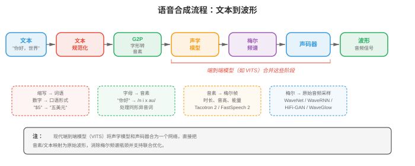
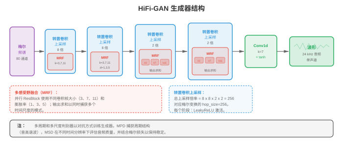
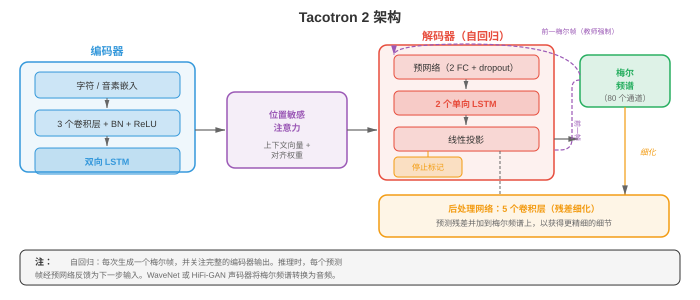
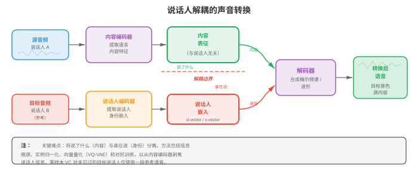

# 文本转语音与语音

*文本转语音合成（text-to-speech synthesis）反转 ASR 流程，从书面文本生成自然的音频。本节涵盖 TTS 流程（文本规范化、G2P、声学模型、声码器）、Tacotron、WaveNet、HiFi-GAN、声音克隆、语音转换和语音活动检测（VAD）。*

- 第 01 节建立了信号处理工具：波形、频谱图、梅尔滤波器组和 MFCC。第 02 节把语音转换为文本。现在我们反转箭头：给定文本，合成自然的语音。这就是**文本转语音（text-to-speech, TTS）**，它也打开了语音转换、声音克隆和语音活动检测的大门。

!!! note "大白话"
    ASR 是听声音写文字，TTS 则是看文字说出声音；同一套音频基础还能支持换声音、模仿声音和判断有没有人在说话。

- 可以把 TTS 想象成舞台演出。剧本是文本输入；导演（声学模型）决定每句台词应如何发声，包括音高、时长和重音；乐团（声码器）随后演奏乐谱，产生观众实际听到的声波。现代神经 TTS 用可媲美人类说话者的演出，替代了基于规则系统生硬、机械的发音。

!!! note "大白话"
    文本只说明“说什么”；声学模型决定“怎么说”，声码器负责把这个计划真的变成可播放的声音。



- **文本转语音流程（text-to-speech pipeline）**的标准 TTS 流程有四个阶段：（1）文本规范化，（2）音素转换，（3）声学模型，（4）声码器。一些现代系统将第 3、4 阶段合并为单个端到端模型，但这一概念分解仍然有用。

!!! note "大白话"
    传统流程先把文字读对，再确定每个音怎么念，随后画出声音特征，最后还原成波形；端到端模型只是把中间几步一起学了。

- **文本规范化（text normalisation）**将原始文本转换为可发音形式。缩写被展开（“Dr.” 变为 “Doctor”），数字变为词（“1984” 变为 “nineteen eighty-four”），货币符号被读出（“$5” 变为 “five dollars”），URL 和特殊字符也会被处理。该阶段通常由带语言特定语法的规则实现，尽管也存在神经规范化模型。这里的错误会传播到每个下游阶段：若将 “St.” 读成 “saint” 而非 “street”，整句就错了。

!!! note "大白话"
    TTS 不能直接照着字符念，必须先把缩写、数字和符号翻成真正要说的话；第一步读错，后面再好也救不回来。

- **字素到音素（Grapheme-to-phoneme, G2P）转换**将规范化文本映射为音素序列。英语的拼写极不规则（“though”“through”“tough” 中的 “ough” 发音都不同），因此词典查询（CMU 发音词典）处理常见词，而神经序列到序列模型（第 06 章的编码器-解码器或第 07 章的 Transformer）处理词表外词。正字法较浅的语言（西班牙语、芬兰语）需要更简单的 G2P。输出通常为 IPA（国际音标）序列或等价的内部音素集合。

!!! note "大白话"
    字母不等于读音，尤其英语同一串字母能有多种念法；G2P 的工作就是把拼写变成明确的发音指令。

- **声学模型（acoustic models）**接收音素序列，产生中间声学表示，几乎总是**梅尔频谱图（mel spectrogram）**（第 01 节）。梅尔频谱图捕捉每个时间帧的频谱包络，其中编码了声码器重建波形所需、在感知上相关的信息。声学模型必须决定时序（每个音素持续多久）、音高（基频 $F_0$）和能量（响度）。

!!! note "大白话"
    声学模型把“要念哪些音”排成一张声音设计图：每个音念多久、音调高低、声音轻重都在这里决定。

- **声码器（vocoders）**接收梅尔频谱图并产生原始音频波形。这是一个不适定的逆问题：许多波形可产生相同频谱图，因为相位信息已被丢弃。经典声码器（Griffin-Lim、WORLD）采用迭代或信号模型方法，但神经声码器如今在质量上占主导地位。

!!! note "大白话"
    频谱图像声音的简化说明书，丢掉了部分相位细节；声码器要从不完整信息中补出一个听起来可信的波形。

- **声码器：WaveNet**（van den Oord 等，2016）是第一个能生成几乎无法与人类录音区分的语音的神经声码器。它自回归地建模波形，在全部先前样本条件下预测每个样本 $x_t$：

!!! note "大白话"
    WaveNet 每次只生成下一个极短的声音采样点，并参考全部已经生成的点，因此细节很真，但速度会受限。

$$P(x) = \prod_{t=1}^{T} P(x_t \mid x_1, \ldots, x_{t-1}, c)$$

!!! note "大白话"
    这条式子把整段音频的概率拆成连续小决定：第 $t$ 个采样点要看前面所有采样点和条件 $c$。

- 其中 $c$ 是条件信号（梅尔频谱图）。每个样本为 16 位，因此对 65536 个值进行朴素 softmax 不切实际。WaveNet 使用**mu-law 压扩（mu-law companding）**将其降至 256 个量化级，或由后续变体使用 logistic 分布的混合。

!!! note "大白话"
    直接在六万多个数值里选下一个采样点太贵，mu-law 先把细微差异压缩成 256 档，计算才可承受。

- WaveNet 的核心构建块是**膨胀因果卷积（dilated causal convolution）**。因果表示滤波器权重只查看过去样本（没有未来泄漏）；膨胀表示滤波器以指数增长的间隔跳过样本，膨胀因子为 $1, 2, 4, 8, \ldots, 512$。这在保持参数量线性的同时给出指数大的感受野。

!!! note "大白话"
    因果保证生成时不偷看未来，膨胀卷积则隔着越来越大的步子回看历史，用不多的层覆盖很长一段声音。

- 每层的门控激活为：

!!! note "大白话"
    一支卷积提出候选信息，另一支卷积决定放行多少，两者相乘实现可控的信息流。

$$z = \tanh(W_{f} \ast x) \odot \sigma(W_{g} \ast x)$$

!!! note "大白话"
    $\tanh$ 生成内容，$\sigma$ 给出 0 到 1 的开关，$\odot$ 把内容按开关强弱筛选。

- 其中 $W_f$ 和 $W_g$ 是滤波器与门控卷积权重，$\ast$ 表示膨胀因果卷积，$\odot$ 是逐元素乘法。这种门控机制（来自第 06 章的 LSTM）让网络控制信息流。

!!! note "大白话"
    门控让网络能在不同位置决定哪些历史声音值得保留，哪些该弱化。

- WaveNet 的质量卓越，但推理极慢：生成一秒 24 kHz 音频需要 24000 次顺序前向传播。这推动了之后所有声码器研究。

!!! note "大白话"
    一秒声音要连续做 24000 次预测，效果虽好，实时生成却很吃力，所以后来模型都在想办法并行化。

- **WaveRNN**（Kalchbrenner 等，2018）以单层循环网络替代 WaveNet 深卷积堆叠。它将每个 16 位样本分为粗（高 8 位）和细（低 8 位）成分，并使用 GRU（第 06 章）预测两者。这种双 softmax 方法在保持高质量的同时显著减少计算。经仔细核优化后，WaveRNN 在移动 CPU 上也足够快，可实时运行。

!!! note "大白话"
    WaveRNN 用更小的循环网络先定声音的大致值，再补细节，因此比 WaveNet 更适合手机等算力有限设备。

- **WaveGlow**（Prenger 等，2019）是**基于流（flow-based）**的声码器，完全避免自回归生成。它使用一系列可逆变换（仿射耦合层，第 06 章的归一化流），将简单高斯分布映射为波形分布。训练通过变量变换公式最大化精确对数似然：

!!! note "大白话"
    WaveGlow 不再一个采样点一个采样点地写，而是把随机噪声经一串可逆变换一次性变成整段波形。

$$\log P(x) = \log P(z) + \sum_{i} \log \left| \det \frac{\partial f_i}{\partial f_{i-1}} \right|$$

!!! note "大白话"
    这条公式同时算变换后样本有多常见，以及每一步变换把空间拉伸或压缩了多少，保证概率计算仍然正确。

- 其中 $z = f(x)$ 是 $x$ 经流得到的潜变量。推理时，采样 $z \sim \mathcal{N}(0, I)$，并在一次并行计算中通过逆流变换。WaveGlow 用模型大小（耦合层需要大型网络）换取生成速度。

!!! note "大白话"
    生成时先抽一份普通高斯噪声，再反向变换成声音；它用更大的网络换来了不必逐点等待的速度。

- **HiFi-GAN**（Kong 等，2020）使用**生成对抗网络（generative adversarial network）**从梅尔频谱图合成波形。生成器通过一系列转置卷积对梅尔频谱图上采样，每层后跟随**多感受野融合（multi-receptive field fusion, MRF）**模块。MRF 模块并行应用具有不同核大小和膨胀率的多个残差块，再将输出求和。这让生成器同时捕捉多个时间尺度的模式。

!!! note "大白话"
    HiFi-GAN 把短小的频谱图逐步放大成波形，并同时检查近处和远处的声音规律，既快又能保住细节。



- HiFi-GAN 使用两类判别器。**多周期判别器（multi-period discriminator, MPD）**通过按不同周期（2、3、5、7、11）折叠，将一维波形重塑为二维，再应用二维卷积。这可捕捉不同基频下的周期结构。**多尺度判别器（multi-scale discriminator, MSD）**对原始波形、2 倍下采样版本与 4 倍下采样版本进行操作，捕捉不同时间分辨率的模式。

!!! note "大白话"
    一个判别器专门挑声音周期是否自然，另一个从快慢不同的时间尺度挑整体形状是否像真录音。

- 训练目标结合对抗损失、**梅尔频谱图重建损失（mel spectrogram reconstruction loss）**（合成音频与真实音频梅尔频谱图之间的 L1 距离）及**特征匹配损失（feature matching loss）**（中间判别器特征间的 L1 距离）：

!!! note "大白话"
    训练不仅要求骗过判别器，还要求频谱和判别器内部看到的特征接近真实音频，避免只会制造表面像真的噪声。

$$\mathcal{L}_G = \mathcal{L}_{\text{adv}}(G) + \lambda_{\text{mel}} \mathcal{L}_{\text{mel}}(G) + \lambda_{\text{fm}} \mathcal{L}_{\text{fm}}(G)$$

!!! note "大白话"
    三项损失分别管“像真不真”“频谱对不对”“中间特征像不像”，权重 $\lambda$ 决定各项的侧重点。

- HiFi-GAN 的合成质量可与 WaveNet 相当，速度却快 1000 多倍，可在单张 GPU 上实时生成。

!!! note "大白话"
    它把逐点生成改成并行上采样，因此质量接近 WaveNet，速度却能高出几个数量级。

- **神经源-滤波器（Neural source-filter, NSF）模型**将传统信号处理与神经网络结合。在经典源-滤波器模型中，有声语音由源激励（基频 $F_0$ 下的周期脉冲列）经过声道滤波器（频谱包络）产生。NSF 模型以神经网络替代手工滤波器，同时保留显式源信号。输入 $F_0$ 轮廓提供细粒度音高控制，而纯数据驱动声码器有时难以做到这一点。

!!! note "大白话"
    NSF 保留“声带提供周期振动、声道塑造音色”的物理直觉，再让神经网络学习复杂部分，所以音高更好控制。

- **声学模型：Tacotron**（Wang 等，2017）是第一个直接将字符序列转换为梅尔频谱图的端到端神经 TTS 系统。它使用带注意力的编码器-解码器架构（第 07 章）。编码器通过卷积组、高速网络和双向 GRU 处理字符/音素序列。解码器是自回归 GRU，以先前帧和注意力上下文为输入，每次预测一个梅尔帧。

!!! note "大白话"
    Tacotron 读入文字后，靠注意力决定当前该看哪个字，并一帧一帧画出频谱图。

- **Tacotron 2**（Shen 等，2018）对架构作了显著改进。编码器为 3 层一维卷积堆叠，后接双向 LSTM（第 06 章）。解码器为带**位置敏感注意力（location-sensitive attention）**的 2 层 LSTM；它不仅以编码器输出和解码器状态为条件，还以先前步的累计注意力权重为条件。这避免注意力跳过或重复词语这一常见失败模式。

!!! note "大白话"
    Tacotron 2 让注意力记住自己已经读到哪里，减少合成时跳词、重词或在同一位置打转。



- 编码器位置 $j$、解码器步 $i$ 的位置敏感注意力能量为：

!!! note "大白话"
    注意力打分除了看当前想生成什么和每个文字内容，还参考先前已经关注过的位置。

$$e_{i,j} = w^T \tanh(W_s s_{i-1} + W_h h_j + W_f f_{i,j} + b)$$

!!! note "大白话"
    $f_{i,j}$ 是“之前看过哪里”的位置信息，它使模型更倾向于平稳地从前往后读，而非随意跳动。

- 其中 $s_{i-1}$ 是先前解码器状态，$h_j$ 是位置 $j$ 的编码器输出，$f_{i,j}$ 是将累计注意力权重 $\sum_{k<i} \alpha_{k,j}$ 与一维卷积滤波器卷积得到的位置特征。注意力权重为 $\alpha_{i,j} = \text{softmax}(e_{i,j})$。

!!! note "大白话"
    每个位置先得到分数，再经 softmax 变成关注比例；历史关注记录帮助模型知道下一步该往哪里移动。

- Tacotron 2 的解码器还在每一步预测**停止 token（stop token）**概率，指示梅尔频谱图何时完成。输出梅尔频谱图随后传给声码器（最初是 WaveNet，后来以 HiFi-GAN 或类似模型替代）。

!!! note "大白话"
    除了画下一帧频谱，模型还要判断整句话有没有画完，画完后才交给声码器播放出来。

- Tacotron 2 的自回归特性意味着合成速度受梅尔帧数限制。对典型的每秒 80 帧梅尔频谱图，5 秒话语需要 400 个顺序解码器步。

!!! note "大白话"
    它生成五秒语音要连续做四百次决定，前一步没完成后一步不能开始，速度天然受限。

- **FastSpeech**（Ren 等，2019）通过**非自回归（non-autoregressive）**声学模型解决速度问题。FastSpeech 不顺序生成梅尔帧，而是并行生成所有帧。关键挑战是决定每个音素应产生多少梅尔帧，FastSpeech 通过**时长预测器（duration predictor）**处理这一问题。

!!! note "大白话"
    FastSpeech 一次生成整张频谱图，速度快；但它必须先知道每个音该占多长时间，才能把文字和声音对齐。

- 时长预测器是一个小型卷积网络，为每个音素预测整数时长（梅尔帧数）。训练时，通过预训练的自回归教师模型（Tacotron 2）的注意力对齐提取真实时长。推理时，使用预测时长通过**长度调节器（length regulator）**将音素级隐藏序列扩展至帧级；它只是为预测帧数重复每个音素的隐藏表示。

!!! note "大白话"
    长度调节器的做法很直观：一个音预计念 5 帧，就把它的表示复制 5 次，再让后续网络并行处理。

- **FastSpeech 2**（Ren 等，2021）通过移除教师-学生蒸馏改进 FastSpeech。它使用强制对齐（第 02 节的声学模型框架）直接提取真实时长，并除时长外加入针对音高（$F_0$）和能量的显式**方差适配器（variance adaptors）**。每个适配器都是小型卷积预测器，其输出以如下方式条件化解码器：

!!! note "大白话"
    FastSpeech 2 不再依赖另一台教师模型给对齐答案，并把时长、音高、响度分开预测，所以更容易直接控制说话方式。

```math
\begin{aligned}
\hat{d}_i &= \text{DurationPredictor}(h_i) \\
\hat{p}_i &= \text{PitchPredictor}(h_i) \\
\hat{e}_i &= \text{EnergyPredictor}(h_i)
\end{aligned}
```

!!! note "大白话"
    三个预测器分别回答一个音念几帧、音调多高、声音多响，解码器据此生成带韵律的频谱图。

- 其中 $h_i$ 是音素 $i$ 的编码器隐藏状态。训练时使用真实值；推理时使用预测值，从而明确控制韵律。可控性是 FastSpeech 2 的一大优势：调整音高、速度或能量只需缩放预测器输出。

!!! note "大白话"
    训练时有标准答案可学，生成时自己预测；想让声音更快、更高或更有力，可以直接改对应数值。

- FastSpeech 2 在推理时通常比 Tacotron 2 快 10-20 倍，并避免漏词、重复和注意力崩溃等常见自回归失败模式。

!!! note "大白话"
    因为不再逐帧依赖前一步，FastSpeech 2 既更快，也少了自回归注意力走偏造成的漏词和重词。

- **VITS**（Kim 等，2021）是一个**端到端（end-to-end）** TTS 模型，直接由文本生成波形，去除了单独的声码器阶段。VITS 将条件变分自编码器（第 06 章）与归一化流、对抗训练结合。后验编码器将真实梅尔频谱图映射至潜在空间；先验编码器通过基于 Transformer 的文本编码器和时长预测器，将音素映射到同一潜在空间；解码器（基于 HiFi-GAN）从潜变量样本生成波形。

!!! note "大白话"
    VITS 把“文字到频谱”和“频谱到波形”放进同一个系统联合学习，直接从文本生成声音，减少两段模型交接时的信息损失。

- VITS 的训练目标组合以下部分：

!!! note "大白话"
    它同时要求潜在表示能还原声音、文字和声音的表示对得上、生成波形像真的、每个音的时长也合理。

    - **重建损失（reconstruction loss）**：VAE 强制潜在分布编码声学信息。

        !!! note "大白话"
            重建损失确保压缩后的潜在表示没有把原声音的关键声学信息丢掉。

    - **KL 散度（KL divergence）**：将文本条件先验与音频条件后验对齐。

        !!! note "大白话"
            KL 散度让“从文本预测的潜在空间”靠近“从真实音频得到的潜在空间”。

    - **对抗损失（adversarial loss）**：判别器确保波形质量。

        !!! note "大白话"
            判别器像挑剔听众，逼生成器去掉明显不自然的声音痕迹。

    - **时长损失（duration loss）**：训练随机时长预测器。

        !!! note "大白话"
            时长损失保证文字扩展到声音时间轴时不会太急、太慢或错位。

- VITS 比两阶段系统（FastSpeech 2 + HiFi-GAN）生成质量更高，因为声学模型和声码器是联合优化的，避免了预测梅尔频谱图与真实梅尔频谱图不匹配而使两阶段系统质量下降的问题。

!!! note "大白话"
    分开训练时，声码器可能只见过真实频谱图，实际却要处理模型画出的频谱图；VITS 联合训练，能适应这个真实使用场景。

- **VALL-E**（Wang 等，2023）彻底将 TTS 重构为离散音频 token 上的**语言建模问题（language modelling problem）**。它使用神经音频编解码器（EnCodec），将语音表示为来自多个码本层级的离散码序列。给定文本提示和一段 3 秒的注册话语（也编码为离散 token），VALL-E 使用 Transformer 语言模型自回归预测音频 token。

!!! note "大白话"
    VALL-E 把声音也拆成 token，像语言模型续写文字那样续写音频；短提示既给出要说的内容，也给出声音身份。

- VALL-E 使用两个模型：一个**自回归（autoregressive, AR）模型**逐 token 生成第一码本层级，及一个**非自回归（non-autoregressive, NAR）模型**以第一层和其他层为条件，并行预测其余码本层级。这种编解码器语言模型方法可实现出色的零样本声音克隆：3 秒样本就足以复现说话者的声音、音色甚至情感语调。

!!! note "大白话"
    第一层负责按顺序定下声音主干，其他层并行补细节，因此既能保住说话者特征，也不会每一层都慢慢生成。

- **StyleTTS**（Li 等，2022）和 **StyleTTS 2** 将语音解耦为内容与风格成分。风格编码器从参考音频中提取风格向量，捕捉说话者身份、韵律和录音条件。推理时，风格可从学习到的先验分布采样，或从参考话语迁移。StyleTTS 2 对风格先验使用扩散模型（第 08 章），生成多样且自然的韵律。

!!! note "大白话"
    它把“说什么”和“以什么感觉说”拆开，内容不变时可以换说话风格，或让模型采样不同但自然的表达方式。

- **Kokoro**（2024）是轻量、高质量的开源 TTS 模型，以小体积（约 82M 参数）和令人印象深刻的自然度著称。它使用受 StyleTTS 2 启发的架构，具有基于扩散的风格先验和微调过的 ISTFTNet 声码器；后者直接预测 STFT 系数（第 01 节），而非原始波形样本。尽管规模仅是 VALL-E 等模型的一小部分，Kokoro 对英语、日语、法语、韩语和中文仍达到接近人类的自然度，说明精心整理的训练数据与高效架构设计可与蛮力规模竞争。Kokoro 的小占用使其适用于本地和边缘部署。

!!! note "大白话"
    Kokoro 的重点是用相对小的模型做好数据和架构，在本地设备也能生成自然语音，不必靠超大参数量硬堆。

- **Orpheus**（Canopy Labs，2025）是一系列开源 TTS 模型（1B 和 3B 参数），建立在 VALL-E 开创的**编解码器语言模型（codec language model）**范式上。Orpheus 进一步采用 LLM 主干（微调的 Llama 3），直接生成 SNAC 音频编解码器 token。其突出特点是类人情感表达：它能以出色自然度处理笑声、叹息、犹豫和情感韵律。输入文本可使用 `[laugh]`、`[sigh]` 等标签提示 Orpheus，从而细粒度控制副语言表达。

!!! note "大白话"
    Orpheus 把语言模型用于生成声音 token，连笑声、叹气和犹豫都能由文本标签提示，重点是让表达更像真人对话。

- **Dia**（Nari Labs，2025）是开源对话 TTS 模型，可从单份文本转录生成真实的多说话者对话。Dia 基于 1.6B 参数编码器-解码器 Transformer，能在对话中处理轮流说话、说话者特定声音及非语言线索（笑声、停顿）。它也支持从短音频提示克隆声音，从而在对话环境中进行零样本说话者生成。

!!! note "大白话"
    Dia 不只念一段独白，还要处理谁先说、谁接话、每个人是什么声音和何时停顿，目标是还原对话感。

- **Sesame CSM**（Conversational Speech Model，2025）聚焦自然的多轮会话语音。Sesame 不优化朗读式 TTS，而是建模真实对话的动态：附和语（“uh huh”）、打断、说话者之间节奏变化和情感响应。模型采用以会话上下文（文本与音频历史）为条件的 Transformer 主干，生成风格适应对话流动的语音。

!!! note "大白话"
    朗读好听不等于聊天自然；Sesame 关注的是接话、附和、打断和情绪变化这些真实交流里的节奏。

- **Fish Speech**（Fish Audio，2024）是开源 TTS 系统，采用双自回归架构：大型语言模型从文本生成语义 token，较小模型将它们转换为 VQGAN 声学 token，随后声码器解码为波形。Fish Speech 支持从 10-15 秒参考音频进行零样本声音克隆，且延迟低，适合实时应用。其模块化设计允许独立替换组件（如不同声码器）。

!!! note "大白话"
    Fish Speech 先决定声音表达的语义内容，再补成具体声学 token，模块分工明确，也便于替换单个部件。

- **ChatTTS**（2024）是面向聊天机器人、虚拟助手等对话应用的开源会话 TTS 模型。它通过嵌入文本输入的特殊 token，以细粒度控制韵律特征（笑声、停顿、填充词），生成自然、会话化的语音。ChatTTS 支持中英混合合成和多说话者生成。

!!! note "大白话"
    ChatTTS 面向聊天场景，文本里加特殊 token 就能控制停顿、笑声和填充词，让语音不像照本宣科。

- **Bark**（Suno，2023）是基于 Transformer 的开源模型，可从文本提示生成语音、音乐和音效。它使用三阶段 Transformer 模型流程（文本 → 语义 token → 粗粒度声学 token → 细粒度声学 token），支持声音克隆、多语言合成和音乐、环境声等非语音音频。Bark 的通用性以可控性为代价：它不如专用 TTS 系统精确，但更灵活。

!!! note "大白话"
    Bark 更像通用音频生成器，能做语音之外的音乐和音效，但越通用，想精确控制某一句话时通常越不如专用 TTS。

- **Parler-TTS**（Hugging Face，2024）以**自然语言描述（natural language description）**控制声音：用户无需提供参考音频片段来设定风格，而是给出如“一位在安静房间中、声音温暖且富有表现力的女性说话者”这样的文本描述。Parler-TTS 在带标注的语音数据上训练，每段话语均与对说话风格的自然语言描述配对，因此无需任何参考音频便可直观控制。

!!! note "大白话"
    它让用户直接用文字描述想要的声音风格，不必先找一段参考录音，控制方式更直观。

- **Neuphonic** 是基于 API 的 TTS 平台，针对超低延迟语音合成优化，面向实时语音代理和会话式 AI 应用。它借助流式架构在完整输入文本可用前就开始生成音频，实现低于 100 ms 的首音频时间。Neuphonic 专注部署与延迟优化层，而不是新颖的模型架构，为现代神经 TTS 提供生产级基础设施。

!!! note "大白话"
    实时语音助手不能等整段回答写完才开口；它一边收到文本一边生成声音，重点是把第一声尽快送出来。

- **KittenTTS** 是为高效和低资源部署设计的紧凑、快速 TTS 模型。它优先考虑边缘和嵌入式应用的极低延迟与小模型尺寸，以部分自然度交换 CPU 和移动设备上的实时性能。

!!! note "大白话"
    KittenTTS 的取舍很明确：设备资源有限时，先保证小、快、能实时，再接受自然度少一点。

- 现代 TTS 版图正分为两种范式：（1）**编解码器语言模型（codec language models）**（VALL-E、Orpheus、Fish Speech），将语音生成视为离散音频码上的下一个 token 预测，利用 LLM 的缩放定律；（2）**基于流/扩散的模型（flow/diffusion-based models）**（VITS、StyleTTS 2、Kokoro），通过迭代细化生成连续梅尔频谱图或波形。编解码器 LM 擅长零样本克隆和表现力；流/扩散模型通常更小、更快。两者都在迅速接近人类自然度。

!!! note "大白话"
    现在主流路线一条是把声音当 token 来续写，强在模仿和表现力；另一条是逐步生成连续声音，常更轻更快，选哪条取决于需求。

- **韵律建模（prosody modelling）**控制语音的“音乐性”：音高、时长、能量、节奏和语调。若韵律欠佳，即便单个音素清晰，合成语音也会平淡、机械。可将韵律理解为单调 GPS 声音与富有表现力的有声书叙述者之间的差异。

!!! note "大白话"
    韵律决定一段话听起来像真人在表达，还是像机器平铺直叙；字念对了但节奏和重音不对，仍会很生硬。

- **音高（pitch）**（基频 $F_0$）是感知到的语音高低。它在问句结尾升高，在陈述句结尾降低，并在情感语音中持续变化。$F_0$ 通过 CREPE（神经音高跟踪器）或 YIN（基于自相关，第 01 节）等算法从音频提取。在 TTS 中，音高要么由声学模型预测（FastSpeech 2 的音高预测器），要么被隐式学习（Tacotron 2）。

!!! note "大白话"
    音高就是声音的高低起伏，它会让同一句字听成陈述、提问、惊讶或平静。

- **时长（duration）**决定语速和节奏。重读音节更长，虚词会缩短，停顿标记短语边界。时长建模在非自回归模型（FastSpeech）中是显式的，在自回归模型中是隐式的（Tacotron 的注意力对齐决定时长）。

!!! note "大白话"
    时长决定哪里该拖长、哪里该快过、哪里该停一下，是语音节奏的骨架。

- **能量（energy）**（响度）承载强调。“I didn't say HE stole it” 与 “I didn't say he STOLE it” 的不同含义完全由能量模式传达。

!!! note "大白话"
    同一句话把不同词说得更响，重点和意思都会变，所以响度不是无关紧要的音量。

- **风格嵌入（style embeddings）**捕捉更高层的韵律模式。**全局风格 token（Global Style Token, GST）**框架（Wang 等，2018）学习一个风格 token 库（对学习到的一组嵌入做软注意力），捕捉如“兴奋”“悲伤”“低语”等说话风格。风格嵌入从参考话语中提取并添加到编码器输出，使推理时能够进行风格迁移。

!!! note "大白话"
    风格嵌入把“兴奋、低语、悲伤”等整体说话感觉压成一个向量，生成时把它加进去就能迁移这种感觉。

- **语音转换（voice conversion, VC）**在保留语言内容的同时改变一段话语的说话者身份。可以想象录下自己的声音，再让输出听起来像某个特定目标说话者。VC 要求将说话者身份与内容解耦。

!!! note "大白话"
    语音转换的目标是“台词不变，换一个人说”，关键难点是把内容和音色真正分开。



- **说话者嵌入（speaker embeddings）**（第 04 节会进一步说明）将说话者身份编码为固定维度向量。它们可以来自预训练说话者验证模型（x-vectors、ECAPA-TDNN）。在 VC 中，源语音被编码为与说话者无关的内容表示，再使用目标说话者嵌入解码。

!!! note "大白话"
    说话者嵌入相当于一张数字化声纹名片；保留源话语的内容，换成目标的名片，就能尝试换出目标音色。

- **解耦表示（disentangled representations）**将语音拆分为独立因素：内容（音素）、说话者身份、音高和节奏。方法包括：

!!! note "大白话"
    真正换声的前提是把一段语音拆成几种互不混淆的信息：说了什么、谁说的、怎么说的。

    - **信息瓶颈（information bottleneck）**：将内容表示压缩得足够紧，以致说话者信息丢失（AutoVC）。

        !!! note "大白话"
            把内容通道压得很窄，迫使它只保留发音内容，装不下太多个人音色信息。

    - **对抗训练（adversarial training）**：在内容表示上训练说话者分类器，并使用梯度反转移除说话者信息。

        !!! note "大白话"
            一边让分类器试图认出说话者，一边反向训练内容编码器让它骗过分类器，从内容中抹掉身份线索。

    - **向量量化（vector quantisation）**：VQ-VAE 强制内容通过离散瓶颈，自然剥离说话者身份（因为码本条目表示音素类别而非说话者特征）。

        !!! note "大白话"
            离散码本更容易记录“这是什么音”，却较难携带连续细微的个人嗓音特征。

- **声音克隆（voice cloning）**以目标说话者的声音合成语音。**多说话者 TTS（multi-speaker TTS）**在来自多个说话者的数据上训练，并以说话者嵌入为条件。推理时，从注册音频提取新说话者嵌入，用它作为生成条件。

!!! note "大白话"
    多说话者 TTS 先学会许多人的声音规律，后来给它一段新人的注册语音，就用提取出的声纹条件来模仿。

- **少样本声音克隆（few-shot voice cloning）**使用少量数据（数分钟）适应新说话者。说话者编码器从注册音频提取嵌入，TTS 模型在该嵌入条件下生成语音。这是 SV2TTS（Jia 等，2018）采用的方法：独立训练的说话者编码器、以说话者嵌入为条件的 Tacotron 2 合成器，以及 WaveRNN 声码器。

!!! note "大白话"
    少样本克隆需要几分钟目标声音，先提取稳定的声纹向量，再用这个向量指导 TTS 生成。

- **零样本声音克隆（zero-shot voice cloning）**完全不需要适应：一段很短的话语（3-30 秒）就够。VALL-E 通过将注册音频作为语言模型提示来实现这一点。模型能学会继续以同一声音生成，因为它在大规模多说话者数据上训练，而同一话语中声音一致是统计规律。

!!! note "大白话"
    零样本克隆不为新声音重新训练，只靠几秒示例直接模仿，前提是基础模型已从大量说话者中学会如何抽取身份特征。

- **语音活动检测（voice activity detection, VAD）**在每个时间帧回答一个简单的二元问题：是否有人在说话？尽管简单，VAD 是 ASR（第 02 节）、说话者分离（第 04 节）和降噪（第 05 节）的关键预处理步骤。好的 VAD 通过跳过静音减少计算，并避免将噪声当作语音处理，从而提升准确率。

!!! note "大白话"
    VAD 只判断“现在有没有人说话”，先把静音和无关声音排除，后面的识别、分人和降噪都更省算力、更少误判。

- 经典 VAD 使用能量阈值（语音比静音响）、过零率（语音有特征性的过零模式）与频谱特征。在信噪比较低的噪声环境中，这些方法会失效。

!!! note "大白话"
    传统规则靠“够不够响、波形怎么过零”来猜人声；环境一嘈杂，噪声也可能满足这些规则。

- **神经 VAD（neural VAD）**模型将问题视为帧级二元分类。小型 RNN 或 CNN 接收声学特征（第 01 节的对数梅尔能量），预测语音/非语音概率。

!!! note "大白话"
    神经 VAD 不靠单一阈值，而是从大量例子里学出“人声长什么样”，逐帧给出概率。

- **WebRTC VAD**（Google）是经典轻量 VAD，在简单频谱特征上使用基于 GMM 的分类器。它有四个激进程度级别（0-3），速度极快，但难以处理音乐、非语音发声和低 SNR 环境。由于零依赖且简单，至今仍被广泛用作基线。

!!! note "大白话"
    WebRTC VAD 轻到几乎随处可用，适合做快速基线；但音乐或强噪声出现时，它更容易把非人声弄错。

- **Silero VAD**（Silero Team，2021）是生产使用中事实标准的神经 VAD。其架构是小型一维深度可分离卷积堆叠（第 08 章的 MobileNet 思想应用于音频），后接单层 LSTM 建模时间上下文，最后以线性头为每帧生成语音概率。整个模型不足 2MB（约 1M 参数），以 30-100 ms 块处理音频。

!!! note "大白话"
    Silero VAD 用很小的神经网络结合当前声音和短期历史，在准确度、体积和实时性之间取得了适合生产使用的平衡。

    - **输入（input）**：原始 16 kHz 音频（无需手工特征提取，卷积前端直接从波形学习自身特征）。

        !!! note "大白话"
            它直接听原始波形，不需要工程师先手工算一堆声学特征。

    - **窗口化有状态推理（windowed stateful inference）**：LSTM 隐状态在块之间延续，因此模型可处理流式音频，无需重复处理完整历史。每次调用处理 30、60 或 100 ms 块，并返回 $[0, 1]$ 内的语音概率。

        !!! note "大白话"
            每次只处理很短一块，但把上块记忆带到下块，所以既能实时，又不会每次都从头听。

    - **自适应阈值（adaptive thresholding）**：Silero VAD 不使用单一固定阈值，而是分别使用起始和结束阈值并设定最短语音/静音时长，避免在有噪边界快速切换。语音片段必须持续至少一段最短时长地超过起始阈值才会被确认；而静音必须持续低于结束阈值，片段才会关闭。

        !!! note "大白话"
            开始和结束用不同门槛，再要求持续一段时间，避免噪声让检测结果一会儿开一会儿关。

    - **性能（performance）**：Silero VAD 在 CPU 上的实时因子为 1-2%（处理 1 秒音频约需 10-20 ms），适合边缘设备、手机和实时流程。它在含噪、音乐丰富的音频上显著优于 WebRTC VAD，同时仍小到可设备端部署。

        !!! note "大白话"
            处理一秒音频只需约十几毫秒，说明普通 CPU 也有很大余量做实时检测。

    - Silero VAD 常作为 Whisper（第 02 节）的前端，在转录前将长音频分割为话语级块；也用于说话者分离流程（第 04 节），在提取说话者嵌入前确定语音区域。

        !!! note "大白话"
            它先找出真正有人说话的片段，再交给 Whisper 或说话者模型，避免把大段静音和杂声送去处理。

- **声学活动检测（acoustic activity detection, AAD）**将 VAD 泛化为检测任何声学活动，而不仅是语音。这对智能家居设备、安防系统和野生动物监测有用。AAD 模型检测玻璃破碎、狗叫或警报等事件，常使用第 04 节描述的音频分类框架。

!!! note "大白话"
    AAD 把问题从“有没有人说话”扩大为“有没有值得关注的声音”，例如警报或玻璃破碎。

- TTS 的**评估指标（evaluation metrics）**同时衡量客观质量和主观自然度：

!!! note "大白话"
    TTS 好不好不能只看一个数字：人耳觉得自不自然、音频与参考有多接近、声音像不像目标人、能否听清都要看。

    - **平均意见分（Mean Opinion Score, MOS）**：人类听众以 1-5 分评价自然度。这是金标准，但昂贵且缓慢。

        !!! note "大白话"
            MOS 最接近真实听感，但得请人试听打分，成本高且结果会有主观差异。

    - **梅尔倒谱失真（mel cepstral distortion, MCD）**：衡量合成梅尔倒谱与参考梅尔倒谱之间的距离。越低越好，但不总与感知一致。

        !!! note "大白话"
            MCD 是自动距离指标，方便批量比较，但数字接近不一定意味着人耳就觉得自然。

    - **PESQ / POLQA**：最初为电话通信设计的标准化感知评估指标。

        !!! note "大白话"
            这两类指标按人耳感知设计，原本用于评估电话音质，也能辅助判断语音质量。

    - **说话者相似度（speaker similarity）**：合成音频与参考音频的说话者嵌入之间的余弦相似度（与声音克隆相关）。

        !!! note "大白话"
            说话者相似度用声纹向量比较“像不像同一个人”，特别适合衡量声音克隆。

    - **可懂度（intelligibility）**：将合成音频输入 ASR 系统（第 02 节）并计算 WER 来测量。

        !!! note "大白话"
            可懂度看机器能否把合成语音再正确听写出来，间接衡量内容是否清楚。

## 编程任务（使用 CoLab 或 notebook）

- **任务 1：由梅尔频谱图进行 Griffin-Lim 声码。**实现 Griffin-Lim 迭代相位重建算法，将梅尔频谱图还原为波形。这展示了声码器问题以及为何需要神经声码器。
```python
import jax
import jax.numpy as jnp
import matplotlib.pyplot as plt

# Generate a synthetic waveform (sum of harmonics simulating a vowel)
sr = 16000
duration = 1.0
t = jnp.linspace(0, duration, int(sr * duration))
f0 = 220.0  # fundamental frequency
waveform = (
    0.6 * jnp.sin(2 * jnp.pi * f0 * t) +
    0.3 * jnp.sin(2 * jnp.pi * 2 * f0 * t) +
    0.1 * jnp.sin(2 * jnp.pi * 3 * f0 * t)
)

# Compute STFT
n_fft = 1024
hop_length = 256
window = jnp.hanning(n_fft)

def stft(signal, n_fft, hop_length, window):
    """Compute Short-Time Fourier Transform."""
    n_frames = 1 + (len(signal) - n_fft) // hop_length
    frames = jnp.stack([
        signal[i * hop_length : i * hop_length + n_fft] * window
        for i in range(n_frames)
    ])
    return jnp.fft.rfft(frames, n=n_fft)

def istft(stft_matrix, hop_length, window, length):
    """Compute inverse STFT with overlap-add."""
    n_fft = (stft_matrix.shape[1] - 1) * 2
    n_frames = stft_matrix.shape[0]
    frames = jnp.fft.irfft(stft_matrix, n=n_fft)
    frames = frames * window[None, :]
    output = jnp.zeros(length)
    for i in range(n_frames):
        start = i * hop_length
        end = start + n_fft
        if end <= length:
            output = output.at[start:end].add(frames[i])
    return output

# Forward STFT
S = stft(waveform, n_fft, hop_length, window)
magnitude = jnp.abs(S)

# Mel filterbank
n_mels = 80
mel_low = 0.0
mel_high = 2595 * jnp.log10(1 + (sr / 2) / 700)
mel_points = jnp.linspace(mel_low, mel_high, n_mels + 2)
hz_points = 700 * (10 ** (mel_points / 2595) - 1)
freq_bins = jnp.floor((n_fft + 1) * hz_points / sr).astype(int)

mel_filterbank = jnp.zeros((n_mels, n_fft // 2 + 1))
for m in range(n_mels):
    f_left = freq_bins[m]
    f_center = freq_bins[m + 1]
    f_right = freq_bins[m + 2]
    for k in range(f_left, f_center):
        mel_filterbank = mel_filterbank.at[m, k].set(
            (k - f_left) / max(f_center - f_left, 1)
        )
    for k in range(f_center, f_right):
        mel_filterbank = mel_filterbank.at[m, k].set(
            (f_right - k) / max(f_right - f_center, 1)
        )

# To mel and back (pseudo-inverse)
mel_spec = magnitude @ mel_filterbank.T
magnitude_reconstructed = mel_spec @ jnp.linalg.pinv(mel_filterbank.T)
magnitude_reconstructed = jnp.maximum(magnitude_reconstructed, 1e-7)

# Griffin-Lim algorithm
def griffin_lim(magnitude, n_iter, hop_length, window, signal_length):
    """Iterative phase reconstruction."""
    n_fft = (magnitude.shape[1] - 1) * 2
    key = jax.random.PRNGKey(42)
    phase = jax.random.uniform(key, magnitude.shape, minval=-jnp.pi, maxval=jnp.pi)

    for _ in range(n_iter):
        complex_spec = magnitude * jnp.exp(1j * phase)
        signal = istft(complex_spec, hop_length, window, signal_length)
        reanalysis = stft(signal, n_fft, hop_length, window)
        phase = jnp.angle(reanalysis)

    complex_spec = magnitude * jnp.exp(1j * phase)
    return istft(complex_spec, hop_length, window, signal_length)

reconstructed = griffin_lim(magnitude_reconstructed, n_iter=60, hop_length=hop_length,
                            window=window, signal_length=len(waveform))

# Plot comparison
fig, axes = plt.subplots(3, 1, figsize=(12, 8))

axes[0].plot(t[:1000], waveform[:1000], color='#3498db', linewidth=0.8)
axes[0].set_title('Original Waveform')
axes[0].set_ylabel('Amplitude')

axes[1].imshow(jnp.log1p(mel_spec.T), aspect='auto', origin='lower', cmap='magma')
axes[1].set_title('Mel Spectrogram (intermediate representation)')
axes[1].set_ylabel('Mel bin')

axes[2].plot(t[:1000], reconstructed[:1000], color='#e74c3c', linewidth=0.8)
axes[2].set_title('Griffin-Lim Reconstructed Waveform (60 iterations)')
axes[2].set_xlabel('Time (s)')
axes[2].set_ylabel('Amplitude')

plt.tight_layout()
plt.show()

# Measure reconstruction error
mse = jnp.mean((waveform[:len(reconstructed)] - reconstructed[:len(waveform)]) ** 2)
print(f"MSE between original and reconstructed: {mse:.6f}")
print("Note: phase information loss through mel inversion causes artifacts.")
```

- **任务 2：时长预测器（FastSpeech 风格）。**训练小型卷积时长预测器，将音素嵌入映射为时长。这是非自回归 TTS 的核心组件。
```python
import jax
import jax.numpy as jnp
import jax.random as jr
import matplotlib.pyplot as plt

# Simulate phoneme sequences with ground-truth durations
# In real TTS, durations come from forced alignment or teacher attention
def generate_synthetic_data(key, n_samples=200, max_phonemes=30, embed_dim=64):
    """Generate synthetic phoneme embeddings and durations."""
    keys = jr.split(key, 4)
    lengths = jr.randint(keys[0], (n_samples,), 5, max_phonemes)

    all_embeddings = []
    all_durations = []
    all_masks = []

    for i in range(n_samples):
        L = int(lengths[i])
        emb = jr.normal(keys[1], (max_phonemes, embed_dim))
        # Durations: vowels (even indices) are longer, consonants shorter
        base_dur = jnp.where(jnp.arange(max_phonemes) % 2 == 0, 8.0, 4.0)
        noise = jr.normal(jr.fold_in(keys[2], i), (max_phonemes,)) * 1.5
        dur = jnp.clip(base_dur + noise, 1.0, 20.0).astype(jnp.float32)
        mask = (jnp.arange(max_phonemes) < L).astype(jnp.float32)

        all_embeddings.append(emb)
        all_durations.append(dur * mask)
        all_masks.append(mask)

    return (jnp.stack(all_embeddings), jnp.stack(all_durations),
            jnp.stack(all_masks))

key = jr.PRNGKey(42)
embeddings, durations, masks = generate_synthetic_data(key)

# Duration predictor: 2-layer 1D convolution + linear projection
def init_duration_predictor(key, embed_dim=64, hidden_dim=128, kernel_size=3):
    """Initialise duration predictor weights."""
    keys = jr.split(key, 4)
    scale1 = jnp.sqrt(2.0 / (embed_dim * kernel_size))
    scale2 = jnp.sqrt(2.0 / (hidden_dim * kernel_size))
    params = {
        'conv1_w': jr.normal(keys[0], (kernel_size, embed_dim, hidden_dim)) * scale1,
        'conv1_b': jnp.zeros(hidden_dim),
        'conv2_w': jr.normal(keys[1], (kernel_size, hidden_dim, hidden_dim)) * scale2,
        'conv2_b': jnp.zeros(hidden_dim),
        'linear_w': jr.normal(keys[2], (hidden_dim, 1)) * jnp.sqrt(2.0 / hidden_dim),
        'linear_b': jnp.zeros(1),
    }
    return params

def duration_predictor(params, x):
    """Predict log-durations from phoneme embeddings. x: (batch, seq, embed)."""
    # Conv layer 1 with ReLU
    h = jax.lax.conv_general_dilated(
        x.transpose(0, 2, 1),  # (batch, embed, seq)
        params['conv1_w'].transpose(2, 1, 0),  # (out, in, kernel)
        window_strides=(1,), padding='SAME'
    ).transpose(0, 2, 1) + params['conv1_b']  # back to (batch, seq, hidden)
    h = jax.nn.relu(h)

    # Conv layer 2 with ReLU
    h = jax.lax.conv_general_dilated(
        h.transpose(0, 2, 1),
        params['conv2_w'].transpose(2, 1, 0),
        window_strides=(1,), padding='SAME'
    ).transpose(0, 2, 1) + params['conv2_b']
    h = jax.nn.relu(h)

    # Linear projection to scalar
    log_dur = (h @ params['linear_w'] + params['linear_b']).squeeze(-1)
    return log_dur

# Loss: MSE on log-durations (standard in FastSpeech)
def loss_fn(params, embeddings, durations, masks):
    log_dur_pred = duration_predictor(params, embeddings)
    log_dur_true = jnp.log(jnp.clip(durations, 1.0, None))
    sq_err = (log_dur_pred - log_dur_true) ** 2 * masks
    return jnp.sum(sq_err) / jnp.sum(masks)

grad_fn = jax.jit(jax.value_and_grad(loss_fn))

# Training loop
params = init_duration_predictor(jr.PRNGKey(0))
lr = 1e-3
losses = []

for epoch in range(300):
    loss_val, grads = grad_fn(params, embeddings, durations, masks)
    params = jax.tree.map(lambda p, g: p - lr * g, params, grads)
    losses.append(float(loss_val))

# Evaluate on a sample
log_dur_pred = duration_predictor(params, embeddings[:1])
dur_pred = jnp.exp(log_dur_pred[0])
dur_true = durations[0]
mask = masks[0]
valid_len = int(jnp.sum(mask))

fig, axes = plt.subplots(1, 2, figsize=(14, 5))

axes[0].plot(losses, color='#3498db', linewidth=1.5)
axes[0].set_xlabel('Epoch')
axes[0].set_ylabel('MSE Loss (log-duration)')
axes[0].set_title('Duration Predictor Training')
axes[0].set_yscale('log')

x_pos = jnp.arange(valid_len)
width = 0.35
axes[1].bar(x_pos - width/2, dur_true[:valid_len], width, color='#27ae60',
            label='Ground truth', alpha=0.8)
axes[1].bar(x_pos + width/2, dur_pred[:valid_len], width, color='#e74c3c',
            label='Predicted', alpha=0.8)
axes[1].set_xlabel('Phoneme index')
axes[1].set_ylabel('Duration (frames)')
axes[1].set_title('Duration Prediction vs Ground Truth')
axes[1].legend()

plt.tight_layout()
plt.show()
```

- **任务 3：带上采样卷积的简单神经声码器。**构建最小 HiFi-GAN 风格生成器，使用转置卷积和残差块将梅尔频谱图上采样为波形。
```python
import jax
import jax.numpy as jnp
import jax.random as jr
import matplotlib.pyplot as plt

def init_residual_block(key, channels, kernel_size, dilation):
    """Initialise a dilated residual convolution block."""
    k1, k2 = jr.split(key)
    scale = jnp.sqrt(2.0 / (channels * kernel_size))
    return {
        'conv1_w': jr.normal(k1, (kernel_size, channels, channels)) * scale,
        'conv1_b': jnp.zeros(channels),
        'conv2_w': jr.normal(k2, (kernel_size, channels, channels)) * scale,
        'conv2_b': jnp.zeros(channels),
        'dilation': dilation
    }

def residual_block(params, x):
    """x: (batch, time, channels). Dilated conv residual block with LeakyReLU."""
    h = jax.nn.leaky_relu(x, negative_slope=0.1)
    # Simplified: use standard conv (dilation handled conceptually)
    h = jax.lax.conv_general_dilated(
        h.transpose(0, 2, 1),
        params['conv1_w'].transpose(2, 1, 0),
        window_strides=(1,),
        padding='SAME',
        rhs_dilation=(params['dilation'],)
    ).transpose(0, 2, 1) + params['conv1_b']
    h = jax.nn.leaky_relu(h, negative_slope=0.1)
    h = jax.lax.conv_general_dilated(
        h.transpose(0, 2, 1),
        params['conv2_w'].transpose(2, 1, 0),
        window_strides=(1,),
        padding='SAME'
    ).transpose(0, 2, 1) + params['conv2_b']
    return x + h

def init_generator(key, n_mels=80, upsample_rates=(8, 8, 4),
                   channels=128):
    """Initialise a minimal HiFi-GAN-style generator."""
    keys = jr.split(key, 10)
    params = {}

    # Input projection: mel bins -> channels
    params['input_w'] = jr.normal(keys[0], (7, n_mels, channels)) * 0.02
    params['input_b'] = jnp.zeros(channels)

    # Upsample blocks (transposed convolutions)
    in_ch = channels
    for i, rate in enumerate(upsample_rates):
        k_size = rate * 2
        scale = jnp.sqrt(2.0 / (in_ch * k_size))
        out_ch = in_ch // 2
        params[f'up{i}_w'] = jr.normal(keys[i+1], (k_size, in_ch, out_ch)) * scale
        params[f'up{i}_b'] = jnp.zeros(out_ch)
        # Residual blocks at each scale
        params[f'res{i}_0'] = init_residual_block(jr.fold_in(keys[i+4], 0),
                                                    out_ch, 3, 1)
        params[f'res{i}_1'] = init_residual_block(jr.fold_in(keys[i+4], 1),
                                                    out_ch, 3, 3)
        in_ch = out_ch

    # Output projection to mono waveform
    params['output_w'] = jr.normal(keys[8], (7, in_ch, 1)) * 0.02
    params['output_b'] = jnp.zeros(1)
    params['upsample_rates'] = upsample_rates

    return params

def generator_forward(params, mel):
    """mel: (batch, time, n_mels) -> waveform: (batch, time * prod(rates), 1)."""
    # Input projection
    h = jax.lax.conv_general_dilated(
        mel.transpose(0, 2, 1),
        params['input_w'].transpose(2, 1, 0),
        window_strides=(1,), padding='SAME'
    ).transpose(0, 2, 1) + params['input_b']

    for i, rate in enumerate(params['upsample_rates']):
        h = jax.nn.leaky_relu(h, negative_slope=0.1)
        # Upsample via transposed convolution
        k_size = rate * 2
        h = jax.lax.conv_transpose(
            h.transpose(0, 2, 1),
            params[f'up{i}_w'].transpose(2, 1, 0),
            strides=(rate,),
            padding='SAME'
        ).transpose(0, 2, 1) + params[f'up{i}_b']
        # Residual blocks
        h = residual_block(params[f'res{i}_0'], h)
        h = residual_block(params[f'res{i}_1'], h)

    h = jax.nn.leaky_relu(h, negative_slope=0.1)
    out = jax.lax.conv_general_dilated(
        h.transpose(0, 2, 1),
        params['output_w'].transpose(2, 1, 0),
        window_strides=(1,), padding='SAME'
    ).transpose(0, 2, 1) + params['output_b']

    return jnp.tanh(out)

# Create a synthetic mel spectrogram (simulating a vowel)
n_mels = 80
n_frames = 50
mel = jnp.zeros((1, n_frames, n_mels))
# Add energy in low-frequency mel bins (simulating formants)
mel = mel.at[:, :, 5:15].set(1.0)
mel = mel.at[:, :, 20:25].set(0.6)

# Initialise and run generator
key = jr.PRNGKey(42)
params = init_generator(key, n_mels=n_mels, upsample_rates=(8, 8, 4),
                         channels=128)
waveform = generator_forward(params, mel)

print(f"Input mel shape:  {mel.shape}")
print(f"Output waveform shape: {waveform.shape}")
print(f"Upsample factor: {8 * 8 * 4} = {8*8*4}x")

fig, axes = plt.subplots(2, 1, figsize=(12, 6))

axes[0].imshow(mel[0].T, aspect='auto', origin='lower', cmap='magma')
axes[0].set_title('Input Mel Spectrogram')
axes[0].set_ylabel('Mel bin')
axes[0].set_xlabel('Frame')

waveform_np = waveform[0, :, 0]
axes[1].plot(waveform_np[:2000], color='#9b59b6', linewidth=0.5)
axes[1].set_title('Generator Output Waveform (untrained - random noise)')
axes[1].set_ylabel('Amplitude')
axes[1].set_xlabel('Sample')

plt.tight_layout()
plt.show()
print("Note: The output is noise because the generator is untrained.")
print("In practice, adversarial + mel loss training shapes this into speech.")
```

- **任务 4：使用简单 RNN 的语音活动检测。**在合成音频特征上训练小型基于 GRU 的 VAD 模型，将帧分类为语音或静音。
```python
import jax
import jax.numpy as jnp
import jax.random as jr
import matplotlib.pyplot as plt

# Generate synthetic log-mel energy features with speech/silence labels
def generate_vad_data(key, n_sequences=100, n_frames=200, n_features=40):
    """Simulate log-mel features: speech regions are higher energy with structure."""
    keys = jr.split(key, 5)
    all_features = []
    all_labels = []

    for i in range(n_sequences):
        k = jr.fold_in(keys[0], i)
        k1, k2, k3 = jr.split(k, 3)

        # Random speech/silence pattern
        label = jnp.zeros(n_frames)
        n_segments = jr.randint(k1, (), 2, 6)
        for seg in range(int(n_segments)):
            start = jr.randint(jr.fold_in(k2, seg), (), 0, n_frames - 20)
            length = jr.randint(jr.fold_in(k3, seg), (), 10, 50)
            end = jnp.minimum(start + length, n_frames)
            label = label.at[int(start):int(end)].set(1.0)

        # Features: speech frames have higher energy + spectral structure
        noise = jr.normal(jr.fold_in(keys[1], i), (n_frames, n_features)) * 0.3
        speech_pattern = jnp.outer(label, jnp.exp(-jnp.arange(n_features) / 15.0))
        features = speech_pattern * 2.0 + noise + 0.1

        all_features.append(features)
        all_labels.append(label)

    return jnp.stack(all_features), jnp.stack(all_labels)

key = jr.PRNGKey(123)
features, labels = generate_vad_data(key)
train_features, train_labels = features[:80], labels[:80]
test_features, test_labels = features[80:], labels[80:]

# Simple GRU-based VAD model
def init_vad_model(key, input_dim=40, hidden_dim=64):
    keys = jr.split(key, 6)
    scale_ih = jnp.sqrt(2.0 / input_dim)
    scale_hh = jnp.sqrt(2.0 / hidden_dim)
    return {
        'W_z': jr.normal(keys[0], (input_dim, hidden_dim)) * scale_ih,
        'U_z': jr.normal(keys[1], (hidden_dim, hidden_dim)) * scale_hh,
        'b_z': jnp.zeros(hidden_dim),
        'W_r': jr.normal(keys[2], (input_dim, hidden_dim)) * scale_ih,
        'U_r': jr.normal(keys[3], (hidden_dim, hidden_dim)) * scale_hh,
        'b_r': jnp.zeros(hidden_dim),
        'W_h': jr.normal(keys[4], (input_dim, hidden_dim)) * scale_ih,
        'U_h': jr.normal(keys[5], (hidden_dim, hidden_dim)) * scale_hh,
        'b_h': jnp.zeros(hidden_dim),
        'W_out': jr.normal(jr.fold_in(keys[0], 99), (hidden_dim, 1)) * 0.1,
        'b_out': jnp.zeros(1),
    }

def gru_step(params, h, x):
    """Single GRU step."""
    z = jax.nn.sigmoid(x @ params['W_z'] + h @ params['U_z'] + params['b_z'])
    r = jax.nn.sigmoid(x @ params['W_r'] + h @ params['U_r'] + params['b_r'])
    h_tilde = jnp.tanh(x @ params['W_h'] + (r * h) @ params['U_h'] + params['b_h'])
    h_new = (1 - z) * h + z * h_tilde
    return h_new

def vad_forward(params, x):
    """x: (batch, time, features) -> logits: (batch, time)."""
    batch_size, n_frames, _ = x.shape
    hidden_dim = params['W_z'].shape[1]
    h = jnp.zeros((batch_size, hidden_dim))

    outputs = []
    for t in range(n_frames):
        h = gru_step(params, h, x[:, t, :])
        logit = (h @ params['W_out'] + params['b_out']).squeeze(-1)
        outputs.append(logit)

    return jnp.stack(outputs, axis=1)

def bce_loss(params, features, labels):
    """Binary cross-entropy loss for VAD."""
    logits = vad_forward(params, features)
    probs = jax.nn.sigmoid(logits)
    probs = jnp.clip(probs, 1e-7, 1 - 1e-7)
    loss = -(labels * jnp.log(probs) + (1 - labels) * jnp.log(1 - probs))
    return jnp.mean(loss)

grad_fn = jax.jit(jax.value_and_grad(bce_loss))

# Training
params = init_vad_model(jr.PRNGKey(0))
lr = 5e-3
losses = []

for epoch in range(200):
    loss_val, grads = grad_fn(params, train_features, train_labels)
    params = jax.tree.map(lambda p, g: p - lr * g, params, grads)
    losses.append(float(loss_val))
    if epoch % 50 == 0:
        print(f"Epoch {epoch}: loss = {loss_val:.4f}")

# Evaluate on test set
test_logits = vad_forward(params, test_features)
test_preds = (jax.nn.sigmoid(test_logits) > 0.5).astype(jnp.float32)
accuracy = jnp.mean(test_preds == test_labels)
print(f"\nTest accuracy: {accuracy:.4f}")

# Visualise a test example
idx = 0
fig, axes = plt.subplots(3, 1, figsize=(14, 7))

axes[0].imshow(test_features[idx].T, aspect='auto', origin='lower', cmap='magma')
axes[0].set_title('Log-Mel Energy Features')
axes[0].set_ylabel('Mel bin')

axes[1].fill_between(range(200), test_labels[idx], alpha=0.4, color='#27ae60',
                     label='Ground truth')
axes[1].plot(jax.nn.sigmoid(test_logits[idx]), color='#e74c3c',
             linewidth=1.5, label='Predicted probability')
axes[1].axhline(0.5, color='gray', linestyle='--', linewidth=0.8)
axes[1].set_ylabel('Speech probability')
axes[1].legend()
axes[1].set_title('VAD Predictions')

axes[2].fill_between(range(200), test_labels[idx], alpha=0.4, color='#27ae60',
                     label='Ground truth')
axes[2].fill_between(range(200), test_preds[idx], alpha=0.4, color='#f39c12',
                     label='Predicted (threshold=0.5)')
axes[2].set_ylabel('Speech / Silence')
axes[2].set_xlabel('Frame')
axes[2].legend()
axes[2].set_title('VAD Binary Decision')

plt.tight_layout()
plt.show()
```
