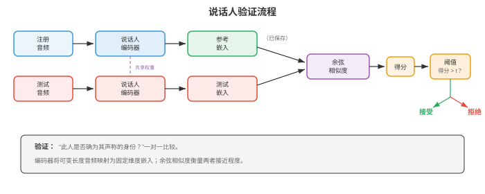
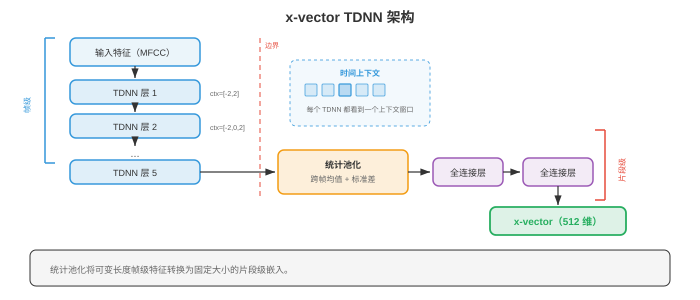
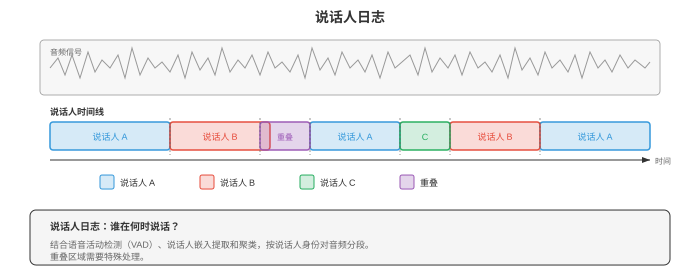
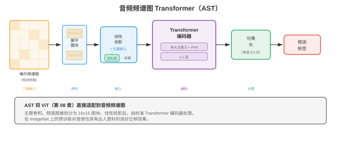

# 说话人和音频分析

*说话人和音频分析用于识别谁在说话、何时说话，以及其中有哪些非语音声音。本节涵盖说话人验证与辨认、i-vector、d-vector、x-vector、说话人日志、音频事件分类、音乐信息检索和语音情感识别。*

- 在第 01 节中，我们建立了信号处理基础：频谱图、MFCC 和梅尔滤波器组。在第 02 节中，我们识别了说了什么。现在要问的是谁说的、何时说的，以及音频中还发生了什么。说话人识别、说话人日志、音频分类和音乐分析有一条共同主线：学习紧凑的嵌入，使其捕获当前任务所需的不变性，这与第 06 章的嵌入思想相呼应。

!!! note "大白话"
    这一节不关心具体说了哪句话，而是从声音里找出谁在说、什么时候说，以及环境里发生了什么。

- 识别说话人就像在电话里辨认朋友的声音。你不需要理解词语；音色、语速和发声质感中有些特征是那个人独有的。说话人识别系统学习从原始音频中提取这种“声纹”，忽略说了什么，聚焦于怎么说。

!!! note "大白话"
    人能靠声音认出朋友，系统也要学到这种相对稳定的“谁在说”的特征，并尽量忽略说话内容。

- **说话人识别**是两个相关任务的统称：

!!! note "大白话"
    一个任务是核验“是不是这个人”，另一个任务是从候选名单里找出“到底是谁”。

    - **说话人验证**（speaker verification, SV）：给定一个声称的身份和一段音频，判断说话人是否确为该身份。这是二元决策（接受或拒绝），也是基于声音的身份认证（“嘿，Siri，这是我的声音吗？”）背后的技术。

        !!! note "大白话"
            说话人验证像刷脸：系统只判断这段声音是否属于你声明的那个人。

    - **说话人辨认**（speaker identification, SI）：给定一段音频和一组已知说话人，判断是哪位说话人产生了该音频。这是一个多类别分类问题。

        !!! note "大白话"
            说话人辨认像在通讯录里找人：它要从多名已知说话者中选出最像的一位。



- 两个任务共享同一种底层表征：固定维度的**说话人嵌入**，它无论说话内容为何都能捕获说话人的身份。差异只在决策阶段：验证比较两个嵌入，辨认则在候选中寻找最近的嵌入。

!!! note "大白话"
    两种任务都先把声音压成声纹向量；一个比较两张声纹是否接近，另一个在许多声纹中找最近的。

- **余弦相似度**是比较说话人嵌入的标准度量。给定注册嵌入 $e$ 和测试嵌入 $t$：

!!! note "大白话"
    余弦相似度主要比较两个声纹向量的方向是否一致，不太受向量整体大小影响。

$$s = \frac{e \cdot t}{\|e\| \, \|t\|}$$

!!! note "大白话"
    点积大且两向量夹角小时，$s$ 接近 1，说明两段声音更像来自同一个人。

- 阈值 $\theta$ 决定接受/拒绝：若 $s > \theta$，则接受。阈值需要在**误接受率**（false acceptance rate, FAR）和**误拒绝率**（false rejection rate, FRR）之间权衡。FAR = FRR 时的**等错误率**（equal error rate, EER）是标准评估指标。EER 越低，性能越好。最先进系统在标准基准（VoxCeleb）上已达到低于 1% 的 EER。

!!! note "大白话"
    门槛低了容易把陌生人放进来，门槛高了又会误拒本人；EER 用两种错误恰好一样多时的比例衡量系统平衡表现。

- **i-vector**（Dehak 等，2010）是深度学习之前占主导地位的说话人嵌入。其思想来自因子分析（第 02 章的矩阵分解和第 04 章的降维）。一个在多样说话人上训练的大型 GMM，即**通用背景模型**（universal background model, UBM），定义了超向量空间。每个话语的 GMM 超向量被投影到低维的**总变异空间**（total variability space）：

!!! note "大白话"
    i-vector 先用一个大 GMM 描述各种常见声音，再把每段录音的复杂统计特征压成短向量。

$$M = m + Tw$$

!!! note "大白话"
    这表示一段话语的特征等于平均声音 $m$ 加上由低维向量 $w$ 组合出的变化部分。

- 其中，$M$ 是话语的 GMM 超向量，$m$ 是 UBM 均值超向量，$T$ 是总变异矩阵（从数据中学习），$w$ 是 i-vector，即一种低维（通常为 400-600 维）表征，同时捕获说话人变异和通道变异。

!!! note "大白话"
    i-vector 把“谁在说”和“用什么麦克风、在什么环境录”的变化一起塞进同一向量，这也是后续还要去除通道影响的原因。

- 为从 i-vector 中去除通道变异，**概率线性判别分析**（Probabilistic Linear Discriminant Analysis, PLDA）将 i-vector 建模为说话人特有和通道特有潜变量之和。PLDA 为验证提供了有原则的对数似然比得分：

!!! note "大白话"
    PLDA 尝试把“这个人的嗓音”与“电话、房间、麦克风造成的变化”分开，再判断两段录音是否可能同人。

$$\text{score}(w_1, w_2) = \log \frac{P(w_1, w_2 \mid \text{same speaker})}{P(w_1 \mid \text{speaker}_1) \, P(w_2 \mid \text{speaker}_2)}$$

!!! note "大白话"
    分子是假设同一人时两段声纹同时出现的可能性，分母是假设不同人时的可能性；比值越大越支持同一人。

- **d-vector**（Variani 等，2014）是最早的神经说话人嵌入。一个对帧级特征进行说话人分类训练的 DNN，通过平均一个话语所有帧中最后一个隐藏层的激活，提取固定维度表征。d-vector 简单而有效，证明神经网络无需 i-vector 的复杂统计机制，也能学习区分说话人的特征。

!!! note "大白话"
    d-vector 让神经网络先学会“这段是谁说的”，再把每一帧的中间特征平均，得到整段录音的声纹。

- **x-vector**（Snyder 等，2018）使用**时延神经网络**（Time Delay Neural Network, TDNN）架构，大幅推进了神经说话人嵌入。TDNN 是在每一层采用特定上下文窗口的一维卷积；它与第 03 节 WaveNet 中的空洞卷积有关，但应用于帧级特征而不是原始波形采样。

!!! note "大白话"
    x-vector 用 TDNN 同时看一个声音帧及其邻近帧，比只看单帧更能捕获稳定的说话习惯。



- x-vector 架构分为三个阶段：

!!! note "大白话"
    它先逐帧提取局部特征，再把整段时间信息汇总，最后压成一条固定长度的声纹。

    - **帧级层**：一组 TDNN 层使用逐步扩大的时间上下文处理 MFCC（来自第 01 节）。每层都看到固定的上下文窗口（例如第一层的 $\{t-2, t-1, t, t+1, t+2\}$；后续层的窗口更宽）。

        !!! note "大白话"
            帧级层从小窗口开始看声音，再逐层扩大可见范围，学习局部发音变化。

    - **统计池化**：帧级层之后，在整个话语上计算帧级输出的均值和标准差，因而不论话语长度如何，都可得到固定维度的向量：

        !!! note "大白话"
            统计池化把长短不同的录音都压成同样长度，平均值描述典型特征，标准差描述它的变化幅度。

        ```math
        \begin{aligned}
        \mu &= \frac{1}{T} \sum_{t=1}^{T} h_t \\
        \sigma &= \sqrt{\frac{1}{T} \sum_{t=1}^{T} (h_t - \mu)^2}
        \end{aligned}
        ```

        !!! note "大白话"
            $\mu$ 是所有帧的平均表示，$\sigma$ 是每个维度围绕平均值波动多大；两者拼起来就保留了更多说话习惯。

    - 其中，$h_t$ 是时刻 $t$ 的帧级输出；拼接后的 $[\mu; \sigma]$ 就是池化表征。

        !!! note "大白话"
            平均值告诉系统“总体像什么”，标准差告诉系统“变化有多大”，两者合用比只取平均更有辨识力。

    - **片段级层**：全连接层处理池化表征。第一个片段级层的输出（softmax 之前）就是 x-vector 嵌入。

        !!! note "大白话"
            汇总后的信息再经过全连接层整理，分类头之前的向量就是可用于比较的 x-vector。

- x-vector 在说话人身份上使用标准交叉熵损失训练。尽管训练目标是分类，学到的中间表征（x-vector）对未见过的说话人也有良好泛化性，因为网络学习的是区分说话人的特征，而不是记忆特定说话人。

!!! note "大白话"
    虽然训练时只认训练集里的固定人名，但网络会学出更通用的声纹规律，因此新说话者也能映射成有用向量。

- **ECAPA-TDNN**（Desplanques 等，2020）是当前基于 TDNN 的先进说话人识别架构。它在 x-vector 之上引入三项改进：

!!! note "大白话"
    ECAPA-TDNN 在 x-vector 的基础上，让模型更会挑重要特征、同时看多个时间尺度，并给更有辨识度的声音帧更高权重。

    - **压缩激励**（Squeeze-Excitation, SE）模块：一种通道注意力机制（来自第 08 章的 SENet），根据全局上下文重新加权特征通道，使模型强调与说话人相关的通道。

        !!! note "大白话"
            SE 模块会根据整段录音判断哪些特征通道更能区分人声，再把它们的影响调大。

    - **Res2Net 风格多尺度特征**：每个 TDNN 块内的通道被分为多个组并分层处理，从而形成多个时间分辨率的特征（类似第 08 章的多尺度特征提取）。

        !!! note "大白话"
            多尺度特征让模型既看很短的发音细节，也看较长的说话节奏，不把所有时间变化混成一种尺度。

    - **注意力统计池化**：不再做等权平均，而由注意力机制为每个帧对池化统计量的贡献赋权。含有更多说话人区分信息的帧（例如携带更多说话人信息的元音）获得更高的注意力权重：

        !!! note "大白话"
            并非每个声音帧都一样有用；注意力池化会让更能暴露声纹的部分在最终向量里占更大比重。

$$\alpha_t = \frac{\exp(v^T f(h_t))}{\sum_{\tau} \exp(v^T f(h_\tau))}$$

!!! note "大白话"
    这条 softmax 公式把每一帧的打分变成总和为 1 的权重，分高的帧会被重点汇总。

- 其中，$f$ 是一个小型神经网络，$v$ 是学习得到的注意力向量。注意力加权后的均值和标准差分别为 $\tilde{\mu} = \sum_t \alpha_t h_t$ 和 $\tilde{\sigma} = \sqrt{\sum_t \alpha_t (h_t - \tilde{\mu})^2}$。

!!! note "大白话"
    加权平均和加权标准差会优先反映重要帧，而不是让静音或噪声帧和清晰人声帧一票同权。

- ECAPA-TDNN 通常使用 **AAM-Softmax**（Additive Angular Margin Softmax，加性角度间隔 Softmax）训练。它在分类损失中加入角度间隔惩罚，使同一说话人的嵌入在超球面上更接近，不同说话人的嵌入更远离：

!!! note "大白话"
    AAM-Softmax 强迫不同说话者的声纹之间留出更明显的角度间隔，让验证时更不容易混淆。

$$L = -\log \frac{e^{s \cos(\theta_{y_i} + m)}}{e^{s \cos(\theta_{y_i} + m)} + \sum_{j \neq y_i} e^{s \cos \theta_j}}$$

!!! note "大白话"
    对正确类别额外加上间隔 $m$ 后，模型必须把它拉得更近才能拿高分，于是类间边界会更清楚。

- 其中，$\theta_{y_i}$ 是嵌入与真实类别权重向量的夹角，$m$ 是间隔（通常为 0.2），$s$ 是缩放因子（通常为 30）。这个损失来自人脸识别（第 08 章的 ArcFace），对说话人验证非常有效。

!!! note "大白话"
    $m$ 是故意提高的及格线，$s$ 用来调节分数尺度；人脸和声纹本质上都在做“同类聚紧、异类分开”。

- **说话人日志**（speaker diarisation）在多说话人录音中回答“谁在何时说话”。可以把它看作给时间线着色：每种颜色表示一个说话人，系统必须确定每位说话人何时活跃，包括重叠语音。

!!! note "大白话"
    说话人日志不是识别名字本身，而是在录音时间线上标出每一段是谁在说，连两人同时说话也要标出来。



- **基于聚类的说话人日志**是传统的流水线方法：

!!! note "大白话"
    传统做法先把录音切短片、给每片提声纹，再把相似片段归成同一个说话者，最后修正切分边界。

    - **分段**：使用滑动窗口或说话人变化检测，将音频划分为短片段（通常为 1-2 秒）。

        !!! note "大白话"
            先把长录音切成一两秒的小段，方便后续逐段判断声纹。

    - **嵌入提取**：为每个片段提取说话人嵌入（x-vector、ECAPA-TDNN）。

        !!! note "大白话"
            每个小段都被压成一条声纹向量，作为分组依据。

    - **聚类**：按说话人对片段分组。**凝聚层次聚类**（Agglomerative Hierarchical Clustering, AHC）是标准做法：先将每个片段视为独立簇，再迭代合并最相似的两个簇，直至满足停止条件（由距离阈值或目标说话人数决定）。

        !!! note "大白话"
            AHC 一开始把每段都当成不同人，再不断把最像的两组并起来，直到不像的组不该再合并。

    - **重新分段**：使用基于 Viterbi 的重新对齐细化边界。

        !!! note "大白话"
            最后再沿时间轴细调交接点，让说话人切换的边界更贴近真实位置。

- 通常无法预先知道说话人数，这使问题比标准聚类更困难。使用基于特征值的阈值确定 $k$ 的谱聚类，也是另一种常见方法。

!!! note "大白话"
    真实会议经常不知道到底几个人说过话，连该分成几组都是要从数据里估计的难题。

- **端到端神经说话人日志**（end-to-end neural diarisation, EEND；Fujita 等，2019）将说话人日志表述为多标签分类问题。神经网络（通常是基于自注意力的模型，即第 07 章的 Transformer）将整段录音作为输入，并为每位说话人、每个帧输出二元活动标签。这可以直接处理重叠语音，而重叠语音正是基于聚类方法的主要弱点。

!!! note "大白话"
    EEND 直接在每个时间点回答每个人是否在说话，不必先切段再聚类，因此两人重叠说话也能同时标为活跃。

- 对于 $S$ 位说话人在帧 $t$ 上的情况，EEND 的输出为：

!!! note "大白话"
    对每一帧、每一个输出说话者槽位，模型都给一个 0 到 1 的“正在说话”概率。

$$\hat{y}_{t,s} = \sigma(f_s(h_t))$$

!!! note "大白话"
    经过 sigmoid 后，每个槽位独立给概率，所以同一帧可以有多位说话者同时为 1。

- 其中，$h_t$ 是帧 $t$ 的 Transformer 输出，$f_s$ 是说话人 $s$ 的线性投影。训练损失为跨说话人和帧求和的二元交叉熵。一个关键难点是说话人数必须固定，或由可变输出架构处理（EEND-EDA 使用带吸引子的编码器-解码器）。

!!! note "大白话"
    普通 EEND 得先预留固定数量的说话者输出位；人数不固定时，还要让模型自己决定需要多少个槽位。

- 说话人日志中的**置换不变训练**（permutation invariant training, PIT）处理标签歧义问题：说话人没有固有顺序，因此会对所有可能的“说话人到输出”分配计算损失，并取最小值（这与第 05 节源分离中使用的 PIT 相同）。

!!! note "大白话"
    输出槽位 1、2 没有天然对应“张三、李四”；PIT 会试遍对应关系，只按最合理的匹配来算错。

- **音频分类**为整段音频分配一个标签。不同于转写语音的 ASR（第 02 节），音频分类覆盖范围更广：环境声（警笛、雨声、狗叫）、音乐流派（摇滚、爵士、古典）以及一般音频事件。

!!! note "大白话"
    音频分类不是把声音写成文字，而是给整段声音贴标签，例如下雨、警报、爵士乐或狗叫。

- 标准方法沿用第 08 章的图像分类范式：将音频表示为频谱图（一张二维时频图像），再应用 CNN 或 Transformer 分类器。这种频谱图像方法借助了计算机视觉数十年的进展。

!!! note "大白话"
    把声音画成频谱图后，许多看图找模式的方法就能直接拿来识别声音类别。

- **环境声音分类**（environmental sound classification, ESC）使用 ESC-50（50 类、2,000 个片段）和 UrbanSound8K 等数据集。典型架构是在对数梅尔频谱图上应用 CNN（第 06 章）。数据增强至关重要：时间拉伸、音高平移、添加背景噪声和 **SpecAugment**（第 02 节应用于频谱图的掩蔽方法）都能提升泛化能力。

!!! note "大白话"
    环境声样本通常不多，训练时把声音拉长、变调、加噪，能让模型不只记住训练录音本身。

- **音频事件检测**（Sound Event Detection, SED）是分类在时间维度上的对应问题：不仅要判断有哪些事件，还要判断它们何时开始和结束。**AudioSet**（Gemmeke 等，2017）是大规模基准，包含 527 个事件类别和超过 200 万个来自 YouTube 的 10 秒片段，每个片段都只有弱标签（片段级标签，而非帧级标签）。

!!! note "大白话"
    SED 比分类多问一步：不只要说“有警报”，还要指出警报是在第几秒开始、什么时候结束。

- **弱监督 SED**必须从片段级标签学习帧级预测。标准方法用 CNN 生成帧级类别概率，再通过注意力池化聚合为片段级预测：

!!! note "大白话"
    训练数据只说十秒里出现过什么，没有标具体时刻；模型得先猜每帧，再把这些猜测汇总成整段标签。

$$\hat{Y}_c = \sigma\left(\sum_t \alpha_{t,c} \cdot f_{t,c}\right)$$

!!! note "大白话"
    注意力权重让模型把更像事件发生时刻的帧看得更重，再得到该事件在整段中是否出现的判断。

- 其中，$f_{t,c}$ 是类别 $c$ 在时刻 $t$ 的帧级 logit，$\alpha_{t,c}$ 是注意力权重。片段级预测 $\hat{Y}_c$ 与片段级标签进行训练。

!!! note "大白话"
    虽然训练只给整段答案，注意力仍会慢慢学会把权重放到真正相关的时刻上。

- **声学场景分类**（acoustic scene classification, ASC）对整体环境分类，例如“机场”“公园”“地铁站”“办公室”。这是一项整体性任务：模型必须捕获一般声学纹理，而非特定事件。DCASE 挑战赛每年评测 ASC，获胜系统通常在多分辨率频谱图上使用 CNN 集成。

!!! note "大白话"
    场景分类看的是整段声音的背景气质，例如地铁的持续轰鸣和广播，而不是只找某一次短促事件。

- **音频嵌入**是从大规模音频数据中学习出的通用表征，类似可迁移到下游任务的词嵌入（第 07 章）或图像特征（第 08 章）。

!!! note "大白话"
    音频嵌入是通用的声音摘要向量，先在大量音频上学好，之后可以少量训练就迁移到不同任务。

- **VGGish**（Hershey 等，2017）将 VGG 图像分类网络（第 08 章）改造用于音频。它用在 AudioSet 上预训练的类 VGG CNN 处理 0.96 秒的对数梅尔频谱图片段，为每个片段产生 128 维嵌入。VGGish 嵌入可作为下游任务的通用音频特征，如同 ImageNet 预训练 CNN 提供视觉特征。

!!! note "大白话"
    VGGish 把不到一秒的声音变成 128 个数字，像图像领域的通用特征提取器一样，后续任务可直接复用。

- **PANNs**（Pre-trained Audio Neural Networks，Kong 等，2020）是一组在完整 AudioSet 上为音频标注训练的 CNN 架构（CNN6、CNN10、CNN14）。最广泛使用的 CNN14 是一个 14 层 CNN，在对数梅尔频谱图上应用 $3 \times 3$ 卷积。PANNs 产生 2048 维嵌入，在多样音频任务上实现先进的迁移学习效果。

!!! note "大白话"
    PANNs 用更大规模的音频标签预训练，输出更丰富的通用表示，适合再迁移到各种声音任务。

- **音频频谱图 Transformer**（Audio Spectrogram Transformer, AST；Gong 等，2021）将视觉 Transformer（Vision Transformer, ViT；第 08 章）架构直接应用于音频频谱图。频谱图被划分为 $16 \times 16$ 图块（正如 ViT 划分图像），每个图块被展平并线性投影为 token 嵌入，随后加入位置嵌入，标准 Transformer 编码器（第 07 章）处理这个序列。使用 [CLS] token 的输出来分类。

!!! note "大白话"
    AST 把频谱图切成小方块，当作一串视觉 token 交给 Transformer，让它学习不同时间和频率区域之间的关系。



- AST 受益于**ImageNet 预训练**：由于频谱图是二维图像，AST 先由在 ImageNet 图像上预训练的 ViT 初始化，再在音频上微调。这种跨模态迁移出乎意料地有效，因为两个领域共享低层特征（边缘、纹理），且位置嵌入可通过插值适配不同的频谱图尺寸。

!!! note "大白话"
    虽然照片和频谱图含义不同，但低层的边缘和纹理规律有共通处，因此看图预训练的模型能给音频任务一个好起点。

- **HTS-AT**（Chen 等，2022）使用层次化 Swin Transformer 架构（第 08 章的移位窗口注意力）改进 AST，以多尺度特征提取提高性能，同时降低计算成本。

!!! note "大白话"
    HTS-AT 先在小窗口里算注意力，再逐层扩大范围，既看多尺度模式，也比全局注意力省计算。

- **BEATs**（Chen 等，2023）采用面向音频的预训练策略：以离散分词器进行迭代掩蔽预测（类似第 02 节 wav2vec 2.0 的方法，但应用于通用音频）。分词器被逐步细化，生成语义意义不断增强的离散音频 token。

!!! note "大白话"
    BEATs 让模型反复猜被遮住的音频 token，并逐步改进 token 的定义，最后学出更有语义的通用声音表示。

- **带嵌入的说话人日志**将说话人嵌入与时间建模相结合。Pyannote.audio 等现代系统采用三阶段流水线：(1) 检测说话人轮次和重叠语音的神经分段模型；(2) 对每个检测到的片段应用的嵌入提取阶段（ECAPA-TDNN）；(3) 跨整段录音分配说话人身份的聚类。

!!! note "大白话"
    现代日志系统先找哪里有人说、哪里重叠，再提声纹，最后把同一人的片段连起来，三步各做自己擅长的事。

- **音乐信息检索**（music information retrieval, MIR）将音频分析应用于音乐。第 01 节的频谱表征在这里尤其有用，因为音乐具有丰富的谐波结构。

!!! note "大白话"
    MIR 是用算法理解音乐里的节拍、和弦、乐器和风格；频谱图能把这些丰富的谐波结构显示出来。

- **节拍跟踪**检测音乐的节奏脉冲。标准方法先从频谱图计算**起始强度包络**（检测表示音符起始的能量上升），然后使用自相关或速度谱寻找速度，最后通过动态规划跟踪各个节拍位置，找出既最符合起始包络又保持稳定速度的节拍时间序列。

!!! note "大白话"
    节拍跟踪先找可能的“咚点”，再找稳定的速度，最后选出一条既跟得上强拍又不乱跳的节奏线。

- **和弦识别**识别随时间变化的和声内容。输入通常是**色度图**（chromagram，也称音高类别轮廓）：将所有八度折叠在一起的 12 维表征，展示 12 个音高类别（C、C#、D、...、B）中各自的能量。CNN 或 RNN（第 06 章）将每个时间帧分类为标准和弦标签之一（C 大三和弦、A 小三和弦、G7 等）。

!!! note "大白话"
    色度图不管音有多高或多低，只看属于哪一个音名；这样不同八度的同类音能合在一起判断和弦。

- 色度图由 STFT（第 01 节）计算得来：将每个频率 bin 映射到其音高类别：

!!! note "大白话"
    做法是把频谱中的频率能量按十二个音名归桶，同名但不同八度的能量加在一起。

$$\text{chroma}(p) = \sum_{k : \text{pitch}(k) \bmod 12 = p} |X(k)|^2$$

!!! note "大白话"
    公式用模 12 把相差一个或多个八度的频率归为同一类，再累加它们的能量。

- 其中，$p \in \{0, 1, \ldots, 11\}$ 是音高类别，$\text{pitch}(k)$ 将频率 bin $k$ 映射为其 MIDI 音符编号。

!!! note "大白话"
    $p$ 只有 12 种取值，对应一组八度循环内的十二个音名。

- **源分离基础**（在第 05 节进一步详述）将一段音乐录音分离为各个乐器声部（人声、鼓、贝斯、其他）。这是混音、卡拉 OK 和音乐转录等 MIR 应用的核心。Demucs 等模型（第 05 节）在标准 MUSDB18 基准上实现了出色的分离质量。

!!! note "大白话"
    源分离就是从一首混好的歌里尽量拆出人声、鼓和其他乐器，是卡拉 OK 去人声等功能的基础。

- **音乐标注**为歌曲分配标签（流派、情绪、乐器、年代）。它本质上是应用于音乐的音频分类，使用同样的“频谱图上的 CNN”方法。Million Song Dataset 和 MagnaTagATune 是标准基准。

!!! note "大白话"
    音乐标注就是给歌贴上流派、情绪、乐器等标签，技术上仍是对频谱图做分类。

- **音频指纹**可从短片段中识别特定录音，即使存在噪声、混响或压缩伪影。经典系统是 Shazam，它对星座点（频谱图中的显著峰值）做哈希。神经方法学习对声学退化不变、同时能区分不同录音的鲁棒嵌入，这与第 06 章和第 08 章的不变特征学习相呼应。

!!! note "大白话"
    音频指纹像歌曲的可检索条码：录音被噪声或压缩弄脏后，仍要保留足够稳定的特征来认出原曲。

## 编程任务（使用 CoLab 或笔记本）

- **任务 1：使用统计池化提取说话人嵌入。** 构建一个简单的 x-vector 风格模型，让其经由 TDNN 层和统计池化处理帧级特征，生成说话人嵌入。

```python
import jax
import jax.numpy as jnp
import jax.random as jr
import matplotlib.pyplot as plt

# Simulate frame-level MFCC features for multiple speakers
def generate_speaker_data(key, n_speakers=5, utterances_per_speaker=20,
                          n_frames=100, n_features=40):
    """Generate synthetic speaker data with speaker-dependent patterns."""
    keys = jr.split(key, 3)
    all_features = []
    all_labels = []

    # Each speaker has a characteristic spectral pattern
    speaker_patterns = jr.normal(keys[0], (n_speakers, n_features)) * 0.5

    for spk in range(n_speakers):
        for utt in range(utterances_per_speaker):
            k = jr.fold_in(keys[1], spk * utterances_per_speaker + utt)
            noise = jr.normal(k, (n_frames, n_features)) * 0.3
            features = speaker_patterns[spk][None, :] + noise
            all_features.append(features)
            all_labels.append(spk)

    perm = jr.permutation(keys[2], len(all_features))
    features = jnp.stack(all_features)[perm]
    labels = jnp.array(all_labels)[perm]
    return features, labels

key = jr.PRNGKey(42)
features, labels = generate_speaker_data(key)
n_speakers = 5
n_features = 40

# x-vector-style model
def init_xvector(key, n_features=40, hidden=128, embed_dim=64, n_speakers=5):
    keys = jr.split(key, 8)
    params = {
        # TDNN layer 1: context [-2, 2]
        'tdnn1_w': jr.normal(keys[0], (5, n_features, hidden)) * jnp.sqrt(2.0 / (5 * n_features)),
        'tdnn1_b': jnp.zeros(hidden),
        # TDNN layer 2: context [-2, 2]
        'tdnn2_w': jr.normal(keys[1], (5, hidden, hidden)) * jnp.sqrt(2.0 / (5 * hidden)),
        'tdnn2_b': jnp.zeros(hidden),
        # TDNN layer 3: context [-3, 3]
        'tdnn3_w': jr.normal(keys[2], (7, hidden, hidden)) * jnp.sqrt(2.0 / (7 * hidden)),
        'tdnn3_b': jnp.zeros(hidden),
        # Segment-level layers (after pooling: 2*hidden -> embed_dim)
        'seg1_w': jr.normal(keys[3], (2 * hidden, embed_dim)) * jnp.sqrt(2.0 / (2 * hidden)),
        'seg1_b': jnp.zeros(embed_dim),
        # Classification head
        'cls_w': jr.normal(keys[4], (embed_dim, n_speakers)) * jnp.sqrt(2.0 / embed_dim),
        'cls_b': jnp.zeros(n_speakers),
    }
    return params

def xvector_forward(params, x, return_embedding=False):
    """x: (batch, frames, features) -> logits or embeddings."""
    # TDNN layers (1D convolutions)
    h = jax.lax.conv_general_dilated(
        x.transpose(0, 2, 1), params['tdnn1_w'].transpose(2, 1, 0),
        window_strides=(1,), padding='SAME'
    ).transpose(0, 2, 1) + params['tdnn1_b']
    h = jax.nn.relu(h)

    h = jax.lax.conv_general_dilated(
        h.transpose(0, 2, 1), params['tdnn2_w'].transpose(2, 1, 0),
        window_strides=(1,), padding='SAME'
    ).transpose(0, 2, 1) + params['tdnn2_b']
    h = jax.nn.relu(h)

    h = jax.lax.conv_general_dilated(
        h.transpose(0, 2, 1), params['tdnn3_w'].transpose(2, 1, 0),
        window_strides=(1,), padding='SAME'
    ).transpose(0, 2, 1) + params['tdnn3_b']
    h = jax.nn.relu(h)

    # Statistics pooling: mean and std over time
    mu = jnp.mean(h, axis=1)
    sigma = jnp.std(h, axis=1)
    pooled = jnp.concatenate([mu, sigma], axis=-1)

    # Segment-level layer -> embedding
    embedding = jax.nn.relu(pooled @ params['seg1_w'] + params['seg1_b'])

    if return_embedding:
        return embedding

    # Classification
    logits = embedding @ params['cls_w'] + params['cls_b']
    return logits

def cross_entropy_loss(params, features, labels):
    logits = xvector_forward(params, features)
    one_hot = jax.nn.one_hot(labels, n_speakers)
    log_probs = jax.nn.log_softmax(logits)
    return -jnp.mean(jnp.sum(one_hot * log_probs, axis=-1))

grad_fn = jax.jit(jax.value_and_grad(cross_entropy_loss))

# Train
params = init_xvector(jr.PRNGKey(0))
lr = 1e-3
losses = []

for epoch in range(300):
    loss_val, grads = grad_fn(params, features, labels)
    params = jax.tree.map(lambda p, g: p - lr * g, params, grads)
    losses.append(float(loss_val))

# Extract embeddings and visualise with t-SNE-style 2D projection (using PCA)
embeddings = xvector_forward(params, features, return_embedding=True)

# Simple PCA to 2D
emb_centered = embeddings - jnp.mean(embeddings, axis=0)
_, _, Vt = jnp.linalg.svd(emb_centered, full_matrices=False)
proj_2d = emb_centered @ Vt[:2].T

fig, axes = plt.subplots(1, 2, figsize=(14, 5))

axes[0].plot(losses, color='#3498db', linewidth=1.5)
axes[0].set_xlabel('Epoch')
axes[0].set_ylabel('Cross-Entropy Loss')
axes[0].set_title('Speaker Classification Training')
axes[0].set_yscale('log')

colors = ['#3498db', '#e74c3c', '#27ae60', '#f39c12', '#9b59b6']
for spk in range(n_speakers):
    mask = labels == spk
    axes[1].scatter(proj_2d[mask, 0], proj_2d[mask, 1], c=colors[spk],
                    label=f'Speaker {spk}', alpha=0.7, s=30)
axes[1].set_xlabel('PC 1')
axes[1].set_ylabel('PC 2')
axes[1].set_title('Speaker Embeddings (PCA projection)')
axes[1].legend()

plt.tight_layout()
plt.show()

# Verification demo: cosine similarity
emb_norm = embeddings / jnp.linalg.norm(embeddings, axis=-1, keepdims=True)
sim_matrix = emb_norm @ emb_norm.T
print(f"Embedding shape: {embeddings.shape}")
print(f"Avg same-speaker similarity: {jnp.mean(sim_matrix[labels[:, None] == labels[None, :]]):.4f}")
print(f"Avg diff-speaker similarity: {jnp.mean(sim_matrix[labels[:, None] != labels[None, :]]):.4f}")
```

- **任务 2：使用余弦相似度得分进行说话人验证。** 给定预先计算的说话人嵌入，实现一个能计算 EER（等错误率）并绘制 DET 曲线的验证系统。

```python
import jax
import jax.numpy as jnp
import jax.random as jr
import matplotlib.pyplot as plt

def generate_verification_pairs(key, n_speakers=20, dim=64, n_pairs=2000):
    """Generate speaker embeddings and verification trial pairs."""
    keys = jr.split(key, 5)

    # Speaker centroids with some variance
    centroids = jr.normal(keys[0], (n_speakers, dim))
    centroids = centroids / jnp.linalg.norm(centroids, axis=-1, keepdims=True)

    # Generate enrollment and test embeddings with intra-speaker variance
    enroll_embs = []
    test_embs = []
    trial_labels = []  # 1 = same speaker (target), 0 = different (impostor)

    for i in range(n_pairs):
        k1, k2, k3 = jr.split(jr.fold_in(keys[1], i), 3)
        is_target = jr.bernoulli(k1).astype(int)

        spk1 = jr.randint(k2, (), 0, n_speakers)
        emb1 = centroids[spk1] + jr.normal(jr.fold_in(k3, 0), (dim,)) * 0.15

        if is_target:
            spk2 = spk1
        else:
            spk2 = (spk1 + jr.randint(jr.fold_in(k3, 1), (), 1, n_speakers)) % n_speakers

        emb2 = centroids[spk2] + jr.normal(jr.fold_in(k3, 2), (dim,)) * 0.15

        enroll_embs.append(emb1)
        test_embs.append(emb2)
        trial_labels.append(int(is_target))

    return (jnp.stack(enroll_embs), jnp.stack(test_embs),
            jnp.array(trial_labels))

key = jr.PRNGKey(42)
enroll, test, labels = generate_verification_pairs(key)

# Compute cosine similarity scores
enroll_norm = enroll / jnp.linalg.norm(enroll, axis=-1, keepdims=True)
test_norm = test / jnp.linalg.norm(test, axis=-1, keepdims=True)
scores = jnp.sum(enroll_norm * test_norm, axis=-1)

# Compute FAR and FRR at various thresholds
thresholds = jnp.linspace(-1.0, 1.0, 500)

target_scores = scores[labels == 1]
impostor_scores = scores[labels == 0]

fars = []
frrs = []
for thresh in thresholds:
    far = jnp.mean(impostor_scores >= thresh)  # false accepts
    frr = jnp.mean(target_scores < thresh)     # false rejects
    fars.append(float(far))
    frrs.append(float(frr))

fars = jnp.array(fars)
frrs = jnp.array(frrs)

# Find EER: where FAR ≈ FRR
eer_idx = jnp.argmin(jnp.abs(fars - frrs))
eer = float((fars[eer_idx] + frrs[eer_idx]) / 2)
eer_threshold = float(thresholds[eer_idx])

print(f"Equal Error Rate (EER): {eer:.4f} ({eer*100:.2f}%)")
print(f"EER threshold: {eer_threshold:.4f}")

fig, axes = plt.subplots(1, 3, figsize=(18, 5))

# Score distributions
bins = jnp.linspace(-0.5, 1.0, 60)
axes[0].hist(target_scores, bins=bins, alpha=0.6, color='#27ae60',
             label='Target (same speaker)', density=True)
axes[0].hist(impostor_scores, bins=bins, alpha=0.6, color='#e74c3c',
             label='Impostor (different speaker)', density=True)
axes[0].axvline(eer_threshold, color='#f39c12', linestyle='--', linewidth=2,
                label=f'EER threshold = {eer_threshold:.3f}')
axes[0].set_xlabel('Cosine Similarity Score')
axes[0].set_ylabel('Density')
axes[0].set_title('Score Distributions')
axes[0].legend()

# FAR vs FRR
axes[1].plot(thresholds, fars, color='#e74c3c', linewidth=2, label='FAR')
axes[1].plot(thresholds, frrs, color='#3498db', linewidth=2, label='FRR')
axes[1].axvline(eer_threshold, color='#f39c12', linestyle='--', linewidth=1.5)
axes[1].scatter([eer_threshold], [eer], color='#f39c12', s=100, zorder=5,
                label=f'EER = {eer:.4f}')
axes[1].set_xlabel('Threshold')
axes[1].set_ylabel('Error Rate')
axes[1].set_title('FAR and FRR vs Threshold')
axes[1].legend()

# DET curve (FAR vs FRR)
axes[2].plot(fars, frrs, color='#9b59b6', linewidth=2)
axes[2].plot([0, 1], [0, 1], 'k--', alpha=0.3)
axes[2].scatter([eer], [eer], color='#f39c12', s=100, zorder=5,
                label=f'EER = {eer:.4f}')
axes[2].set_xlabel('False Acceptance Rate')
axes[2].set_ylabel('False Rejection Rate')
axes[2].set_title('DET Curve')
axes[2].set_xlim([0, 0.5])
axes[2].set_ylim([0, 0.5])
axes[2].legend()
axes[2].set_aspect('equal')

plt.tight_layout()
plt.show()
```

- **任务 3：音频频谱图图块嵌入（AST 风格）。** 实现音频频谱图 Transformer 的图块提取和嵌入层，可视化频谱图如何被转换为 token 序列。

```python
import jax
import jax.numpy as jnp
import jax.random as jr
import matplotlib.pyplot as plt

# Generate a synthetic spectrogram (harmonic structure + noise)
def generate_spectrogram(key, n_time=128, n_freq=128):
    """Create a synthetic spectrogram with harmonic patterns."""
    k1, k2 = jr.split(key)
    spec = jr.normal(k1, (n_time, n_freq)) * 0.1

    # Add harmonic bands (simulating speech formants)
    for f0 in [15, 30, 45, 70]:
        width = 3
        envelope = jnp.exp(-0.5 * ((jnp.arange(n_freq) - f0) / width) ** 2)
        time_mod = 0.5 + 0.5 * jnp.sin(2 * jnp.pi * jnp.arange(n_time) / 40)
        spec += jnp.outer(time_mod, envelope)

    return jnp.clip(spec, 0, None)

key = jr.PRNGKey(42)
spectrogram = generate_spectrogram(key)
n_time, n_freq = spectrogram.shape

# Patch extraction parameters
patch_h = 16  # time
patch_w = 16  # frequency
stride_h = 16
stride_w = 16
embed_dim = 192  # ViT-Small dimension

n_patches_h = n_time // stride_h
n_patches_w = n_freq // stride_w
n_patches = n_patches_h * n_patches_w

print(f"Spectrogram: {n_time} x {n_freq}")
print(f"Patch size: {patch_h} x {patch_w}")
print(f"Number of patches: {n_patches_h} x {n_patches_w} = {n_patches}")

# Extract patches
def extract_patches(spec, patch_h, patch_w, stride_h, stride_w):
    """Extract non-overlapping patches from spectrogram."""
    patches = []
    positions = []
    for i in range(0, spec.shape[0] - patch_h + 1, stride_h):
        for j in range(0, spec.shape[1] - patch_w + 1, stride_w):
            patch = spec[i:i+patch_h, j:j+patch_w]
            patches.append(patch.flatten())
            positions.append((i, j))
    return jnp.stack(patches), positions

patches, positions = extract_patches(spectrogram, patch_h, patch_w, stride_h, stride_w)
print(f"Patches shape: {patches.shape}")  # (n_patches, patch_h * patch_w)

# Linear projection (patch embedding)
patch_dim = patch_h * patch_w
k1, k2 = jr.split(jr.PRNGKey(0))
W_embed = jr.normal(k1, (patch_dim, embed_dim)) * jnp.sqrt(2.0 / patch_dim)
b_embed = jnp.zeros(embed_dim)

# Learnable positional embeddings
pos_embed = jr.normal(k2, (n_patches + 1, embed_dim)) * 0.02  # +1 for CLS

# CLS token
cls_token = jnp.zeros((1, embed_dim))

# Forward pass
patch_tokens = patches @ W_embed + b_embed  # (n_patches, embed_dim)
tokens = jnp.concatenate([cls_token, patch_tokens], axis=0)  # (n_patches+1, embed_dim)
tokens = tokens + pos_embed  # Add positional embeddings

print(f"Token sequence shape: {tokens.shape}")
print(f"Each token has dimension: {embed_dim}")

# Visualisation
fig, axes = plt.subplots(2, 2, figsize=(14, 10))

# Original spectrogram with patch grid
axes[0, 0].imshow(spectrogram.T, aspect='auto', origin='lower', cmap='magma')
for i in range(0, n_time + 1, stride_h):
    axes[0, 0].axvline(i - 0.5, color='white', linewidth=0.5, alpha=0.5)
for j in range(0, n_freq + 1, stride_w):
    axes[0, 0].axhline(j - 0.5, color='white', linewidth=0.5, alpha=0.5)
axes[0, 0].set_title(f'Spectrogram with {patch_h}x{patch_w} Patch Grid')
axes[0, 0].set_xlabel('Time frame')
axes[0, 0].set_ylabel('Frequency bin')

# Individual patches visualised
n_show = min(16, n_patches)
patch_grid = patches[:n_show].reshape(n_show, patch_h, patch_w)
combined = jnp.concatenate([patch_grid[i] for i in range(min(8, n_show))], axis=1)
axes[0, 1].imshow(combined.T, aspect='auto', origin='lower', cmap='magma')
axes[0, 1].set_title(f'First {min(8, n_show)} Patches (concatenated)')
axes[0, 1].set_xlabel('Patch index (horizontal)')
axes[0, 1].set_ylabel('Frequency within patch')

# Token embeddings similarity matrix
token_norms = tokens / jnp.linalg.norm(tokens, axis=-1, keepdims=True)
sim = token_norms @ token_norms.T
im = axes[1, 0].imshow(sim, cmap='RdBu_r', vmin=-1, vmax=1)
axes[1, 0].set_title('Token Similarity Matrix (cosine)')
axes[1, 0].set_xlabel('Token index')
axes[1, 0].set_ylabel('Token index')
plt.colorbar(im, ax=axes[1, 0], fraction=0.046)

# Positional embedding similarity
pos_norms = pos_embed / jnp.linalg.norm(pos_embed, axis=-1, keepdims=True)
pos_sim = pos_norms @ pos_norms.T
im2 = axes[1, 1].imshow(pos_sim, cmap='RdBu_r', vmin=-1, vmax=1)
axes[1, 1].set_title('Positional Embedding Similarity')
axes[1, 1].set_xlabel('Position index')
axes[1, 1].set_ylabel('Position index')
plt.colorbar(im2, ax=axes[1, 1], fraction=0.046)

plt.tight_layout()
plt.show()
```

- **任务 4：用于和弦分析的简单色度图计算。** 从合成谐波信号计算并可视化色度图，展示音乐信息检索中使用的音高类别折叠。

```python
import jax
import jax.numpy as jnp
import matplotlib.pyplot as plt

# Generate a synthetic musical signal: C major chord -> G major chord
sr = 16000
duration = 2.0
t = jnp.linspace(0, duration, int(sr * duration))

# C major (C4=261.6, E4=329.6, G4=392.0) for first half
# G major (G3=196.0, B3=246.9, D4=293.7) for second half
half = len(t) // 2

c_major = (0.5 * jnp.sin(2 * jnp.pi * 261.63 * t[:half]) +
           0.4 * jnp.sin(2 * jnp.pi * 329.63 * t[:half]) +
           0.3 * jnp.sin(2 * jnp.pi * 392.00 * t[:half]))

g_major = (0.5 * jnp.sin(2 * jnp.pi * 196.00 * t[:half]) +
           0.4 * jnp.sin(2 * jnp.pi * 246.94 * t[:half]) +
           0.3 * jnp.sin(2 * jnp.pi * 293.66 * t[:half]))

signal = jnp.concatenate([c_major, g_major])

# Compute STFT
n_fft = 4096  # high resolution for pitch accuracy
hop_length = 512
window = jnp.hanning(n_fft)

def stft(signal, n_fft, hop_length, window):
    n_frames = 1 + (len(signal) - n_fft) // hop_length
    frames = jnp.stack([
        signal[i * hop_length : i * hop_length + n_fft] * window
        for i in range(n_frames)
    ])
    return jnp.fft.rfft(frames, n=n_fft)

S = stft(signal, n_fft, hop_length, window)
power_spec = jnp.abs(S) ** 2
freqs = jnp.fft.rfftfreq(n_fft, 1.0 / sr)

# Compute chromagram by mapping frequency bins to pitch classes
# MIDI note number from frequency: 69 + 12 * log2(f / 440)
note_names = ['C', 'C#', 'D', 'D#', 'E', 'F', 'F#', 'G', 'G#', 'A', 'A#', 'B']

def freq_to_chroma(freq):
    """Map frequency to pitch class (0-11). Returns -1 for freq <= 0."""
    midi = 69 + 12 * jnp.log2(jnp.clip(freq, 1e-10, None) / 440.0)
    return jnp.round(midi).astype(int) % 12

# Build chromagram: sum power spectrum energy for each pitch class
chromagram = jnp.zeros((power_spec.shape[0], 12))
valid_freqs = freqs[1:]  # skip DC
valid_power = power_spec[:, 1:]

for p in range(12):
    # Find frequency bins belonging to this pitch class
    chroma_bins = freq_to_chroma(valid_freqs)
    mask = (chroma_bins == p).astype(jnp.float32)
    chromagram = chromagram.at[:, p].set(
        jnp.sum(valid_power * mask[None, :], axis=1)
    )

# Normalise each frame
chromagram = chromagram / (jnp.max(chromagram, axis=1, keepdims=True) + 1e-8)

# Visualisation
fig, axes = plt.subplots(3, 1, figsize=(14, 10))

# Waveform
axes[0].plot(t[:3000], signal[:3000], color='#3498db', linewidth=0.5,
             label='C major')
axes[0].plot(t[half:half+3000], signal[half:half+3000], color='#e74c3c',
             linewidth=0.5, label='G major')
axes[0].set_title('Waveform: C major → G major')
axes[0].set_ylabel('Amplitude')
axes[0].set_xlabel('Time (s)')
axes[0].legend()

# Spectrogram (log scale)
time_axis = jnp.arange(power_spec.shape[0]) * hop_length / sr
axes[1].imshow(jnp.log1p(power_spec[:, :500].T), aspect='auto', origin='lower',
               cmap='magma', extent=[0, time_axis[-1], 0, freqs[500]])
axes[1].set_title('Power Spectrogram')
axes[1].set_ylabel('Frequency (Hz)')
axes[1].set_xlabel('Time (s)')

# Chromagram
im = axes[2].imshow(chromagram.T, aspect='auto', origin='lower', cmap='YlOrRd',
                     extent=[0, time_axis[-1], -0.5, 11.5])
axes[2].set_yticks(range(12))
axes[2].set_yticklabels(note_names)
axes[2].set_title('Chromagram (pitch class energy over time)')
axes[2].set_ylabel('Pitch class')
axes[2].set_xlabel('Time (s)')
plt.colorbar(im, ax=axes[2], fraction=0.046, label='Normalised energy')

# Mark expected active pitch classes
mid_frame = chromagram.shape[0] // 2
print(f"C major region - expected: C, E, G")
print(f"  Chroma values: {dict(zip(note_names, [f'{v:.2f}' for v in chromagram[mid_frame//2]]))}")
print(f"G major region - expected: G, B, D")
print(f"  Chroma values: {dict(zip(note_names, [f'{v:.2f}' for v in chromagram[mid_frame + mid_frame//2]]))}")

plt.tight_layout()
plt.show()
```
