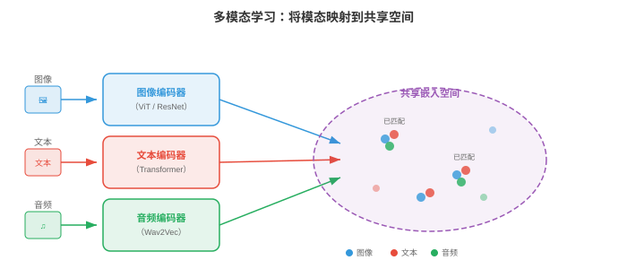
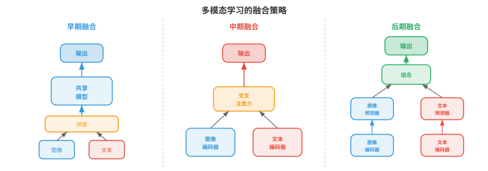
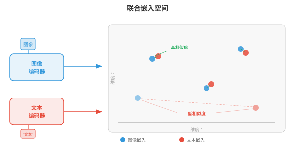
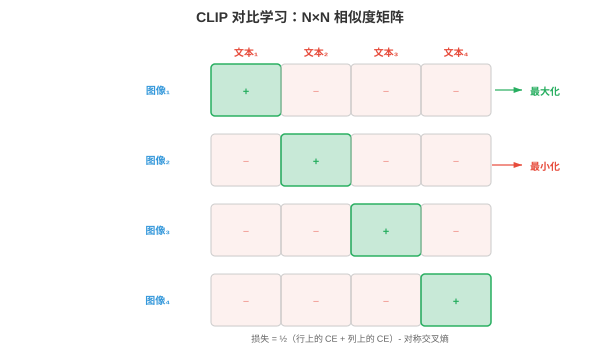
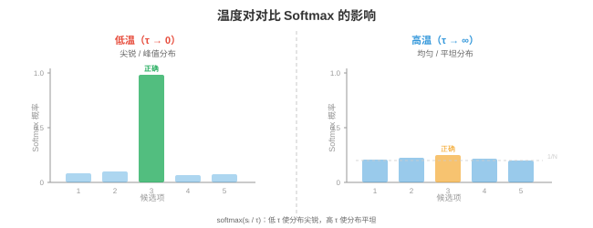
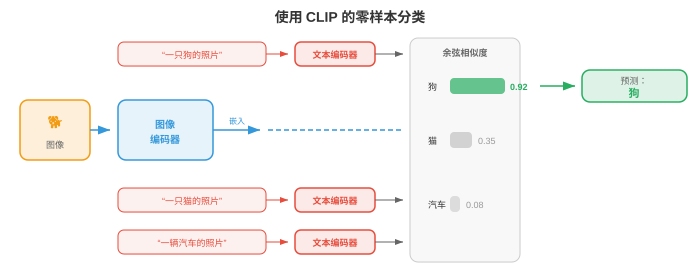
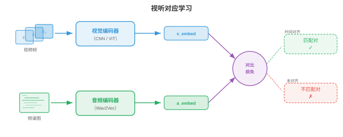
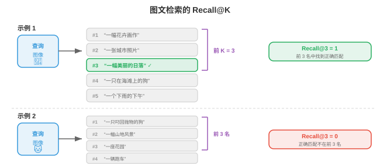

# 多模态表征

*多模态表征将视觉、语言和音频连接到共享嵌入空间中。本节涵盖融合策略、CLIP、ALIGN、SigLIP、对比损失函数（InfoNCE、NT-Xent）、零样本分类和检索评估。*

- 想象你坐在咖啡馆里：看见桌上冒着热气的杯子，听见陶瓷碰撞声，闻到烘焙咖啡豆的气味，感到杯子散发的温暖。没有一种感官能告诉你全部信息；大脑将这些信号融合成“热咖啡”的统一知觉。**多模态学习**对机器做同样的事：它结合多个模态（视觉、语言、音频等）的信息，构建比任何单一模态本身都更丰富、更鲁棒的表征。

- **模态**（modality）是独立的信息通道。在机器学习中，最常见的模态是图像（像素网格）、文本（token 序列）、音频（波形或频谱图，如第 9 章）、视频（帧序列）和结构化数据（表格、图）。每种模态都有自身的统计结构：图像具有空间一致性，文本是序列且离散，音频则具有时间性和连续性。多模态学习的挑战在于连接这些本质不同的数据类型。

- 为什么要组合模态？因为它们提供互补信息。一张狗的照片能告诉你它的品种和颜色，却不能告诉你它的名字；“我的金毛猎犬 Max”这样的说明文字能告诉你名字和品种，却不能告诉你准确姿势。图像和文本合在一起，比任一单独存在都提供更完整的画面。这种互补性是核心动机：多模态模型能够回答问题、生成内容和做出单模态模型无法做出的决策。



## 融合策略

- 想想小组项目。可以用两种方式组合想法：从开始就让所有人在同一房间工作（共享原始笔记和草稿），或者让每个人独立写完自己的部分，再合并最终文档。这分别对应多模态学习中的**早期融合**和**后期融合**。

- **早期融合**（early fusion，也称特征级融合）在进行严肃处理之前，拼接或混合不同模态的原始特征或低级特征。例如，可以将图像的像素特征与文本的 token 嵌入拼接，并把组合序列送入单个 Transformer。模型从一开始就能学习细粒度跨模态交互，但输入空间很大，模型必须同时学会处理非常不同的数据类型。

- 形式上，给定来自两种模态的特征向量 $x_{\text{img}} \in \mathbb{R}^{d_1}$ 和 $x_{\text{txt}} \in \mathbb{R}^{d_2}$，早期融合只需将它们拼接：

$$x_{\text{fused}} = [x_{\text{img}}; x_{\text{txt}}] \in \mathbb{R}^{d_1 + d_2}$$

- 这个拼接向量随后由共享网络处理。优点是模型可在每一层发现跨模态相关性；缺点是计算成本高，而且很难对齐差异巨大的特征类型（密集像素值与稀疏 token 索引）。

- **后期融合**（late fusion，也称决策级融合）通过各自的编码器独立处理每个模态，为每个模态产生高层表征，甚至最终预测。随后组合这些输出，通常是平均得分、投票或使用学习到的组合层。后期融合更简单，也可直接复用预训练单模态模型，但因模态之间从未“看到”彼此的原始特征，无法捕获低层跨模态交互。

- 给定模态特定预测 $\hat{y}_1$ 和 $\hat{y}_2$，一个简单的后期融合规则是：

$$\hat{y} = \alpha \hat{y}_1 + (1 - \alpha) \hat{y}_2$$

- 其中，$\alpha \in [0, 1]$ 是学习得到或手工调节的混合权重。

- **中期融合**（middle fusion，也称中间融合）是多数现代系统采用的务实折中方案。每个模态先由自己的编码器处理（提取模态特定特征），再在网络中途组合编码后的表征，通常通过交叉注意力层完成。这既让每个编码器专注于自己的模态，又支持丰富的跨模态交互。Flamingo、LLaVA 和多数视觉语言模型（第 02 节）都使用中期融合。



- 融合策略的选择取决于数据可用性、计算预算和任务。早期融合强大但需要大量数据；后期融合成本低但能力有限；带交叉注意力的中期融合因平衡了表达力与模块化，已成为大规模多模态模型的主导方案。

## 联合嵌入空间

- 想象一个通用翻译器，能把任何语言中的任意句子映射到共享“语义空间”的同一点。英文、法文或日文中的“海滩上的一只狗”都会落在同一坐标。**联合嵌入空间**在跨模态上做同样的事：海滩上狗的图像与“海滩上的一只狗”这段文本，应映射到同一向量空间中相近的位置。

- 形式上，我们学习两个编码器函数：模态 1（如图像）的 $f_\theta : \mathcal{X}_1 \to \mathbb{R}^d$，以及模态 2（如文本）的 $g_\phi : \mathcal{X}_2 \to \mathbb{R}^d$。二者都将输入映射到同一个 $d$ 维空间。训练目标确保语义匹配对 $(x_1, x_2)$ 的嵌入 $f_\theta(x_1)$ 和 $g_\phi(x_2)$ 接近（余弦相似度高），而不匹配对相距较远。

- 这直接泛化了第 7 章的词嵌入空间。回想 Word2Vec 和 GloVe 将语义相似的词放在向量空间中彼此接近的位置；联合嵌入空间将这一思想扩展到模态之间：不再测量词到词的相似性，而是测量图像到文本、音频到文本，甚至图像到音频的相似性。

- 相似度度量几乎总是**余弦相似度**（第 1 章）：

$$\text{sim}(u, v) = \frac{u \cdot v}{\|u\| \|v\|}$$

- 将所有嵌入 $L_2$ 归一化到单位超球面后，余弦相似度化为简单点积 $u \cdot v$，计算极其高效，也能通过近似最近邻库加速。



- 联合嵌入空间的力量在于支持**零样本迁移**。一旦对齐图像和文本嵌入，就可以把图像分类为从未训练过的类别：只需将类别名称作为文本嵌入，找出最接近图像嵌入的文本嵌入即可，无需任务特定微调。这是 CLIP 及其后继模型的关键洞见。

## 用于多模态对齐的对比学习

- 想象课堂练习：学生拿到打乱的照片和说明文字对，需要将每张照片与正确说明配对。要做好这件事，既要理解视觉内容和语言，也要知道二者如何关联。**对比学习**正是以这种方式训练模型：给定一批（图像、文本）对，模型必须弄清哪张图像对应哪段文本。

- 如第 8 章第 04 节所见，单模态对比学习（SimCLR、MoCo）拉近同一图像的增强视图，推远不同图像的视图。多模态对比学习将“增强视图”替换为“匹配模态”：图像及其说明是正对；图像与批次中任何其他说明的组合是负对。

### CLIP

- **CLIP**（Contrastive Language-Image Pre-training；Radford 等，2021）是多模态对比学习的奠基模型。它在从互联网抓取的 4 亿个（图像、文本）对上，联合训练图像编码器（ViT 或 ResNet，第 8 章）和文本编码器（Transformer，第 7 章）。

- 给定一批 $N$ 个图像-文本对，CLIP 计算所有图像嵌入与所有文本嵌入之间的 $N \times N$ 余弦相似度矩阵。对角线条目是匹配对（正样本），所有非对角线条目均不匹配（负样本）。训练损失拉高对角线条目，压低非对角线条目。

- 损失是对称交叉熵。对于图像 $i$ 与文本 $j = i$ 配对的情形，图像到文本损失为：

$$\mathcal{L}_{i \to t} = -\frac{1}{N} \sum_{i=1}^{N} \log \frac{\exp(\text{sim}(z_i^{\text{img}}, z_i^{\text{txt}}) / \tau)}{\sum_{k=1}^{N} \exp(\text{sim}(z_i^{\text{img}}, z_k^{\text{txt}}) / \tau)}$$

- 文本到图像损失交换角色后相同：

$$\mathcal{L}_{t \to i} = -\frac{1}{N} \sum_{i=1}^{N} \log \frac{\exp(\text{sim}(z_i^{\text{txt}}, z_i^{\text{img}}) / \tau)}{\sum_{k=1}^{N} \exp(\text{sim}(z_i^{\text{txt}}, z_k^{\text{img}}) / \tau)}$$

- 总 CLIP 损失取平均值：

$$\mathcal{L}_{\text{CLIP}} = \frac{1}{2}(\mathcal{L}_{i \to t} + \mathcal{L}_{t \to i})$$

- 这里 $\tau$ 是一个学习到的**温度**（temperature）参数（初始化为 $\tau = 0.07$）。温度控制 softmax 分布的尖锐程度：低 $\tau$ 让模型更专注于最近的匹配，高 $\tau$ 让概率分布得更均匀。CLIP 与模型权重一起学习 $\tau$，而不是将其视为固定超参数。



- CLIP 的图像编码器通常是 ViT-L/14（具有 14x14 图块的大型视觉 Transformer，第 8 章第 04 节）。文本编码器是带因果掩码的 12 层 Transformer（如 GPT，第 7 章第 04 节）。两个编码器都通过学习到的线性投影将输出投射到共享的 512 或 768 维空间，随后进行 $L_2$ 归一化。

- CLIP 最引人注目的性质是**零样本图像分类**。要将一张图像分为 $K$ 个类别之一，可以创建 $K$ 个诸如“a photo of a {class name}”的文本提示，用文本编码器嵌入每个提示，用图像编码器嵌入图像，并选择文本嵌入与图像嵌入余弦相似度最高的类别。在 ImageNet 上，CLIP 从未见过一个 ImageNet 训练样本，却获得了有竞争力的准确率。

### ALIGN

- **ALIGN**（Jia 等，2021）将 CLIP 的方法扩展到更嘈杂、更大的数据集：仅做极少过滤的 18 亿个图像-文本对。CLIP 仔细整理数据，ALIGN 则表明规模可以补偿噪声。ALIGN 使用 EfficientNet 图像编码器和 BERT 文本编码器，以相同的对比损失训练。关键发现是，数据足够多时不需要昂贵的数据清洗：对比目标会自然降低噪声对的权重，因为它们产生不一致的梯度。

### SigLIP

- **SigLIP**（Sigmoid Loss for Language-Image Pre-training；Zhai 等，2023）以更简单的 sigmoid 损失替换 CLIP 基于 softmax 的对比损失。SigLIP 不把 $N \times N$ 相似度矩阵视为分类问题（每行是在列上的 softmax），而是将每个条目独立看作二元分类：这一个（图像、文本）对是否匹配？

- 单个配对 $(i, j)$ 的 SigLIP 损失为：

$$\mathcal{L}_{ij} = -y_{ij} \log \sigma(z_i^{\text{img}} \cdot z_j^{\text{txt}} / \tau) - (1 - y_{ij}) \log(1 - \sigma(z_i^{\text{img}} \cdot z_j^{\text{txt}} / \tau))$$

- 其中，$y_{ij} = 1$ 当 $i = j$（匹配）时成立，否则 $y_{ij} = 0$；$\sigma$ 是 sigmoid 函数。

- SigLIP 的关键优势是消除了在整个批次上进行全局 softmax 归一化的需要。CLIP 中的 softmax 分母要求收集所有设备上的全部嵌入，这是分布式训练的通信瓶颈。SigLIP 的逐对 sigmoid 损失可在本地计算，从而更高效地扩展到极大批次。SigLIP 以更低训练成本达到与 CLIP 相当的质量。

## 对比损失函数详解

- 对比学习中使用的损失函数有共同结构：它们都试图让正对的相似度得分高于负对，借助“间隔”或“温度”这类概念控制模型施加的力度。下面形式化关键变体。

### InfoNCE

- **InfoNCE**（Noise-Contrastive Estimation；van den Oord 等，2018）是 CLIP 损失背后的理论基础。给定查询 $q$、一个正键 $k^+$ 和 $K$ 个负键 $\{k_1^-, \ldots, k_K^-\}$，损失为：

$$\mathcal{L}_{\text{InfoNCE}} = -\log \frac{\exp(q \cdot k^+ / \tau)}{\exp(q \cdot k^+ / \tau) + \sum_{j=1}^{K} \exp(q \cdot k_j^- / \tau)}$$

- 这是一个 $(K+1)$ 分类问题：从 $K+1$ 个候选中识别正样本。InfoNCE 是查询与正键之间互信息的下界，因此最大化它会对齐语义匹配输入的表征。负样本数量 $K$ 增加时下界收紧，这解释了为什么对比方法从大批次中获益。

### NT-Xent

- **NT-Xent**（Normalised Temperature-scaled Cross-Entropy；Chen 等，2020）是 SimCLR（第 8 章第 04 节）使用的损失，本质上是在批次中对称应用的 InfoNCE。对于包含 $N$ 对的批次，$2N$ 个增强视图为每个锚点产生 $2N - 2$ 个负样本（除自身和其正样本以外的全部视图）。正对 $(i, j)$ 的损失为：

$$\ell_{i,j} = -\log \frac{\exp(\text{sim}(z_i, z_j) / \tau)}{\sum_{k=1}^{2N} \mathbf{1}_{[k \neq i]} \exp(\text{sim}(z_i, z_k) / \tau)}$$

- NT-Xent 和 InfoNCE 是同一个数学公式；名称不同，是因为它们在不同语境中提出（自监督视觉与表征学习理论）。

### 温度的作用

- **温度** $\tau$ 是对比学习最重要的超参数之一。为建立直觉，可以从物理意义理解温度：高温时分子随机运动（softmax 平坦，所有负样本看起来都同样差）；低温时分子沉入刚性结构（softmax 尖锐，只有最难负样本重要）。

- 形式上，随着 $\tau \to 0$，softmax 接近只选择单个最难负样本的硬 argmax；随着 $\tau \to \infty$，所有负样本贡献相等。实践中，$\tau \in [0.01, 0.1]$ 对归一化嵌入效果良好。温度过低会导致训练不稳定（困难负样本的梯度会非常大）；温度过高会使损失对违例不敏感。

- CLIP 将 $\tau = 0.07$ 初始化，并将其作为对数参数化标量 $\tau = \exp(t)$ 学习，其中 $t$ 与模型权重一起通过梯度下降更新。这使模型可以在训练中自动调节对比任务的难度。



### 三元组损失与基于间隔的替代方法

- 在 InfoNCE 占据主导之前，**三元组损失**（triplet loss）是度量学习的标准方法。给定锚点 $a$、正样本 $p$ 和负样本 $n$：

$$\mathcal{L}_{\text{triplet}} = \max(0, \|a - p\|^2 - \|a - n\|^2 + m)$$

- 其中，$m$ 是间隔，确保正样本至少比负样本近 $m$。三元组损失作用于单个三元组而非批次，因此样本效率低于 InfoNCE。它还对挖掘策略敏感：随机负样本通常过于容易（损失为零），所以**困难负样本挖掘**（选择最接近的错误匹配）或**半困难挖掘**（选择间隔内的负样本）至关重要。

- InfoNCE 在整个批次中隐式执行困难负样本挖掘，这是其在规模化时优于三元组损失的原因之一。InfoNCE 的 softmax 归一化会自动提高困难负样本（与锚点高度相似者）的权重，无需显式挖掘即可提供自然课程。

## 图文检索与零样本分类

- 一旦训练出联合嵌入空间，就可以执行**图文检索**：给定图像查询，从数据库找出最相关的文本（图像到文本检索）；或者给定文本查询，找出最相关的图像（文本到图像检索）。这就是在共享嵌入空间中的最近邻搜索。

- 想象一位图书管理员，能即时将任意照片与百万条目录中的任意说明文字比较。他不需要预先理解每一个可能类别，只要衡量每张照片与每段文字有多“接近”。这正是 CLIP 风格模型执行检索和零样本分类的方式。

- **零样本分类**是文本到图像检索的一种特殊情形。给定 $K$ 个类别名称，构造文本提示 $\{t_1, \ldots, t_K\}$（例如“a photo of a cat”“a photo of a dog”）并嵌入它们。对于新图像 $x$，预测类别为：

$$\hat{y} = \arg\max_{k} \; \text{sim}(f_\theta(x), g_\phi(t_k))$$

- 关键洞见是文本编码器充当灵活的分类器头。不必为每个下游任务训练新的线性层，只需用自然语言描述任务。这正是 CLIP 泛化能力强的原因：文本编码器在预训练时见过数百万条多样说明。

- **提示工程**很重要。只需将 ImageNet 上的提示模板从“{class name}”改为“a photo of a {class name}”，CLIP 的零样本准确率就从 63.2% 提升到 68.4%。更进一步，**提示集成**对多个模板的文本嵌入求平均（例如“a photo of a {class name}”“a good photo of a {class name}”“a drawing of a {class name}”），以产生更鲁棒的文本表征。



## 视听对应

- 闭上眼睛，听有人拍篮球。你可以从有节奏的砰砰声判断篮球何时撞击地面。现在睁开眼睛：视觉上的弹跳与每次砰声完美对应。音频事件与视觉事件之间这种紧密对应关系，是机器可学习的免费监督信号。**视听对应学习**让模型无需任何人工标签，就能将声音与其视觉来源关联起来。

- 这个思想与 CLIP 非常相似，只是用音频替换文本。给定配对的视频帧和音频片段，模型学习一个嵌入空间：时间对齐的视听对彼此接近，未对齐的配对相距很远。

- **视听嵌入**（Audio-Visual Embedding, AVE）方法（Arandjelovic 和 Zisserman，2017）在视频数据上以对比损失训练视觉编码器 $f$ 和音频编码器 $g$。正对是（视频帧、同一时刻的音频片段），负样本则是来自不同视频或不同时间的音频片段。模型无需标签即可学习：狗叫声对应狗的图像，吉他声对应吉他的图像。

- 音频编码器通常使用 CNN 或音频 Transformer 处理**对数梅尔频谱图**（第 9 章第 01 节），产生固定大小嵌入；视觉编码器使用标准图像骨干网络（ResNet、ViT）处理视频帧。二者都投影到共享的 $d$ 维空间，训练使用与 CLIP 相同的 InfoNCE 损失：

$$\mathcal{L}_{\text{AV}} = -\log \frac{\exp(\text{sim}(z^{\text{vis}}, z^{\text{aud}}) / \tau)}{\sum_{k=1}^{N} \exp(\text{sim}(z^{\text{vis}}, z_k^{\text{aud}}) / \tau)}$$



- **应用**包括：声源定位（声音来自图像的哪里？）、视听语音识别（结合嘴唇运动和音频，如第 9 章第 02 节）、视听源分离（通过观看说话人的脸来隔离其声音，即第 9 章第 05 节的“鸡尾酒会”问题），以及以音频为条件的视频生成。

- **ImageBind**（Girdhar 等，2023）将其扩展到六种模态：图像、文本、音频、深度、热成像和 IMU 数据。关键洞见是无需为每一种组合准备配对数据。通过让每个模态与图像对齐（文本使用图文对，音频使用图像-音频对等），所有模态经由共享图像嵌入空间隐式对齐。通过共同锚定模态实现的这种“绑定”会产生涌现对齐：音频和文本即使从未直接共同训练，也会变得相似。

## 评估

- 评估多模态模型需要能衡量跨模态理解的指标。两种主导评估范式是**零样本基准**和**检索指标**。

### 零样本基准

- 零样本评估衡量模型能否完成从未被显式训练过的任务。最常见基准是**ImageNet 零样本准确率**：将全部 1,000 个 ImageNet 类别名称作为文本嵌入，嵌入每张测试图像，并根据余弦相似度测量 top-1 和 top-5 分类准确率。CLIP ViT-L/14 的零样本 top-1 准确率为 75.5%，可与在 ImageNet 上监督训练的 ResNet-50 相比。

- 其他零样本基准包括 CIFAR-10/100、STL-10、Food-101、Oxford Pets 和 Flowers-102。在许多数据集上评估，可检验模型是否真正具有通用视觉理解，还是只记住了预训练数据中的模式。

- **线性探测**（linear probe）评估是一项互补测试。冻结预训练图像编码器，为带标签数据集提取特征，并在其上训练简单线性分类器。这可独立于零样本检索机制衡量学习到的表征质量。CLIP 特征是优秀的线性探测特征，常能匹敌或超过监督预训练。

### 检索指标

- 对于检索任务（图像到文本和文本到图像），标准指标是**Recall@K**（R@K）：正确匹配出现在检索结果前 $K$ 名中的查询比例。常用取值为 R@1、R@5 和 R@10。

- 形式上，对 $Q$ 个查询构成的集合：

$$\text{R@}K = \frac{1}{Q} \sum_{q=1}^{Q} \mathbf{1}[\text{rank}(q) \leq K]$$

- 其中，$\text{rank}(q)$ 是正确匹配在查询 $q$ 的排序检索列表中的位置。

- 标准检索基准包括 **Flickr30K**（31,000 张图像，每张有 5 个说明）和 **MS-COCO**（123,000 张图像，每张有 5 个说明）。评估在测试集划分上进行：给定图像，从完整测试集检索正确说明，反之亦然。

- **中位排名**（Median rank, MedR）是互补指标：所有查询中正确匹配位置的中位数。完美模型的 MedR = 1，越低越好。

- 除检索外，多模态模型也在组合性理解基准上评估，例如 **Winoground**（测试模型能否区分“一只狗里的杯子”和“一个杯子里的狗”）以及 **ARO**（Attribute、Relation、Order，属性、关系、顺序）。它们检验模型是否真正理解语言结构，还是仅匹配词袋。CLIP 风格模型常在这些任务上遇到困难，揭示了一项根本限制：对比预训练对齐全局语义，却可能无法捕获细粒度组合结构。



## 融会贯通

- 本节介绍的多模态表征，是本章后续所有内容的基础。CLIP 及其后继模型训练出的联合嵌入空间，是连接视觉与语言的“胶水”。第 02 节在此基础上讨论视觉语言模型，它们超越检索，能生成关于图像的文本；第 03 节探索如何将图像和视频 token 化以供序列模型使用；第 04 节讲解跨模态生成（文本到图像、文本到视频）；第 05 节考察在单个模型内处理多种模态的统一架构。

- 核心结论是：在配对数据上进行对比学习，可产生不同模态可相互替换的嵌入空间。图像嵌入和文本嵌入成为“同一种东西”，从而支持零样本分类、检索及无缝集成到更大的系统中。这个想法看似简单，只要拉近匹配对、推远不匹配对，却有非同寻常的效果。

## 编程任务（使用 CoLab 或笔记本）

1. 从头实现 CLIP 对比损失。创建随机图像和文本嵌入，计算相似度矩阵，并计算对称交叉熵损失。
```python
import jax
import jax.numpy as jnp
import matplotlib.pyplot as plt

def clip_loss(image_embeds, text_embeds, temperature=0.07):
    """Compute symmetric CLIP contrastive loss."""
    # L2 normalise embeddings
    image_embeds = image_embeds / jnp.linalg.norm(image_embeds, axis=1, keepdims=True)
    text_embeds = text_embeds / jnp.linalg.norm(text_embeds, axis=1, keepdims=True)

    # Compute cosine similarity matrix (N x N)
    logits = image_embeds @ text_embeds.T / temperature  # (N, N)

    # Labels: the diagonal (i-th image matches i-th text)
    N = logits.shape[0]
    labels = jnp.arange(N)

    # Symmetric cross-entropy: image-to-text + text-to-image
    loss_i2t = -jnp.mean(jax.nn.log_softmax(logits, axis=1)[jnp.arange(N), labels])
    loss_t2i = -jnp.mean(jax.nn.log_softmax(logits, axis=0)[labels, jnp.arange(N)])
    return (loss_i2t + loss_t2i) / 2, logits * temperature

# Simulate a batch of 8 image-text pairs in 64-dim space
key = jax.random.PRNGKey(42)
k1, k2 = jax.random.split(key)
N, D = 8, 64
image_embeds = jax.random.normal(k1, (N, D))
text_embeds = jax.random.normal(k2, (N, D))

loss, sim_matrix = clip_loss(image_embeds, text_embeds)
print(f"CLIP loss (random embeddings): {loss:.4f}")

# Visualise the similarity matrix
fig, ax = plt.subplots(figsize=(6, 5))
im = ax.imshow(sim_matrix, cmap='coolwarm', vmin=-1, vmax=1)
ax.set_xlabel("Text index"); ax.set_ylabel("Image index")
ax.set_title(f"Cosine Similarity Matrix (loss={loss:.3f})")
plt.colorbar(im); plt.tight_layout(); plt.show()
# Try changing temperature (0.01, 0.1, 1.0) and observe how loss changes
# Try making matched pairs similar: set text_embeds = image_embeds + small noise
```

2. 构建一个玩具联合嵌入模型，使用 InfoNCE 损失和梯度下降，学习对齐二维“图像”（随机向量）与“说明文字”（不同的随机向量）。
```python
import jax
import jax.numpy as jnp
import matplotlib.pyplot as plt

def info_nce_loss(img_enc, txt_enc, img_data, txt_data, tau=0.1):
    """InfoNCE over a batch of paired (image, text) data."""
    z_img = img_data @ img_enc  # (N, D)
    z_txt = txt_data @ txt_enc  # (N, D)
    # L2 normalise
    z_img = z_img / jnp.linalg.norm(z_img, axis=1, keepdims=True)
    z_txt = z_txt / jnp.linalg.norm(z_txt, axis=1, keepdims=True)
    logits = z_img @ z_txt.T / tau
    labels = jnp.arange(logits.shape[0])
    return -jnp.mean(jax.nn.log_softmax(logits, axis=1)[jnp.arange(len(labels)), labels])

# Create 32 paired samples: img in R^8, txt in R^6, embed into R^4
key = jax.random.PRNGKey(0)
k1, k2, k3, k4 = jax.random.split(key, 4)
N, d_img, d_txt, d_embed = 32, 8, 6, 4

img_data = jax.random.normal(k1, (N, d_img))
txt_data = jax.random.normal(k2, (N, d_txt))

# Learnable projection matrices
img_enc = jax.random.normal(k3, (d_img, d_embed)) * 0.1
txt_enc = jax.random.normal(k4, (d_txt, d_embed)) * 0.1

grad_fn = jax.jit(jax.grad(info_nce_loss, argnums=(0, 1)))
lr = 0.05
losses = []

for step in range(300):
    loss = info_nce_loss(img_enc, txt_enc, img_data, txt_data)
    losses.append(float(loss))
    g_img, g_txt = grad_fn(img_enc, txt_enc, img_data, txt_data)
    img_enc = img_enc - lr * g_img
    txt_enc = txt_enc - lr * g_txt

print(f"Initial loss: {losses[0]:.3f}, Final loss: {losses[-1]:.3f}")
print(f"Random baseline (log N): {jnp.log(N):.3f}")

plt.figure(figsize=(8, 4))
plt.plot(losses, color='#2c3e50')
plt.axhline(y=0, color='green', linestyle='--', alpha=0.5, label='Perfect alignment')
plt.axhline(y=float(jnp.log(N)), color='red', linestyle='--', alpha=0.5, label='Random (log N)')
plt.xlabel("Step"); plt.ylabel("InfoNCE Loss")
plt.title("Learning a Joint Embedding Space")
plt.legend(); plt.grid(alpha=0.3); plt.tight_layout(); plt.show()
# Modify d_embed (try 2, 4, 16) to see how embedding dimension affects alignment
```

3. 使用预先计算的嵌入实现零样本分类。将类别“原型”模拟为文本嵌入，并通过最近邻查找分类新图像。
```python
import jax
import jax.numpy as jnp
import matplotlib.pyplot as plt

# Simulate 5 classes, each with a prototype text embedding in R^32
key = jax.random.PRNGKey(42)
n_classes, d = 5, 32
class_names = ["cat", "dog", "car", "plane", "ship"]

# Class prototypes (imagine these came from a text encoder)
k1, k2 = jax.random.split(key)
class_prototypes = jax.random.normal(k1, (n_classes, d))
class_prototypes = class_prototypes / jnp.linalg.norm(class_prototypes, axis=1, keepdims=True)

# Generate 200 test "images" (embeddings near their class prototype + noise)
n_per_class = 40
true_labels = jnp.repeat(jnp.arange(n_classes), n_per_class)
keys = jax.random.split(k2, n_classes * n_per_class)

image_embeds = []
for i in range(n_classes):
    noise = jax.random.normal(keys[i], (n_per_class, d)) * 0.5
    cluster = class_prototypes[i] + noise
    image_embeds.append(cluster)
image_embeds = jnp.concatenate(image_embeds, axis=0)
image_embeds = image_embeds / jnp.linalg.norm(image_embeds, axis=1, keepdims=True)

# Zero-shot classification: cosine similarity with each prototype
similarities = image_embeds @ class_prototypes.T  # (200, 5)
predicted_labels = jnp.argmax(similarities, axis=1)
accuracy = jnp.mean(predicted_labels == true_labels)
print(f"Zero-shot accuracy: {accuracy:.1%}")

# Confusion matrix
conf = jnp.zeros((n_classes, n_classes), dtype=jnp.int32)
for true, pred in zip(true_labels, predicted_labels):
    conf = conf.at[true, pred].add(1)

fig, ax = plt.subplots(figsize=(6, 5))
im = ax.imshow(conf, cmap='Blues')
ax.set_xticks(range(n_classes)); ax.set_xticklabels(class_names, rotation=45)
ax.set_yticks(range(n_classes)); ax.set_yticklabels(class_names)
ax.set_xlabel("Predicted"); ax.set_ylabel("True")
for i in range(n_classes):
    for j in range(n_classes):
        ax.text(j, i, int(conf[i, j]), ha='center', va='center', fontsize=11)
ax.set_title(f"Zero-Shot Confusion Matrix (acc={accuracy:.1%})")
plt.colorbar(im); plt.tight_layout(); plt.show()
# Try increasing noise (0.5 -> 1.0 -> 2.0) to see accuracy degrade
# Try adding prompt ensembling: average 3 noisy copies of each prototype
```
