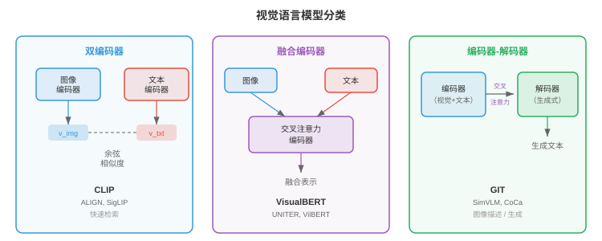
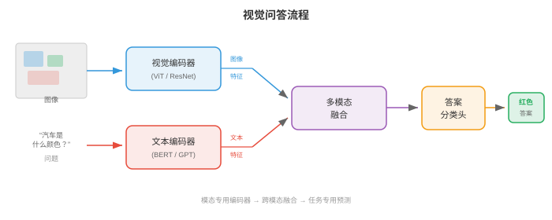
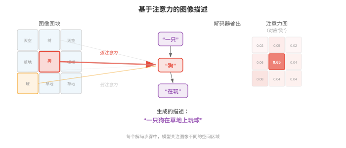
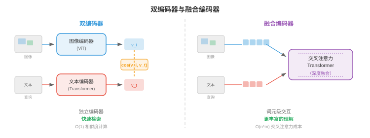
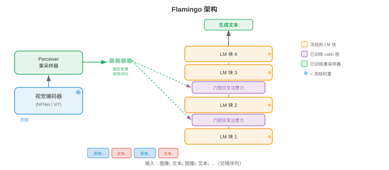
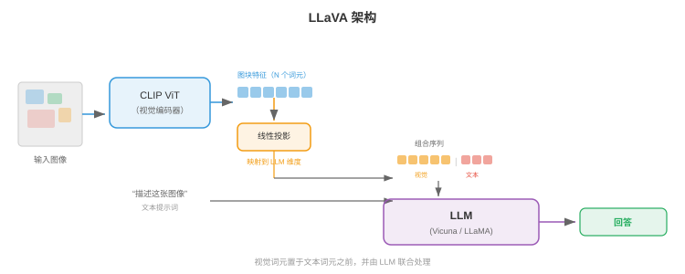
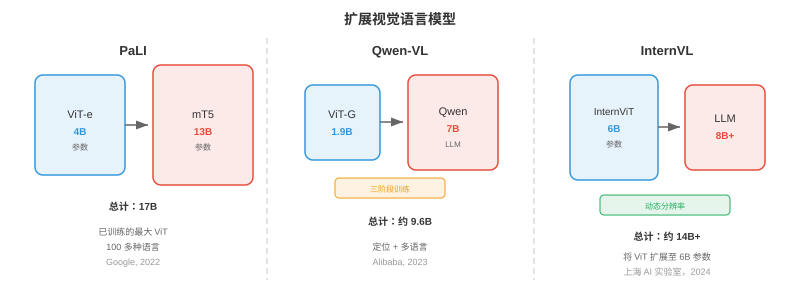
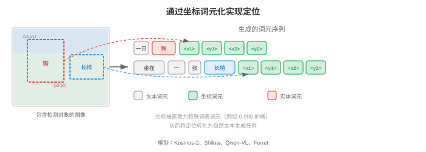
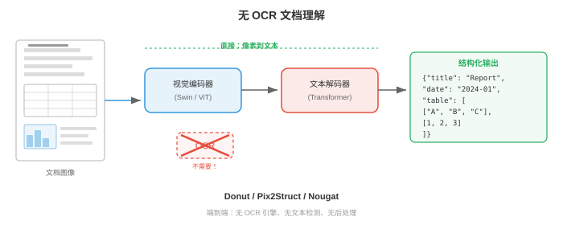
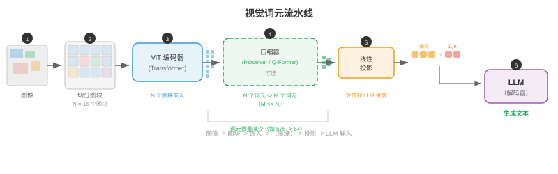

# 视觉语言模型

*视觉语言模型（vision language model，VLM）联合理解图像与文本，因而能够进行视觉问答、图像描述和视觉推理。本节涵盖 VQA、图像描述、视觉定位，以及将视觉编码器与大语言模型融合的 VisualBERT、BLIP、LLaVA、Flamingo、PaLI 和 Qwen-VL 等架构。*

- 把它想成一位博物馆讲解员：他看着一幅画，就能说出画中有哪些物体、讲述什么故事、传达什么情感，并回答参观者可能提出的任何问题。**视觉语言模型（VLM）**就是其计算机等价物：它联合理解图像和文本，能够描述视觉场景、回答相关问题、遵循视觉指令，甚至根据自然语言查询在图像中定位特定对象。

- VLM 位于你在第 8 章认识的视觉编码器和第 7 章的语言模型的交汇处。核心工程挑战在于桥接两个截然不同的表示世界：视觉骨干网络的空间连续特征图，以及语言模型的序列离散词元嵌入。本节的每种架构，本质上都在回答同一个问题：如何融合视觉与语言？



## 视觉问答

- 想象有人向你展示一张照片，并问：“公园里有几只狗？”你会轻松解析图像、找到狗、数出数量并给出答案。**视觉问答（visual question answering，VQA）**将其形式化：给定图像 $I$ 与自然语言问题 $q$，预测答案 $a$。

- 该任务可以有多种表述方式。最常见的方式将 VQA 视为**开放式分类（open-ended classification）**：模型从高频答案构成的固定词表中选择答案（例如 VQA v2 中频率最高的 3,129 个答案）。另一种方式是**生成式作答（generative answering）**，即模型产生自由形式的文本字符串，现代 VLM 采用的正是这种方式。

- 形式上，目标是学习函数 $f(I, q) \to a$，使正确答案的似然最大化。在分类设定下，它写为：

$$p(a \mid I, q) = \text{softmax}(W \cdot g(v, h))$$

- 其中，$v$ 是视觉特征向量（来自 CNN 或 ViT），$h$ 是问题编码（来自 LSTM 或 Transformer），$g$ 是将二者结合的融合函数。真正体现架构创造力的地方，正是 $g$ 的设计。

- **VQA v1**（Antol et al., 2015）使用 MS COCO 的 204,000 张图像和 614,000 个问题引入了这一基准。研究者很快发现，模型可以利用**语言先验（language priors）**取得出人意料的高准确率，例如不看图像就对“有多少”类问题回答“2”，或对“是否有”类问题回答“是”。

- **VQA v2**（Goyal et al., 2017）通过为每个问题配对两张答案不同但相似的图像解决了这一问题。这迫使模型真正将推理扎根于视觉内容。平衡配对设置大致使数据集规模翻倍，并令只依赖语言的捷径大幅失效。

- 其他重要 VQA 数据集包括：含有要求多步推理的组合式问题的 **GQA**（Hudson & Manning, 2019）；需要图像之外外部知识的 **OK-VQA**（Marino et al., 2019）；以及答案取决于读取图像内文字的 **TextVQA**（Singh et al., 2019）。



- 早期 VQA 模型采用简单策略：从预训练 CNN（通常是第 8 章 ResNet 或 VGGNet 的倒数第二层）提取图像特征，用 LSTM（第 6 章）编码问题，再将二者结合。组合函数 $g$ 快速演化：从简单的逐元素乘法，到双线性池化，再到多模态 Tucker 分解。**双线性注意力（bilinear attention）**计算 $v^T W h$，其中 $W$ 是可学习交互矩阵；但完整双线性形式具有 $O(d_v \times d_h)$ 个参数，规模大得难以承受。**MLB**（multimodal low-rank bilinear pooling，多模态低秩双线性池化）将其分解为两个低秩投影，使计算变得可行。

- 注意力机制是 VQA 的突破。**堆叠注意力网络（Stacked Attention Networks）**（Yang et al., 2016）使用问题编码在空间图像区域上施加注意力，并迭代细化需要关注的图像部分。让问题“查看”相关图像区域的思想，后来成为标准做法。

## 图像描述

- 想象一位朋友看着你的度假照片，讲述他所见到的内容：“一只金毛猎犬在阳光明媚的海滩上接飞盘。”**图像描述（image captioning）**的任务是为图像生成自然语言说明。它与 VQA 不同，没有问题，模型必须自行决定哪些内容值得描述。

- **Show and Tell**（Vinyals et al., 2015）确立了图像描述的经典编码器-解码器架构。CNN 编码器（如 Inception 或 ResNet）产生单一图像特征向量 $v$。该向量作为 LSTM 解码器的初始隐藏状态，随后解码器以自回归方式逐词生成描述：

$$p(w_t \mid w_{1:t-1}, I) = \text{LSTM}(w_{t-1}, h_{t-1})$$

- 整个模型通过最大化真实描述的对数似然进行端到端训练。推理时，使用束搜索（第 7 章）寻找高概率描述。

- Show and Tell 的问题在于将整张图像压缩为一个向量。对于复杂场景，单个向量无法捕获所有相关细节；空间信息丢失，模型在生成不同词语时无法“回看”图像的特定部分。

- **Show, Attend and Tell**（Xu et al., 2015）通过引入**图像区域注意力（attention over image regions）**解决了这一问题。CNN 不再将图像编码为一个向量，而是生成空间特征网格（例如 VGGNet 最后一层卷积层输出的 $14 \times 14 \times 512$）。每个解码步骤中，模型都会计算这些空间位置上的注意力权重，产生一个突出当前词最相关区域的上下文向量。

- 回顾第 6 章的注意力机制：解码器隐藏状态充当查询，空间特征充当键和值，注意力权重告诉模型该看哪里。作者提出两个变体：**软注意力（soft attention）**，可微且对所有区域加权平均；**硬注意力（hard attention）**，随机采样单个区域并使用 REINFORCE 训练。



- 这些模型生成的注意力图具有很强的可解释性：生成“狗”时，注意力在狗所在区域达到峰值；生成“海滩”时，注意力转向沙地和水面。这是注意力具有内在可解释性的早期有力证据之一。

- **CIDEr**（Vedantam et al., 2015）、**METEOR**、**BLEU** 与 **SPICE** 是标准的图像描述评估指标。CIDEr 计算生成描述与参考描述之间经 TF-IDF 加权的 n-gram 相似度，专为图像描述评估设计。现代 VLM 通常在 MS COCO Captions 和 NoCaps 等图像描述基准上以 CIDEr 评估。

- 后来的图像描述模型引入了**自底向上注意力（bottom-up attention）**（Anderson et al., 2018）：对象检测器（Faster R-CNN，第 8 章）先提出显著图像区域，图像描述模型再关注这些区域特征，而不是均匀网格。在基于 ViT 的编码器占据主导地位之前，这一直是主流方法。

## 架构模式

- 每个 VLM 都必须回答一个基础设计问题：视觉和语言在何处交互？答案决定模型所属的架构系列。主要有三种模式，各有不同取舍。

### 双编码器

- 想象两位译者独立工作：一位阅读法语文档，另一位阅读英文文档，他们各自用共享的“通用语言”生成摘要。译文过程中二者从不交流，但两个摘要可以直接比较。这就是**双编码器（dual encoder）**模式。

- 视觉编码器 $f_v$ 和文本编码器 $f_t$ 将各自输入独立映射到维度为 $d$ 的共享嵌入空间。图像嵌入为 $v = f_v(I) \in \mathbb{R}^d$，文本嵌入为 $t = f_t(q) \in \mathbb{R}^d$。通过点积或余弦相似度计算相似度：$\text{sim}(I, q) = v^T t / (\|v\| \|t\|)$。

- 前一节多模态表示中介绍的 CLIP（Radford et al., 2021）是典型的双编码器。它在从互联网抓取的 4 亿图文对上，以对比目标（InfoNCE）训练。由于两个编码器相互独立，你可以预先计算并缓存所有图像嵌入，使检索极其高效：查询时只需编码查询文本。

- 双编码器的弱点是视觉和语言从不在特征层面交互。模型无法进行细粒度跨模态推理，例如无法判断描述中的特定词是否对应图像中的特定区域。这限制了它在 VQA 或带定位的图像描述等任务中的用途。

### 融合编码器

- 现在设想两位译者坐在同一间屋里，积极讨论两份文档。他们可以指向特定段落、互相提问，并建立联合理解。这就是**融合编码器（fusion encoder）**模式。

- 两种模态分别编码后，再通过**交叉注意力层（cross-attention layers）**融合，其中一种模态的词元关注另一种模态的词元。图像先由视觉编码器处理为图块或区域词元序列 $V = [v_1, \ldots, v_N]$；文本被分词为 $T = [t_1, \ldots, t_M]$。在融合层中，文本词元通过交叉注意力关注图像词元：

$$\text{CrossAttn}(T, V) = \text{softmax}\!\left(\frac{(TW_Q)(VW_K)^T}{\sqrt{d_k}}\right)(VW_V)$$

- 这实现了细粒度交互：每个文本词元都可以关注所需的特定图像区域。**VisualBERT**、**VilBERT** 和 **UNITER** 等模型采用这一模式。代价是无法为检索预先计算独立嵌入，因为每个图文对都需要完整前向通过融合层。



### 编码器-解码器

- **编码器-解码器（encoder-decoder）**模式将视觉编码器与自回归生成输出词元的文本解码器结合，类似第 7 章的 seq2seq 模型。视觉编码器产生具有上下文的图像表示，文本解码器在生成输出文本时对这些表示施加交叉注意力。

- 这种模式天然支持生成式任务：图像描述、自由形式答案的 VQA 和视觉对话。**GIT**（Generative Image-to-text Transformer，Wang et al., 2022）、**CoCa**（Contrastive Captioner，Yu et al., 2022）和 **PaLI** 等模型采用此架构。CoCa 巧妙结合双编码器和编码器-解码器模式：文本解码器层的前半部分作为单模态文本编码器运行（用于对比学习），后半部分对图像特征施加交叉注意力（用于生成式图像描述），兼得两种模式的优势。

- 三种模式的选择取决于目标任务。双编码器最适合大规模检索；融合编码器最适合细粒度理解任务；编码器-解码器最适合生成式任务。现代最先进 VLM 越来越多地采用编码器-解码器或仅解码器范式，将每种视觉语言任务都视为文本生成。

## Flamingo：少样本多模态学习

- 想象一位资深专家，经过多年艺术与文学学习后，看见一种全新的绘画风格，只需一两个示例就能做出流畅描述。**Flamingo**（Alonso et al., 2022，DeepMind）建立在同一原则上：它利用强大的预训练语言模型和预训练视觉编码器，用轻量级架构组件连接二者，从而实现多模态任务的少样本学习。

- Flamingo 的设计理念保守而有效：保持预训练视觉编码器（NFNet）和语言模型（Chinchilla）冻结，只学习连接二者的“胶水”。这层胶水由两个组件组成：**Perceiver 重采样器（Perceiver Resampler）**和**门控交叉注意力层（gated cross-attention layers）**。

- **Perceiver 重采样器**接收视觉编码器的可变长度输出（其长度取决于图像分辨率），并将其压缩为固定数量的 $N$ 个视觉词元（通常 $N = 64$）。它初始化一组 $N$ 个可学习查询向量，再使用交叉注意力让这些查询关注完整的视觉编码器输出集合。这本质上是将 Perceiver 架构（Jaegle et al., 2021）作为瓶颈使用：无论输入图像尺寸如何，都会产生紧凑且固定大小的视觉表示。

$$z = \text{CrossAttn}(Q_{\text{learned}}, V_{\text{image}}) \in \mathbb{R}^{N \times d}$$

- **门控交叉注意力层**交错插入冻结的语言模型层之间。在每一层中，语言模型的文本词元对 Perceiver 重采样器产生的视觉词元施加交叉注意力。关键在于，每个门控交叉注意力层都含有一个初始化为零的可学习标量门 $\alpha$；它在交叉注意力输出加入残差流之前与之相乘：

$$\hat{x} = x + \alpha \cdot \text{CrossAttn}(x, z)$$

- 初始化 $\alpha = 0$ 意味着在训练开始时，交叉注意力不产生任何贡献，模型的行为与原始冻结语言模型完全一致。训练过程中，门会逐渐打开，平稳融合视觉信息而不破坏语言模型的预训练表示。



- Flamingo 原生处理**交错图文序列（interleaved image-text sequences）**。你可以向它输入含有多张图像并穿插文本的提示词，例如：“[图像 1] 这是一只猫。[图像 2] 这是一只狗。[图像 3] 这是一只___。”模型通过视觉编码器和 Perceiver 重采样器处理每张图像，并将所得视觉词元插入文本序列的对应位置。语言模型的因果注意力掩码确保每个文本词元只能关注当前图像和此前图像的视觉词元。

- 这种交错方式实现了强大的**少样本多模态学习（few-shot multimodal learning）**。在上下文中提供少量图文示例，Flamingo 无需任何梯度更新即可完成新任务。在 VQAv2、OK-VQA 和图像描述等基准上，800 亿参数的 Flamingo 实现了最先进少样本性能，往往只用 4 或 32 个示例就能匹敌或超越微调后的专用模型。

## LLaVA 与视觉指令微调

- 想象你拥有一位出色的语言专家（LLM）和一位出色的艺术评论家（视觉编码器）。只要能教会艺术评论家“说语言专家的语言”，他们就能无缝协作。**LLaVA**（Large Language and Vision Assistant，Liu et al., 2023）正是这样做的：它使用简单线性层将视觉特征投影到 LLM 的词元嵌入空间，随后在指令遵循数据上微调整个系统。

- LLaVA 的架构极其简洁。一张图像经预训练 CLIP ViT-L/14 视觉编码器编码为图块特征网格 $V \in \mathbb{R}^{N \times d_v}$，其中 $N = 256$ 个图块（336px 图像、14px 图块）。**投影层（projection layer）** $W$ 将这些视觉特征映射至 LLM 的嵌入维度：

$$H_v = VW, \quad W \in \mathbb{R}^{d_v \times d_{\text{LLM}}}$$

- 投影后的视觉词元 $H_v$ 直接与文本词元嵌入拼接，作为单一序列输入 LLM（Vicuna，即微调后的 LLaMA）。LLM 使用其标准因果自注意力处理它们，无需特殊交叉注意力层、无需 Perceiver，只需拼接。视觉词元被当成恰好编码了视觉信息的文本词元。



- **视觉指令微调（visual instruction tuning）**是 LLaVA 的关键训练创新。作者利用 GPT-4 从 COCO 图像生成了 158,000 个多模态指令遵循示例。每个示例由图像和对话式指令配对组成，例如“请详细描述这张图像”“这张图像有什么不寻常之处？”“如果我是来这里旅游的游客，应当了解什么？”。模型根据图像和指令，训练生成由 GPT-4 撰写的回答。

- 训练分两个阶段。**阶段 1（预训练）**：仅在图像描述对（CC3M 中的 595K）上训练投影层 $W$，视觉编码器和 LLM 都冻结，以使 $W$ 将视觉特征对齐到 LLM 的嵌入空间。**阶段 2（微调）**：在指令遵循数据上联合微调投影层和 LLM，视觉编码器保持冻结，以教会模型遵循复杂视觉指令。

- **LLaVA-1.5** 通过三项关键改动改进原模型：用双层 MLP（映射表达能力更强）替换单一线性投影；采用更高分辨率图像（336px 而非 224px，产生更多图块词元）；并将学术 VQA 数据集加入训练混合。这些看似微小的修改大幅提升了基准性能。

- LLaVA 方案证明，并不需要 Flamingo 的 Perceiver 重采样器或门控交叉注意力等复杂架构创新。简单线性投影结合高质量指令微调数据，就足以有效连接视觉编码器与 LLM。这种简洁性使 LLaVA 极具影响力，后续大多数开源 VLM 都遵循类似配方。

## 视觉语言模型的扩展

- 该领域迅速从概念验证 VLM 发展到在数十亿图文对上训练的工业级系统。三个模型系列展示了不同的扩展路径。

### PaLI

- **PaLI**（Pathways Language and Image model，Chen et al., 2022，Google）同时扩展视觉编码器和语言模型。PaLI 使用 ViT-e（40 亿参数）作为视觉编码器、mT5（130 亿参数）作为语言模型，总计 170 亿参数。图像被编码为图块词元序列，置于文本词元之前并输入编码器-解码器 mT5。

- PaLI 的关键洞见是：**扩展视觉编码器与扩展语言模型同样重要**。早期工作通常使用固定的中等规模视觉骨干（如 ViT-B 或 ViT-L），并将全部参数预算投入 LLM。PaLI 表明，在 JFT-4B（40 亿张带标签图像）上预训练的 40 亿参数 ViT-e，能显著提升 OCR 和空间推理等细粒度视觉任务的性能。

- PaLI 在 WebLI 上训练，后者是涵盖 109 种语言的 100 亿图文对数据集，因此它天然具备多语言能力。模型以多种任务进行预训练：图像描述、VQA 和图文匹配，全部表述为文本到文本生成（遵循第 7 章 T5 范式）。**PaLI-X**（550 亿参数）和 **PaLI-3**（50 亿参数，使用 SigLIP 作为视觉编码器）是后续迭代。

### Qwen-VL

- **Qwen-VL**（Bai et al., 2023，Alibaba）以 Qwen LLM 为基础，增加 ViT 视觉编码器和单层交叉注意力模块（类似 Flamingo 的 Perceiver 重采样器），将视觉编码器输出压缩为固定的 256 个视觉词元。这些视觉词元与文本词元拼接后由 Qwen LLM 处理。

- Qwen-VL 的训练采用三阶段配方。阶段 1：仅解冻视觉编码器，在 14 亿弱监督图文对上预训练。阶段 2：解冻完整模型，在更高质量数据上多任务预训练，数据包括 VQA、图像描述、定位和 OCR 数据集。阶段 3：在指令遵循与对话数据上进行监督微调。从有噪声网络数据到精选指令数据的渐进式细化，是多数现代 VLM 共有的模式。

- **Qwen2-VL**（2024）引入**动态分辨率（dynamic resolution）**支持：它不再将所有图像缩放至固定大小，而是动态调整视觉词元数量，以原始分辨率处理图像。高分辨率图像产生更多词元，低分辨率图像产生更少词元。这提升了文档理解、细粒度识别等细节敏感任务的性能，也避免将计算浪费在低分辨率输入上。

### InternVL

- **InternVL**（Chen et al., 2024，上海 AI 实验室）大力扩展视觉编码器，将拥有 60 亿参数的视觉 Transformer InternViT-6B 与语言模型配对。其核心架构贡献是**动态高分辨率处理（dynamic high-resolution processing）**：图像被划分为 448x448 像素图块，每个图块由视觉编码器独立处理，所得图块特征再与整图缩略图特征拼接。这使模型能处理任意长宽比和分辨率的图像。

- InternVL-2 进一步引入**渐进式对齐训练（progressive alignment training）**：先用对比目标（类似 CLIP）对齐视觉编码器，再通过轻量 MLP 连接器将其连接到 LLM，最后在指令数据上端到端微调。这一渐进策略防止视觉编码器的预训练表示发生灾难性遗忘。



- 三个系列的共同主题是**训练数据整理（training data curation）**的重要性。原始网络抓取图文对有噪声且常常错配。连续训练阶段逐步筛选和优化数据，从数十亿带噪对发展到数百万高质量指令示例。最终微调数据的质量往往比模型的原始参数量更重要。

## 定位与指代

- 想象你指着人群中的某个人说：“戴红帽子的女士。”你正用语言指代一个特定空间区域。**视觉定位（visual grounding）**则反过来：给定图像和自然语言表达，模型必须识别（定位）被指代对象。**指代表达理解（referring expression comprehension）**产生边界框；**指代表达分割（referring expression segmentation）**产生像素掩码。

- 形式上，给定图像 $I$ 和指代表达 $r$（如“左边那只棕色大狗”），模型预测边界框 $b = (x, y, w, h)$ 或一组定位指代对象的坐标。数据集包括 **RefCOCO**、**RefCOCO+** 和 **RefCOCOg**；每个数据集均包含有多个对象的图像，以及指向各对象的无歧义指代表达。

- 早期定位模型采用两阶段方式：先生成区域候选（来自 Faster R-CNN 或类似模型），再使用融合模型根据语言查询为每个候选区域打分。得分最高的区域就是预测结果。这种方法计算开销大，也受限于候选区域的质量。

- 现代 VLM 将定位直接整合到生成框架中。核心思想是将边界框坐标表示为**文本词元（text tokens）**。你将连续坐标空间离散成若干桶（例如 $x, y, w, h$ 各 1000 个桶），并在词表中加入 `<loc_342>` 一类特殊位置词元。模型随后通过输出位置词元序列生成边界框：

$$\text{Output: } \texttt{<loc\_102><loc\_215><loc\_487><loc\_398>}$$


- 这种词元化技巧让任何自回归语言模型无需架构改动就能完成定位：它只需学会“说坐标”。**Pix2Seq**（Chen et al., 2022）率先将此方法用于对象检测；Qwen-VL、Ferret 和 Kosmos-2 等模型将其扩展到指代表达理解和短语定位。

- **Kosmos-2**（Peng et al., 2023，Microsoft）通过将空间位置表示为嵌入生成文本内的特殊词元，为多模态 LLM 增加定位能力。例如它可以生成：“A `<phrase>` golden retriever `</phrase>` `<box>` `<loc_102>` `<loc_215>` `<loc_487>` `<loc_398>` `</box>` is catching a frisbee.”这种文本词元与空间词元的交错可同时实现描述和定位。



- **指点（pointing）**将定位进一步推进：模型不预测边界框，而是预测单个点（通常是被指代对象的中心）。这适用于交互式应用，例如用户询问“最近的出口在哪里？”，模型返回叠加在图像上的坐标。**Shikra** 和 **Ferret** 等模型除了基于框的定位外，还支持基于点的指代。

## 无 OCR 文档理解

- 传统文档理解流水线很复杂：先运行 OCR 引擎提取文本和版式，再将提取出的文本输入语言模型。这种多阶段方法脆弱，OCR 错误会向下游传播，空间布局信息也往往丢失或表示不佳。倘若模型像你一样直接从像素读取内容呢？

- **Donut**（Document Understanding Transformer，Kim et al., 2022）完全取消 OCR。它使用 Swin Transformer（第 8 章）作为视觉编码器处理文档图像，再使用 BART 风格 Transformer 解码器直接从视觉特征生成结构化文本输出。根据任务不同，解码器可以产生 JSON、键值对或纯文本。

- Donut 的训练分为两阶段。**预训练（pre-training）**：模型通过执行合成 OCR 学会阅读，即给定文档图像，生成完整文本内容。它在数百万张由文本语料渲染出的合成文档图像上训练，使视觉编码器学会识别字符、字体和布局。**微调（fine-tuning）**：通过训练生成任务特定的结构化输出，将模型适配到收据解析、表单理解或文档分类等下游任务。

- Donut 解码器使用特殊提示方案：任务由提示词元指定，例如分类使用 `<doc_class>`，收据解析使用 `<parse_receipt>`；模型以该提示为条件生成输出。统一接口使单一模型能处理多种文档理解任务。

- **Pix2Struct**（Lee et al., 2023，Google）将无 OCR 思想应用于网页理解和图表/插图理解。其关键预训练目标是**截图解析（screenshot parsing）**：给定网页被遮挡的截图，模型生成产生可见区域的底层 HTML。这教会模型理解视觉渲染与结构化标记之间的关系。

- Pix2Struct 引入**可变分辨率输入处理（variable-resolution input processing）**：它不将所有图像缩放为固定尺寸，因为这会扭曲宽高比并破坏细小文本；而是在保留原始宽高比的同时，将图像打包为固定数量的图块。又高又窄的文档会产生又高又窄的图块网格。这对文档理解至关重要，因为宽高比携带语义信息：收据窄而高，电子表格宽而矮。



- **Nougat**（Blecher et al., 2023，Meta）将 Donut 架构专门用于学术论文，直接从 PDF 页面图像生成完整 LaTeX 标记。它能够处理复杂数学公式、表格和插图，这些都是传统 OCR 流水线非常棘手的任务。模型在 PDF 页面图像与对应 LaTeX 源码的配对数据上训练。

- 无 OCR 模型的成功展示了深度学习中的更广泛原则：直接从原始输入（像素）学习的端到端模型通常优于复杂多阶段流水线，因为它们可以联合优化所有组件，并学习专为最终任务量身定制的表示。中间 OCR 步骤是约束模型学习能力的瓶颈。

## 视觉词元流水线

- 无论属于何种架构系列，每个 VLM 都必须将图像转换为语言模型可处理的词元序列。理解这条流水线至关重要。具体过程因模型而异，但一般流程如下：

- **步骤 1：图块提取。** 将图像（高度 $H$、宽度 $W$）分为大小为 $P \times P$ 的不重叠图块，得到 $N = HW / P^2$ 个图块。对于 336x336 图像和 14x14 图块，$N = 576$。

- **步骤 2：视觉编码。** 每个图块经线性投影后传入视觉编码器（通常是 ViT）。输出是具有上下文的图块嵌入序列 $V = [v_1, \ldots, v_N] \in \mathbb{R}^{N \times d_v}$。这些嵌入同时携带局部外观信息和来自自注意力的全局上下文。

- **步骤 3：词元压缩（可选）。** 一些模型将 $N$ 个视觉词元压缩为更小的 $M \ll N$ 个词元集合，以降低语言模型的计算负担。Flamingo 使用 Perceiver 重采样器（$M = 64$）；Qwen-VL 使用交叉注意力（$M = 256$）；**Q-Former**（用于 BLIP-2，Li et al., 2023）使用 $M = 32$ 个可学习查询词元，对视觉编码器输出施加交叉注意力。

- **步骤 4：投影。** 完整或压缩后的视觉词元通过线性层或 MLP 投影到语言模型嵌入空间。投影后，视觉词元与文本词元嵌入具有相同维度，可以与后者拼接。

- **步骤 5：注入 LLM。** 投影后的视觉词元被插入词元序列中一个特殊 `<image>` 占位词元的位置，组合后的序列由语言模型处理。LLM 的自注意力允许文本词元关注视觉词元，反之亦然。



- 视觉词元数量直接影响计算成本。每个视觉词元都参与 LLM 的自注意力，而其计算复杂度相对序列长度为二次方。拥有许多图块的高分辨率图像可能产生数百或数千视觉词元，并主导 LLM 的上下文窗口。因此词元压缩很重要：将 576 个视觉词元减少至 64 个，可将视觉部分对注意力的贡献大约削减 9 倍。

- **BLIP-2**（Li et al., 2023）以高效桥接策略著称。它引入轻量级 **Q-Former**（带可学习查询的小型 Transformer），置于冻结视觉编码器与冻结 LLM 之间。Q-Former 是唯一可训练组件，视觉编码器和 LLM 都保持冻结。它分两阶段预训练：先使用图文对比学习、匹配和图像描述目标（连接到视觉编码器），再使用语言生成目标（连接到 LLM）。这种模块化设计让 BLIP-2 可以把任意视觉编码器接入任意 LLM。

## 训练目标

- VLM 根据架构模式，采用多种目标的组合训练：

- **图文对比损失（image-text contrastive loss，ITC）：**如 CLIP 一样，在共享嵌入空间中对齐图像与文本表示。这是双编码器的主要目标，也常作为融合模型的预训练目标。损失是前一节的 InfoNCE 损失。

- **图文匹配（image-text matching，ITM）：**二元分类目标：给定图像和文本，预测二者是否匹配。困难负例（相似但与不同图像配对的文本）让任务更具挑战，并迫使模型学习细粒度对齐。

- **语言建模（language modelling，LM）：**标准自回归语言建模目标，即给定此前全部词元，预测下一个词元。对于 VLM，“此前词元”包括视觉词元，因此模型学会以视觉输入为条件生成文本。这是编码器-解码器和仅解码器 VLM 的主要目标。

$$\mathcal{L}_{\text{LM}} = -\sum_{t=1}^{T} \log p(w_t \mid w_{<t}, V)$$

- **前缀语言建模（prefix language modelling）：**一种变体，图像和文本前缀作为上下文提供（不对其训练），模型只被训练生成后续内容。PaLI 和 SimVLM 等模型使用此方法。

- 多数现代 VLM 会在预训练期间组合多个目标（例如 BLIP 中的 ITC + ITM + LM，CoCa 中的 ITC + LM），然后在指令数据上以纯 LM 目标微调。

## 编程任务（使用 CoLab 或笔记本）

1. 实现一个简单的基于注意力的图像描述解码器。使用随机“图像特征”作为编码器输出，训练解码器生成固定描述，并观察每个解码步骤中注意力权重如何在空间位置间移动。
```python
import jax
import jax.numpy as jnp
import matplotlib.pyplot as plt

# Simulate a 4x4 spatial grid of image features (16 regions, dim=32)
key = jax.random.PRNGKey(42)
k1, k2, k3 = jax.random.split(key, 3)
img_features = jax.random.normal(k1, (16, 32))  # 16 spatial regions, 32-dim

# Vocabulary: 0=<start>, 1="a", 2="red", 3="car", 4=<end>
vocab_size, embed_dim, hidden_dim = 5, 16, 32
W_embed = jax.random.normal(k2, (vocab_size, embed_dim)) * 0.1
W_attn_q = jax.random.normal(k3, (hidden_dim, 32)) * 0.1  # query projection

def attend(h, img_feats, W_q):
    """Compute soft attention over image features given decoder state h."""
    query = h @ W_q  # (32,)
    scores = img_feats @ query  # (16,)
    weights = jax.nn.softmax(scores)  # (16,)
    context = weights @ img_feats  # (32,)
    return context, weights

# Simple GRU-like step (for illustration, just a linear + tanh)
W_h = jax.random.normal(jax.random.PRNGKey(0), (embed_dim + 32, hidden_dim)) * 0.1

def decode_step(h, word_idx, img_feats):
    context, attn_weights = attend(h, img_feats, W_attn_q)
    word_emb = W_embed[word_idx]  # (16,)
    inp = jnp.concatenate([word_emb, context])  # (48,)
    h_new = jnp.tanh(inp @ W_h)  # (32,)
    return h_new, attn_weights

# Run decoding for the sequence: <start> -> "a" -> "red" -> "car" -> <end>
target_seq = [0, 1, 2, 3, 4]
h = jnp.zeros(hidden_dim)
all_attn = []
for word_idx in target_seq[:-1]:
    h, attn_w = decode_step(h, word_idx, img_features)
    all_attn.append(attn_w)

# Visualise attention maps (reshaped to 4x4 grid) at each step
words = ["<start>", "a", "red", "car"]
fig, axes = plt.subplots(1, 4, figsize=(14, 3))
for i, (ax, w) in enumerate(zip(axes, words)):
    ax.imshow(all_attn[i].reshape(4, 4), cmap='viridis')
    ax.set_title(f'Attending when\ngenerating after "{w}"')
    ax.axis('off')
plt.suptitle('Attention Over Image Regions at Each Decoding Step')
plt.tight_layout(); plt.show()
# Try changing img_features to see how attention patterns shift!
```

2. 模拟视觉词元流水线：将图像切分为图块，将图块投影到嵌入空间，与文本词元嵌入拼接，并在组合序列上运行单层自注意力。
```python
import jax
import jax.numpy as jnp
import matplotlib.pyplot as plt

key = jax.random.PRNGKey(7)

# Create a synthetic 8x8 "image" with 3 channels
k1, k2, k3, k4 = jax.random.split(key, 4)
image = jax.random.uniform(k1, (8, 8, 3))

# Step 1: Patchify into 4x4 patches -> 4 patches
patch_size = 4
patches = image.reshape(2, patch_size, 2, patch_size, 3)
patches = patches.transpose(0, 2, 1, 3, 4).reshape(4, patch_size * patch_size * 3)  # (4, 48)
print(f"Number of patches: {patches.shape[0]}, patch dim: {patches.shape[1]}")

# Step 2: Project patches to embedding dim (d=16)
d_model = 16
W_patch = jax.random.normal(k2, (patches.shape[1], d_model)) * 0.1
visual_tokens = patches @ W_patch  # (4, 16)

# Step 3: Create text token embeddings (simulate 3 text tokens)
text_tokens = jax.random.normal(k3, (3, d_model)) * 0.1

# Step 4: Concatenate visual + text tokens
combined = jnp.concatenate([visual_tokens, text_tokens], axis=0)  # (7, 16)
print(f"Combined sequence length: {combined.shape[0]} (4 visual + 3 text)")

# Step 5: Single-head self-attention over the combined sequence
W_Q = jax.random.normal(k4, (d_model, d_model)) * 0.1
k5, k6 = jax.random.split(k4)
W_K = jax.random.normal(k5, (d_model, d_model)) * 0.1
W_V = jax.random.normal(k6, (d_model, d_model)) * 0.1

Q = combined @ W_Q
K = combined @ W_K
V = combined @ W_V
attn_scores = (Q @ K.T) / jnp.sqrt(d_model)
attn_weights = jax.nn.softmax(attn_scores, axis=-1)  # (7, 7)

output = attn_weights @ V  # (7, 16)

# Visualise the cross-modal attention pattern
labels = ['V1', 'V2', 'V3', 'V4', 'T1', 'T2', 'T3']
fig, ax = plt.subplots(figsize=(6, 5))
im = ax.imshow(attn_weights, cmap='Blues')
ax.set_xticks(range(7)); ax.set_xticklabels(labels)
ax.set_yticks(range(7)); ax.set_yticklabels(labels)
ax.set_xlabel('Key'); ax.set_ylabel('Query')
ax.set_title('Self-Attention: Visual (V) and Text (T) Tokens')
plt.colorbar(im, ax=ax); plt.tight_layout(); plt.show()
# Observe: text tokens attend to visual tokens (cross-modal attention)!
```

3. 为视觉定位实现坐标词元化。给定边界框，将其转换为离散词元；给定离散词元，重建边界框。可视化不同桶分辨率下的量化误差。
```python
import jax.numpy as jnp
import matplotlib.pyplot as plt

def encode_bbox(bbox, num_bins=1000):
    """Convert continuous bbox (x, y, w, h) in [0,1] to discrete tokens."""
    tokens = jnp.round(jnp.array(bbox) * (num_bins - 1)).astype(jnp.int32)
    return tokens

def decode_bbox(tokens, num_bins=1000):
    """Convert discrete tokens back to continuous bbox."""
    return tokens.astype(jnp.float32) / (num_bins - 1)

# Ground-truth bounding box (normalised to [0, 1])
gt_bbox = jnp.array([0.123, 0.456, 0.333, 0.222])

# Test quantisation at different bin resolutions
bin_sizes = [10, 50, 100, 500, 1000]
errors = []
for n_bins in bin_sizes:
    tokens = encode_bbox(gt_bbox, n_bins)
    reconstructed = decode_bbox(tokens, n_bins)
    error = jnp.max(jnp.abs(gt_bbox - reconstructed))
    errors.append(float(error))
    print(f"Bins={n_bins:>5d} | Tokens={tokens} | "
          f"Reconstructed={reconstructed} | Max error={error:.6f}")

fig, ax = plt.subplots(figsize=(8, 4))
ax.plot(bin_sizes, errors, 'o-', color='#e74c3c', linewidth=2, markersize=8)
ax.set_xlabel('Number of Bins'); ax.set_ylabel('Max Quantisation Error')
ax.set_title('Bounding Box Quantisation Error vs Bin Resolution')
ax.set_xscale('log'); ax.set_yscale('log')
ax.grid(True, alpha=0.3); plt.tight_layout(); plt.show()
# Try: what happens with very few bins (e.g., 5)? When is the error acceptable?
```
