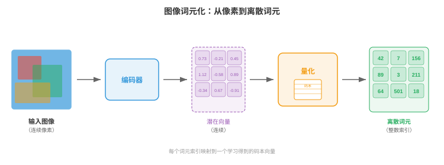
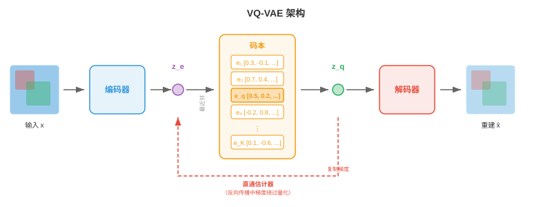
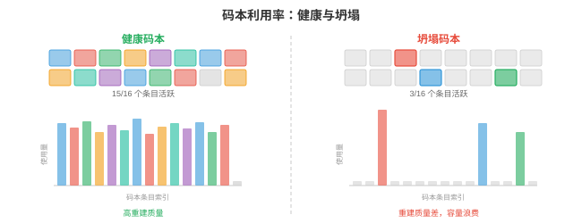
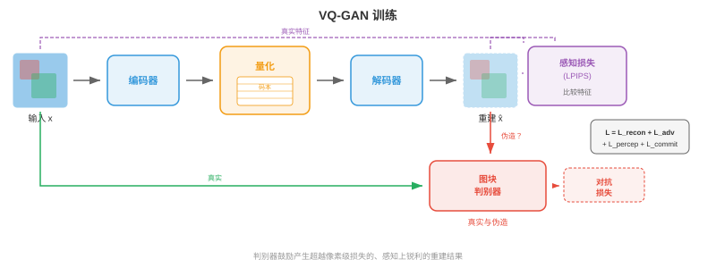
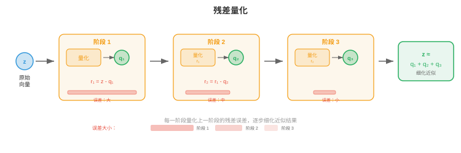
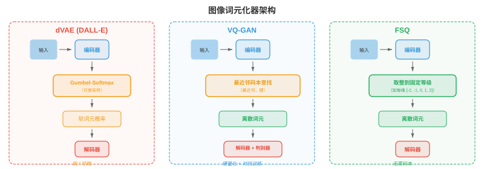
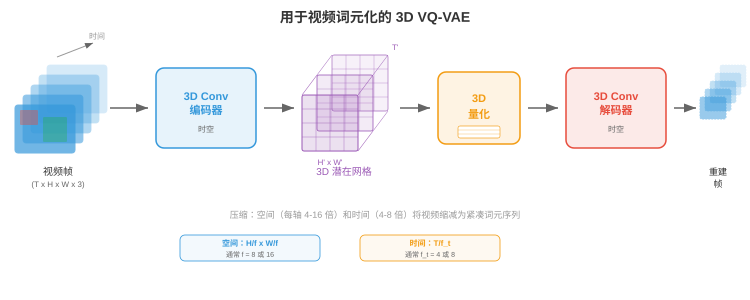
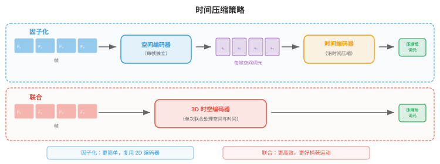
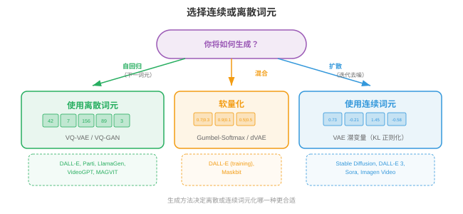
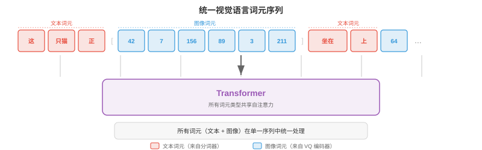

# 图像与视频词元化

*图像与视频词元化将连续视觉数据转换为 Transformer 可以像处理文本一样处理的离散词元序列。本节涵盖 VQ-VAE、VQ-GAN、码本学习、DALL-E 的 dVAE、视频词元化和无查表量化。*

## 为什么要对图像词元化

- 将语言视为有限字母表：英语大约有 26 个字母，现代语言模型会将文本切分为 30,000 至 100,000 个子词词元。每个句子都变成 Transformer 可以逐一预测的离散符号序列。图像则存在于连续的高维空间：一张 256x256 RGB 图像是 $\mathbb{R}^{256 \times 256 \times 3} \approx \mathbb{R}^{196{,}608}$ 中的一个点。若要让语言模型用它“说英语”的同一套机制来“说图像”，就需要把连续像素数组转换为从有限词表取出的、可处理的离散词元序列。这个转换就是**图像词元化（image tokenisation）**。

- 想象你是一位马赛克艺术家。你没有无限多种瓷砖色调，而是有固定调色板，例如 8192 种不同瓷砖颜色。要用马赛克重现一张照片，你必须：（1）决定每块瓷砖表示照片的哪个区域；（2）为每个区域挑选最接近的瓷砖颜色；（3）接受一些细节会丢失，但整体图像仍可识别。图像词元化正是如此：编码器将空间图块压缩成潜在向量，码本将每个向量映射到最近条目，最终得到每图块一个整数索引的网格，供离散模型处理。

- 词元化有三重好处。第一，它极大压缩图像：一张 256x256 图像可以变为 16x16 词元网格，将序列长度从 65,536 个像素降至 256 个词元；对于计算成本随序列长度二次增长的注意力模型，这一规模可以处理。第二，它统一表示：文本词元和图像词元位于同一离散词表中，使单个自回归 Transformer 能生成交错文本与图像。第三，它施加有益瓶颈，迫使模型学习有语义意义的编码，而非记忆像素噪声。



- 回顾第 8 章，卷积网络从图像提取层级特征图；第 7 章中，文本分词器将字符串转换为整数序列。图像词元化恰好位于二者交汇处：它使用 CNN 或视觉 Transformer 编码器（第 8 章）产生空间特征，再借用离散词表思想（第 7 章）将这些特征转换为词元索引。

## VQ-VAE：向量量化

- 如第 6 章所见，标准**变分自编码器（variational autoencoder，VAE）**将输入编码为连续潜在分布，再把该分布的样本解码回重建结果。潜在空间是连续的，不便输入离散序列模型。van den Oord 等人（2017）提出的**向量量化变分自编码器（Vector Quantised Variational Autoencoder，VQ-VAE）**引入含嵌入向量的可学习码本，并将每个编码器输出对齐至最近码本条目，以离散潜变量取代连续潜变量。

- 想象一间恰有 $K$ 个编号书架的图书馆。一本新书（编码器输出）到达时，管理员将它放在与书架现有藏书（码本向量）最相似的书架上，并记录书架编号。之后要取回该书，只需书架编号：该书架上的码本条目已是足够好的替代表示。这就是向量量化。

- 形式上，VQ-VAE 包含三个组件：

- **编码器（encoder）** $E$：将输入图像 $\mathbf{x} \in \mathbb{R}^{H \times W \times 3}$ 映射为连续潜在向量的空间网格 $\mathbf{z}_e = E(\mathbf{x}) \in \mathbb{R}^{h \times w \times d}$，其中 $h \times w$ 是下采样后的空间分辨率，$d$ 是嵌入维度。

- **码本（codebook）** $\mathcal{C} = \{\mathbf{e}_1, \mathbf{e}_2, \ldots, \mathbf{e}_K\} \subset \mathbb{R}^d$：包含 $K$ 个可学习嵌入向量。常见码本大小为 512 到 16,384 个条目。

- **解码器（decoder）** $D$：从量化潜变量重建图像。

- **量化步骤（quantisation step）**将每个编码器输出 $\mathbf{z}_e(\mathbf{x})$（位于空间位置 $(i, j)$）替换为其最近的码本条目：

$$\mathbf{z}_q(i,j) = \mathbf{e}_{k^\ast} \quad \text{where} \quad k^\ast = \arg\min_k \|\mathbf{z}_e(i,j) - \mathbf{e}_k\|_2$$

- 这是嵌入空间中的最近邻查找，与 k-means 分配（第 6 章）完全相同。索引 $k^\ast$ 是空间位置 $(i,j)$ 的离散词元，整张图像表示为一个 $h \times w$ 网格，网格元素来自 $\{1, \ldots, K\}$ 中的整数。



- 挑战在于 $\arg\min$ 不可微：无法穿过离散选择反向传播。VQ-VAE 使用**直通估计器（straight-through estimator）**解决它：前向传播中，解码器接收 $\mathbf{z}_q$（量化向量）；反向传播中，重建损失相对于 $\mathbf{z}_q$ 的梯度直接复制到 $\mathbf{z}_e$，仿佛量化步骤是恒等函数。其紧凑写法为：

$$\mathbf{z}_q = \mathbf{z}_e + \text{sg}(\mathbf{z}_q - \mathbf{z}_e)$$

- 其中 $\text{sg}(\cdot)$ 是停止梯度算子。前向传播中它的值为 $\mathbf{z}_q$；反向传播中，梯度仅流经 $\mathbf{z}_e$ 项。

- 完整 VQ-VAE 损失有三项：

$$\mathcal{L} = \underbrace{\|\mathbf{x} - D(\mathbf{z}_q)\|_2^2}_{\text{reconstruction}} + \underbrace{\|\text{sg}(\mathbf{z}_e) - \mathbf{e}\|_2^2}_{\text{codebook (VQ)}} + \underbrace{\beta \|\mathbf{z}_e - \text{sg}(\mathbf{e})\|_2^2}_{\text{commitment}}$$

- **重建损失（reconstruction loss）**训练编码器和解码器忠实重现输入。**码本损失（codebook loss）**（也称 VQ 损失）将码本向量拉向编码器输出；注意 $\text{sg}(\mathbf{z}_e)$ 表示编码器不会从该项接收梯度，所以它只更新码本。**承诺损失（commitment loss）**则相反：它鼓励编码器输出保持接近码本向量，防止编码器“逃离”码本。超参数 $\beta$（通常为 0.25）控制码本项和承诺项的平衡。

- 实践中，码本通常用更稳定的**指数移动平均（exponential moving average，EMA）**而非梯度下降更新。设 $\mathbf{n}_k$ 为分配至码本条目 $k$ 的编码器输出数量，$\mathbf{s}_k$ 为其总和。EMA 更新为：

$$\mathbf{n}_k \leftarrow \gamma \mathbf{n}_k + (1 - \gamma) |\{(i,j) : k^\ast_{ij} = k\}|$$

$$\mathbf{s}_k \leftarrow \gamma \mathbf{s}_k + (1 - \gamma) \sum_{(i,j) : k^\ast_{ij} = k} \mathbf{z}_e(i,j)$$

$$\mathbf{e}_k \leftarrow \frac{\mathbf{s}_k}{\mathbf{n}_k}$$

- 其中 $\gamma$ 是衰减率（通常为 0.99）。这等价于在编码器输出上运行在线 k-means 算法。

### 码本坍塌

- VQ-VAE 一个臭名昭著的失效模式是**码本坍塌（codebook collapse）**，又称索引坍塌：模型只学会使用 $K$ 个码本条目中的一小部分，使大部分条目“死亡”。想象一家图书馆中 90% 的书架都是空的，因为管理员总把书送往少数热门书架。这浪费了表示容量。

- 码本坍塌源于训练中编码器、码本和解码器共同适配。若某个条目在多个批次中未被选择，它会逐渐偏离编码器流形，因而更不可能被选择，形成正反馈循环。

- 有几种技术可以缓解码本坍塌：
    - **码本重置（codebook reset）**：定期复制随机采样的编码器输出，重新初始化死亡条目，使它们在潜在空间活动区域附近重新开始。
    - **带拉普拉斯平滑的 EMA 更新（EMA updates with Laplace smoothing）**：向 $\mathbf{n}_k$ 加一个小常数，避免条目计数为零，确保所有条目接收梯度信号。
    - **承诺损失调优（commitment loss tuning）**：增大 $\beta$，强制编码器输出更紧密地聚集在码本条目附近，使分配更加均匀。
    - **因子化编码（factorised codes）**：将码本查找分解为更小查找的乘积（例如两个大小均为 $\sqrt{K}$ 的码本），通过降低每次查找的有效码本大小提高利用率。
    - **熵正则化（entropy regularisation）**：添加鼓励码本使用均匀分布的惩罚项，最大化熵 $H = -\sum_k p_k \log p_k$，其中 $p_k$ 是经验分配概率。



## VQ-GAN：用于更高保真度的对抗训练

- VQ-VAE 能生成尚可的重建，但像素级 $\ell_2$ 损失倾向于产生模糊输出，因为它平等惩罚每个像素偏差，会对合理细节取平均，而不是选择清晰细节。想象让人画一张脸，使其与所有可能人脸的平均差异最小，他会画出一张模糊的平均脸，而不是清晰的个体脸。

- **VQ-GAN**（Esser et al., 2021）通过将 VQ-VAE 框架与生成对抗网络（第 6 章）的**判别器（discriminator）**结合来解决这个问题。判别器是基于图块的卷积网络，判断局部图像图块是真实的（来自训练数据）还是伪造的（来自解码器）。这种对抗损失鼓励解码器产生在感知上锐利、真实的纹理，而不是像素均值。

- VQ-GAN 目标在 VQ-VAE 损失上增加两项：

$$\mathcal{L}_\text{VQ-GAN} = \mathcal{L}_\text{VQ-VAE} + \lambda_\text{adv} \mathcal{L}_\text{adv} + \lambda_\text{perc} \mathcal{L}_\text{perc}$$

- **对抗损失（adversarial loss）** $\mathcal{L}_\text{adv}$ 是施加于解码器输出的标准 GAN 目标。判别器 $\mathcal{D}$ 尝试区分真实图块和解码图块，解码器（生成器）则尝试欺骗它。非饱和形式为：

$$\mathcal{L}_\text{adv} = -\mathbb{E}[\log \mathcal{D}(D(\mathbf{z}_q))]$$

- **感知损失（perceptual loss）** $\mathcal{L}_\text{perc}$ 比较原始图像与重建图像在预训练网络（通常是 VGG 或 LPIPS）中的特征激活：

$$\mathcal{L}_\text{perc} = \sum_l \|\phi_l(\mathbf{x}) - \phi_l(D(\mathbf{z}_q))\|_2^2$$

- 其中 $\phi_l$ 表示预训练网络第 $l$ 层的特征图。这一损失捕获高层结构相似性，而非像素级准确度。

- 权重 $\lambda_\text{adv}$ 会自适应设定，使对抗梯度和重建梯度保持平衡，防止重建较差的训练早期被对抗损失主导。



- 其结果是：在相同码本大小下，词元化器产生的重建结果比 VQ-VAE 锐利得多。VQ-GAN 是许多主要图像生成系统的骨干词元化器，包括原始 DALL-E、Parti 和大量文生图模型。它将 256x256 图像转换为来自大小 1024-16384 码本的 16x16 或 32x32 离散词元网格，在每个空间维度上实现 16 倍至 64 倍压缩比。

## 残差量化与多尺度码本

- 单一码本为重建质量施加硬性上限：每个空间位置只能由一个码本向量表示，码本无法表达的更细粒度细节都会丢失。想象用固定调色板中的一个词描述颜色：“蓝绿色”接近但不精确。若能添加细化描述，例如“蓝绿色，但稍偏蓝、略亮”，就会更接近。

- **残差量化（residual quantisation，RQ）**迭代应用这一思想。第一次量化得到 $\mathbf{z}_q^{(1)}$ 后，计算残差 $\mathbf{r}^{(1)} = \mathbf{z}_e - \mathbf{z}_q^{(1)}$，再用第二个码本量化该残差得到 $\mathbf{z}_q^{(2)}$，依此进行 $T$ 个层级：

$$\mathbf{r}^{(0)} = \mathbf{z}_e$$

$$\mathbf{z}_q^{(t)} = \text{Quantise}(\mathbf{r}^{(t-1)}, \mathcal{C}^{(t)})$$

$$\mathbf{r}^{(t)} = \mathbf{r}^{(t-1)} - \mathbf{z}_q^{(t)}$$

- 最终量化表示为 $\hat{\mathbf{z}} = \sum_{t=1}^{T} \mathbf{z}_q^{(t)}$。若 $T$ 个层级各使用大小为 $K$ 的码本，有效词表大小为 $K^T$，但只需存储 $T \times K$ 个向量而非 $K^T$ 个。例如，8 个层级且 $K = 1024$ 时，有效条目数为 $1024^8 \approx 10^{24}$，却只需存储 8192 个向量。

- 每个后续层级捕获更细的细节：第一个码本捕获粗结构，第二个捕获中频修正，依此类推。这类似 JPEG 的逐次逼近或网页图像的渐进渲染，先出现粗略版本，再逐步填充细节。



- **多尺度码本（multi-scale codebooks）**通过在不同空间分辨率上操作扩展这一思想。它不重复量化同一空间网格，而是在多个尺度量化：粗网格捕获全局结构，细网格捕获局部细节。这与第 8 章对象检测部分的特征金字塔思想相关，不同尺度的特征捕获不同细节层级。

- **乘积量化（product quantisation）**是相关技术，它将 $d$ 维潜在向量拆分为 $M$ 个维度 $d/M$ 的子向量，每个子向量使用独立码本量化。这产生 $K^M$ 大小的有效词表，但只需存储 $M \times K$ 个向量。乘积量化广泛用于近似最近邻搜索（第 13 章），也已适配至图像词元化。

- Mentzer 等人（2023）提出的**有限标量量化（finite scalar quantisation，FSQ）**采取完全不同的方法：它不学习码本，而是将潜在向量的每一维直接四舍五入到固定整数等级集合之一（例如 $\{-2, -1, 0, 1, 2\}$）。每维有 $L$ 个等级、共有 $d$ 维时，隐式码本大小为 $L^d$。FSQ 完全避免码本坍塌，因为没有学习到的码本向量，只有经确定性取整的学习到的编码器输出。直通估计器处理取整的不可微性。

## 实践中的图像词元化器

- 从 VQ-VAE 到 VQ-GAN 再到残差量化的发展，催生了一系列用于最先进生成模型的实用图像词元化器。

### DALL-E 词元化器（dVAE）

- 原始 **DALL-E**（Ramesh et al., 2021）使用离散 VAE（dVAE），将 256x256 图像词元化为来自大小 8192 码本的 32x32 词元网格。dVAE 以 Gumbel-Softmax 松弛替换硬 $\arg\min$ 量化，使前向传播在训练时可微；推理时使用 $\arg\max$ 产生硬词元分配。dVAE 使用重建损失、相对于均匀先验的 KL 散度和为 Gumbel-Softmax 学习的温度调度组合训练。随后 DALL-E 训练 120 亿参数自回归 Transformer，对 256 个文本词元和 1024 个图像词元（32x32）的联合分布建模。

### LlamaGen

- **LlamaGen**（Sun et al., 2024）表明，只要拥有好的图像词元化器，就可以将标准 Llama 风格语言模型架构（第 7 章）重新用于自回归图像生成。LlamaGen 使用改进的 VQ-GAN 词元化器和大码本（16,384 个条目），训练一个普通自回归 Transformer（除词元化器外没有特殊图像专用修改），按从左到右的光栅扫描顺序预测图像词元。关键洞见是：图像一旦被词元化为离散序列，对语言有效的同一下一词元预测范式也对图像有效，验证了词元化确实弥合模态鸿沟。

### Cosmos 词元化器

- **Cosmos 词元化器**（NVIDIA，2024）为图像与视频设计统一框架。它采用因果 3D 架构，将图像视为单帧视频，使同一词元化器处理两种模态。Cosmos 同时支持连续和离散词元化模式：连续模式输出实值潜在向量（用于扩散模型后端），离散模式应用有限标量量化产生整数词元（用于自回归模型后端）。编码器使用因果 3D 卷积，因此每帧词元只依赖当前帧和此前帧，支持流式视频词元化。



## 视频词元化

- 视频在图像的空间维度上增加第三个轴：时间。视频是帧的序列，通常每秒 24 至 30 帧；相邻帧高度冗余，因为视觉世界不会在 33 毫秒内剧烈变化。视频词元化利用这种时间冗余，实现远高于逐帧独立词元化的压缩率。

- 将视频压缩想象为翻页书。若每一页都从头绘制，需要数千张精细图画；但大部分页面与相邻页面几乎相同，因此每 10 页画一张完整“关键帧”，只记录中间页面的微小变化即可。视频词元化器会自动学会这一技巧。

### 3D VQ-VAE

- VQ-VAE 向视频扩展最直接的形式是**3D VQ-VAE**：它将编码器和解码器的 2D 卷积替换为同时沿空间和时间维度操作的 3D 卷积。若编码器在空间上以 $f_s$ 倍、时间上以 $f_t$ 倍下采样，尺寸为 $T \times H \times W$ 的视频片段会变成 $(T/f_t) \times (H/f_s) \times (W/f_s)$ 的词元网格。

- 例如，当 $f_s = 16$ 且 $f_t = 4$ 时，16 帧的 256x256 视频片段变为 $4 \times 16 \times 16 = 1024$ 个词元序列。它足够紧凑，可由 Transformer 自回归建模；原始像素数量却为 $16 \times 256 \times 256 \times 3 \approx 3.1$ 百万个值。

- 3D 卷积联合学习空间和时间特征。早期层捕获局部运动（帧间移动的边缘），较深层捕获更高层动态（对象出现、消失或改变形状）。这是第 8 章卷积网络的同一层级特征提取原则沿时间轴的扩展。



### 因果视频词元化器

- 标准 3D 卷积会查看过去、当前和未来帧，这意味着在对任意部分词元化之前，必须先拥有整个视频片段。**因果视频词元化器（causal video tokenisers）**约束时间卷积，使每个输出仅依赖当前帧和过去帧，绝不依赖未来帧。这类似自回归 Transformer（第 7 章）的因果掩码：信息沿时间向前流动，绝不向后。

- 因果词元化对两种场景至关重要。第一是**流式处理（streaming）**：帧到达时即可实时词元化，无需缓冲未来帧。第二是**自回归生成（autoregressive generation）**：当 Transformer 逐帧生成视频时，帧 $t$ 的词元必须能在不知道帧 $t+1$ 的情况下计算，因为帧 $t+1$ 尚未生成。

- 因果约束通过非对称填充时间卷积实现：时间尺寸为 $k$ 的卷积核在过去侧填充 $k-1$ 个零、未来侧不填充零，确保时刻 $t$ 的输出只依赖 $t-k+1, \ldots, t$ 时刻的输入。

- 因果视频词元化器有一个优雅特性：无需特殊处理，就能对单张图像（仅一帧的“视频”）词元化。第一帧没有过去上下文，因此词元只由该帧计算。这种**图像-视频统一（image-video unification）**使单一词元化器服务两种模态，简化架构，并支持使用同一解码器生成图像和视频的模型。

### 时间压缩策略

- 不同应用需要不同时间压缩比。动作识别中，细微运动很重要，温和压缩（$f_t = 2$）可保留时间细节；长视频生成中，存储数千帧难以承受，因此需要激进压缩（$f_t = 8$ 或更高）。

- 一些词元化器使用**因子化压缩（factorised compression）**：分别在不同阶段完成空间和时间压缩。首先，2D 编码器独立压缩每帧，产生逐帧潜在网格；随后，1D 时间编码器沿时间维度压缩。这种因子化比完整 3D 卷积的计算成本更低，也允许空间与时间采用不同压缩比；代价是捕获时空模式（如斜向移动的球）不如联合 3D 编码高效。

- **时间插值词元（temporal interpolation tokens）**是近期创新：词元化器只完整编码关键帧，将中间帧表示为轻量插值编码，描述关键帧间如何变形。这映射了经典视频压缩（H.264/HEVC 的 I 帧和 P 帧），但发生在学习到的潜在空间中。



## 连续词元与离散词元

- 并非每个下游模型都需要离散词元。**扩散模型（diffusion models）**（第 10 章第 4 节）原生使用连续值：它们迭代地对高斯样本去噪，损失函数（去噪得分匹配）定义在连续空间上。对于扩散后端，词元化器编码器产生从不量化的连续潜在向量。**潜在扩散模型（latent diffusion models）**（Stable Diffusion、DALL-E 3、Flux）使用类似 VQ-GAN 的编码器-解码器，但完全跳过码本，在连续潜在空间中运行。

- 相反，**自回归模型（autoregressive models）**（GPT 风格）通过在 $K$ 个类别上做 softmax，从有限词表预测下一个词元。它们根本上需要离散词元。每个使用自回归 Transformer 的图像生成系统（DALL-E、Parti、LlamaGen、Chameleon）都依赖离散词元化器。

- 因此，连续或离散词元的选择取决于生成后端：

- 以下情况使用**离散词元（discrete tokens）**：模型是自回归模型（以交叉熵损失进行下一词元预测）；想与文本词元共享词表以构建统一多模态模型；或需要精确的词元级控制（例如检索或以词元替换进行编辑）。

- 以下情况使用**连续词元（continuous tokens）**：模型是扩散模型或流匹配模型；任务要求极高保真重建（连续潜变量完全避免量化误差）；或希望使用在实值向量上工作的回归损失。

- 一些近期架构支持两种模式。例如 Cosmos 词元化器可从同一编码器输出连续潜变量（用于扩散模式）或经 FSQ 离散化的词元（用于自回归模式），只需开关一个轻量量化头。

- **软量化（soft quantisation）**是折中方案：它不进行硬 $\arg\min$ 分配，而是计算最近 top-$k$ 码本条目的加权平均，权重由负距离上的 softmax 给出。它比硬量化保留更多信息，同时仍近似离散。一些系统训练时使用软量化，推理时使用硬量化。



## 应用

### 自回归图像生成

- 图像成为离散词元序列后，即可训练标准自回归 Transformer 对其建模。图像词元被展平为一维序列（通常按光栅扫描顺序：从左到右、从上到下），Transformer 用标准交叉熵损失学习 $p(\text{token}_i | \text{token}_1, \ldots, \text{token}_{i-1})$。生成时逐一采样词元，将完成网格传入词元化器解码器以产生像素。

- 以文本作为条件很直接：将文本词元置于图像词元序列之前，模型便学习 $p(\text{image tokens} | \text{text tokens})$。DALL-E、Parti 和 LlamaGen 正是这样完成文生图。文本词元和图像词元共享同一 Transformer、同一注意力机制，通常还共享同一嵌入表（文本和图像词元占据不同索引范围）。

- 光栅扫描顺序引入人为的不对称性：图像左上角最先生成，完全没有右下角的上下文。多项工作解决了这个问题。**掩码图像建模（masked image modelling）**（MaskGIT）训练双向 Transformer 同时生成所有词元但具有不同置信度，并迭代揭开最有置信度的词元。**多尺度生成（multi-scale generation）**先生成捕获全局构图的粗词元，再以残差词元细化。这些方法以纯从左到右生成的简洁性为代价，换取更好的全局连贯性。

### 统一视觉语言词元

- 图像词元化最深层的动机是**统一（unification）**：将视觉和语言放入同一表示格式，使单一模型架构同时处理二者。正如第 7 章所述，语言模型是能力极强的序列到序列机器。将图像表示为词元序列后，我们就能直接继承语言建模的全部基础设施，包括预训练配方、扩展定律、RLHF 和上下文长度扩展。

- **Chameleon**（Meta，2024）是突出示例：它使用含 8192 个码本条目的 VQ-GAN 词元化器，将图像转换为词元，并与文本词元交错放入约 65,000 个条目的单一词表（文本 + 图像）。标准 Transformer 在混合图文序列上训练，使它用同一前向传播即可根据图像生成文本、根据文本生成图像，或生成交错图文内容。

- **Gemini**（Google，2024）以大规模采用类似路径：它在单一 Transformer 内原生理解和生成图像、音频和文本，模态专用词元化器将输出送入共享序列。

- 统一模型的关键工程挑战是**词表平衡（vocabulary balance）**：若 65,000 个词表条目中仅 8192 个是图像词元，模型可能给视觉分配不足的容量。解决方案包括每种模态使用独立嵌入层（仅在注意力层共享）、按模态加权损失，以及在预训练中仔细设计数据混合比例。



## 编程任务（使用 CoLab 或笔记本）

1. 在 JAX 中实现一个最小 VQ 层：给定一批编码器输出向量，执行最近邻码本查找并计算 VQ-VAE 损失（重建 + 码本 + 承诺）。将码本利用率可视化为直方图。
```python
import jax
import jax.numpy as jnp
import matplotlib.pyplot as plt

# --- Minimal VQ layer ---
key = jax.random.PRNGKey(42)
d = 8          # embedding dimension
K = 64         # codebook size
n_vectors = 256  # batch of encoder outputs

# Random encoder outputs and codebook
k1, k2 = jax.random.split(key)
z_e = jax.random.normal(k1, (n_vectors, d))       # encoder outputs
codebook = jax.random.normal(k2, (K, d)) * 0.1     # codebook (small init)

# Nearest-neighbour lookup: find closest codebook entry for each z_e
# distances[i, k] = ||z_e[i] - codebook[k]||^2
distances = (
    jnp.sum(z_e ** 2, axis=1, keepdims=True)
    - 2 * z_e @ codebook.T
    + jnp.sum(codebook ** 2, axis=1, keepdims=True).T
)
indices = jnp.argmin(distances, axis=1)       # token indices
z_q = codebook[indices]                        # quantised vectors

# VQ-VAE loss terms
beta = 0.25
loss_codebook = jnp.mean((jax.lax.stop_gradient(z_e) - z_q) ** 2)
loss_commit   = jnp.mean((z_e - jax.lax.stop_gradient(z_q)) ** 2)
loss_total    = loss_codebook + beta * loss_commit
print(f"Codebook loss: {loss_codebook:.4f}, Commitment loss: {loss_commit:.4f}")

# Codebook utilisation
unique, counts = jnp.unique(indices, return_counts=True, size=K, fill_value=-1)
plt.figure(figsize=(10, 4))
plt.bar(range(K), counts, color='#3498db', alpha=0.8)
plt.xlabel('Codebook Index'); plt.ylabel('Assignment Count')
plt.title(f'Codebook Utilisation ({jnp.sum(counts > 0)}/{K} entries used)')
plt.grid(True, alpha=0.3); plt.tight_layout(); plt.show()
# Try: increase K to 512 and observe collapse. Then add codebook reset logic.
```

2. 构建一个学习平铺二维分布的玩具二维向量量化器。生成随机二维点，通过 EMA 更新学习码本，并可视化 Voronoi 区域。
```python
import jax
import jax.numpy as jnp
import matplotlib.pyplot as plt

# Generate 2D data from a mixture of Gaussians
key = jax.random.PRNGKey(0)
n_points = 2000
K = 16  # codebook entries
gamma = 0.99  # EMA decay

# Four clusters
keys = jax.random.split(key, 5)
centres = jnp.array([[2, 2], [-2, 2], [-2, -2], [2, -2]], dtype=jnp.float32)
data = jnp.concatenate([
    jax.random.normal(keys[i], (n_points // 4, 2)) * 0.5 + centres[i]
    for i in range(4)
])

# Initialise codebook from random data points
idx = jax.random.choice(keys[4], n_points, (K,), replace=False)
codebook = data[idx]
ema_count = jnp.ones(K)
ema_sum = codebook.copy()

# Run EMA-based codebook learning for several epochs
for epoch in range(30):
    # Assign each point to nearest codebook entry
    dists = jnp.sum((data[:, None, :] - codebook[None, :, :]) ** 2, axis=2)
    assignments = jnp.argmin(dists, axis=1)
    # EMA update
    for k in range(K):
        mask = (assignments == k)
        count_k = jnp.sum(mask)
        ema_count = ema_count.at[k].set(gamma * ema_count[k] + (1 - gamma) * count_k)
        if count_k > 0:
            sum_k = jnp.sum(data[mask], axis=0)
            ema_sum = ema_sum.at[k].set(gamma * ema_sum[k] + (1 - gamma) * sum_k)
    codebook = ema_sum / ema_count[:, None]

# Visualise assignments and codebook
fig, ax = plt.subplots(1, 1, figsize=(8, 8))
colors = plt.cm.tab20(jnp.linspace(0, 1, K))
for k in range(K):
    mask = assignments == k
    ax.scatter(data[mask, 0], data[mask, 1], c=[colors[k]], s=5, alpha=0.3)
ax.scatter(codebook[:, 0], codebook[:, 1], c='black', s=120, marker='X',
           edgecolors='white', linewidths=1.5, zorder=10, label='Codebook')
ax.set_title(f'Learned VQ Codebook ({K} entries) on 2D Data')
ax.legend(); ax.set_aspect('equal'); ax.grid(True, alpha=0.3)
plt.tight_layout(); plt.show()
# Try: increase K to 64 and observe finer tiling. Reduce gamma and see instability.
```

3. 演示残差量化：以 $T$ 个连续量化阶段编码一批向量，并测量重建误差如何随层级增加而下降。
```python
import jax
import jax.numpy as jnp
import matplotlib.pyplot as plt

key = jax.random.PRNGKey(7)
d = 16         # embedding dimension
K = 32         # codebook size per level
T = 8          # number of residual levels
n_vectors = 512

# Random data to quantise
k1, *cb_keys = jax.random.split(key, T + 1)
z = jax.random.normal(k1, (n_vectors, d))

# Independent random codebooks for each level
codebooks = [jax.random.normal(cb_keys[t], (K, d)) * (0.5 ** t)
             for t in range(T)]

# Residual quantisation loop
residual = z.copy()
z_hat = jnp.zeros_like(z)
errors = []

for t in range(T):
    cb = codebooks[t]
    dists = (jnp.sum(residual ** 2, axis=1, keepdims=True)
             - 2 * residual @ cb.T
             + jnp.sum(cb ** 2, axis=1, keepdims=True).T)
    indices = jnp.argmin(dists, axis=1)
    z_q_t = cb[indices]
    z_hat = z_hat + z_q_t
    residual = residual - z_q_t
    mse = jnp.mean(jnp.sum((z - z_hat) ** 2, axis=1))
    errors.append(float(mse))
    print(f"Level {t+1}: MSE = {mse:.4f}")

plt.figure(figsize=(8, 5))
plt.plot(range(1, T + 1), errors, 'o-', color='#e74c3c', linewidth=2, markersize=8)
plt.xlabel('Residual Quantisation Level')
plt.ylabel('Reconstruction MSE')
plt.title('Error Reduction with Residual Quantisation')
plt.xticks(range(1, T + 1)); plt.grid(True, alpha=0.3)
plt.tight_layout(); plt.show()
# Try: use a single codebook of size K*T and compare with RQ. Which wins?
```

4. 模拟一个简单的一维“视频词元化器”：生成一维信号序列（模拟视频帧），应用因果时间压缩，并从重建质量上与非因果压缩比较。
```python
import jax
import jax.numpy as jnp
import matplotlib.pyplot as plt

key = jax.random.PRNGKey(99)
n_frames = 16
frame_len = 64

# Generate a "video": a slowly moving Gaussian bump across frames
x_axis = jnp.linspace(-3, 3, frame_len)
frames = jnp.stack([
    jnp.exp(-0.5 * (x_axis - (-2 + 4 * t / n_frames)) ** 2)
    for t in range(n_frames)
])  # shape: (n_frames, frame_len)

# Causal temporal compression: each frame's code depends only on past frames
# Simple approach: average current frame with exponential decay of past
alpha_causal = 0.6
causal_codes = jnp.zeros_like(frames)
causal_codes = causal_codes.at[0].set(frames[0])
for t in range(1, n_frames):
    causal_codes = causal_codes.at[t].set(
        alpha_causal * frames[t] + (1 - alpha_causal) * causal_codes[t - 1]
    )

# Non-causal: average with both past and future (bilateral smoothing)
kernel = jnp.array([0.2, 0.6, 0.2])  # past, current, future
padded = jnp.concatenate([frames[:1], frames, frames[-1:]], axis=0)
noncausal_codes = jnp.stack([
    kernel[0] * padded[t] + kernel[1] * padded[t+1] + kernel[2] * padded[t+2]
    for t in range(n_frames)
])

# Reconstruction error
mse_causal = jnp.mean((frames - causal_codes) ** 2)
mse_noncausal = jnp.mean((frames - noncausal_codes) ** 2)
print(f"Causal MSE: {mse_causal:.6f}, Non-causal MSE: {mse_noncausal:.6f}")

fig, axes = plt.subplots(1, 3, figsize=(15, 5))
for ax, data, title in zip(axes,
    [frames, causal_codes, noncausal_codes],
    ['Original Frames', f'Causal (MSE={mse_causal:.5f})',
     f'Non-causal (MSE={mse_noncausal:.5f})']):
    ax.imshow(data, aspect='auto', cmap='viridis', origin='lower')
    ax.set_xlabel('Spatial Position'); ax.set_ylabel('Frame Index')
    ax.set_title(title)
plt.tight_layout(); plt.show()
# Try: vary alpha_causal and the kernel weights. What happens with alpha=1.0?
```
