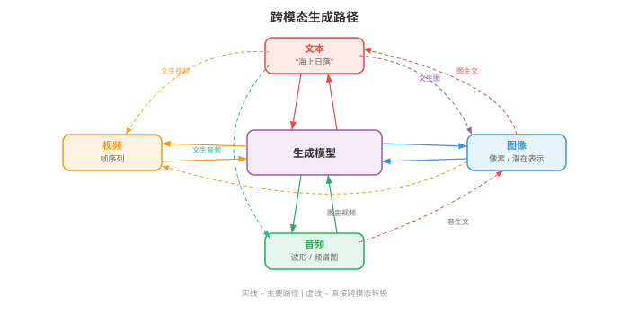
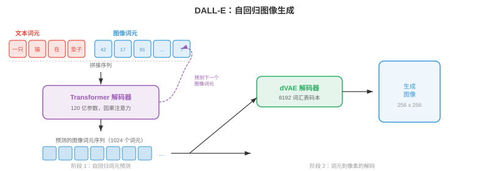
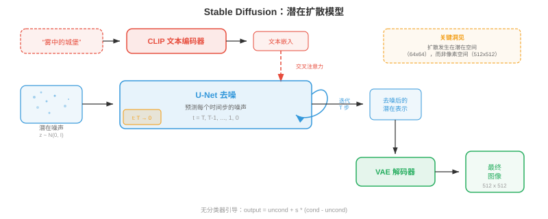
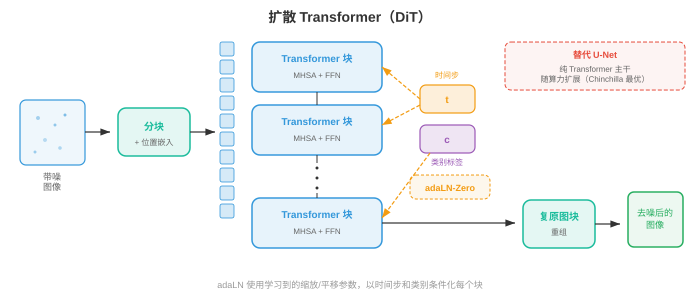
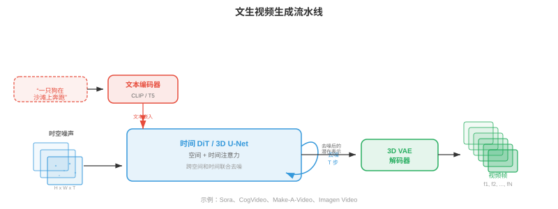
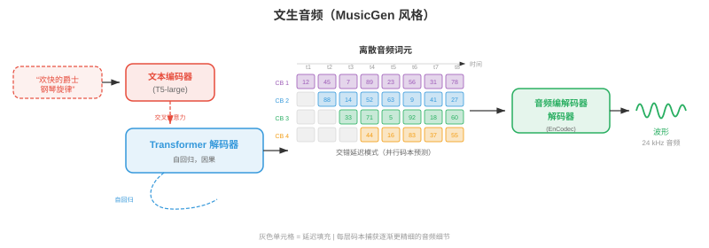
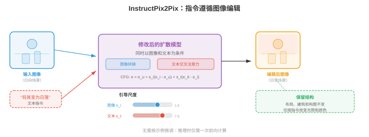
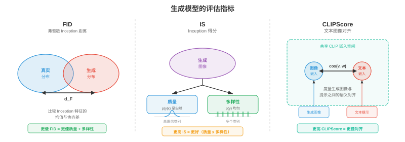

# 跨模态生成

*跨模态生成以一种模态的输入为条件，在另一种模态中产生输出：文生图、图生文、文生音频等。本节涵盖 DALL-E、Stable Diffusion、无分类器引导、ControlNet、图像描述、文生视频（Sora）和文生音频。*

- 在本章第 01-03 节中，你学习了如何表示、对齐和词元化不同模态。现在进入创造性环节：由一种模态生成另一种模态。跨模态生成是文生图工具、视频合成系统、音乐作曲模型和图像描述背后的引擎。把它想象成教机器成为多媒体艺术家：你用语言描述想要的内容，它便绘画、制作动画或谱曲。

- 核心思想是**条件生成（conditional generation）**：给定模态 $A$ 的输入（如文本），在模态 $B$ 中产生输出（如图像）。形式上，学习模型 $p_\theta(y \mid x)$，其中 $x$ 是条件信号，$y$ 是生成输出。难点在于该条件分布极其复杂且维度很高：一张 512x512 图像位于 $\mathbb{R}^{786432}$ 中，单个文本提示词对应许多有效图像。



## 文生图

- 想象你向法庭素描师描述一个场景。艺术家必须理解你的话、回忆物体外观、在空间中安排它们，并绘制最终画面。文生图模型做的正是这件事，只是它必须从数据中学习所有这些技能，而非经过多年艺术学校训练。

### DALL-E：自回归图像生成

- **DALL-E**（Ramesh et al., 2021）将图像生成视为序列预测问题，即驱动语言模型的同一范式（第 07 章）。关键洞见是：若能将图像表示为离散词元（回顾第 03 节 VQ-VAE），生成图像就只是逐一生成词元序列。

- 该流水线有两个阶段。首先，**离散 VAE（discrete VAE，dVAE）**将 256x256 图像压缩为来自 8192 条目码本的 32x32 离散词元网格，把图像缩减为 1024 个词元序列。其次，训练一个 **Transformer 解码器（transformer decoder）**，对 256 个文本词元（BPE 编码）与 1024 个图像词元拼接形成、总计 1280 个词元的联合分布建模：

$$p(x_{\text{text}}, x_{\text{img}}) = \prod_{i=1}^{1280} p(x_i \mid x_1, \ldots, x_{i-1})$$

- 生成时，输入文本词元，模型自回归地逐一采样图像词元。其优雅之处在于，它将语言建模的原有机制，即注意力、因果掩码和 top-k 采样，原封不动用于图像合成。

- 缺点是自回归生成天生串行：一次生成 1024 个词元很慢，序列早期的任何错误都会累积。DALL-E 通过生成大量候选图像并使用 CLIP（第 01 节）重新排序，来找到与文本提示词最匹配的结果。



### Stable Diffusion：文本条件下的潜在扩散

- **Stable Diffusion**（Rombach et al., 2022）采取了根本不同的路径。它不逐一预测词元，而是从纯噪声出发，在文本提示词引导下逐步去噪为图像。回顾第 8 章的扩散模型，Stable Diffusion 工作在压缩潜在空间而非像素空间，因而效率高得多。

- 架构由三个协同组件组成。**VAE 编码器**将图像从像素空间（$512 \times 512 \times 3$）压缩到潜在表示（$64 \times 64 \times 4$），维度降低 48 倍。**文本编码器（text encoder）**（通常是 CLIP 或 OpenCLIP）将文本提示词转换为嵌入向量序列。**U-Net 去噪器（U-Net denoiser）**接收带噪潜变量、时间步和文本嵌入，预测每一步应减去的噪声。文本条件通过**交叉注意力（cross-attention）**层进入 U-Net：

$$\text{Attention}(Q, K, V) = \text{softmax}\left(\frac{QK^T}{\sqrt{d}}\right)V$$

- 其中 $Q$ 来自带噪图像特征，$K, V$ 来自文本嵌入。这使模型能在每个空间位置关注相关词语，例如对“红球”应该出现的区域去噪时，模型会关注“红”和“球”这两个词元。

- 推理时，在潜在空间采样 $z_T \sim \mathcal{N}(0, I)$，使用 U-Net 迭代去噪 $T$ 步（通常使用 DDIM 调度为 20-50 步），再用 VAE 解码器将干净潜变量 $z_0$ 解码回像素空间。整个前向过程可在消费级 GPU 上数秒内生成 512x512 图像。



### 实践中的无分类器引导

- **无分类器引导（classifier-free guidance，CFG）**是让文生图模型生成真正符合提示词图像的关键配方。回顾第 8 章，CFG 同时以有条件和无条件方式训练模型，然后在采样时放大条件信号：

$$\hat{\epsilon} = \epsilon_\theta(x_t, \varnothing) + s \cdot (\epsilon_\theta(x_t, c) - \epsilon_\theta(x_t, \varnothing))$$


- 其中 $s$ 是引导尺度。可以将项 $(\epsilon_\theta(x_t, c) - \epsilon_\theta(x_t, \varnothing))$ 视为“指向提示词的方向”，它捕获有条件预测区别于无条件预测的部分。乘以 $s > 1$ 会夸大这一方向，以牺牲多样性为代价，让图像更接近文本描述。

- 实践中，$s = 7.5$ 是 Stable Diffusion 的常见默认值。$s = 1.0$ 时得到原始模型输出，具有多样性但与提示词匹配较松；$s = 20+$ 时图像会过度饱和且重复，却与文本高度对齐。最优 $s$ 取决于应用：创意探索偏好较低引导，精确遵循提示词则需要较高引导。

### Imagen：具有语言理解的级联扩散

- **Imagen**（Saharia et al., 2022）证明，强大的文本编码器比更大的图像模型更重要。Imagen 不使用 CLIP，而是使用冻结的 **T5-XXL** 语言模型（第 07 章）作为文本编码器；它对语言语义、组合性和空间关系（“一个红色球体上方的蓝色立方体”）有更丰富的理解。

- Imagen 使用**级联扩散（cascaded diffusion）**：基础扩散模型生成 64x64 图像，第一个超分辨率模型放大到 256x256，第二个超分辨率模型到达 1024x1024。每个阶段都是独立扩散模型，以文本和（对上采样器而言）低分辨率图像为条件。该级联避免在基础分辨率上建模细节，使基础模型专注构图和语义，上采样器负责纹理和清晰度。

- Imagen 还引入**动态阈值（dynamic thresholding）**：每步去噪时，将预测像素值裁剪到基于分位数的范围，而非固定范围 $[-1, 1]$。这可防止高引导尺度下的饱和伪影，后者是扩散模型的常见问题。

### Parti：大规模自回归

- **Parti**（Pathways Autoregressive Text-to-Image，Yu et al., 2022）以极大规模复兴了自回归路径。与 DALL-E 一样，它将图像转换为离散词元（使用 ViT-VQGAN），并使用 Transformer 顺序生成。不同的是，Parti 使用 200 亿参数编码器-解码器 Transformer（基于 Pathways 架构），表明充分扩展后，自回归模型可以达到扩散模型质量。

- Parti 的编码器-解码器架构是与 DALL-E 仅解码器设计的关键差异。文本经过编码器；解码器生成图像词元时对已编码文本施加交叉注意力。这类似机器翻译（第 07 章），即从“文本语言”翻译到“图像语言”。

### DiT 与基于流的生成

- **扩散 Transformer（Diffusion Transformers，DiT）**（Peebles and Xie, 2023）用普通 Transformer 替换扩散模型中的 U-Net 骨干。每个带噪潜在图块被视为词元（类似第 8 章 ViT），Transformer 使用自注意力和对文本条件的交叉注意力处理这些词元。DiT 表明，Transformer 在扩散中比 U-Net 更可预测地扩展：计算量翻倍可稳定地将 FID 分数减半。

- **流匹配（flow matching）**（回顾第 8 章）已成为扩散噪声预测范式的替代方案。模型不预测应减去的噪声 $\epsilon$，而是预测速度 $v_\theta(x_t, t)$，将样本沿从噪声到数据的直线路径传输。**Stable Diffusion 3** 与 **Flux** 使用具有**多模态 DiT（multimodal DiT，MM-DiT）**架构的流匹配：文本和图像词元通过具有双向注意力的 Transformer 块联合处理，两个模态彼此关注，而非仅由文本通过交叉注意力条件化图像特征。



## 文生视频

- 文生视频是文生图外加一个严苛约束：**时间连贯性（temporal coherence）**。每一帧必须内部一致（是一张有效图像），连续帧也必须平滑连接，对象应自然运动、光照应连续变化，“摄像机”应遵循物理上合理的轨迹。这如同画一幅风景画与执导一部电影的差别。

### 时间挑战

- 视频带来图像生成之外的三个挑战。**时间一致性（temporal consistency）**要求对象跨帧保持身份，例如第 1 帧的狗在第 100 帧仍是同一只狗。**运动建模（motion modelling）**要求学习物理动力学：对象如何移动、重力如何作用、流体如何流动。**计算成本（compute cost）**很高：10 秒、24 fps、512x512 分辨率的视频包含 $10 \times 24 \times 512 \times 512 \times 3 \approx 188$ 百万个值，约是单张图像数据量的 240 倍。

### Make-A-Video 与扩展到视频的方法

- **Make-A-Video**（Singer et al., 2022）采取务实路径：从预训练文生图模型开始，再增加时间层。关键洞见是，已经有在数十亿图文对上训练的强大图文模型，只需从无标签视频数据中学习运动。

- Make-A-Video 向预训练的空间 U-Net 中插入**时间注意力（temporal attention）**和**时间卷积（temporal convolution）**层。空间层（在图像上预训练）处理外观，新增时间层（在视频上训练）处理运动。空间自注意力在每帧内操作；时间注意力在每个空间位置上跨帧操作。该因子化高效，因为时间模式和空间模式在很大程度上可分离。

- 生成流水线模仿 Imagen 的级联：基础模型在 64x64 生成 16 帧，空间和时间超分辨率模型再上采样至最终分辨率和帧率；帧插值网络提高时间平滑度。

### VideoPoet 与基于词元的视频模型

- **VideoPoet**（Kondratyuk et al., 2024）在语言建模范式下统一视频生成。文本、图像、视频和音频等所有模态都词元化为离散序列；单一大语言模型（LLM）经过训练，可在所有模态上自回归预测词元。这使零样本能力得以出现：文生视频、图生视频、视频生音频、视频编辑和修复均源自同一模型。

- VideoPoet 使用 MAGVIT-v2 编码器（第 03 节的 3D VQ-VAE）对视频词元化，联合压缩空间和时间维度；音频由 SoundStream 词元化。LLM 骨干先在文本上预训练，再在多模态词元序列上微调，以学习跨模态联合分布。

### Sora 风格的时间扩散

- **Sora**（OpenAI，2024）因能够生成长时、连贯且物理上合理的视频而使时间扩散受到广泛关注。尽管完整架构细节尚未公布，关键思想是将 DiT 扩展至时空：视频帧被分解为**时空图块（spacetime patches）**，即跨高度、宽度和时间的 3D 块，并作为大型 Transformer 的词元。

- 时空图块意味着模型把视频当作原生 3D 信号处理，而非 2D 帧序列。这使其捕获长程时间依赖，能在整个视频时长内“提前规划”，而不是逐帧生成。

- Sora 可通过调整时空图块数量处理不同持续时间、分辨率和宽高比。在原始分辨率数据上训练（而非把一切裁剪为正方形）能改善构图和取景质量。

### Wan：开源视频生成

- **Wan**（Wan et al., 2025）是基于 DiT 骨干和 3D VAE 时间压缩的开源视频生成模型家族（13 亿和 140 亿参数）。Wan 使用**流匹配（flow matching）**而非传统 DDPM 风格扩散，学习从噪声到视频潜变量的直线传输路径。3D VAE 同时压缩视频空间和时间（4 倍时间压缩），DiT 使用完整 3D 注意力处理所得时空潜在词元。

- Wan 支持文生视频、图生视频（让静态图像动起来）和视频编辑。140 亿参数模型可在 720p 分辨率生成最长 5 秒的连贯视频，表明经过谨慎的架构与训练配方选择，开源模型可接近专有系统质量。



## 文生音频

- 想象一位电影作曲家阅读剧本后为其配乐。文生音频模型做类似事情：给定文本描述，例如“带有暴雨和远处雷声的雷暴”，生成相应音频波形。难点在于弥合离散符号化文本与连续时间性声音之间的鸿沟。

### AudioLM：音频语言建模

- **AudioLM**（Borsos et al., 2023）通过自回归预测离散音频词元生成音频，采用与 DALL-E 生成图像相同的语言建模范式。它使用层级词元结构：**语义词元（semantic tokens）**（来自 w2v-BERT 等自监督模型，回顾第 9 章）捕获高层内容，例如说了什么或演奏了什么；**声学词元（acoustic tokens）**（来自神经音频编解码器 SoundStream）捕获细粒度声学细节，例如听起来如何，包括音色和录制质量。

- 生成分为两个阶段。第一阶段，Transformer 根据可选音频提示词预测语义词元，确定高层内容计划。第二阶段，另一个 Transformer 以语义词元为条件预测声学词元，补全声学细节。这一层级映射了文本转语音流水线（第 9 章）：语义词元扮演音素角色，声学词元扮演 mel 频谱图帧角色。

- AudioLM 可以生成语音续写（给定 3 秒语音，生成后续 10 秒）、音乐续写和音效，全部由在纯音频数据上训练的单一模型完成，预训练不需要文本标签。

### MusicLM：文本条件音乐

- **MusicLM**（Agostinelli et al., 2023）将 AudioLM 扩展到文本条件音乐生成。它添加了用于条件生成的文本音频联合嵌入，来自 **MuLan**，即在音乐文本对上训练的类 CLIP 模型。MuLan 嵌入捕获文本描述的语义，例如“带萨克斯独奏的欢快爵士乐”，并引导层级词元生成。

- MusicLM 以 24 kHz 生成任意时长的音乐，在数分钟作品中保持旋律和节奏连贯性。它还可以以哼唱旋律（由音高跟踪器提取的旋律词元）和文本描述共同为条件，生成遵循哼唱曲调且具有文本所述风格的完整编曲。

### MusicGen：高效单阶段生成

- **MusicGen**（Copet et al., 2023）简化了多阶段方法。它不使用独立的语义和声学模型，而是使用单一自回归 Transformer，直接从音频编解码器生成多个码本层级。关键创新是**交错码本模式（interleaved codebook pattern）**：MusicGen 不在转到下一时间步之前生成一个时间步的所有码本层级，而是在码本与时间步间交错词元，使部分码本层级可以并行解码。

- 条件化很直接：T5 编码器编码文本，文本嵌入被置于音频词元序列之前（如语言模型中的前缀提示词）或通过交叉注意力注入。MusicGen 还支持旋律条件：参考旋律的色度图（来自第 9 章讨论的频谱图特征）会被编码并与文本条件一起使用。

$$p(a_1, \ldots, a_T) = \prod_{t=1}^{T} \prod_{k=1}^{K} p(a_{t,k} \mid a_{<t}, c_{\text{text}})$$

- 其中 $a_{t,k}$ 是时间步 $t$、码本层级 $k$ 的音频词元，$c_{\text{text}}$ 是文本条件。对 $k$ 的乘积如何分解取决于码本模式，部分层级会并行预测。



## 图生文

- 现在翻转方向：给定图像，生成自然语言描述。这就是**图像描述（image captioning）**，是一种以图像为条件的条件文本生成。想象博物馆讲解员描述一幅画：他必须感知视觉内容、理解对象之间关系，并用流畅语言表达观察结果。

### 作为条件生成的图像描述

- 经典方法使用**编码器-解码器（encoder-decoder）**架构（第 07 章）。预训练 CNN 或 ViT（第 8 章）将图像编码为一组特征向量。语言模型解码器逐词生成描述，并在每一步关注图像特征：

$$p(w_1, \ldots, w_L \mid I) = \prod_{l=1}^{L} p(w_l \mid w_1, \ldots, w_{l-1}, I)$$

- 其中 $w_l$ 是描述词语，$I$ 是图像表示。交叉注意力将文本解码器连接到图像特征，使模型在生成不同词语时能“查看”图像不同区域，例如生成“狗”时关注狗区域，生成“公园”时关注公园区域。

- **CoCa**（Contrastive Captioners，Yu et al., 2022）在单一模型中统一了对比学习（第 01 节 CLIP 风格目标）和图像描述。图像编码器产生的特征既用于与文本的对比对齐，也用于图像描述解码器的交叉注意力。这种多任务训练使 CoCa 同时具备强大的零样本识别能力（来自对比学习）和生成能力（来自图像描述）。

### 现代视觉语言图像描述

- 现代方法常使用**大型多模态模型（large multimodal models）**（第 02 节）进行图像描述。LLaVA、Qwen-VL 和 GPT-4V 等模型将图像描述视为视觉问答的特例，隐含的问题是“描述这张图像”。视觉编码器（CLIP ViT 或 SigLIP）产生图块词元，投影到 LLM 嵌入空间，LLM 再生成自由形式描述。

- 基于 LLM 的图像描述相较专用编码器-解码器模型的优势在于**指令遵循（instruction following）**：你可要求不同详细程度，例如“一句话描述”或“提供详细段落”；聚焦特定方面，例如“描述颜色”；或生成结构化输出，例如“列出所有对象及其位置”。这种灵活性来自 LLM 的指令微调（第 07 章）。

## 视频音频协同生成

- 想象看一部静音电影，体验是空洞的。视觉内容和音频深度耦合：弹跳的球带有有节奏的撞击声，雨会发出沙沙声，人群会欢呼。**视频音频协同生成（video-audio co-generation）**旨在同时产生两种模态，并保持所见与所闻的时间对齐。

### 联合时间建模

- 核心挑战是**时间同步（temporal synchronisation）**：鼓点音频必须与鼓槌击中鼓面的视觉帧精确同时发生。这要求两种模态都能引用共享时间表示。

- 一种方法是从共享潜在时间线生成视频和音频。**CoDi**（Composable Diffusion，Tang et al., 2023）等模型为每种模态使用独立扩散模型，但通过共享潜在空间对齐。训练时，跨模态注意力层学习在每个时间步同步视觉与音频特征；生成时，两个扩散过程同时运行，通过共享对齐相互条件化。

- 上文讨论的 VideoPoet 采用更统一的方式：所有模态词元化为单一序列，LLM 自然学习视频词元与音频词元之间的时间对应关系。包含吠叫狗的视频片段及其对应音频词元会教会模型，将视觉上的吠叫动作与吠叫声音关联起来。

- **时间对齐损失（temporal alignment loss）**函数显式强制同步。一种表述在帧级使用对比学习：时间 $t$ 的音频片段应比其他时间的帧更相似于时间 $t$ 的视频帧：

$$\mathcal{L}_{\text{sync}} = -\mathbb{E}_t \left[\log \frac{\exp(\text{sim}(v_t, a_t) / \tau)}{\sum_{t'} \exp(\text{sim}(v_t, a_{t'}) / \tau)}\right]$$

- 其中 $v_t$ 和 $a_t$ 分别是时间 $t$ 的视频和音频表示，$\tau$ 是温度参数。它在结构上与第 01 节的 InfoNCE 损失完全相同，只是应用于时间帧级别，而非片段级别。

## 指令遵循生成

- 想象你对画家说“让天空更具戏剧性”或“把帽子换成王冠”。**指令遵循生成（instruction-following generation）**让你能用自然语言命令编辑图像，而不必使用精确的空间掩码或笔触。

### InstructPix2Pix：按描述编辑

- **InstructPix2Pix**（Brooks et al., 2023）训练一个条件扩散模型：输入一张图像和一条文本指令，输出编辑后的图像。其巧妙之处在于训练数据的构造方式：GPT-3 生成编辑指令，例如“把它变成冬天”“把猫变成狗”，并为输入输出配对生成文本描述；文生图模型（Stable Diffusion）再生成相应的图像对。

- 该模型是经过修改的 Stable Diffusion U-Net，同时接收文本指令（通过交叉注意力）和输入图像的潜在表示（沿通道维与带噪潜在表示拼接）。它使用具有两个引导尺度的**双重无分类器引导（dual classifier-free guidance）**：一个用于文本指令（$s_T$），另一个用于输入图像（$s_I$）：

$$\hat{\epsilon} = \epsilon_\theta(x_t, \varnothing, \varnothing) + s_I \cdot (\epsilon_\theta(x_t, c_I, \varnothing) - \epsilon_\theta(x_t, \varnothing, \varnothing)) + s_T \cdot (\epsilon_\theta(x_t, c_I, c_T) - \epsilon_\theta(x_t, c_I, \varnothing))$$

- 其中 $c_I$ 是输入图像条件，$c_T$ 是文本指令。第一项引导控制输入图像保留的程度；第二项控制对指令的遵循强度。这为用户提供了一个二维调节器：较高的 $s_I$ 会更严格地保留原图，较高的 $s_T$ 则会带来更显著的编辑。



### SDEdit 与基于噪声的编辑

- **SDEdit**（Meng et al., 2022）提供了一种无需专门训练、更为简单的编辑方法。先对输入图像加噪，即将正向扩散过程运行到中间时间步 $t_0$；然后根据描述期望输出的文本提示去噪。噪声量控制编辑强度：低噪声保留结构，适合颜色变化和风格迁移；高噪声允许大幅重构，适合替换对象和改变布局。

- 这一权衡可以精确定量：在时间步 $t_0$，带噪图像保留原始信号的 $\bar{\alpha}_{t_0}$ 部分。去噪过程依照新文本提示填补被破坏的细节。其数学依据是：扩散模型从后验分布 $p(x_0 \mid x_{t_0}, c)$ 中采样，其中 $x_{t_0}$ 约束生成结果与原图“接近”。

### ControlNet：空间条件

- **ControlNet**（Zhang et al., 2023）为文生图扩散增加细粒度空间控制。它训练预训练 U-Net 编码器的一个副本以接受额外输入条件，如边缘图（Canny 边缘）、深度图、姿态骨架和分割图；原始 U-Net 权重保持冻结。ControlNet 编码器的输出通过**零卷积（zero convolutions）**，即初始化为零的 1x1 卷积，被加入冻结 U-Net 的跳跃连接，确保训练从预训练模型原有行为起步，再逐渐学会新条件。

- 该架构允许将草图、深度图或人体姿态作为结构指引，再由文本提示填充外观。预训练权重负责照片级真实感和文本理解，ControlNet 层负责对条件的空间保真度。

## 一致性与对齐度量

- 如何衡量生成图像是否优秀？“优秀”至少包含两个维度：**质量（quality）**，即它是否像真实图像；以及**对齐（alignment）**，即它是否符合文本提示。为量化这些维度，人们提出了多种指标。

### 弗雷歇 Inception 距离（Frechet Inception Distance，FID）

- **弗雷歇 Inception 距离（Frechet Inception Distance，FID）**（Heusel et al., 2017）衡量生成图像与真实图像的分布在预训练 Inception 网络特征空间中的距离。可以将它理解为比较两组图像集合的“指纹”，而非逐张比较图像。

- 真实图像集和生成图像集都会输入 Inception-v3，并收集倒数第二层的激活值。这些激活值分别建模为多元高斯分布 $\mathcal{N}(\mu_r, \Sigma_r)$ 与 $\mathcal{N}(\mu_g, \Sigma_g)$。FID 就是这两个高斯分布之间的弗雷歇距离（Wasserstein-2 距离）：

$$\text{FID} = \|\mu_r - \mu_g\|^2 + \text{Tr}\left(\Sigma_r + \Sigma_g - 2(\Sigma_r \Sigma_g)^{1/2}\right)$$

- FID 越低越好。FID = 0 表示两个分布完全相同。FID 同时刻画质量，生成图像模糊时，其特征会偏离真实图像；也刻画多样性，模型发生模式坍塌时，$\Sigma_g$ 会小于 $\Sigma_r$。在 ImageNet 256x256 上，典型的最先进结果为 FID < 2.0。

- FID 有已知局限：它假设特征分布为高斯分布，这只是近似；它需要数千个样本才能稳定估计；并且它使用 Inception 特征，可能无法捕捉全部感知上重要的差异。

### Inception 得分（Inception Score，IS）

- **Inception 得分（Inception Score，IS）**（Salimans et al., 2016）度量两种性质：每张生成图像应能被高置信度地分类，即条件类别分布 $p(y \mid x)$ 应当尖锐；生成图像集应覆盖许多类别，即边缘分布 $p(y) = \mathbb{E}_x[p(y \mid x)]$ 应当均匀。IS 通过 KL 散度将二者结合：

$$\text{IS} = \exp\left(\mathbb{E}_x \left[D_{\text{KL}}(p(y \mid x) \| p(y))\right]\right)$$

- IS 越高越好。其最大值等于类别数，ImageNet 为 1000。IS 奖励质量，即清晰、可识别的图像，也奖励多样性，即对类别的覆盖；但它有显著局限：完全忽略真实数据分布，无法发现某一类别内部的模式缺失，并且因为采用 Inception 的类别预测，会偏向 ImageNet 风格图像。

### CLIPScore：度量文本图像对齐

- **CLIPScore**（Hessel et al., 2021）使用预训练 CLIP 模型（第 01 节），直接度量生成图像与其文本提示的匹配程度。该得分就是 CLIP 图像嵌入和 CLIP 文本嵌入的余弦相似度：

$$\text{CLIPScore}(I, T) = \max(0, \cos(E_I(I), E_T(T)))$$

- 其中 $E_I$ 和 $E_T$ 分别为 CLIP 图像编码器与文本编码器。CLIPScore 是无参考指标：它不需要真实图像，只需要文本提示。它与人类对文本图像对齐的判断具有良好相关性，已成为评估文生图模型提示保真度的标准指标。

- 若要与参考描述进行比较，**RefCLIPScore** 会纳入一张参考图像：

$$\text{RefCLIPScore} = \text{HarmonicMean}(\text{CLIPScore}(I, T), \max(0, \cos(E_I(I), E_I(I_{\text{ref}}))))$$

- 该指标平衡了文本对齐度与对参考图像的视觉相似度。



### 人工评估

- 自动指标只是替代性度量，人类判断仍是金标准。常见流程包括**成对比较（pairwise comparisons）**，即两张图中哪一张更符合提示；**李克特量表（Likert scales）**，即按 1 至 5 分评价质量和对齐度；以及 **Elo 评分（Elo ratings）**，即在模型之间采用锦标赛式排序。DrawBench 和 PartiPrompts 基准提供标准化的提示集，用于系统性人工评估。

## 伦理考量

- 跨模态生成是人工智能中伦理影响最重大的领域之一。根据文本描述创建照片级真实感的图像、视频和音频的能力，带来了从业者必须严肃对待的深刻问题。

### 深度伪造与虚假信息

- **深度伪造（deepfakes）**是经生成或篡改、旨在描绘从未发生事件的媒体。文生图和文生视频模型可以制作令人信服的公众人物假照片、伪造证据和误导性新闻图像。危险不仅在于假内容存在，更在于它们会侵蚀人们对全部媒体的信任：若任何图像都可能是假的，任何图像就都无法被完全信任。

- 检测方法包括用真实图像与生成图像训练分类器、分析统计伪迹，GAN 生成图像带有细微的频谱特征，以及嵌入不可见水印，如 Stable Diffusion 的不可见水印和 Google 的 SynthID。然而，检测是一场军备竞赛：生成器不断进步，检测器也必须持续更新。

### 生成中的偏差

- 在互联网规模数据上训练的模型会继承并放大社会偏差。文生图模型会不成比例地生成肤色更浅的面孔，将某些职业与特定性别联系起来，并在提示描述不足时默认采用西方文化规范。这些偏差根植于训练数据分布，也来自 CLIP/T5 文本编码器，而它们各自的训练语料同样编码了偏差。

- 缓解策略包括整理更具代表性的训练数据、对文本编码器应用去偏技术、使用安全分类器过滤有问题的输出，以及让用户控制人口统计属性。这些都不是完整的解决方案，持续审计不可或缺。

### 内容过滤与安全

- 负责任的部署需要多层保护。**输入过滤（input filtering）**在生成前拦截有害提示。**输出过滤（output filtering）**对生成内容分类并拒绝有害材料。**NSFW 分类器（NSFW classifiers）**检测露骨性内容、暴力或其他有害内容。例如，Stable Diffusion 的安全检查器会计算生成图像的 CLIP 嵌入与一组预定义有害概念嵌入之间的余弦相似度，并标记超过阈值的图像。

- 许多生成模型，如 Stable Diffusion、Wan，具有开源属性，这在普及访问与防止滥用之间制造了张力。一旦模型权重公开，内容过滤就可能被绕过。这引发了关于何种开放程度恰当、模型开发者承担何种责任的讨论。

### 知识产权与同意

- 在互联网数据上训练的生成模型，可能未经同意再现受版权保护的风格、商标或真实人物肖像。法律和伦理框架仍在演进，但负责任的实践包括尊重退出机制、承认训练数据中蕴含的创作贡献，以及开发技术防护措施，防止模型记忆并复现训练样例。

## 编码练习（使用 CoLab 或 notebook）

1. 为一个玩具二维扩散模型实现无分类器引导。在二维数据集，例如带标签的簇上训练条件扩散模型；随后使用不同引导尺度采样，观察质量与多样性的权衡。
```python
import jax
import jax.numpy as jnp
import matplotlib.pyplot as plt

# Toy 2D conditional diffusion with classifier-free guidance
def noise_schedule(T):
    betas = jnp.linspace(1e-4, 0.02, T)
    alphas = 1.0 - betas
    return jnp.cumprod(alphas)

def forward_diffuse(x0, t, alpha_bars, key):
    noise = jax.random.normal(key, x0.shape)
    return jnp.sqrt(alpha_bars[t]) * x0 + jnp.sqrt(1 - alpha_bars[t]) * noise, noise

# Generate labelled 2D data: class 0 = ring, class 1 = cluster
key = jax.random.PRNGKey(42)
k1, k2, k3 = jax.random.split(key, 3)
theta = jax.random.uniform(k1, (200,)) * 2 * jnp.pi
ring = jnp.stack([jnp.cos(theta), jnp.sin(theta)], axis=1) * 2
ring += jax.random.normal(k2, ring.shape) * 0.1
cluster = jax.random.normal(k3, (200, 2)) * 0.3

data = jnp.concatenate([ring, cluster])
labels = jnp.concatenate([jnp.zeros(200), jnp.ones(200)])

# Simulate CFG: show how guidance pushes samples toward class-conditional modes
# Try varying guidance_scale from 0.0 to 5.0 and observe results
guidance_scales = [0.0, 1.0, 3.0, 7.0]
fig, axes = plt.subplots(1, 4, figsize=(16, 4))
for ax, s in zip(axes, guidance_scales):
    ax.scatter(ring[:, 0], ring[:, 1], s=8, alpha=0.4, label='Ring (c=0)')
    ax.scatter(cluster[:, 0], cluster[:, 1], s=8, alpha=0.4, label='Cluster (c=1)')
    ax.set_title(f'Guidance scale s={s}')
    ax.set_xlim(-4, 4); ax.set_ylim(-4, 4)
    ax.set_aspect('equal'); ax.legend(fontsize=7)
plt.suptitle('Experiment: vary guidance scale and observe quality vs diversity')
plt.tight_layout(); plt.show()
# Exercise: train a small MLP denoiser with class conditioning,
# then implement the CFG formula to sample with different s values.
```

2. 使用完整的弗雷歇距离公式，计算两组二维样本之间的 FID。改变生成分布，观察 FID 如何变化。
```python
import jax
import jax.numpy as jnp
import matplotlib.pyplot as plt

def compute_fid(real, generated):
    """Compute Frechet distance between two 2D sample sets."""
    mu_r, mu_g = jnp.mean(real, axis=0), jnp.mean(generated, axis=0)
    sigma_r = jnp.cov(real.T)
    sigma_g = jnp.cov(generated.T)
    diff = mu_r - mu_g
    # Matrix square root via eigendecomposition
    product = sigma_r @ sigma_g
    eigvals, eigvecs = jnp.linalg.eigh(product)
    sqrt_product = eigvecs @ jnp.diag(jnp.sqrt(jnp.maximum(eigvals, 0))) @ eigvecs.T
    fid = jnp.sum(diff ** 2) + jnp.trace(sigma_r + sigma_g - 2 * sqrt_product)
    return fid

key = jax.random.PRNGKey(0)
k1, k2, k3, k4 = jax.random.split(key, 4)

# Real distribution: standard 2D Gaussian
real = jax.random.normal(k1, (1000, 2))

# Generated distributions with increasing divergence
shifts = [0.0, 0.5, 1.0, 2.0, 4.0]
fig, axes = plt.subplots(1, len(shifts), figsize=(18, 3.5))
for ax, shift in zip(axes, shifts):
    gen = jax.random.normal(k2, (1000, 2)) * (1 + shift * 0.2) + shift
    fid = compute_fid(real, gen)
    ax.scatter(real[:, 0], real[:, 1], s=3, alpha=0.3, label='Real')
    ax.scatter(gen[:, 0], gen[:, 1], s=3, alpha=0.3, label='Generated')
    ax.set_title(f'Shift={shift}\nFID={fid:.2f}')
    ax.set_xlim(-5, 8); ax.set_ylim(-5, 8)
    ax.set_aspect('equal'); ax.legend(fontsize=7)
plt.suptitle('FID increases as generated distribution diverges from real')
plt.tight_layout(); plt.show()
# Try: change the variance of generated samples without shifting the mean.
# How does FID respond to a diversity mismatch vs a location mismatch?
```

3. 使用随机投影作为 CLIP 的替代，实现文本嵌入与图像嵌入之间的 CLIPScore 计算。改变两种模态之间的“对齐”程度，观察余弦相似度的表现。
```python
import jax
import jax.numpy as jnp
import matplotlib.pyplot as plt

def cosine_similarity(a, b):
    return jnp.dot(a, b) / (jnp.linalg.norm(a) * jnp.linalg.norm(b))

def clip_score(img_emb, txt_emb):
    """CLIPScore: clamped cosine similarity."""
    return jnp.maximum(0.0, cosine_similarity(img_emb, txt_emb))

key = jax.random.PRNGKey(42)
dim = 512  # CLIP embedding dimension

# Simulate aligned and misaligned pairs
# Aligned: image and text embeddings share a component
k1, k2, k3 = jax.random.split(key, 3)
shared = jax.random.normal(k1, (dim,))
shared = shared / jnp.linalg.norm(shared)

noise_levels = jnp.linspace(0, 5, 20)
scores = []
for noise in noise_levels:
    noise_vec = jax.random.normal(k2, (dim,)) * noise
    img_emb = shared + noise_vec * 0.3
    txt_emb = shared + jax.random.normal(k3, (dim,)) * noise * 0.3
    scores.append(float(clip_score(img_emb, txt_emb)))

plt.figure(figsize=(8, 4))
plt.plot(noise_levels, scores, 'o-', color='#2c3e50')
plt.xlabel('Noise level (misalignment)')
plt.ylabel('CLIPScore')
plt.title('CLIPScore decreases as text-image alignment degrades')
plt.grid(True, alpha=0.3)
plt.tight_layout(); plt.show()
# Experiment: what happens if you normalise embeddings before adding noise?
# How does dimensionality affect the score distribution?
```
