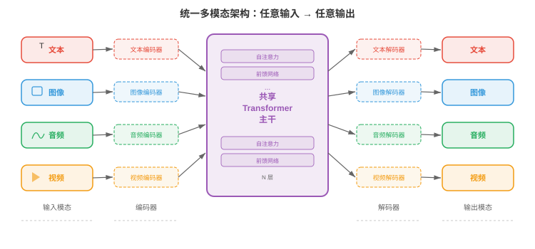
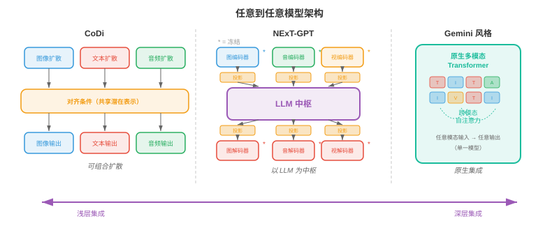
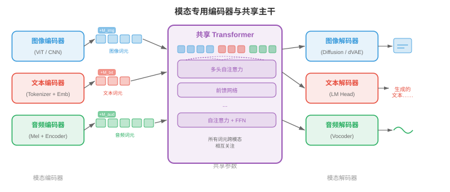
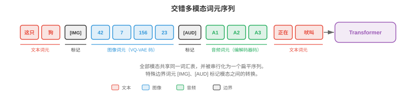
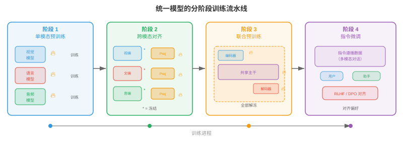
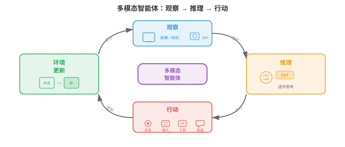
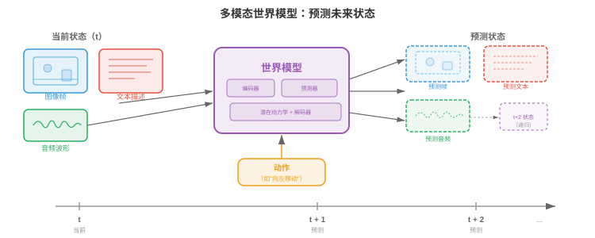

# 统一多模态架构

*统一多模态架构以单一系统替代相互独立的专用模型，使其能够跨文本、图像、音频和视频进行读取、推理与生成。本节涵盖任意到任意模型（CoDi、NExT-GPT）、原生多模态 LLM（Gemini、GPT-4o）、多模态词元化策略，以及统一化的架构权衡。*

## 为何需要统一

- 想象一位会说五种语言的译者，能在一句话中途不停顿地切换语言。早期多模态系统更像五位分别坐在不同房间的译者：各自处理一种语言，再通过墙缝传递纸条。**统一多模态架构（unified multimodal architecture）**则是那位通晓多语的人：一个共享权重的模型，在一次前向计算中跨文本、图像、音频、视频乃至动作进行读取、生成与推理。

- 统一化同时具有实践和理论动机。在实践上，为每一对模态，文生图、图生文、音生文等，分别维护专用模型会导致组合爆炸：$k$ 种模态最多需要 $k(k-1)$ 条有向流水线。统一模型将它们全部收拢为一个系统。在理论上，人类认知并不在彼此隔离的模块中处理视觉和语言；跨模态绑定发生得很早且很深入，统一化试图模拟这一点。

- 共享权重促进**跨模态迁移（transfer across modalities）**。已经学会文本时间模式，主语在动词前、原因在结果前的 Transformer，可以复用同一套注意力回路来学习视频中的时间模式，对象先出现再移动，或音频中的时间模式，起音先于延音。这是第 7 章语言模型微调和第 8 章 ImageNet 预训练中迁移学习的多模态对应物。

- 形式化地，令 $\mathcal{M} = \{m_1, m_2, \ldots, m_k\}$ 为模态集合。统一模型定义单一的参数化函数 $f_\theta$，将输入模态的任意子集映射到输出模态的任意子集：

$$f_\theta : \mathcal{P}(\mathcal{M}) \rightarrow \mathcal{P}(\mathcal{M})$$

- 其中 $\mathcal{P}(\mathcal{M})$ 是模态的幂集，即所有子集。关键约束是 $\theta$ 大部分由各模态共享，只有轻量的模态专用适配器层不同。



- 统一化的前景伴随着根本张力：各模态的结构不同。文本是一维离散词元序列；图像是二维连续像素值网格；音频是一维连续波形，其时间尺度与文本大不相同；视频又为图像增加时间轴。如何将这些异构结构调和为 Transformer 能处理的单一序列，是该领域的核心工程挑战。

## 任意到任意模型

- 想象一只通用遥控器，通过同一界面就能操作电视、空调和音响系统。**任意到任意模型（any-to-any models）**是其人工智能版本：它接受任意模态组合的输入，并产生任意模态组合的输出。

- **CoDi**（Composable Diffusion）先训练模态专用扩散模型，再以共享条件机制对齐它们的潜在空间，从而实现任意到任意生成。每种模态各有自己的扩散过程，参见本章第 04 节，但噪声预测网络都以联合交叉注意力层为条件；该层同时接收所有输入模态的嵌入。因此，CoDi 可以在一次计算中根据文本提示同时生成图像及与之匹配的音频。

- **NExT-GPT** 采用不同的架构路径。它以轻量的**投影层（projection layers）**，将作为“大脑”的 LLM 主干连接到输入侧的模态专用编码器和输出侧的模态专用解码器。输入编码器，如 CLIP 图像编码器和 CLAP 音频编码器，将每种模态转换到 LLM 的嵌入空间。LLM 对合并的词元序列推理，并输出特殊的“模态信号词元”，将信息路由给恰当的解码器，例如图像使用 Stable Diffusion，音频使用 AudioLDM。训练时只更新投影层，LLM 与专用编码器、解码器保持冻结。

- **Gemini**（Google DeepMind）从预训练起就是原生多模态的。不同于 NExT-GPT 的即插即用方法，Gemini 的 Transformer 从头在交错的文本、图像、音频和视频词元序列上训练。这使跨模态注意力模式在预训练中自然形成，而非事后拼装。模型对文本采用 SentencePiece 分词器，并学习类似本章第 03 节 VQ 方法的视觉词元器。

- **GPT-4o**，其中 “o” 表示 “omni”，代表另一种模式：所有模态共享同一个 Transformer 和同一个下一个词元预测目标的端到端模型。音频输入处理为频谱词元，图像处理为图块词元，文本处理为子词词元，全部输入同一序列。模型生成输出词元，再由模态专用头解码。其关键创新是移除了 GPT-4V 等早期系统依赖的 ASR、LLM、TTS 串联系统，因而实现低延迟。



- 这些模型处于不同集成深度构成的光谱上：

    - **浅层集成（shallow integration）**（NExT-GPT）：由训练过的适配器连接冻结专用模型。构建快，跨模态推理有限。
    - **中层集成（medium integration）**（CoDi）：跨模态专用生成器共享条件。对齐更好，但仍具模块化结构。
    - **深层集成（deep integration）**（Gemini、GPT-4o）：在所有模态上端到端训练一个模型。跨模态推理最丰富，训练成本也最高。

## 共享主干配合模态专用编码器与解码器

- 想象一家工厂只有一条装配线，共享主干，但原材料有不同的装卸口，编码器，成品有不同的发货部门，解码器。每个接口专门处理一种货物，但一旦进入工厂，所有内容都沿同一传送带流动。

- 统一模型主流架构采用以下三部分结构：

    - **模态编码器（modality encoders）** $E_m$：将模态 $m$ 的原始输入转换为嵌入向量序列 $\mathbf{h}_1^m, \mathbf{h}_2^m, \ldots, \mathbf{h}_{n_m}^m$，每个向量维度为 $d$。
    - **共享 Transformer 主干（shared transformer backbone）** $T_\theta$：用自注意力处理全部输入模态拼接或交错后的嵌入。
    - **模态解码器（modality decoders）** $D_m$：将主干输出的嵌入转换回模态 $m$ 的原生格式，如文本词元、图像像素和音频波形。

- 对文本，编码器通常是嵌入查找表 $E_\text{text}(w) = \mathbf{W}_e[w]$，其中 $w$ 是词元索引，与第 7 章 Transformer 中所见完全相同。对图像，编码器常为**视觉 Transformer（Vision Transformer，ViT）**：将图像切分为图块，再线性投影每个图块，见第 8 章。对音频，编码器先计算 mel 频谱图，再用卷积前端或音频频谱 Transformer（Audio Spectrogram Transformer，AST）处理，见第 9 章。

- 共享主干是一个标准 Transformer，对全部模态词元执行自注意力。给定拼接输入序列 $\mathbf{H} = [\mathbf{h}_1^{m_1}, \ldots, \mathbf{h}_{n_1}^{m_1}, \mathbf{h}_1^{m_2}, \ldots, \mathbf{h}_{n_2}^{m_2}]$，自注意力允许每个词元关注任意其他词元，而不受模态限制：

$$\text{Attention}(\mathbf{Q}, \mathbf{K}, \mathbf{V}) = \text{softmax}\left(\frac{\mathbf{Q}\mathbf{K}^\top}{\sqrt{d_k}}\right)\mathbf{V}$$

- 这与第 7 章的注意力公式相同，只是现在 $\mathbf{Q}$、$\mathbf{K}$、$\mathbf{V}$ 包含来自多种模态的词元。图像图块词元能够关注文本词元，从而无需单独的交叉注意力模块即可进行跨模态推理。

- 为使主干知道词元来自何种模态，会为每个词元加入**模态嵌入（modality embeddings）**。它类似位置嵌入，但编码的是模态身份而不是序列位置。将可学习向量 $\mathbf{e}_m \in \mathbb{R}^d$ 加到来自模态 $m$ 的每个词元：

$$\tilde{\mathbf{h}}_i^m = \mathbf{h}_i^m + \mathbf{e}_m + \mathbf{p}_i$$

- 其中 $\mathbf{p}_i$ 是位置 $i$ 的位置嵌入。



## 多模态词元化

- 想象你在写一封同时包含英文文字和手绘草图的信。你会先写一句话，画一张图，再写一句提及该图的话，随后贴上一段乐谱。这封信是交错了不同“模态”的单一线性流。多模态词元化正是如此：将文本、图像、音频、视频转换为单一扁平词元序列，供 Transformer 从左到右处理。

- 对文本，词元化已很成熟：第 7 章介绍的**字节对编码（byte-pair encoding，BPE）**或 SentencePiece 会产生子词词元词汇表。难点在于将此思想扩展到连续模态。

- 对图像，有两大路线。**离散（discrete）**路线使用 VQ-VAE 或 VQ-GAN，本章第 03 节详述，将每张图映射为码本索引序列。若码本有 $|\mathcal{C}|$ 个条目，图像编码为 $n$ 个码，则图像就成为从大小为 $|\mathcal{C}|$ 的词汇表中取出的 $n$ 个离散词元，可直接与文本词汇表兼容。**连续（continuous）**路线使用 ViT 或 CNN 编码器产生 $n$ 个连续嵌入向量，再线性投影到 Transformer 嵌入维度。Gemini 和 GPT-4o 使用连续路线的变体；Parti 和 LlamaGen 等自回归图像生成器更偏好离散路线。

- 对音频，信号通常先转换为 mel 频谱图，然后使用神经音频编解码器离散化，例如会产生分层离散词元的 EnCodec、SoundStream，或通过学习到的编码器连续投影。AudioLM 例如将音频表示为来自多个码本层级的离散词元序列，再用自回归方式建模。

- 对视频，词元化建立在图像词元化之上，但还必须压缩时间维。常见策略使用**三维 VQ-VAE（3D VQ-VAE）**，如 VideoGPT 或本章第 03 节的 Cosmos Tokeniser，将时空图块量化为离散词元。时间压缩率至关重要：未经激进时间下采样的 24 fps 原始视频每秒产生的词元远多于可承受范围。

- 全部模态词元化后，会以标记模态边界的特殊分隔词元**交错（interleaved）**到同一序列。典型格式如下：

```
[TEXT] The cat sits on a mat [/TEXT] [IMAGE] <img_tok_1> <img_tok_2> ... <img_tok_n> [/IMAGE] [AUDIO] <aud_tok_1> ... <aud_tok_m> [/AUDIO]
```

- Transformer 随后通过标准因果，或双向，注意力机制处理整个混合序列。模态分隔词元有双重作用：既告知模型模态边界，也作为“池化点”，其表示概括每段模态内容。



- 关键设计选择是**词元预算（token budget）**。一张被词元化为 256 个词元的图像与一段 50 词元的文本描述相比，图像占用的上下文窗口大 5 倍。模型必须平衡分辨率，词元更多意味着细节更多，和上下文长度，词元更多意味着内存与算力成本更高。**词元合并（token merging）**，逐步合并相似词元，和**自适应词元化（adaptive tokenisation）**，简单区域使用更少词元、复杂区域使用更多词元，能帮助处理这一权衡。

## 训练方案：分阶段预训练与联合微调

- 你不会在教会孩子算术前就教微积分。同样，不能从随机初始化开始，让统一多模态模型在全部模态上同时训练，并期待其良好收敛。主流做法是**分阶段训练（staged training）**：模型在精心安排的阶段中逐步学习更复杂的跨模态能力。

- **阶段 1：单模态预训练。**每个模态编码器均在大型单模态数据集上独立训练。与第 7 章相同，文本主干以标准语言建模目标，下一个词元预测，在万亿级文本词元上预训练。与第 8 章相同，视觉编码器在图像分类或自监督目标，如 MAE、DINO，上预训练。与第 9 章相同，音频编码器在语音识别或音频分类数据上预训练。这一阶段产生强大的单模态特征提取器。

- **阶段 2：跨模态对齐。**预训练编码器连接到共享主干，模型以配对多模态数据，图像-描述对、音频-转录文本对，和对比或生成目标训练。此阶段可冻结编码器权重以保留单模态知识，只更新投影层和主干。这里正是将本章第 01 节的 CLIP 风格对齐纳入统一模型的阶段。

- **阶段 3：联合多模态预训练。**解冻全部参数，或大部分参数，模型在单模态和多模态数据混合物上训练，对所有模态词元采用同一个下一个词元预测目标。损失函数为：

$$\mathcal{L} = -\sum_{t=1}^{T} \log p_\theta(x_t \mid x_{<t})$$

- 其中 $x_t$ 可以是文本词元、图像词元或音频词元。模型必须不论模态地学习预测下一个词元，这迫使它形成真正的跨模态理解。

- **阶段 4：指令微调与对齐。**在经过筛选、包含多模态指令的数据集上微调预训练模型，例如“详细描述这张图像”“这段视频发出什么声音”“生成一张 X 的图像”。此阶段常使用**基于人类反馈的强化学习（reinforcement learning from human feedback，RLHF）**或直接偏好优化（DPO），使模型输出与人类偏好对齐。

- **模态专用预热（modality-specific warm-up）**是在各阶段内防止模态坍塌的技术。若一种模态，通常是训练数据最多的文本，主导梯度信号，模型可能会“遗忘”较弱模态。预热策略包括：

    - **梯度平衡（gradient balancing）**：缩放每种模态的梯度，使其对参数更新的贡献相等。
    - **数据比例调度（data ratio scheduling）**：逐步提高多模态数据相对于单模态数据的比例。
    - **损失加权（loss weighting）**：赋予模态专用权重 $\lambda_m$，使总损失为 $\mathcal{L} = \sum_m \lambda_m \mathcal{L}_m$；调节 $\lambda_m$ 以平衡各模态的学习速率。



- **为何不能跳过阶段？**从头联合训练一切看似诱人，但实践中会失败，原因有三。第一，模型必须同时学习低层特征，如边缘检测、音素识别，和高层跨模态推理，二者学习动力学大不相同。第二，各模态数据分布极不平衡，万亿级文本词元、十亿级图像词元与数亿段音频片段数量悬殊。第三，优化景观高度非凸；分阶段训练提供课程，引导模型进入更好的盆地，类似第 6 章的课程学习思想。

## 多模态思维链推理

- 解几何题时，你可能先画图、标注角度、写出方程，再一步步求解。你不会从题干直接跳到答案。**多模态思维链（multimodal chain-of-thought，CoT）**推理让模型也能这样做：在得出最终答案前，生成可能涉及文本、视觉标注乃至生成图表的中间推理步骤。

- 在仅文本 CoT 中，第 7 章提示策略部分讨论过，模型用自然语言生成推理步骤序列。多模态 CoT 进一步允许中间步骤引用或生成视觉内容。例如，给定一张图表和问题“哪一年的销售额最高？”，多模态 CoT 模型可能先描述图表，“图表展示 2018 至 2023 年的销售额……”，再识别相关视觉特征，“最高的柱似乎在 2021 年……”，最后输出答案，“2021”。

- 形式化地，令 $\mathbf{x}$ 为多模态输入，$y$ 为目标答案。标准模型直接预测 $p(y \mid \mathbf{x})$。思维链引入中间推理 $\mathbf{r} = (r_1, r_2, \ldots, r_L)$，并将预测分解为：

$$p(y \mid \mathbf{x}) = \sum_{\mathbf{r}} p(y \mid \mathbf{r}, \mathbf{x}) \cdot p(\mathbf{r} \mid \mathbf{x})$$

- 实践中，在推理链上使用贪心或束搜索解码来近似该求和。推理步骤 $r_i$ 可以是文本词元、对图像区域的引用，甚至是生成的视觉词元，例如叠加在输入图像上的边界框标注。

- **训练多模态 CoT（training multimodal CoT）**通常需要整理包含人工标注者逐步多模态推理轨迹的数据集，再用这些轨迹微调模型。一些方法从更大的教师模型蒸馏 CoT 能力：教师为大型数据集生成推理轨迹，较小的学生模型同时在输入与教师轨迹上训练。

- 多模态 CoT 对需要**空间推理（spatial reasoning）**的任务格外有效，例如“红球是否在蓝色立方体左边？”；也适用于**图表上的数学推理（mathematical reasoning over diagrams）**，如几何题，以及答案依赖合并图像多个区域信息的**多步视觉问答（multi-step visual question answering）**。

## 多模态智能体

- 想象厨房中的机器人厨师。它看台面上的食材，视觉；读平板上的食谱，文本；听计时器鸣叫，音频；然后实际拿起刀切洋葱，动作。**多模态智能体（multimodal agent）**是它的数字版本：模型通过多种模态感知世界，推理该做什么，并基于感知采取行动。

- 智能体循环遵循经典的**观察-推理-行动（observe-reason-act）**周期：

    1. **观察（observe）**：智能体从环境接收多模态输入，例如截图、用户口头指令、视频流。
    2. **推理（reason）**：统一模型处理多模态输入，并可能利用思维链规划步骤序列。
    3. **行动（act）**：模型输出动作，例如文本回复、工具调用、坐标 $(x, y)$ 上的鼠标点击或机器人电机指令。

- **工具使用（tool use）**是多模态智能体的一项关键能力。模型学习识别何时无法直接回答问题，必须改用外部工具，例如计算器、代码解释器、浏览器或搜索引擎。模型在输出词元序列中生成结构化工具调用，例如 `search("current weather in London")`；系统执行调用，结果作为额外输入词元反馈给模型处理。

- **视觉落地（visual grounding）**将语言连接到图像或视频中的特定区域。当智能体说“点击右上角的蓝色按钮”时，必须将“右上角的蓝色按钮”这一短语落地到像素坐标。架构上，可训练模型把边界框坐标输出为特殊词元，或让模型在图像上产生指示被指区域的热力图。这将本章第 02 节视觉语言模型中讨论的落地与指代工作扩展到动作领域。

- WebVoyager、SeeAct 等**网页智能体（web agents）**展示了多模态智能体如何浏览网站。智能体接收网页截图，识别交互元素，按钮、文本框、链接，并输出点击、输入、滚动等动作来完成用户指定目标。关键挑战是巨大的动作空间：典型网页可能有数百个可点击目标。



- **具身智能体（embodied agents）**将其扩展到物理环境。配有摄像头和麦克风的机器人接收视觉与音频输入，通过统一模型处理，再输出电机命令。PaLM-E（Google）等项目将机器人传感器数据直接嵌入语言模型词元序列，使机器人能将“拿起碗旁边的绿色方块”等指令落地到视觉观察，并生成一系列电机动作。

- 智能体训练方案在标准分阶段预训练之上增加**强化学习（reinforcement learning，RL）**阶段。智能体与环境，模拟桌面、浏览器或机器人模拟器，交互；因完成任务获得奖励，并使用 PPO、REINFORCE 等算法更新策略。奖励信号通常是稀疏的，任务成功为 1，否则为 0，因此优化困难且高度依赖多模态预训练提供的强先验。

## 基准与评估

- 评估能够看、听、读、行动的模型，需要一组多样化基准。没有单一指标能刻画多模态能力，因此该领域依赖一系列专门评估。

- **MMLU**（Massive Multitask Language Understanding）测试 57 个学科的知识。它最初只含文本，但可作为基线：统一多模态模型获得视觉能力后，不应失去仅文本性能。多模态训练后 MMLU 降低，意味着灾难性遗忘。

- **MMBench** 在 20 个细粒度能力维度上评估视觉语言理解，包括属性识别、空间关系理解和 OCR。每个问题给出一张图像与一道多选题。该基准系统性检验模型是否真正理解图像，还是依赖仅文本的捷径。

- **SEED-Bench** 提供 19,000 道多选题，覆盖图像和视频理解的 12 个评估维度。它专门测试时间理解，给定帧前后发生了什么，和组合推理，结合多个视觉属性。

- **MM-Vet** 通过要求模型在一个问题中同时使用多种技能来评估集成多模态能力，包括识别、OCR、空间感知、语言生成与知识检索。

- **MathVista** 测试基于视觉输入的数学推理：几何图、统计图表、函数图像和科学图。该基准专门面向多模态思维链能力。

- AVQA（Audio-Visual Question Answering）等**视听基准（audio-visual benchmarks）**检验模型能否对所见与所闻的关系推理。例如：“说话的人在左边还是右边？”

- WebArena、OSWorld、SWE-bench 等**智能体基准（agent benchmarks）**评估在交互环境中的任务完成情况。指标通常是成功率：智能体正确完成了多少比例的任务？这些基准特别困难，因为它们要求长时程规划和错误恢复。

- LMSYS Chatbot Arena 等**整体评估（holistic evaluation）**框架以正面对比形式使用人类偏好判断。两个模型看到同一多模态输入，由人类评委选择较好的回答。数千次此类对比可计算 Elo 评分，得到与整体模型质量高度相关的单一标量。

- 多模态评估中持续存在的挑战是**数据污染（data contamination）**：模型在互联网规模数据上训练，基准图像和题目可能已出现在训练集中。仔细去重并构建留出测试集是必要但并不完美的防护措施。

## 世界模型

- 想象闭上眼睛，设想将玻璃杯推下桌边会发生什么。你“看见”它下落，“听见”碎裂，并“感觉”这不是好主意。你的大脑正在运行一个**世界模型（world model）**：对环境物理与因果结构的内部模拟，能跨多种模态预测未来状态。

- 在人工智能语境中，世界模型是一个学习到的函数：根据当前状态和一个动作，预测世界的下一个状态：

$$\hat{s}_{t+1} = g_\phi(s_t, a_t)$$

- 其中 $s_t$ 是当前状态表示，可能包括视觉、听觉和本体感觉信息；$a_t$ 是动作；$\hat{s}_{t+1}$ 是预测的下一状态。状态 $s_t$ 位于学习到的潜在空间而非原始像素空间中，使预测问题可处理。

- Sora（OpenAI）、Genie（Google DeepMind）等**视频预测模型（video prediction models）**是迈向世界模型的重要一步。它们学习根据文本提示和/或动作序列生成时间连贯的视频帧。它们常被视为视频生成器，但其底层能力更接近世界模拟：模型已内化足够的物理知识，重力、碰撞、遮挡、流体动力学，来渲染可信的未来。

- 这与多模态架构紧密相关。只预测像素的世界模型能力有限；真正有用的世界模型应跨模态预测。若你推倒玻璃杯，世界模型应预测视觉轨迹，玻璃杯下落；听觉事件，玻璃碎裂；语义后果，地上出现碎玻璃。统一多模态架构天然适合作为世界模型，因为它们已在共享空间中表示全部模态。

- 形式化地，多模态世界模型优化：

$$\mathcal{L}_\text{world} = \mathbb{E}\left[\sum_{m \in \mathcal{M}} \lambda_m \| s_{t+1}^m - g_\phi^m(s_t, a_t) \|^2 \right]$$

- 其中 $s_{t+1}^m$ 是模态 $m$ 的真实下一状态表示，$g_\phi^m$ 是世界模型的模态专用预测头。共享潜在动力学 $g_\phi$ 在联合多模态空间中运行，模态专用头则将预测解码为各模态的原生格式。



- Yann LeCun 提出的 **JEPA**（Joint Embedding Predictive Architecture）为世界模型提供了一个避开像素级预测缺陷的框架。JEPA 不预测原始像素，原始像素会将容量浪费在精确纹理等无关细节上，而是在嵌入空间预测。模型学习将观察映射到嵌入的编码器，以及预测未来嵌入的预测器：

$$\hat{\mathbf{z}}_{t+1} = h_\psi(\mathbf{z}_t, a_t), \quad \mathbf{z}_t = \text{Enc}(s_t)$$

- 损失比较嵌入而非原始观察，对感知混叠更稳健：许多不同像素配置可能表示同一语义状态。该方法对多模态世界模型特别有前景，因为它天然在统一架构已经提供的共享嵌入空间中运行。

- 世界模型有超越学术兴趣的实际应用。在**基于模型的强化学习（model-based reinforcement learning）**中，智能体先用世界模型“想象”动作后果，再采取动作，从而显著减少所需的真实世界交互次数，回顾第 11 章对基于模型 RL 的讨论。在**自动驾驶**中，世界模型根据不同转向决策预测未来数秒的场景演化。在**机器人学**中，世界模型让机器人在执行前在内部演练操作序列。

- 世界模型研究前沿正走向**交互式世界模型（interactive world models）**：它们实时运行、响应任意用户动作，本质上成为完全从数据中学习到的通用模拟器。Genie 2（Google DeepMind）在三维环境中展示了这一点：给定一张图像，它会生成用户可探索、可控制的交互式 3D 世界。世界模型与统一多模态架构的汇合预示着这样的未来：一个模型能跨全部模态感知、预测、模拟和行动。

## 编码练习（使用 CoLab 或 notebook）

**练习 1：构建最小多模态词元交错器**

- 编写一个函数，接收文本字符串和一个虚拟“图像”，即一个小型二维数组，将它们的词元化表示交错为带有模态嵌入的单一扁平序列。

```python
import jax
import jax.numpy as jnp

# Simulate multimodal tokenisation: text tokens + "image patch" tokens
def interleave_modalities(text_tokens, image_patches, embed_dim=32, key=jax.random.PRNGKey(0)):
    """Interleave text and image tokens with learned modality embeddings."""
    k1, k2, k3 = jax.random.split(key, 3)
    n_text = text_tokens.shape[0]
    n_img = image_patches.shape[0]
    # Random projection matrices (stand-ins for real encoders)
    W_text = jax.random.normal(k1, (text_tokens.shape[-1], embed_dim)) * 0.02
    W_img = jax.random.normal(k2, (image_patches.shape[-1], embed_dim)) * 0.02
    # Modality embeddings: one for text, one for image
    mod_emb = jax.random.normal(k3, (2, embed_dim)) * 0.02
    text_embs = text_tokens @ W_text + mod_emb[0]  # (n_text, embed_dim)
    img_embs = image_patches @ W_img + mod_emb[1]   # (n_img, embed_dim)
    # Interleave: [IMG] tokens first, then [TEXT] tokens (like LLaVA)
    combined = jnp.concatenate([img_embs, text_embs], axis=0)
    print(f"Combined sequence: {n_img} image + {n_text} text = {combined.shape[0]} tokens")
    return combined

# Try it: 5 text tokens (dim 16) and 4 image patches (dim 64)
text = jax.random.normal(jax.random.PRNGKey(1), (5, 16))
image = jax.random.normal(jax.random.PRNGKey(2), (4, 64))
seq = interleave_modalities(text, image)
# Experiment: change embed_dim, swap the interleaving order, add a third modality
```

**练习 2：可视化跨模态注意力模式**

- 创建一个合成多模态序列并计算自注意力得分，观察图像词元如何关注文本词元，反之亦然。

```python
import jax
import jax.numpy as jnp
import matplotlib.pyplot as plt

def cross_modal_attention(n_text=6, n_img=4, d=32, key=jax.random.PRNGKey(42)):
    """Compute and visualise attention between text and image tokens."""
    k1, k2, k3 = jax.random.split(key, 3)
    # Simulate token embeddings for two modalities
    text_embs = jax.random.normal(k1, (n_text, d))
    img_embs = jax.random.normal(k2, (n_img, d))
    seq = jnp.concatenate([img_embs, text_embs], axis=0)  # (n_img+n_text, d)
    # Learned Q, K projections
    Wq = jax.random.normal(k3, (d, d)) * 0.1
    Wk = jax.random.normal(jax.random.PRNGKey(99), (d, d)) * 0.1
    Q, K = seq @ Wq, seq @ Wk
    scores = Q @ K.T / jnp.sqrt(d)
    attn = jax.nn.softmax(scores, axis=-1)
    # Plot
    labels = [f"img_{i}" for i in range(n_img)] + [f"txt_{i}" for i in range(n_text)]
    fig, ax = plt.subplots(figsize=(7, 6))
    ax.imshow(attn, cmap="viridis")
    ax.set_xticks(range(len(labels))); ax.set_xticklabels(labels, rotation=45, fontsize=8)
    ax.set_yticks(range(len(labels))); ax.set_yticklabels(labels, fontsize=8)
    ax.set_xlabel("Key (attended to)"); ax.set_ylabel("Query (attending from)")
    ax.set_title("Cross-modal self-attention map")
    plt.colorbar(ax.images[0], ax=ax, shrink=0.8)
    plt.tight_layout(); plt.show()

cross_modal_attention()
# Experiment: increase d, add a causal mask, observe how attention patterns change
```

**练习 3：使用模态专用损失加权模拟分阶段训练**

- 演示模态专用损失权重如何影响一个玩具多模态训练循环。观察平衡损失如何防止某一种模态占主导。

```python
import jax
import jax.numpy as jnp
import matplotlib.pyplot as plt

def staged_training_sim(steps=200, key=jax.random.PRNGKey(7)):
    """Simulate multimodal training with adjustable modality loss weights."""
    # Two 'modalities' with different loss scales (text loss ~10x larger than image loss)
    losses_text, losses_img = [], []
    param = jnp.array([0.0, 0.0])  # Shared param updated by both modality losses
    lr = 0.05
    # Try changing these weights to see the effect on convergence balance
    lambda_text, lambda_img = 1.0, 5.0  # upweight the weaker modality

    for step in range(steps):
        k1, k2, key = jax.random.split(key, 3)
        noise_t = jax.random.normal(k1, ()) * 0.3
        noise_i = jax.random.normal(k2, ()) * 0.1
        loss_t = (param[0] - 3.0) ** 2 + noise_t  # text target = 3.0
        loss_i = 0.1 * (param[1] - 1.0) ** 2 + noise_i  # image target = 1.0 (smaller scale)
        # Weighted combined gradient
        grad_t = lambda_text * 2 * (param[0] - 3.0)
        grad_i = lambda_img * 0.2 * (param[1] - 1.0)
        param = param - lr * jnp.array([grad_t, grad_i])
        losses_text.append(float(loss_t)); losses_img.append(float(loss_i))

    fig, ax = plt.subplots(figsize=(8, 4))
    ax.plot(losses_text, label=f"Text loss (weight={lambda_text})", alpha=0.7)
    ax.plot(losses_img, label=f"Image loss (weight={lambda_img})", alpha=0.7)
    ax.set_xlabel("Training step"); ax.set_ylabel("Loss"); ax.legend()
    ax.set_title("Modality loss balancing during staged training")
    plt.tight_layout(); plt.show()

staged_training_sim()
# Experiment: set lambda_img=1.0 and watch image loss converge much slower
```
