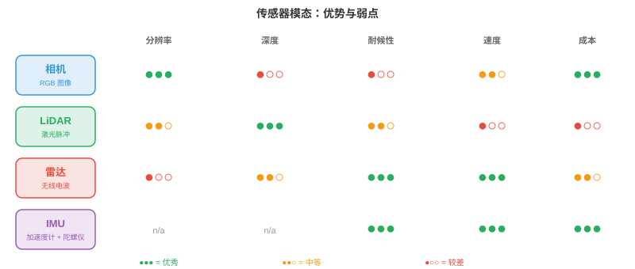
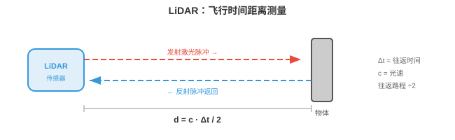
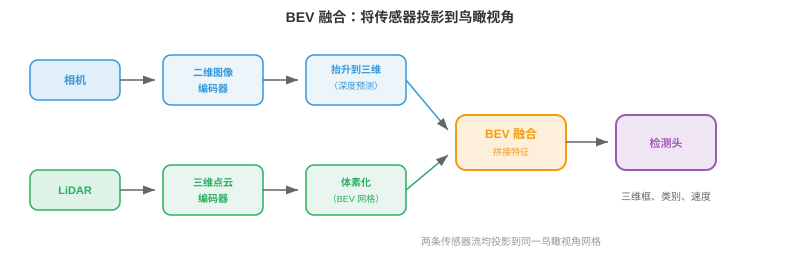
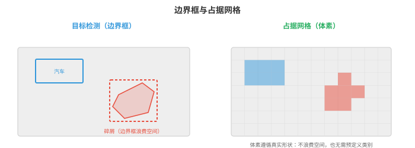

# 感知

*感知是自主系统感受并解释物理世界的方式。本节涵盖传感器模态、标定、传感器融合、三维目标检测、深度估计、占据网络、车道检测和语义地图，它们构成每台机器人、无人机和自动驾驶汽车所依赖的感官基础。*

- 对人类而言，感知世界毫不费力：你看见一辆车驶近，听见发动机，感到脚下地面，并立即建立周遭环境的心理模型。自主系统也必须完成同样的事，只是用电子传感器和算法取代眼睛和耳朵。

!!! note "大白话"
    人会自然把看到、听到和感觉到的信息合成对周围的判断。自主系统也要做这件事，只是它的眼睛、耳朵和大脑分别是传感器与算法。

- 根本挑战在于：传感器给出原始数值，像素强度、点云、信号反射，系统必须把它们转化为结构化理解：“前方 12 米处有一名行人，正以 1.5 m/s 向左移动。”这就是感知问题。

!!! note "大白话"
    传感器不会直接说“这里有人”，只会给出数字。感知的工作就是把这些数字翻译成位置、类别和运动状态。

- 一切下游任务，预测、规划、控制，都依赖感知。规划器再完美、感知再差的自动驾驶汽车仍会撞车。感知是瓶颈。

!!! note "大白话"
    后面的规划再聪明，也救不了前面看错路况的系统。感知错了，整个决策链都会建立在错误事实上。

## 传感器模态

- 自主系统使用多种传感器，每一种都有不同优势和失效模式。任何单一传感器都不足以独立胜任。

!!! note "大白话"
    没有一种传感器既看得清、测得准、全天候又便宜。实际系统靠多种传感器互相补短板。



- **相机（cameras）**以高分辨率捕获稠密色彩信息。一张图像包含数百万像素，每个像素记录 RGB 值，见第 8 章。相机便宜、轻巧，提供丰富纹理和颜色信息，对读取标志、检测红绿灯和识别物体至关重要。

!!! note "大白话"
    相机最像人的眼睛，特别擅长分辨颜色、文字和外观，但它看到的是平面图像，不会直接告诉系统物体有多远。

- 相机类型包括**单目（monocular）**，单镜头、没有原生深度；**双目（stereo）**，两个镜头以基线间距分开，通过视差得到深度，见第 8 章；以及**鱼眼（fisheye）**，超宽视场，180° 以上，径向畸变严重，用于环视泊车系统。

!!! note "大白话"
    单目便宜但难判断距离；双目像两只眼睛，可利用左右差异估距离；鱼眼能看得很广，却会把直线拍弯。

- 相机的主要弱点是投影时丢失深度信息。三维场景通过针孔相机模型映射到二维图像平面，回顾第 8 章的内参矩阵 $K$：

$$\begin{bmatrix} u \\ v \\ 1 \end{bmatrix} = \frac{1}{Z} K \begin{bmatrix} X \\ Y \\ Z \end{bmatrix}$$

!!! note "大白话"
    三维世界被拍成二维照片时，远近会被压扁。公式里的除以 $Z$ 正是把深度信息折叠进平面投影的原因。

- 对 $Z$ 的除法丢弃绝对深度。不同距离处、大小不同的两个对象可能产生相同投影。单幅图像恢复深度是病态问题，因此需要双目相机或学习到的单目深度模型。

!!! note "大白话"
    一张照片里的小近物体和大远物体可能看起来一样大，所以仅看单张图无法唯一确定距离。

- 相机在不良条件下也很吃力：直射阳光会产生眩光，黑暗会降低信号，雨或雾会散射光线。

!!! note "大白话"
    相机依赖光线。逆光、夜晚和坏天气都会让画面信息变少或变乱，这也是它不能单独承担安全任务的原因。

- **LiDAR**（Light Detection and Ranging，激光雷达）发射激光脉冲并测量每个脉冲返回所需时间。光以已知速度传播，$c \approx 3 \times 10^8$ m/s，因此每个反射点的距离为：

$$d = \frac{c \cdot \Delta t}{2}$$

!!! note "大白话"
    LiDAR 像不断发出激光“喊话”再听回声。已知光速和往返时间，就能直接算出物体距离。


- 系数 2 计入来回路程。通过在场景中扫描激光，LiDAR 构建**点云（point cloud）**：三维坐标 $(x, y, z)$ 的集合，通常还带有强度，即反射率，值。

!!! note "大白话"
    激光要先到物体再返回，所以时间对应的是两倍距离。许多测到的三维点拼起来，就是点云这张立体“骨架图”。

- **旋转式 LiDAR（spinning LiDAR）**，如 Velodyne，将激光阵列旋转 360°，生成完整环视图。典型设备通过 64 至 128 条垂直通道，每秒产生 30 万以上点。结果是稀疏但几何精确的场景三维表示。

!!! note "大白话"
    旋转式 LiDAR 像一盏不断转圈扫描的激光灯，可以看周围一整圈；点没有相机像素多，但每个点的距离通常很准。

- **固态 LiDAR（solid-state LiDAR）**没有运动部件，改用光学相控阵或 MEMS 反射镜。这使其更便宜、更紧凑、更可靠，但通常视场更窄，120° 对 360°。

!!! note "大白话"
    固态 LiDAR 去掉机械转动部件，因而更容易量产和维护；代价通常是看不到完整一圈环境。

- LiDAR 提供精确深度，但数据稀疏，比相机“像素”少得多；没有颜色信息，且价格昂贵。在暴雨、雪或灰尘中，粒子会散射激光脉冲，其性能也会下降。

!!! note "大白话"
    LiDAR 很会量距离，却不擅长看颜色和细节，而且贵、怕恶劣天气。它是重要传感器，不是万能传感器。

- **雷达（Radar，Radio Detection and Ranging）**与 LiDAR 基于相同的飞行时间原理，但使用无线电波，汽车通常为 77 GHz 毫米波。无线电波穿透雨、雾、尘和雪的能力远优于光，因此雷达是最耐候的传感器。

!!! note "大白话"
    雷达和 LiDAR 都靠发射再接收信号测距离，但无线电波更能穿过雨雾，所以坏天气时雷达特别可靠。

- 雷达还可通过多普勒效应直接测量**速度（velocity）**。物体向传感器靠近时，反射波被压缩，频率变高；远离时被拉伸，频率变低。速度为：

$$v = \frac{\Delta f \cdot c}{2 f_0}$$

!!! note "大白话"
    接近的物体让回波频率变高，远离的物体让频率变低。雷达能直接从这种变化读出相对速度，不必先连续跟踪多帧。

- 其中 $\Delta f$ 是频移，$f_0$ 是发射频率。这无需跟踪或逐帧计算就能得到瞬时径向速度。

!!! note "大白话"
    这里测到的是沿着雷达视线靠近或远离的速度。它能很快知道前车是不是在逼近，但不一定知道完整的横向运动。

- 代价是分辨率：雷达的角分辨率远低于相机或 LiDAR，难以区分相邻物体或检测精细细节。它擅长在任何天气下远距离，200 米以上，检测车辆。

!!! note "大白话"
    雷达能在很远很差的天气里发现目标，却容易把挨得很近的两个物体看成一团，因此常要和相机、LiDAR 配合。

- **超声波传感器（ultrasonic sensors）**发射高频声脉冲，40 至 70 kHz，并测量回波返回时间。它们在极近距离，0.2 至 5 米，工作，主要用于泊车辅助。其物理原理与 LiDAR 相同，只是以声音代替光，因此 $d = \frac{v_{\text{sound}} \cdot \Delta t}{2}$，其中 $v_{\text{sound}} \approx 343$ m/s。

!!! note "大白话"
    超声波也是测回声，但只适合很近距离。停车时它能提醒你离墙还有多远，却不能用来远距离看路。

- **IMU**（Inertial Measurement Unit，惯性测量单元）包含加速度计和陀螺仪，分别测量线加速度和角速度。IMU 提供高频运动数据，通常为 200 至 1000 Hz，填补较慢传感器更新之间的空档。它们不直接感知环境，而是跟踪机器人自身运动，因此对航位推算和状态估计不可或缺。

!!! note "大白话"
    IMU 不看外界，而是感受自己在加速、转弯还是倾斜。它更新极快，可在相机和 LiDAR 两次扫描之间持续估计自身运动。

- IMU 存在**漂移（drift）**：微小测量误差随时间累积，使估计位置偏离真实位置。因此，IMU 几乎总是与其他传感器，相机、GPS、LiDAR，融合，而非单独使用。

!!! note "大白话"
    只靠 IMU 一直积分，小误差会越积越大，像闭眼走路会慢慢偏离方向。它需要外部传感器定期把位置拉回来。

- **GNSS**（Global Navigation Satellite Systems，全球导航卫星系统，含 GPS）通过对多颗卫星信号三角定位，提供地球表面的绝对位置。标准 GPS 精度为 2 至 5 米，不足以支持车道级驾驶。**RTK-GPS**（Real-Time Kinematic，实时动态定位）使用固定基站纠正误差，达到厘米级精度，但需要清晰天空视野和基站基础设施。

!!! note "大白话"
    普通 GPS 能告诉你大致在哪，却不够精确到分清哪条车道。RTK 用基站校正后能精确很多，但在高楼、隧道或遮挡环境会受限。

## 传感器标定

- 传感器协同前必须进行**标定（calibrated）**：每个传感器的测量都必须关联到同一坐标系。

!!! note "大白话"
    多个传感器各自说自己的坐标语言。标定就是让它们先统一“左、右、前、后”和时间，才能把数据叠在一起。

- **内参标定（intrinsic calibration）**确定传感器内部参数。对于相机，这包括焦距、主点和畸变系数，见第 8 章；对于 LiDAR，这包括激光束之间精确的角度偏移。常见方法是 Zhang 棋盘格标定：从多个角度观察已知平面图案，求解内参矩阵。

!!! note "大白话"
    内参是在弄清每个传感器自身怎样成像或测量，例如镜头有多广、有没有畸变。棋盘格提供了已知形状，方便反推出这些参数。

- **外参标定（extrinsic calibration）**确定两个传感器之间的刚体变换，旋转 $R$ 和平移 $\mathbf{t}$。若相机和 LiDAR 安装在同一车辆上，外参标定会找出将 LiDAR 坐标中的点映射到相机坐标的 $4 \times 4$ 变换矩阵：

$$\mathbf{p}_{\text{cam}} = \begin{bmatrix} R & \mathbf{t} \\ \mathbf{0}^T & 1 \end{bmatrix} \mathbf{p}_{\text{lidar}}$$

!!! note "大白话"
    外参是在弄清传感器彼此装在哪里、朝哪里。这个矩阵把 LiDAR 看到的点转成相机也能理解的位置。

- 这是齐次坐标中的仿射变换，正是第 2 章研究的线性变换类型。矩阵错误会使 LiDAR 点投影到错误像素，整个融合流水线都会失效。

!!! note "大白话"
    外参哪怕差一点，点云和照片也会对不齐，系统可能把远处点错贴到行人或车辆上，融合结果就不可信。

- **时间标定（temporal calibration）**同步传感器时钟。以 30 Hz 捕获的相机和以 10 Hz 运行的 LiDAR 会在不同时间戳产生数据。若汽车以 30 m/s，即高速公路速度，行驶，10 ms 的计时误差对应 30 cm 的空间误差。硬件触发，共享时钟脉冲，或软件同步，时间戳之间插值，都必不可少。

!!! note "大白话"
    除了空间对齐，传感器还必须在同一时刻说话。高速行驶时只差 10 毫秒，物体位置就可能错开 30 厘米。

## 传感器融合

- 没有单一传感器覆盖全部条件。相机看见颜色和纹理，却丢失深度；LiDAR 精确测量深度，却稀疏且没有颜色；雷达适应任何天气，却分辨率差。**传感器融合（sensor fusion）**结合它们的长处，补偿各自弱点。

!!! note "大白话"
    融合不是简单把数据堆一起，而是让相机负责认外观、LiDAR 负责量距离、雷达负责恶劣天气和速度。

- **早期融合（early fusion）**，或数据层融合，在任何处理之前结合原始传感器数据。例如，把 LiDAR 点投影到相机图像上以创建 RGBD 表示，每个像素包含颜色和深度；或把每个 LiDAR 点涂成其投影到的相机像素颜色。这保留最多信息，但需要精确标定，且对错位敏感。

!!! note "大白话"
    早期融合最早就把原始信息结合，细节最多，但也最怕标定误差。一点错位会让颜色和距离贴错对象。

- **后期融合（late fusion）**，或决策层融合，让每个传感器通过自己的检测流水线独立处理，再合并最终输出，边界框、类别标签、置信度得分。各传感器投票，融合模块协调分歧。这更简单、模块化程度更高，但每条流水线不能从另一传感器的原始数据受益。

!!! note "大白话"
    后期融合像让每个专家先独立下结论，再开会投票。实现稳妥，但错过了从其他传感器原始细节中互相帮助的机会。

- **中层融合（mid-level fusion）**在中间特征表示上操作。每个传感器原始数据先被编码到学习到的特征空间，使用 CNN 或 Transformer，再合并特征。这是现代系统的主流方法，因为网络可以学习从每个模态提取什么。

!!! note "大白话"
    中层融合先让每个传感器各自提炼重点，再把提炼后的信息合并。它在细节利用和工程稳定性之间比较平衡。



- **BEVFusion** 是具有代表性的中层融合架构。它将相机特征和 LiDAR 特征都投影到共同的**鸟瞰视角（bird's-eye-view，BEV）**表示，即场景的俯视网格。相机特征使用预测的深度分布“抬升”到三维，再散布到 BEV 网格上。LiDAR 特征本身已是三维，直接体素化到同一网格。融合后的 BEV 特征再由检测头处理。

!!! note "大白话"
    BEVFusion 把相机和 LiDAR 都换算到同一张俯视地图上。这样两个传感器描述的是同一个地面位置，合并就容易得多。

- BEV 表示之所以强大，是因为它提供统一的度量尺度坐标系，空间推理，距离、大小、重叠，变得直接。在相机图像中，近处自行车与远处卡车可能占用相同像素数；在 BEV 中，它们的真实大小和位置很清楚。

!!! note "大白话"
    俯视图把透视带来的“近大远小”问题减弱了。车、行人和道路都落在真实尺度的网格里，距离和是否碰撞更好判断。

## 三维目标检测

- 感知的核心任务是在三维中检测物体：它们在哪里、多大、是什么、朝向哪里？每个检测结果都是一个**三维边界框（3D bounding box）**，包含位置 $(x, y, z)$、尺寸 $(l, w, h)$、航向角 $\theta$、类别标签和置信度得分。

!!! note "大白话"
    一个三维检测框不仅要圈出物体，还要告诉系统它在什么位置、多大、朝哪边和系统有多确定。

- **基于 LiDAR 的检测（LiDAR-based detection）**直接在点云上操作。难点是点云无序、不规则、密度不一，近处物体有数千点，远处物体只有少量点。回顾第 8 章，PointNet 以共享 MLP 和置换不变聚合，最大池化，处理这一问题。

!!! note "大白话"
    点云不像照片那样有整齐像素格，远处还更稀疏。PointNet 这类方法要能不依赖点的排列顺序，从杂乱点集里认出物体。

- **PointPillars** 将地面离散为垂直柱体，pillars，网格，进而把点云转换为结构化表示。每根柱内所有点由小型 PointNet 编码为固定大小特征向量。结果是一张二维伪图像，可由标准二维 CNN 主干处理，随后接检测头，如第 8 章 SSD 架构。该方法快速且有效。

!!! note "大白话"
    PointPillars 把地面切成很多竖直格子，把每格里的点压成一个特征。这样点云就变得像二维图片，可以直接借用成熟 CNN。

- **CenterPoint** 将物体作为点而不是框来检测。它在 BEV 中预测物体中心热力图，再在每个峰值处回归边界框属性，大小、高度、朝向、速度。这是第 8 章 CenterNet 的三维对应物：无锚框、训练时无需 NMS，并且通过跨帧关联中心点可自然扩展到跟踪。

!!! note "大白话"
    CenterPoint 先找每个物体中心在哪里，再从中心补出大小和朝向。先找点比一开始枚举大量候选框更简洁。

- **仅相机三维检测（camera-only 3D detection）**必须从二维图像推断深度，在根本上更难。BEVDet、BEVFormer 等现代方法用 Transformer 架构将二维图像特征“抬升”到三维。BEVFormer 使用空间交叉注意力：BEV 查询关注投影到每台相机图像上的特定三维参考点，从相关位置提取特征。

!!! note "大白话"
    只用相机没有直接距离尺，模型必须根据外观和多视角猜三维位置。BEVFormer 让俯视图中的每个位置去多台相机里找对应证据。

- 基于 LiDAR 与基于相机三维检测之间的精度差距正迅速缩小，推动因素是更好的深度估计、更大的模型和时间融合，利用多帧累积深度线索，类似双目匹配但沿时间进行。

!!! note "大白话"
    相机方案会利用更强模型和连续多帧的视角变化补回深度线索，因此正在逐渐追上 LiDAR 方案。

## 深度估计

- 深度估计是为每个像素或点赋予距离值的问题。

!!! note "大白话"
    深度估计就是给画面里的每个位置补上一把距离尺，让系统知道哪里近、哪里远。

- **双目匹配（stereo matching）**使用两个以已知基线 $b$ 分开的相机。同一个三维点在两张图像中出现在略有不同的水平位置，即**视差（disparity）** $d$。深度计算为，第 8 章已介绍：

$$Z = \frac{f \cdot b}{d}$$

!!! note "大白话"
    左右相机看到同一物体的位置差越大，物体通常越近。已知两相机间距和焦距，就能由这个差算距离。

- 其中 $f$ 是焦距。挑战是找出两张图像间正确的对应，尤其在无纹理区域、遮挡和重复图案中。RAFT-Stereo 等现代双目网络使用相关体进行迭代细化。

!!! note "大白话"
    双目的难点不是公式，而是确认左图这个像素在右图到底对应哪里。墙面、阴影和重复图案都会让匹配变得含糊。

- **单目深度估计（monocular depth estimation）**从单张图像预测深度。因为该问题是病态的，无限多个三维场景都可产生同一图像，网络必须学习统计先验：“地面是平的”“物体随距离变小”“纹理梯度表示远去的表面”。

!!! note "大白话"
    单目深度没有几何上的唯一答案，只能靠从大量图像学到的常识来猜远近，例如远处物体更小、地面通常向前延伸。

- **Depth Anything**，第 8 章已介绍，先在海量无标签数据集上自监督训练，再在有标签数据上微调，从而实现强大的单目深度。关键洞见是尺度不变损失能处理内在歧义：模型预测相对深度，即排序，而非绝对米数。

!!! note "大白话"
    对单张图来说，“谁比谁远”往往比“准确多少米”更可靠。尺度不变训练让模型先把深浅顺序判断好。

- **LiDAR-相机深度融合（LiDAR-camera depth fusion）**将稀疏 LiDAR 深度测量投影到相机图像上作为监督。网络学习“填补”稀疏点之间空缺，生成结合 LiDAR 精度与相机分辨率的稠密深度图。

!!! note "大白话"
    LiDAR 给少量但准确的距离点，相机给密集外观。网络学会用外观把这些准确点扩展成整张稠密深度图。

## 占据网络

- 传统感知输出边界框列表，每个检测到的物体一个框。但现实世界包含许多不能整齐放入框中的事物：形状怪异的碎屑、施工围栏、悬垂树枝、部分倒塌的墙。

!!! note "大白话"
    边界框适合车和人这类规则目标，但路上的杂物、围栏和树枝形状很乱，硬塞进框会丢掉重要安全信息。



- **占据网络（occupancy networks）**将场景表示为稠密三维体素网格。每个体素，即小立方体空间，如 0.2m × 0.2m × 0.2m，被分类为自由、被占据或未知，并可选地赋予语义标签，如道路、人行道、车辆、植被。

!!! note "大白话"
    占据网络把空间切成许多小方块，并逐格回答“这里能不能走、有没有东西、是什么类型”，而不是只列出已知物体。

- 这从以对象为中心的感知，“检测汽车”，转向以场景为中心的感知，“三维空间的哪些部分被占据？”。其优势是通用性：系统不需要预定义物体类别列表，也能避免与任意障碍物碰撞。

!!! note "大白话"
    安全驾驶真正关心的是哪块空间会撞上，不一定非要先叫出障碍物名字。这样未知物体也能被当成风险处理。

- 在架构上，占据网络接收传感器输入，相机、LiDAR 或两者，将其编码为三维特征体，并预测每体素标签。三维特征体通常由二维特征抬升到三维构建，类似 BEV 构建但沿竖直方向扩展，再用三维卷积或稀疏卷积处理。

!!! note "大白话"
    模型先把二维观测推到三维空间，再判断每个小立方体的状态。它比 BEV 多保留了高度信息，所以能处理桥、悬垂物等情况。

- **TPVFormer**（Tri-Perspective View）将三维体分解为三个正交平面，俯视、正视、侧视，从而避开完整三维注意力的立方成本。每个平面使用二维注意力，并在每个体素处组合特征。这让人联想到第 2 章 SVD 将矩阵分解为更简单因子的方式：把困难的三维问题拆成可管理的二维部分。

!!! note "大白话"
    直接在完整三维网格上做注意力太贵。TPVFormer 从三个方向分别看，再合并结果，用较低成本近似三维理解。

- 输出体素网格直接告诉规划器哪些空间区域可安全占据，哪些不可，因此是感知与规划之间的自然接口。

!!! note "大白话"
    规划器拿到占据网格后不必猜测环境含义，只要避开标为被占据或未知的格子，就能规划更安全的路线。

## 车道检测与道路拓扑

- 对在结构化道路上行驶的车辆，理解**车道几何（lane geometry）**至关重要。系统必须知道车道在哪里、如何弯曲、在哪里合并与分叉，以及车辆位于哪条车道。

!!! note "大白话"
    自动车不仅要看见车道线，还要知道车道怎样延伸、能不能转和自己正处在哪条车道，才能提前规划。

- 经典方法向检测到的车道线拟合参数曲线。常用模型是三次多项式：

$$x(y) = a_0 + a_1 y + a_2 y^2 + a_3 y^3$$

!!! note "大白话"
    三次曲线足够平滑，能描述直道、缓弯和多数道路形状。模型只需保存几个系数，就能表示一整条车道线。

- 其中 $y$ 是前方纵向距离，$x$ 是横向偏移。这是多项式近似，回顾第 3 章泰勒级数；之所以选择它，是因为道路是低阶多项式能够很好捕获的平滑曲线。系数通过对检测到的车道点进行最小二乘回归估计。

!!! note "大白话"
    系统从许多车道点中找一条最贴近它们的平滑曲线。道路通常不会突然锯齿式拐弯，所以低阶多项式已经够用。

- 现代方法用神经网络直接检测车道。**LaneNet** 将每条车道视为一个实例，使用嵌入分支将属于同一车道的像素分组，随后拟合曲线。**GANet** 使用基于图的方法，将车道拓扑表示为有向图：节点为车道点，边编码连通性，即哪些车道合并、分叉或在路口连接。

!!! note "大白话"
    LaneNet 先把同一条车道的像素归组；GANet 还会记录车道之间怎么连。这让系统不只看见线，也理解道路网络。

- **道路拓扑（road topology）**超越单独车道曲线，刻画完整结构：车道如何相互连接、哪些车道可左转、高速入口在哪里并入。这被建模为有向图：路口为节点，车道段为带属性的边，属性包括限速、车道类型、转向限制。

!!! note "大白话"
    道路拓扑像导航地图里的路网规则：不只知道线在哪里，还知道从哪条线能开到哪、哪些方向被禁止。

- 图结构对路径规划至关重要：规划器不仅要知道“车道在哪里”，还要知道“哪一条车道序列通向目的地”。

!!! note "大白话"
    只看见当前车道还不够。要到目的地，规划器必须知道接下来该连续走哪几条车道，而不是临近路口才临时猜。

## 语义地图构建

- 感知不止于在单帧中检测物体。随着时间推移，自主系统会构建**语义地图（semantic map）**：对环境的持久化结构表示，累积来自多次观测的信息。

!!! note "大白话"
    单帧只告诉系统“此刻看到了什么”；语义地图把多次观察积累起来，形成更稳定、可长期使用的环境记忆。

- 最简单的语义地图是二维网格，即**占据网格（occupancy grid）**，每个单元存储被占据的概率。机器人移动并用传感器扫描时，使用贝叶斯更新这些概率：

$$P(\text{occupied} \mid z_{1:t}) = \frac{P(z_t \mid \text{occupied}) \cdot P(\text{occupied} \mid z_{1:t-1})}{P(z_t)}$$

!!! note "大白话"
    地图不急着把每个格子判死，而是保存“这里有障碍物的把握有多大”。每来一次新测量，就按证据调整把握。

- 这正是第 5 章贝叶斯定理的应用：每次新测量 $z_t$ 更新对每个单元的先验信念。为避免将许多小概率相乘造成的数值问题，常使用**对数几率（log-odds）**表示：

$$l_t = l_{t-1} + \log \frac{P(z_t \mid \text{occupied})}{P(z_t \mid \text{free})}$$

!!! note "大白话"
    用对数几率后，连续证据只需不断相加，比反复乘很小的概率更稳定也更方便实现。

- 对数几率相加等价于概率相乘，回顾 $\log(ab) = \log a + \log b$，其运行和会自然地随时间累积证据。

!!! note "大白话"
    每次传感器说“这里像有障碍”就加分，说“这里像空的”就减分。长期累积后，地图会越来越确定。

- 更丰富的地图为每个单元赋予语义标签，道路、人行道、建筑、植被，并可扩展到三维。这与占据网络密切相关，但强调持久性和时间聚合，而不是单帧预测。

!!! note "大白话"
    语义地图不仅标记能不能走，还能记住这里是道路、建筑还是绿化。它重视长期一致，不因一帧噪声就轻易改变结论。

- 第 8 章介绍的 **SLAM**（Simultaneous Localisation and Mapping，同时定位与地图构建）是在构建地图同时跟踪机器人位置的算法。视觉惯性 SLAM 融合相机和 IMU 数据；LiDAR SLAM 使用点云配准。感知流水线将检测结果和深度估计输入 SLAM 系统，后者维护全局地图。

!!! note "大白话"
    SLAM 同时回答两个互相依赖的问题：我在哪，以及周围地图是什么样。地图帮助定位，定位又让地图能正确拼接。

- 现代方法越来越多地使用神经隐式表示，如第 8 章 NeRF，来构建可在任意三维点查询的稠密、照片级真实地图。这些神经地图在网络权重中存储完整场景的压缩表示，支持新视角合成和细致空间查询等任务。

!!! note "大白话"
    神经地图不一定把世界存成固定网格，而是把场景压进网络参数。需要查询某个位置时，网络再即时给出那里的外观或几何。

## 编码练习（使用 CoLab 或 notebook）

1. 使用投影矩阵将三维 LiDAR 点投影到二维相机图像上。可视化哪些点落在图像边界内。
```python
import jax.numpy as jnp
import matplotlib.pyplot as plt

# Simulated LiDAR points in 3D (x=forward, y=left, z=up)
rng = jax.random.PRNGKey(0)
points_3d = jax.random.uniform(rng, (200, 3), minval=jnp.array([5, -10, -2]),
                                maxval=jnp.array([50, 10, 3]))

# Camera intrinsic matrix (focal length 500, image centre 320x240)
K = jnp.array([[500, 0, 320],
               [0, 500, 240],
               [0,   0,   1.0]])

# Extrinsic: LiDAR to camera (identity rotation, small translation)
R = jnp.eye(3)
t = jnp.array([0.0, 0.0, -0.5])

# Project: p_cam = K @ (R @ p_lidar + t)
p_cam = (R @ points_3d.T).T + t
p_img = (K @ p_cam.T).T
p_img = p_img[:, :2] / p_img[:, 2:3]  # divide by Z

# Filter points in front of camera and within image
mask = (p_cam[:, 2] > 0) & (p_img[:, 0] > 0) & (p_img[:, 0] < 640) & \
       (p_img[:, 1] > 0) & (p_img[:, 1] < 480)
depth = p_cam[mask, 2]

plt.figure(figsize=(8, 5))
plt.scatter(p_img[mask, 0], p_img[mask, 1], c=depth, cmap="viridis", s=5)
plt.colorbar(label="Depth (m)")
plt.xlim(0, 640); plt.ylim(480, 0)
plt.title("LiDAR points projected onto camera image")
plt.xlabel("u (pixels)"); plt.ylabel("v (pixels)")
plt.show()
```

2. 使用贝叶斯对数几率更新构建简单二维占据网格。模拟距离传感器扫描环境，观察地图逐渐形成。
```python
import jax
import jax.numpy as jnp
import matplotlib.pyplot as plt

# Grid setup: 50x50 cells, each 0.2m
grid_size = 50
log_odds = jnp.zeros((grid_size, grid_size))

# Sensor model: log-odds update values
l_occ = 0.85   # confidence that a hit means occupied
l_free = -0.4  # confidence that a pass-through means free

# Simulated obstacle: a wall from (5,20) to (5,30) in grid coords
wall_y = jnp.arange(20, 30)

# Robot at (25, 25), scanning outward
robot = jnp.array([25, 25])

for angle_deg in range(0, 360, 5):
    angle = jnp.radians(angle_deg)
    direction = jnp.array([jnp.cos(angle), jnp.sin(angle)])

    for step in range(1, 25):
        cell = (robot + direction * step).astype(int)
        r, c = int(cell[0]), int(cell[1])
        if r < 0 or r >= grid_size or c < 0 or c >= grid_size:
            break

        # Check if this cell is the wall
        is_wall = (r == 5) and (c >= 20) and (c < 30)
        if is_wall:
            log_odds = log_odds.at[r, c].add(l_occ)
            break
        else:
            log_odds = log_odds.at[r, c].add(l_free)

# Convert log-odds to probability
prob = 1.0 / (1.0 + jnp.exp(-log_odds))

plt.figure(figsize=(6, 6))
plt.imshow(prob.T, origin="lower", cmap="RdYlGn_r", vmin=0, vmax=1)
plt.colorbar(label="P(occupied)")
plt.plot(25, 25, "b*", markersize=10, label="Robot")
plt.legend()
plt.title("2D Occupancy Grid from Bayesian Updates")
plt.show()
```

3. 使用视差从一对双目图像计算深度。模拟三维点的两个相机视图，计算视差并恢复深度。
```python
import jax
import jax.numpy as jnp

# Camera parameters
f = 500.0     # focal length in pixels
b = 0.12      # baseline in metres (12 cm)

# 3D points at known depths
depths_true = jnp.array([5.0, 10.0, 20.0, 50.0, 100.0])

# Disparity = f * b / Z
disparities = f * b / depths_true

# Recover depth from disparity
depths_recovered = f * b / disparities

for z, d, z_r in zip(depths_true, disparities, depths_recovered):
    print(f"True depth: {z:6.1f}m  Disparity: {d:6.2f}px  Recovered: {z_r:6.1f}m")

# Notice: disparity is inversely proportional to depth
# Close objects have large disparity, far objects have tiny disparity
# This is why stereo is most accurate at short range
```
