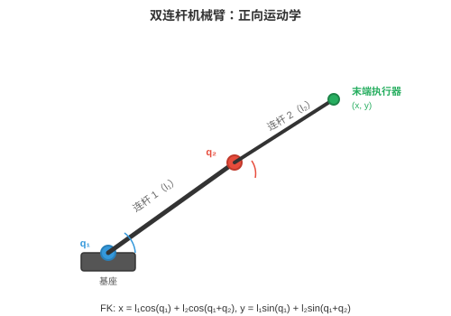
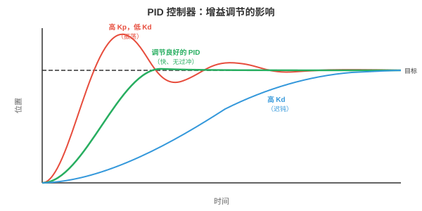
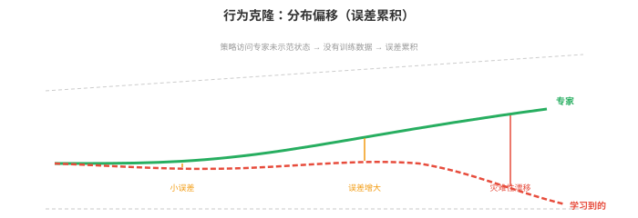
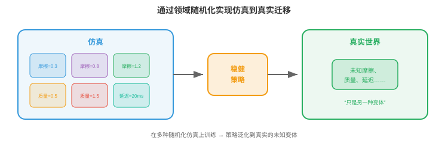

# 机器人学习

*机器人学习弥合算法与物理行动之间的鸿沟。本节涵盖运动学、动力学、经典控制、模仿学习、仿真到真实迁移、操作、运动和安全，这些技术赋予机器人移动、抓取、行走并与真实世界交互的能力。*

- 前几章中，我们学习了如何感知世界，第 8 章和本章第 1 节，以及如何从数据学习，第 6 章。但感知和学习还不够。机器人必须**行动（act）**：移动手臂抓住杯子、走过不平地面、在仓库中导航。这正是机器人学习的用武之地。

!!! note "大白话"
    看懂环境和学到规律还不够，机器人最终要把判断变成可靠动作。机器人学习研究的就是怎样让它动得对。

- 核心挑战在于物理世界连续、高维、接触丰富且不容失误。图像识别中的分类错误只是标签错误；机器人学中的控制错误可能是机器人损坏或物体掉落。代价完全不同。

!!! note "大白话"
    机器人犯错会真的撞、摔或伤人，不能像网页程序那样出错后重试。因此它必须同时追求效果、稳定和安全。

## 机器人运动学

- **运动学（kinematics）**描述不考虑力的运动几何。机械臂是由关节连接的刚性连杆链。每个关节有一个自由度，DoF：要么旋转，旋转关节，要么滑动，移动关节。

!!! note "大白话"
    运动学先不问马达需要多大力，只研究关节怎样转或滑时，机械臂各部分会出现在什么位置。

- 机器人的**构型（configuration）**是所有关节角度，或位移，的集合 $\mathbf{q} = [q_1, q_2, \ldots, q_n]^T$。这个向量位于**关节空间（joint space）**，或构型空间：一个每条轴对应一个关节的 $n$ 维空间。六自由度机械臂具有六维构型空间。

!!! note "大白话"
    构型就是机器人此刻每个关节分别摆在什么位置。把所有关节数值放进一个向量，便能用一个点描述整台机械臂的姿势。



- **正向运动学（forward kinematics，FK）**根据关节角度计算末端执行器，即“手”，的位置和姿态。这是函数 $\mathbf{x} = f(\mathbf{q})$，将关节空间映射到**任务空间（task space）**，即末端执行器的三维位置和姿态，也称笛卡尔空间。

!!! note "大白话"
    正向运动学的方向是“已知每个关节怎么摆，算手会到哪里”。它像把每段机械臂依次拼起来算最终手的位置。

- 每个关节由 $4 \times 4$ 齐次变换矩阵描述，回顾第 2 章仿射变换。**Denavit-Hartenberg（DH）约定**以四个数参数化每个关节：连杆长度 $a$、连杆扭角 $\alpha$、连杆偏距 $d$ 和关节角 $\theta$。关节 $i$ 的变换为：

$$T_i = \begin{bmatrix} \cos\theta_i & -\sin\theta_i \cos\alpha_i & \sin\theta_i \sin\alpha_i & a_i \cos\theta_i \\ \sin\theta_i & \cos\theta_i \cos\alpha_i & -\cos\theta_i \sin\alpha_i & a_i \sin\theta_i \\ 0 & \sin\alpha_i & \cos\alpha_i & d_i \\ 0 & 0 & 0 & 1 \end{bmatrix}$$

!!! note "大白话"
    DH 约定用四个参数把每个关节的长度、偏移和转角统一写进矩阵，方便用同一套规则描述不同机械臂。

- 完整的正向运动学是全部关节变换的乘积：$T_{0 \to n} = T_1 T_2 \cdots T_n$。这就是将变换链式相乘的矩阵乘法，第 2 章：依次应用每个关节的变换，将坐标系从基座旋转、平移到末端执行器。

!!! note "大白话"
    把每一节的变换矩阵按顺序相乘，就能从底座一路算到手的位置和朝向。

- **逆运动学（inverse kinematics，IK）**是反向问题：给定期望末端执行器位姿 $\mathbf{x}^*$，寻找关节角 $\mathbf{q}$，使 $f(\mathbf{q}) = \mathbf{x}^*$。它困难得多，因为：

!!! note "大白话"
    逆运动学问的是“手想去这里，关节该怎么摆”。方向反过来后，答案可能不止一个，也可能根本够不着。

    - 映射是非线性的，涉及正弦和余弦。

        !!! note "大白话"
            关节转动带来三角函数，不能像普通线性方程那样一次消元求解。

    - 可能有多个解，不同机械臂构型到达同一点。

        !!! note "大白话"
            手到同一个位置时，手肘可以朝上也可以朝下，所以系统还要按避障、舒适或能耗选择一个解。

    - 也可能无解，目标超出可达范围。

        !!! note "大白话"
            目标太远、角度受限或会碰撞时，数学上就没有可执行的关节配置。

- 解析解只对特定机器人几何存在。对于一般机器人，IK 使用**雅可比矩阵（Jacobian）**迭代求解。雅可比矩阵 $J(\mathbf{q})$ 将关节角的微小变化关联到末端执行器位置的微小变化，回顾第 3 章雅可比矩阵：

$$\dot{\mathbf{x}} = J(\mathbf{q}) \dot{\mathbf{q}}$$

!!! note "大白话"
    雅可比矩阵像机械臂当前姿势下的局部说明书：每个关节稍微动一点，手会往哪些方向移动。

- 要使末端执行器移动微小量 $\Delta \mathbf{x}$，需要 $\Delta \mathbf{q} = J^{-1} \Delta \mathbf{x}$，或使用伪逆 $J^+ \Delta \mathbf{x}$；当 $J$ 非方阵时使用后者。反复迭代直到末端执行器到达目标；本质上是将第 3 章牛顿法应用于运动学方程。

!!! note "大白话"
    IK 通常反复按这个局部说明做小修正，直到手逐渐靠近目标。

- 在**奇异位形（singularities）**附近，雅可比矩阵失去秩，某些列变得线性相关，见第 2 章。物理上这意味着机器人失去一个自由度：无论关节移动多快，末端执行器也无法向某些方向移动。伪逆在奇异位形附近会发散，因而改用阻尼最小二乘法，即添加正则化项 $\lambda^2 I$：

$$\Delta \mathbf{q} = J^T(JJ^T + \lambda^2 I)^{-1} \Delta \mathbf{x}$$

!!! note "大白话"
    奇异位形像手臂完全伸直时，有些方向已经很难再微调。阻尼项会限制过大的关节修正，宁可慢一点也不让数值失控。

## 动力学与控制

- **动力学（dynamics）**将力纳入问题。机械臂的运动方程遵循**机械臂方程（manipulator equation）**：

$$M(\mathbf{q})\ddot{\mathbf{q}} + C(\mathbf{q}, \dot{\mathbf{q}})\dot{\mathbf{q}} + \mathbf{g}(\mathbf{q}) = \boldsymbol{\tau}$$

!!! note "大白话"
    动力学不只问“会到哪里”，还问“要施加多大力矩才会这样动”。它把惯性、速度效应和重力都算进来。

- 其中 $M(\mathbf{q})$ 是质量，即惯性，矩阵；$C(\mathbf{q}, \dot{\mathbf{q}})$ 刻画科里奥利和离心效应；$\mathbf{g}(\mathbf{q})$ 是重力向量；$\boldsymbol{\tau}$ 是关节力矩向量，即控制输入。这是一个二阶微分方程组，每个关节一个方程。

!!! note "大白话"
    机器人每个关节受的力矩，要同时克服自身重量、带动质量和处理运动中的耦合效应，不能只靠位置误差硬拉。

- 质量矩阵 $M$ 总是对称正定的，回顾第 2 章，正定矩阵保证唯一最小值；这里它确保系统对施加力矩产生可预测响应。

!!! note "大白话"
    质量矩阵的好性质保证动力学不会出现荒谬的响应：给定力矩，系统的加速度关系是稳定、可预测的。

- **PID 控制（PID control）**是机器人学中应用最广的控制器。对每个关节，它根据误差 $e(t) = q_{\text{desired}}(t) - q_{\text{actual}}(t)$ 计算力矩：

    $$\tau(t) = K_p e(t) + K_i \int_0^t e(s) \, ds + K_d \dot{e}(t)$$

    !!! note "大白话"
        PID 就像持续纠偏：看现在差多远、过去一直差多少、以及误差变化得多快，再合成下一次施力。

三项的作用直观可见：

- **比例项（Proportional）**，$K_p$：按当前误差成比例修正。误差越大，修正越大，如同弹簧将关节拉向目标。

!!! note "大白话"
    比例项只看眼前差距，离目标远就用更大力往回拉。

- **积分项（Integral）**，$K_i$：积累过去误差，消除稳态偏移。若关节持续欠冲，积分项会累积并提供额外推动。

!!! note "大白话"
    积分项记住长期没补上的小误差，防止系统一直差一点却不再改进。

- **微分项（Derivative）**，$K_d$：对误差变化速率作出反应，提供阻尼。误差缩小时它减慢响应，防止过冲和振荡。

!!! note "大白话"
    微分项像刹车，看到系统正快速冲向目标时提前减速，避免冲过头后反复摇摆。



- 调整 $K_p, K_i, K_d$ 是一种平衡：过大的 $K_p$ 导致振荡，过大的 $K_d$ 使系统迟钝，过大的 $K_i$ 导致积分饱和，持续误差下积分无界增长。

!!! note "大白话"
    PID 没有万能参数：推得太猛会来回摆，刹得太狠会反应慢，记忆误差太强又会越积越失控。

- **模型预测控制（Model Predictive Control，MPC）**着眼未来。在每个时间步，它求解一个优化问题：在动力学模型和约束下，寻找有限时域内最小化代价函数，例如跟踪误差加控制代价，的未来控制序列。只施加第一个控制，再在下一时间步重复这一过程。

$$\min_{\mathbf{u}_{0:T}} \sum_{t=0}^{T} \left[ \|\mathbf{x}_t - \mathbf{x}_t^*\|_Q^2 + \|\mathbf{u}_t\|_R^2 \right] \quad \text{subject to} \quad \mathbf{x}_{t+1} = f(\mathbf{x}_t, \mathbf{u}_t)$$

!!! note "大白话"
    MPC 每一步都会先在脑中预测未来几步，找出既接近目标又不违反限制的动作计划，但只执行第一步，再根据新情况重新规划。

- 此处 $\|\mathbf{x}\|_Q^2 = \mathbf{x}^T Q \mathbf{x}$ 是使用正定矩阵 $Q$ 的加权范数，第 2 章，使你能对不同状态误差施加不同惩罚。MPC 能自然处理约束，关节限制、力矩限制、避障，因为它们被显式写入优化问题。

!!! note "大白话"
    代价函数决定什么更重要，例如位置误差还是省力；约束直接写进求解器，所以“不要撞、不要超关节极限”不是事后补救。

- **阻抗控制（impedance control）**调节力与运动之间关系，而不追踪刚性轨迹。它不命令“到位置 $x$”，而是命令“表现得像以 $x$ 为中心的弹簧-阻尼系统”：

$$F = K_s(\mathbf{x}^* - \mathbf{x}) + D(\dot{\mathbf{x}}^* - \dot{\mathbf{x}})$$

!!! note "大白话"
    阻抗控制不强迫手一定走到精确坐标，而是规定它该有多硬、多能让步，像带弹簧和阻尼的手。

- 其中 $K_s$ 是刚度矩阵，$D$ 是阻尼矩阵。这使机器人具有柔顺性：接触障碍物时会让步，而不是强行推进。阻抗控制对插销入孔、将物品递给人等接触丰富任务必不可少。

!!! note "大白话"
    接触人或物体时，太硬会顶坏东西，太软又做不成事。刚度和阻尼让机器人能安全地顶、插、递和贴合。

## 模仿学习

- 我们可以不手工设计控制器，而是从示范中学习控制策略。人完成任务，机器人观察，学习算法提取策略。这就是**模仿学习（imitation learning）**，或从示范学习。

!!! note "大白话"
    模仿学习让机器人先看人怎么做，再把观察和动作之间的规律学出来，省去手写大量控制规则。

- **行为克隆（behavioural cloning，BC）**是最简单的方法：将示范视作监督学习数据集。给定专家的观察-动作对 $\{(\mathbf{o}_t, \mathbf{a}_t)\}$，训练策略 $\pi_\theta(\mathbf{a} \mid \mathbf{o})$，从观察预测专家动作。这是标准监督学习，第 6 章：最小化损失：

$$\mathcal{L}(\theta) = \mathbb{E}_{(\mathbf{o}, \mathbf{a}) \sim \mathcal{D}} \left[ \| \pi_\theta(\mathbf{o}) - \mathbf{a} \|^2 \right]$$

!!! note "大白话"
    行为克隆把专家演示当成“看到这个情况就做这个动作”的练习题，直接学习模仿专家。


- 问题在于**分布偏移（distribution shift）**，也称**误差累积问题（compounding error problem）**。训练时，策略看到专家状态；部署时，策略自身的小误差将其推到专家从未访问过的状态。这些陌生状态导致更差动作，又导致更陌生状态，误差迅速累积。

!!! note "大白话"
    训练数据只教了机器人“走在正确路线上怎么办”。它一旦自己偏一点，就进入没见过的情况，越慌越偏。

- 想象通过观察完美驾驶员学习开车。你从未看见轻微偏航后会发生什么，因为专家从不偏航。第一次轻微偏离时，你不知道如何恢复。

!!! note "大白话"
    只看完美示范会学到正常操作，却学不到补救动作。现实里最重要的往往正是偏了以后怎样拉回。

- **DAgger**（Dataset Aggregation）通过迭代解决这一问题：

!!! note "大白话"
    DAgger 让当前机器人自己上场，专门收集它会犯错的状态，再请专家教这些状态该怎么处理。

    1. 在当前数据上训练策略。

        !!! note "大白话"
            先用已有示范训练出当前版本的策略。

    2. 在环境中运行策略，收集新状态。

        !!! note "大白话"
            让策略实际执行，暴露它真正会走到的陌生状态。

    3. 请专家为新状态标注正确动作。

        !!! note "大白话"
            即使机器人做错了，也让专家告诉它此刻应该怎样恢复。

    4. 将新数据加入数据集并重新训练。

        !!! note "大白话"
            把这些补救样本加入下一轮训练，策略就会逐步学会处理自己的错误。

- 经过多轮迭代，数据集覆盖学习到的策略实际访问的状态，而不只是专家轨迹。策略会改进，因为它看见并学会从自身错误中恢复。

!!! note "大白话"
    多轮后，训练集不再只包含理想路线，也包含真实执行时常见的偏差和恢复办法，部署更稳。

- **使用 Transformer 的动作分块（Action Chunking with Transformers，ACT）**是现代方法：策略预测未来动作序列，即一个“块”，而不是一次预测一个动作。它使用以 Transformer 为主干的条件 VAE 实现。预测动作块更稳健，因为它捕获时间相关性：伸手动作的平滑性被编码在块中，而不依赖会漂移的自回归单步预测。

!!! note "大白话"
    ACT 不只决定下一毫秒怎么动，而是一次规划一小段连续动作。这样伸手、抓取等动作更顺滑，不容易逐步累积抖动。

- **扩散策略（Diffusion Policy）**将第 8 章扩散模型应用于动作生成。它不预测单一动作，而是建模以观察为条件的全部可能动作分布。从噪声开始，它迭代去噪生成动作序列。这能自然处理**多模态性（multimodality）**：任务存在多种有效完成方法时，例如从左侧或右侧伸手，扩散模型能表示两个模式；回归策略会将它们平均，伸向中间，而中间可能两边都无效。

!!! note "大白话"
    有些任务本来就有多种正确做法。扩散策略能保留“从左拿”或“从右拿”两个选择，普通回归却可能平均成一个两边都拿不到的动作。

## 仿真到真实迁移

- 在真实世界训练机器人昂贵、缓慢且危险。机器人通过试错学习抓取可能要数千次尝试，期间会损坏物体和自身。**仿真（simulation）**提供无限、安全、快速的经验。但模拟器并不完美：物理是近似的，视觉是合成的，接触被简化。

!!! note "大白话"
    真实机器人摔一次就可能花钱和花时间，仿真能让它反复失败而不受伤，但仿真永远不可能和现实完全一样。

- **仿真到真实差距（sim-to-real gap）**是模拟与真实表现之间的差异。在仿真中完美运行的策略可能在真实机器人上完全失败，因为它过拟合了模拟器特有细节。

!!! note "大白话"
    机器人可能学会的是“模拟器里的物理规律”，一换成真实摩擦、延迟和噪声就不会做了，这就是仿真到真实的鸿沟。



- **领域随机化（domain randomisation）**通过在广泛模拟器设置上训练来应对这一问题。不是使用一个仿真，而是使用数千个随机化的仿真：

!!! note "大白话"
    领域随机化故意让模拟世界千变万化，逼策略别依赖某一套固定纹理、摩擦或马达参数。

    - 物理：摩擦系数、质量、阻尼。

        !!! note "大白话"
            每次让物体更滑、更重或阻尼不同，训练策略适应物理不确定性。

    - 视觉：光照、纹理、颜色、相机位置。

        !!! note "大白话"
            改变灯光和外观，避免模型只会识别模拟器里某种固定画面。

    - 动力学：电机延迟、噪声水平。

        !!! note "大白话"
            模拟控制指令不立即生效和传感器有噪声，使策略更接近真实硬件环境。

- 思路是，若策略在这些变体上都有效，真实世界只是该分布中的“另一种变体”。策略学习对随机化属性不变的特征，这些不变特征可迁移。

!!! note "大白话"
    在很多变化条件下都能成功的策略，更可能把现实当成又一个普通变化，而不是一上真实机器就失效。

- **系统辨识（system identification）**采取相反做法：不随机化一切，而是仔细测量真实系统的物理参数，并将模拟器调到匹配。这会得到更精确的仿真，但很脆弱，任何未建模效应都会造成差距。

!!! note "大白话"
    系统辨识努力造一个尽可能像真实机器的模拟器，效果精细但依赖测得准；漏掉一个效应，迁移仍可能出问题。

- 实践中，最佳结果会结合两者：先用系统辨识让模拟器足够接近，再用领域随机化覆盖剩余不确定性。

!!! note "大白话"
    先把模拟器调到大致真实，再在周围随机扰动，既不从完全错误的起点学习，也不假装参数绝对准确。

- **通过微调实现仿真到真实（sim-to-real via fine-tuning）**主要在仿真中训练，随后进行少量真实世界微调。仿真提供良好初始化，真实数据修正模拟器特有偏差。它比从头训练需要少得多的真实数据。

!!! note "大白话"
    仿真先打基础，真实数据最后校准。这样只需少量昂贵的真实试验，就能纠正模拟世界学来的偏差。

## 面向机器人的世界模型

- 上述全部强化学习和模仿学习方法都是**无模型（model-free）**的：策略通过直接交互，或示范，学习行动，而不显式建模世界如何运行。另一种方法是**基于模型（model-based）**学习：先学习环境动力学模型，再使用模型规划或生成合成经验。

!!! note "大白话"
    无模型方法直接学“现在该做什么”；基于模型方法先学“做了会发生什么”，再利用这个内部预测来选动作。

- **世界模型（world model）**学习转移函数 $p(s_{t+1} \mid s_t, a_t)$：给定当前状态和动作，预测下一个状态，第 10 章已经介绍。在机器人学中，这意味着预测机器人采取特定动作后会发生什么：“若我将这块积木推向左边，它会滑动 3cm，后面的杯子会倾倒。”

!!! note "大白话"
    世界模型是机器人脑中的小型物理预演器，能在动手前估计推、抓、碰之后会造成什么结果。

- 吸引力在于**样本效率（sample efficiency）**。真实世界机器人交互代价高。若机器人能从适量真实数据学习世界模型，它就能在内部展开模型，“想象”数千条轨迹，在不接触物理世界的情况下规划并改进策略。这类似棋手在脑中模拟走法来提前思考。

!!! note "大白话"
    一次真实动作可能昂贵或危险，而内部想象可以反复试。世界模型让机器人少做现实试错，多做脑内演练。

- **DreamerV3** 是通用的基于模型 RL 智能体。它联合学习三个部分：

!!! note "大白话"
    DreamerV3 把“看懂状态、预测未来、估计奖励”分成三个可学习部件，再在想象环境里训练动作策略。

    - **表征模型（representation model）**：将观察编码为紧凑潜在状态。

        !!! note "大白话"
            它把原始图像或传感器数据压成更容易计算的内部状态。

    - **转移模型（transition model）**，即世界模型：根据当前状态和动作预测下一个潜在状态。

        !!! note "大白话"
            它负责回答“在这个状态做这个动作，下一刻内部状态会怎样变”。

    - **奖励模型（reward model）**：根据潜在状态预测奖励。

        !!! note "大白话"
            它估计未来状态好不好，给规划和策略学习提供方向。

- 智能体随后在潜在空间中多步展开转移模型来“做梦”，用这些想象轨迹训练策略，并将策略转移到真实环境。关键创新是全部想象发生在潜在空间，即紧凑学习表示，而非像素空间，因此计算上可行。

!!! note "大白话"
    机器人不在脑中渲染每个像素，而是在压缩状态里快速模拟很多步，这才有足够速度用想象结果训练策略。

$$\hat{s}_{t+1} = f_\theta(s_t, a_t), \quad \hat{r}_t = g_\theta(s_t)$$

!!! note "大白话"
    第一个函数预测下一状态，第二个函数预测当前状态值多少奖励。两者合起来让策略既能看未来，也能比较不同选择的好坏。

- 转移模型 $f_\theta$ 和奖励模型 $g_\theta$ 在真实经验上训练，策略在想象展开上训练。这将数据收集与策略优化解耦。

!!! note "大白话"
    真实交互主要用来把世界模型学准，策略改进则主要在内部模拟完成，减少了对真实机器的消耗。

- 对机器人操作，世界模型支持**心理演练（mental rehearsal）**。在尝试抓取前，机器人可在学习到的模型中模拟多种接近方式，选择最可能成功的一种。这对真实世界试错缓慢且危险的接触丰富任务尤其有价值。

!!! note "大白话"
    抓取前先在脑中试几种手势，选最稳的一种再动手，能显著减少真实物体被碰倒或抓空的次数。

- 世界模型还自然连接到**仿真到真实（sim-to-real）**：在真实数据上训练的世界模型本质上是学习到的模拟器，自动捕获真实世界物理，从而完全绕开仿真到真实差距。对于理解充分的场景，它可能不如手工模拟器精确，但能捕获手工模拟器常常建模错误的效应，摩擦、变形、接触动力学。

!!! note "大白话"
    从真实数据学出的世界模型不必先手工写全物理公式，它能直接吸收真实摩擦、软硬和接触效果，但也受训练数据覆盖范围限制。

- **JEPA**（Joint Embedding Predictive Architecture，第 10 章介绍）提供像素级预测的替代方案。JEPA 不预测精确未来观察，而是在嵌入空间预测：“下一状态的潜在表示将接近这个向量。”这避开预测像素级精确未来的困难，那既不必要又浪费计算，并专注预测对决策重要的未来方面。

!!! note "大白话"
    JEPA 不要求准确预言未来每个像素，而是预测对行动有用的状态变化，例如物体是否移动、是否接近碰撞。

- 世界模型的局限是**预测误差累积（compounding prediction error）**。转移模型的小误差在长展开中累积，使想象轨迹偏离现实。缓解方法包括较短的想象时域、集成模型，利用不确定性检测预测何时不可靠，以及定期用新鲜真实数据让模型重新落地。

!!! note "大白话"
    世界模型预测得越远，误差越会一层层放大。实际系统要限制想象长度、识别不确定情况，并不断用真实数据校准。

## 操作

- **操作（manipulation）**是使用机器人末端执行器与物体交互的技艺：拾取、放置、推动、插入、装配。

!!! note "大白话"
    操作就是让机器人不只移动自己，还能可靠地改变物体的位置和状态，例如拿起、推开或装配。

- **抓取（grasping）**是基础操作技能。目标是找到稳定抓取姿态：使夹爪能牢固持住物体的位置和方向。

!!! note "大白话"
    抓取不是碰到物体就行，而是要选一个夹爪位置和角度，保证拿起来不会滑、不会转、不会掉。

- **解析抓取规划（analytical grasp planning）**使用物理学。若接触力能抵抗外部扳手力，即力和力矩，抓取便稳定。对平行夹爪，最简单准则是**力封闭（force closure）**条件：接触法线必须张成全部力方向，使抓取能抵抗任意扰动。这涉及检查抓取扳手矩阵的秩，是第 2 章秩概念的直接应用。

!!! note "大白话"
    力封闭的意思是夹爪从不同方向施力后，能抵抗物体受到的任何小推拉和转动，不会一碰就掉。

- **数据驱动抓取（data-driven grasping）**学习从传感器输入预测抓取成功。给定桌上物体的深度图，网络为每个候选夹爪姿态预测抓取质量得分。**GraspNet** 和类似架构使用点云编码器，PointNet 风格，第 8 章，预测带置信度得分的六自由度抓取姿态，位置加方向。

!!! note "大白话"
    数据驱动方法不必为每种复杂物体手写物理规则，而是从大量成功和失败样本中学会哪些抓取位置更稳。

- **灵巧操作（dexterous manipulation）**超越简单的抓取放置。多指手拥有 20 多个自由度，能完成手内旋转，在手指间转笔、工具使用和精密装配等任务。状态空间极大且接触复杂，使它成为机器人学最困难的问题之一。

!!! note "大白话"
    多指手像人手一样灵活，但每根手指都可能接触、滑动和互相影响，组合情况爆炸，因此比普通夹爪难很多。

- 学习灵巧操作常在具有大量领域随机化的仿真中使用强化学习，第 6 章。OpenAI 使用 Shadow 手解决魔方的工作，在随机物理的仿真中训练 PPO 策略，成功迁移到真实机器人手。

!!! note "大白话"
    灵巧操作真实试错太难，通常先在大量随机模拟里练出策略，再把它迁移到真实机械手。

- 插销入孔、擦拭表面等**接触丰富任务（contact-rich tasks）**要求机器人与环境保持受控接触。这些任务需要力感知和柔顺控制，即阻抗控制；接触物理难以建模，因此难以准确仿真。

!!! note "大白话"
    插入和擦拭要一边施力一边调整，不能只追位置。接触细节非常复杂，这也是从仿真迁移时最容易出错的部分。

## 运动

- 运动（locomotion）是让机器人身体穿行于世界：行走、奔跑、攀爬、游泳。它与操作的关键区别是，机器人必须在移动时保持平衡，并且与地面的接触点会随时间变化。

!!! note "大白话"
    运动不仅是往前走，还要在不断改变落脚点时不摔倒。它比固定底座机械臂多了平衡这个持续难题。

- **足式运动（legged locomotion）**具有挑战性，因为它内在不稳定。双足机器人，即人形机器人，在迈步时单腿站立，像倒立摆。质心必须保持在支撑多边形，即接触地面足部的凸包，上方，否则机器人会跌倒。

!!! note "大白话"
    人形走路时经常只有一只脚支撑，身体重心必须落在脚能支撑的范围内，否则就会像倒立的扫把一样倒下。

- **零力矩点（Zero Moment Point，ZMP）**是地面上重力与惯性力合力矩为零的点。若 ZMP 保持在支撑多边形内，机器人不会倾倒。Honda ASIMO 等传统人形控制器规划使 ZMP 保持在边界内的轨迹。

!!! note "大白话"
    ZMP 是衡量平衡的一个地面位置。只要这个点还在脚底支撑范围里，机器人就有机会稳住；跑出范围就容易翻倒。

- **中央模式发生器（Central Pattern Generators，CPGs）**是受生物学启发的、基于振荡器的控制器。动物用脊髓神经回路生成有节律的运动模式，步行、小跑、疾驰，无需大脑持续参与。CPG 模型使用耦合微分方程：

$$\dot{\phi}_i = \omega_i + \sum_j w_{ij} \sin(\phi_j - \phi_i - \psi_{ij})$$

!!! note "大白话"
    CPG 让每条腿像一个节拍器，彼此保持合适节奏。这样能自然产生重复而协调的步态，不必每一瞬间都重新规划。

- 其中 $\phi_i$ 是振荡器 $i$ 的相位，$\omega_i$ 是自然频率，$w_{ij}$ 是耦合强度，$\psi_{ij}$ 是期望相位偏移。不同相位关系产生不同步态：所有腿同步，跳跃；交替成对，小跑；依次运动，步行。正弦耦合自然同步振荡器，类似第 3 章傅里叶级数将运动分解为频率分量。

!!! note "大白话"
    只要改变各腿之间该相差几个节拍，同一套振荡器就能切换走路、小跑或跳跃等步态。

- **用于运动的强化学习（reinforcement learning for locomotion）**已成为敏捷四足与人形机器人的主流方法。机器人在仿真中通过试错，第 6 章，学习策略 $\pi(\mathbf{a} \mid \mathbf{o})$；对前进速度、稳定性和能效给予奖励，对跌倒、违反关节限制和抖动动作施加惩罚。

!!! note "大白话"
    运动 RL 通过奖励“走得快、稳、省电”，惩罚“摔倒、抖动、超限制”，让机器人在大量模拟试错中找到步法。

- 近期工作，例如 Agility Robotics、Boston Dynamics 和学术实验室，的关键洞见是：RL 训练的运动策略远比手工设计控制器稳健。它们自然学会从推搡中恢复、适应地形变化，并处理工程师未曾预料的情况。训练通常使用 PPO，第 6 章，配合领域随机化。

!!! note "大白话"
    手写控制器很难预先列完所有地形和扰动；RL 在大量随机情况里练习后，往往能学到被推一下也不倒的恢复能力。

- Boston Dynamics Spot、Unitree Go2 等**四足机器人（quadruped robots）**已成为足式机器人主力。四条腿提供内在稳定性，三腿构成的三脚架总能在一条腿移动时支撑身体。四足 RL 策略取得了令人印象深刻的成果：以 3 m/s 以上奔跑、爬楼梯、穿越岩石地形、从踢击中恢复。

!!! note "大白话"
    四条腿比两条腿稳定得多，移动一条腿时仍能用另外三条腿撑住身体，所以是复杂地形中更实用的形态。

- **人形运动（humanoid locomotion）**更难，因为双足机器人具有更小支撑多边形和更高质心。Tesla Optimus、Figure、Unitree H1 等近期进展使用经过精心奖励塑形的仿真 RL。人形机器人不仅要学会走路，还要协调摆臂以平衡、通过不平地面、从扰动中恢复。

!!! note "大白话"
    人形机器人的重心高、脚底小，稍有误差就会摔。它还要把腿、躯干和手臂一起协调，难度远高于四足。

## 机器人学习中的安全

- 随机探索以学习的机器人，如 RL 中那样，可能损坏自身、环境或附近的人。**安全机器人学习（safe robot learning）**约束探索以避免灾难性后果。

!!! note "大白话"
    让机器人随便试错在现实中不可接受。安全学习的底线是：即使策略还没学好，也不能让它做危险动作。

- **约束强化学习（constrained RL）**为 MDP，第 6 章，添加安全约束。目标变为：在 $J_c(\pi) \leq d$ 条件下最大化奖励，其中 $J_c$ 是期望累积成本，例如碰撞事件，$d$ 是最大允许成本。约束策略优化，Constrained Policy Optimisation，CPO 等算法扩展 PPO 来处理这些约束。

!!! note "大白话"
    约束 RL 不再只问怎样得高分，还要求碰撞、超力等风险成本不能超过红线。高奖励但危险的策略不算合格。

- **安全包络（safety envelopes）**定义机器人绝不可跨越的硬边界，不论学习到的策略如何要求。安全控制器监视机器人状态，当约束即将违反时覆盖学习策略，例如接近关节极限、在人附近移动过快、超过力阈值。这是分层架构：学习算法负责性能，安全层负责约束。

!!! note "大白话"
    安全包络像独立的急停和限位系统。学习策略可以追求表现，但一接近危险边界，安全层有最终否决权。

- **风险感知规划（risk-aware planning）**显式建模环境与机器人自身状态估计中的不确定性。它不为最可能结果规划，而是在置信边界内为最坏情况规划。这与第 2 章条件数概念相关：良态系统对扰动稳健，风险感知规划寻求在扰动下仍安全的控制策略。

!!! note "大白话"
    有不确定性时不能只按最乐观情况行动。风险感知规划会预留余量，即使感知或模型有误差也尽量不出事。

## 编码练习（使用 CoLab 或 notebook）

1. 为简单双连杆平面机械臂实现正向运动学。计算并可视化不同关节角下的末端执行器位置。
```python
import jax.numpy as jnp
import matplotlib.pyplot as plt

def forward_kinematics(q1, q2, l1=1.0, l2=0.8):
    """Compute joint and end-effector positions for a 2-link arm."""
    x1 = l1 * jnp.cos(q1)
    y1 = l1 * jnp.sin(q1)
    x2 = x1 + l2 * jnp.cos(q1 + q2)
    y2 = y1 + l2 * jnp.sin(q1 + q2)
    return jnp.array([0, x1, x2]), jnp.array([0, y1, y2])

fig, ax = plt.subplots(figsize=(6, 6))
configs = [(0.5, 0.3), (1.0, -0.5), (1.5, 1.0), (2.0, -1.5)]
colors = ["#e74c3c", "#3498db", "#27ae60", "#9b59b6"]

for (q1, q2), c in zip(configs, colors):
    xs, ys = forward_kinematics(q1, q2)
    ax.plot(xs, ys, "o-", color=c, linewidth=2, markersize=6,
            label=f"q=({q1:.1f}, {q2:.1f})")

ax.set_xlim(-2, 2); ax.set_ylim(-2, 2)
ax.set_aspect("equal"); ax.grid(True); ax.legend()
ax.set_title("2-Link Robot Arm: Forward Kinematics")
plt.show()
```

2. 使用雅可比伪逆实现逆运动学。从随机构型开始，迭代将末端执行器移动到目标。
```python
import jax
import jax.numpy as jnp
import matplotlib.pyplot as plt

l1, l2 = 1.0, 0.8

def end_effector(q):
    x = l1 * jnp.cos(q[0]) + l2 * jnp.cos(q[0] + q[1])
    y = l1 * jnp.sin(q[0]) + l2 * jnp.sin(q[0] + q[1])
    return jnp.array([x, y])

jacobian_fn = jax.jacobian(end_effector)

target = jnp.array([0.5, 1.2])
q = jnp.array([0.1, 0.1])
trajectory = [end_effector(q)]

for _ in range(50):
    pos = end_effector(q)
    error = target - pos
    if jnp.linalg.norm(error) < 1e-4:
        break
    J = jacobian_fn(q)
    # Damped pseudo-inverse to handle near-singularities
    dq = J.T @ jnp.linalg.solve(J @ J.T + 0.01 * jnp.eye(2), error)
    q = q + dq
    trajectory.append(end_effector(q))

traj = jnp.stack(trajectory)
plt.plot(traj[:, 0], traj[:, 1], "b.-", label="end-effector path")
plt.plot(*target, "r*", markersize=15, label="target")
plt.gca().set_aspect("equal"); plt.grid(True); plt.legend()
plt.title(f"IK converged in {len(trajectory)-1} steps")
plt.show()
```

3. 模拟简单 PID 控制器跟踪期望关节轨迹。观察调节增益的影响。
```python
import jax.numpy as jnp
import matplotlib.pyplot as plt

# Desired trajectory: smooth sinusoidal motion
dt = 0.01
t = jnp.arange(0, 5, dt)
q_desired = jnp.sin(2 * t)

# Simulate second-order dynamics: m * q_ddot + b * q_dot = tau
m, b_damp = 1.0, 0.5

for Kp, Kd, Ki, label in [(10, 5, 0, "PD only"), (10, 5, 2, "PID"), (50, 10, 2, "Aggressive PID")]:
    q, q_dot, integral = 0.0, 0.0, 0.0
    qs = []
    for i in range(len(t)):
        error = q_desired[i] - q
        integral += error * dt
        d_error = -q_dot  # derivative of error (desired velocity is known but simplified here)
        tau = Kp * error + Kd * d_error + Ki * integral
        q_ddot = (tau - b_damp * q_dot) / m
        q_dot += q_ddot * dt
        q += q_dot * dt
        qs.append(float(q))

    plt.plot(t, qs, label=label)

plt.plot(t, q_desired, "k--", label="desired", linewidth=2)
plt.xlabel("Time (s)"); plt.ylabel("Joint angle")
plt.legend(); plt.title("PID Controller Tracking")
plt.show()
```
