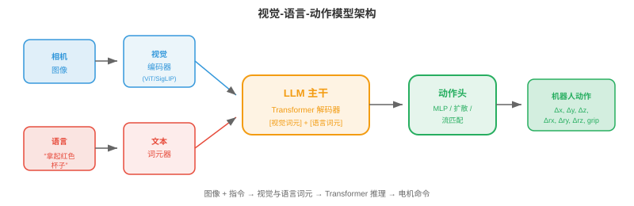
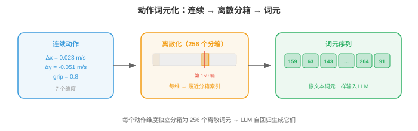
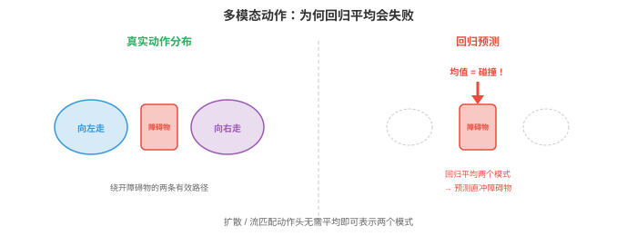

# 视觉-语言-动作模型

*视觉-语言-动作模型（Vision-Language-Action models，VLAs）将看见、理解语言和行动统一到单一神经网络中。本节涵盖 VLA 架构、动作词元化、RT-2、Octo、OpenVLA、预训练策略、泛化、具身无关模型和基准。*

- 前两节介绍了感知，即感受世界，和机器人学习，即控制身体。传统上，它们是相互独立的流水线：感知模块检测物体，语言模块解释命令，控制模块生成动作。每个模块都独立设计、训练和调试。

- **视觉-语言-动作模型（Vision-Language-Action models，VLAs）**将这一流水线压缩为单一神经网络。模型输入图像，视觉，和自然语言指令，语言，输出电机命令，动作。一个模型，端到端。

- 这延续第 10 章所见的统一化趋势：多模态模型将视觉和语言理解合并到一个架构，VLA 则将其扩展到物理行动。关键洞见是语言提供自然、灵活的任务指定接口，例如“拿起红色杯子并放到架子上”，而大型预训练视觉语言模型已经理解图像和指令。

## 从视觉语言到行动

- 回顾第 10 章，LLaVA、Flamingo 等**视觉语言模型（Vision-Language Models，VLMs）**以图像和文本为输入，以文本为输出。它们能理解场景、回答问题、遵循指令，全都以语言完成。

- VLA 提出的问题是：若输出不是文本，而是**机器人动作（robot actions）**，会怎样？模型不再生成“红色杯子位于桌子左侧”，而是生成一串电机命令，使机械臂移动并抓住该杯子。

- 关键架构洞见是，动作可以像词语一样表示为词元。VLM 用下一个词元预测逐个生成语言词元，VLA 以同样方式生成动作词元。Transformer 从根本上并不在乎输出词元的含义是“杯子”还是“将夹爪向前移动 2cm”。

- 这将机器人控制重构为序列建模问题，Transformer 在此类问题上表现出色，第 7 章。模型学习映射：（图像观察、语言指令）$\to$（动作词元序列）。

## VLA 架构



- 典型 VLA 有三个组成部分：

    - **视觉编码器（vision encoder）**：将相机图像处理为视觉词元。通常是预训练 ViT，第 8 章，或 SigLIP 编码器，第 10 章。图像被切分为图块，每块嵌入为一个词元，与标准视觉 Transformer 完全相同。

    - **语言模型主干（language model backbone）**：预训练 LLM，如 LLaMA、PaLM，处理视觉词元与语言词元的交错序列。推理在此发生：模型通过同时关注指令与视觉特征，理解“拿起**红色**杯子”。

    - **动作头（action head）**：将 LLM 输出映射到机器人动作。它可以是将最后隐藏状态映射为连续动作值的简单 MLP，也可以是将动作转换为离散词元、由 LLM 既有词汇表预测的词元化方案。

- 架构如下：

$$\text{Image} \xrightarrow{\text{ViT}} \text{visual tokens} \quad + \quad \text{Instruction} \xrightarrow{\text{tokeniser}} \text{language tokens} \quad \xrightarrow{\text{LLM}} \quad \text{action tokens}$$

- 视觉词元与语言词元拼接，或交错，后输入 Transformer 主干，后者自回归地产生动作词元。这与 VLM 架构相同，第 10 章，只是输出模态由文本改为动作。

## 动作词元化

- 机器人动作是连续的：关节速度、末端执行器位置、夹爪宽度。必须将它们转换为离散词元，供 LLM 生成。



- 最简单方法是**均匀离散化（uniform discretisation）**。每个动作维度被划分为 $N$ 个分箱，覆盖有效值范围。例如，若 x 速度范围为 -0.1 至 0.1 m/s，使用 256 个分箱，每个箱代表 $\frac{0.2}{256} \approx 0.8$ mm/s。动作值映射到最近的分箱索引，该索引成为一个词元。

- 对 7 个动作维度，6 个自由度加夹爪，每维 256 个分箱，动作词汇表有 $7 \times 256 = 1792$ 个词元。它们加入 LLM 既有文本词汇表。模型为每个维度自回归地生成一个动作词元，如同生成词语。

- **动作分块（action chunking）**一次预测多个未来时间步，而非单个动作。若块大小为 $H$，模型输出 $H \times d$ 个词元，其中 $d$ 是动作维度。这对平滑、时间连贯的运动至关重要。逐步预测会产生抖动行为，因为每次预测相互独立。分块迫使模型规划短轨迹，捕获时间结构。

- 更复杂的方法经由 VQ-VAE，第 10 章，使用**学习到的词元化（learned tokenisation）**。VQ-VAE 编码器将连续动作序列映射为离散码本索引序列，解码器再从这些索引重建连续动作。LLM 此时生成码本索引，而非均匀分箱值。这类似第 10 章图像词元器将视觉信息压缩成紧凑离散编码的方式。

## 关键 VLA 模型

- **RT-2**（Robotic Transformer 2，Google DeepMind）是首个大规模 VLA。它采用预训练 VLM，PaLM-E 或 PaLI-X，最高 550 亿参数，并在机器人示范数据上微调。动作表示为文本字符串：词元序列“1 128 91 241 5 101 127”编码一个七维动作，每个数字为分箱索引。

- RT-2 展示了一个显著特性：来自 VLM 主干的**涌现能力（emergent capabilities）**可迁移到机器人学。模型能遵循涉及从未出现在机器人数据中的概念的指令，例如“将香蕉移到以 A 开头的国家”，这需要视觉物体识别、世界知识和行动。VLM 的语言理解和视觉推理仿佛“免费获得”。

- RT-2 的局限是它在单一机器人具身的数据上训练，即特定机械臂与特定夹爪。它不能泛化到不同机器人。

- **Octo**（UC Berkeley）是开源、**具身无关（embodiment-agnostic）**的 VLA，设计为跨不同机器人平台工作。其关键创新包括：

    - 使用**扩散动作头（diffusion action head）**而非自回归词元预测。动作头接收 Transformer 输出，经去噪扩散过程，第 8 章，产生动作。这可自然处理多模态动作分布，见下图，其中一个任务有多种有效完成方式。



    - **灵活的观察与动作空间（flexible observation and action spaces）**：Octo 针对不同机器人构型使用任务专用词元器。它在 Open X-Embodiment 数据集上预训练，该数据集包含来自 22 种不同机器人具身的示范。

    - **高效微调（efficient fine-tuning）**：Octo 用少至 100 个示范即可微调到新机器人，因此对数据有限的实验室具有实用性。

- **OpenVLA**（Stanford、UC Berkeley）采用为机器人学微调既有开源 VLM，基于 Llama，的路径。它使用 70 亿参数主干、均匀动作词元化，每维 256 个分箱，并在 Open X-Embodiment 数据上训练。其强项是简单：架构就是在词汇表中追加动作词元的标准 VLM，易于用现有 LLM 基础设施训练和部署。

- **$\pi_0$**（Physical Intelligence）代表最先进水平。它使用预训练 VLM 主干与**流匹配（flow matching）**动作头，第 8 章。流匹配通过学习将噪声输运至动作分布的速度场来生成动作，产生平滑、时间连贯的动作轨迹。$\pi_0$ 展现出显著通用性，能跨多个机器人具身完成任务，包括双臂操作和灵巧手控制。

## 预训练方案

- VLA 从已经理解视觉场景和语言的预训练 VLM 主干中极大受益。训练流水线通常遵循以下阶段：

    1. **VLM 预训练（VLM pretraining）**：在互联网数十亿图文对上训练，或直接使用现成的，视觉语言模型，如第 10 章介绍的 CLIP、SigLIP、LLaVA 风格训练。

    2. **机器人数据协同训练（robot data co-training）**：在互联网数据与机器人示范数据的混合物上微调 VLM。互联网数据防止灾难性遗忘视觉和语言理解，机器人数据教授动作生成。混合比例很重要：过多机器人数据会损害语言理解，过少则无法学会动作。

    3. **任务专用微调（task-specific fine-tuning）**：可选地在特定任务或机器人的示范上微调，常使用 LoRA，第 10 章，以保持可训练参数数量较少。

- 机器人数据量比互联网数据小多个数量级。VLM 可能在数十亿图像上预训练，而最大机器人数据集，Open X-Embodiment，跨全部具身只包含数百万帧。这种数据稀缺说明从预训练 VLM 开始为何至关重要：视觉与语言表示可迁移，只有动作映射需要从有限机器人数据中学习。

## 泛化

- VLA 的承诺是**泛化（generalisation）**：在未见过的环境中，使用未见过的物体，遵循未见过的指令，完成训练时未见过的任务。

- VLA 沿多个轴进行泛化：

    - **新物体（novel objects）**：VLM 主干从互联网预训练中识别物体。若模型从网络图像知道“螺丝刀”的外观，即使没有机器人示范包含螺丝刀，它也能操作螺丝刀。

    - **新指令（novel instructions）**：组合式语言理解让模型遵循已知概念的新组合。即使训练只展示叠放红色积木，“将蓝色积木叠在绿色积木上”也能奏效，因为模型从语言预训练理解颜色形容词。

    - **新环境（novel environments）**：在一定程度上，VLA 可跨视觉域迁移，不同桌子、光照、背景，因为视觉编码器在多样网络图像上预训练。但这有极限：在实验室训练的机器人可能在杂乱厨房中吃力。

    - **新具身（novel embodiments）**：这是最难的轴。不同机器人有不同动作空间，关节角与末端执行器速度；不同传感器，腕部相机与顶部相机；以及不同物理能力。Octo、$\pi_0$ 等具身无关模型通过灵活词元器和跨多类机器人的预训练来解决它。

- 泛化在**留出任务（held-out tasks）**上评估：要求机器人完成从未训练过的任务。新任务上 50 至 80% 的成功率被视为强结果，相比之下分布内任务超过 90%。随着模型扩大和机器人数据集增长，这一差距正缩小。

## 具身无关模型

- 该领域正走向**一个模型，多个机器人（one model, many robots）**。不再为每台机器人训练单独策略，而是让单一 VLA 处理多个具身。

- 这要求解决**动作空间不匹配（action space mismatch）**问题。带平行夹爪的七自由度机械臂有七个动作维度；双臂系统有 14 个；四足机器人有 12 个；人形机器人有 30 多个。动作词元化必须足够灵活才能处理全部情况。

- 解决方案包括：
    - **填充动作向量（padded action vectors）**：使用最大动作空间，以零填充较小空间。
    - **每具身动作头（per-embodiment action heads）**：共享 Transformer 主干，为每种机器人类型配置独立小型 MLP。
    - **归一化动作表示（normalised action representations）**：在共同坐标系表达全部动作，例如世界坐标系中的末端执行器速度，使产生相似末端动作的不同机器人共享相同动作词元。

- 共享主干学习通用视觉与语言理解，以及常见操作策略，从上方接近、对准物体、闭合夹爪。具身专用组件只需将这些高层策略翻译为具体电机命令。

## 基准与评估

- 评估 VLA 有独特挑战，因为它需要物理机器人实验，或高保真仿真。

- **SIMPLER**（Simulated Manipulation Policy Evaluation for Robot learning）提供标准化模拟环境，无需物理硬件即可比较 VLA 性能。它与真实世界成功率有良好相关性，并支持可复现基准测试。

- **真实世界评估（real-world evaluation）**仍是金标准。典型流程为：
    1. 定义一组具有明确成功标准的任务，物体到达目标位置、选择正确物体、在时限内完成任务。
    2. 每项任务运行 $N$ 次试验，通常 10 至 50 次。
    3. 报告带置信区间的成功率。
    4. 包含留出，即从未训练过的，任务来度量泛化。

- **Open X-Embodiment** 数据集和基准汇集 22 家机构、多个机器人平台的机器人数据。它提供标准化示范共享格式和跨具身迁移的通用评估套件。

## 编码练习（使用 CoLab 或 notebook）

1. 实现动作词元化：将连续动作离散为分箱并重建。观察量化误差如何随分箱数变化。
```python
import jax.numpy as jnp

# Continuous action: 7 dimensions (6 DoF + gripper)
action_true = jnp.array([0.023, -0.051, 0.012, 0.1, -0.03, 0.005, 0.8])
action_min = jnp.array([-0.1, -0.1, -0.1, -0.5, -0.5, -0.5, 0.0])
action_max = jnp.array([ 0.1,  0.1,  0.1,  0.5,  0.5,  0.5, 1.0])

for n_bins in [16, 64, 256, 1024]:
    # Tokenise: map continuous value to bin index
    normalised = (action_true - action_min) / (action_max - action_min)
    tokens = jnp.clip((normalised * n_bins).astype(int), 0, n_bins - 1)

    # Detokenise: map bin index back to continuous value
    reconstructed = (tokens + 0.5) / n_bins * (action_max - action_min) + action_min

    error = jnp.linalg.norm(action_true - reconstructed)
    print(f"bins={n_bins:4d}  tokens={tokens}  error={error:.6f}")
```

2. 模拟动作分块与单步预测。生成平滑轨迹，为单步预测加入噪声，并与基于块的预测比较。
```python
import jax
import jax.numpy as jnp
import matplotlib.pyplot as plt

# Ground truth smooth trajectory (e.g., reaching motion)
t = jnp.linspace(0, 2 * jnp.pi, 100)
gt_x = jnp.sin(t)
gt_y = 1 - jnp.cos(t)

# Single-step: each prediction has independent noise
rng = jax.random.PRNGKey(42)
noise_ss = jax.random.normal(rng, (100, 2)) * 0.05
single_step = jnp.stack([gt_x, gt_y], axis=1) + noise_ss
# Cumulative drift from single-step errors
single_step_cumulative = jnp.cumsum(noise_ss, axis=0) * 0.3 + jnp.stack([gt_x, gt_y], axis=1)

# Chunked (chunk_size=10): noise is correlated within chunks, smoother
chunk_size = 10
rng2 = jax.random.PRNGKey(7)
chunks = []
for i in range(0, 100, chunk_size):
    chunk_noise = jax.random.normal(jax.random.fold_in(rng2, i), (2,)) * 0.05
    chunk = jnp.stack([gt_x[i:i+chunk_size], gt_y[i:i+chunk_size]], axis=1)
    chunks.append(chunk + chunk_noise)
chunked = jnp.concatenate(chunks, axis=0)

plt.figure(figsize=(8, 4))
plt.plot(gt_x, gt_y, "k-", linewidth=2, label="Ground truth")
plt.plot(single_step_cumulative[:, 0], single_step_cumulative[:, 1],
         "r-", alpha=0.7, label="Single-step (drifts)")
plt.plot(chunked[:, 0], chunked[:, 1], "b-", alpha=0.7, label="Chunked (stable)")
plt.legend(); plt.axis("equal"); plt.grid(True)
plt.title("Action Chunking vs Single-Step Prediction")
plt.show()
```

3. 可视化 VLA 的动作分布如何呈现多模态。使用简单二维高斯混合展示为何扩散/流匹配动作头优于回归。
```python
import jax
import jax.numpy as jnp
import matplotlib.pyplot as plt

# Two valid ways to reach around an obstacle: left or right
rng = jax.random.PRNGKey(0)
k1, k2 = jax.random.split(rng)

mode1 = jax.random.normal(k1, (200, 2)) * 0.15 + jnp.array([-1.0, 0.5])
mode2 = jax.random.normal(k2, (200, 2)) * 0.15 + jnp.array([ 1.0, 0.5])
samples = jnp.concatenate([mode1, mode2])

# Regression predicts the mean = average of modes (invalid!)
mean_pred = samples.mean(axis=0)

plt.figure(figsize=(6, 5))
plt.scatter(samples[:, 0], samples[:, 1], s=5, alpha=0.5, label="True action distribution")
plt.plot(*mean_pred, "rx", markersize=15, markeredgewidth=3, label="Regression mean (invalid!)")
plt.plot(-1, 0.5, "g^", markersize=12, label="Mode 1 (go left)")
plt.plot(1, 0.5, "b^", markersize=12, label="Mode 2 (go right)")
plt.legend(); plt.grid(True)
plt.title("Multimodal Actions: Why Regression Fails")
plt.xlabel("Action dim 1"); plt.ylabel("Action dim 2")
plt.show()
```
