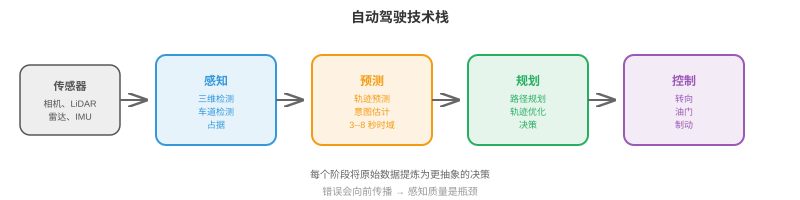
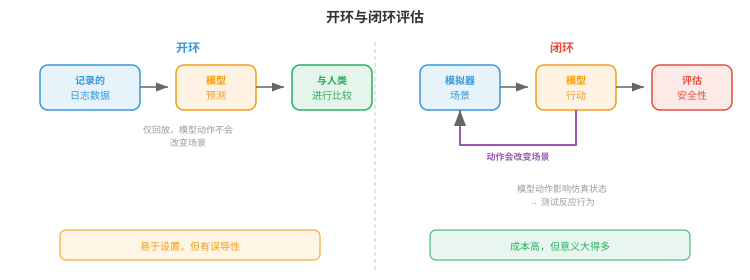
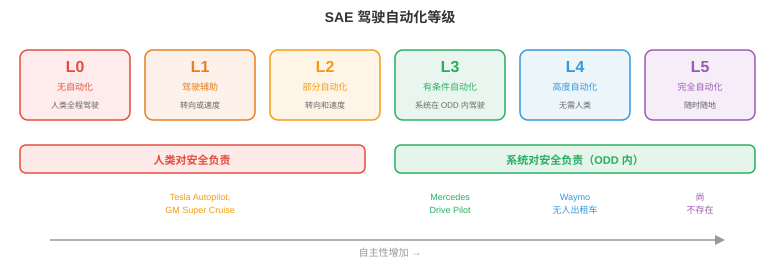

# 自动驾驶汽车

*自动驾驶汽车是商业化程度最高的自主系统，将感知、预测、规划和控制集成到一辆车中。本节介绍自动驾驶技术栈、高精地图、运动预测、规划、端到端驾驶、仿真、安全标准与自动化等级。*

- 自动驾驶汽车可以说是当前正在大规模攻克的最难机器人问题。工厂机器人在受控环境中工作，而自动驾驶汽车必须应对开放世界：不可预测的人类驾驶员、横穿马路的行人、一夜之间出现的施工区，以及每分钟都在变化的天气。

- 它的风险也格外高。自动驾驶汽车以高速公路速度在弱势道路使用者之间行驶。对于安全关键故障，允许的误差几乎为零。

## 自动驾驶技术栈

- 经典的自动驾驶架构是一条**模块化流水线（modular pipeline）**，包含四个依次衔接的阶段：

$$\text{Perception} \to \text{Prediction} \to \text{Planning} \to \text{Control}$$



- **感知（Perception）**（本章第 1 节已介绍）将原始传感器数据处理为结构化场景表示：带有三维位置、速度和类别标签的检测目标；车道线；交通信号灯；可行驶区域边界。

- **预测（Prediction）**预报其他参与体（车辆、行人、骑行者）未来会如何运动。给定场景当前状态，预测模块输出各参与体在一个时间范围内的轨迹，通常是未来 3--8 秒。

- **规划（Planning）**决定自车应当做什么：沿哪条路径行驶、何时变道、何时让行、何时加速或制动。它接收预测后的场景，并生成一条安全、舒适且朝目的地推进的自车轨迹。

- **控制（Control）**把规划轨迹转换为执行器命令：转向角、油门和制动。这是最底层，将抽象轨迹转化为物理运动。

- 模块化设计有明确的工程优势：每个模块都可独立开发、测试和改进。但它也有弱点：错误会向下游传播（漏检对规划器不可见），而且每个接口都会损失信息（规划器看到的是边界框，而不是产生边界框的丰富传感器数据）。

## 高精地图

- **高精地图（High-Definition, HD maps）**是精细到厘米级精度的数字地图，编码道路结构：车道边界、车道连通关系（在路口哪条车道接到哪条车道）、交通标志位置、限速、人行横道位置和路面高程。

- 高精地图为驾驶任务提供了强先验。感知模块不必每一帧都从零发现车道边界；它只需在地图中定位车辆，并确认现实与已存储的结构相符。这会大幅简化规划。

- 构建高精地图需要配备高端激光雷达（LiDAR）、相机和 RTK-GPS 的专用测绘车辆。道路变化时，地图还必须维护和更新。这很昂贵，也难以扩展到地球上的每一条道路。

- **无地图驾驶（Mapless driving）**，也称“在线建图（online mapping）”，旨在消除对预建高精地图的依赖。车辆改为从传感器实时构建局部地图。**MapTR**、**MapTRv2** 等模型使用 Transformer 架构，直接从相机图像预测矢量化地图元素（车道中心线、道路边界、人行横道），并以有序点序列形式输出折线。

- 无地图方法以地图精度换取可扩展性：车辆能驶过的任何道路都能建图。但这要求感知系统足够鲁棒，能实时检测全部相关道路结构，复杂路口、高速匝道和施工区也不例外。

- 实践中，许多系统采用混合方法：以带有粗粒度道路拓扑的轻量地图（来自现有地图提供商）为基础，再由车辆传感器实时补充。

## 运动预测

- 预测其他道路使用者会去往何处，是自动驾驶中最难的子问题之一。人不可预测，意图不可见，而可能的未来会迅速分叉。

- 预测模型的输入是**场景上下文（scene context）**：最近一段时间内（通常 1--2 秒历史）全部检测参与体的位置和速度，以及静态上下文（车道几何、交通信号、道路边界）。

- 输出是每个参与体的一组**预测轨迹（predicted trajectories）**，通常覆盖未来 3--8 秒。未来存在不确定性，因此好的预测模型会输出多条带有关联概率的可能轨迹，而不是单点估计。

- 将**轨迹预测（trajectory forecasting）**视为回归问题：预测每个参与体在离散未来时间步的 $(x, y)$ 坐标。损失通常是在 $K$ 条预测轨迹上的最小平均位移误差（minADE）：

$$\text{minADE}_K = \min_{k \in \{1, \ldots, K\}} \frac{1}{T} \sum_{t=1}^{T} \| \hat{\mathbf{p}}_t^{(k)} - \mathbf{p}_t \|_2$$

- 这是“$K$ 选最佳”指标：只要 $K$ 条预测中任一条接近真实值，模型就能得分。它鼓励多样化、多模态预测。

- **社会力（social forces）**把行人行为建模为一个动力系统：每个人受到吸引力（指向自身目标）和排斥力（远离其他行人与障碍物）。第 $i$ 个人的加速度为：

$$\mathbf{a}_i = \frac{\mathbf{v}_i^{\text{desired}} - \mathbf{v}_i}{\tau} + \sum_{j \neq i} \mathbf{f}_{ij}^{\text{repulsive}} + \sum_{\text{walls}} \mathbf{f}_{\text{wall}}$$

- 这是一个微分方程组，与本章第 2 节的机器人动力学方程相似。该模型很优雅，但依赖手工调节的力参数，且难以处理复杂的多参与体交互。

- 用于预测的**图神经网络（Graph Neural Networks, GNNs）**把场景建模为图：每个参与体是一个节点，边表示空间关系（邻近、共用车道）。节点间的消息传递捕捉交互关系，例如“这辆车正在给那个行人让行”或“这两辆车正汇入同一条车道”。

- 现代预测架构（如 **MTR**、**QCNet**）使用基于 Transformer 的模型，同时推理参与体历史、地图上下文和参与体间交互。参与体经由交叉注意力关注相关地图特征（当前车道、即将到来的路口）和其他参与体（前车、人行横道上的行人）。输出是一组通过自回归方式或混合模型生成的轨迹假设。

- **目标条件预测（goal-conditioned prediction）**先预测参与体可能去往哪里，即一组候选目标点，如车道终点或路口出口；再预测达到每个目标的轨迹。它把问题拆成“去哪里”（离散且可处理）和“怎么去”（给定目标时的连续路径），从而使多模态预测问题更易处理。

## 规划

- 给定预测后的场景，规划器必须为自车生成一条轨迹。这是一个约束优化问题：寻找一条安全、舒适、高效且合法的轨迹。

- **基于规则的规划器（rule-based planners）**将驾驶行为编码为一组 if-then 规则：“若行人在斑马线上，则让行”“若与前车的间隙小于 2 秒，则不变道”“若接近红灯，则减速并在停止线前停车”。这些规则可解释、可审计，但面对复杂场景会变得难以驾驭：规则可能数以千计，边界情况很多，规则之间还会相互作用。

- **基于优化的规划器（optimisation-based planners）**把驾驶表述为轨迹优化。自车轨迹被参数化，例如表示为未来时间步 $(x, y, \theta, v)$ 状态序列，并最小化目标函数：

$$\min_{\boldsymbol{\xi}} \underbrace{w_1 \cdot J_{\text{progress}}(\boldsymbol{\xi})}_{\text{get to destination}} + \underbrace{w_2 \cdot J_{\text{comfort}}(\boldsymbol{\xi})}_{\text{smooth ride}} + \underbrace{w_3 \cdot J_{\text{safety}}(\boldsymbol{\xi})}_{\text{avoid collisions}}$$

$$\text{subject to: } \text{kinematic constraints, speed limits, lane boundaries}$$

- 进度项惩罚偏离期望路线；舒适性项惩罚较大的横向加速度、加加速度（jerk，速度的导数）和突兀转向，因为乘客会感受到这些；安全项借助预测轨迹评估碰撞风险，惩罚与其他参与体过近。

- 这就是第 3 章的约束优化：在不等式约束下最小化代价函数。权重 $w_1, w_2, w_3$ 在相互竞争的目标之间权衡，激进驾驶更快，却更不舒适也更不安全。

- **基于学习的规划器（learning-based planners）**使用在人类驾驶数据上训练的神经网络来生成轨迹。模型观察场景，直接输出规划轨迹，并从专家人类驾驶示例中隐式学习复杂取舍。

- 它的优点是能整体捕捉人类驾驶行为，包括那些微妙、难以形式化的方面：多激进地汇入、何时在路口缓慢向前探、应给骑行者留出多少空间。缺点与第 2 节模仿学习中的分布偏移问题相同：模型在训练数据未充分覆盖的场景中可能出现不可预测行为。

## 端到端驾驶

- **端到端驾驶（end-to-end driving）**彻底移除模块边界。单一神经网络接收原始传感器输入（相机图像、激光雷达点云），直接输出驾驶命令（转向、油门、制动）或规划轨迹，不再分设感知、预测和规划模块。

- 它的吸引力在于，整个系统围绕最终任务（安全驾驶）进行联合优化，因而信息不会在模块边界丢失。感知模块学习提取规划器真正需要的特征，而不是可能遗漏任务相关细节的通用目标检测结果。

- **UniAD**（Unified Autonomous Driving）是具有标志性的端到端架构。它通过 BEV 编码器处理多相机图像，再串联使用基于 Transformer 的模块：跟踪、在线建图、运动预测、占据预测和规划。虽然它有内部模块，但它们都可微，且以端到端方式联合训练，规划损失会通过整个网络反向传播。

- UniAD 的规划模块通过关注预测的 BEV 特征、预测的参与体轨迹和预测占据，生成未来自车航点。这正是多元链式法则（第 3 章）的实际应用：梯度从规划损失一路流回图像编码器，告诉感知特征怎样才能更有利于规划。

- 更新近的端到端方法使用 VLA 风格架构（本章第 3 节）。**DriveVLM** 等模型接收相机图像和导航指令（或路线），借助 VLM 主干生成驾驶动作。这将大规模预训练带来的视觉理解与推理能力直接带入驾驶技术栈。

- 端到端驾驶的矛盾在于**可解释性（interpretability）**。模块化系统可以报告“我在 (x, y) 检测到一名行人，并预测其将横穿道路”，因此失效模式可诊断。端到端系统则是输出转向角的黑箱。一旦失败，很难诊断原因，这对安全认证是严重问题。

## 用于驾驶的世界模型

- **世界模型（world model）**学习在当前状态与自车动作条件下预测驾驶场景的未来状态：$p(s_{t+1} \mid s_t, a_t)$（第 10 章已引入）。在驾驶中，这意味着生成逼真的未来帧或 BEV 布局：“若我加速并向左转向，3 秒后场景会是这样。”

- 世界模型为自动驾驶提供两项强大能力：

    - **基于想象的规划（imagination-based planning）**：规划器不必先执行一个动作再看结果，而是可以通过世界模型展开多条候选轨迹来“想象”，逐条评估安全性和舒适性，再选择最佳轨迹。这是应用于驾驶的基于模型强化学习（model-based RL，本章第 2 节）。

    - **学习式仿真（learned simulation）**：在真实驾驶数据上训练的世界模型，本质上是数据驱动模拟器。它无需手工构建模拟器的工作量，就能生成逼真场景，包括罕见边界情况。关键在于，它捕捉真实驾驶的统计规律：其他驾驶员实际如何驾驶、光照如何变化、下雨如何影响能见度。

- **GAIA-1**（Wayve）是用于驾驶的生成式世界模型。给定一段过去的相机帧和自车动作，它自回归地生成未来视频帧。它使用以动作输入为条件的视频扩散架构。车辆遵守交通规则、行人走在人行道上、信号灯正确切换等合理未来，均由训练数据涌现，而非由规则编程而来。

- **DriveDreamer** 和 **GenAD**采用类似方法，但在 BEV 空间而非像素空间中运行。预测未来 BEV 布局比生成完整视频帧更紧凑，这与本章第 2 节所述的 DreamerV3 在潜在空间而非像素空间中预测相似。BEV 世界模型预测所有参与体的位置、道路结构的形态以及自由空间的位置，规划器直接使用这些结果。

- **神经闭环仿真（neural closed-loop simulation）**用世界模型替代用于测试的手工模拟器。以真实驾驶日志为起点，世界模型会生成若自车采取不同动作将会发生什么。这使反事实评估成为可能，例如“若我晚 0.5 秒制动会怎样？”，而无须在物理世界重现场景。

- 这与第 10 章的 **JEPA** 框架自然相连。驾驶世界模型无需预测像素级完美的未来，即每个像素精确的 RGB 值；它需要预测对规划有意义的方面：参与体在哪、移动多快、自由空间在哪。嵌入空间预测（JEPA 风格）捕捉这些语义上有意义的属性，不会把能力浪费在精确云层纹理等无关视觉细节上。

- 主要挑战是**长时域保真度（long-horizon fidelity）**。世界模型会随时间累积误差：第 2 帧的小错误会使之后全部帧偏移。对驾驶而言，3 秒预测时域足以支撑“现在是否该并线？”等战术决策，但用于路径规划等战略决策所需的 30 秒时域仍不可靠。现有工作通过重新锚定（定期用真实观测重置模型）和不确定性估计（在预测不可靠时发出标记）缓解这一问题。

## 仿真

- 让自动驾驶汽车在真实道路上行驶来测试是必要的，却不够。危险场景，如近碰撞和边界情况，十分罕见，因此按里程测试效率很低。要从统计上证明安全，一辆车需要行驶数亿英里，这不可行。

- **仿真（simulation）**提供不限次数、可控且安全的测试。现实中罕见的场景，如儿童冲入道路、爆胎或突发障碍物，可以在仿真中测试数百万次。

- **CARLA** 是建立在 Unreal Engine 上的开源驾驶模拟器，提供逼真的城市场景、动态天气、交通参与体和传感器仿真（相机、LiDAR、雷达）。研究者用 CARLA 训练基于 RL 的驾驶智能体，并评估感知算法。

- **nuPlan**（Motional）是闭环规划基准。它不同于开环评估，后者回放记录数据并把规划器输出与人类驾驶员实际轨迹比较；闭环评估会让规划器的决策影响仿真，规划器若决定变道，仿真就会相应演化。它测试反应行为，而不仅是轨迹相似度。



- **开环（open-loop）**和**闭环（closed-loop）**评估的区别至关重要：

    - 开环：回放录制的场景，计算模型输出与人类驾驶员动作的相似程度。设置简单，却可能误导人：一个总预测“直行”的模型在高速公路上误差可能很低，却会在第一个转弯处撞车。

    - 闭环：模型动作会改变仿真状态，仿真再据此演化。它测试模型从自身错误中恢复、对动态情形做出反应的能力。成本更高，但意义也大得多。

- **场景生成（scenario generation）**创建能给系统施压的测试用例。对抗场景，如车辆突然制动、停放车辆后方藏有行人，通过优化自动驾驶系统表现最差的情形生成。这与第 6 章机器学习中的对抗训练相关：寻找使损失最大的输入。

## 安全

- 自动驾驶安全受工程标准约束，而不只由机器学习指标决定。

- **ISO 26262**（功能安全，Functional Safety）是面向安全关键电子系统的汽车标准。它根据潜在危害的严重度、暴露概率和可控性，定义从 A（最低）到 D（最高）的**汽车安全完整性等级（Automotive Safety Integrity Levels, ASILs）**。自动驾驶系统的感知和规划组件通常为最高的 ASIL-D，要求进行广泛验证、冗余设计和失效安全设计。

- **SOTIF**（预期功能安全，Safety of the Intended Functionality，ISO 21448）处理另一类危害：不是 ISO 26262 所涵盖的硬件故障，而是系统按设计工作却仍产生不安全结果的情况。感知模型将白色卡车误判为天空（真实事件）属于 SOTIF 问题：硬件正常，算法局限却造成危害。

- **运行设计域（Operational Design Domain, ODD）**定义自动驾驶系统的设计运行条件：特定地理区域、道路类型（仅高速公路、城市道路或两者）、天气条件（无大雪）、速度范围和一天中的时段。不得在 ODD 外运行：系统若无法处理下雪，就不能在雪天驾驶。

- **失效安全（fail-safe）**与**失效运行（fail-operational）**设计：
    - 失效安全：检测到故障时，系统转换到安全状态，例如靠边停车。这是最低要求。
    - 失效运行：即便发生故障，系统仍借助冗余组件继续安全运行。具有冗余转向、制动和计算平台的自动驾驶汽车，能在单个组件失效后仍驶往安全地点。

- **冗余（redundancy）**是基础。关键感知传感器会重复配置：多个相机覆盖重叠视野，LiDAR 与雷达都提供独立的深度测量，两个计算平台运行同一软件。任何单个组件失效时，其他组件仍能提供足够信息以安全驾驶。

## 自动化等级



- **SAE J3016** 标准定义六个驾驶自动化等级，从 0（无自动化）到 5（完全自动化）：

    - **第 0 级（无自动化，No Automation）**：人类承担全部驾驶工作。系统可以提供警告，如车道偏离提醒，但不控制车辆。

    - **第 1 级（驾驶员辅助，Driver Assistance）**：系统控制转向或速度中的一项，但不能同时控制两项。自适应巡航控制（维持车速与跟车距离）或车道保持辅助（让车辆保持在车道中央）属于第 1 级。

    - **第 2 级（部分自动化，Partial Automation）**：系统同时控制转向和速度，但人类必须始终监控，并准备接管。Tesla Autopilot、GM Super Cruise 及大多数当前所谓“自动驾驶”功能均属第 2 级。人类仍是负责驾驶员。

    - **第 3 级（有条件自动化，Conditional Automation）**：系统驾驶并监控环境，但仅在特定条件，即 ODD 内。人类可以脱离驾驶任务，但必须在系统请求时准备接管，通常有 10 秒以上的时间缓冲。Mercedes Drive Pilot（在特定高速公路、低于 60 km/h 时）是首个获认证的第 3 级系统。

    - **第 4 级（高度自动化，High Automation）**：系统在其 ODD 内驾驶并处理全部情形，无需人类干预。遇到 ODD 外情况时，系统能自行安全停车。Waymo 的无人出租车服务在特定地理区域以第 4 级运行。

    - **第 5 级（完全自动化，Full Automation）**：系统在任何条件下都能在任何人类能驾驶的地方行驶，不需要方向盘或踏板。它尚不存在。

- 关键区别在于**谁对安全负责**。在第 0--2 级，人类负责；在第 3--5 级，系统在其 ODD 内负责。这会带来深远的法律、保险与伦理影响。

- 当前行业同时存在广泛部署的第 2 级、刚开始部署的第 3 级，以及地理范围有限的第 4 级。第 5 级仍是长期研究目标。

## 编程任务（使用 CoLab 或 Notebook）

1. 实现一个简单的轨迹优化规划器。给定起点、目标和一个障碍物，使用梯度下降找出最平滑的无碰撞路径。
```python
import jax
import jax.numpy as jnp
import matplotlib.pyplot as plt

# Trajectory: N waypoints, each (x, y)
N = 20
start = jnp.array([0.0, 0.0])
goal = jnp.array([10.0, 0.0])
obstacle = jnp.array([5.0, 0.0])
obs_radius = 1.5

# Initialise: straight line from start to goal
waypoints_init = jnp.linspace(start, goal, N)

def cost(waypoints):
    wp = jnp.concatenate([start[None], waypoints, goal[None]], axis=0)

    # Smoothness: penalise acceleration (second differences)
    accel = wp[2:] - 2 * wp[1:-1] + wp[:-2]
    smooth_cost = jnp.sum(accel ** 2)

    # Obstacle avoidance: penalise proximity
    dists = jnp.linalg.norm(wp - obstacle, axis=1)
    collision_cost = jnp.sum(jnp.maximum(0, obs_radius + 0.5 - dists) ** 2)

    return 10 * smooth_cost + 100 * collision_cost

grad_cost = jax.grad(cost)

# Optimise the interior waypoints
waypoints = waypoints_init[1:-1]
lr = 0.01
for _ in range(500):
    g = grad_cost(waypoints)
    waypoints = waypoints - lr * g

# Plot
full_path = jnp.concatenate([start[None], waypoints, goal[None]], axis=0)
theta = jnp.linspace(0, 2 * jnp.pi, 100)

plt.figure(figsize=(10, 4))
plt.plot(full_path[:, 0], full_path[:, 1], "b.-", label="Optimised path")
plt.plot(waypoints_init[:, 0], waypoints_init[:, 1], "r--", alpha=0.5, label="Initial (straight)")
plt.fill(obstacle[0] + obs_radius * jnp.cos(theta),
         obstacle[1] + obs_radius * jnp.sin(theta), alpha=0.3, color="red", label="Obstacle")
plt.plot(*start, "go", markersize=10); plt.plot(*goal, "g*", markersize=15)
plt.legend(); plt.axis("equal"); plt.grid(True)
plt.title("Trajectory Optimisation: Smooth Collision-Free Path")
plt.show()
```

2. 模拟一个恒定速度运动预测模型，并将其结果与转弯车辆的真实轨迹比较。
```python
import jax.numpy as jnp
import matplotlib.pyplot as plt

# Ground truth: vehicle turning right
dt = 0.1
T = 40  # 4 seconds
v = 10.0  # m/s
omega = 0.3  # rad/s (turning rate)

# True trajectory (constant turn rate)
t = jnp.arange(T) * dt
theta = omega * t
gt_x = (v / omega) * jnp.sin(theta)
gt_y = (v / omega) * (1 - jnp.cos(theta))

# Constant velocity prediction from t=0
# Assumes the car continues straight at its current heading
obs_steps = 10  # observe first 1 second
vx0 = v * jnp.cos(theta[obs_steps - 1])
vy0 = v * jnp.sin(theta[obs_steps - 1])
pred_t = jnp.arange(T - obs_steps) * dt
pred_x = gt_x[obs_steps - 1] + vx0 * pred_t
pred_y = gt_y[obs_steps - 1] + vy0 * pred_t

plt.figure(figsize=(8, 6))
plt.plot(gt_x[:obs_steps], gt_y[:obs_steps], "ko-", label="Observed")
plt.plot(gt_x[obs_steps:], gt_y[obs_steps:], "g-", linewidth=2, label="True future")
plt.plot(pred_x, pred_y, "r--", linewidth=2, label="Constant velocity prediction")
plt.legend(); plt.axis("equal"); plt.grid(True)
plt.xlabel("x (m)"); plt.ylabel("y (m)")
plt.title("Constant Velocity Prediction vs Turning Vehicle")
plt.show()
```

3. 实现一个简单的基于规则的规划器，根据检测到的障碍物决定保持车道还是停车。
```python
import jax.numpy as jnp

def rule_based_planner(ego_speed, obstacles, speed_limit=13.9):
    """
    Simple rule-based planner.
    ego_speed: current speed (m/s)
    obstacles: list of (distance, speed) tuples for vehicles ahead
    speed_limit: max allowed speed (m/s), default ~50 km/h

    Returns: (target_speed, action_label)
    """
    min_following_distance = 2.0 * ego_speed  # 2-second rule
    emergency_distance = 5.0  # metres

    if not obstacles:
        return speed_limit, "cruise"

    # Find closest obstacle ahead
    closest_dist, closest_speed = min(obstacles, key=lambda o: o[0])

    if closest_dist < emergency_distance:
        return 0.0, "EMERGENCY STOP"
    elif closest_dist < min_following_distance:
        # Match speed of vehicle ahead
        target = min(closest_speed, speed_limit)
        return target, "following"
    else:
        return speed_limit, "cruise"

# Test scenarios
scenarios = [
    (13.9, [], "Empty road"),
    (13.9, [(30.0, 10.0)], "Slower car ahead"),
    (13.9, [(3.0, 0.0)], "Stopped car very close"),
    (13.9, [(50.0, 13.9)], "Car ahead at same speed"),
]

for speed, obs, desc in scenarios:
    target, action = rule_based_planner(speed, obs)
    print(f"{desc:30s}  →  {action:15s} target_speed={target:.1f} m/s ({target*3.6:.0f} km/h)")
```
